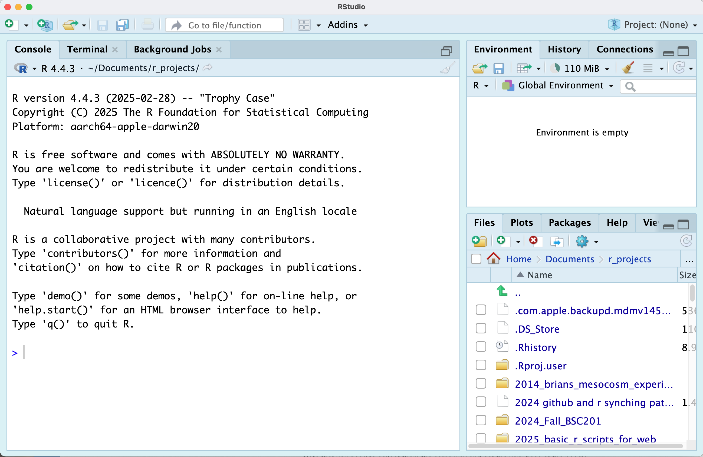
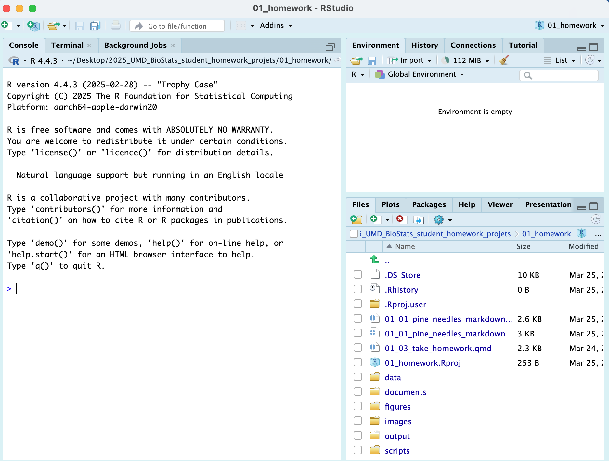
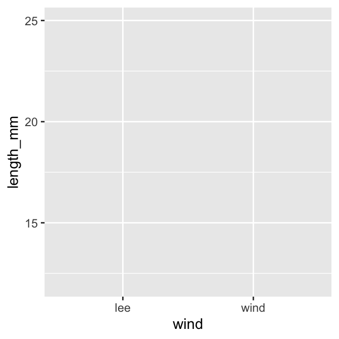
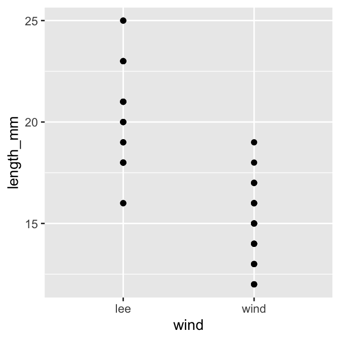
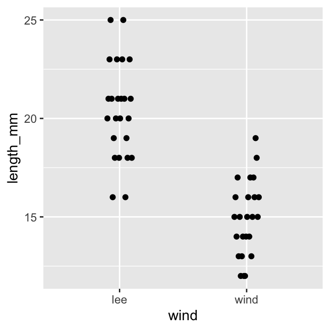
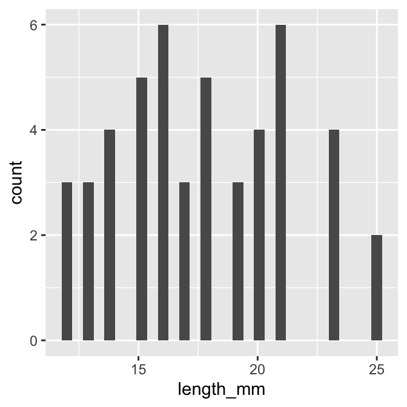
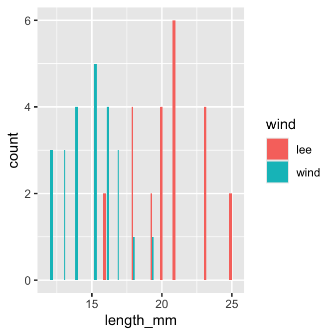
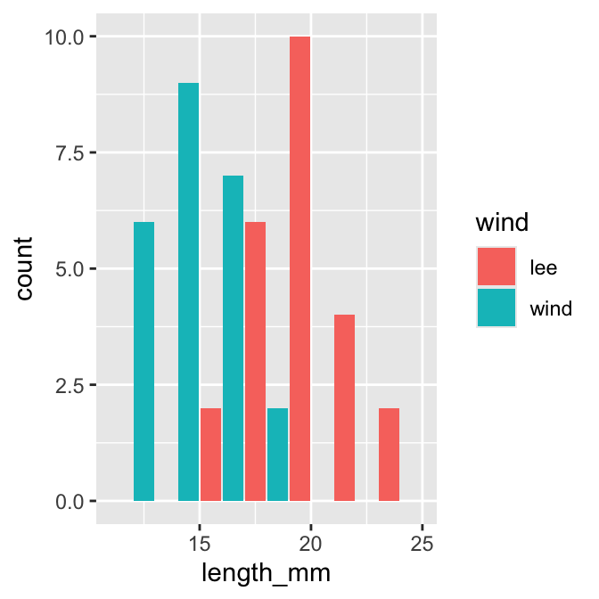
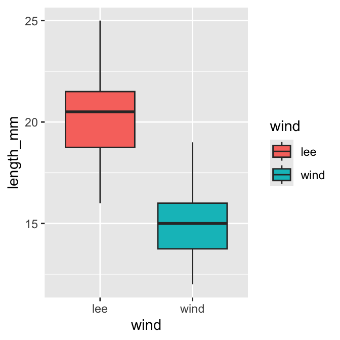

---
metadata-files:
  - ../../_templates/activities.yml
format:
  html: default
  docx: default
---

# In class activity 1:

# Objectives and goals

-   Can you identify inductive or deductive reasoning?
-   How do you formulate a question?
-   Can you develop a prediction?
-   What are hypotheses - Null and Alternate?
-   What are dependent and independent variables?
-   What is a replicate and how do we sample?
-   How do we organize data?
-   How do we graph the data we gather?

# Schedule:

-   Head to the field outside of Swenson and go to pine stand
-   Discuss approaches to science and how to make observations
    -   Point out the North versus South side of a pine tree and how
        weather might affect the needled dimensions
-   Return to laboratory and measure pine needles
-   Organize data
-   Make graphs to see what data looks like visually

# Inductive reasoning approach

### If you were a person that sees the world through an inductive reasoning approach what would you do right now with the conifers and the effect of sun?

-   Answer
    -   start measuring needles around the tree
        -   make a generalization about needles as affected by weather
            or wind or sun
-   make a generalization about the species of pine trees and needle
    lengths as a response to the treatment

# Deductive reasoning approach

### If you were a person that sees the world through a deductive reasoning approach what would you do right now?

-   Answer
    -   note that there seems to be differences in pine needles on the
        different sides of trees
    -   make generalization that weather or sun affects pine needle
        length
    -   start measuring pine needles
    -   test if the pattern exists or not
-   Then maybe test trees in sheltered versus sheltered areas or shaded
    and sunny areas

# How does pine needle length vary

-   windward or sunny side of trees differ from the leeward or shady
    side of trees
-   what might we expect if there is and effect of the treatment

### No effect of sun or wind

-   Then there would be no difference in needle length
-   This is called the Null Hypothesis and is denoted Ho

### There is a difference in needle length

-   Could be shorter or longer - no specific pattern
-   Then we reject the idea above that there is no effect of the
    treatment
-   Accept the idea that there is a difference
-   This is called the Alternate Hypothesis or Ha
-   Note -- we do not say if it is shorter or longer -- this then
    becomes a **prediction**

# How would we collect data to test this?

### Can we collect needles from one tree tree and do the test?

-   NO -- this is because this tree might have short needles — bad joke
    hidden...
-   This is called **pseudoreplication see Hurlbert**

### We have to collect needles from many trees

-   The trees are the unit of replication here
-   We can collect needles from the same tree and take the average of
    them and use that as a single replicate for each side

### We also need to be sure our sample is randomly selected

-   why do we need to randomize sampling?

-   how can we randomize our sampling?

# What are the different variables?

-   We are working with variables
    -   north south east or west
    -   lee and windward sides
    -   sunny or shady
    -   species
    -   pine needle length
-   what is a dependent variable?
-   what is an independent variable?

# So each group go out and collect needles

-   1 branch or 20 needles from the sunny or windward side
-   1 branch or 20 needles from the shady or leeward side
-   Note that you need to collect them the same way and get the very
    base of the needle...
-   We will also use the inner 3 inches from the base of the branch

### When done gather back here and we will head back to the laboratory.

# Back in the laboratory

### So before we begin -- what are the steps we need to decide?

Note - setting up how you work with data and what you call each variable
will save you TONS of time later on. This is called controlled
vocabulary

1.  How we measure these using calipers?
    a.  Are there any things we need to pay attention to?
2.  What are the variables we have identified?
    a.  **Note: is Date the same thing as date?**
    b.  date
    c.  group
    d.  n_s -- north or south or even the degrees
    e.  wind or sun - windward or leeward as it may change
    f.  tree_no -- group \# may work
    g.  Pine needle length -- what do we call it?
        i.  What is the name we use?
        ii. What are the units?
        iii. Can we name the variable for both?
3.  What is meta data?
    a.  List of variables, description, units, possible values
    b.  Saved as an associated text file
4.  OK so take the measures and re-code in the shared Google spreadsheet

# One last thing -- Lets Estimate Error

-   Select 3 pine needles and number 1, 2, 3 and put at the front of the
    room
-   Each person needs to measure the 3 needles and record on paper
-   Enter name
-   Enter pine needle number
-   Enter the length as mm

### When done each person can export the shared google drive as a CSV or comma delimited file and as an XLSX or excel file

# Now Lets Open R Studio

1.  Download the compressed file pine_needles.zip
2.  Unzip this file in both windows and mac as it wont work
3.  Open the folder and look at what is in there
4.  Copy the files you have entered data into the data sub-directory
    with the same names as you see...
5.  Then open RStudio
6.  The window will look below -- what is all this stuff...

# RStudio

{width="551"}

**Important parts of the screen**

-   Console -- this is really R running and R studio is the interface
-   Terminal -- this is the back end of your computer without windows
-   Environment -- this is where things in memory are stored like
    -   Dataframes
    -   Graphs Files -- these are the files that are available... this
        now is your home directory Plots -- the plots you create
-   Help -- some form of help for you

More later - In the files you will see folders and you can click on them
to see what is in there...

**you can also click the dots next to the green arrow to go back up a
level** {width="35" height="18"}

# Now lets open the project that I created

1.  click `file` - `open project` and select the `01_homework.Rproj`
    file
2.  your screen will now change as RStudio knows where home is

{width="550"}

3.  Note that in the upper right you will see `01_homework` so you know
    you are in the right spot

# How does RStudio work with R - `<-`

We need to cover a bit of syntax in R

### in the console

-   r is case sensitive so X is different than x
-   the `<-` is the assignment operator
-   it stores whatever is on the right in a name that you have on the
    right
-   try typing `x<-7` then `return`
    -   this will store a new object in the environment that is an x and
        in that is 7
-   now type x and hit `return` and see what happens
    -   a 7 will appear
-   now type y \<- 2 and enter
-   now type x \* y and `return`
    -   you should see that it multiplied the x by the y variable and
        you get 14
-   THIS WILL GET SERIOUSLY OLD IF YOU HAVE TO RETYPE ALL THE TIME!!!
-   So we make command files or scripts

### now in a r script file

-   lets click `file` and `New File ...` and `R file`
-   this will open a new script file that you can write code and run it
    with `CTRL` and `return` or on mac `command` + `return`
-   r is case sensitive so X is different than x
-   the `<-` is the assignment operator
-   it stores whatever is on the right in a name that you have on the
    right
-   try typing `x<-7` then `return`
    -   this will store a new object in the environment that is an x and
        in that is 7
-   now type x and hit `command` + `return` and see what happens in the
    console
    -   a 7 will appear
-   now type y \<- 2 and enter
-   now type x \* y and `command` + `return`
    -   you should see that it multiplied the x by the y variable and
        you get 14
-   This is one version - the other is a quarto markdown file we will
    see next

### Quarto Files - how we will roll in the class

-   Now click the `scripts folder` where the scripts are stored
-   Open - `01_plain_r_script_for_pine_needles_blank.R` by clicking on
    it
-   Then follow along...
    -   one tricky note - when you open these they think this is home
        and all files are here or under them

# How does RStudio work with R

-   we could do all of our work with R or base R
-   people have written a lot of helper functions called libraries
    stored in packages
-   we use these a lot of these
-   you install the package one time - a lot like buying a light bulb
    and screwing it in... you do that once
-   then you can load the libraries stored in the package each time you
    use a library
-   lets see how it works in a script I have made

# Here is the script I provided to work on:

### I have provided a lot of details here so you can see what is going on

You should have installed packages which is done below The `#` is a
comment and allows you to write whatever you want and it won' run


::: {.cell}

```{.r .cell-code}
# install packages -----
# install.packages("quarto")
# install.packages("readxl")
# install.packages("tidyverse")
```
:::


Each script you run from then on you will load the libraries from within
the package.


::: {.cell}

```{.r .cell-code}
# load this library one time only
# library(quarto)

# Load the libraries ----
library(readxl) # allows to read in excel files
library(tidyverse) # provides utilities seen in console
```

::: {.cell-output .cell-output-stderr}

```
── Attaching core tidyverse packages ──────────────────────── tidyverse 2.0.0 ──
✔ dplyr     1.2.1     ✔ readr     2.2.0
✔ forcats   1.0.1     ✔ stringr   1.6.0
✔ ggplot2   4.0.3     ✔ tibble    3.3.1
✔ lubridate 1.9.5     ✔ tidyr     1.3.2
✔ purrr     1.2.2     
── Conflicts ────────────────────────────────────────── tidyverse_conflicts() ──
✖ dplyr::filter() masks stats::filter()
✖ dplyr::lag()    masks stats::lag()
ℹ Use the conflicted package (<http://conflicted.r-lib.org/>) to force all conflicts to become errors
```


:::
:::


# Loading files

Now like we did before with x and y we will do this with a spreadsheet
from a CSV file or excel file


::: {.cell}

```{.r .cell-code}
#| # load file -----
# this file is in the  data sub directory
# below put cursor between "" and click tab
# allows to to select the directory 
# tab again and select the file
p_df <- read_csv("data/pine_needles.csv")
```

::: {.cell-output .cell-output-stderr}

```
Rows: 48 Columns: 6
── Column specification ────────────────────────────────────────────────────────
Delimiter: ","
chr (4): date, group, n_s, wind
dbl (2): tree_no, length_mm

ℹ Use `spec()` to retrieve the full column specification for this data.
ℹ Specify the column types or set `show_col_types = FALSE` to quiet this message.
```


:::

```{.r .cell-code}
# dataframe stored by "<-" reading in csv file in quotes
```
:::


This will import the excel file


::: {.cell}

```{.r .cell-code}
# this will allow you to read in the excel file
p_xl_df <- read_excel("data/pine_needles.xlsx")
```
:::


# Visualize data

Use GGPlot to graph the data

the line below loads the dataframe and what the aesthetics are

it does not tell ggplot how to add a layer of the geometry to show the
data

## Tapestry Plot ------


::: {.cell}

```{.r .cell-code}
ggplot(data = p_df, aes(x=wind, y=length_mm))
```

::: {.cell-output-display}
{width=336}
:::
:::


## XY Plot -----

notice the points are layered on top but some overlap


::: {.cell}

```{.r .cell-code}
ggplot(data = p_df, aes(x=wind, y=length_mm)) + 
  geom_point() 
```

::: {.cell-output-display}
{width=336}
:::
:::


## XY Plot with dodged points ------


::: {.cell}

```{.r .cell-code}
ggplot(data = p_df, aes(x=wind, y=length_mm)) + 
  geom_point(position = position_dodge2(width=0.2) )
```

::: {.cell-output-display}
{width=336}
:::

```{.r .cell-code}
# this dodges the points # position_dodge2 or can use position_dodge depending on grouping
```
:::


What are the other ways to display the data?

## Histogram -----


::: {.cell}

```{.r .cell-code}
ggplot(data = p_df, aes(x=length_mm)) + 
  geom_histogram()
```

::: {.cell-output .cell-output-stderr}

```
`stat_bin()` using `bins = 30`. Pick better value `binwidth`.
```


:::

::: {.cell-output-display}
{width=336}
:::
:::


Note we really want to see the histograms colored by wind direction

We can map the wind aesthetic to a fill in the histogram

## Histogram Colors -----


::: {.cell}

```{.r .cell-code}
ggplot(data = p_df, aes(x=length_mm, fill = wind)) + geom_histogram( position = position_dodge2(width = 0.5))
```

::: {.cell-output .cell-output-stderr}

```
`stat_bin()` using `bins = 30`. Pick better value `binwidth`.
```


:::

::: {.cell-output-display}
{width=336}
:::
:::


## Histogram Bins -----


::: {.cell}

```{.r .cell-code}
ggplot(data = p_df, aes(x=length_mm, fill = wind)) +
  geom_histogram( binwidth = 2, 
# sets the width in units of the bins - try different nubmers
   position = position_dodge2(width = 0.5))
```

::: {.cell-output-display}
{width=336}
:::
:::


## Other Plots if time in class

## Box and Whisker Plots


::: {.cell}

```{.r .cell-code}
ggplot(data = p_df, aes(x=wind, y=length_mm, fill = wind)) + geom_boxplot()
```

::: {.cell-output-display}
{width=336}
:::
:::

