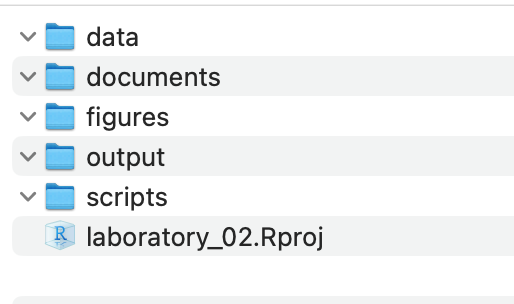
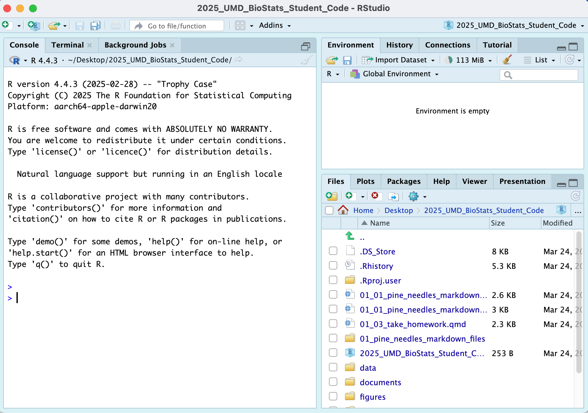
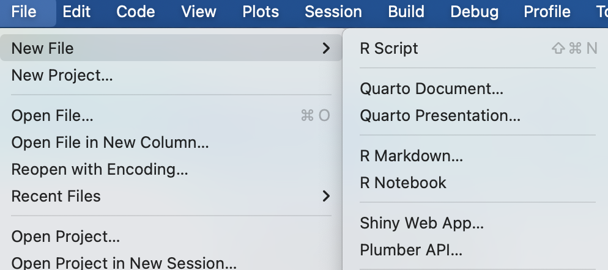
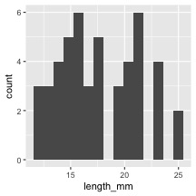
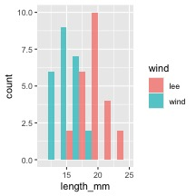
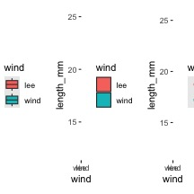
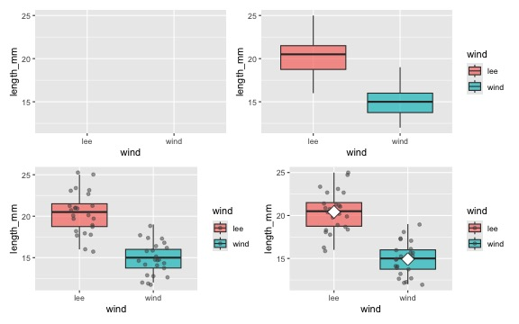
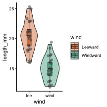
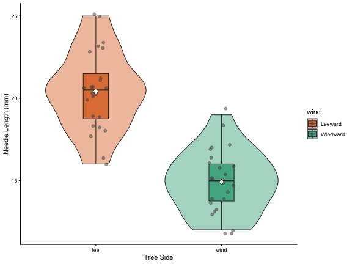
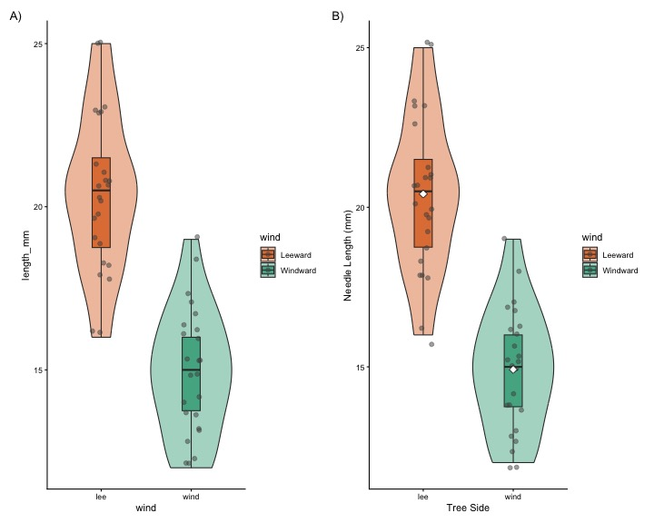

# In-class Activity 2: Data Visualization

## Recap from Activity 1

-   Collected pine needle samples from windward and leeward sides of
    trees
-   Identified independent variable (wind exposure) and dependent
    variable (needle length)
-   Measured needle lengths and recorded data
-   Created basic visualizations
-   Saved our data for further analysis

## Today's Objectives

1.  Implement data pipeline best practices
2.  Apply controlled vocabulary and naming conventions
3.  Create effective tables and visualizations
4.  Customize plots for publication quality
5.  Combine multiple plots into composite figures

# Part 1: Setting Up Your Environment

1.  What data do we have
    1.  what is the controlled vocabulary?
    2.  are there units?
2.  What is the directory structure?
3.  Do we have a metadata file?
4.  Is the data entered in a tidy format?
5.  What are we missing?

# Now lets create a new quarto file

::::: columns
::: {.column width="60%"}
-   note I usually use this sort of system in an r_projects directory
-   I have redone it for the class to organize all of the terms data
-   you should try making some of your own projects
:::

::: {.column width="40%"}
{width="190"}
:::
:::::

## In RStudio:

1.  click `file` - `open project` and select the
    `2025_UMD_BioStats_Student_Code.Rproj` file or double click on it in
    the finder or data explorer.
2.  your screen will now change as RStudio knows where home is

{width="434"}

3.  Note that in the upper right you will see
    `2025_UMD_BioStats_Student_Code` so you know you are in the right
    spot

4.  Now click File - New File - Quarto File

{width="414"}

5.  Create a file that starts with `02_` and then something that will
    help you know what is going on like `02_class_activity_in_class.qmd`

6.  Now this file thinks this is home.

7.  So I usually copy stuff for the header from another file as its just
    too hard to remember all this...

``` r
---
title: "Title of your file" # Title of the file
author: "Your Name" # who you are
metadata-files:
  - ../../_templates/lectures.yml
metadata-files:
  - _templates/activities.yml
format:
  html:
    freeze: false
    toc: false
    output-file: "02_02_class_activity.html"
    default: true
    embed-resources: true
    self-contained: true
    css: css/activity.css
    default: true
    toc: false
    toc-depth: 3
    number-sections: false
    highlight-style: github
    reference-doc: ms_templates/custom-reference.docx
    css: msword.css
    embed-resources: true
---
```

## Exercise 1: Now to load the libraries


::: {.cell}

```{.r .cell-code}
# install packages -----
# install.packages("readxl")
# install.packages("tidyverse")

# # we will install a few new libraries
# install.packages("skimr")
```
:::


Each script you run from then on you will load the libraries from within
the package.


::: {.cell}

```{.r .cell-code}
# Load the libraries ----
library(readxl) # allows to read in excel files
library(tidyverse) # provides utilities seen in console
```

::: {.cell-output .cell-output-stderr}

```
── Attaching core tidyverse packages ──────────────────────── tidyverse 2.0.0 ──
✔ dplyr     1.2.1     ✔ readr     2.2.0
✔ forcats   1.0.1     ✔ stringr   1.6.0
✔ ggplot2   4.0.3     ✔ tibble    3.3.1
✔ lubridate 1.9.5     ✔ tidyr     1.3.2
✔ purrr     1.2.2     
── Conflicts ────────────────────────────────────────── tidyverse_conflicts() ──
✖ dplyr::filter() masks stats::filter()
✖ dplyr::lag()    masks stats::lag()
ℹ Use the conflicted package (<http://conflicted.r-lib.org/>) to force all conflicts to become errors
```


:::

```{.r .cell-code}
library(skimr) # provide summary stats
library(janitor) # it cleans ; )
```

::: {.cell-output .cell-output-stderr}

```

Attaching package: 'janitor'

The following objects are masked from 'package:stats':

    chisq.test, fisher.test
```


:::

```{.r .cell-code}
library(patchwork)
```
:::


## Exercise 2: Loading and Examining Data

Now like we did before with x and y we will do this with a spreadsheet
from a CSV file or excel file

We are going to work with the same data we did in the last class.


::: {.cell}

```{.r .cell-code}
# load file -----
# this file is in the  data sub directory
# below put cursor between "" and click tab
# allows to to select the directory 
# tab again and select the file
p_df <- read_csv("data/pine_needles.csv") # reads in csv file
```

::: {.cell-output .cell-output-stderr}

```
Rows: 48 Columns: 6
── Column specification ────────────────────────────────────────────────────────
Delimiter: ","
chr (4): date, group, n_s, wind
dbl (2): tree_no, length_mm

ℹ Use `spec()` to retrieve the full column specification for this data.
ℹ Specify the column types or set `show_col_types = FALSE` to quiet this message.
```


:::

```{.r .cell-code}
# dataframe stored by "<-" reading in csv file in quotes
```
:::


## Exercise 3: Examining Data


::: {.cell}

```{.r .cell-code}
# Load the pine needle data
p_df <- read_csv("data/pine_needles.csv", na = "NA")
```

::: {.cell-output .cell-output-stderr}

```
Rows: 48 Columns: 6
── Column specification ────────────────────────────────────────────────────────
Delimiter: ","
chr (4): date, group, n_s, wind
dbl (2): tree_no, length_mm

ℹ Use `spec()` to retrieve the full column specification for this data.
ℹ Specify the column types or set `show_col_types = FALSE` to quiet this message.
```


:::

```{.r .cell-code}
# Examine the data structure
glimpse(p_df)
```

::: {.cell-output .cell-output-stdout}

```
Rows: 48
Columns: 6
$ date      <chr> "3/20/25", "3/20/25", "3/20/25", "3/20/25", "3/20/25", "3/20…
$ group     <chr> "cephalopods", "cephalopods", "cephalopods", "cephalopods", …
$ n_s       <chr> "n", "n", "n", "n", "n", "n", "s", "s", "s", "s", "s", "s", …
$ wind      <chr> "lee", "lee", "lee", "lee", "lee", "lee", "wind", "wind", "w…
$ tree_no   <dbl> 1, 1, 1, 1, 1, 1, 1, 1, 1, 1, 1, 1, 2, 2, 2, 2, 2, 2, 2, 2, …
$ length_mm <dbl> 20, 21, 23, 25, 21, 16, 15, 16, 14, 17, 13, 15, 19, 18, 20, …
```


:::

```{.r .cell-code}
# View the first few rows
head(p_df)
```

::: {.cell-output .cell-output-stdout}

```
# A tibble: 6 × 6
  date    group       n_s   wind  tree_no length_mm
  <chr>   <chr>       <chr> <chr>   <dbl>     <dbl>
1 3/20/25 cephalopods n     lee         1        20
2 3/20/25 cephalopods n     lee         1        21
3 3/20/25 cephalopods n     lee         1        23
4 3/20/25 cephalopods n     lee         1        25
5 3/20/25 cephalopods n     lee         1        21
6 3/20/25 cephalopods n     lee         1        16
```


:::

```{.r .cell-code}
# Get a statistical summary
summary(p_df)
```

::: {.cell-output .cell-output-stdout}

```
        date          group           n_s            wind       tree_no    
 Length   :48   Length   :48   Length   :48   Length   :48   Min.   :1.00  
 N.unique : 1   N.unique : 4   N.unique : 2   N.unique : 2   1st Qu.:1.75  
 N.blank  : 0   N.blank  : 0   N.blank  : 0   N.blank  : 0   Median :2.50  
 Min.nchar: 7   Min.nchar: 5   Min.nchar: 1   Min.nchar: 3   Mean   :2.50  
 Max.nchar: 7   Max.nchar:11   Max.nchar: 1   Max.nchar: 4   3rd Qu.:3.25  
                                                             Max.   :4.00  
   length_mm    
 Min.   :12.00  
 1st Qu.:15.00  
 Median :17.50  
 Mean   :17.67  
 3rd Qu.:20.25  
 Max.   :25.00  
```


:::
:::


### Questions to Consider:

1.  What variables are in our dataset?
2.  What are their data types?
3.  Are there any missing values?
4.  Do the variable names follow consistent conventions?
5.  How might we improve the data organization?

# Part 2: Basic Data Visualization

Let's create some simple visualizations to explore our data:

### Exercise 2: Creating a Histogram


::: {.cell}

```{.r .cell-code}
# Create a basic histogram
p_df %>%
  ggplot(aes(x = length_mm)) +
  geom_histogram(bins = 15) 
```

::: {.cell-output-display}

:::
:::


::: {.cell}

```{.r .cell-code}
# Create a histogram with color grouping
p_df %>%
  ggplot(aes(x = length_mm, fill = wind)) +
  geom_histogram(binwidth = 2, alpha = 0.7, position = "dodge") 
```

::: {.cell-output-display}

:::
:::


### Key Insights from Histograms:

The histogram helps us understand: - The overall distribution of needle
lengths - Potential differences between windward and leeward needles -
Presence of any unusual values or outliers

### Exercise 3: Creating Multiple Plot Types

Let's explore different ways to visualize the same data:


::: {.cell}

```{.r .cell-code}
# Box plot
box_plot <- p_df %>%
  ggplot(aes(x = wind, y = length_mm, fill = wind)) +
  geom_boxplot() 

# Violin plot
violin_plot <- p_df %>%
  ggplot(aes(x = wind, y = length_mm, fill = wind)) +
  geom_violin() 

# Dot plot
dot_plot <- p_df %>%
  ggplot(aes(x = wind, y = length_mm, color = wind)) +
  geom_jitter(width = 0.2, alpha = 0.7) 

# Display all plots using patchwork
box_plot + violin_plot + dot_plot
```

::: {.cell-output-display}

:::
:::


### Questions to Consider:

1.  Which plot type best reveals patterns in our data?
2.  What are the advantages and disadvantages of each plot type?
3.  How might we combine elements from different plot types?

## Part 3: Building Complex Visualizations Layer by Layer

Now let's build more sophisticated visualizations by adding layers one
at a time:

### Exercise 4: Building a Layered Plot


::: {.cell}

```{.r .cell-code}
# Start with a basic plot
p1 <- p_df %>%
  ggplot(aes(x = wind, y = length_mm, fill = wind)) 

# Add boxplot layer
p2 <- p1 +
  geom_boxplot(alpha = 0.7) 

# Add individual data points
p3 <- p2 +
  geom_jitter(width = 0.2, alpha = 0.5, color = "gray30") 

# Add mean indicators
p4 <- p3 +
  stat_summary(fun = mean, geom = "point", shape = 23, size = 5, fill = "white") 

# Create a 2x2 grid of the progressive plot building
(p1 | p2) / (p3 | p4)
```

::: {.cell-output-display}

:::
:::


### Discussion Points:

-   How does each layer contribute to the story our data is telling?
-   Why might we want to show individual data points alongside summary
    statistics?
-   How does transparency (alpha) help when overlaying multiple
    elements?

## Part 4: Customizing Plots for Publication

### Exercise 5: Adding customization


::: {.cell}

```{.r .cell-code}
# Create a fully customized plot
color_plot <- p_df %>%
  ggplot(aes(x = wind, y = length_mm, fill = wind)) +
  # Add violin plots for distribution
  geom_violin(alpha = 0.4) +
  # Add boxplots for key statistics
  geom_boxplot(width = 0.2, alpha = 0.7, outlier.shape = NA) +
  # Add individual data points
  geom_jitter(width = 0.1, alpha = 0.5, color = "gray30", size = 2) +
  # Add mean points
  # Customize colors with a colorblind-friendly palette
  scale_fill_manual(
    values = c(
      "wind" = "#1b9e77",
       "lee" = "#d95f02"
      ),
    labels = c(
      "wind" = "Windward", 
      "lee" = "Leeward"
      )) +
  # Apply a clean theme
  theme_classic() 


# Display the publication-ready plot
color_plot
```

::: {.cell-output-display}

:::
:::


Let's create a publication-quality figure by customizing colors, labels,
and themes:

### Exercise 6: Creating a Publication-Ready Plot


::: {.cell}

```{.r .cell-code}
# Create a fully customized plot
publication_plot <- p_df %>%
  ggplot(aes(x = wind, y = length_mm, fill = wind)) +
  # Add violin plots for distribution
  geom_violin(alpha = 0.4) +
  # Add boxplots for key statistics
  geom_boxplot(width = 0.2, alpha = 0.7, outlier.shape = NA) +
  # Add individual data points
  geom_jitter(width = 0.1, alpha = 0.5, color = "gray30", size = 2) +
  # Add mean points
  stat_summary(fun = mean, geom = "point", shape = 23, size = 3, fill = "white") +
  # Add informative labels
  labs(
    x = "Tree Side", 
    y = "Needle Length (mm)"
  ) +
  # Customize colors with a colorblind-friendly palette
  scale_fill_manual(
    values = c("wind" = "#1b9e77", "lee" = "#d95f02"),
    labels = c("wind" = "Windward", "lee" = "Leeward")
  ) +
  # Apply a clean theme
  theme_classic() 
  

# Display the publication-ready plot
publication_plot
```

::: {.cell-output-display}

:::
:::


### Customization Elements:

1.  **Plot Elements**:
    -   Violin plots to show distribution
    -   Boxplots to show quartiles and median
    -   Individual points for transparency
    -   Mean indicators for central tendency
2.  **Visual Design**:
    -   Colorblind-friendly color palette
    -   Thoughtful use of transparency
    -   Clear, informative title and subtitle
    -   Professional typography and spacing
3.  **Accessibility Considerations**:
    -   Sufficient contrast
    -   Redundant encoding (position and color)
    -   Clear labels with units

## Part 5: Creating Complex Multi-Panel Figures

Finally, let's create a publication-ready multi-panel figure:


::: {.cell}

```{.r .cell-code}
color_plot +
  
  publication_plot   + 
  plot_layout(ncol = 2) + 
  plot_annotation(tag_levels = "A", tag_suffix = ")")
```

::: {.cell-output-display}

:::
:::


``` r
# we can add this to remove things
# why do this?
# + theme(
#     axis.text.y = element_blank(),  # Removes x-axis labels
#     axis.title.y = element_blank()  # Removes x-axis title
```

## Summary and Key Takeaways

In this activity, we've learned how to:

1.  **Load and examine data** properly
2.  **Create basic visualizations** to explore patterns
3.  **Build complex plots layer by layer** using ggplot2's grammar
4.  **Customize plots** for clear communication and visual appeal
5.  **Add statistical information** to support data interpretation
6.  **Combine multiple plots** into publication-ready figures

### Best Practices for Data Visualization:

1.  **Start simple**, then add complexity as needed
2.  **Focus on the story** your data is telling
3.  **Use appropriate plot types** for your data structure
4.  **Minimize chart junk** and maximize data-ink ratio
5.  **Create clear, informative labels**
6.  **Use color purposefully** and with accessibility in mind
7.  **Include both individual data points and summary statistics** when
    possible
8.  **Consider your audience** when designing visualizations
