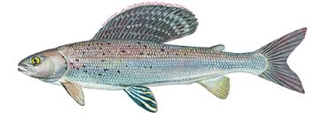
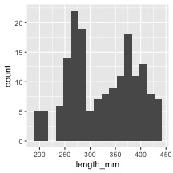
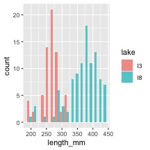
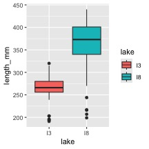
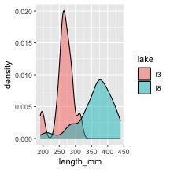

# In class activity 3:

# 

# What did we do last time?

-   Implement data pipeline best practices

-   Apply controlled vocabulary and naming conventions

-   Create effective visualizations

-   Customize plots for publication quality

-   Combine multiple plots into composite figures

    ``` r
    ggplot(name_df, aes(x_variable, y_variable, color = categorical_variable)) +
    #      dataframe, aesthetics(x and y variables, mapping of color or fill or shape) + 
      geom_point() +
    # this it the geometry you want and can add more layers like
      geom_line()
    ```

-   What questions do you have and what is unclear

-   What did not work so far when you started the homework?

# Objectives and goals for today

::::: columns
::: {.column width="60%"}
## Today's Objectives

1.  Implement descriptive statistics in R
2.  Calculate measures of central tendency and spread
3.  Compare distributions of data from different groups
4.  Create effective visualizations of descriptive statistics
5.  Interpret the meaning of these statistics in a biological context
:::

::: {.column width="40%"}

:::
:::::

# Part 1: Setting Up Your Environment

First, let's load the necessary packages and import our data:


::: {.cell}

```{.r .cell-code}
# Load required packages
library(moments)      # For calculating skewness and kurtosis
library(skimr)        # for summary stats
library(tidyverse)    # For data wrangling and visualization
```

::: {.cell-output .cell-output-stderr}

```
── Attaching core tidyverse packages ──────────────────────── tidyverse 2.0.0 ──
✔ dplyr     1.2.1     ✔ readr     2.2.0
✔ forcats   1.0.1     ✔ stringr   1.6.0
✔ ggplot2   4.0.3     ✔ tibble    3.3.1
✔ lubridate 1.9.5     ✔ tidyr     1.3.2
✔ purrr     1.2.2     
── Conflicts ────────────────────────────────────────── tidyverse_conflicts() ──
✖ dplyr::filter() masks stats::filter()
✖ dplyr::lag()    masks stats::lag()
ℹ Use the conflicted package (<http://conflicted.r-lib.org/>) to force all conflicts to become errors
```


:::
:::


## Getting the data

::: callout-tip
## Practice Exercise 1: Loading and Examining the Grayling Data

We'll be working with data on arctic grayling fish from two different
lakes (I3 and I8).


::: {.cell}

```{.r .cell-code}
# Write your code here to read in the file
# How do you examine the data - what are the ways you think and lets try it!

# Load the grayling data
g_df <- read_csv("data/gray_I3_I8.csv")
```

::: {.cell-output .cell-output-stderr}

```
Rows: 168 Columns: 5
── Column specification ────────────────────────────────────────────────────────
Delimiter: ","
chr (2): lake, species
dbl (3): site, length_mm, mass_g

ℹ Use `spec()` to retrieve the full column specification for this data.
ℹ Specify the column types or set `show_col_types = FALSE` to quiet this message.
```


:::

```{.r .cell-code}
# View the first few rows
head(g_df)
```

::: {.cell-output .cell-output-stdout}

```
# A tibble: 6 × 5
   site lake  species         length_mm mass_g
  <dbl> <chr> <chr>               <dbl>  <dbl>
1   113 I3    arctic grayling       266    135
2   113 I3    arctic grayling       290    185
3   113 I3    arctic grayling       262    145
4   113 I3    arctic grayling       275    160
5   113 I3    arctic grayling       240    105
6   113 I3    arctic grayling       265    145
```


:::
:::

:::

# Questions to Consider:

1.  What variables are in our dataset?
2.  What are their data types?
3.  How many fish were sampled from each lake?
4.  Are there any missing values?
5.  What is the distribution of data?

### Base R way of getting some summary stats


::: {.cell}

```{.r .cell-code}
# How many fish do we have from each lake?
summary(g_df) 
```

::: {.cell-output .cell-output-stdout}

```
      site            lake          species      length_mm         mass_g     
 Min.   :113   Length   :168   Length   :168   Min.   :191.0   Min.   : 53.0  
 1st Qu.:113   N.unique :  2   N.unique :  1   1st Qu.:270.8   1st Qu.:151.2  
 Median :118   N.blank  :  0   N.blank  :  0   Median :324.5   Median :340.0  
 Mean   :116   Min.nchar:  2   Min.nchar: 15   Mean   :324.5   Mean   :351.2  
 3rd Qu.:118   Max.nchar:  2   Max.nchar: 15   3rd Qu.:377.0   3rd Qu.:519.5  
 Max.   :118                                   Max.   :440.0   Max.   :889.0  
                                                               NAs    :2      
```


:::
:::


### Skimnr way of seeing summary stats


::: {.cell}

```{.r .cell-code}
g_df %>% 
  group_by(lake) %>% 
  skim()
```

::: {.cell-output-display}

Table: Data summary

|                         |           |
|:------------------------|:----------|
|Name                     |Piped data |
|Number of rows           |168        |
|Number of columns        |5          |
|_______________________  |           |
|Column type frequency:   |           |
|character                |1          |
|numeric                  |3          |
|________________________ |           |
|Group variables          |lake       |


**Variable type: character**

|skim_variable |lake | n_missing| complete_rate| min| max| empty| n_unique| whitespace|
|:-------------|:----|---------:|-------------:|---:|---:|-----:|--------:|----------:|
|species       |I3   |         0|             1|  15|  15|     0|        1|          0|
|species       |I8   |         0|             1|  15|  15|     0|        1|          0|


**Variable type: numeric**

|skim_variable |lake | n_missing| complete_rate|   mean|     sd|  p0|    p25| p50|   p75| p100|hist  |
|:-------------|:----|---------:|-------------:|------:|------:|---:|------:|---:|-----:|----:|:-----|
|site          |I3   |         0|          1.00| 113.00|   0.00| 113| 113.00| 113| 113.0|  113|▁▁▇▁▁ |
|site          |I8   |         0|          1.00| 118.00|   0.00| 118| 118.00| 118| 118.0|  118|▁▁▇▁▁ |
|length_mm     |I3   |         0|          1.00| 265.61|  28.30| 191| 256.00| 266| 280.0|  320|▂▁▇▇▂ |
|length_mm     |I8   |         0|          1.00| 362.60|  52.34| 199| 340.00| 373| 401.0|  440|▁▂▃▇▆ |
|mass_g        |I3   |         0|          1.00| 150.50|  42.22|  53| 130.75| 147| 177.5|  260|▂▅▇▃▁ |
|mass_g        |I8   |         2|          0.98| 483.71| 176.48|  68| 369.00| 490| 615.5|  889|▂▃▇▆▂ |


:::
:::


# Part 2: Visualizing Distributions

Visualizations can help us better understand the descriptive statistics
we've calculated.

::: callout-tip
### Exercise 1: Creating Histograms

One of the best ways to look at data is a histogram - and we will do it
again


::: {.cell}

```{.r .cell-code}
# Create a histogram of all fish lengths
g_df %>% ggplot(aes(x = length_mm)) +
  geom_histogram(binwidth = 15) 
```

::: {.cell-output-display}

:::
:::

:::

### 


::: {.cell}

```{.r .cell-code}
# Create histograms by lake
g_df  %>% ggplot(aes(x = length_mm, fill = lake)) +
  geom_histogram(binwidth = 15, position = "dodge", alpha = 0.7) 
```

::: {.cell-output-display}

:::
:::


::: callout-tip
### Exercise 2: Creating Box Plots

Personally I like box plots


::: {.cell}

```{.r .cell-code}
# Create a box plot comparing fish lengths by lake
# Create a box plot comparing fish lengths by lake
g_df  %>%  ggplot( aes(x = lake, y = length_mm, fill = lake)) +
  geom_boxplot() 
```

::: {.cell-output-display}

:::
:::

:::

### 

::: callout-tip
### Exercise 3: Creating Density Plots

Now these will be really important later on


::: {.cell}

```{.r .cell-code}
## Create density plots
g_df  %>%  ggplot(aes(x = length_mm, fill = lake)) +
  geom_density(alpha = 0.5)
```

::: {.cell-output-display}

:::
:::

:::

### 

# Part 2: Calculating Descriptive Statistics

## Let's calculate various descriptive statistics for our data:

## 

::: callout-tip
## Practice Exercise 4: Measures of Central Tendency


::: {.cell}

```{.r .cell-code}
# Calculate the mean and median fish length
mean(g_df$length_mm)
```

::: {.cell-output .cell-output-stdout}

```
[1] 324.494
```


:::

```{.r .cell-code}
median(g_df$length_mm)
```

::: {.cell-output .cell-output-stdout}

```
[1] 324.5
```


:::
:::

:::


::: {.cell}

```{.r .cell-code}
# Calculate mean and median by lake
g_df %>%
  group_by(lake) %>%
  summarise(
    mean_length = mean(length_mm),
    median_length = median(length_mm)
  ) 
```

::: {.cell-output .cell-output-stdout}

```
# A tibble: 2 × 3
  lake  mean_length median_length
  <chr>       <dbl>         <dbl>
1 I3           266.           266
2 I8           363.           373
```


:::
:::


## Summarizing data - two ways

lets say we want to summarize the data and need to get n, means,
standard deviation, standard error

We could do the following - if we had missing cells the code below would
give an error


::: {.cell}

```{.r .cell-code}
mean(g_df$length_mm) 
```

::: {.cell-output .cell-output-stdout}

```
[1] 324.494
```


:::
:::


::: {.cell}

```{.r .cell-code}
mean(g_df$length_mm, na.rm = TRUE) # removes missing values
```

::: {.cell-output .cell-output-stdout}

```
[1] 324.494
```


:::
:::


::: {.cell}

```{.r .cell-code}
length(g_df$length_mm)
```

::: {.cell-output .cell-output-stdout}

```
[1] 168
```


:::
:::


-   **the length counts missing and non-missing data**

-   however this would get old if we had to do this for everything and
    then to do it for the different groupings

## We need to learn to pipe

### passes things from the dataframe to a command and so on...

-   the dataframe –\> pipe command that feed the dataframe into –\> next
    command


::: {.cell}

```{.r .cell-code}
g_df %>% 
  summarize(mean_length = mean(length_mm, na.rm = TRUE))
```

::: {.cell-output .cell-output-stdout}

```
# A tibble: 1 × 1
  mean_length
        <dbl>
1        324.
```


:::
:::


## What is cool is we can do a lot of different things now


::: {.cell}

```{.r .cell-code}
g_df %>% 
  summarize(
    mean_length = mean(length_mm, na.rm = TRUE),
    sd_length = sd(length_mm, na.rm = TRUE),
    n_length = n())
```

::: {.cell-output .cell-output-stdout}

```
# A tibble: 1 × 3
  mean_length sd_length n_length
        <dbl>     <dbl>    <int>
1        324.      65.0      168
```


:::
:::


## Super cool code in case there are missing values


::: {.cell}

```{.r .cell-code}
g_df %>% 
  summarize(
    mean_length = mean(length_mm, na.rm = TRUE),
    sd_length = sd(length_mm, na.rm = TRUE),
    n_length = sum(!is.na(length_mm)))
```

::: {.cell-output .cell-output-stdout}

```
# A tibble: 1 × 3
  mean_length sd_length n_length
        <dbl>     <dbl>    <int>
1        324.      65.0      168
```


:::
:::


# Now for Spread...

::: callout-tip
## Practice Exercise 5: Measures of Spread


::: {.cell}

```{.r .cell-code}
# Write your code here to read in the file
# Calculate standard deviation and variance
mean_length <- mean(g_df$length_mm, na.rm=TRUE)
sd_length <- sd(g_df$length_mm)
var_length <- var(g_df$length_mm)
mean_length
```

::: {.cell-output .cell-output-stdout}

```
[1] 324.494
```


:::

```{.r .cell-code}
sd_length
```

::: {.cell-output .cell-output-stdout}

```
[1] 65.00659
```


:::

```{.r .cell-code}
var_length
```

::: {.cell-output .cell-output-stdout}

```
[1] 4225.856
```


:::
:::

:::

::: callout-tip
## Exercise 6: Calculate Quartiles and Percentiles


::: {.cell}

```{.r .cell-code}
# Calculate quartiles for overall data
quartiles <- quantile(g_df$length_mm, probs = c(0.25, 0.5, 0.75))
quartiles
```

::: {.cell-output .cell-output-stdout}

```
   25%    50%    75% 
270.75 324.50 377.00 
```


:::

```{.r .cell-code}
# Calculate a more comprehensive set of percentiles
percentiles <- quantile(g_df$length_mm, 
                        probs = c(0.1, 0.25, 0.5, 0.75, 0.9))
percentiles
```

::: {.cell-output .cell-output-stdout}

```
   10%    25%    50%    75%    90% 
251.10 270.75 324.50 377.00 408.60 
```


:::
:::

:::

### Note you could add a box plot by lake to see this if you wanted

::: callout-tip
### Exercise 7: Calculate the Coefficient of Variation

The coefficient of variation (CV) is the standard deviation expressed as
a percentage of the mean:

$$CV = \frac{s}{\bar{Y}} \times 100\%$$


::: {.cell}

```{.r .cell-code}
# Calculate coefficient of variation
sd_length / mean_length * 100
```

::: {.cell-output .cell-output-stdout}

```
[1] 20.03321
```


:::
:::

:::


::: {.cell}

```{.r .cell-code}
# Calculate by lake
g_df %>%
  group_by(lake) %>%
  summarise(
    mean_length = mean(length_mm),
    sd_length = sd(length_mm),
    cv_length = sd_length / mean_length * 100
  ) 
```

::: {.cell-output .cell-output-stdout}

```
# A tibble: 2 × 4
  lake  mean_length sd_length cv_length
  <chr>       <dbl>     <dbl>     <dbl>
1 I3           266.      28.3      10.7
2 I8           363.      52.3      14.4
```


:::
:::


### Questions to Consider:

1.  How do the means and medians compare within each lake? What might
    this tell you about the distribution?
2.  Which lake has more variable fish lengths? How can you tell?
3.  Why might the coefficient of variation be useful when comparing
    variability between different measurements (e.g., length vs. mass)?

### Questions to Consider:

1.  Which visualization best shows the differences in fish lengths
    between lakes?
2.  What can you learn from the violin plots that might not be apparent
    from the box plots?
3.  How would you interpret the cumulative frequency distribution?
4.  What patterns or insights can you identify from these
    visualizations?

## Part 4: Interpreting the Results

Based on our analysis, we can make the following observations:

1.  **Lake Differences**: Fish from Lake I8 are generally larger than
    those from Lake I3, both in length and mass.

2.  **Variability**: Lake I8 shows greater variability in fish lengths
    and masses than Lake I3, as indicated by higher standard deviations
    and IQRs.

3.  **Distribution Shape**:

    -   Lake I3 fish lengths are more symmetrically distributed.

    -   Lake I8 fish lengths show a slight negative skew, suggesting a
        few smaller fish pulling the distribution to the left.
