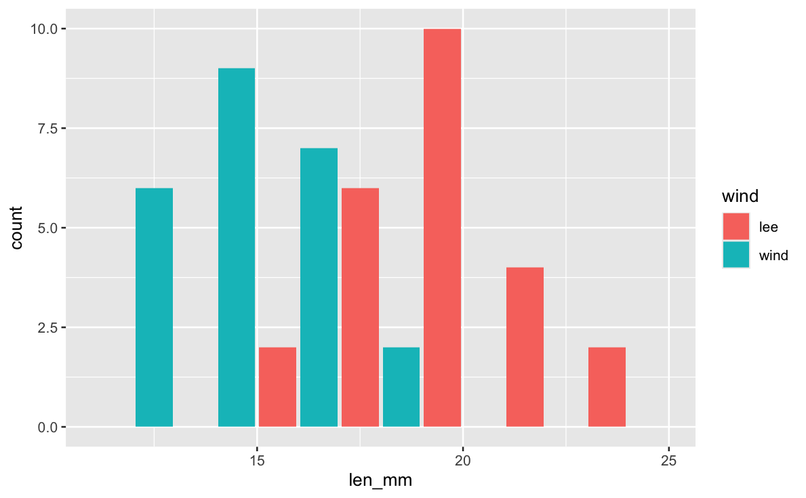
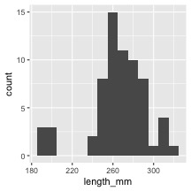
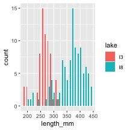
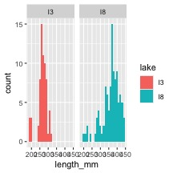
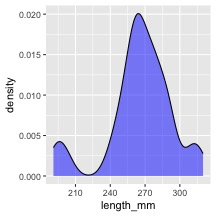
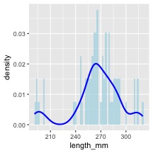
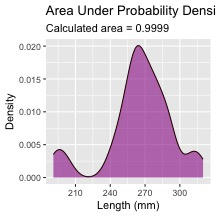
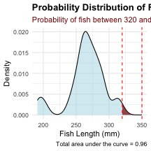
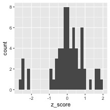

# In class activity 4:

## What did we do last time in activity 3?

-   Setting up a project and variable names and code names
-   How to use the pipe command %\>%
-   How to create descriptive statistics of a sample

``` r
p_df %>% 
  summarize(
    mean_length = mean(length_mm, na.rm = TRUE),
    sd_length = sd(length_mm, na.rm = TRUE),
    n_length = sum(!is.na(length_mm)))
```

-   More graphs...

    ``` r
    ggplot(data = p_df, aes(x=length_mm, fill = wind)) +
      geom_histogram( binwidth = 2, 
    # sets the width in units of the bins - try different nubmers
       position = position_dodge2(width = 0.5))
    ```

    {width="455"}

-   What questions do you have and what is unclear - what did not work
    so far when you started the homework?

# Introduction

In this active learning module, we'll explore real data from fish
populations in Alaska. We'll focus on understanding:

-   How to create and interpret frequency distributions
-   How sample size affects our view of a population
-   How distributions differ among lakes

We'll use the `tidyverse` package for data manipulation and
visualization.

## Setup

First, let's load the packages we need and the dataset:


::: {.cell}

```{.r .cell-code}
# # Install the patchwork package if needed

# install.packages("patchwork")
library(patchwork)
library(skimr)
library(tidyverse)


# Read in the data file
g_df <- read_csv("data/gray_I3_I8.csv") 

i3_df <- g_df %>% filter(lake =="I3")

# Look at the first few rows
head(g_df)
```

::: {.cell-output .cell-output-stdout}

```
# A tibble: 6 × 5
   site lake  species         length_mm mass_g
  <dbl> <chr> <chr>               <dbl>  <dbl>
1   113 I3    arctic grayling       266    135
2   113 I3    arctic grayling       290    185
3   113 I3    arctic grayling       262    145
4   113 I3    arctic grayling       275    160
5   113 I3    arctic grayling       240    105
6   113 I3    arctic grayling       265    145
```


:::
:::


# Part 1: Summary Statistics - descriptive statistics


::: {.cell}

```{.r .cell-code}
# Calculate mean, standard deviation, and sample size by lake
stats_df <- g_df %>%
  group_by(lake) %>%
  summarize(
    mean_length = mean(length_mm, na.rm = TRUE),
    sd_length = sd(length_mm, na.rm = TRUE),
    se_length = sd(length_mm, na.rm = TRUE)/ sum(!is.na(length_mm))^.5,
    count = sum(!is.na(length_mm)),
    .groups = "drop"
  ) %>%
  arrange(desc(count))
stats_df
```

::: {.cell-output .cell-output-stdout}

```
# A tibble: 2 × 5
  lake  mean_length sd_length se_length count
  <chr>       <dbl>     <dbl>     <dbl> <int>
1 I8           363.      52.3      5.18   102
2 I3           266.      28.3      3.48    66
```


:::
:::


# Part 2: Creating Frequency Distributions

## Basic Histograms

A histogram shows how many observations fall into certain ranges (or
"bins").

Let's create a simple histogram of fish lengths from I3 :


::: {.cell}

```{.r .cell-code}
# Filter for I3 and create a histogram
i3_df %>%
  ggplot(aes(x = length_mm)) +
  geom_histogram(binwidth = 10) 
```

::: {.cell-output-display}

:::
:::


::: callout-tip
## Activity 1

Try changing the `binwidth` parameter to 5 and then to 1. How does the
appearance of the histogram change?


::: {.cell}

```{.r .cell-code}
# Try it here or above...
```
:::

:::

## Comparing Lakes

Now let's compare two lakes


::: {.cell}

```{.r .cell-code}
# Compare histograms from I3 I8 lakes
g_df %>%
  ggplot(aes(x = length_mm, fill = lake)) +
  geom_histogram(binwidth = 10, position = position_dodge2(width = 0.9)) 
```

::: {.cell-output-display}

:::
:::


Now let's compare two lakes side by side:


::: {.cell}

```{.r .cell-code}
# Compare histograms from lake I3 I8 
g_df %>%
  ggplot(aes(x = length_mm, fill = lake)) +
  geom_histogram(binwidth = 10) +
  facet_wrap("lake")
```

::: {.cell-output-display}

:::
:::


# Part 2: From Histograms to Density Plots

Density plots give us a smoothed version of the histogram It has the
proportion of the data under each part of the curve This sums to 1


::: {.cell}

```{.r .cell-code}
# Create a density plot
i3_df %>%
  ggplot(aes(x = length_mm)) +
  geom_density(fill = "blue", alpha = 0.5) 
```

::: {.cell-output-display}

:::
:::


We can overlay the density plot on the histogram :


::: {.cell}

```{.r .cell-code}
# Combine histogram and density plot
i3_df %>%
  ggplot(aes(x = length_mm)) +
  geom_histogram(aes(y = after_stat(density)), binwidth = 2, 
                 fill = "lightblue", alpha = 0.7) +
  geom_density(color = "blue", linewidth = 1) 
```

::: {.cell-output-display}

:::
:::


# Part 3 - area under the density curve

We could show this if we really wanted...


::: {.cell}

```{.r .cell-code}
# Function to calculate area under density curve
calculate_density_area <- function(data_vector) {
  # Remove NA values
  data_vector <- data_vector[!is.na(data_vector)]
  
  # Calculate density
  dens <- density(data_vector)
  
  # Calculate area using numeric integration (trapezoidal rule)
  # Area should be approximately 1
  dx <- diff(dens$x)
  y_avg <- (dens$y[-1] + dens$y[-length(dens$y)]) / 2
  area <- sum(dx * y_avg)
  return(area)
}

# Apply to i3 lake data
i3_data <- i3_df %>% 
  pull(length_mm)

area_value <- calculate_density_area(i3_data)

# Create plot with calculated area
i3_df %>%
  ggplot(aes(x = length_mm)) +
  geom_density(fill = "blue", alpha = 0.4) +
  geom_area(stat = "density", fill = "red", alpha = 0.3) +
  labs(title = "Area Under Probability Density Function = 1",
       subtitle = paste("Calculated area =", round(area_value, 4)),
       x = "Length (mm)",
       y = "Density")
```

::: {.cell-output-display}

:::
:::


## looking at particular areas...

This can be adapted to calculate the area of a subset of the plot

I don't expect you to know or be able to do all of this but is here to
play with the code


::: {.cell}

```{.r .cell-code}
# ------- PART 3: SET  INPUT VALUES -------
# change these values to calculate different probabilities
# For this example, let's calculate the probability of fish between 40mm and 60mm
lower_bound <- 320  # change this value
upper_bound <- 350  # change this value


# ------- PART 1: PREPARE THE DATA -------
# Filter data for just one lake to keep it simple for students
i3_fish <- i3_df %>%
  filter(!is.na(length_mm))  # Remove any missing values

# ------- PART 2: CREATE A FUNCTION TO CALCULATE PROBABILITY -------
# This function calculates the probability of finding a fish with length between
# lower_bound and upper_bound using the empirical distribution of our data
calculate_probability <- function(data_vector, lower_bound, upper_bound) {
  # First, we create a density object from our data
  dens <- density(data_vector)
  
  # Find indices of x-values that fall within our bounds
  indices <- which(dens$x >= lower_bound & dens$x <= upper_bound)
  
  # If we have no points in the range, return 0
  if(length(indices) <= 1) {
    return(0)
  }
  
  # Get x and y values within our bounds
  x_values <- dens$x[indices]
  y_values <- dens$y[indices]
  
  # Calculate the area using the trapezoidal rule
  # (average height × width) for each segment, then sum all segments
  widths <- diff(x_values)
  avg_heights <- (y_values[-1] + y_values[-length(y_values)]) / 2
  area_in_range <- sum(widths * avg_heights)
  
  # Return the calculated probability
  return(area_in_range)
}

# ------- PART 4: CALCULATE THE PROBABILITY -------
# Calculate the probability for the specified range
probability <- calculate_probability(i3_fish$length_mm, lower_bound, upper_bound)

# Calculate the total area to show that the complete distribution sums to approximately 1
total_area <- calculate_probability(i3_fish$length_mm, 
                                   min(i3_fish$length_mm),
                                   max(i3_fish$length_mm))

# ------- PART 5: CREATE THE VISUALIZATION -------
# Create density data for the highlighting
density_data <- density(i3_fish$length_mm)
density_df <- data.frame(x = density_data$x, y = density_data$y)

# Create a subset for the area of interest
highlight_df <- density_df %>%
  filter(x >= lower_bound & x <= upper_bound)

# Create the plot
ggplot(i3_fish, aes(x = length_mm)) +
  # First, plot the overall density curve in light blue
  geom_density(fill = "lightblue", alpha = 0.5) +
  
  # Then highlight our region of interest in dark red
  geom_area(data = highlight_df, aes(x = x, y = y), 
            fill = "darkred", alpha = 0.7) +
  
  # Add vertical lines to clearly mark the boundaries
  geom_vline(xintercept = lower_bound, linetype = "dashed", color = "red") +
  geom_vline(xintercept = upper_bound, linetype = "dashed", color = "red") +
  
  # Add informative labels
  labs(
    title = "Probability Distribution of Fish Lengths",
    subtitle = paste0("Probability of fish between ", lower_bound, 
                     " and ", upper_bound, " mm = ", 
                     round(probability * 100, 1), "%"),
    caption = paste("Total area under the curve =", round(total_area, 3)),
    x = "Fish Length (mm)",
    y = "Density"
  ) +
  
  # Add text annotations to explain the areas
  annotate("text", x = (lower_bound + upper_bound)/2, 
           y = max(density(i3_fish$length_mm)$y) * 0.7,
           label = paste0("Area = ", round(probability, 3)),
           color = "white", size = 4) +
  
  # Make the plot look nicer
  theme_minimal() +
  theme(
    plot.title = element_text(face = "bold"),
    plot.subtitle = element_text(color = "darkred")
  )
```

::: {.cell-output-display}

:::
:::


# Part 4: this is great but integrating area each time is a pain

Converting data to Z scores


::: {.cell}

```{.r .cell-code}
# Calculate the mean and standard deviation of fish lengths
mean_length <- mean(i3_df$length_mm, na.rm = TRUE)
sd_length <- sd(i3_df$length_mm, na.rm = TRUE)

# Calculate Z-scores for fish lengths
i3_df <- i3_df %>%
  mutate(z_score = (length_mm - mean_length) / sd_length)

# View the first few rows with Z-scores
head(i3_df)
```

::: {.cell-output .cell-output-stdout}

```
# A tibble: 6 × 6
   site lake  species         length_mm mass_g z_score
  <dbl> <chr> <chr>               <dbl>  <dbl>   <dbl>
1   113 I3    arctic grayling       266    135  0.0139
2   113 I3    arctic grayling       290    185  0.862 
3   113 I3    arctic grayling       262    145 -0.127 
4   113 I3    arctic grayling       275    160  0.332 
5   113 I3    arctic grayling       240    105 -0.905 
6   113 I3    arctic grayling       265    145 -0.0214
```


:::
:::


## Now plot the Z Scores as a histogram


::: {.cell}

```{.r .cell-code}
z_fish_plot <- i3_df %>% 
  ggplot(aes(x=z_score)) +
  geom_histogram()
z_fish_plot
```

::: {.cell-output .cell-output-stderr}

```
`stat_bin()` using `bins = 30`. Pick better value `binwidth`.
```


:::

::: {.cell-output-display}

:::
:::


# we can use this now to get the area the same way as above but easier...

Proportion within 1 standard deviation = sum of absolute values of Z
Scores that are less than or equal to 1 divided by the number in the
sample...

Remember in a true normal distribution it is 68% within 1 std dev.

should be approximately (varies if distribution is not normal):

-   68% of data within ±1σ of the mean

-   95% of data within ±2σ of the mean - really 1.96σ

-   99.7% of data within ±3σ of the mean


::: {.cell}

```{.r .cell-code}
# What proportion of fish are within 1 standard deviation of the mean?
within_1sd <- sum(abs(i3_df$z_score) <= 1, na.rm = TRUE) / sum(!is.na(i3_df$z_score))
cat("Proportion within 1 SD:", round(within_1sd * 100, 1), "%\n")
```

::: {.cell-output .cell-output-stdout}

```
Proportion within 1 SD: 81.8 %
```


:::
:::


## Z-score example calculation in r

::::: columns
::: {.column width="60%"}
We can use R to get these values easier...

\# For standard normal distribution (mean=0, sd=1):

-   pnorm(z) \# gives cumulative probability (area to the left)
-   qnorm(p) \# gives z-value for a given probability
-   dnorm(z) \# gives probability density
:::

::: {.column width="40%"}

::: {.cell}

```{.r .cell-code}
# Examples:
z_value <-  1.22
prob_left <- pnorm(z_value)          # 0.975 (97.5% to the left)
prob_right <- 1 - pnorm(z_value)     # 0.025 (2.5% to the right)
prob_between <- pnorm(2) - pnorm(-2)  # 0.95 (95% between ±1.96)

# To find z-value for a given probability:
z_for_95_percent <- qnorm(0.888)     # 1.96

print(prob_left)
```

::: {.cell-output .cell-output-stdout}

```
[1] 0.8887676
```


:::

```{.r .cell-code}
print(prob_right)
```

::: {.cell-output .cell-output-stdout}

```
[1] 0.1112324
```


:::

```{.r .cell-code}
print(prob_between)
```

::: {.cell-output .cell-output-stdout}

```
[1] 0.9544997
```


:::

```{.r .cell-code}
print(z_for_95_percent)
```

::: {.cell-output .cell-output-stdout}

```
[1] 1.21596
```


:::
:::

:::
:::::

# We can now use this for fun in the fish

::::: columns
::: {.column width="60%"}
Lets say we are interested in knowing at what point from I3 it is not
likely to catch a larger fish?

Maybe we expect 95% of the time to catch a fish that is "common" but the
5% is the unlikely portion....
:::

::: {.column width="40%"}

::: {.cell}

```{.r .cell-code}
# Examples:
# What fish length corresponds to the top 5% (unlikely)?
top_5_percent_z <- qnorm(0.95)  # z-score for 95th percentile
unlikely_length <- mean_length + (top_5_percent_z * sd_length)

cat("Only 5% of fish are longer than:", round(unlikely_length, 1), "mm\n")
```

::: {.cell-output .cell-output-stdout}

```
Only 5% of fish are longer than: 312.2 mm
```


:::

```{.r .cell-code}
cat("This corresponds to z-score:", round(top_5_percent_z, 3), "\n")
```

::: {.cell-output .cell-output-stdout}

```
This corresponds to z-score: 1.645 
```


:::
:::

:::
:::::

# Part 5: Comparing a sampe mean to an expected mean....

Did the smaple come from that lake?

Lets practice a One-Sample t-Test

Let's perform a one-sample t-test to determine if the mean fish length
in Lake I3 differs from 260 mm:


::: {.cell}

```{.r .cell-code}
# get only lake I3
i3_df <- g_df %>% filter(lake=="I3")

# what is the mean
i3_mean <- mean(i3_df$length_mm, na.rm=TRUE)
cat("Mean:", round(i3_mean, 1), "mm\n")
```

::: {.cell-output .cell-output-stdout}

```
Mean: 265.6 mm
```


:::

```{.r .cell-code}
# Perform a one-sample t-test
t_test_result <- t.test(i3_df$length_mm, mu = 260)

# View the test results
t_test_result
```

::: {.cell-output .cell-output-stdout}

```

	One Sample t-test

data:  i3_df$length_mm
t = 1.6091, df = 65, p-value = 0.1124
alternative hypothesis: true mean is not equal to 260
95 percent confidence interval:
 258.6481 272.5640
sample estimates:
mean of x 
 265.6061 
```


:::
:::


# Part 6: Comparing two means

Formulating Hypotheses

For the following research questions about Arctic grayling, write the
null and alternative hypotheses:

1.  Are fish in Lake I8 longer than fish in Lake I3?


::: {.cell}

```{.r .cell-code}
# Let's test one of these hypotheses: Are fish in Lake I8 longer than fish in Lake I3?

# Perform an independent t-test
t_test_result <- t.test(length_mm ~ lake, data = g_df, 
                       alternative = "less")  # H₀: μ_I3 ≥ μ_I8, H₁: μ_I3 < μ_I8

# Display the results
t_test_result
```

::: {.cell-output .cell-output-stdout}

```

	Welch Two Sample t-test

data:  length_mm by lake
t = -15.532, df = 161.63, p-value < 2.2e-16
alternative hypothesis: true difference in means between group I3 and group I8 is less than 0
95 percent confidence interval:
      -Inf -86.66138
sample estimates:
mean in group I3 mean in group I8 
        265.6061         362.5980 
```


:::
:::

