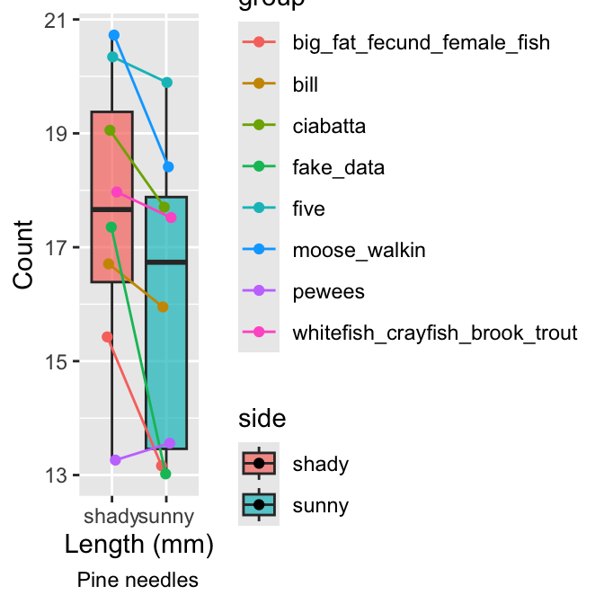
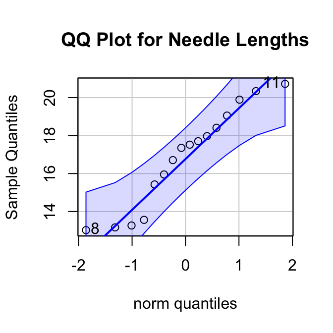
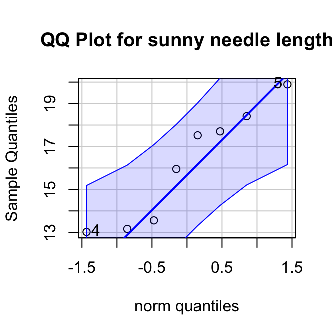
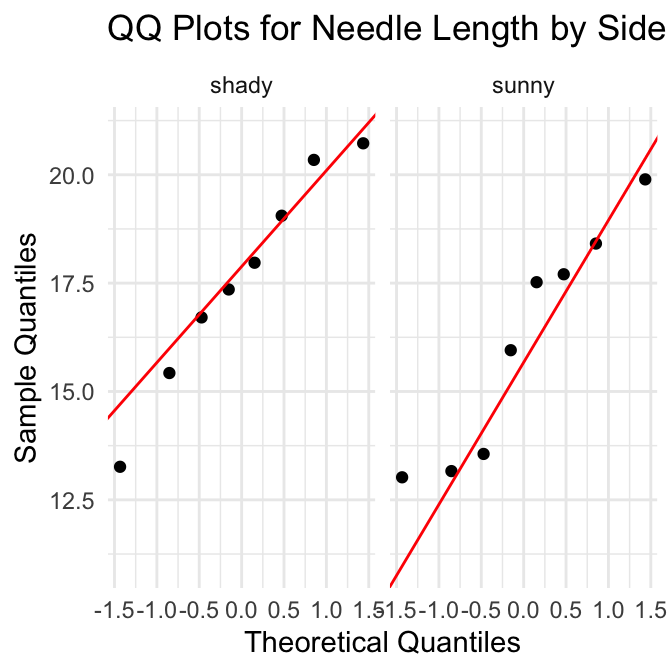
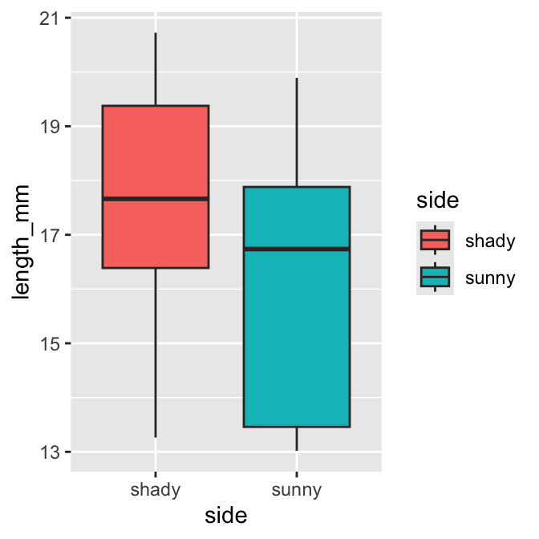
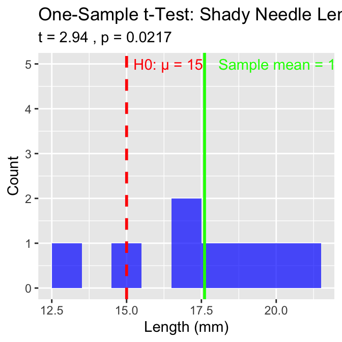
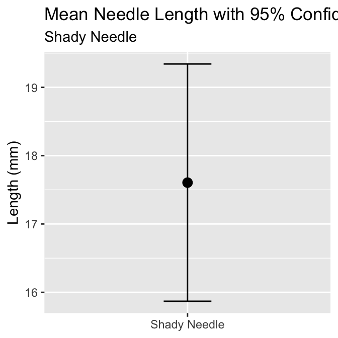
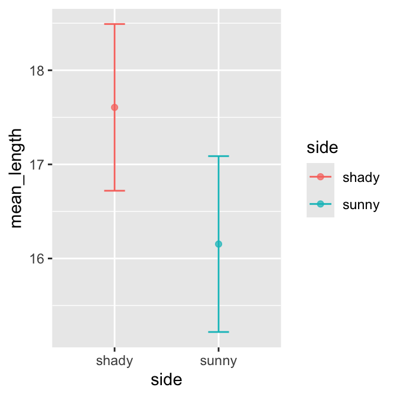

# In-Class Activity 5: Probability and Statistical Inference

## What did we do last time?

In our previous activity, we:

-   Created and interpreted frequency distributions (histograms)
-   Compared data between groups using side-by-side histograms
-   Explored how sample size affects our understanding of populations
-   Created density plots and calculated probabilities

## Today's focus:

Today we'll focus on:

-   t-distribution and when to use it
-   Calculating and interpreting standard error
-   Creating confidence intervals
-   Conducting **one-sample and two-sample t-tests**
-   **Understanding statistical assumptions and their importance**

# Setup

First, let's load the packages and data we'll be using:


::: {.cell}

```{.r .cell-code}
# Load required packages
library(readxl)
library(tidyverse)
```

::: {.cell-output .cell-output-stderr}

```
── Attaching core tidyverse packages ──────────────────────── tidyverse 2.0.0 ──
✔ dplyr     1.2.1     ✔ readr     2.2.0
✔ forcats   1.0.1     ✔ stringr   1.6.0
✔ ggplot2   4.0.3     ✔ tibble    3.3.1
✔ lubridate 1.9.5     ✔ tidyr     1.3.2
✔ purrr     1.2.2     
── Conflicts ────────────────────────────────────────── tidyverse_conflicts() ──
✖ dplyr::filter() masks stats::filter()
✖ dplyr::lag()    masks stats::lag()
ℹ Use the conflicted package (<http://conflicted.r-lib.org/>) to force all conflicts to become errors
```


:::

```{.r .cell-code}
library(patchwork)
library(car)  # For diagnostic tests
```

::: {.cell-output .cell-output-stderr}

```
Loading required package: carData

Attaching package: 'car'

The following object is masked from 'package:dplyr':

    recode

The following object is masked from 'package:purrr':

    some
```


:::

```{.r .cell-code}
pine_df <- read_excel("data/class_pine needle length.xlsx") 
pine_switch_df <- read_excel("data/class_pine needle length switched.xlsx")

head(pine_df)
```

::: {.cell-output .cell-output-stdout}

```
# A tibble: 6 × 5
  group tree_no tree_char side  length_mm
  <chr>   <dbl> <chr>     <chr>     <dbl>
1 five        1 tree_1    sunny      22.7
2 five        1 tree_1    sunny      21.1
3 five        1 tree_1    sunny      18.6
4 five        1 tree_1    sunny      18.6
5 five        1 tree_1    sunny      21.0
6 five        1 tree_1    sunny      18.9
```


:::
:::


# An issue we have is pseudoreplication

What is our sample unit? branches? needles? trees? sides?

-   We need to get the averages of the data so it is no psudoreplicated!
-   We will group data by group, tree, tree_char, side and take the
    averages and save the average as length_mm
-   We will also need to make dataframes of sunny and shady side of the
    data


::: {.cell}

```{.r .cell-code}
# Now we need to average the sunny and shady sides as these are all pseudoreplicated
p_df <- pine_df %>% 
  group_by(group, tree_no, tree_char, side) %>% 
  summarise(length_mm = mean(length_mm, na.rm=TRUE))
```

::: {.cell-output .cell-output-stderr}

```
`summarise()` has regrouped the output.
ℹ Summaries were computed grouped by group, tree_no, tree_char, and side.
ℹ Output is grouped by group, tree_no, and tree_char.
ℹ Use `summarise(.groups = "drop_last")` to silence this message.
ℹ Use `summarise(.by = c(group, tree_no, tree_char, side))` for per-operation
  grouping (`?dplyr::dplyr_by`) instead.
```


:::

```{.r .cell-code}
ps_df <- pine_switch_df %>% 
  group_by(group, tree_no, tree_char, side) %>% 
  summarise(length_mm = mean(length_mm, na.rm=TRUE))
```

::: {.cell-output .cell-output-stderr}

```
`summarise()` has regrouped the output.
ℹ Summaries were computed grouped by group, tree_no, tree_char, and side.
ℹ Output is grouped by group, tree_no, and tree_char.
ℹ Use `summarise(.groups = "drop_last")` to silence this message.
ℹ Use `summarise(.by = c(group, tree_no, tree_char, side))` for per-operation
  grouping (`?dplyr::dplyr_by`) instead.
```


:::

```{.r .cell-code}
ps_shady_df <- ps_df %>% 
  filter(side == "shady")

ps_sunny_df <- ps_df %>% 
  filter(side == "sunny")

head(ps_shady_df) %>% arrange(tree_no)
```

::: {.cell-output .cell-output-stdout}

```
# A tibble: 6 × 5
# Groups:   group, tree_no, tree_char [6]
  group                      tree_no tree_char side  length_mm
  <chr>                        <dbl> <chr>     <chr>     <dbl>
1 five                             1 tree_1    shady      20.3
2 big_fat_fecund_female_fish       2 tree_2    shady      15.4
3 bill                             3 tree_3    shady      16.7
4 ciabatta                         5 tree_5    shady      19.1
5 moose_walkin                     7 tree_7    shady      20.7
6 fake_data                        8 tree_8    shady      17.4
```


:::
:::


# Part 1: Exploring the Data

Before conducting statistical tests, it's important to understand your
data.

::: callout-tip
## Practice Exercise 1: Summary data

Let's create summary data of needle lengths from each side to visualize
their distributions.


::: {.cell}

```{.r .cell-code}
stats_df <- ps_df %>% 
  group_by(side) %>% 
  summarize(
    mean_length = mean(length_mm, na.rm = TRUE),
    sd_length = sd(length_mm, na.rm = TRUE),
    se_length = sd(length_mm, na.rm = TRUE)/ sum(!is.na(length_mm))^.5,
    count = sum(!is.na(length_mm)),
    .groups = "drop"
  )
stats_df
```

::: {.cell-output .cell-output-stdout}

```
# A tibble: 2 × 5
  side  mean_length sd_length se_length count
  <chr>       <dbl>     <dbl>     <dbl> <int>
1 shady        17.6      2.51     0.886     8
2 sunny        16.2      2.64     0.934     8
```


:::

```{.r .cell-code}
# CAN YOU THINK OF AN EASIER WAY?
```
:::

:::

# Part 1: Exploring the Data

Before conducting statistical tests, it's important to understand your
data.

::: callout-tip
## Practice Exercise 1: Creating Histograms

Let's create histograms of needle lengths from each lake to visualize
their distributions.


::: {.cell}

```{.r .cell-code}
needle_box_plot <- ps_df %>% 
ggplot(aes(x=side, y=length_mm, fill = side))+
geom_boxplot()
needle_box_plot
```

::: {.cell-output-display}
{width=336}
:::
:::

:::

# Part 2: Exploring data a different way

We want to see variation in a different way and how groups measured data
on sunny and shady sides


::: {.cell}

```{.r .cell-code}
pd <- position_dodge2(width = 0.2)
p_plot <- ps_df %>% 
  ggplot(aes(side, length_mm, fill=side)) + 
  geom_boxplot(alpha = 0.7) +
  geom_point(aes(group = group, color= group),
             position = pd)+
  geom_line(aes(group = group, color= group),
             position = pd)+
  labs(x = "Length (mm)", y = "Count", caption = "Pine needles")
p_plot
```

::: {.cell-output-display}
{width=336}
:::
:::


# Part 3: Testing Assumptions

Before conducting a t-test, we need to check if our data meets the
necessary assumptions:

1.  **Normality**: The data should be approximately normally distributed
2.  **Independence**: Observations should be independent
3.  **No extreme outliers**: Outliers can heavily influence t-test
    results

Let's check the normality assumption for shady needle lengths:

::: callout-tip
## Practice Exercise 2: Checking Normality of all data but does not do by group!


::: {.cell}

```{.r .cell-code}
# Create a QQ plot to check normality
# QQ plots compare our data to a theoretical normal distribution
# Points should roughly follow the line if data is normally distributed
qqPlot(ps_df$length_mm, 
       main = "QQ Plot for Needle Lengths",
       ylab = "Sample Quantiles")
```

::: {.cell-output-display}
{width=336}
:::

::: {.cell-output .cell-output-stdout}

```
[1]  8 11
```


:::
:::

:::

## Shapiro-Wilk test on all data

What do we look at here and how do we interpret?

Hoping for non significant!!!


::: {.cell}

```{.r .cell-code}
# Also perform a formal test of normality using the Shapiro-Wilk test
# Null hypothesis: Data is normally distributed
# If p > 0.05, we don't reject the assumption of normality
shapiro_test <- shapiro.test(ps_df$length_mm)
print(shapiro_test)
```

::: {.cell-output .cell-output-stdout}

```

	Shapiro-Wilk normality test

data:  ps_df$length_mm
W = 0.92754, p-value = 0.2228
```


:::
:::


# QQ Plot for Sunny Data

::: callout-tip
## Practice Exercise 8: Test normality of pine needle lengths on sunny side

qqplots

Note you need to test each groups separately...


::: {.cell}

```{.r .cell-code}
# QQ Plot for sunny group
qqPlot(ps_sunny_df$length_mm, 
       main = "QQ Plot for sunny needle length",
       ylab = "Sample Quantiles")
```

::: {.cell-output-display}
{width=336}
:::

::: {.cell-output .cell-output-stdout}

```
[1] 5 4
```


:::
:::

:::

# Shapiro-Wilk Test for Sunny data

::: callout-tip
## Practice Exercise 9: Test normality of sunny needle lengths

Shapiro-Wilk test

Note you need to test each groups separately...


::: {.cell}

```{.r .cell-code}
# Shapiro-Wilk test for sunny group
shapiro.test(ps_sunny_df$length_mm)
```

::: {.cell-output .cell-output-stdout}

```

	Shapiro-Wilk normality test

data:  ps_sunny_df$length_mm
W = 0.89994, p-value = 0.2886
```


:::
:::

:::

# Combined QQ plots with GGPLOT

We can use ggplot which you are more familiar with to also do qqPlots


::: {.cell}

```{.r .cell-code}
ggplot(ps_df, aes(sample = length_mm)) +
  stat_qq() +
  stat_qq_line(color = "red") +
  facet_wrap(~ side) +
  labs(title = "QQ Plots for Needle Length by Side",
       x = "Theoretical Quantiles",
       y = "Sample Quantiles") +
  theme_minimal()
```

::: {.cell-output-display}
{width=336}
:::
:::


# Combined Normality Test

Note you can do this a lot easier with piping of the data...

::: callout-tip
## Practice Exercise 12: Test Normality at one time

There are always a lot of ways to do everything in R and is sometimes
frustrating


::: {.cell}

```{.r .cell-code}
# there are always two ways
# Test for normality using Shapiro-Wilk test for each wind group
# All in one pipeline using tidyverse approach
normality_results <- ps_df %>%
  group_by(side) %>%
  summarize(
    shapiro_stat = shapiro.test(length_mm)$statistic,
    shapiro_p_value = shapiro.test(length_mm)$p.value,
    normal_distribution = if_else(shapiro_p_value > 0.05, "Normal", "Non-normal")
    # above wwe are using an ifelse test which is a great oneliner
  )

# Print the results
print(normality_results)
```

::: {.cell-output .cell-output-stdout}

```
# A tibble: 2 × 4
  side  shapiro_stat shapiro_p_value normal_distribution
  <chr>        <dbl>           <dbl> <chr>              
1 shady        0.966           0.868 Normal             
2 sunny        0.900           0.289 Normal             
```


:::
:::

:::

# Test for Equal Variances of Sunny and Shady

::: callout-tip
## Practice Exercise 13: Test equal variances

Levene's test can be done on the original dataframe


::: {.cell}

```{.r .cell-code}
# Method 1: Using car package's leveneTest
# This is often preferred as it's more robust to departures from normality
levene_result <- leveneTest(length_mm ~ side, data = ps_df)
levene_result
```

::: {.cell-output .cell-output-stdout}

```
Levene's Test for Homogeneity of Variance (center = median)
      Df F value Pr(>F)
group  1  0.2062 0.6567
      14               
```


:::
:::

:::

# Check for outliers


::: {.cell}

```{.r .cell-code}
# Check for outliers using a boxplot
needle_box_plot
```

::: {.cell-output-display}
{width=336}
:::
:::


::: callout-tip
How to interpret these results:

-   The QQ plot: Points should follow the straight line if data is
    normally distributed
-   Shapiro-Wilk test: If p \> 0.05, we don't reject the assumption of
    normality
-   Boxplot: Look for points beyond the whiskers as potential outliers
:::

# Part 4: One-Sample t-Test

A one-sample t-test compares a sample mean to a specific value.

Let's test if the mean needle length on the shady side is 15 or not?

::: callout-tip
## Practice Exercise: One-Sample t-Test


::: {.cell}

```{.r .cell-code}
# Calculate the mean of shady needles?
shady_mean <- mean(ps_shady_df$length_mm, na.rm=TRUE)
shady_mean
```

::: {.cell-output .cell-output-stdout}

```
[1] 17.60561
```


:::

```{.r .cell-code}
# what is the mean
# 17.60561

ps_shade_mean <- mean(ps_shady_df$length_mm, na.rm = TRUE)
cat("Mean:", round(ps_shade_mean, 1), "mm\n")
```

::: {.cell-output .cell-output-stdout}

```
Mean: 17.6 mm
```


:::

```{.r .cell-code}
# Perform a one-sample t-test
t_test_result <- t.test(ps_shady_df$length_mm, mu = 15)

# View the test results
t_test_result
```

::: {.cell-output .cell-output-stdout}

```

	One Sample t-test

data:  ps_shady_df$length_mm
t = 2.9414, df = 7, p-value = 0.02167
alternative hypothesis: true mean is not equal to 15
95 percent confidence interval:
 15.51092 19.70030
sample estimates:
mean of x 
 17.60561 
```


:::
:::

:::


::: {.cell}

```{.r .cell-code}
# Create a visualization of the test
ps_shady_df %>%
  ggplot(aes(x = length_mm)) +
  geom_histogram(binwidth = 1, fill = "blue", alpha = 0.7) +
  geom_vline(xintercept = 15, color = "red", linetype = "dashed", linewidth = 1) +
  geom_vline(xintercept = shady_mean, color = "green", linewidth = 1) +
  annotate("text", x = 15, y = 5, label = "H0: μ = 15", color = "red", hjust = -0.1) +
  annotate("text", x = ps_shade_mean, y = 5, 
           label = paste("Sample mean =", round(ps_shade_mean, 1)), 
           color = "green", hjust = -0.1) +
  labs(
    title = "One-Sample t-Test: Shady Needle Lengths",
    subtitle = paste(
      "t =", round(t_test_result$statistic, 2),
      ", p =", format.pval(t_test_result$p.value, digits = 3)),
    x = "Length (mm)",
    y = "Count")
```

::: {.cell-output-display}
{width=336}
:::
:::


::: callout-tip
Interpret the results:

1.  What was the null hypothesis? H0: μ = 15mm
2.  What was the alternative hypothesis? H1: μ ≠ 15mm
3.  What does the p-value tell us? (Is p \< 0.05?)
4.  Should we reject or fail to reject the null hypothesis?
5.  What is the practical interpretation for biologists?
:::

# Part 5: Confidence Intervals

A confidence interval gives us a range of plausible values for the
population mean.

For a 95% confidence interval using the t-distribution:

## $$ 95\% \text{ CI} = \bar{x} \pm t_{\alpha/2, n-1} \times \frac{s}{\sqrt{n}} $$

Where:

-   \- $\bar{x}$ is the sample mean
-   \- $s$ is the sample standard deviation
-   \- $n$ is the sample size
-   \- $t_{\alpha/2, n-1}$ is the critical t-value with n-1 degrees of
    freedom

::: callout-tip
## Practice Exercise 4: Calculating Confidence Intervals

Let's calculate the 95% confidence interval for shady needle lengths:


::: {.cell}

```{.r .cell-code}
# Extract sample statistics
shady_stats <- ps_shady_df 
shady_mean <- mean(ps_shady_df$length_mm, na.rm=TRUE)
shady_se <- sd(ps_shady_df$length_mm, na.rm=TRUE)/sum(!is.na(ps_shady_df$length_mm))^.5
shady_n <- sum(!is.na(ps_shady_df$length_mm))

# Find the critical t-value for 95% confidence with n-1 degrees of freedom
# qt(0.975, df) gives the t-value for a 95% confidence interval (two-tailed)
t_critical <- qt(0.975, df = shady_n - 1)
cat("Critical t-value for", shady_n-1, "degrees of freedom:", round(t_critical, 3), "\n")
```

::: {.cell-output .cell-output-stdout}

```
Critical t-value for 7 degrees of freedom: 2.365 
```


:::

```{.r .cell-code}
# Calculate the confidence interval
shady_ci_lower <- shady_mean - t_critical * shady_se
shady_ci_upper <- shady_mean + t_critical * shady_se

# Display the confidence interval
cat("95% Confidence Interval for Shady needle mean length:", 
    round(shady_ci_lower, 1), "to", round(shady_ci_upper, 1), "mm\n")
```

::: {.cell-output .cell-output-stdout}

```
95% Confidence Interval for Shady needle mean length: 15.5 to 19.7 mm
```


:::

```{.r .cell-code}
# Compare this to a confidence interval using the normal approximation (z = 1.96)
z_ci_lower <- shady_mean - 1.96 * shady_se
z_ci_upper <- shady_mean + 1.96 * shady_se

cat("95% CI using normal approximation:", 
    round(z_ci_lower, 1), "to", round(z_ci_upper, 1), "mm\n")
```

::: {.cell-output .cell-output-stdout}

```
95% CI using normal approximation: 15.9 to 19.3 mm
```


:::
:::

:::


::: {.cell}

```{.r .cell-code}
# Visualize the confidence interval
ggplot() +
  geom_errorbar(aes(x = "Shady Needle", 
                   ymin = z_ci_lower, 
                   ymax = z_ci_upper),
               width = 0.2) +
  geom_point(aes(x = "Shady Needle", y = shady_mean), size = 3) +
  labs(title = "Mean Needle Length with 95% Confidence Interval",
       subtitle = "Shady Needle",
       x = NULL,
       y = "Length (mm)")
```

::: {.cell-output-display}
{width=336}
:::
:::


# Part 6: Two-Sample t-Test

A two-sample t-test compares means from two independent groups.

Let's compare needle lengths between sunny and shady sides


::: {.cell}

```{.r .cell-code}
# Summarize pine needle data by wind exposure
stats_df
```

::: {.cell-output .cell-output-stdout}

```
# A tibble: 2 × 5
  side  mean_length sd_length se_length count
  <chr>       <dbl>     <dbl>     <dbl> <int>
1 shady        17.6      2.51     0.886     8
2 sunny        16.2      2.64     0.934     8
```


:::
:::


## Look a the plot of needle lengths


::: {.cell}

```{.r .cell-code}
# Create a boxplot to visualize the data
p_plot
```

::: {.cell-output-display}
{width=336}
:::
:::


# Now let's conduct the two-sample t-test:

::: callout-tip
## Practice Exercise 6: Two-Sample t-Test

## Calculate the T Test


::: {.cell}

```{.r .cell-code}
# Perform a two-sample t-test
# H0: μ1 = μ2 (The mean needle lengths are equal)
# H1: μ1 ≠ μ2 (The mean needle lengths are different)

# var.equal=TRUE uses the standard t-test (pooled variance)
# var.equal=FALSE uses Welch's t-test (for unequal variances)
t_test_result <- t.test(length_mm ~ side, data = ps_df, var.equal = TRUE)

# Display the test results
t_test_result
```

::: {.cell-output .cell-output-stdout}

```

	Two Sample t-test

data:  length_mm by side
t = 1.1279, df = 14, p-value = 0.2783
alternative hypothesis: true difference in means between group shady and group sunny is not equal to 0
95 percent confidence interval:
 -1.309330  4.214005
sample estimates:
mean in group shady mean in group sunny 
           17.60561            16.15328 
```


:::
:::

:::

## Compare to a Welch's Two Sample T Test when variance is unequal


::: {.cell}

```{.r .cell-code}
# Perform a two-sample t-test
# H0: μ1 = μ2 (The mean needle lengths are equal)
# H1: μ1 ≠ μ2 (The mean needle lengths are different)

# var.equal=TRUE uses the standard t-test (pooled variance)
# var.equal=FALSE uses Welch's t-test (for unequal variances)
welch_test_result <- t.test(length_mm ~ side, data = ps_df, var.equal = FALSE)

# Display the test results
welch_test_result
```

::: {.cell-output .cell-output-stdout}

```

	Welch Two Sample t-test

data:  length_mm by side
t = 1.1279, df = 13.96, p-value = 0.2784
alternative hypothesis: true difference in means between group shady and group sunny is not equal to 0
95 percent confidence interval:
 -1.310069  4.214743
sample estimates:
mean in group shady mean in group sunny 
           17.60561            16.15328 
```


:::
:::


## Compare to a Paired T Test


::: {.cell}

```{.r .cell-code}
# Perform a two-sample t-test
# H0: μ1 = μ2 (The mean needle lengths are equal)
# H1: μ1 ≠ μ2 (The mean needle lengths are different)

# var.equal=TRUE uses the standard t-test (pooled variance)
# var.equal=FALSE uses Welch's t-test (for unequal variances)
paired_test_result <- t.test(length_mm ~ side, data = ps_df, pair = TRUE)

# Display the test results
paired_test_result
```

::: {.cell-output .cell-output-stdout}

```

	Paired t-test

data:  length_mm by side
t = 2.7818, df = 7, p-value = 0.02723
alternative hypothesis: true mean difference is not equal to 0
95 percent confidence interval:
 0.2178092 2.6868652
sample estimates:
mean difference 
       1.452337 
```


:::
:::


## Visualize the plot

::: callout-tip

::: {.cell}

```{.r .cell-code}
# Visualize the results with a mean and error bar plot
ggplot(stats_df, aes(x = side, y = mean_length, color=side, fill = side)) +
  geom_point(stat = "identity", alpha = 0.7) +
  geom_errorbar(aes(ymin = mean_length - se_length, 
                   ymax = mean_length + se_length),
               width = 0.2) 
```

::: {.cell-output-display}
{width=336}
:::
:::

:::

## Interpretation:

::: callout-tip
Interpret the results:

1.  What was the null hypothesis?
2.  What was the alternative hypothesis?
3.  What does the p-value tell us?
4.  Should we reject or fail to reject the null hypothesis?
5.  What is the practical interpretation for botanists?
:::

# Part 8: Communicating Statistical Results

In scientific writing, it's important to report statistical results
clearly and consistently.

Here's a standard format for reporting t-test results:

For a one-sample t-test: "A one-sample t-test showed that the mean
needle length shady side (M = \[mean\], SD = \[sd\]) was
\[significantly/not significantly\] different from 15 mm, t(\[df\]) =
\[t-value\], p = \[p-value\]."

For a two-sample t-test: "A two-sample t-test revealed that pine needle
lengths on the sunny side (M = \[mean1\], SD = \[sd1\]) were
\[significantly/not significantly\] \[longer/shorter\] than on the shady
side (M = \[mean2\], SD = \[sd2\]), t(\[df\]) = \[t-value\], p =
\[p-value\]."

::: callout-tip
## Practice Exercise 8: Writing Statistical Results

Write properly formatted statements reporting the results of:

1.  The one-sample t-test comparing mean shady needle lenght to 15mm

2.  The two-sample t-test comparing pine needle lengths

3.  The two-sample t-test comparing needle lengths between sides

Remember to include:

-   Means and standard deviations for each group

-   The t-value with degrees of freedom

-   The p-value and whether the result is significant
:::

# Reflection Questions

1.  How does the t-distribution differ from the normal distribution, and
    why does this matter for small samples?
2.  What assumptions must be met to use a t-test, and what alternatives
    exist if these assumptions are violated?
3.  What is the difference between statistical significance and
    practical importance?
4.  How would the confidence interval change if we used a 99% confidence
    level instead of 95%?
5.  How would you explain the concept of a p-value to someone with no
    statistical background?
