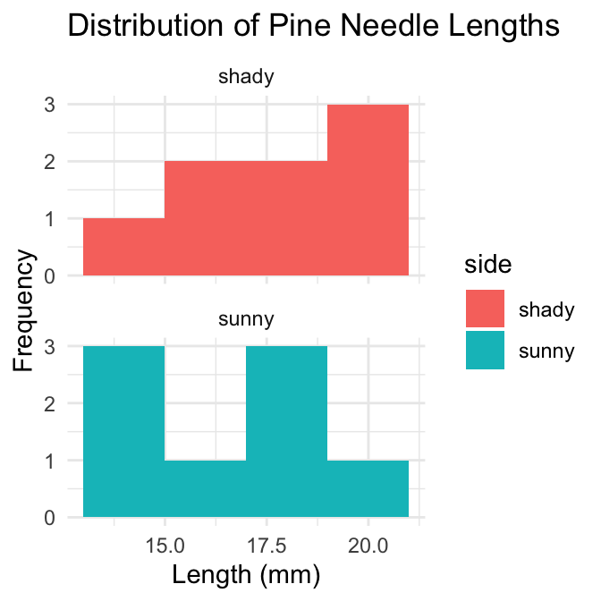
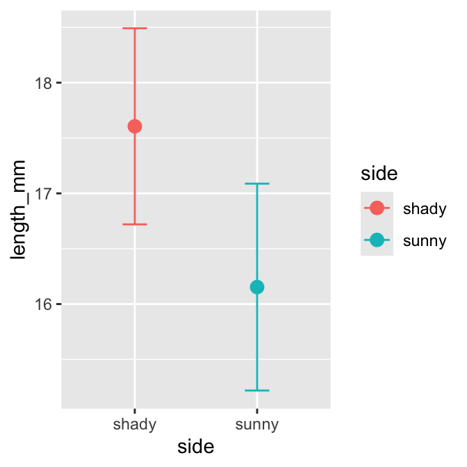
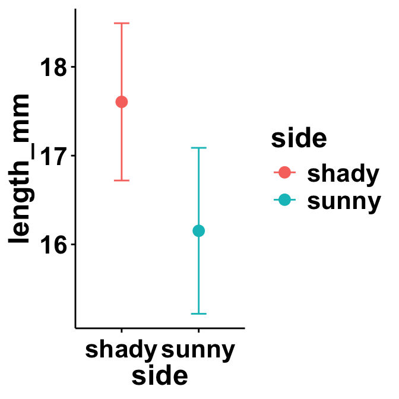
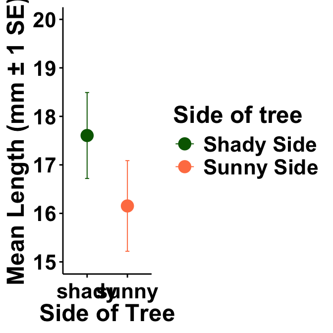

# In class activity 6:

## What did we do last time in activity 5?

-   Understanding standard normal distributions and z-scores
-   Calculating and interpreting standard error
-   Creating confidence intervals
-   Working with the Student’s t-distribution

## Today's focus:

-   Review more r code
-   understand α alpha and **β** beta errors
-   do more
    -   1 sample t tests
    -   2 sample t tests

::::: columns
::: {.column width="60%"}

::: {.cell}

```{.r .cell-code}
# Install packages if needed (uncomment if necessary)
# install.packages("readr")
# install.packages("tidyverse")
# install.packages("car")
# install.packages("here")

# Load libraries
library(patchwork)
library(car)          # For diagnostic tests
```

::: {.cell-output .cell-output-stderr}

```
Loading required package: carData
```


:::

```{.r .cell-code}
library(tidyverse)    # For data manipulation and visualization
```

::: {.cell-output .cell-output-stderr}

```
── Attaching core tidyverse packages ──────────────────────── tidyverse 2.0.0 ──
✔ dplyr     1.2.1     ✔ readr     2.2.0
✔ forcats   1.0.1     ✔ stringr   1.6.0
✔ ggplot2   4.0.3     ✔ tibble    3.3.1
✔ lubridate 1.9.5     ✔ tidyr     1.3.2
✔ purrr     1.2.2     
```


:::

::: {.cell-output .cell-output-stderr}

```
── Conflicts ────────────────────────────────────────── tidyverse_conflicts() ──
✖ dplyr::filter() masks stats::filter()
✖ dplyr::lag()    masks stats::lag()
✖ dplyr::recode() masks car::recode()
✖ purrr::some()   masks car::some()
ℹ Use the conflicted package (<http://conflicted.r-lib.org/>) to force all conflicts to become errors
```


:::

```{.r .cell-code}
library(readxl)
# Load the pine needle data
# Use here() function to specify the path
pine_switch_df <- read_excel("data/class_pine needle length switched.xlsx")

# Examine the first few rows
head(pine_switch_df)
```

::: {.cell-output .cell-output-stdout}

```
# A tibble: 6 × 5
  group tree_no tree_char side  length_mm
  <chr>   <dbl> <chr>     <chr>     <dbl>
1 five        1 tree_1    sunny      22.7
2 five        1 tree_1    sunny      21.1
3 five        1 tree_1    sunny      18.6
4 five        1 tree_1    sunny      18.6
5 five        1 tree_1    sunny      21.0
6 five        1 tree_1    sunny      18.9
```


:::
:::

:::

::: {.column width="40%"}

::: {.cell}

```{.r .cell-code}
ps_df <- pine_switch_df %>% 
  group_by(group, tree_no, tree_char, side) %>% 
  summarise(length_mm = mean(length_mm, na.rm=TRUE))
```

::: {.cell-output .cell-output-stderr}

```
`summarise()` has regrouped the output.
ℹ Summaries were computed grouped by group, tree_no, tree_char, and side.
ℹ Output is grouped by group, tree_no, and tree_char.
ℹ Use `summarise(.groups = "drop_last")` to silence this message.
ℹ Use `summarise(.by = c(group, tree_no, tree_char, side))` for per-operation
  grouping (`?dplyr::dplyr_by`) instead.
```


:::

```{.r .cell-code}
ps_shady_df <- ps_df %>% 
  filter(side == "shady")

ps_sunny_df <- ps_df %>% 
  filter(side == "sunny")

head(ps_df)
```

::: {.cell-output .cell-output-stdout}

```
# A tibble: 6 × 5
# Groups:   group, tree_no, tree_char [3]
  group                      tree_no tree_char side  length_mm
  <chr>                        <dbl> <chr>     <chr>     <dbl>
1 big_fat_fecund_female_fish       2 tree_2    shady      15.4
2 big_fat_fecund_female_fish       2 tree_2    sunny      13.2
3 bill                             3 tree_3    shady      16.7
4 bill                             3 tree_3    sunny      16.0
5 ciabatta                         5 tree_5    shady      19.1
6 ciabatta                         5 tree_5    sunny      17.7
```


:::
:::

:::
:::::

# **Part 1:** Exploratory Data Analysis

Before conducting hypothesis tests, we should always explore our data to
understand its characteristics.

Let's calculate summary statistics and create visualizations.

**Activity: Calculate basic summary statistics for pine needle length**


::: {.cell exercise='true'}

```{.r .cell-code}
# YOUR TASK: Calculate summary statistics for pine needle length
# Hint: Use summarize() function to calculate mean, sd, n, etc.

# Create a summary table for all pine needles
pine_summary <- ps_df %>%
  group_by(side) %>% 
  summarize(
    mean_length = mean(length_mm, na.rm=TRUE),
    sd_length = sd(length_mm, na.rm=TRUE),
    n = sum(!is.na(length_mm)),
    se_length = sd_length / (n^0.5),
    t_critical = qt(0.975, df = n - 1),  # 95% CI uses 0.975 (two-tailed)
    ci_lower = mean_length - t_critical * se_length,
    ci_upper = mean_length + t_critical * se_length
  )

print(pine_summary)
```

::: {.cell-output .cell-output-stdout}

```
# A tibble: 2 × 8
  side  mean_length sd_length     n se_length t_critical ci_lower ci_upper
  <chr>       <dbl>     <dbl> <int>     <dbl>      <dbl>    <dbl>    <dbl>
1 shady        17.6      2.51     8     0.886       2.36     15.5     19.7
2 sunny        16.2      2.64     8     0.934       2.36     13.9     18.4
```


:::

```{.r .cell-code}
# Now calculate summary statistics by wind exposure
# YOUR CODE HERE
```
:::


# **Part 1:** Visualizing the Data

::::: columns
::: {.column width="60%"}
**Activity: Create visualizations of pine needle length**

Create a histogram and a boxplot to visualize the distribution of pine
needle length values.
:::

::: {.column width="40%"}
Effective data visualization helps us understand:

-   The central tendency
-   The spread of the data
-   Potential outliers
-   Shape of distribution
:::
:::::

# Your Task


::: {.cell exercise='true'}

```{.r .cell-code}
# YOUR TASK: Create a histogram of pine needle length
# Hint: Use ggplot() and geom_histogram()

# Histogram of all pine needle lengths
ggplot(ps_df, aes(x = length_mm, fill = side)) +
  geom_histogram(binwidth = 2) +
  labs(title = "Distribution of Pine Needle Lengths",
       x = "Length (mm)",
       y = "Frequency") +
  theme_minimal()+ facet_wrap("side", ncol = 1)
```

::: {.cell-output-display}
{width=336}
:::

```{.r .cell-code}
# how can you do this by side to see both plots
```
:::


# What is the Effect size or difference in means?

::: callout-tip
## Practice Exercise: Calculate Effect size

We could also look at the difference in means... some cool code here


::: {.cell}

```{.r .cell-code}
# Assuming your dataframe is called df
pine_summary %>%
  summarize(difference =  mean_length[side == "sunny"] -mean_length[side == "shady"])
```

::: {.cell-output .cell-output-stdout}

```
# A tibble: 1 × 1
  difference
       <dbl>
1      -1.45
```


:::
:::

:::

# **Part 2:** Conducting the Two-Sample T-Test

**Activity: Conduct a two-sample t-test**

Now we can compare the mean pine needle lengths between sunny and shady
sides.

H₀: μ₁ = μ₂ (The mean needle lengths are equal)

H₁: μ₁ ≠ μ₂ (The mean needle lengths are different)

Deciding between:

-   Standard t-test (equal variances)
-   Welch's t-test (unequal variances)

# Based on our Levene's test result.


::: {.cell exercise='true'}

```{.r .cell-code}
# YOUR TASK: Conduct a two-sample t-test
# Use var.equal=TRUE for standard t-test or var.equal=FALSE for Welch's t-test

# Standard t-test (if variances are equal)
t_test_result <- t.test(length_mm ~ side, data = ps_df, var.equal = TRUE)
print("Standard two-sample t-test:")
```

::: {.cell-output .cell-output-stdout}

```
[1] "Standard two-sample t-test:"
```


:::

```{.r .cell-code}
print(t_test_result)
```

::: {.cell-output .cell-output-stdout}

```

	Two Sample t-test

data:  length_mm by side
t = 1.1279, df = 14, p-value = 0.2783
alternative hypothesis: true difference in means between group shady and group sunny is not equal to 0
95 percent confidence interval:
 -1.309330  4.214005
sample estimates:
mean in group shady mean in group sunny 
           17.60561            16.15328 
```


:::
:::


# What is Power

Statistical power represents the probability of detecting a true effect
(rejecting the null hypothesis when it is false). In this case, with a
power of 97%, there's a 97% chance of detecting a true difference of 30
units between the means of the two groups if such a difference actually
exists.

A power analysis like this is typically done for one of these purposes:

1.  Before data collection to determine required sample size
2.  After a study to evaluate if the sample size was adequate
3.  To determine the minimum detectable effect size with the given
    sample

With 97% power, this test has excellent ability to detect the specified
effect size. Generally, **80% power is considered acceptable**, so 97%
indicates a very well-powered study for detecting a difference of 30mm
between the groups.

$$s_p = \sqrt{\frac{(n_1 - 1)s_1^2 + (n_2 - 1)s_2^2}{n_1 + n_2 - 2}}$$


::: {.cell}

```{.r .cell-code}
# Calculate power for detecting a 1 mm difference
side_diff <- 1

# Get sample sizes # note assumes no missing values
sunny_n <- nrow(ps_sunny_df)
shady_n <- nrow(ps_shady_df)

# Calculate pooled standard deviation
sun_sd_pooled <- sqrt((var(ps_sunny_df$length_mm) * (sunny_n - 1) + 
                      var(ps_shady_df$length_mm) * (shady_n - 1)) / 
                      (sunny_n + shady_n - 2))

# Calculate Cohen's d effect size
sun_effect_size <- side_diff / sun_sd_pooled

# Calculate degrees of freedom
sun_df <- sunny_n + shady_n - 2

# Set significance level
sun_alpha <- 0.05

# Calculate power (fixed parameters)
sun_power <- power.t.test(n = min(sunny_n, shady_n), 
                         delta = side_diff,  # Raw difference, not effect size
                         sd = sun_sd_pooled,  # Use pooled SD, not side_diff
                         sig.level = sun_alpha,  # Use 0.05, not 0.5
                         type = "two.sample",
                         alternative = "two.sided")

# Display results
print("Sample sizes:")
```

::: {.cell-output .cell-output-stdout}

```
[1] "Sample sizes:"
```


:::

```{.r .cell-code}
print(paste("Sunny:", sunny_n, "Shady:", shady_n))
```

::: {.cell-output .cell-output-stdout}

```
[1] "Sunny: 8 Shady: 8"
```


:::

```{.r .cell-code}
print(paste("Pooled SD:", round(sun_sd_pooled, 3)))
```

::: {.cell-output .cell-output-stdout}

```
[1] "Pooled SD: 2.575"
```


:::

```{.r .cell-code}
print(paste("Effect size (Cohen's d):", round(sun_effect_size, 3)))
```

::: {.cell-output .cell-output-stdout}

```
[1] "Effect size (Cohen's d): 0.388"
```


:::

```{.r .cell-code}
print("")
```

::: {.cell-output .cell-output-stdout}

```
[1] ""
```


:::

```{.r .cell-code}
print("Power analysis results:")
```

::: {.cell-output .cell-output-stdout}

```
[1] "Power analysis results:"
```


:::

```{.r .cell-code}
print(sun_power)
```

::: {.cell-output .cell-output-stdout}

```

     Two-sample t test power calculation 

              n = 8
          delta = 1
             sd = 2.575237
      sig.level = 0.05
          power = 0.1083557
    alternative = two.sided

NOTE: n is number in *each* group
```


:::
:::


# Now to make a final plot

Typically we will make a plot that has the mean and standard error on it
to represent the data

## Your task is to make a more publication quality final plot


::: {.cell}

```{.r .cell-code}
pine_mean_se <- ps_df %>% 
  ggplot(aes(side, length_mm, color = side))+
  stat_summary(fun = "mean", na.rm=TRUE, geom="point", size = 3)+
  stat_summary(fun.data = "mean_se", width = 0.2, geom = "errorbar")
pine_mean_se
```

::: {.cell-output-display}
{width=336}
:::
:::


# Now make a new theme

This is how you can customize a plot with your own theme

Run this block or ctrl/command + enter on the very start of the code as
running inside the function fails.


::: {.cell}

```{.r .cell-code}
# Load your custom theme -----
theme_class <- function(base_size = 14, base_family = "Sans")
{theme(
  # REMOVE PLOT FILL AND GRIDS
    panel.background=element_rect(fill = "transparent", colour = "transparent"), 
    plot.background=element_rect(fill="transparent", colour=NA),
  # removes the grid lines
    panel.grid.major = element_line(linetype = "blank"),
    panel.grid.minor = element_line(linetype = "blank"),  
  # X and Y LABELS APPEARANCE
    axis.text = element_text(colour = "black"), # this is for the text on ticks and overrides all below if not set
    axis.title.x=element_text(size=18, face="bold"), # this is for the x title
    axis.title.y=element_text(size=18, face="bold"), # this is for the y title
    axis.text.x = element_text(size=16, face="bold", angle=0, vjust = .5, hjust=.5), # for X tick labels
    axis.text.y = element_text(size=16, face="bold"),# for Y tick labels
    # plot.title = element_text(hjust = 0.5, colour="black", size=22, face="bold"),
  # ADD AXES LINES AND SIZE
    axis.ticks = element_line(colour = "black"),
    axis.line.x = element_line(color="black", linewidth = 0.5,linetype = "solid" ),
    axis.line.y = element_line(color="black", linewidth = 0.5, linetype = "solid"),
  # LEGEND
    # LEGEND TEXT
    legend.text = element_text(colour="black", size = 16, face = "bold"),
    # LEGEND TITLE
    legend.title = element_text(colour="black", size=18, face="bold"),
    # LEGEND POSITION AND JUSTIFICATION 
    # legend.justification=c(0.1,1),
    legend.position="right",
    # REMOVE BOX BEHIND LEGEND SYMBOLS
    legend.key = element_rect(fill = "transparent", colour = "transparent"),
    # REMOVE LEGEND BOX
    legend.background = element_rect(fill = "transparent", colour = "transparent"),
  # ADD PLOT BOX
    # panel.border = element_rect(color = "black", fill = NA, size=2),
    # turn off an element element_blank()
    panel.border = element_blank(),
    plot.title = element_text(hjust = 0, vjust=2.12),
    plot.caption = element_text(hjust = 0, vjust=1.12))
}
```
:::


# Now apply your theme to the plot above

We can add things to an existing plot as we go.. and it is not over
writing the plot as we are not using the `<-`


::: {.cell}

```{.r .cell-code}
pine_mean_se +
  theme_class()
```

::: {.cell-output-display}
{width=336}
:::
:::


# Further modifications


::: {.cell}

```{.r .cell-code}
pine_mean_se <- ps_df %>% 
  ggplot(aes(side, length_mm, color = side))+
  stat_summary(fun = "mean", na.rm=TRUE, geom="point", 
               size = 4)+
  stat_summary(fun.data = "mean_se", geom = "errorbar",
               width = 0.1, linewidth = 0.35) +
  labs(x = "Side of Tree",
       y = "Mean Length (mm \u00B1 1 SE)")+
  coord_cartesian(ylim = c(15, 20))+
  theme_class()+
  scale_color_manual(
    name = "Side of tree",
    labels = c(
      "shady" = "Shady Side",
      "sunny" = "Sunny Side"),
    values = c(
      "shady" = "darkgreen",
      "sunny" = "coral")
  )
pine_mean_se
```

::: {.cell-output-display}
{width=336}
:::
:::


\

# **Summary and Conclusions**

In this activity, we've:

1.  Formulated hypotheses about pine needle length
2.  Tested assumptions for parametric tests
3.  Conducted a two-sample t-tests
4.  Visualized data using appropriate methods
5.  Learned how to interpret and report t-test results

**Key takeaways:**

-   Always check assumptions before conducting tests
-   Visualize your data to understand patterns
-   Report results comprehensively
-   Consider alternatives when assumptions are violated

# Reflection Questions

After completing the activities, discuss these questions with your
group:

1.  How does sample size affect our confidence in estimating the
    population mean?
2.  Why is the t-distribution more appropriate than the normal
    distribution when working with small samples?
3.  When comparing two populations, what can we learn from looking at
    confidence intervals versus performing a t-test?
4.  How would you explain the concept of statistical significance to
    someone who has never taken a statistics course?
5.  What do we do if assumptions FAIL!!!
