# In class activity 7:

## Introduction

This document demonstrates statistical analysis of lake trout mass data
from Island Lake and NE 12, focusing on:

1.  Testing assumptions for parametric tests
2.  Transforming data when assumptions aren't met
3.  Running different types of tests:
    -   Standard t-test
    -   Log-transformed t-test
    -   Welch's t-test
    -   Mann-Whitney Wilcoxon test
    -   Permutation test
4.  Interpreting and reporting results properly

# What did we do last time in activity 6?

-   **Assumptions of parametric tests**
-   alpha and beta errors
-   power
-   making plots of mean and standard error

Lets start by exploring only lake NE 12 as if you were doing a single
sample T test.\
We will test the assumptions and then do the a T Test on NE 12 compared
to Island Lake.

# **Part 1:** Single Sample T-Test

::::: columns
::: {.column width="60%"}
We want to test if the mass of lake trout differ in NE 12 from a mean of
500g.

**Activity: Define hypotheses and identify assumptions**

-   H₀: μ = 500 (The mean mass of lake trout in NE12 is 500 g)
-   H₁: μ ≠ 500 (The mean mass of lake trout in NE12 is not 500 g)
:::

::: {.column width="40%"}
## Assumptions for t-test:

1.  Data is normally distributed
2.  Observations are independent
3.  No significant outliers
:::
:::::

# 

# **Part 1:** Load Data and Test Assumptions

First we need to load the data for all the lakes and we can look at what
we have...

How may lakes are there?

::::: columns
::: {.column width="60%"}

::: {.cell}

```{.r .cell-code}
# Install packages if needed (uncomment if necessary)
# install.packages("readr")
# install.packages("tidyverse")
# install.packages("car")
# install.packages("here")

# Load required packages
library(tidyverse)  # For data manipulation and visualization
```

::: {.cell-output .cell-output-stderr}

```
── Attaching core tidyverse packages ──────────────────────── tidyverse 2.0.0 ──
✔ dplyr     1.2.1     ✔ readr     2.2.0
✔ forcats   1.0.1     ✔ stringr   1.6.0
✔ ggplot2   4.0.3     ✔ tibble    3.3.1
✔ lubridate 1.9.5     ✔ tidyr     1.3.2
✔ purrr     1.2.2     
── Conflicts ────────────────────────────────────────── tidyverse_conflicts() ──
✖ dplyr::filter() masks stats::filter()
✖ dplyr::lag()    masks stats::lag()
ℹ Use the conflicted package (<http://conflicted.r-lib.org/>) to force all conflicts to become errors
```


:::

```{.r .cell-code}
library(car)        # For statistical tests
```

::: {.cell-output .cell-output-stderr}

```
Loading required package: carData

Attaching package: 'car'

The following object is masked from 'package:dplyr':

    recode

The following object is masked from 'package:purrr':

    some
```


:::

```{.r .cell-code}
library(patchwork)  # For combining plots
library(perm)       # For permutation tests
```
:::

:::

::: {.column width="40%"}

::: {.cell}

```{.r .cell-code}
# Load the pine needle data
# Use here() function to specify the path
# Read in the lake trout data
lt_df <- read_csv("data/lake_trout.csv")
```

::: {.cell-output .cell-output-stderr}

```
Rows: 1502 Columns: 5
── Column specification ────────────────────────────────────────────────────────
Delimiter: ","
chr (3): sampling_site, species, lake
dbl (2): length_mm, mass_g

ℹ Use `spec()` to retrieve the full column specification for this data.
ℹ Specify the column types or set `show_col_types = FALSE` to quiet this message.
```


:::

```{.r .cell-code}
# Examine the first few rows
head(lt_df)
```

::: {.cell-output .cell-output-stdout}

```
# A tibble: 6 × 5
  sampling_site species    length_mm mass_g lake 
  <chr>         <chr>          <dbl>  <dbl> <chr>
1 I8            lake trout       515   1400 I8   
2 I8            lake trout       468   1100 I8   
3 I8            lake trout       527   1550 I8   
4 I8            lake trout       525   1350 I8   
5 I8            lake trout       517   1300 I8   
6 I8            lake trout       607   2100 I8   
```


:::
:::

:::
:::::

# **Part 1:** Exploratory Data Analysis

Before conducting hypothesis tests, we should always explore our data to
understand its characteristics.

Let's calculate summary statistics and create visualizations.

**Activity: Calculate basic summary statistics for lake trout mass**


::: {.cell exercise='true'}

```{.r .cell-code}
# YOUR TASK: Calculate summary statistics for lake trout mass
# Hint: Use summarize() function to calculate mean, sd, n, etc.

# Create a summary table for all lake trout
df_summary <- lt_df %>%
  # group_by(lake) %>% 
  summarize(
    mean_length = mean(length_mm, na.rm=TRUE),
    sd_length = sd(length_mm, na.rm=TRUE),
    n = sum(!is.na(length_mm)),
    se_length = sd_length / sqrt(n)
  )

print(df_summary)
```

::: {.cell-output .cell-output-stdout}

```
# A tibble: 1 × 4
  mean_length sd_length     n se_length
        <dbl>     <dbl> <int>     <dbl>
1        393.      108.  1454      2.83
```


:::

```{.r .cell-code}
# Now calculate summary statistics by lake
# YOUR CODE HERE
```
:::


# Calculating Mode if you wanted to


::: {.cell}

```{.r .cell-code}
# I had accdentally asked you to do mode in HW2 - wiht out telling you how... 
# here is one approach
lt_df %>%
  filter(!is.na(mass_g)) %>%
  group_by(lake, mass_g) %>%
  summarise(count = n(), .groups = "drop_last") %>%
  arrange(desc(count)) %>%
  slice(1) %>%
  select(-count) %>%
  rename(mode_mass = mass_g)
```

::: {.cell-output .cell-output-stdout}

```
# A tibble: 6 × 2
# Groups:   lake [6]
  lake        mode_mass
  <chr>           <dbl>
1 I8               1000
2 Island Lake      2200
3 N 01             1000
4 NE 12              90
5 NE 14            1150
6 Toolik            340
```


:::
:::


# Create a New dataframe of lake NE12 only


::: {.cell}

```{.r .cell-code}
# add your code here
ne12_df <- lt_df %>% 
  filter(lake == "NE 12") %>%
  filter(!is.na(mass_g))  # Remove any NA values
```
:::


# **Part 1:** Testing Assumptions

::::: columns
::: {.column width="60%"}
Before conducting our t-test, we need to verify that our data meets the
necessary assumptions.

**Activity: Test the normality assumption**
:::

::: {.column width="40%"}
Methods to test normality:

-   Visual methods:

    -   QQ plots or histograms\
    -   Statistical tests: Shapiro\
    -   Wilk test\
:::
:::::

# **Part 1:** Visualizing the assumptions and data

::::: columns
::: {.column width="60%"}
**Activity: Create visualizations of lake trout mass**

Create a histogram and a boxplot to visualize the distribution of lake
trout massvalues.
:::

::: {.column width="40%"}
Effective data visualization helps us understand:

-   The central tendency
-   The spread of the data
-   Potential outliers
-   Shape of distribution
:::
:::::

# Your Task

### Histogram for NE 12


::: {.cell exercise='true'}

```{.r .cell-code}
# YOUR TASK: Create a histogram of lake trout mass
# Hint: Use ggplot() and geom_histogram()

# Histogram of all lake trout weights
ne12_histo_plot <- ggplot(ne12_df, aes(x = mass_g)) +
  geom_histogram(binwidth = 200) +
  labs(
       x = "mass (g)",
       y = "Frequency") 
ne12_histo_plot
```

::: {.cell-output-display}
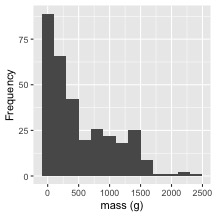
:::

```{.r .cell-code}
# how can you make a dataframe only for lake NE 12 
# and
# make a histogram for lake NE 12 
# Note we need the dataframe to make life a bit easier
```
:::


### Dot Plot for NE 12


::: {.cell}

```{.r .cell-code}
# 2. Dotplot
ne12_dot_plot <- ggplot(ne12_df, aes(x = mass_g, y = "")) +
  geom_dotplot(binwidth = 60, stackdir = "center", fill = "steelblue", dotsize = 0.5) +
  labs(title = "Dotplot", x = "Mass (g)", y = "") 
ne12_dot_plot
```

::: {.cell-output-display}
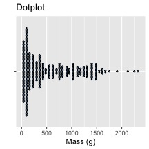
:::
:::


### Box Plot for NE 12


::: {.cell}

```{.r .cell-code}
# 3. Boxplot
ne12_box_plot <- ggplot(ne12_df, aes(y = mass_g)) +
  geom_boxplot(fill = "steelblue") +
  labs( y = "Mass (g)", x = "") +
  coord_flip()
ne12_box_plot
```

::: {.cell-output-display}
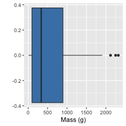
:::
:::


### QQ PLOT NE 12


::: {.cell}

```{.r .cell-code}
ne12_qq_plot <- ggplot(ne12_df, aes(sample = mass_g)) +
  stat_qq(color = "steelblue") +
  stat_qq_line() +
  labs(title = "QQ Plot", x = "Theoretical Quantiles", y = "Sample Quantiles") +
  theme_minimal() +
  theme(plot.title = element_text(hjust = 0.5))
ne12_qq_plot
```

::: {.cell-output-display}
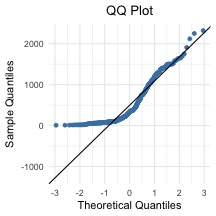
:::
:::


## Use Patchwork to combine the plots


::: {.cell}

```{.r .cell-code}
# Combine all plots using patchwork
combined_stats_plot <- (ne12_histo_plot + ne12_dot_plot) / (ne12_box_plot + ne12_qq_plot) +
  plot_annotation(
    theme = theme(plot.title = element_text(hjust = 0.5),
                  plot.subtitle = element_text(hjust = 0.5))
  )

# Display the combined plot
combined_stats_plot
```

::: {.cell-output-display}
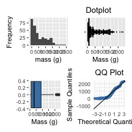
:::
:::


## Shapiro-Wilk's Test

Really want to do this on residuals


::: {.cell}

```{.r .cell-code}
# Shapiro-Wilk test
shapiro_test <- shapiro.test(ne12_df$mass_g)
print(shapiro_test)
```

::: {.cell-output .cell-output-stdout}

```

	Shapiro-Wilk normality test

data:  ne12_df$mass_g
W = 0.85148, p-value < 2.2e-16
```


:::
:::


# Now that we have shown how mass of lake NE 12 fails what do we do next?

Lets explore a comparison of NE 12 and Island Lake mass_g

::: callout-tip
## Exercise: Create a dataframe from `Island Lake` and `NE 12`


::: {.cell}

```{.r .cell-code}
# Create a dataframe with just Island Lake and NE 12 lakes
# Filter out any NA values for mass
in_df <- lt_df %>% 
  filter(lake %in% c("NE 12", "Island Lake")) %>%
  filter(!is.na(mass_g))  

# Look at the first few rows
head(in_df)
```

::: {.cell-output .cell-output-stdout}

```
# A tibble: 6 × 5
  sampling_site species    length_mm mass_g lake       
  <chr>         <chr>          <dbl>  <dbl> <chr>      
1 Island Lake   lake trout       640   2600 Island Lake
2 Island Lake   lake trout       650   2350 Island Lake
3 Island Lake   lake trout       585   2200 Island Lake
4 Island Lake   lake trout       720   3950 Island Lake
5 Island Lake   lake trout       880   6800 Island Lake
6 Island Lake   lake trout       830   3200 Island Lake
```


:::
:::

:::

::: callout-tip
## Get summary stats for lake trout mass in NE12 and Island lakes

# Get a summary of the data by lake


::: {.cell}

```{.r .cell-code}
# Get a summary of the data by lake
summary_by_lake <- in_df %>%
  group_by(lake) %>%
  summarise(
    n = n(),                        # Count of observations
    mean_mass = mean(mass_g),       # Mean mass
    sd_mass = sd(mass_g),           # Standard deviation
    se_mass = sd_mass / sqrt(n),    # Standard error
    min_mass = min(mass_g),         # Minimum mass
    max_mass = max(mass_g)          # Maximum mass
  )

# View the summary
summary_by_lake
```

::: {.cell-output .cell-output-stdout}

```
# A tibble: 2 × 7
  lake            n mean_mass sd_mass se_mass min_mass max_mass
  <chr>       <int>     <dbl>   <dbl>   <dbl>    <dbl>    <dbl>
1 Island Lake    10     3165    1617.   511.      1650     6800
2 NE 12         322      534.    520.    29.0        9     2320
```


:::
:::

:::

# Visualize data by lake

::: callout-tip
## Make a histogram of both Island and NE 12 lakes


::: {.cell}

```{.r .cell-code}
# Create histograms to visualize the distribution
hist_plot <- in_df %>% 
  ggplot(aes(x = mass_g, fill = lake)) +
  geom_histogram(bins = 20, alpha = 0.7) +
  labs(
       x = "Mass (g)", 
       y = "Count") +
  theme_minimal() +
  facet_wrap(~lake, scales = "free_y")  # Separate plots with different y-scales

# Show the histogram
hist_plot
```

::: {.cell-output-display}
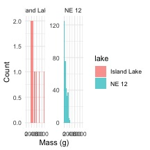
:::
:::

:::

### Practice for later if you choose

### Informal Normality test - often better

### QQ PLOT FOR BOTH LAKES

::: callout-tip
## Exercise: check normality

Always do a qq plot

In a QQ plot, points that follow the line indicate data that follows a
normal distribution. Deviations from the line suggest non-normality.


::: {.cell}

```{.r .cell-code}
# Create QQ plots for each lake to check normality
qq_plot <- in_df %>% 
  ggplot(aes(sample = mass_g, color = lake)) +
  stat_qq() +
  stat_qq_line() +
  labs(title = "QQ Plot for Normality Check", 
       x = "Theoretical Quantiles", 
       y = "Sample Quantiles") +
  theme_minimal() +
  facet_wrap(~lake)  # Create separate plots for each lake

# Show the QQ plot
qq_plot
```

::: {.cell-output-display}
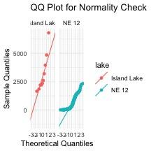
:::
:::

:::

## Formal normality test

::: callout-tip
## Exercise: do a Shapiro-Wilk Test

We can do a formal test for a p value

Note island looks non normal in the qqplot but its really close with the
Shapiro-Wilk test...


::: {.cell}

```{.r .cell-code}
# Formal test for normality: Shapiro-Wilk test
# We'll do this for each lake separately

normality_results <- in_df %>%
  group_by(lake) %>%
  summarize(
    shapiro_stat = shapiro.test(mass_g)$statistic,
    shapiro_p_value = shapiro.test(mass_g)$p.value,
    normal_distribution = if_else(shapiro_p_value > 0.05, "Normal", "Non-normal")
    # above wwe are using an ifelse test which is a great oneliner
  )

# Print the results
print(normality_results)
```

::: {.cell-output .cell-output-stdout}

```
# A tibble: 2 × 4
  lake        shapiro_stat shapiro_p_value normal_distribution
  <chr>              <dbl>           <dbl> <chr>              
1 Island Lake        0.841        4.54e- 2 Non-normal         
2 NE 12              0.851        5.94e-17 Non-normal         
```


:::
:::

:::

## Equality of variance test - Levene's Test

::: callout-tip
## Exercise: test for equal variances

Again we want the P value not significant

The Levene's test has the following null hypothesis: - H₀: The variances
are equal across groups - H₁: The variances are not equal across groups

If the p-value is less than 0.05, we reject the null hypothesis and
conclude the variances are not equal.


::: {.cell}

```{.r .cell-code}
# Formal test for equal variances: Levene's test
levene_result <- leveneTest(mass_g ~ lake, data = in_df)
```

::: {.cell-output .cell-output-stderr}

```
Warning in leveneTest.default(y = y, group = group, ...): group coerced to
factor.
```


:::

```{.r .cell-code}
print(levene_result)
```

::: {.cell-output .cell-output-stdout}

```
Levene's Test for Homogeneity of Variance (center = median)
       Df F value    Pr(>F)    
group   1  25.997 5.775e-07 ***
      330                      
---
Signif. codes:  0 '***' 0.001 '**' 0.01 '*' 0.05 '.' 0.1 ' ' 1
```


:::
:::

:::

# Transformations

Commonly a log10 transformation works well.

::: callout-tip
## Exercise: do a log transformation of Log 10

We could also look at the difference in means... some cool code here


::: {.cell}

```{.r .cell-code}
# Add log-transformed mass variable to our dataset
in_df <- in_df %>%
  mutate(log_mass = log10(mass_g))  # Create log10 transformed mass
head(in_df)
```

::: {.cell-output .cell-output-stdout}

```
# A tibble: 6 × 6
  sampling_site species    length_mm mass_g lake        log_mass
  <chr>         <chr>          <dbl>  <dbl> <chr>          <dbl>
1 Island Lake   lake trout       640   2600 Island Lake     3.41
2 Island Lake   lake trout       650   2350 Island Lake     3.37
3 Island Lake   lake trout       585   2200 Island Lake     3.34
4 Island Lake   lake trout       720   3950 Island Lake     3.60
5 Island Lake   lake trout       880   6800 Island Lake     3.83
6 Island Lake   lake trout       830   3200 Island Lake     3.51
```


:::
:::

:::

## Now look at histograms of logged data

::: callout-tip
## Exercise: histogram of transformed data

We need to see if it worked


::: {.cell}

```{.r .cell-code}
# Create histograms of log-transformed data
log_hist_plot <- in_df %>% 
  ggplot(aes(x = log_mass, fill = lake)) +
  geom_histogram(bins = 20, alpha = 0.7) +
  labs(title = "Distribution of Log-Transformed Lake Trout Mass", 
       x = "Log10 Mass", 
       y = "Count") +
  theme_minimal() +
  facet_wrap(~lake, scales = "free_y")

# Show the log-transformed histogram
log_hist_plot
```

::: {.cell-output-display}
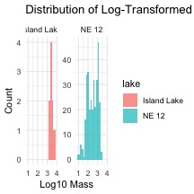
:::
:::

:::

## Now a qqplot - we will skip Shapiro-Wilk this time ; )

::: callout-tip
## Exercise: do a qqplot of transformed data

We could also look at the difference in means... some cool code here


::: {.cell}

```{.r .cell-code}
# QQ plot for log-transformed data
log_qq_plot <- in_df %>% 
  ggplot(aes(sample = log_mass, color = lake)) +
  stat_qq() +
  stat_qq_line() +
  labs(title = "QQ Plot for Log-Transformed Data", 
       x = "Theoretical Quantiles", 
       y = "Sample Quantiles") +
  theme_minimal() +
  facet_wrap(~lake)

# Show the log QQ plot
log_qq_plot
```

::: {.cell-output-display}
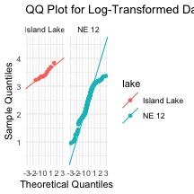
:::
:::

:::

::: callout-tip
## Exercise: Shapiro-Wilk test


::: {.cell}

```{.r .cell-code}
log_normality_results <- in_df %>%
  group_by(lake) %>%
  summarize(
    shapiro_stat = shapiro.test(log10(mass_g))$statistic,
    shapiro_p_value = shapiro.test(log10(mass_g))$p.value,
    normal_distribution = if_else(shapiro_p_value > 0.05, "Normal", "Non-normal")
    # above wwe are using an ifelse test which is a great oneliner
  )

# Print the results
print(log_normality_results)
```

::: {.cell-output .cell-output-stdout}

```
# A tibble: 2 × 4
  lake        shapiro_stat shapiro_p_value normal_distribution
  <chr>              <dbl>           <dbl> <chr>              
1 Island Lake        0.934    0.488        Normal             
2 NE 12              0.954    0.0000000158 Non-normal         
```


:::
:::

:::

::: callout-tip
## Exercise: Levene's test


::: {.cell}

```{.r .cell-code}
# Check for equal variances in log-transformed data
levene_log_result <- leveneTest(log_mass ~ lake, data = in_df)
```

::: {.cell-output .cell-output-stderr}

```
Warning in leveneTest.default(y = y, group = group, ...): group coerced to
factor.
```


:::

```{.r .cell-code}
print(levene_log_result)
```

::: {.cell-output .cell-output-stdout}

```
Levene's Test for Homogeneity of Variance (center = median)
       Df F value    Pr(>F)    
group   1   11.77 0.0006784 ***
      330                      
---
Signif. codes:  0 '***' 0.001 '**' 0.01 '*' 0.05 '.' 0.1 ' ' 1
```


:::
:::

:::

# Transformation fails! What next

## For grins lets do the Two Sample T Test anyway

::: callout-tip
## Exercise: Two sample T Test on regular data

Try a t test


::: {.cell}

```{.r .cell-code}
# Run a standard two-sample t-test
t_test_result <- t.test(
  mass_g ~ lake, 
  data = in_df,
  var.equal = TRUE,  # Assumes equal variances
  alternative = "two.sided"
)

# Show the results
print(t_test_result)
```

::: {.cell-output .cell-output-stdout}

```

	Two Sample t-test

data:  mass_g by lake
t = 14.181, df = 330, p-value < 2.2e-16
alternative hypothesis: true difference in means between group Island Lake and group NE 12 is not equal to 0
95 percent confidence interval:
 2266.304 2996.360
sample estimates:
mean in group Island Lake       mean in group NE 12 
                3165.0000                  533.6677 
```


:::
:::

:::

::: callout-tip
## Exercise: Two sample T Test on transformed data

Try a t test


::: {.cell}

```{.r .cell-code}
# Run a t-test on log-transformed data
log_t_test_result <- t.test(
  log_mass ~ lake, 
  data = in_df,
  var.equal = TRUE,  # Assumes equal variances
  alternative = "two.sided"
)

# Show the results
print(log_t_test_result)
```

::: {.cell-output .cell-output-stdout}

```

	Two Sample t-test

data:  log_mass by lake
t = 5.8192, df = 330, p-value = 1.4e-08
alternative hypothesis: true difference in means between group Island Lake and group NE 12 is not equal to 0
95 percent confidence interval:
 0.6614902 1.3371216
sample estimates:
mean in group Island Lake       mean in group NE 12 
                 3.457554                  2.458248 
```


:::
:::

:::

::: callout-tip
## Exercise: Looking at results of log10 data

When analyzing log-transformed data:

1.  The mean of log-transformed data, when back-transformed, gives the
    geometric mean (not the arithmetic mean)
2.  The back-transformed confidence intervals represent the confidence
    interval for the geometric mean and have to be calculated carefully
3.  Report results like: "The geometric mean mass of lake trout in NE 12
    was X g (95% CI: Y-Z)"
4.  Note you can't take the 10\^SE to get the standard errors but rather
    you need to get the mean - se and the mean + se and then back
    transform...


::: {.cell}

```{.r .cell-code}
# Calculate back-transformed means and confidence intervals
# This converts log values back to original scale
back_transformed <- in_df %>%
  group_by(lake) %>%
  summarise(
    n = n(),
    mean_log = mean(log_mass),
    sd_log = sd(log_mass),
    se_log = sd_log / sqrt(n),
    # Back-transform mean
    geometric_mean = 10^mean_log,
    # Back transform SE
     lower_se = 10^(mean_log -se_log),
    upper_se = 10^(mean_log + se_log),
    arithmetic_mean = mean(mass_g)
  )

# Show back-transformed results
back_transformed %>% 
        select(lake, mean_log, geometric_mean, arithmetic_mean)
```

::: {.cell-output .cell-output-stdout}

```
# A tibble: 2 × 4
  lake        mean_log geometric_mean arithmetic_mean
  <chr>          <dbl>          <dbl>           <dbl>
1 Island Lake     3.46          2868.           3165 
2 NE 12           2.46           287.            534.
```


:::
:::

:::

## Now plot the back transformed data

In some cases the error bars are not symmetrical

::: callout-tip
## Exercise:

Try


::: {.cell}

```{.r .cell-code}
# Create a plot showing geometric means with SE bars
geo_mean_plot <- back_transformed %>% 
  ggplot(aes(x = lake, y = geometric_mean, fill = lake)) +
  # Add bars for geometric means
  geom_bar(stat = "identity", width = 0.5, alpha = 0.7) +
  # Add error bars for standard error
  geom_errorbar(aes(ymin = lower_se, ymax = upper_se), 
                width = 0.2, linewidth = 1) +
  # Add labels and title
  labs(title = "Geometric Mean Lake Trout Mass with Standard Error",
       subtitle = "Back-transformed from log10 scale",
       x = "Lake",
       y = "Geometric Mean Mass (g)") +
  # Use a clean theme
  theme_minimal() +
  # Remove legend (since we already have lake on x-axis)
  theme(legend.position = "none") 

# Display the plot
geo_mean_plot
```

::: {.cell-output-display}
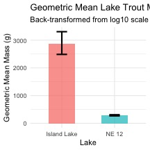
:::
:::

:::

## 3. Welch's t-test


::: {.cell}

```{.r .cell-code}
# Run Welch's t-test (doesn't assume equal variances)
welch_test_result <- t.test(
  mass_g ~ lake, 
  data = in_df,
  var.equal = FALSE,  # Does NOT assume equal variances
  alternative = "two.sided"
)

# Show the results
print(welch_test_result)
```

::: {.cell-output .cell-output-stdout}

```

	Welch Two Sample t-test

data:  mass_g by lake
t = 5.1368, df = 9.0578, p-value = 0.0006016
alternative hypothesis: true difference in means between group Island Lake and group NE 12 is not equal to 0
95 percent confidence interval:
 1473.676 3788.989
sample estimates:
mean in group Island Lake       mean in group NE 12 
                3165.0000                  533.6677 
```


:::
:::


::: callout-tip
## When to Use Welch's t-test

Welch's t-test is preferred when:

-   \- Group variances are unequal (as indicated by Levene's test)
-   \- Sample sizes are different between groups
-   \- It's more robust than the standard t-test in many situations
:::

## 4. Mann-Whitney Wilcoxon test


::: {.cell}

```{.r .cell-code}
# Run Mann-Whitney U test (non-parametric alternative to t-test)
wilcox_test_result <- wilcox.test(
  mass_g ~ lake, 
  data = in_df,
  alternative = "two.sided"
)

# Show the results
print(wilcox_test_result)
```

::: {.cell-output .cell-output-stdout}

```

	Wilcoxon rank sum test with continuity correction

data:  mass_g by lake
W = 3205.5, p-value = 9.506e-08
alternative hypothesis: true location shift is not equal to 0
```


:::
:::


::: callout-tip
## When to Use Mann-Whitney Wilcoxon Test

This non-parametric test is preferred when:

-   \- Data is not normally distributed (even after transformation)
-   \- Comparing medians rather than means
-   \- Data contains outliers that might affect a t-test
-   \- It compares the ranks of the values rather than the actual values
:::

## 5. Permutation test


::: {.cell}

```{.r .cell-code}
# First, let's make sure we have balanced samples
# We'll select a random subset from NE 12 to match Island Lake size
set.seed(123)  # For reproducibility

# Get the smaller sample size
island_size <- sum(in_df$lake == "Island Lake")

# Randomly sample from NE 12 to match Island Lake size
ne12_sample <- in_df %>%
  filter(lake == "NE 12") %>%
  slice_sample(n = island_size)

# Combine with Island Lake data
balanced_df <- bind_rows(
  ne12_sample,
  in_df %>% filter(lake == "Island Lake")
)

# Extract mass data by lake
ne12_mass <- balanced_df %>%
  filter(lake == "NE 12") %>%
  pull(mass_g)

island_mass <- balanced_df %>%
  filter(lake == "Island Lake") %>%
  pull(mass_g)

# Run permutation test
perm_test_result <- permTS(
  x = ne12_mass,
  y = island_mass,
  alternative = "two.sided",
  method = "exact.mc",  # Monte Carlo method for large samples
  control = permControl(nmc = 10000)  # Number of Monte Carlo replications
)

# Show the results
print(perm_test_result)
```

::: {.cell-output .cell-output-stdout}

```

	Exact Permutation Test Estimated by Monte Carlo

data:  ne12_mass and GROUP 2
p-value = 2e-04
alternative hypothesis: true mean ne12_mass - mean GROUP 2 is not equal to 0
sample estimates:
mean ne12_mass - mean GROUP 2 
                      -2519.9 

p-value estimated from 10000 Monte Carlo replications
99 percent confidence interval on p-value:
 0.000000000 0.001059383 
```


:::
:::


::: callout-tip
## When to Use Permutation Tests

Permutation tests are useful when:

-   \- Sample sizes are small
-   \- Data doesn't meet the assumptions for parametric tests
-   \- You want a robust test that makes minimal assumptions about the
    data
-   \- They can test any statistic, not just means
:::

# Now lets compare all of the results

Let's compare the results from all tests:


::: {.cell}

```{.r .cell-code}
# Create a summary table of test statistics and p-values
test_results <- data.frame(
  Test = c("Standard t-test", 
           "Log-transformed t-test", 
           "Welch's t-test", 
           "Mann-Whitney Wilcoxon test"),
  Statistic = c(paste("t =", round(t_test_result$statistic, 2)),
               paste("t =", round(log_t_test_result$statistic, 2)),
               paste("t =", round(welch_test_result$statistic, 2)),
               paste("W =", wilcox_test_result$statistic)),
  p_value = c(t_test_result$p.value,
             log_t_test_result$p.value,
             welch_test_result$p.value,
             wilcox_test_result$p.value),
  Significant = c(t_test_result$p.value < 0.05,
                 log_t_test_result$p.value < 0.05,
                 welch_test_result$p.value < 0.05,
                 wilcox_test_result$p.value < 0.05)
)

# Display the results
test_results
```

::: {.cell-output .cell-output-stdout}

```
                        Test  Statistic      p_value Significant
1            Standard t-test  t = 14.18 5.667524e-36        TRUE
2     Log-transformed t-test   t = 5.82 1.399864e-08        TRUE
3             Welch's t-test   t = 5.14 6.016186e-04        TRUE
4 Mann-Whitney Wilcoxon test W = 3205.5 9.506478e-08        TRUE
```


:::
:::


# Visualizing Results


::: {.cell}

```{.r .cell-code}
# Create a combined visualization
combined_plot <- in_df %>%
  ggplot(aes(x = lake, y = mass_g, fill = lake)) +
  geom_boxplot(alpha = 0.7, outlier.shape = NA) +  # Hide outliers as we'll plot points
  geom_jitter(width = 0.2, alpha = 0.5, size = 2) +  # Add individual points
  labs(
       x = "Lake",
       y = "Mass (g)") +
  theme_minimal() +
  theme(legend.position = "none")  # Remove redundant legend

# Show the plot
combined_plot
```

::: {.cell-output-display}
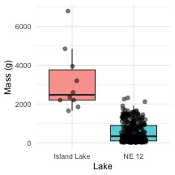
:::
:::


When reporting results from statistical tests, include:

## For Standard t-test:

```         
Lake trout from NE 12 had significantly different mass (M = [mean], SD = [SD]) compared to Island Lake (M = [mean], SD = [SD]), t([df]) = [t-value], p = [p-value].
```

## For Log-transformed t-test:

```         
After log transformation to meet normality assumptions, lake trout from NE 12 had significantly different mass (geometric mean = [value], 95% CI [lower-upper]) compared to Island Lake (geometric mean = [value], 95% CI [lower-upper]), t([df]) = [t-value], p = [p-value].
```

## For Welch's t-test:

```         
Assuming unequal variances, lake trout from NE 12 had significantly different mass (M = [mean], SD = [SD]) compared to Island Lake (M = [mean], SD = [SD]), Welch's t([df]) = [t-value], p = [p-value].
```

## For Mann-Whitney Wilcoxon test:

```         
Lake trout mass differed significantly between NE 12 (Mdn = [median]) and Island Lake (Mdn = [median]), W = [W-value], p = [p-value].
```

## For Permutation test:

```         
Permutation testing (10,000 iterations) revealed significant differences in lake trout mass between NE 12 and Island Lake, p = [p-value].
```

# Conclusion

This analysis demonstrates several approaches to comparing mass between
lake trout populations. The choice of statistical test depends on
whether your data meets the assumptions of parametric tests. When
assumptions are violated:

1.  Try transforming the data (e.g., log transformation)
2.  Use Welch's t-test if variances are unequal
3.  Use non-parametric tests (Mann-Whitney or permutation tests) if data
    remains non-normal

All methods have their strengths and limitations, and the consistency of
results across methods can strengthen your conclusions.

::: callout-tip
## When to Use Each Test

-   **Standard t-test**: When data is normally distributed with equal
    variances
-   **Log-transformed t-test**: When raw data is skewed but
    log-transformation achieves normality
-   **Welch's t-test**: When variances are unequal
-   **Mann-Whitney Wilcoxon test**: When data is not normal and cannot
    be transformed to normality
-   **Permutation test**: When sample sizes are small or assumptions
    cannot be met
:::
