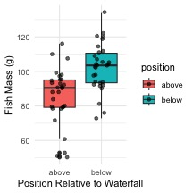
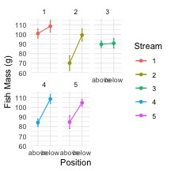
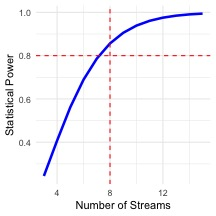

# In class activity 8: Study Design and Power Analysis

## Introduction

This activity demonstrates key concepts in experimental design using a
made up fish example:

1.  **Formulating research questions**
2.  **Understanding study designs**
3.  **Recognizing proper replication vs. pseudoreplication**
4.  **Conducting power analysis** (before and after data collection)
5.  **Planning sampling strategies**

We'll study fish mass above and below waterfalls across multiple
streams.

# **Part 1:** Load Required Packages


::: {.cell}

```{.r .cell-code}
library(tidyverse)
```

::: {.cell-output .cell-output-stderr}

```
── Attaching core tidyverse packages ──────────────────────── tidyverse 2.0.0 ──
✔ dplyr     1.2.1     ✔ readr     2.2.0
✔ forcats   1.0.1     ✔ stringr   1.6.0
✔ ggplot2   4.0.3     ✔ tibble    3.3.1
✔ lubridate 1.9.5     ✔ tidyr     1.3.2
✔ purrr     1.2.2     
── Conflicts ────────────────────────────────────────── tidyverse_conflicts() ──
✖ dplyr::filter() masks stats::filter()
✖ dplyr::lag()    masks stats::lag()
ℹ Use the conflicted package (<http://conflicted.r-lib.org/>) to force all conflicts to become errors
```


:::

```{.r .cell-code}
library(pwr)

set.seed(42)
```
:::


# **Part 2:** Research Question

**Main Question:** Do waterfalls affect fish mass in stream ecosystems?

**Hypothesis:** Fish below waterfalls are larger due to better feeding
opportunities from nutrients and prey from the lake.

# **Part 3:** Study Design - Natural Experiment

We'll sample fish above and below waterfalls in 6 different streams.
This represents a "natural experiment" since we can't manipulate
waterfall presence.


::: {.cell}

```{.r .cell-code}
# Create fish data from streams
# ADJUST THESE VARIABLES TO EXPLORE DIFFERENT SCENARIOS:

n_streams <- 5        # Number of streams to sample
n_fish_per_site <- 6  # Number of fish per site (above/below)
waterfall_effect <- 15 # Effect size: how much larger fish are below (in grams)

# Stream characteristics (baseline means will be generated)
stream_df <- tibble(
  stream_id = 1:n_streams,
  stream_mean = rnorm(n_streams, mean = 85, sd = 5)  # Random baseline for each stream
)

f_df <- tibble(
  stream_id = rep(1:n_streams, each = n_fish_per_site * 2),
  position = rep(c("above", "below"), each = n_fish_per_site, times = n_streams),
  fish_id = 1:(n_streams * n_fish_per_site * 2)
) %>%
  left_join(stream_df, by = "stream_id") %>%
  mutate(
    # Above waterfall = stream baseline, below = baseline + effect
    expected_mass = ifelse(position == "above", stream_mean, stream_mean + waterfall_effect),
    mass_g = rnorm(n(), mean = expected_mass, sd = 12)
  ) %>%
  select(stream_id, position, fish_id, mass_g)

head(f_df, 12)
```

::: {.cell-output .cell-output-stdout}

```
# A tibble: 12 × 4
   stream_id position fish_id mass_g
       <int> <chr>      <int>  <dbl>
 1         1 above          1   90.6
 2         1 above          2  110. 
 3         1 above          3   90.7
 4         1 above          4  116. 
 5         1 above          5   91.1
 6         1 above          6  108. 
 7         1 below          7  134. 
 8         1 below          8   90.2
 9         1 below          9  104. 
10         1 below         10  105. 
11         1 below         11  114. 
12         1 below         12  103. 
```


:::
:::


::: {.cell}

```{.r .cell-code}
# Visualize the data
basic_plot <- f_df %>% 
  ggplot(aes(x = position, y = mass_g, fill = position)) +
  geom_boxplot() +
  geom_jitter(width = 0.2, alpha = 0.6) +
  labs(x = "Position Relative to Waterfall",
       y = "Fish Mass (g)") +
  theme_minimal()

basic_plot
```

::: {.cell-output-display}

:::
:::


::: {.cell}

```{.r .cell-code}
# Show data by individual streams
stream_plot <- f_df %>%
  ggplot(aes(x = position, y = mass_g, group = stream_id, color = as.factor(stream_id))) +
  stat_summary(fun = mean, geom = "point") +
  stat_summary(fun = mean, geom = "line") +
 stat_summary(fun.data = mean_se, geom = "errorbar", width = 0.1) +
  facet_wrap(~stream_id) +
  labs(x = "Position", y = "Fish Mass (g)", color = "Stream") +
  theme_minimal()
stream_plot
```

::: {.cell-output-display}

:::
:::


# **Part 4:** Replication Issues

## What is the experimental unit here?

::: callout-important
## Activity 1: Identify the Experimental Unit

**Question:** In our fish study, what is the true experimental unit?

A)  Individual fish
B)  Stream locations (above/below pairs)
C)  Individual streams
D)  All fish combined
:::

## Pseudoreplication Example


::: {.cell}

```{.r .cell-code}
# WRONG analysis: treating all fish as independent
# This ignores that fish within streams may be similar

pseudo_test <- t.test(mass_g ~ position, data = f_df)
pseudo_test
```

::: {.cell-output .cell-output-stdout}

```

	Welch Two Sample t-test

data:  mass_g by position
t = -4.2726, df = 56.515, p-value = 7.488e-05
alternative hypothesis: true difference in means between group above and group below is not equal to 0
95 percent confidence interval:
 -24.308784  -8.792322
sample estimates:
mean in group above mean in group below 
           85.88446           102.43501 
```


:::
:::


::: {.cell}

```{.r .cell-code}
# CORRECT analysis: average by stream first, then compare
stream_means <- f_df %>%
  group_by(stream_id, position) %>%
  summarize(mean_mass = mean(mass_g), .groups = "drop")

# Reshape for paired analysis  
stream_wide <- stream_means %>%
  pivot_wider(names_from = position, 
              values_from = mean_mass)

proper_test <- t.test(stream_wide$below, stream_wide$above, paired = TRUE)
proper_test
```

::: {.cell-output .cell-output-stdout}

```

	Paired t-test

data:  stream_wide$below and stream_wide$above
t = 3.1164, df = 4, p-value = 0.03565
alternative hypothesis: true mean difference is not equal to 0
95 percent confidence interval:
  1.805299 31.295806
sample estimates:
mean difference 
       16.55055 
```


:::
:::


The proper analysis uses **streams as replicates** (n = 6), not
individual fish (n = 36 per group).

# **Part 5:** Power Analysis - Planning Phase

Let's calculate how many streams we need to detect a meaningful
difference. The effect size here is called Cohen's D measures the
difference between two group means in terms of standard deviations. It
helps to understand the magnitude of a difference beyond statistical
significance by expressing the distance between means as a standardized
value. For example, a Cohen's d of 0.2 is considered a small effect, 0.5
a moderate effect, and 0.8 a large effect


::: {.cell}

```{.r .cell-code}
# Expected values based on pilot data
above_mean <- 85
below_mean <- 110  
pooled_sd <- 20

# Calculate effect size
effect_val <- abs(below_mean - above_mean) / pooled_sd
effect_val
```

::: {.cell-output .cell-output-stdout}

```
[1] 1.25
```


:::
:::


::: {.cell}

```{.r .cell-code}
# Calculate required sample size for 80% power
power_result <- pwr.t.test(
  d = effect_val,
  sig.level = 0.05,
  power = 0.8,
  type = "paired"
)

power_result
```

::: {.cell-output .cell-output-stdout}

```

     Paired t test power calculation 

              n = 7.171657
              d = 1.25
      sig.level = 0.05
          power = 0.8
    alternative = two.sided

NOTE: n is number of *pairs*
```


:::
:::


We need at least `7` streams for 80% power.

## Power Curve


::: {.cell}

```{.r .cell-code}
# Show how power changes with sample size
power_curve_df <- tibble(streams = 3:15) %>%
  rowwise() %>%
  mutate(power = pwr.t.test(n = streams, 
                            d = effect_val, 
                            sig.level = 0.05, 
                            type = "paired")$power) %>%
  ungroup()

curve_plot <- ggplot(power_curve_df, aes(x = streams, y = power)) +
  geom_line(linewidth = 1.2, color = "blue") +
  geom_hline(yintercept = 0.8, linetype = "dashed", color = "red") +
  geom_vline(xintercept = ceiling(power_result$n), linetype = "dashed", color = "red") +
  labs(x = "Number of Streams", y = "Statistical Power") +
  theme_minimal()

curve_plot
```

::: {.cell-output-display}

:::
:::


::: callout-important
## Activity 2: Power Exploration

Change the values below to see how power changes:


::: {.cell}

```{.r .cell-code}
# Experiment with different scenarios
above_mean <- 85
below_mean <- 100    # Try changing this
pooled_sd <- 25     # Try changing this

effect_val <- abs(below_mean - above_mean) / pooled_sd

power_result <- pwr.t.test(
  d = effect_val,
  sig.level = 0.05,
  power = 0.8,
  type = "paired"
)

power_result
```
:::


**Questions:**

1.  What happens to required sample size if the effect is smaller
    (below_mean = 95)?
2.  What if variation is higher (pooled_sd = 30)?
3.  What if we want 90% power instead of 80%?
:::

# **Part 6:** Post-Hoc Power Analysis

Now let's analyze the power we actually had with our 6 streams.


::: {.cell}

```{.r .cell-code}
# Calculate observed effect size from our data
observed_above <- mean(stream_wide$above)
observed_below <- mean(stream_wide$below)
observed_diff <- observed_below - observed_above
observed_sd <- sd(stream_wide$below - stream_wide$above)

observed_effect <- observed_diff / observed_sd
observed_effect
```

::: {.cell-output .cell-output-stdout}

```
[1] 1.393684
```


:::
:::


::: {.cell}

```{.r .cell-code}
# What power did we actually have?
actual_power <- pwr.t.test(
  n = 6,
  d = observed_effect,
  sig.level = 0.05,
  type = "paired"
)

actual_power
```

::: {.cell-output .cell-output-stdout}

```

     Paired t test power calculation 

              n = 6
              d = 1.393684
      sig.level = 0.05
          power = 0.7778318
    alternative = two.sided

NOTE: n is number of *pairs*
```


:::
:::


With 6 streams, we had `100`% power to detect the effect we observed.

# **Part 7:** Alternative Analysis Approaches

## Unpaired t-test (ignoring pairing)


::: {.cell}

```{.r .cell-code}
# What if we ignored the stream pairing?
unpaired_test <- t.test(mean_mass ~ position, data = stream_means)
unpaired_test
```

::: {.cell-output .cell-output-stdout}

```

	Welch Two Sample t-test

data:  mean_mass by position
t = -2.7496, df = 7.0247, p-value = 0.02842
alternative hypothesis: true difference in means between group above and group below is not equal to 0
95 percent confidence interval:
 -30.773874  -2.327232
sample estimates:
mean in group above mean in group below 
           85.88446           102.43501 
```


:::
:::


## Summary Statistics


::: {.cell}

```{.r .cell-code}
# Calculate summary by position
summary_df <- f_df %>%
  group_by(position) %>%
  summarize(
    n_fish = n(),
    mean_mass = mean(mass_g),
    sd_mass = sd(mass_g),
    se_mass = sd_mass / sqrt(n_fish)
  )

summary_df
```

::: {.cell-output .cell-output-stdout}

```
# A tibble: 2 × 5
  position n_fish mean_mass sd_mass se_mass
  <chr>     <int>     <dbl>   <dbl>   <dbl>
1 above        30      85.9    16.2    2.95
2 below        30     102.     13.7    2.51
```


:::
:::


::: {.cell}

```{.r .cell-code}
# Summary by stream (proper replication level)
stream_summary <- stream_means %>%
  group_by(position) %>%
  summarize(
    n_streams = n(),
    mean_mass = mean(mean_mass),
    sd_mass = sd(mean_mass),
    se_mass = sd_mass / sqrt(n_streams)
  )

stream_summary
```

::: {.cell-output .cell-output-stdout}

```
# A tibble: 2 × 5
  position n_streams mean_mass sd_mass se_mass
  <chr>        <int>     <dbl>   <dbl>   <dbl>
1 above            5      85.9      NA      NA
2 below            5     102.       NA      NA
```


:::
:::


# **Part 8:** Design Your Own Study

::: callout-important
## Activity 3: Study Design Practice

**Scenario:** You want to study if fish size differs between fast and
slow water areas.

**Design Questions:**

1.  **What is your experimental unit?**
    \_\_\_\_\_\_\_\_\_\_\_\_\_\_\_\_\_\_\_\_\_\_\_\_\_\_\_\_\_\_\_\_\_\_\_\_\_\_\_\_\_\_\_\_\_\_\_\_\_\_\_

2.  **How many replicates do you need? Use these values:**

    -   Fast water mean: 75g
    -   Slow water mean: 85g\
    -   Standard deviation: 15g
    -   Desired power: 80%


::: {.cell}

```{.r .cell-code}
# Calculate your required sample size
fast_mean <- 75
slow_mean <- 85
sd_val <- 15

effect_size <- abs(slow_mean - fast_mean) / sd_val

sample_result <- pwr.t.test(
  d = effect_size,
  sig.level = 0.05,
  power = 0.8,
  type = "two.sample"  # or "paired" if appropriate
)

sample_result
```
:::


3.  **What could cause pseudoreplication in this design?**
    \_\_\_\_\_\_\_\_\_\_\_\_\_\_\_\_\_\_\_\_\_\_\_\_\_\_\_\_\_\_\_\_\_\_\_\_\_\_\_\_\_\_\_\_\_\_\_\_\_\_\_

4.  **How would you avoid it?**
    \_\_\_\_\_\_\_\_\_\_\_\_\_\_\_\_\_\_\_\_\_\_\_\_\_\_\_\_\_\_\_\_\_\_\_\_\_\_\_\_\_\_\_\_\_\_\_\_\_\_\_
:::

# **Summary**

## Key Points:

-   **Experimental unit**: The thing that receives the treatment
    independently
-   **Replication**: Must be at the level of the experimental unit
-   **Power analysis**: Plan sample size before collecting data
-   **Paired vs unpaired**: Paired tests are more powerful when
    appropriate
-   **Effect size**: Larger effects need fewer samples to detect

## Common Mistakes:

-   Treating subsamples as independent replicates
-   Analyzing data at the wrong level
-   Collecting data before planning analysis
-   Ignoring natural pairing in the design
