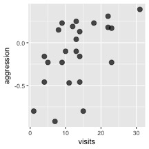
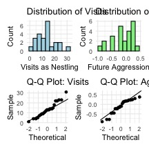
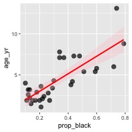
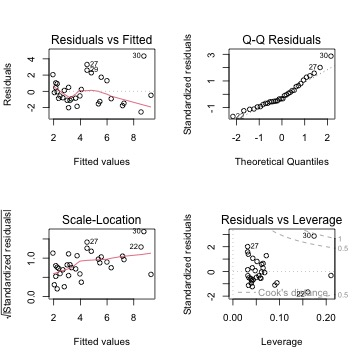
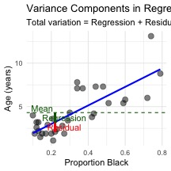
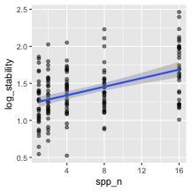

# In class activity 9: Correlation and Linear Regression

## Introduction

This document demonstrates key concepts in correlation and regression analysis using ecological examples, focusing on:

1.  **Understanding correlation vs. regression**
2.  **Calculating and interpreting correlation coefficients**
3.  **Testing correlation assumptions**
4.  **Performing simple linear regression**
5.  **Checking regression assumptions**
6.  **Interpreting regression output and ANOVA tables**

We'll work with real ecological datasets to practice these concepts.

# **Part 1:** Load Required Packages and Data


::: {.cell}

```{.r .cell-code}
# Load required packages
library(tidyverse)  # For data manipulation and visualization
library(patchwork)  # For combining plots
library(car)        # For regression diagnostics
library(broom)      # For tidy model output
```
:::


::: {.cell}

```{.r .cell-code}
# Set seed for reproducible results
set.seed(123)

# Create the datasets from the lecture
# Lion data from Example 17.1
l_df <- tibble(
  prop_black = c(0.21, 0.14, 0.11, 0.13, 0.12, 0.13, 0.12, 0.18, 0.23, 0.22, 
                0.20, 0.17, 0.15, 0.27, 0.26, 0.21, 0.30, 0.42, 0.43, 0.59, 
                0.60, 0.72, 0.29, 0.10, 0.48, 0.44, 0.34, 0.37, 0.34, 0.74, 0.79, 0.51),
  age_yr = c(1.1, 1.5, 1.9, 2.2, 2.6, 3.2, 3.2, 2.9, 2.4, 2.1, 
          1.9, 1.9, 1.9, 1.9, 2.8, 3.6, 4.3, 3.8, 4.2, 5.4, 
          5.8, 6.0, 3.4, 4.0, 7.3, 7.3, 7.8, 7.1, 7.1, 13.1, 8.8, 5.4)
)

# Booby data from Example 16.1
b_df <- tibble(
  visits = c(1, 7, 15, 4, 11, 14, 23, 14, 9, 5, 4, 10, 
            13, 13, 14, 12, 13, 9, 8, 18, 22, 22, 23, 31),
  aggression = c(-0.80, -0.92, -0.80, -0.46, -0.47, -0.46, -0.23, -0.16, 
                 -0.23, -0.23, -0.16, -0.10, -0.10, 0.04, 0.13, 0.19, 
                 0.25, 0.23, 0.15, 0.23, 0.31, 0.18, 0.17, 0.39)
)

# Prairie stability data from Example 17.3
p_df <- tibble(
  spp_n = rep(c(1, 2, 4, 8, 16), times = c(32, 32, 32, 32, 33)),
  log_stability = 1.20 + 0.033 * spp_n + rnorm(161, 0, 0.35)
)
```
:::


::: callout-tip
## Package Overview

- **tidyverse**: Collection of packages for data science
- **patchwork**: Combine multiple ggplot2 plots easily
- **car**: Companion to Applied Regression (diagnostic tools)
- **broom**: Convert statistical objects into tidy data frames
:::

# **Part 2:** Correlation Analysis

::: callout-note
## Correlation Analysis: Data Types and Assumptions

**Data Types Required:**

- **X variable**: Continuous numerical
- **Y variable**: Continuous numerical - Both variables should be measured (not manipulated)

**Assumptions for Pearson Correlation:**

- Random sampling from the population
- Bivariate normality (both variables normally distributed)
- Linear relationship between variables
- No extreme outliers
:::

## Calculating Correlation Coefficients

Let's start with the Nazca booby data to explore correlation:


::: {.cell}

```{.r .cell-code}
# Calculate Pearson correlation coefficient
cor(b_df$visits, b_df$aggression)
```

::: {.cell-output .cell-output-stdout}

```
[1] 0.5337225
```


:::
:::


::: {.cell}

```{.r .cell-code}
# Perform correlation test
cor.test(b_df$visits, b_df$aggression)
```

::: {.cell-output .cell-output-stdout}

```

	Pearson's product-moment correlation

data:  b_df$visits and b_df$aggression
t = 2.9603, df = 22, p-value = 0.007229
alternative hypothesis: true correlation is not equal to 0
95 percent confidence interval:
 0.1660840 0.7710999
sample estimates:
      cor 
0.5337225 
```


:::
:::


::: {.cell}

```{.r .cell-code}
# Calculate Pearson correlation coefficient
cor(b_df$visits, b_df$aggression)
```

::: {.cell-output .cell-output-stdout}

```
[1] 0.5337225
```


:::

```{.r .cell-code}
# Calculate and SAVE the Pearson correlation coefficient
booby_corr <- cor(b_df$visits, b_df$aggression)

# Print the result
booby_corr
```

::: {.cell-output .cell-output-stdout}

```
[1] 0.5337225
```


:::

```{.r .cell-code}
# Calculate R-squared (variance explained)
booby_corr^2
```

::: {.cell-output .cell-output-stdout}

```
[1] 0.2848597
```


:::
:::


## Visualizing the Correlation


::: {.cell}

```{.r .cell-code}
# Create scatterplot with correlation
b_df %>% 
  ggplot(aes(x = visits, y = aggression)) +
  geom_point(size = 3, alpha = 0.7) 
```

::: {.cell-output-display}

:::
:::


::: callout-important
## Activity 1: Interpret the Correlation

Based on the output above, answer these questions:

1.  **Direction**: Is the correlation positive or negative? What does this mean biologically?
    - Your answer: \_\_\_\_\_\_\_\_\_\_\_\_\_\_\_\_\_\_\_\_\_\_\_\_\_\_
2.  **Strength**: How would you classify this correlation (weak, moderate, strong)?
    - Your answer: \_\_\_\_\_\_\_\_\_\_\_\_\_\_\_\_\_\_\_\_\_\_\_\_\_\_
3.  **Significance**: Is the correlation statistically significant? What is the p-value?
    - Your answer: \_\_\_\_\_\_\_\_\_\_\_\_\_\_\_\_\_\_\_\_\_\_\_\_\_\_
4.  **Variance explained**: What percentage of variance in adult aggression is explained by nestling visits?
    - Your answer: \_\_\_\_\_\_\_\_\_\_\_\_\_\_\_\_\_\_\_\_\_\_\_\_\_\_
:::

## Testing Correlation Assumptions


::: {.cell}

```{.r .cell-code}
# Test normality of each variable
shapiro.test(b_df$visits)
```

::: {.cell-output .cell-output-stdout}

```

	Shapiro-Wilk normality test

data:  b_df$visits
W = 0.95783, p-value = 0.3965
```


:::

```{.r .cell-code}
shapiro.test(b_df$aggression)
```

::: {.cell-output .cell-output-stdout}

```

	Shapiro-Wilk normality test

data:  b_df$aggression
W = 0.91575, p-value = 0.04709
```


:::
:::


::: {.cell}

```{.r .cell-code}
# Create diagnostic plots
p1 <- ggplot(b_df, aes(x = visits)) +
  geom_histogram(bins = 10, fill = "lightblue", color = "black") +
  labs(title = "Distribution of Visits", x = "Visits as Nestling", y = "Count") +
  theme_minimal()

p2 <- ggplot(b_df, aes(x = aggression)) +
  geom_histogram(bins = 10, fill = "lightgreen", color = "black") +
  labs(title = "Distribution of Aggression", x = "Future Aggression", y = "Count") +
  theme_minimal()

p3 <- ggplot(b_df, aes(sample = visits)) +
  stat_qq() + stat_qq_line() +
  labs(title = "Q-Q Plot: Visits", x = "Theoretical", y = "Sample") +
  theme_minimal()

p4 <- ggplot(b_df, aes(sample = aggression)) +
  stat_qq() + stat_qq_line() +
  labs(title = "Q-Q Plot: Aggression", x = "Theoretical", y = "Sample") +
  theme_minimal()

# Combine plots
(p1 + p2) / (p3 + p4)
```

::: {.cell-output-display}

:::
:::


::: callout-warning
## When Assumptions Are Violated

If normality assumptions are violated (p \< 0.05 in Shapiro-Wilk test), consider:

1.  **Spearman's rank correlation** (non-parametric alternative)
2.  **Data transformation** (log, square root, etc.)
3.  **Removing outliers** (if justified)

Let's try Spearman's correlation:
:::


::: {.cell}

```{.r .cell-code}
# Calculate Spearman's rank correlation
cor.test(b_df$visits, 
         b_df$aggression, 
         method = "spearman")
```

::: {.cell-output .cell-output-stderr}

```
Warning in cor.test.default(b_df$visits, b_df$aggression, method = "spearman"):
cannot compute exact p-value with ties
```


:::

::: {.cell-output .cell-output-stdout}

```

	Spearman's rank correlation rho

data:  b_df$visits and b_df$aggression
S = 1213.5, p-value = 0.01976
alternative hypothesis: true rho is not equal to 0
sample estimates:
     rho 
0.472374 
```


:::
:::


# **Part 3:** Simple Linear Regression

Now let's move from correlation to regression using the lion nose data.

::: callout-note
## Linear Regression: Data Types and Assumptions

**Data Types Required:**

- **X variable (predictor)**: Continuous numerical
- **Y variable (response)**: Continuous numerical - X can be fixed/controlled, Y is the outcome of interest

**Assumptions for Linear Regression:**

- **Linearity**: Relationship between X and Y is linear

- **Independence**: Observations are independent

- **Homoscedasticity**: Constant variance of residuals

- **Normality**: Residuals are normally distributed

- **No influential outliers**
:::

## Fitting a Linear Regression Model


::: {.cell}

```{.r .cell-code}
# Fit linear regression model
lion_model <- lm(age_yr ~ prop_black, data = l_df)

# Get model summary
summary(lion_model)
```

::: {.cell-output .cell-output-stdout}

```

Call:
lm(formula = age_yr ~ prop_black, data = l_df)

Residuals:
    Min      1Q  Median      3Q     Max 
-2.5449 -1.1117 -0.5285  0.9635  4.3421 

Coefficients:
            Estimate Std. Error t value Pr(>|t|)    
(Intercept)   0.8790     0.5688   1.545    0.133    
prop_black   10.6471     1.5095   7.053 7.68e-08 ***
---
Signif. codes:  0 '***' 0.001 '**' 0.01 '*' 0.05 '.' 0.1 ' ' 1

Residual standard error: 1.669 on 30 degrees of freedom
Multiple R-squared:  0.6238,	Adjusted R-squared:  0.6113 
F-statistic: 49.75 on 1 and 30 DF,  p-value: 7.677e-08
```


:::
:::


::: callout-important
## Activity 2: Interpret the Regression Output

From the regression output above:

1.  **Regression equation**: Write the equation in the form: age = \_\_\_\_\_\_\_\_\_\_\_\_\_\_\_\_\_\_\_\_\_\_\_\_\_\_ + \_\_\_\_\_\_\_\_\_\_\_\_\_\_\_\_\_\_\_\_\_\_\_\_\_\_ × prop_black
    - Your answer: \_\_\_\_\_\_\_\_\_\_\_\_\_\_\_\_\_\_\_\_\_\_\_\_\_\_
2.  **Slope interpretation**: What does the slope value mean in biological terms?
    - Your answer: \_\_\_\_\_\_\_\_\_\_\_\_\_\_\_\_\_\_\_\_\_\_\_\_\_\_
3.  **R-squared**: What percentage of variation in age is explained by nose blackness?
    - Your answer: \_\_\_\_\_\_\_\_\_\_\_\_\_\_\_\_\_\_\_\_\_\_\_\_\_\_
4.  **Significance**: Is the relationship statistically significant? How do you know?
    - Your answer: \_\_\_\_\_\_\_\_\_\_\_\_\_\_\_\_\_\_\_\_\_\_\_\_\_\_
:::

## Visualizing the Regression


::: {.cell}

```{.r .cell-code}
# Create regression plot with confidence interval
l_df %>% 
  ggplot(aes(x = prop_black, y = age_yr)) +
  geom_point(size = 3, alpha = 0.7) +
  geom_smooth(method = "lm", se = TRUE, color = "red", fill = "pink", alpha = 0.3) 
```

::: {.cell-output .cell-output-stderr}

```
`geom_smooth()` using formula = 'y ~ x'
```


:::

::: {.cell-output-display}

:::
:::


::: callout-tip
## Confidence vs. Prediction Intervals

- **Confidence Interval**: Range for the mean age of ALL lions with that nose blackness
- **Prediction Interval**: Range for an INDIVIDUAL lion with that nose blackness
- Prediction intervals are always wider than confidence intervals
:::

# **Part 4:** Testing Regression Assumptions

## Diagnostic Plots


::: {.cell}

```{.r .cell-code}
# Create diagnostic plots
par(mfrow = c(2, 2))
plot(lion_model)
```

::: {.cell-output-display}

:::

```{.r .cell-code}
par(mfrow = c(1, 1))
```
:::


## Interpreting Diagnostic Plots

::: callout-note
## Understanding Regression Diagnostic Plots

1.  **Residuals vs Fitted**:
    - Look for: Random scatter around horizontal line at 0
    - Problems: Patterns indicate non-linearity or heteroscedasticity
2.  **Q-Q Plot**:
    - Look for: Points following the diagonal line
    - Problems: Deviations indicate non-normal residuals
3.  **Scale-Location**:
    - Look for: Random scatter with horizontal trend line
    - Problems: Increasing spread indicates heteroscedasticity
4.  **Residuals vs Leverage**:
    - Look for: Points within Cook's distance lines
    - Problems: Points outside indicate influential observations
:::

## Formal Tests of Assumptions


::: {.cell}

```{.r .cell-code}
# Test for normality of residuals
shapiro_residuals <- shapiro.test(residuals(lion_model))
shapiro_residuals
```

::: {.cell-output .cell-output-stdout}

```

	Shapiro-Wilk normality test

data:  residuals(lion_model)
W = 0.93879, p-value = 0.0692
```


:::
:::


::: {.cell}

```{.r .cell-code}
# Test for homoscedasticity (Breusch-Pagan test)
library(lmtest)
```

::: {.cell-output .cell-output-stderr}

```
Loading required package: zoo
```


:::

::: {.cell-output .cell-output-stderr}

```

Attaching package: 'zoo'
```


:::

::: {.cell-output .cell-output-stderr}

```
The following objects are masked from 'package:base':

    as.Date, as.Date.numeric
```


:::

```{.r .cell-code}
bp_test <- bptest(lion_model)
bp_test
```

::: {.cell-output .cell-output-stdout}

```

	studentized Breusch-Pagan test

data:  lion_model
BP = 6.8946, df = 1, p-value = 0.008646
```


:::
:::


::: callout-important
## Activity 3: Assess Assumption Violations

Based on the diagnostic plots and tests:

1.  **Linearity**: Does the relationship appear linear? (Check Residuals vs Fitted plot)
    - Your answer: \_\_\_\_\_\_\_\_\_\_\_\_\_\_\_\_\_\_\_\_\_\_\_\_\_\_
2.  **Normality**: Are the residuals normally distributed? (Check Q-Q plot and Shapiro test)
    - Your answer: \_\_\_\_\_\_\_\_\_\_\_\_\_\_\_\_\_\_\_\_\_\_\_\_\_\_
3.  **Homoscedasticity**: Is the variance constant? (Check Scale-Location plot and BP test)
    - Your answer: \_\_\_\_\_\_\_\_\_\_\_\_\_\_\_\_\_\_\_\_\_\_\_\_\_\_
4.  **Influential points**: Are there any concerning influential observations?
    - Your answer: \_\_\_\_\_\_\_\_\_\_\_\_\_\_\_\_\_\_\_\_\_\_\_\_\_\_
:::

# **Part 5:** ANOVA for Regression

## Understanding Variance Partitioning


::: {.cell}

```{.r .cell-code}
# Get ANOVA table for regression
anova_table <- anova(lion_model)
anova_table
```

::: {.cell-output .cell-output-stdout}

```
Analysis of Variance Table

Response: age_yr
           Df  Sum Sq Mean Sq F value    Pr(>F)    
prop_black  1 138.544 138.544   49.75 7.677e-08 ***
Residuals  30  83.543   2.785                      
---
Signif. codes:  0 '***' 0.001 '**' 0.01 '*' 0.05 '.' 0.1 ' ' 1
```


:::
:::


::: {.cell}

```{.r .cell-code}
# Calculate sums of squares manually to understand partitioning
ss_total <- sum((l_df$age_yr - mean(l_df$age_yr))^2)
ss_residual <- sum(residuals(lion_model)^2)
ss_regression <- ss_total - ss_residual

print("Manual calculation of sums of squares:")
```

::: {.cell-output .cell-output-stdout}

```
[1] "Manual calculation of sums of squares:"
```


:::

```{.r .cell-code}
print(paste("SS Total:", round(ss_total, 2)))
```

::: {.cell-output .cell-output-stdout}

```
[1] "SS Total: 222.09"
```


:::

```{.r .cell-code}
print(paste("SS Regression:", round(ss_regression, 2)))
```

::: {.cell-output .cell-output-stdout}

```
[1] "SS Regression: 138.54"
```


:::

```{.r .cell-code}
print(paste("SS Residual:", round(ss_residual, 2)))
```

::: {.cell-output .cell-output-stdout}

```
[1] "SS Residual: 83.54"
```


:::

```{.r .cell-code}
print(paste("SS Regression + SS Residual:", round(ss_regression + ss_residual, 2)))
```

::: {.cell-output .cell-output-stdout}

```
[1] "SS Regression + SS Residual: 222.09"
```


:::
:::


## Visualizing Variance Components


::: {.cell}

```{.r .cell-code}
# Create a plot showing variance components
# Get predicted values
l_df$predicted <- predict(lion_model)
mean_age <- mean(l_df$age_yr)

# Select one point to illustrate
example_point <- 10

# Create the visualization
variance_plot <- ggplot(l_df, aes(x = prop_black, y = age_yr)) +
  geom_point(size = 3, alpha = 0.5) +
  geom_smooth(method = "lm", se = FALSE, color = "blue", size = 1) +
  geom_hline(yintercept = mean_age, linetype = "dashed", color = "darkgreen") +
  # Add lines for one example point
  geom_segment(aes(x = prop_black[example_point], 
                   y = age_yr[example_point],
                   xend = prop_black[example_point], 
                   yend = predicted[example_point]),
               color = "red", size = 1) +
  geom_segment(aes(x = prop_black[example_point], 
                   y = predicted[example_point],
                   xend = prop_black[example_point], 
                   yend = mean_age),
               color = "darkgreen", size = 1) +
  # Add labels
  annotate("text", x = 0.15, y = mean_age + 0.5, 
           label = "Mean", color = "darkgreen") +
  annotate("text", x = l_df$prop_black[example_point] + 0.05, 
           y = (l_df$age_yr[example_point] + l_df$predicted[example_point])/2,
           label = "Residual", color = "red") +
  annotate("text", x = l_df$prop_black[example_point] + 0.05, 
           y = (l_df$predicted[example_point] + mean_age)/2,
           label = "Regression", color = "darkgreen") +
  labs(title = "Variance Components in Regression",
       subtitle = "Total variation = Regression + Residual",
       x = "Proportion Black", y = "Age (years)") +
  theme_minimal()

variance_plot
```

::: {.cell-output-display}

:::
:::


# **Part 6:** Comparing Multiple Datasets

Let's practice regression with the prairie biodiversity data:


::: {.cell}

```{.r .cell-code}
# Fit regression for prairie data
prairie_model <- lm(log_stability ~ spp_n, data = p_df)

# Get summary
summary(prairie_model)
```

::: {.cell-output .cell-output-stdout}

```

Call:
lm(formula = log_stability ~ spp_n, data = p_df)

Residuals:
    Min      1Q  Median      3Q     Max 
-0.8146 -0.2165 -0.0094  0.2228  0.7780 

Coefficients:
            Estimate Std. Error t value Pr(>|t|)    
(Intercept) 1.222902   0.039094  31.281  < 2e-16 ***
spp_n       0.028881   0.004694   6.153 5.94e-09 ***
---
Signif. codes:  0 '***' 0.001 '**' 0.01 '*' 0.05 '.' 0.1 ' ' 1

Residual standard error: 0.3271 on 159 degrees of freedom
Multiple R-squared:  0.1923,	Adjusted R-squared:  0.1872 
F-statistic: 37.86 on 1 and 159 DF,  p-value: 5.94e-09
```


:::
:::


::: {.cell}

```{.r .cell-code}
# Create plot
prairie_plot <- ggplot(p_df, aes(x = spp_n, y = log_stability)) +
  geom_point(alpha = 0.5) +
  geom_smooth(method = "lm")

prairie_plot
```

::: {.cell-output .cell-output-stderr}

```
`geom_smooth()` using formula = 'y ~ x'
```


:::

::: {.cell-output-display}

:::
:::


::: callout-important
## Activity 4: Compare the Two Regressions

Compare the lion and prairie regression models:

1.  **Which model explains more variance?** (Compare R² values)
    - Your answer: \_\_\_\_\_\_\_\_\_\_\_\_\_\_\_\_\_\_\_\_\_\_\_\_\_\_
2.  **Which has a stronger relationship?** (Compare standardized slopes or correlation)
    - Your answer: \_\_\_\_\_\_\_\_\_\_\_\_\_\_\_\_\_\_\_\_\_\_\_\_\_\_
3.  **Which has more precise estimates?** (Compare standard errors relative to estimates)
    - Your answer: \_\_\_\_\_\_\_\_\_\_\_\_\_\_\_\_\_\_\_\_\_\_\_\_\_\_
:::

# **Summary and Key Takeaways**

::: callout-tip
## What We Learned Today

1.  **Correlation vs. Regression:**
    - Correlation: Measures association between two variables
    - Regression: Predicts one variable from another
2.  **Assumptions Matter:**
    - Always check assumptions before interpreting results
    - Use appropriate alternatives when assumptions are violated
3.  **Interpretation:**
    - R² tells us proportion of variance explained
    - Slopes tell us rate of change
    - P-values tell us if relationships are statistically significant
4.  **Practical Considerations:**
    - Correlation ≠ Causation
    - Outliers can have major impacts
    - Sample size affects power to detect relationships
:::

::: callout-warning
## Common Mistakes to Avoid

1.  **Using correlation when you mean regression** (or vice versa)
2.  **Ignoring assumption violations**
3.  **Extrapolating beyond the range of data**
4.  **Confusing confidence and prediction intervals**
5.  **Over-interpreting R² values**
6.  **Forgetting about biological significance vs. statistical significance**
:::

## Additional Resources

- Whitlock & Schluter Chapter 16 (Correlation)
- Whitlock & Schluter Chapter 17 (Regression)
- R for Data Science: <https://r4ds.had.co.nz/>
- Quick-R Regression: <https://www.statmethods.net/stats/regression.html>