# Analysis of Net Primary Production in Forests: A Modern Tidyverse Approach

*Based on Michaletz et al. (2014) data*

## Introduction

This analysis examines the relationships between Net Primary Production
(npp) and various climate and forest characteristics across global
forest sites. We'll explore multicollinearity, model selection, and
variable transformations.

**Key Learning Objectives:**

-   Understand multicollinearity in multiple regression
-   Learn model diagnostics and assumption checking
-   Practice variable selection techniques
-   Apply data transformations appropriately


## Load Required Packages


::: {.cell}

```{.r .cell-code}
# Load required packages
library(tidyverse)    # For data manipulation and visualization
library(car)          # For regression diagnostics (VIF, etc.)
library(corrplot)     # For correlation plots
library(GGally)       # For pairs plots
library(broom)        # For tidy model outputs
library(performance)  # For model performance metrics
library(see)          # For better diagnostic plots
```
:::


## Load and Explore the Data


::: {.cell}

```{.r .cell-code}
# Load the forest npp data
forest_df <- read_csv("data/michaletz_etal_2014_clean.csv")
```

::: {.cell-output .cell-output-stderr}

```
Rows: 1220 Columns: 8
── Column specification ────────────────────────────────────────────────────────
Delimiter: ","
chr (1): leaf
dbl (7): npp, age, biomass, season, temp, precip, teb

ℹ Use `spec()` to retrieve the full column specification for this data.
ℹ Specify the column types or set `show_col_types = FALSE` to quiet this message.
```


:::

```{.r .cell-code}
# Display top lines
head(forest_df)
```

::: {.cell-output .cell-output-stdout}

```
# A tibble: 6 × 8
    npp   age biomass season  temp precip   teb leaf     
  <dbl> <dbl>   <dbl>  <dbl> <dbl>  <dbl> <dbl> <chr>    
1  2084  104.  18198.     11 25.3   1888   0.55 broadleaf
2  2234  333.  54523.     12 26.9   2348.  0.6  broadleaf
3  2714  213.  41358.     12 26.9   2348.  0.6  broadleaf
4  2828  114.  31557.     12 26.7   2784.  1.25 broadleaf
5  2882  113.  21417      12 26.7   2784.  1.25 broadleaf
6   774   79   11188       3 -3.53   408.  1.8  broadleaf
```


:::
:::


## Data Preparation

Following the original analysis, we'll focus on the key variables from a
cleaned dataframe

## 1. Initial Exploration: Variable Relationships and Multicollinearity

### Correlation Matrix and Visualization


::: {.cell}

```{.r .cell-code}
# Create correlation matrix for numeric variables only
num_vars <- forest_df %>%
  select_if(is.numeric)

# Calculate correlation matrix
cor_matrix <- cor(num_vars, use = "complete.obs")

# Display correlation matrix
cor_matrix
```

::: {.cell-output .cell-output-stdout}

```
               npp          age    biomass     season       temp       precip
npp      1.0000000 -0.153215979  0.4591083  0.5614272  0.5520590  0.531186333
age     -0.1532160  1.000000000  0.5923809 -0.2715014 -0.2307658  0.003642104
biomass  0.4591083  0.592380901  1.0000000  0.1317097  0.1551923  0.353901541
season   0.5614272 -0.271501387  0.1317097  1.0000000  0.9226905  0.567630275
temp     0.5520590 -0.230765849  0.1551923  0.9226905  1.0000000  0.576659967
precip   0.5311863  0.003642104  0.3539015  0.5676303  0.5766600  1.000000000
teb     -0.3167187 -0.011779155 -0.2748724 -0.2491779 -0.2495479 -0.291376661
                teb
npp     -0.31671865
age     -0.01177916
biomass -0.27487245
season  -0.24917787
temp    -0.24954794
precip  -0.29137666
teb      1.00000000
```


:::
:::


::: {.cell}

```{.r .cell-code}
# Create a visual correlation plot
corrplot(cor_matrix, method = "color", type = "upper", 
         addCoef.col = "grey45", tl.cex = 0.8, number.cex = 0.7)
```

::: {.cell-output-display}
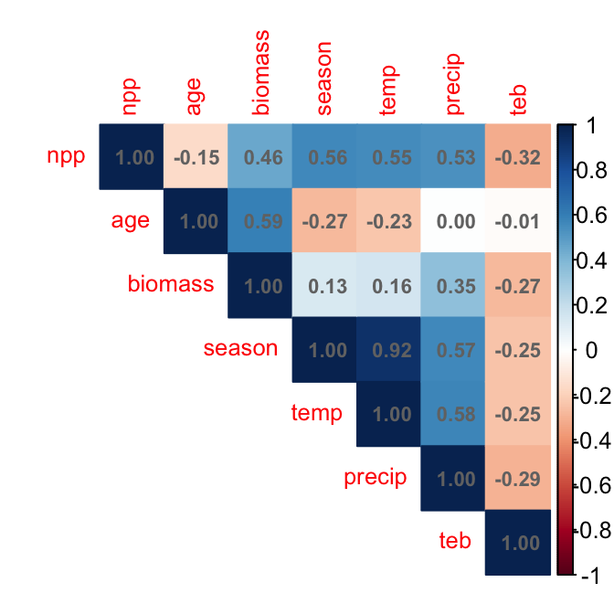{width=336}
:::
:::


### Pairs Plot for Visual Inspection


::: {.cell}

```{.r .cell-code}
# Create pairs plot to visualize relationships
# This replaces the original pairs() function with ggplot2
forest_df %>%
  select(-leaf) %>%  # Exclude categorical variable for pairs plot
  ggpairs(
    upper = list(continuous = wrap("cor", size = 5)),
    lower = list(continuous = wrap("points", alpha = 0.6, size = 0.8))
  ) +
  theme_minimal()
```

::: {.cell-output-display}
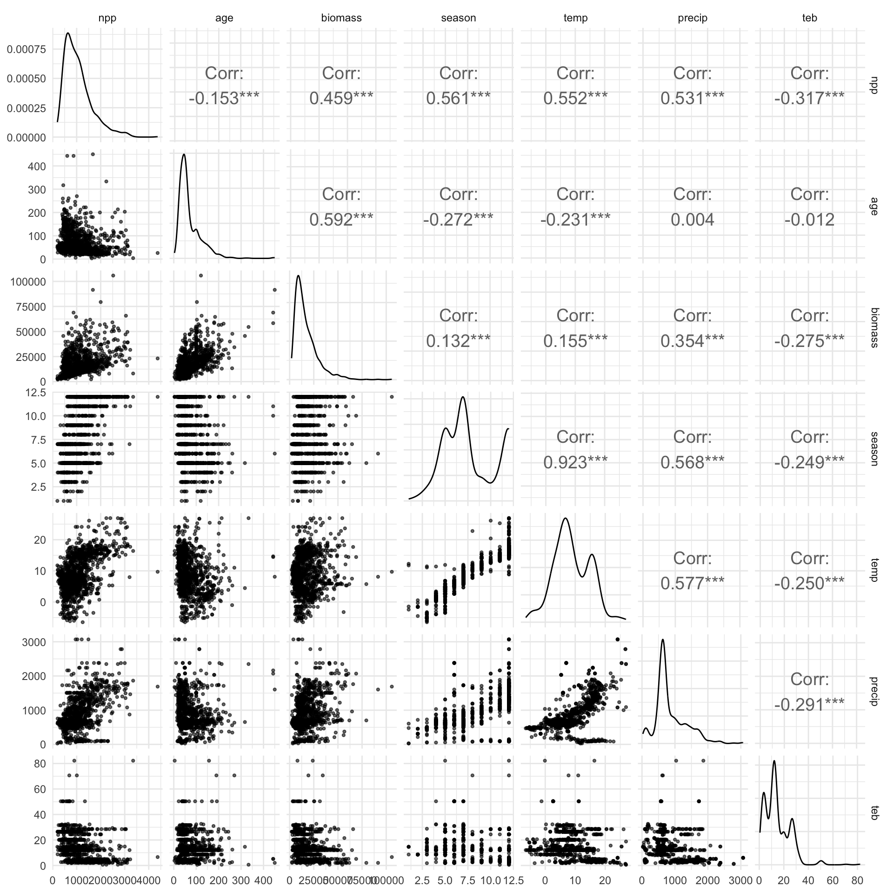{width=960}
:::
:::


## 2. Initial Multiple Regression Model

Let's start with a full model including all predictors:


::: {.cell}

```{.r .cell-code}
# Fit initial model with all predictors (Model 1)
model_init <- lm(npp ~ age + biomass + season + temp + 
             precip + teb + leaf, data = forest_df)

# Get model summary
summary(model_init)
```

::: {.cell-output .cell-output-stdout}

```

Call:
lm(formula = npp ~ age + biomass + season + temp + precip + teb + 
    leaf, data = forest_df)

Residuals:
     Min       1Q   Median       3Q      Max 
-1331.10  -206.27   -34.09   166.94  2760.41 

Coefficients:
              Estimate Std. Error t value Pr(>|t|)    
(Intercept)  583.92959   53.81169  10.851  < 2e-16 ***
age           -4.78822    0.28518 -16.790  < 2e-16 ***
biomass        0.03154    0.00122  25.848  < 2e-16 ***
season        41.18220    9.49073   4.339 1.55e-05 ***
temp           4.61281    4.37372   1.055 0.291788    
precip         0.09674    0.02852   3.392 0.000716 ***
teb           -2.12880    1.08408  -1.964 0.049794 *  
leafneedle  -267.00569   22.43078 -11.904  < 2e-16 ***
---
Signif. codes:  0 '***' 0.001 '**' 0.01 '*' 0.05 '.' 0.1 ' ' 1

Residual standard error: 351.7 on 1212 degrees of freedom
Multiple R-squared:  0.6415,	Adjusted R-squared:  0.6394 
F-statistic: 309.8 on 7 and 1212 DF,  p-value: < 2.2e-16
```


:::
:::


### Check for Multicollinearity


::: {.cell}

```{.r .cell-code}
# Calculate Variance Inflation Factors (VIF)
vif_values <- vif(model_init)
vif_values
```

::: {.cell-output .cell-output-stdout}

```
     age  biomass   season     temp   precip      teb     leaf 
1.993348 2.061766 7.079004 6.972147 1.831127 1.167007 1.236588 
```


:::
:::


::: {.cell}

```{.r .cell-code}
# Create a data frame for better visualization
vif_df <- data.frame(
  Variable = names(vif_values),
  VIF = as.numeric(vif_values)
) %>%
  arrange(desc(VIF))

# Visualize VIF values
ggplot(vif_df, aes(x = reorder(Variable, VIF), y = VIF)) +
  geom_col(fill = "steelblue", alpha = 0.7) +
  geom_hline(yintercept = 10, color = "red", linetype = "dashed", 
             linewidth = 1) +
  geom_hline(yintercept = 5, color = "orange", linetype = "dashed", 
             linewidth = 1) +
  coord_flip() +
  labs(
    title = "Variance Inflation Factors",
    subtitle = "Red line: VIF = 10 (serious concern), Orange line: VIF = 5 (moderate concern)",
    x = "Variables",
    y = "VIF"
  ) +
  theme_minimal()
```

::: {.cell-output-display}
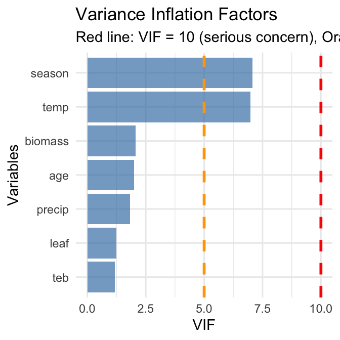{width=336}
:::
:::


### Address Multicollinearity by Removing Growing Season

Based on the original analysis, season and Temperature are highly
correlated. Let's remove season:


::: {.cell}

```{.r .cell-code}
# Model 2: Remove season due to multicollinearity
model_2 <- lm(npp ~ age + biomass + temp + precip + teb + leaf, 
             data = forest_df)

# Model summary
summary(model_2)
```

::: {.cell-output .cell-output-stdout}

```

Call:
lm(formula = npp ~ age + biomass + temp + precip + teb + leaf, 
    data = forest_df)

Residuals:
     Min       1Q   Median       3Q      Max 
-1309.94  -209.40   -42.65   167.71  2898.47 

Coefficients:
              Estimate Std. Error t value Pr(>|t|)    
(Intercept)  7.511e+02  3.785e+01  19.845  < 2e-16 ***
age         -5.004e+00  2.829e-01 -17.690  < 2e-16 ***
biomass      3.180e-02  1.228e-03  25.905  < 2e-16 ***
temp         2.112e+01  2.173e+00   9.718  < 2e-16 ***
precip       1.120e-01  2.851e-02   3.929 9.02e-05 ***
teb         -2.255e+00  1.092e+00  -2.066    0.039 *  
leafneedle  -2.634e+02  2.258e+01 -11.666  < 2e-16 ***
---
Signif. codes:  0 '***' 0.001 '**' 0.01 '*' 0.05 '.' 0.1 ' ' 1

Residual standard error: 354.3 on 1213 degrees of freedom
Multiple R-squared:  0.6359,	Adjusted R-squared:  0.6341 
F-statistic: 353.1 on 6 and 1213 DF,  p-value: < 2.2e-16
```


:::
:::


::: {.cell}

```{.r .cell-code}
# Check VIF again
vif_values2 <- vif(model_2)
vif_values2
```

::: {.cell-output .cell-output-stdout}

```
     age  biomass     temp   precip      teb     leaf 
1.932806 2.056724 1.696787 1.803266 1.166162 1.234906 
```


:::
:::


## 3. Exploring Variable Transformations

### Check the Shape of Relationships with Partial Regression Plots


::: {.cell}

```{.r .cell-code}
# Create partial regression plots (Added Variable Plots)
# This helps us see the relationship between each predictor and response
# after accounting for other variables

par(mfrow = c(2, 3))
avPlots(model_2, main = "Partial Regression Plots")
```

::: {.cell-output-display}
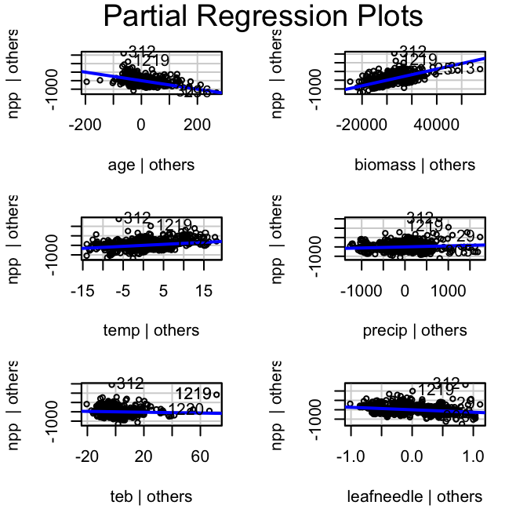{width=336}
:::

```{.r .cell-code}
par(mfrow = c(1, 1))
```
:::


### Apply Log Transformation to age

The original analysis found that age showed a curvy relationship. Let's
try log transformation: REally what you should do is log transform of
the response variable first..


::: {.cell}

```{.r .cell-code}
# Create dataset with log-transformed age
forest_df <- forest_df %>%
  mutate(log_age = log10(age))

# Model 3: With log-transformed age
model_3 <- lm(npp ~ log_age + biomass + temp + precip + teb + leaf, 
             data = forest_df)


# Model summary
summary(model_3)
```

::: {.cell-output .cell-output-stdout}

```

Call:
lm(formula = npp ~ log_age + biomass + temp + precip + teb + 
    leaf, data = forest_df)

Residuals:
     Min       1Q   Median       3Q      Max 
-1282.97  -203.31   -23.13   163.75  2810.76 

Coefficients:
              Estimate Std. Error t value Pr(>|t|)    
(Intercept)  2.237e+03  8.961e+01  24.962  < 2e-16 ***
log_age     -1.012e+03  5.064e+01 -19.973  < 2e-16 ***
biomass      3.313e-02  1.194e-03  27.755  < 2e-16 ***
temp         1.723e+01  2.159e+00   7.982 3.33e-15 ***
precip       7.194e-02  2.781e-02   2.587  0.00981 ** 
teb         -2.315e+00  1.061e+00  -2.183  0.02925 *  
leafneedle  -2.852e+02  2.177e+01 -13.105  < 2e-16 ***
---
Signif. codes:  0 '***' 0.001 '**' 0.01 '*' 0.05 '.' 0.1 ' ' 1

Residual standard error: 344.7 on 1213 degrees of freedom
Multiple R-squared:  0.6553,	Adjusted R-squared:  0.6536 
F-statistic: 384.4 on 6 and 1213 DF,  p-value: < 2.2e-16
```


:::
:::


::: {.cell}

```{.r .cell-code}
# Compare partial regression plots
par(mfrow = c(2, 3))
avPlots(model_3, main = "Partial Regression Plots (Log age)")
```

::: {.cell-output-display}
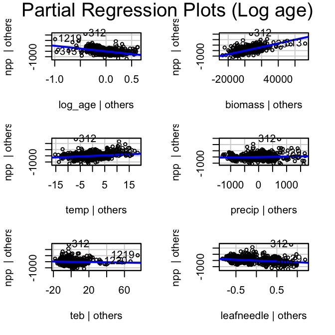{width=336}
:::

```{.r .cell-code}
par(mfrow = c(1, 1))
```
:::


## 4. Model Diagnostics and Assumption Checking


::: {.cell}

```{.r .cell-code}
# Create diagnostic plots
par(mfrow = c(1, 1))
plot(model_3, main = "Model Diagnostics")
```

::: {.cell-output-display}
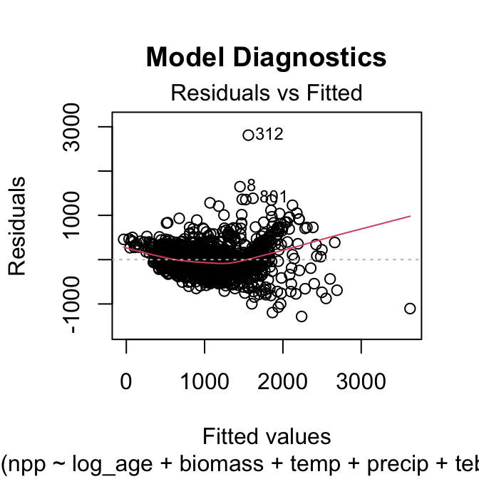{width=336}
:::

::: {.cell-output-display}
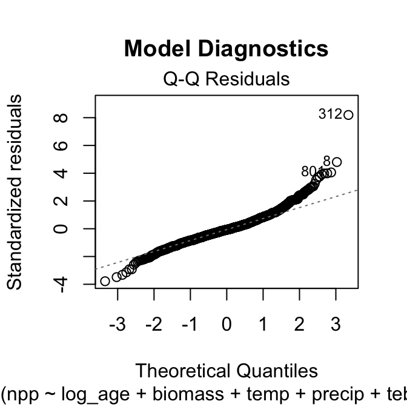{width=336}
:::

::: {.cell-output-display}
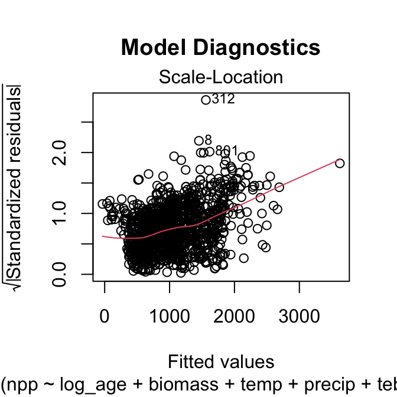{width=336}
:::

::: {.cell-output-display}
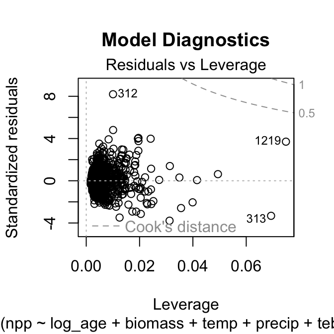{width=336}
:::

```{.r .cell-code}
par(mfrow = c(1, 1))
```
:::


## Residuals - its the upper left above


::: {.cell}

```{.r .cell-code}
# Check for normality of residuals
residuals_data <- data.frame(
  Fitted = fitted(model_3),
  Residuals = residuals(model_3),
  Standardized_Residuals = rstandard(model_3)
)

# Residuals vs Fitted plot using ggplot
ggplot(residuals_data, aes(x = Fitted, y = Residuals)) +
  geom_point(alpha = 0.6) +
  geom_smooth(method = "lm", color = "red") +
  geom_hline(yintercept = 0, linetype = "dashed") +
  labs(
    title = "Residuals vs Fitted Values",
    x = "Fitted Values",
    y = "Residuals"
  ) +
  theme_minimal()
```

::: {.cell-output .cell-output-stderr}

```
`geom_smooth()` using formula = 'y ~ x'
```


:::

::: {.cell-output-display}
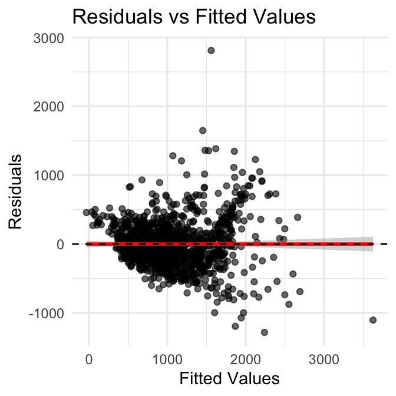{width=336}
:::
:::


### Try Response Variable Transformation

Following the original analysis, let's try a cube root transformation of
npp:


::: {.cell}

```{.r .cell-code}
# Model 4: Cube root transformation of npp
forest_df <- forest_df %>%
  mutate(npp_cuberoot = npp^(1/3))

model_4 <- lm(npp_cuberoot ~ log_age + biomass + temp + precip + 
             teb + leaf, data = forest_df)

summary(model_4)
```

::: {.cell-output .cell-output-stdout}

```

Call:
lm(formula = npp_cuberoot ~ log_age + biomass + temp + precip + 
    teb + leaf, data = forest_df)

Residuals:
    Min      1Q  Median      3Q     Max 
-4.0936 -0.5916 -0.0030  0.6463  5.0795 

Coefficients:
              Estimate Std. Error t value Pr(>|t|)    
(Intercept)  1.391e+01  2.601e-01  53.489  < 2e-16 ***
log_age     -3.151e+00  1.470e-01 -21.436  < 2e-16 ***
biomass      1.032e-04  3.464e-06  29.791  < 2e-16 ***
temp         4.507e-02  6.265e-03   7.194 1.10e-12 ***
precip       6.361e-05  8.072e-05   0.788    0.431    
teb         -1.273e-02  3.078e-03  -4.135 3.79e-05 ***
leafneedle  -1.029e+00  6.317e-02 -16.283  < 2e-16 ***
---
Signif. codes:  0 '***' 0.001 '**' 0.01 '*' 0.05 '.' 0.1 ' ' 1

Residual standard error: 1 on 1213 degrees of freedom
Multiple R-squared:  0.6793,	Adjusted R-squared:  0.6777 
F-statistic: 428.2 on 6 and 1213 DF,  p-value: < 2.2e-16
```


:::
:::


::: {.cell}

```{.r .cell-code}
# Check diagnostics
par(mfrow = c(1, 1))
plot(model_4, main = "Model Diagnostics (Cube Root npp)")
```

::: {.cell-output-display}
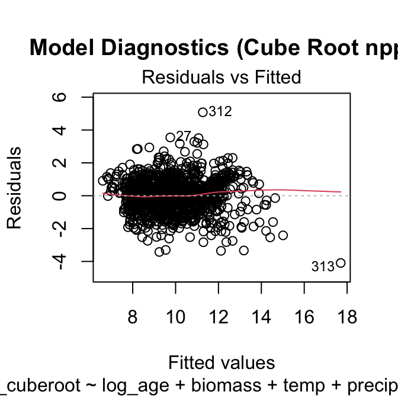{width=336}
:::

::: {.cell-output-display}
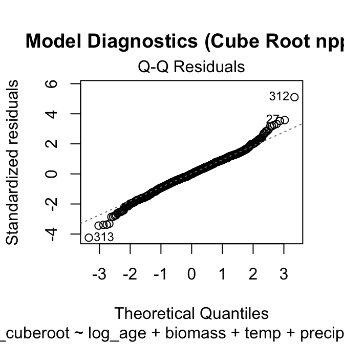{width=336}
:::

::: {.cell-output-display}
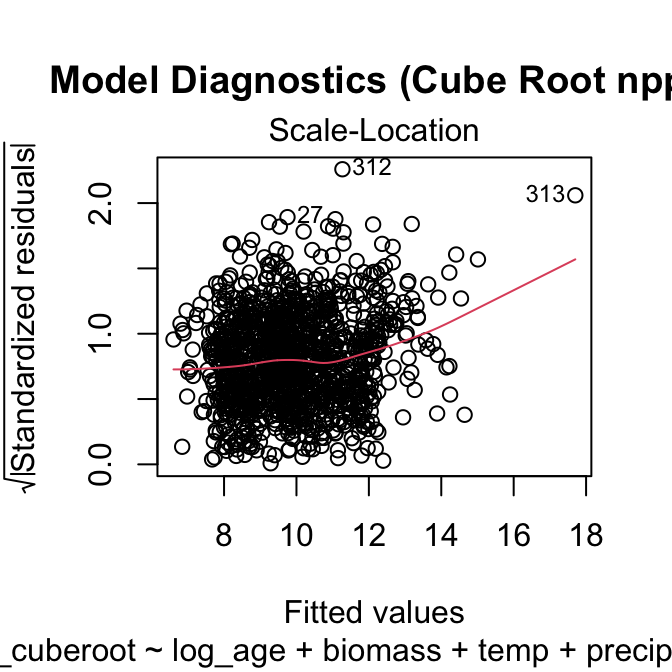{width=336}
:::

::: {.cell-output-display}
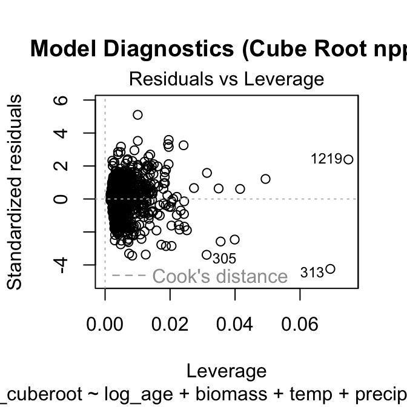{width=336}
:::

```{.r .cell-code}
par(mfrow = c(1, 1))
```
:::


## 5. Model Simplification and Comparison

### Remove Non-significant Variables


::: {.cell}

```{.r .cell-code}
# Model 5: Remove non-significant Precipitation
model_5 <- lm(npp_cuberoot ~ log_age + biomass + temp + teb + leaf, 
             data = forest_df)

summary(model_5)
```

::: {.cell-output .cell-output-stdout}

```

Call:
lm(formula = npp_cuberoot ~ log_age + biomass + temp + teb + 
    leaf, data = forest_df)

Residuals:
    Min      1Q  Median      3Q     Max 
-4.1085 -0.5919  0.0019  0.6459  5.1261 

Coefficients:
              Estimate Std. Error t value Pr(>|t|)    
(Intercept)  1.396e+01  2.532e-01  55.120  < 2e-16 ***
log_age     -3.159e+00  1.465e-01 -21.559  < 2e-16 ***
biomass      1.040e-04  3.306e-06  31.465  < 2e-16 ***
temp         4.719e-02  5.658e-03   8.342  < 2e-16 ***
teb         -1.296e-02  3.064e-03  -4.231  2.5e-05 ***
leafneedle  -1.040e+00  6.150e-02 -16.910  < 2e-16 ***
---
Signif. codes:  0 '***' 0.001 '**' 0.01 '*' 0.05 '.' 0.1 ' ' 1

Residual standard error: 1 on 1214 degrees of freedom
Multiple R-squared:  0.6791,	Adjusted R-squared:  0.6778 
F-statistic: 513.9 on 5 and 1214 DF,  p-value: < 2.2e-16
```


:::
:::


::: {.cell}

```{.r .cell-code}
# Compare models using AIC
model_comparison <- data.frame(
  Model = c("Model 4 (Full)", "Model 5 (No precip)"),
  AIC = c(AIC(model_4), AIC(model_5)),
  R_squared = c(summary(model_4)$r.squared, summary(model_5)$r.squared),
  Adj_R_squared = c(summary(model_4)$adj.r.squared, summary(model_5)$adj.r.squared)
)

model_comparison
```

::: {.cell-output .cell-output-stdout}

```
                Model      AIC R_squared Adj_R_squared
1      Model 4 (Full) 3472.092 0.6792946     0.6777082
2 Model 5 (No precip) 3470.717 0.6791304     0.6778089
```


:::
:::


### Model Performance and Interpretation


::: {.cell}

```{.r .cell-code}
# Get tidy summary of final model
summary(model_5, conf.int = TRUE)
```

::: {.cell-output .cell-output-stdout}

```

Call:
lm(formula = npp_cuberoot ~ log_age + biomass + temp + teb + 
    leaf, data = forest_df)

Residuals:
    Min      1Q  Median      3Q     Max 
-4.1085 -0.5919  0.0019  0.6459  5.1261 

Coefficients:
              Estimate Std. Error t value Pr(>|t|)    
(Intercept)  1.396e+01  2.532e-01  55.120  < 2e-16 ***
log_age     -3.159e+00  1.465e-01 -21.559  < 2e-16 ***
biomass      1.040e-04  3.306e-06  31.465  < 2e-16 ***
temp         4.719e-02  5.658e-03   8.342  < 2e-16 ***
teb         -1.296e-02  3.064e-03  -4.231  2.5e-05 ***
leafneedle  -1.040e+00  6.150e-02 -16.910  < 2e-16 ***
---
Signif. codes:  0 '***' 0.001 '**' 0.01 '*' 0.05 '.' 0.1 ' ' 1

Residual standard error: 1 on 1214 degrees of freedom
Multiple R-squared:  0.6791,	Adjusted R-squared:  0.6778 
F-statistic: 513.9 on 5 and 1214 DF,  p-value: < 2.2e-16
```


:::
:::


## using the sensemaker package


::: {.cell}

```{.r .cell-code}
library(sensemakr)
# Calculate partial R-squared for all variables at once
partial_r2_sensemakr <- partial_r2(model_5)
partial_r2_sensemakr
```

::: {.cell-output .cell-output-stdout}

```
(Intercept)     log_age     biomass        temp         teb  leafneedle 
 0.71450239  0.27686109  0.44919401  0.05421045  0.01453129  0.19064332 
```


:::
:::


::: {.cell}

```{.r .cell-code}
# Calculate partial R-squared for each variable
# Using the car package
print("Using car package Anova() with Type III sums of squares:")
```

::: {.cell-output .cell-output-stdout}

```
[1] "Using car package Anova() with Type III sums of squares:"
```


:::

```{.r .cell-code}
anova_type2 <- Anova(model_5, type = "III")
print(anova_type2)
```

::: {.cell-output .cell-output-stdout}

```
Anova Table (Type III tests)

Response: npp_cuberoot
             Sum Sq   Df  F value    Pr(>F)    
(Intercept) 3039.52    1 3038.225 < 2.2e-16 ***
log_age      464.99    1  464.792 < 2.2e-16 ***
biomass      990.47    1  990.043 < 2.2e-16 ***
temp          69.61    1   69.584 < 2.2e-16 ***
teb           17.91    1   17.901 2.502e-05 ***
leaf         286.08    1  285.957 < 2.2e-16 ***
Residuals   1214.52 1214                       
---
Signif. codes:  0 '***' 0.001 '**' 0.01 '*' 0.05 '.' 0.1 ' ' 1
```


:::

```{.r .cell-code}
# Convert F-statistics to partial R-squared
# Partial R² = F * df_num / (F * df_num + df_den)
f_stats <- anova_type2$`F value`[!is.na(anova_type2$`F value`)]
df_num <- anova_type2$Df[!is.na(anova_type2$`F value`)]
df_den <- anova_type2$Df[nrow(anova_type2)]  # Residual df

partial_r2_from_f <- f_stats * df_num / (f_stats * df_num + df_den)

results_table <- data.frame(
  Variable = rownames(anova_type2)[!is.na(anova_type2$`F value`)],
  F_statistic = f_stats,
  p_value = anova_type2$`Pr(>F)`[!is.na(anova_type2$`F value`)],
  Partial_R_squared = partial_r2_from_f
)

print("Complete results with partial R-squared:")
```

::: {.cell-output .cell-output-stdout}

```
[1] "Complete results with partial R-squared:"
```


:::

```{.r .cell-code}
print(results_table)
```

::: {.cell-output .cell-output-stdout}

```
     Variable F_statistic       p_value Partial_R_squared
1 (Intercept)  3038.22472  0.000000e+00        0.71450239
2     log_age   464.79225  1.532052e-87        0.27686109
3     biomass   990.04285 2.085787e-159        0.44919401
4        temp    69.58365  1.967636e-16        0.05421045
5         teb    17.90111  2.501886e-05        0.01453129
6        leaf   285.95672  9.100842e-58        0.19064332
```


:::
:::


## 6. Alternative Approach: Standardized Variables

Following the original analysis, let's also try the standardized
approach:


::: {.cell}

```{.r .cell-code}
# Create standardized variables
forest_standardized <- forest_df %>%
  mutate(
    npp_sqrt_scaled = scale(sqrt(npp))[,1],
    log_age_scaled = scale(log10(age))[,1],
    biomass_scaled = scale(biomass)[,1],
    temp_scaled = scale(temp)[,1],
    precip_scaled = scale(precip)[,1],
    teb_scaled = scale(teb)[,1]
  )

# Standardized model
model_std <- lm(npp_sqrt_scaled ~ log_age_scaled + biomass_scaled + 
                temp_scaled * precip_scaled + teb_scaled, 
                data = forest_standardized)

# Summary
summary(model_std)
```

::: {.cell-output .cell-output-stdout}

```

Call:
lm(formula = npp_sqrt_scaled ~ log_age_scaled + biomass_scaled + 
    temp_scaled * precip_scaled + teb_scaled, data = forest_standardized)

Residuals:
     Min       1Q   Median       3Q      Max 
-3.14438 -0.38836 -0.03068  0.39178  3.01216 

Coefficients:
                           Estimate Std. Error t value Pr(>|t|)    
(Intercept)               -0.064952   0.020075  -3.235 0.001247 ** 
log_age_scaled            -0.543699   0.024500 -22.192  < 2e-16 ***
biomass_scaled             0.691415   0.025313  27.315  < 2e-16 ***
temp_scaled                0.215693   0.023304   9.256  < 2e-16 ***
precip_scaled             -0.008188   0.028714  -0.285 0.775563    
teb_scaled                -0.071775   0.018879  -3.802 0.000151 ***
temp_scaled:precip_scaled  0.112727   0.017068   6.605 5.94e-11 ***
---
Signif. codes:  0 '***' 0.001 '**' 0.01 '*' 0.05 '.' 0.1 ' ' 1

Residual standard error: 0.6113 on 1213 degrees of freedom
Multiple R-squared:  0.6281,	Adjusted R-squared:  0.6263 
F-statistic: 341.5 on 6 and 1213 DF,  p-value: < 2.2e-16
```


:::
:::


## 7. Key Findings and Conclusions

1.  MULTICOLLINEARITY:

    -   Growing season length and temperature were highly correlated
    -   Removed growing season to address multicollinearity

2.  VARIABLE TRANSFORMATIONS:

    -   Log transformation of age improved model fit
    -   Cube root transformation of npp addressed assumption violations

3.  FINAL MODEL RESULTS:

    -   Significant predictors: age (negative), biomass (positive), temp
        (positive)
    -   teb had negative effect, Leaf type differences were significant

4.  BIOLOGICAL INTERPRETATION:

    -   Younger stands had higher npp (for given biomass)
    -   Higher biomass associated with higher npp
    -   temp positively related to npp
    -   Coniferous forests had lower npp than broadleaf forests

## References and Additional Notes

This analysis is based on:

-   **Michaletz, S.T., Cheng, D., Kerkhoff, A.J. & Enquist, B.J.**
    (2014). Convergence of terrestrial plant production across global
    climate gradients. *Nature*, 512, 39-43.

**Key Learning Points:**

1.  **Multicollinearity Detection**: Use VIF values and correlation
    matrices
2.  **Variable Transformations**: Log and power transformations can
    improve model fit
3.  **Model Diagnostics**: Always check residual plots and assumption
    violations
4.  **Model Comparison**: Use AIC and other criteria for model selection
5.  **Interpretation**: Focus on biologically meaningful relationships


::: {.cell}

```{.r .cell-code}
# Session information for reproducibility
sessionInfo()
```

::: {.cell-output .cell-output-stdout}

```
R version 4.6.0 (2026-04-24)
Platform: aarch64-apple-darwin23
Running under: macOS Tahoe 26.4.1

Matrix products: default
BLAS:   /Library/Frameworks/R.framework/Versions/4.6/Resources/lib/libRblas.0.dylib 
LAPACK: /Library/Frameworks/R.framework/Versions/4.6/Resources/lib/libRlapack.dylib;  LAPACK version 3.12.1

locale:
[1] en_US.UTF-8/en_US.UTF-8/en_US.UTF-8/C/en_US.UTF-8/en_US.UTF-8

time zone: America/Chicago
tzcode source: internal

attached base packages:
[1] stats     graphics  grDevices utils     datasets  methods   base     

other attached packages:
 [1] sensemakr_0.1.6    see_0.13.0         performance_0.16.0 broom_1.0.12      
 [5] GGally_2.4.0       corrplot_0.95      car_3.1-5          carData_3.0-6     
 [9] lubridate_1.9.5    forcats_1.0.1      stringr_1.6.0      dplyr_1.2.1       
[13] purrr_1.2.2        readr_2.2.0        tidyr_1.3.2        tibble_3.3.1      
[17] ggplot2_4.0.3      tidyverse_2.0.0   

loaded via a namespace (and not attached):
 [1] gtable_0.3.6       xfun_0.57          htmlwidgets_1.6.4  insight_1.5.0     
 [5] lattice_0.22-9     tzdb_0.5.0         vctrs_0.7.3        tools_4.6.0       
 [9] generics_0.1.4     stats4_4.6.0       parallel_4.6.0     pkgconfig_2.0.3   
[13] Matrix_1.7-5       RColorBrewer_1.1-3 S7_0.2.2           lifecycle_1.0.5   
[17] compiler_4.6.0     farver_2.1.2       codetools_0.2-20   htmltools_0.5.9   
[21] yaml_2.3.12        Formula_1.2-5      pillar_1.11.1      crayon_1.5.3      
[25] abind_1.4-8        nlme_3.1-169       ggstats_0.13.0     tidyselect_1.2.1  
[29] digest_0.6.39      stringi_1.8.7      labeling_0.4.3     splines_4.6.0     
[33] fastmap_1.2.0      grid_4.6.0         cli_3.6.6          magrittr_2.0.5    
[37] utf8_1.2.6         withr_3.0.2        scales_1.4.0       backports_1.5.1   
[41] bit64_4.8.0        timechange_0.4.0   rmarkdown_2.31     bit_4.6.0         
[45] otel_0.2.0         hms_1.1.4          evaluate_1.0.5     knitr_1.51        
[49] mgcv_1.9-4         rlang_1.2.0        glue_1.8.1         vroom_1.7.1       
[53] jsonlite_2.0.0     R6_2.6.1          
```


:::
:::

