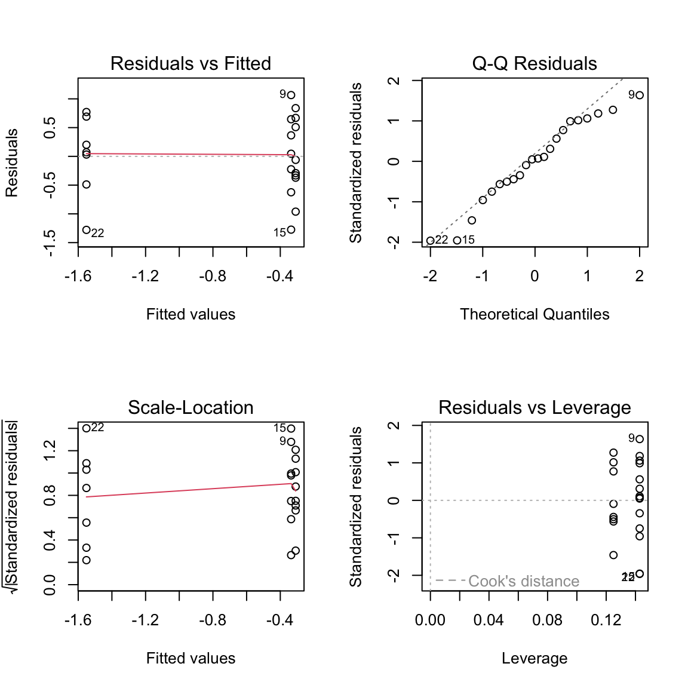
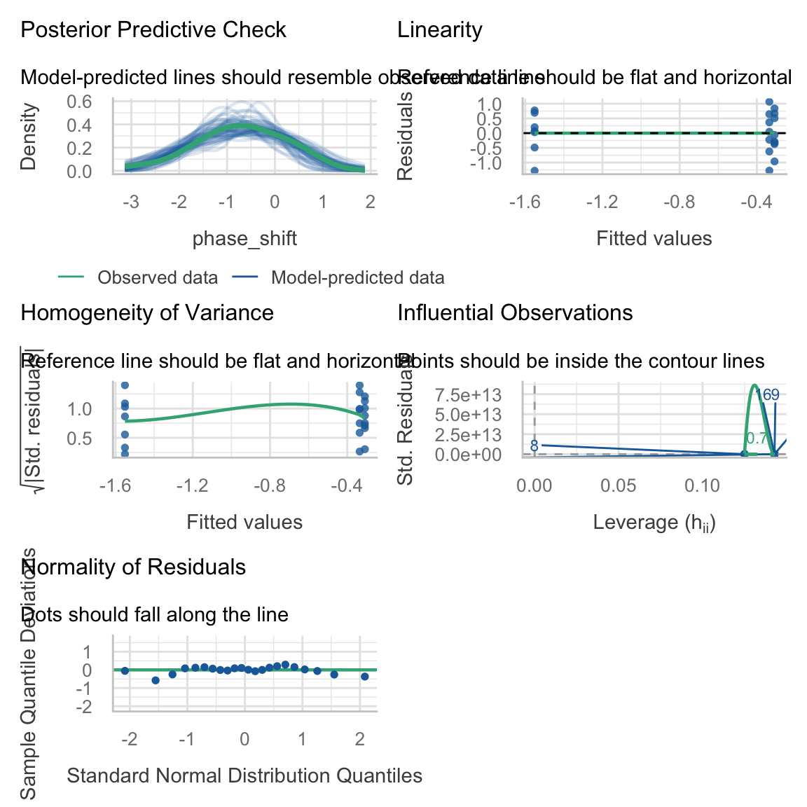
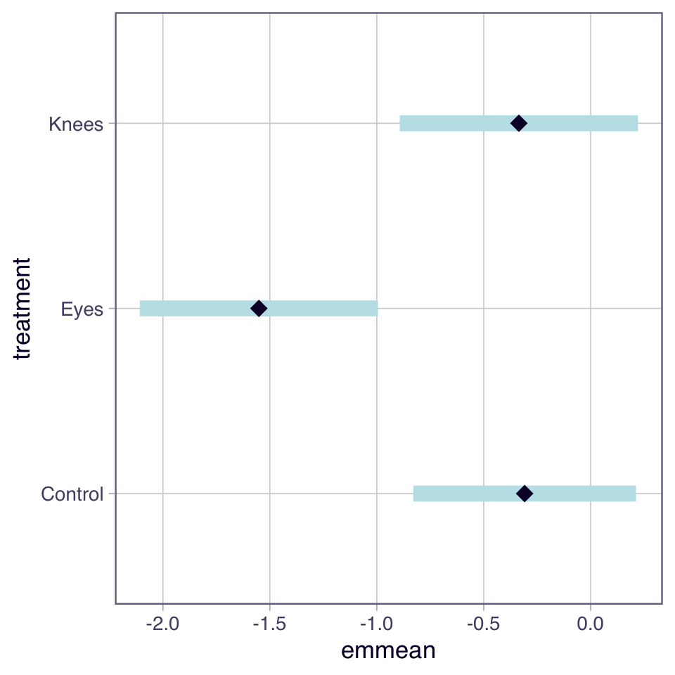
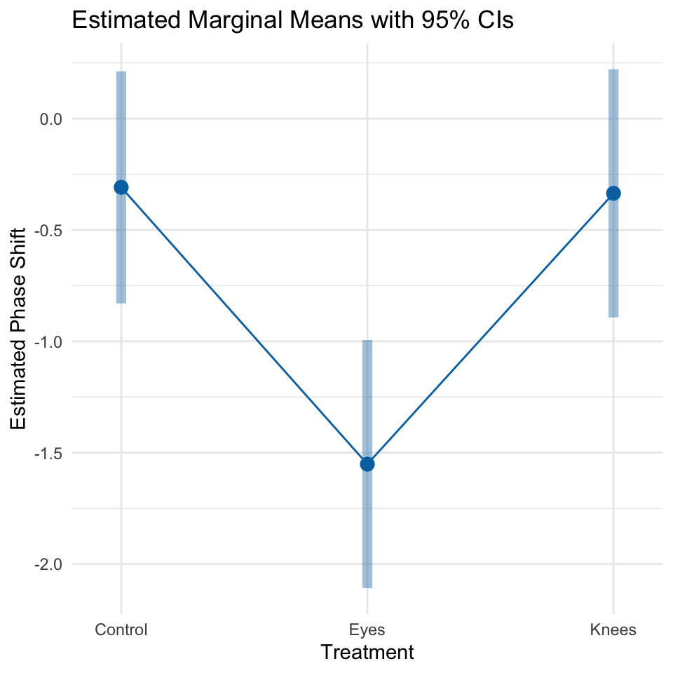
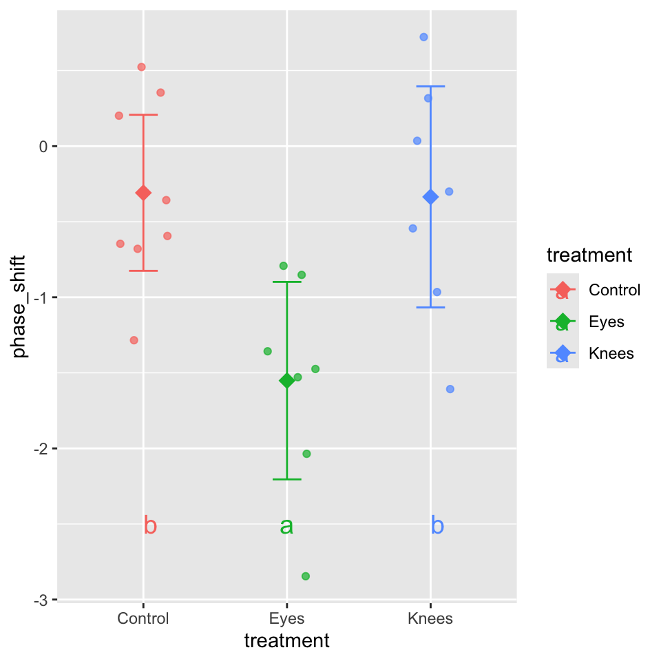
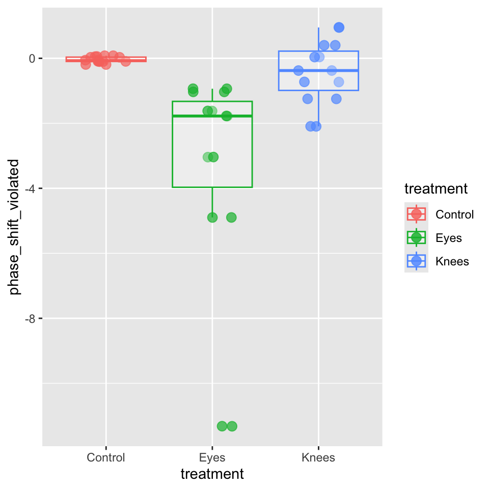
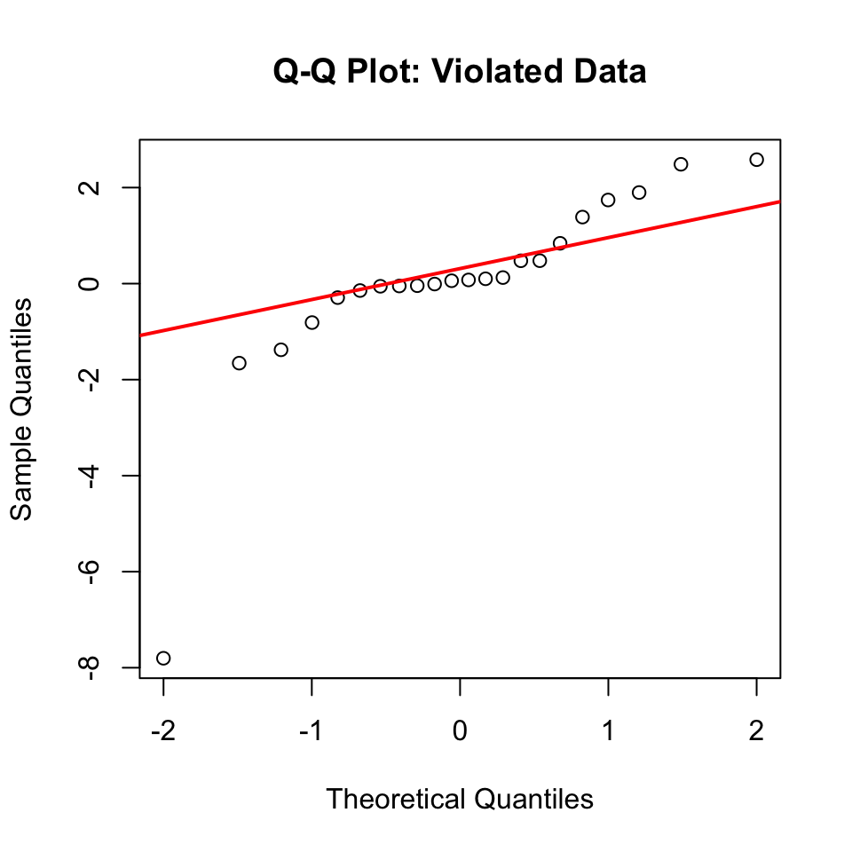

::: {.cell}

```{.r .cell-code}
#| message: false
#| warning: false

library(performance)
library(FSA)
```

::: {.cell-output .cell-output-stderr}

```
## FSA v0.10.1. See citation('FSA') if used in publication.
## Run fishR() for related website and fishR('IFAR') for related book.
```


:::

```{.r .cell-code}
library(ggfortify)
```

::: {.cell-output .cell-output-stderr}

```
Loading required package: ggplot2
```


:::

```{.r .cell-code}
library(car)         # functions for regression diagnostics, ANOVA, and VIF
```

::: {.cell-output .cell-output-stderr}

```
Loading required package: carData
```


:::

::: {.cell-output .cell-output-stderr}

```
Registered S3 methods overwritten by 'car':
  method       from
  hist.boot    FSA 
  confint.boot FSA 
```


:::

::: {.cell-output .cell-output-stderr}

```

Attaching package: 'car'
```


:::

::: {.cell-output .cell-output-stderr}

```
The following object is masked from 'package:FSA':

    bootCase
```


:::

```{.r .cell-code}
library(emmeans)     # calculates and compares adjusted means from statistical models
```

::: {.cell-output .cell-output-stderr}

```
Welcome to emmeans.
Caution: You lose important information if you filter this package's results.
See '? untidy'
```


:::

```{.r .cell-code}
library(patchwork)   # Combines multiple ggplot2 plots into a single composite figure
library(broom)       # Converts statistical model outputs into tidy data frames
library(tidyverse)   # includes ggplot2, dplyr, tidyr, etc.
```

::: {.cell-output .cell-output-stderr}

```
── Attaching core tidyverse packages ──────────────────────── tidyverse 2.0.0 ──
✔ dplyr     1.2.1     ✔ readr     2.2.0
✔ forcats   1.0.1     ✔ stringr   1.6.0
✔ lubridate 1.9.5     ✔ tibble    3.3.1
✔ purrr     1.2.2     ✔ tidyr     1.3.2
```


:::

::: {.cell-output .cell-output-stderr}

```
── Conflicts ────────────────────────────────────────── tidyverse_conflicts() ──
✖ dplyr::filter() masks stats::filter()
✖ dplyr::lag()    masks stats::lag()
✖ dplyr::recode() masks car::recode()
✖ purrr::some()   masks car::some()
ℹ Use the conflicted package (<http://conflicted.r-lib.org/>) to force all conflicts to become errors
```


:::
:::


::: {.cell}

```{.r .cell-code}
#| message: false
#| warning: false
#| paged-print: false
c_df <- tibble(
  treatment = rep(c("Control", "Knees", "Eyes"), times = c(8, 7, 7)),
  phase_shift = c(0.53, 0.36, 0.20, -0.37, -0.60, -0.64, -0.68, -1.27,  # Control
                 0.73, 0.31, 0.03, -0.29, -0.56, -0.96, -1.61,          # Knees
                 -0.78, -0.86, -1.35, -1.48, -1.52, -2.04, -2.83)       # Eyes
)

c_df
```

::: {.cell-output .cell-output-stdout}

```
# A tibble: 22 × 2
   treatment phase_shift
   <chr>           <dbl>
 1 Control          0.53
 2 Control          0.36
 3 Control          0.2 
 4 Control         -0.37
 5 Control         -0.6 
 6 Control         -0.64
 7 Control         -0.68
 8 Control         -1.27
 9 Knees            0.73
10 Knees            0.31
# ℹ 12 more rows
```


:::
:::


::: {.cell}

```{.r .cell-code}
# Plot the data
c_plot <- ggplot(c_df, aes(x = treatment, y = phase_shift, color = treatment)) +
  geom_point(position = position_jitter(width=0.1)) +
  stat_summary(fun = mean, geom = "point", size = 5, shape = 18) +
  stat_summary(fun.data = "mean_se", geom = "errorbar", width = 0.2) 
c_plot
```

::: {.cell-output-display}
{width=480}
:::
:::


::: {.cell}

```{.r .cell-code}
#| paged-print: false

# Fit ANOVA model_aov
model_aov <- lm(phase_shift ~ treatment, data = c_df)

summary(model_aov)
```

::: {.cell-output .cell-output-stdout}

```

Call:
lm(formula = phase_shift ~ treatment, data = c_df)

Residuals:
     Min       1Q   Median       3Q      Max 
-1.27857 -0.36125  0.03857  0.61147  1.06571 

Coefficients:
               Estimate Std. Error t value Pr(>|t|)   
(Intercept)    -0.30875    0.24888  -1.241  0.22988   
treatmentEyes  -1.24268    0.36433  -3.411  0.00293 **
treatmentKnees -0.02696    0.36433  -0.074  0.94178   
---
Signif. codes:  0 '***' 0.001 '**' 0.01 '*' 0.05 '.' 0.1 ' ' 1

Residual standard error: 0.7039 on 19 degrees of freedom
Multiple R-squared:  0.4342,	Adjusted R-squared:  0.3746 
F-statistic: 7.289 on 2 and 19 DF,  p-value: 0.004472
```


:::
:::


::: {.cell}

```{.r .cell-code}
# ANOVA table 
Anova(model_aov)
```

::: {.cell-output .cell-output-stdout}

```
Anova Table (Type II tests)

Response: phase_shift
          Sum Sq Df F value   Pr(>F)   
treatment 7.2245  2  7.2894 0.004472 **
Residuals 9.4153 19                    
---
Signif. codes:  0 '***' 0.001 '**' 0.01 '*' 0.05 '.' 0.1 ' ' 1
```


:::
:::


# ANOVA-Assumptions and Diagnostics

ANOVA has the same assumptions as the two-sample t-test, but applied to all k groups:

1.  **Random samples** from corresponding populations
2.  **Normality**: residuals are normally distributed
3.  **Homogeneity of variance**: variance is the same in all treatments
4.  **Independence**: observations are independent

**Checking assumptions**:

- Normality: Q-Q plots, histogram of residuals, Shapiro-Wilk test
- Homogeneity: plot residuals vs. predicted values or x-values
- Independence: examine experimental design

# **Lecture 12:** ANOVA diagnostics

This is the default output of base R assumption tests


::: {.cell}

```{.r .cell-code}
# Create diagnostic plots
par(mfrow = c(2, 2))
plot(model_aov)
```

::: {.cell-output-display}
{width=576}
:::

```{.r .cell-code}
par(mfrow = c(1, 1))
```
:::


# Performance package for daignostics


::: {.cell}

```{.r .cell-code}
check_model(model_aov)
```

::: {.cell-output-display}
{width=576}
:::
:::


# ANOVA Diagnostics

Levene's test of homogeneity of variance

- Null Hypothesis is that they are homogeneous
- So you want a non significant result here


::: {.cell}

```{.r .cell-code}
#| message: false
#| warning: false
#| paged-print: false

## Using the car package to check assumptions
# Levene's test for homogeneity of variance
levene_test <- leveneTest(phase_shift ~ treatment, data = c_df)
```

::: {.cell-output .cell-output-stderr}

```
Warning in leveneTest.default(y = y, group = group, ...): group coerced to
factor.
```


:::

```{.r .cell-code}
levene_test 
```

::: {.cell-output .cell-output-stdout}

```
Levene's Test for Homogeneity of Variance (center = median)
      Df F value Pr(>F)
group  2  0.1586 0.8545
      19               
```


:::
:::


# **Lecture 12:** ANOVA Diagnostics

Shapiro-Wilk Normality Test

- Null Hypothesis is that they are normally distributed
- So you want a **non significant** result here


::: {.cell}

```{.r .cell-code}
#| message: false
#| warning: false
#| paged-print: false


# Normality test of residuals
shapiro_test <- shapiro.test(residuals(model_aov))
shapiro_test 
```

::: {.cell-output .cell-output-stdout}

```

	Shapiro-Wilk normality test

data:  residuals(model_aov)
W = 0.95893, p-value = 0.468
```


:::
:::


# **Lecture 12:** ANOVA Post-Hoc Testing

When ANOVA rejects H₀, we need to determine which groups differ.

**Example**: Using Tukey's HSD to compare all pairs of treatments in the circadian rhythm data.

first we calculate the estimate marginal means


::: {.cell}

```{.r .cell-code}
emmeans_df <- emmeans(model_aov, "treatment")
emmeans_df
```

::: {.cell-output .cell-output-stdout}

```
 treatment emmean    SE df lower.CL upper.CL
 Control   -0.309 0.249 19   -0.830    0.212
 Eyes      -1.551 0.266 19   -2.108   -0.995
 Knees     -0.336 0.266 19   -0.893    0.221

Confidence level used: 0.95 
```


:::
:::


# What Are Estimated Marginal Means?

**Estimated Marginal Means (EMMs)**, also called **least-squares means**, are model-based predictions of group means that come from your fitted statistical model rather than directly from your raw data.

## Key Concepts

In a **one-way ANOVA**, EMMs are straightforward:

- **EMMs = Group means** (when you have balanced data and no covariates)
- They represent the "expected" or "predicted" value for each group according to your model
- They're called "marginal" because in more complex designs, they're averaged over (or "marginalized" over) other factors

## Why Use EMMs Instead of Simple Means?

For one-way ANOVA, you might wonder: "Why not just use `group_by() %>% summarize(mean())`?"

Here's why EMMs are valuable:

1.  **Consistency across models**: EMMs work the same way whether you have one-way ANOVA, two-way ANOVA, ANCOVA, or more complex designs
2.  **Built-in inference**: The `emmeans` package provides standard errors, confidence intervals, and easy comparisons
3.  **Adjusted means**: In more complex models (with covariates), EMMs give you adjusted means at meaningful reference points
4.  **Professional reporting**: EMMs are the standard in academic publications

# How Are EMMs Calculated?

## In One-Way ANOVA: EMMs = Group Means

Let's verify this by comparing EMMs to simple group means:


::: {.cell}

```{.r .cell-code}
# Calculate simple group means
group_means <- c_df %>%
  group_by(treatment) %>%
  summarize(
    sample_mean = mean(phase_shift),
    sample_sd = sd(phase_shift),
    n = n()
  )

# Get EMMs as a data frame
emm_df <- as.data.frame(emmeans_df)

# Combine for comparison
comparison <- group_means %>%
  left_join(emm_df %>% select(treatment, emmean, SE), 
            by = "treatment") %>%
  mutate(
    difference = round(sample_mean - emmean, 10)  # Round to show they're identical
  )

comparison
```

::: {.cell-output .cell-output-stdout}

```
# A tibble: 3 × 7
  treatment sample_mean sample_sd     n emmean    SE difference
  <chr>           <dbl>     <dbl> <int>  <dbl> <dbl>      <dbl>
1 Control        -0.309     0.618     8 -0.309 0.249          0
2 Eyes           -1.55      0.706     7 -1.55  0.266          0
3 Knees          -0.336     0.791     7 -0.336 0.266          0
```


:::
:::


**Key insight**: In a one-way ANOVA, the EMMs are **exactly equal** to the group means!

## The Mathematical Formula

For one-way ANOVA, the EMM for group $j$ is calculated as:

$$\text{EMM}_j = \hat{\beta}_0 + \hat{\beta}_j$$

Where: - $\hat{\beta}_0$ is the intercept (mean of reference group) - $\hat{\beta}_j$ is the coefficient for group $j$ (or 0 for the reference group)

### take home is in this case emmeans = the means


::: {.cell}

```{.r .cell-code}
pairwise_comparisons <- pairs(emmeans_df, adjust = "sidak")
pairwise_comparisons
```

::: {.cell-output .cell-output-stdout}

```
 contrast        estimate    SE df t.ratio p.value
 Control - Eyes     1.243 0.364 19   3.411  0.0088
 Control - Knees    0.027 0.364 19   0.074  0.9998
 Eyes - Knees      -1.216 0.376 19  -3.231  0.0131

P value adjustment: sidak method for 3 tests 
```


:::
:::


- What is the ESTIMATE?

  - The estimate is the **difference between two group means**.

  - What is the SE (Standard Error)?

    - The SE is the **standard error of the difference** between two means.

    - It tells you how much uncertainty there is in your estimate of the difference. The SE depends on:

      - The variability within each group (residual variance from your model)
      - The sample sizes of the groups being compared

  - How They Work Together

    - The t-ratio = estimate / SE tells you how many standard errors away from zero your difference is:

      - Control - Eyes: 1.243 / 0.364 = 3.41 → far from zero → significant!
      - Control - Knees: 0.027 / 0.364 = 0.074 → very close to zero → not significant


::: {.cell}

```{.r .cell-code}
# Letters to indicate groups with similar means
letter_groups <- multcomp::cld(emmeans_df, Letters = letters, adjust = "sidak")
letter_groups
```

::: {.cell-output .cell-output-stdout}

```
 treatment emmean    SE df lower.CL upper.CL .group
 Eyes      -1.551 0.266 19    -2.25   -0.855  a    
 Knees     -0.336 0.266 19    -1.03    0.361   b   
 Control   -0.309 0.249 19    -0.96    0.343   b   

Confidence level used: 0.95 
Conf-level adjustment: sidak method for 3 estimates 
P value adjustment: sidak method for 3 tests 
significance level used: alpha = 0.05 
NOTE: If two or more means share the same grouping symbol,
      then we cannot show them to be different.
      But we also did not show them to be the same. 
```


:::
:::


## Can do in one go as well


::: {.cell}

```{.r .cell-code}
#| message: false
#| warning: false
#| paged-print: false

# Using emmeans package for post-hoc comparisons
# Compact letter display (grouping)
cld_result <- emmeans(model_aov, "treatment") %>% 
  multcomp::cld(Letters = letters, adjust = "sidak")
cld_result
```

::: {.cell-output .cell-output-stdout}

```
 treatment emmean    SE df lower.CL upper.CL .group
 Eyes      -1.551 0.266 19    -2.25   -0.855  a    
 Knees     -0.336 0.266 19    -1.03    0.361   b   
 Control   -0.309 0.249 19    -0.96    0.343   b   

Confidence level used: 0.95 
Conf-level adjustment: sidak method for 3 estimates 
P value adjustment: sidak method for 3 tests 
significance level used: alpha = 0.05 
NOTE: If two or more means share the same grouping symbol,
      then we cannot show them to be different.
      But we also did not show them to be the same. 
```


:::
:::


# Plotting the EMMEANS


::: {.cell}

```{.r .cell-code}
plot(emmeans_df)
```

::: {.cell-output-display}
{width=480}
:::
:::


# **Lecture 12:** ANOVA Post-Hoc Testing


::: {.cell}

```{.r .cell-code}
#| message: false
#| warning: false
#| paged-print: false

# Using emmeans package for post-hoc comparisons
# Visualize the results
emmip(model_aov, ~ treatment, CIs = TRUE) +
  theme_minimal() +
  labs(title = "Estimated Marginal Means with 95% CIs",
       x = "Treatment",
       y = "Estimated Phase Shift")
```

::: {.cell-output-display}
{width=480}
:::
:::


# Planned comparisons


::: {.cell}

```{.r .cell-code}
levels(c_df$treatment)  # See the order
```

::: {.cell-output .cell-output-stdout}

```
NULL
```


:::

```{.r .cell-code}
# Get estimated marginal means
emm <- emmeans(model_aov, "treatment")

# Define your specific planned comparison
planned_contrasts <- contrast(emm,
                              method = list(
                                "control vs eyes" = c(1, -1,  0),
                                "control vs knees" = c(1, 0, -1))) 

# View results
planned_contrasts
```

::: {.cell-output .cell-output-stdout}

```
 contrast         estimate    SE df t.ratio p.value
 control vs eyes     1.243 0.364 19   3.411  0.0029
 control vs knees    0.027 0.364 19   0.074  0.9418
```


:::
:::


# **Lecture 12:** ANOVA Post-Hoc Testing


::: {.cell}
::: {.cell-output-display}
{width=480}
:::
:::


# **Lecture 12:** ANOVA Reporting results

**Formal scientific writing example:**

"The effect of light treatment on circadian rhythm phase shift was analyzed using a one-way ANOVA. There was a significant effect of treatment on phase shift (F(2, 19) = 7.29, p = 0.004, η² = 0.43). Post-hoc comparisons using Tukey's HSD test indicated that the mean phase shift for the Eyes treatment (M = -1.55 h, SD = 0.71) was significantly different from both the Control treatment (M = -0.31 h, SD = 0.62) and the Knees treatment (M = -0.34 h, SD = 0.79). However, the Control and Knees treatments did not significantly differ from each other. These results suggest that light exposure to the eyes, but not to the knees, impacts circadian rhythm phase shifts."

# NON PARAMETRIC ANOVA


::: {.cell}

```{.r .cell-code}
# Create data with outliers and skewness
set.seed(42)
v_circ_df <- c_df %>%
  mutate(
    phase_shift_violated = case_when(
      # Control: Very tight, almost no variance
      treatment == "Control" ~ phase_shift * 0.15,
      
      # Knees: Also tight variance  
      treatment == "Knees" ~ phase_shift * 1.3,
      
      # Eyes: EXTREME spread - compress middle values, huge outliers
      treatment == "Eyes" ~ {
        n <- length(phase_shift)
        c(phase_shift[1:(n-3)] * 1.2,      # Very compressed normal values
          phase_shift[(n-2)] * 2,          # Moderate outlier
          phase_shift[(n-1)] * 2.4,          # Extreme outlier 1
          phase_shift[n] *4)              # EXTREME outlier 2
      }
    )
  )

# Fit model with violated assumptions
violated_model <- lm(phase_shift_violated ~ treatment, 
                     data = v_circ_df)
```
:::


::: {.cell}

```{.r .cell-code}
ggplot(v_circ_df, 
       aes(x = treatment, y = phase_shift_violated, 
           color = treatment)) +
  geom_jitter(width = 0.2, alpha = 0.7, size = 3) +
  geom_boxplot(alpha = 0.3, outlier.shape = NA) +
geom_jitter(width = 0.2, alpha = 0.7, size = 3)
```

::: {.cell-output-display}
{width=480}
:::

```{.r .cell-code}
  theme_minimal() +
  labs(title = "Modified Data with Violations",
       subtitle = "Median with IQR",
       x = "Light Treatment",
       y = "Phase Shift (hours)") 
```

::: {.cell-output .cell-output-stdout}

```
<theme> List of 147
 $ line                            : <ggplot2::element_line>
  ..@ colour       : chr "black"
  ..@ linewidth    : num 0.5
  ..@ linetype     : num 1
  ..@ lineend      : chr "butt"
  ..@ linejoin     : chr "round"
  ..@ arrow        : logi FALSE
  ..@ arrow.fill   : chr "black"
  ..@ inherit.blank: logi TRUE
 $ rect                            : <ggplot2::element_rect>
  ..@ fill         : chr "white"
  ..@ colour       : chr "black"
  ..@ linewidth    : num 0.5
  ..@ linetype     : num 1
  ..@ linejoin     : chr "round"
  ..@ inherit.blank: logi TRUE
 $ text                            : <ggplot2::element_text>
  ..@ family       : chr ""
  ..@ face         : chr "plain"
  ..@ italic       : chr NA
  ..@ fontweight   : num NA
  ..@ fontwidth    : num NA
  ..@ colour       : chr "black"
  ..@ size         : num 11
  ..@ hjust        : num 0.5
  ..@ vjust        : num 0.5
  ..@ angle        : num 0
  ..@ lineheight   : num 0.9
  ..@ margin       : <ggplot2::margin> num [1:4] 0 0 0 0
  ..@ debug        : logi FALSE
  ..@ inherit.blank: logi TRUE
 $ title                           : chr "Modified Data with Violations"
 $ point                           : <ggplot2::element_point>
  ..@ colour       : chr "black"
  ..@ shape        : num 19
  ..@ size         : num 1.5
  ..@ fill         : chr "white"
  ..@ stroke       : num 0.5
  ..@ inherit.blank: logi TRUE
 $ polygon                         : <ggplot2::element_polygon>
  ..@ fill         : chr "white"
  ..@ colour       : chr "black"
  ..@ linewidth    : num 0.5
  ..@ linetype     : num 1
  ..@ linejoin     : chr "round"
  ..@ inherit.blank: logi TRUE
 $ geom                            : <ggplot2::element_geom>
  ..@ ink        : chr "black"
  ..@ paper      : chr "white"
  ..@ accent     : chr "#3366FF"
  ..@ linewidth  : num 0.5
  ..@ borderwidth: num 0.5
  ..@ linetype   : int 1
  ..@ bordertype : int 1
  ..@ family     : chr ""
  ..@ fontsize   : num 3.87
  ..@ pointsize  : num 1.5
  ..@ pointshape : num 19
  ..@ colour     : NULL
  ..@ fill       : NULL
 $ spacing                         : 'simpleUnit' num 5.5points
  ..- attr(*, "unit")= int 8
 $ margins                         : <ggplot2::margin> num [1:4] 5.5 5.5 5.5 5.5
 $ aspect.ratio                    : NULL
 $ axis.title                      : NULL
 $ axis.title.x                    : <ggplot2::element_text>
  ..@ family       : NULL
  ..@ face         : NULL
  ..@ italic       : chr NA
  ..@ fontweight   : num NA
  ..@ fontwidth    : num NA
  ..@ colour       : NULL
  ..@ size         : NULL
  ..@ hjust        : NULL
  ..@ vjust        : num 1
  ..@ angle        : NULL
  ..@ lineheight   : NULL
  ..@ margin       : <ggplot2::margin> num [1:4] 2.75 0 0 0
  ..@ debug        : NULL
  ..@ inherit.blank: logi TRUE
 $ axis.title.x.top                : <ggplot2::element_text>
  ..@ family       : NULL
  ..@ face         : NULL
  ..@ italic       : chr NA
  ..@ fontweight   : num NA
  ..@ fontwidth    : num NA
  ..@ colour       : NULL
  ..@ size         : NULL
  ..@ hjust        : NULL
  ..@ vjust        : num 0
  ..@ angle        : NULL
  ..@ lineheight   : NULL
  ..@ margin       : <ggplot2::margin> num [1:4] 0 0 2.75 0
  ..@ debug        : NULL
  ..@ inherit.blank: logi TRUE
 $ axis.title.x.bottom             : NULL
 $ axis.title.y                    : <ggplot2::element_text>
  ..@ family       : NULL
  ..@ face         : NULL
  ..@ italic       : chr NA
  ..@ fontweight   : num NA
  ..@ fontwidth    : num NA
  ..@ colour       : NULL
  ..@ size         : NULL
  ..@ hjust        : NULL
  ..@ vjust        : num 1
  ..@ angle        : num 90
  ..@ lineheight   : NULL
  ..@ margin       : <ggplot2::margin> num [1:4] 0 2.75 0 0
  ..@ debug        : NULL
  ..@ inherit.blank: logi TRUE
 $ axis.title.y.left               : NULL
 $ axis.title.y.right              : <ggplot2::element_text>
  ..@ family       : NULL
  ..@ face         : NULL
  ..@ italic       : chr NA
  ..@ fontweight   : num NA
  ..@ fontwidth    : num NA
  ..@ colour       : NULL
  ..@ size         : NULL
  ..@ hjust        : NULL
  ..@ vjust        : num 1
  ..@ angle        : num -90
  ..@ lineheight   : NULL
  ..@ margin       : <ggplot2::margin> num [1:4] 0 0 0 2.75
  ..@ debug        : NULL
  ..@ inherit.blank: logi TRUE
 $ axis.text                       : <ggplot2::element_text>
  ..@ family       : NULL
  ..@ face         : NULL
  ..@ italic       : chr NA
  ..@ fontweight   : num NA
  ..@ fontwidth    : num NA
  ..@ colour       : chr "#4D4D4DFF"
  ..@ size         : 'rel' num 0.8
  ..@ hjust        : NULL
  ..@ vjust        : NULL
  ..@ angle        : NULL
  ..@ lineheight   : NULL
  ..@ margin       : NULL
  ..@ debug        : NULL
  ..@ inherit.blank: logi TRUE
 $ axis.text.x                     : <ggplot2::element_text>
  ..@ family       : NULL
  ..@ face         : NULL
  ..@ italic       : chr NA
  ..@ fontweight   : num NA
  ..@ fontwidth    : num NA
  ..@ colour       : NULL
  ..@ size         : NULL
  ..@ hjust        : NULL
  ..@ vjust        : num 1
  ..@ angle        : NULL
  ..@ lineheight   : NULL
  ..@ margin       : <ggplot2::margin> num [1:4] 2.2 0 0 0
  ..@ debug        : NULL
  ..@ inherit.blank: logi TRUE
 $ axis.text.x.top                 : <ggplot2::element_text>
  ..@ family       : NULL
  ..@ face         : NULL
  ..@ italic       : chr NA
  ..@ fontweight   : num NA
  ..@ fontwidth    : num NA
  ..@ colour       : NULL
  ..@ size         : NULL
  ..@ hjust        : NULL
  ..@ vjust        : NULL
  ..@ angle        : NULL
  ..@ lineheight   : NULL
  ..@ margin       : <ggplot2::margin> num [1:4] 0 0 4.95 0
  ..@ debug        : NULL
  ..@ inherit.blank: logi TRUE
 $ axis.text.x.bottom              : <ggplot2::element_text>
  ..@ family       : NULL
  ..@ face         : NULL
  ..@ italic       : chr NA
  ..@ fontweight   : num NA
  ..@ fontwidth    : num NA
  ..@ colour       : NULL
  ..@ size         : NULL
  ..@ hjust        : NULL
  ..@ vjust        : NULL
  ..@ angle        : NULL
  ..@ lineheight   : NULL
  ..@ margin       : <ggplot2::margin> num [1:4] 4.95 0 0 0
  ..@ debug        : NULL
  ..@ inherit.blank: logi TRUE
 $ axis.text.y                     : <ggplot2::element_text>
  ..@ family       : NULL
  ..@ face         : NULL
  ..@ italic       : chr NA
  ..@ fontweight   : num NA
  ..@ fontwidth    : num NA
  ..@ colour       : NULL
  ..@ size         : NULL
  ..@ hjust        : num 1
  ..@ vjust        : NULL
  ..@ angle        : NULL
  ..@ lineheight   : NULL
  ..@ margin       : <ggplot2::margin> num [1:4] 0 2.2 0 0
  ..@ debug        : NULL
  ..@ inherit.blank: logi TRUE
 $ axis.text.y.left                : <ggplot2::element_text>
  ..@ family       : NULL
  ..@ face         : NULL
  ..@ italic       : chr NA
  ..@ fontweight   : num NA
  ..@ fontwidth    : num NA
  ..@ colour       : NULL
  ..@ size         : NULL
  ..@ hjust        : NULL
  ..@ vjust        : NULL
  ..@ angle        : NULL
  ..@ lineheight   : NULL
  ..@ margin       : <ggplot2::margin> num [1:4] 0 4.95 0 0
  ..@ debug        : NULL
  ..@ inherit.blank: logi TRUE
 $ axis.text.y.right               : <ggplot2::element_text>
  ..@ family       : NULL
  ..@ face         : NULL
  ..@ italic       : chr NA
  ..@ fontweight   : num NA
  ..@ fontwidth    : num NA
  ..@ colour       : NULL
  ..@ size         : NULL
  ..@ hjust        : NULL
  ..@ vjust        : NULL
  ..@ angle        : NULL
  ..@ lineheight   : NULL
  ..@ margin       : <ggplot2::margin> num [1:4] 0 0 0 4.95
  ..@ debug        : NULL
  ..@ inherit.blank: logi TRUE
 $ axis.text.theta                 : NULL
 $ axis.text.r                     : <ggplot2::element_text>
  ..@ family       : NULL
  ..@ face         : NULL
  ..@ italic       : chr NA
  ..@ fontweight   : num NA
  ..@ fontwidth    : num NA
  ..@ colour       : NULL
  ..@ size         : NULL
  ..@ hjust        : num 0.5
  ..@ vjust        : NULL
  ..@ angle        : NULL
  ..@ lineheight   : NULL
  ..@ margin       : <ggplot2::margin> num [1:4] 0 2.2 0 2.2
  ..@ debug        : NULL
  ..@ inherit.blank: logi TRUE
 $ axis.ticks                      : <ggplot2::element_blank>
 $ axis.ticks.x                    : NULL
 $ axis.ticks.x.top                : NULL
 $ axis.ticks.x.bottom             : NULL
 $ axis.ticks.y                    : NULL
 $ axis.ticks.y.left               : NULL
 $ axis.ticks.y.right              : NULL
 $ axis.ticks.theta                : NULL
 $ axis.ticks.r                    : NULL
 $ axis.minor.ticks.x.top          : NULL
 $ axis.minor.ticks.x.bottom       : NULL
 $ axis.minor.ticks.y.left         : NULL
 $ axis.minor.ticks.y.right        : NULL
 $ axis.minor.ticks.theta          : NULL
 $ axis.minor.ticks.r              : NULL
 $ axis.ticks.length               : 'rel' num 0.5
 $ axis.ticks.length.x             : NULL
 $ axis.ticks.length.x.top         : NULL
 $ axis.ticks.length.x.bottom      : NULL
 $ axis.ticks.length.y             : NULL
 $ axis.ticks.length.y.left        : NULL
 $ axis.ticks.length.y.right       : NULL
 $ axis.ticks.length.theta         : NULL
 $ axis.ticks.length.r             : NULL
 $ axis.minor.ticks.length         : 'rel' num 0.75
 $ axis.minor.ticks.length.x       : NULL
 $ axis.minor.ticks.length.x.top   : NULL
 $ axis.minor.ticks.length.x.bottom: NULL
 $ axis.minor.ticks.length.y       : NULL
 $ axis.minor.ticks.length.y.left  : NULL
 $ axis.minor.ticks.length.y.right : NULL
 $ axis.minor.ticks.length.theta   : NULL
 $ axis.minor.ticks.length.r       : NULL
 $ axis.line                       : <ggplot2::element_blank>
 $ axis.line.x                     : NULL
 $ axis.line.x.top                 : NULL
 $ axis.line.x.bottom              : NULL
 $ axis.line.y                     : NULL
 $ axis.line.y.left                : NULL
 $ axis.line.y.right               : NULL
 $ axis.line.theta                 : NULL
 $ axis.line.r                     : NULL
 $ legend.background               : <ggplot2::element_blank>
 $ legend.margin                   : NULL
 $ legend.spacing                  : 'rel' num 2
 $ legend.spacing.x                : NULL
 $ legend.spacing.y                : NULL
 $ legend.key                      : <ggplot2::element_blank>
 $ legend.key.size                 : 'simpleUnit' num 1.2lines
  ..- attr(*, "unit")= int 3
 $ legend.key.height               : NULL
 $ legend.key.width                : NULL
 $ legend.key.spacing              : NULL
 $ legend.key.spacing.x            : NULL
 $ legend.key.spacing.y            : NULL
 $ legend.key.justification        : NULL
 $ legend.frame                    : NULL
 $ legend.ticks                    : NULL
 $ legend.ticks.length             : 'rel' num 0.2
 $ legend.axis.line                : NULL
 $ legend.text                     : <ggplot2::element_text>
  ..@ family       : NULL
  ..@ face         : NULL
  ..@ italic       : chr NA
  ..@ fontweight   : num NA
  ..@ fontwidth    : num NA
  ..@ colour       : NULL
  ..@ size         : 'rel' num 0.8
  ..@ hjust        : NULL
  ..@ vjust        : NULL
  ..@ angle        : NULL
  ..@ lineheight   : NULL
  ..@ margin       : NULL
  ..@ debug        : NULL
  ..@ inherit.blank: logi TRUE
 $ legend.text.position            : NULL
 $ legend.title                    : <ggplot2::element_text>
  ..@ family       : NULL
  ..@ face         : NULL
  ..@ italic       : chr NA
  ..@ fontweight   : num NA
  ..@ fontwidth    : num NA
  ..@ colour       : NULL
  ..@ size         : NULL
  ..@ hjust        : num 0
  ..@ vjust        : NULL
  ..@ angle        : NULL
  ..@ lineheight   : NULL
  ..@ margin       : NULL
  ..@ debug        : NULL
  ..@ inherit.blank: logi TRUE
 $ legend.title.position           : NULL
 $ legend.position                 : chr "right"
 $ legend.position.inside          : NULL
 $ legend.direction                : NULL
 $ legend.byrow                    : NULL
 $ legend.justification            : chr "center"
 $ legend.justification.top        : NULL
 $ legend.justification.bottom     : NULL
 $ legend.justification.left       : NULL
 $ legend.justification.right      : NULL
 $ legend.justification.inside     : NULL
  [list output truncated]
 @ complete: logi TRUE
 @ validate: logi TRUE
```


:::
:::


::: {.cell}

```{.r .cell-code}
# Shapiro-Wilk test on residuals
shapiro.test(resid(violated_model))
```

::: {.cell-output .cell-output-stdout}

```

	Shapiro-Wilk normality test

data:  resid(violated_model)
W = 0.7246, p-value = 4.091e-05
```


:::
:::


::: {.cell}

```{.r .cell-code}
# Q-Q plot
qqnorm(resid(violated_model), 
       main = "Q-Q Plot: Violated Data")
qqline(resid(violated_model), col = "red", lwd = 2)
```

::: {.cell-output-display}
{width=480}
:::
:::


::: {.cell}

```{.r .cell-code}
# Levene's test
leveneTest(phase_shift_violated ~ treatment, 
           data = v_circ_df)
```

::: {.cell-output .cell-output-stderr}

```
Warning in leveneTest.default(y = y, group = group, ...): group coerced to
factor.
```


:::

::: {.cell-output .cell-output-stdout}

```
Levene's Test for Homogeneity of Variance (center = median)
      Df F value Pr(>F)
group  2  2.4082 0.1169
      19               
```


:::
:::


# Performing the Kruskal-Wallis Test

:::: columns
::: {.column width="60%"}
## Running Kruskal-Wallis on Original Data

**Even though assumptions are met, let's compare results:**


::: {.cell}

```{.r .cell-code}
# Kruskal-Wallis test on original data
kruskal_original_result <- kruskal.test(
  phase_shift ~ treatment, 
  data = c_df
)

# Display results
kruskal_original_result
```

::: {.cell-output .cell-output-stdout}

```

	Kruskal-Wallis rank sum test

data:  phase_shift by treatment
Kruskal-Wallis chi-squared = 9.4231, df = 2, p-value = 0.008991
```


:::
:::

:::
::::

**Compare to parametric ANOVA:**


::: {.cell}

```{.r .cell-code}
anova(model_aov)
```

::: {.cell-output .cell-output-stdout}

```
Analysis of Variance Table

Response: phase_shift
          Df Sum Sq Mean Sq F value   Pr(>F)   
treatment  2 7.2245  3.6122  7.2894 0.004472 **
Residuals 19 9.4153  0.4955                    
---
Signif. codes:  0 '***' 0.001 '**' 0.01 '*' 0.05 '.' 0.1 ' ' 1
```


:::
:::


# Kruskal-Wallis on Violated Data

## Non-Parametric Test Handles Violations

**Running Kruskal-Wallis on data with assumption violations:**


::: {.cell}

```{.r .cell-code}
# Kruskal-Wallis test on violated data
kruskal_violated_result <- kruskal.test(
  phase_shift_violated ~ treatment, 
  data = v_circ_df
)

kruskal_violated_result
```

::: {.cell-output .cell-output-stdout}

```

	Kruskal-Wallis rank sum test

data:  phase_shift_violated by treatment
Kruskal-Wallis chi-squared = 11.282, df = 2, p-value = 0.00355
```


:::
:::


**Compare parametric ANOVA on same violated data:**


::: {.cell}

```{.r .cell-code}
anova(violated_model)
```

::: {.cell-output .cell-output-stdout}

```
Analysis of Variance Table

Response: phase_shift_violated
          Df Sum Sq Mean Sq F value  Pr(>F)  
treatment  2 52.190 26.0951  5.5781 0.01242 *
Residuals 19 88.884  4.6781                  
---
Signif. codes:  0 '***' 0.001 '**' 0.01 '*' 0.05 '.' 0.1 ' ' 1
```


:::
:::


**Key observations:** - Both tests still detect differences - Kruskal-Wallis more robust to violations - Parametric test may give misleading results when assumptions violated - Non-parametric test maintains validity

# Post-Hoc Tests for Kruskal-Wallis

::::: columns
::: {.column width="60%"}
## Pairwise Comparisons After Significant Kruskal-Wallis

**Just like ANOVA, we need post-hoc tests to identify which groups differ:**


::: {.cell}

```{.r .cell-code}
# Pairwise Wilcoxon rank sum tests with 
# Bonferroni correction
pairwise_original_result <- pairwise.wilcox.test(
  x = v_circ_df$phase_shift,
  g = v_circ_df$treatment,
  p.adjust.method = "bonferroni"
)

pairwise_original_result
```

::: {.cell-output .cell-output-stdout}

```

	Pairwise comparisons using Wilcoxon rank sum exact test 

data:  v_circ_df$phase_shift and v_circ_df$treatment 

      Control Eyes  
Eyes  0.0037  -     
Knees 1.0000  0.0787

P value adjustment method: bonferroni 
```


:::
:::


**Interpretation of p-values:** - Control vs Eyes: p = 0.024 (significant) - Control vs Knees: p = 1.000 (not significant) - Eyes vs Knees: p = 0.078 (not significant)

**Common adjustment methods:** - `"bonferroni"`: Most conservative - `"holm"`: Less conservative than Bonferroni - `"BH"`: Benjamini-Hochberg (controls false discovery rate) - `"none"`: No adjustment (not recommended)
:::

::: {.column width="40%"}
## Post-Hoc for Violated Data


::: {.cell}

```{.r .cell-code}
# Post-hoc tests on violated data
pairwise_violated_result <- pairwise.wilcox.test(
  x = v_circ_df$phase_shift_violated,
  g = v_circ_df$treatment,
  p.adjust.method = "bonferroni"
)

pairwise_violated_result
```

::: {.cell-output .cell-output-stdout}

```

	Pairwise comparisons using Wilcoxon rank sum exact test 

data:  v_circ_df$phase_shift_violated and v_circ_df$treatment 

      Control Eyes   
Eyes  0.00093 -      
Knees 1.00000 0.05245

P value adjustment method: bonferroni 
```


:::
:::

:::
:::::

# Dunn's Test: Alternative Post-Hoc

::::: columns
::: {.column width="60%"}
## Dunn's Test for Multiple Comparisons

**Dunn's test is specifically designed for Kruskal-Wallis post-hoc comparisons:**


::: {.cell}

```{.r .cell-code}
#| message: false
#| warning: false

library(FSA)

# Dunn's test on original data
dunn_original_result <- dunnTest(
  phase_shift ~ treatment,
  data = c_df,
  method = "bonferroni"
)
```

::: {.cell-output .cell-output-stderr}

```
Warning: treatment was coerced to a factor.
```


:::

::: {.cell-output .cell-output-stderr}

```
  Kruskal-Wallis rank sum test

data: x and g
Kruskal-Wallis chi-squared = 9.4231, df = 2, p-value = 0.01

                     Dunn's Pairwise Comparison of x by g                     
                                 (Bonferroni)                                 
Col Mean-│
Row Mean │    Control       Eyes
─────────┼──────────────────────
    Eyes │   2.778928
         │     0.0164*
         │
   Knees │   0.143462  -2.551778
         │     1.0000     0.0322*

α = 0.05
Reject Ho if p ≤ α, where p = Pr(|Z| ≥ |z|)
```


:::

```{.r .cell-code}
dunn_original_result
```

::: {.cell-output .cell-output-stderr}

```
Dunn (1964) Kruskal-Wallis multiple comparison
  p-values adjusted with the Bonferroni method.
```


:::

::: {.cell-output .cell-output-stdout}

```
       Comparison          Z     P.unadj      P.adj
1  Control - Eyes  2.7789287 0.005453849 0.01636155
2 Control - Knees  0.1434629 0.885924641 1.00000000
3    Eyes - Knees -2.5517789 0.010717452 0.03215236
```


:::
:::


**Advantages of Dunn's test:** - Designed specifically for Kruskal-Wallis - Provides Z-statistics in addition to p-values - Multiple adjustment methods available - More appropriate than multiple Wilcoxon tests

Z-statistic is a standardized test statistic that tells you how many standard deviations an observation or difference is from the expected value (usually zero, meaning "no difference").
:::

::: {.column width="40%"}
## Dunn's Test on Violated Data


::: {.cell}

```{.r .cell-code}
#| paged-print: false

# Dunn's test on violated data
dunn_violated_result <- dunnTest(
  phase_shift_violated ~ treatment,
  data = v_circ_df,
  method = "bonferroni"
)
```

::: {.cell-output .cell-output-stderr}

```
Warning: treatment was coerced to a factor.
```


:::

::: {.cell-output .cell-output-stderr}

```
  Kruskal-Wallis rank sum test

data: x and g
Kruskal-Wallis chi-squared = 11.2818, df = 2, p-value = 0

                     Dunn's Pairwise Comparison of x by g                     
                                 (Bonferroni)                                 
Col Mean-│
Row Mean │    Control       Eyes
─────────┼──────────────────────
    Eyes │   3.241197
         │     0.0036*
         │
   Knees │   0.733254  -2.428305
         │     1.0000     0.0455*

α = 0.05
Reject Ho if p ≤ α, where p = Pr(|Z| ≥ |z|)
```


:::

```{.r .cell-code}
dunn_violated_result
```

::: {.cell-output .cell-output-stderr}

```
Dunn (1964) Kruskal-Wallis multiple comparison
  p-values adjusted with the Bonferroni method.
```


:::

::: {.cell-output .cell-output-stdout}

```
       Comparison          Z     P.unadj       P.adj
1  Control - Eyes  3.2411980 0.001190285 0.003570855
2 Control - Knees  0.7332546 0.463403147 1.000000000
3    Eyes - Knees -2.4283057 0.015169551 0.045508653
```


:::
:::


**Interpreting Z-statistics:** - Large \|Z\| values indicate bigger differences - Z \> 1.96 approximately equivalent to p \< 0.05 - Sign indicates direction of difference
:::
:::::

# Which post F test to use?

- Wilcoxon Rank-Sum Test (Mann-Whitney U)

  - What it does: Pairwise comparisons between two groups at a time

  - Ranking: Re-ranks data separately for each pair of groups being compared

  - Use case: When you want simple pairwise comparisons

  - Correction: Typically uses Bonferroni or other p-value adjustments

  - Code: pairwise.wilcox.test()

    - `rpairwise.wilcox.test(v_circ_df$phase_shift_violated,                   v_circ_df$treatment,                  p.adjust.method = "bonferroni")`

- Dunn's Test

  - What it does: Pairwise comparisons specifically designed for Kruskal-Wallis

  - Ranking: Uses the same overall ranking from the original Kruskal-Wallis test

  - Use case: The "official" post-hoc for Kruskal-Wallis

  - Correction: Multiple options (Bonferroni, Holm, BH, etc.)

  - Code: Requires dunn.test or FSA package

  - `rlibrary(FSA) dunnTest(phase_shift_violated ~ treatment,         data = v_circ_df,        method = "bonferroni")`

- Which to use?

  - Use Dunn's test because:

    - ✅ It's the proper follow-up to Kruskal-Wallis
    - ✅ Maintains consistency with the overall K-W test ranking
    - ✅ More statistically appropriate for the omnibus test you ran
    - ✅ Standard in published research

  - Wilcoxon is fine for simple two-group comparisons, but when you've already done Kruskal-Wallis (a 3+ group test), - Dunn's is the standard choice.

  - Think of it this way: Kruskal-Wallis ranks ALL your data once.

  - Dunn's test uses those same ranks. Wilcoxon throws away that information and re-ranks for each pair.