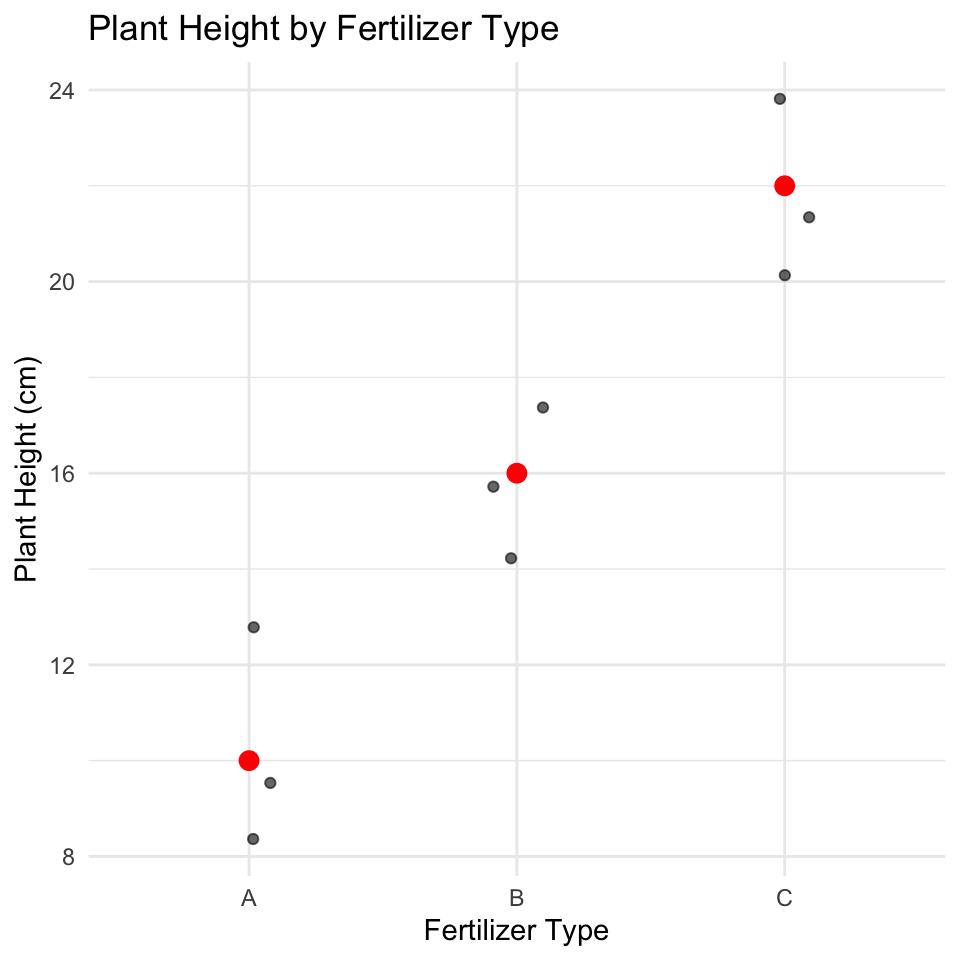
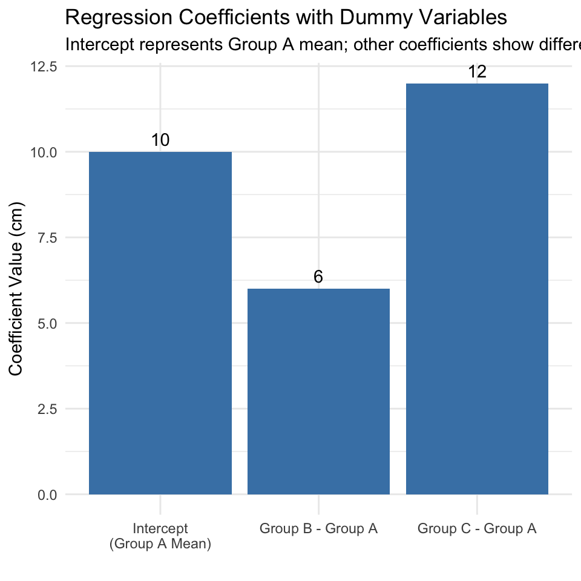
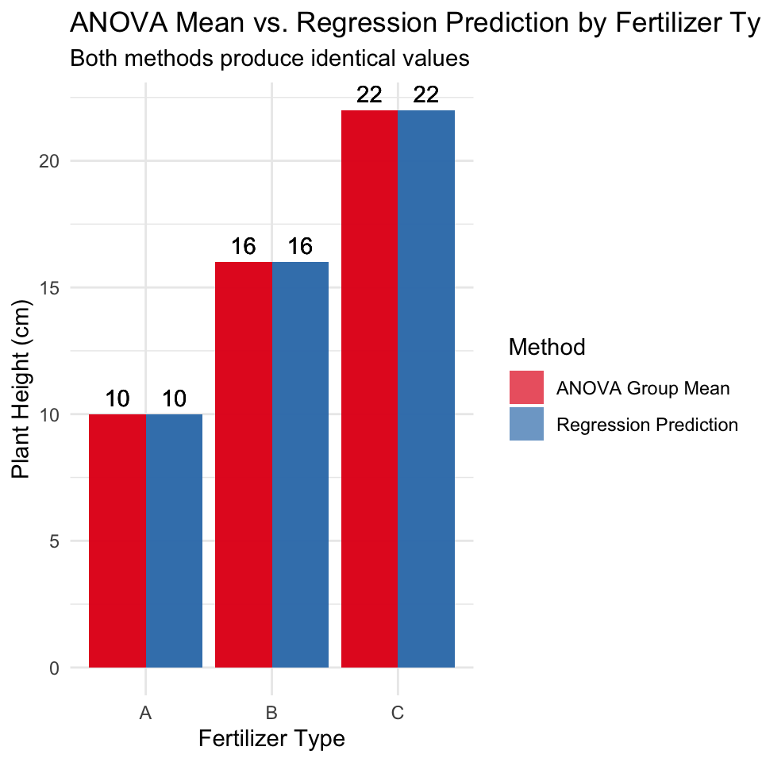

# Introduction

This document demonstrates how Analysis of Variance (ANOVA) is mathematically equivalent to a regression model with dummy variables using an example with R code and visualizations.

# Setup and Data Creation

Let's begin by loading necessary packages and creating a dataframe about plant heights with three different fertilizer treatments.


::: {.cell}

```{.r .cell-code}
# install.packages("flextable")
library(tidyverse)
library(flextable)

# Create the dataset
fertilizer_data <- tibble(
  fertilizer = rep(c("A", "B", "C"), each = 3),
  height = c(10, 12, 8,   # Fertilizer A
             14, 16, 18,  # Fertilizer B
             20, 22, 24)  # Fertilizer C
)

# Display the dataset using flextable
flextable(fertilizer_data) %>%
  set_caption("Plant Heights by Fertilizer Type") %>%
  theme_vanilla() %>%
  autofit()
```

::: {.cell-output-display}

```{=html}
<div class="tabwid"><style>.cl-d78da466{}.cl-d7891694{font-family:'Helvetica';font-size:11pt;font-weight:bold;font-style:normal;text-decoration:none;color:rgba(0, 0, 0, 1.00);background-color:transparent;}.cl-d78916a8{font-family:'Helvetica';font-size:11pt;font-weight:normal;font-style:normal;text-decoration:none;color:rgba(0, 0, 0, 1.00);background-color:transparent;}.cl-d78af180{margin:0;text-align:left;border-bottom: 0 solid rgba(0, 0, 0, 1.00);border-top: 0 solid rgba(0, 0, 0, 1.00);border-left: 0 solid rgba(0, 0, 0, 1.00);border-right: 0 solid rgba(0, 0, 0, 1.00);padding-bottom:5pt;padding-top:5pt;padding-left:5pt;padding-right:5pt;line-height: 1;background-color:transparent;}.cl-d78af18a{margin:0;text-align:right;border-bottom: 0 solid rgba(0, 0, 0, 1.00);border-top: 0 solid rgba(0, 0, 0, 1.00);border-left: 0 solid rgba(0, 0, 0, 1.00);border-right: 0 solid rgba(0, 0, 0, 1.00);padding-bottom:5pt;padding-top:5pt;padding-left:5pt;padding-right:5pt;line-height: 1;background-color:transparent;}.cl-d78b0850{width:0.88in;background-color:transparent;vertical-align: middle;border-bottom: 1.5pt solid rgba(102, 102, 102, 1.00);border-top: 1.5pt solid rgba(102, 102, 102, 1.00);border-left: 0 solid rgba(0, 0, 0, 1.00);border-right: 0 solid rgba(0, 0, 0, 1.00);margin-bottom:0;margin-top:0;margin-left:0;margin-right:0;}.cl-d78b0851{width:0.743in;background-color:transparent;vertical-align: middle;border-bottom: 1.5pt solid rgba(102, 102, 102, 1.00);border-top: 1.5pt solid rgba(102, 102, 102, 1.00);border-left: 0 solid rgba(0, 0, 0, 1.00);border-right: 0 solid rgba(0, 0, 0, 1.00);margin-bottom:0;margin-top:0;margin-left:0;margin-right:0;}.cl-d78b0852{width:0.88in;background-color:transparent;vertical-align: middle;border-bottom: 0.75pt solid rgba(102, 102, 102, 1.00);border-top: 0 solid rgba(0, 0, 0, 1.00);border-left: 0 solid rgba(0, 0, 0, 1.00);border-right: 0 solid rgba(0, 0, 0, 1.00);margin-bottom:0;margin-top:0;margin-left:0;margin-right:0;}.cl-d78b085a{width:0.743in;background-color:transparent;vertical-align: middle;border-bottom: 0.75pt solid rgba(102, 102, 102, 1.00);border-top: 0 solid rgba(0, 0, 0, 1.00);border-left: 0 solid rgba(0, 0, 0, 1.00);border-right: 0 solid rgba(0, 0, 0, 1.00);margin-bottom:0;margin-top:0;margin-left:0;margin-right:0;}.cl-d78b085b{width:0.88in;background-color:transparent;vertical-align: middle;border-bottom: 0.75pt solid rgba(102, 102, 102, 1.00);border-top: 0.75pt solid rgba(102, 102, 102, 1.00);border-left: 0 solid rgba(0, 0, 0, 1.00);border-right: 0 solid rgba(0, 0, 0, 1.00);margin-bottom:0;margin-top:0;margin-left:0;margin-right:0;}.cl-d78b085c{width:0.743in;background-color:transparent;vertical-align: middle;border-bottom: 0.75pt solid rgba(102, 102, 102, 1.00);border-top: 0.75pt solid rgba(102, 102, 102, 1.00);border-left: 0 solid rgba(0, 0, 0, 1.00);border-right: 0 solid rgba(0, 0, 0, 1.00);margin-bottom:0;margin-top:0;margin-left:0;margin-right:0;}.cl-d78b0864{width:0.88in;background-color:transparent;vertical-align: middle;border-bottom: 0.75pt solid rgba(102, 102, 102, 1.00);border-top: 0.75pt solid rgba(102, 102, 102, 1.00);border-left: 0 solid rgba(0, 0, 0, 1.00);border-right: 0 solid rgba(0, 0, 0, 1.00);margin-bottom:0;margin-top:0;margin-left:0;margin-right:0;}.cl-d78b086e{width:0.743in;background-color:transparent;vertical-align: middle;border-bottom: 0.75pt solid rgba(102, 102, 102, 1.00);border-top: 0.75pt solid rgba(102, 102, 102, 1.00);border-left: 0 solid rgba(0, 0, 0, 1.00);border-right: 0 solid rgba(0, 0, 0, 1.00);margin-bottom:0;margin-top:0;margin-left:0;margin-right:0;}.cl-d78b086f{width:0.88in;background-color:transparent;vertical-align: middle;border-bottom: 0.75pt solid rgba(102, 102, 102, 1.00);border-top: 0.75pt solid rgba(102, 102, 102, 1.00);border-left: 0 solid rgba(0, 0, 0, 1.00);border-right: 0 solid rgba(0, 0, 0, 1.00);margin-bottom:0;margin-top:0;margin-left:0;margin-right:0;}.cl-d78b0870{width:0.743in;background-color:transparent;vertical-align: middle;border-bottom: 0.75pt solid rgba(102, 102, 102, 1.00);border-top: 0.75pt solid rgba(102, 102, 102, 1.00);border-left: 0 solid rgba(0, 0, 0, 1.00);border-right: 0 solid rgba(0, 0, 0, 1.00);margin-bottom:0;margin-top:0;margin-left:0;margin-right:0;}.cl-d78b0871{width:0.88in;background-color:transparent;vertical-align: middle;border-bottom: 0.75pt solid rgba(102, 102, 102, 1.00);border-top: 0.75pt solid rgba(102, 102, 102, 1.00);border-left: 0 solid rgba(0, 0, 0, 1.00);border-right: 0 solid rgba(0, 0, 0, 1.00);margin-bottom:0;margin-top:0;margin-left:0;margin-right:0;}.cl-d78b0878{width:0.743in;background-color:transparent;vertical-align: middle;border-bottom: 0.75pt solid rgba(102, 102, 102, 1.00);border-top: 0.75pt solid rgba(102, 102, 102, 1.00);border-left: 0 solid rgba(0, 0, 0, 1.00);border-right: 0 solid rgba(0, 0, 0, 1.00);margin-bottom:0;margin-top:0;margin-left:0;margin-right:0;}.cl-d78b0879{width:0.88in;background-color:transparent;vertical-align: middle;border-bottom: 1.5pt solid rgba(102, 102, 102, 1.00);border-top: 0.75pt solid rgba(102, 102, 102, 1.00);border-left: 0 solid rgba(0, 0, 0, 1.00);border-right: 0 solid rgba(0, 0, 0, 1.00);margin-bottom:0;margin-top:0;margin-left:0;margin-right:0;}.cl-d78b0882{width:0.743in;background-color:transparent;vertical-align: middle;border-bottom: 1.5pt solid rgba(102, 102, 102, 1.00);border-top: 0.75pt solid rgba(102, 102, 102, 1.00);border-left: 0 solid rgba(0, 0, 0, 1.00);border-right: 0 solid rgba(0, 0, 0, 1.00);margin-bottom:0;margin-top:0;margin-left:0;margin-right:0;}</style><table data-quarto-disable-processing='true' class='cl-d78da466'><thead><tr style="overflow-wrap:break-word;"><th class="cl-d78b0850"><p class="cl-d78af180"><span class="cl-d7891694">fertilizer</span></p></th><th class="cl-d78b0851"><p class="cl-d78af18a"><span class="cl-d7891694">height</span></p></th></tr></thead><tbody><tr style="overflow-wrap:break-word;"><td class="cl-d78b0852"><p class="cl-d78af180"><span class="cl-d78916a8">A</span></p></td><td class="cl-d78b085a"><p class="cl-d78af18a"><span class="cl-d78916a8">10</span></p></td></tr><tr style="overflow-wrap:break-word;"><td class="cl-d78b085b"><p class="cl-d78af180"><span class="cl-d78916a8">A</span></p></td><td class="cl-d78b085c"><p class="cl-d78af18a"><span class="cl-d78916a8">12</span></p></td></tr><tr style="overflow-wrap:break-word;"><td class="cl-d78b0864"><p class="cl-d78af180"><span class="cl-d78916a8">A</span></p></td><td class="cl-d78b086e"><p class="cl-d78af18a"><span class="cl-d78916a8">8</span></p></td></tr><tr style="overflow-wrap:break-word;"><td class="cl-d78b085b"><p class="cl-d78af180"><span class="cl-d78916a8">B</span></p></td><td class="cl-d78b085c"><p class="cl-d78af18a"><span class="cl-d78916a8">14</span></p></td></tr><tr style="overflow-wrap:break-word;"><td class="cl-d78b086f"><p class="cl-d78af180"><span class="cl-d78916a8">B</span></p></td><td class="cl-d78b0870"><p class="cl-d78af18a"><span class="cl-d78916a8">16</span></p></td></tr><tr style="overflow-wrap:break-word;"><td class="cl-d78b0864"><p class="cl-d78af180"><span class="cl-d78916a8">B</span></p></td><td class="cl-d78b086e"><p class="cl-d78af18a"><span class="cl-d78916a8">18</span></p></td></tr><tr style="overflow-wrap:break-word;"><td class="cl-d78b0871"><p class="cl-d78af180"><span class="cl-d78916a8">C</span></p></td><td class="cl-d78b0878"><p class="cl-d78af18a"><span class="cl-d78916a8">20</span></p></td></tr><tr style="overflow-wrap:break-word;"><td class="cl-d78b0871"><p class="cl-d78af180"><span class="cl-d78916a8">C</span></p></td><td class="cl-d78b0878"><p class="cl-d78af18a"><span class="cl-d78916a8">22</span></p></td></tr><tr style="overflow-wrap:break-word;"><td class="cl-d78b0879"><p class="cl-d78af180"><span class="cl-d78916a8">C</span></p></td><td class="cl-d78b0882"><p class="cl-d78af18a"><span class="cl-d78916a8">24</span></p></td></tr></tbody></table></div>
```

:::
:::


# Calculating Group Means (ANOVA Approach)

In ANOVA, we calculate the mean of each group and compare variation between groups to variation within groups.


::: {.cell}

```{.r .cell-code}
group_means <- fertilizer_data %>%
  group_by(fertilizer) %>%
  summarize(mean_height = mean(height))

flextable(group_means) %>%
  set_caption("Group Means (ANOVA Approach)") %>%
  theme_vanilla() %>%
  autofit()
```

::: {.cell-output-display}

```{=html}
<div class="tabwid"><style>.cl-d7a3e924{}.cl-d79fc3f8{font-family:'Helvetica';font-size:11pt;font-weight:bold;font-style:normal;text-decoration:none;color:rgba(0, 0, 0, 1.00);background-color:transparent;}.cl-d79fc402{font-family:'Helvetica';font-size:11pt;font-weight:normal;font-style:normal;text-decoration:none;color:rgba(0, 0, 0, 1.00);background-color:transparent;}.cl-d7a186a2{margin:0;text-align:left;border-bottom: 0 solid rgba(0, 0, 0, 1.00);border-top: 0 solid rgba(0, 0, 0, 1.00);border-left: 0 solid rgba(0, 0, 0, 1.00);border-right: 0 solid rgba(0, 0, 0, 1.00);padding-bottom:5pt;padding-top:5pt;padding-left:5pt;padding-right:5pt;line-height: 1;background-color:transparent;}.cl-d7a186ac{margin:0;text-align:right;border-bottom: 0 solid rgba(0, 0, 0, 1.00);border-top: 0 solid rgba(0, 0, 0, 1.00);border-left: 0 solid rgba(0, 0, 0, 1.00);border-right: 0 solid rgba(0, 0, 0, 1.00);padding-bottom:5pt;padding-top:5pt;padding-left:5pt;padding-right:5pt;line-height: 1;background-color:transparent;}.cl-d7a19af2{width:0.88in;background-color:transparent;vertical-align: middle;border-bottom: 1.5pt solid rgba(102, 102, 102, 1.00);border-top: 1.5pt solid rgba(102, 102, 102, 1.00);border-left: 0 solid rgba(0, 0, 0, 1.00);border-right: 0 solid rgba(0, 0, 0, 1.00);margin-bottom:0;margin-top:0;margin-left:0;margin-right:0;}.cl-d7a19af3{width:1.228in;background-color:transparent;vertical-align: middle;border-bottom: 1.5pt solid rgba(102, 102, 102, 1.00);border-top: 1.5pt solid rgba(102, 102, 102, 1.00);border-left: 0 solid rgba(0, 0, 0, 1.00);border-right: 0 solid rgba(0, 0, 0, 1.00);margin-bottom:0;margin-top:0;margin-left:0;margin-right:0;}.cl-d7a19af4{width:0.88in;background-color:transparent;vertical-align: middle;border-bottom: 0.75pt solid rgba(102, 102, 102, 1.00);border-top: 0 solid rgba(0, 0, 0, 1.00);border-left: 0 solid rgba(0, 0, 0, 1.00);border-right: 0 solid rgba(0, 0, 0, 1.00);margin-bottom:0;margin-top:0;margin-left:0;margin-right:0;}.cl-d7a19af5{width:1.228in;background-color:transparent;vertical-align: middle;border-bottom: 0.75pt solid rgba(102, 102, 102, 1.00);border-top: 0 solid rgba(0, 0, 0, 1.00);border-left: 0 solid rgba(0, 0, 0, 1.00);border-right: 0 solid rgba(0, 0, 0, 1.00);margin-bottom:0;margin-top:0;margin-left:0;margin-right:0;}.cl-d7a19afc{width:0.88in;background-color:transparent;vertical-align: middle;border-bottom: 0.75pt solid rgba(102, 102, 102, 1.00);border-top: 0.75pt solid rgba(102, 102, 102, 1.00);border-left: 0 solid rgba(0, 0, 0, 1.00);border-right: 0 solid rgba(0, 0, 0, 1.00);margin-bottom:0;margin-top:0;margin-left:0;margin-right:0;}.cl-d7a19afd{width:1.228in;background-color:transparent;vertical-align: middle;border-bottom: 0.75pt solid rgba(102, 102, 102, 1.00);border-top: 0.75pt solid rgba(102, 102, 102, 1.00);border-left: 0 solid rgba(0, 0, 0, 1.00);border-right: 0 solid rgba(0, 0, 0, 1.00);margin-bottom:0;margin-top:0;margin-left:0;margin-right:0;}.cl-d7a19afe{width:0.88in;background-color:transparent;vertical-align: middle;border-bottom: 1.5pt solid rgba(102, 102, 102, 1.00);border-top: 0.75pt solid rgba(102, 102, 102, 1.00);border-left: 0 solid rgba(0, 0, 0, 1.00);border-right: 0 solid rgba(0, 0, 0, 1.00);margin-bottom:0;margin-top:0;margin-left:0;margin-right:0;}.cl-d7a19b06{width:1.228in;background-color:transparent;vertical-align: middle;border-bottom: 1.5pt solid rgba(102, 102, 102, 1.00);border-top: 0.75pt solid rgba(102, 102, 102, 1.00);border-left: 0 solid rgba(0, 0, 0, 1.00);border-right: 0 solid rgba(0, 0, 0, 1.00);margin-bottom:0;margin-top:0;margin-left:0;margin-right:0;}</style><table data-quarto-disable-processing='true' class='cl-d7a3e924'><thead><tr style="overflow-wrap:break-word;"><th class="cl-d7a19af2"><p class="cl-d7a186a2"><span class="cl-d79fc3f8">fertilizer</span></p></th><th class="cl-d7a19af3"><p class="cl-d7a186ac"><span class="cl-d79fc3f8">mean_height</span></p></th></tr></thead><tbody><tr style="overflow-wrap:break-word;"><td class="cl-d7a19af4"><p class="cl-d7a186a2"><span class="cl-d79fc402">A</span></p></td><td class="cl-d7a19af5"><p class="cl-d7a186ac"><span class="cl-d79fc402">10</span></p></td></tr><tr style="overflow-wrap:break-word;"><td class="cl-d7a19afc"><p class="cl-d7a186a2"><span class="cl-d79fc402">B</span></p></td><td class="cl-d7a19afd"><p class="cl-d7a186ac"><span class="cl-d79fc402">16</span></p></td></tr><tr style="overflow-wrap:break-word;"><td class="cl-d7a19afe"><p class="cl-d7a186a2"><span class="cl-d79fc402">C</span></p></td><td class="cl-d7a19b06"><p class="cl-d7a186ac"><span class="cl-d79fc402">22</span></p></td></tr></tbody></table></div>
```

:::
:::


Let's visualize the raw data and group means:


::: {.cell}

```{.r .cell-code}
ggplot(fertilizer_data, aes(x = fertilizer, y = height)) +
  geom_jitter(width = 0.1, alpha = 0.6) +
  geom_point(data = group_means, aes(y = mean_height), 
             color = "red", size = 3) +
  labs(title = "Plant Height by Fertilizer Type",
       x = "Fertilizer Type",
       y = "Plant Height (cm)") +
  theme_minimal()
```

::: {.cell-output-display}
{width=480}
:::
:::


# Running the ANOVA


::: {.cell}

```{.r .cell-code}
# Run ANOVA
anova_model <- aov(height ~ fertilizer, data = fertilizer_data)
anova_summary <- summary(anova_model)
anova_summary
```

::: {.cell-output .cell-output-stdout}

```
            Df Sum Sq Mean Sq F value Pr(>F)   
fertilizer   2    216     108      27  0.001 **
Residuals    6     24       4                  
---
Signif. codes:  0 '***' 0.001 '**' 0.01 '*' 0.05 '.' 0.1 ' ' 1
```


:::
:::


# Regression with Dummy Variables

For the regression approach, we'll create dummy variables for fertilizer types, using fertilizer A as the reference level.


::: {.cell}

```{.r .cell-code}
# Set fertilizer A as the reference level
fertilizer_data$fertilizer <- factor(fertilizer_data$fertilizer, levels = c("A", "B", "C"))

# Run regression with dummy variables
reg_model <- lm(height ~ fertilizer, data = fertilizer_data)
reg_summary <- summary(reg_model)
reg_summary
```

::: {.cell-output .cell-output-stdout}

```

Call:
lm(formula = height ~ fertilizer, data = fertilizer_data)

Residuals:
   Min     1Q Median     3Q    Max 
    -2     -2      0      2      2 

Coefficients:
            Estimate Std. Error t value Pr(>|t|)    
(Intercept)   10.000      1.155   8.660 0.000131 ***
fertilizerB    6.000      1.633   3.674 0.010402 *  
fertilizerC   12.000      1.633   7.348 0.000325 ***
---
Signif. codes:  0 '***' 0.001 '**' 0.01 '*' 0.05 '.' 0.1 ' ' 1

Residual standard error: 2 on 6 degrees of freedom
Multiple R-squared:    0.9,	Adjusted R-squared:  0.8667 
F-statistic:    27 on 2 and 6 DF,  p-value: 0.001
```


:::
:::


# Understanding the Regression Coefficients

In our regression model:

- The intercept (10) is equal to the mean of the reference group (A)
- The coefficient for fertilizer B (6) is the difference between mean of group B and mean of group A
- The coefficient for fertilizer C (12) is the difference between mean of group C and mean of group A


::: {.cell}

```{.r .cell-code}
# Create a table showing the relationship between coefficients and means
coefs <- coef(reg_model)

coefficients_explained <- tibble(
  Term = c("Intercept", "fertilizerB", "fertilizerC"),
  Coefficient = coefs,
  Meaning = c(
    "Mean of Group A (reference group)",
    "Difference between Group B and Group A means",
    "Difference between Group C and Group A means"
  ),
  Mathematical_Expression = c(
    "β₀ = μA",
    "β₁ = μB - μA",
    "β₂ = μC - μA"
  ),
  Numeric_Value = c(coefs[1],
    paste0(round(group_means$mean_height[2], 1), " - ", 
           round(group_means$mean_height[1], 1), " = ", 
           round(coefs[2], 1)),
    paste0(round(group_means$mean_height[3], 1), " - ", 
           round(group_means$mean_height[1], 1), " = ", 
           round(coefs[3], 1))))

# Use flextable to format the table
flextable(coefficients_explained) %>%
  set_caption("Regression Coefficients Explained") %>%
  theme_vanilla() %>%
  fit_to_width(max_width = 8, unit = "in") %>%
  bold(j = 1) %>%
  colformat_double(j = 2, digits = 2)
```

::: {.cell-output-display}

```{=html}
<div class="tabwid"><style>.cl-d7e309c4{}.cl-d7dea69a{font-family:'Helvetica';font-size:11pt;font-weight:bold;font-style:normal;text-decoration:none;color:rgba(0, 0, 0, 1.00);background-color:transparent;}.cl-d7dea6a4{font-family:'Helvetica';font-size:11pt;font-weight:normal;font-style:normal;text-decoration:none;color:rgba(0, 0, 0, 1.00);background-color:transparent;}.cl-d7e0592c{margin:0;text-align:left;border-bottom: 0 solid rgba(0, 0, 0, 1.00);border-top: 0 solid rgba(0, 0, 0, 1.00);border-left: 0 solid rgba(0, 0, 0, 1.00);border-right: 0 solid rgba(0, 0, 0, 1.00);padding-bottom:5pt;padding-top:5pt;padding-left:5pt;padding-right:5pt;line-height: 1;background-color:transparent;}.cl-d7e05936{margin:0;text-align:right;border-bottom: 0 solid rgba(0, 0, 0, 1.00);border-top: 0 solid rgba(0, 0, 0, 1.00);border-left: 0 solid rgba(0, 0, 0, 1.00);border-right: 0 solid rgba(0, 0, 0, 1.00);padding-bottom:5pt;padding-top:5pt;padding-left:5pt;padding-right:5pt;line-height: 1;background-color:transparent;}.cl-d7e06c32{width:0.75in;background-color:transparent;vertical-align: middle;border-bottom: 1.5pt solid rgba(102, 102, 102, 1.00);border-top: 1.5pt solid rgba(102, 102, 102, 1.00);border-left: 0 solid rgba(0, 0, 0, 1.00);border-right: 0 solid rgba(0, 0, 0, 1.00);margin-bottom:0;margin-top:0;margin-left:0;margin-right:0;}.cl-d7e06c33{width:0.75in;background-color:transparent;vertical-align: middle;border-bottom: 1.5pt solid rgba(102, 102, 102, 1.00);border-top: 1.5pt solid rgba(102, 102, 102, 1.00);border-left: 0 solid rgba(0, 0, 0, 1.00);border-right: 0 solid rgba(0, 0, 0, 1.00);margin-bottom:0;margin-top:0;margin-left:0;margin-right:0;}.cl-d7e06c34{width:0.75in;background-color:transparent;vertical-align: middle;border-bottom: 0.75pt solid rgba(102, 102, 102, 1.00);border-top: 0 solid rgba(0, 0, 0, 1.00);border-left: 0 solid rgba(0, 0, 0, 1.00);border-right: 0 solid rgba(0, 0, 0, 1.00);margin-bottom:0;margin-top:0;margin-left:0;margin-right:0;}.cl-d7e06c3c{width:0.75in;background-color:transparent;vertical-align: middle;border-bottom: 0.75pt solid rgba(102, 102, 102, 1.00);border-top: 0 solid rgba(0, 0, 0, 1.00);border-left: 0 solid rgba(0, 0, 0, 1.00);border-right: 0 solid rgba(0, 0, 0, 1.00);margin-bottom:0;margin-top:0;margin-left:0;margin-right:0;}.cl-d7e06c3d{width:0.75in;background-color:transparent;vertical-align: middle;border-bottom: 0.75pt solid rgba(102, 102, 102, 1.00);border-top: 0.75pt solid rgba(102, 102, 102, 1.00);border-left: 0 solid rgba(0, 0, 0, 1.00);border-right: 0 solid rgba(0, 0, 0, 1.00);margin-bottom:0;margin-top:0;margin-left:0;margin-right:0;}.cl-d7e06c46{width:0.75in;background-color:transparent;vertical-align: middle;border-bottom: 0.75pt solid rgba(102, 102, 102, 1.00);border-top: 0.75pt solid rgba(102, 102, 102, 1.00);border-left: 0 solid rgba(0, 0, 0, 1.00);border-right: 0 solid rgba(0, 0, 0, 1.00);margin-bottom:0;margin-top:0;margin-left:0;margin-right:0;}.cl-d7e06c47{width:0.75in;background-color:transparent;vertical-align: middle;border-bottom: 1.5pt solid rgba(102, 102, 102, 1.00);border-top: 0.75pt solid rgba(102, 102, 102, 1.00);border-left: 0 solid rgba(0, 0, 0, 1.00);border-right: 0 solid rgba(0, 0, 0, 1.00);margin-bottom:0;margin-top:0;margin-left:0;margin-right:0;}.cl-d7e06c48{width:0.75in;background-color:transparent;vertical-align: middle;border-bottom: 1.5pt solid rgba(102, 102, 102, 1.00);border-top: 0.75pt solid rgba(102, 102, 102, 1.00);border-left: 0 solid rgba(0, 0, 0, 1.00);border-right: 0 solid rgba(0, 0, 0, 1.00);margin-bottom:0;margin-top:0;margin-left:0;margin-right:0;}</style><table data-quarto-disable-processing='true' class='cl-d7e309c4'><thead><tr style="overflow-wrap:break-word;"><th class="cl-d7e06c32"><p class="cl-d7e0592c"><span class="cl-d7dea69a">Term</span></p></th><th class="cl-d7e06c33"><p class="cl-d7e05936"><span class="cl-d7dea69a">Coefficient</span></p></th><th class="cl-d7e06c32"><p class="cl-d7e0592c"><span class="cl-d7dea69a">Meaning</span></p></th><th class="cl-d7e06c32"><p class="cl-d7e0592c"><span class="cl-d7dea69a">Mathematical_Expression</span></p></th><th class="cl-d7e06c32"><p class="cl-d7e0592c"><span class="cl-d7dea69a">Numeric_Value</span></p></th></tr></thead><tbody><tr style="overflow-wrap:break-word;"><td class="cl-d7e06c34"><p class="cl-d7e0592c"><span class="cl-d7dea69a">Intercept</span></p></td><td class="cl-d7e06c3c"><p class="cl-d7e05936"><span class="cl-d7dea6a4">10.00</span></p></td><td class="cl-d7e06c34"><p class="cl-d7e0592c"><span class="cl-d7dea6a4">Mean of Group A (reference group)</span></p></td><td class="cl-d7e06c34"><p class="cl-d7e0592c"><span class="cl-d7dea6a4">β₀ = μA</span></p></td><td class="cl-d7e06c34"><p class="cl-d7e0592c"><span class="cl-d7dea6a4">10</span></p></td></tr><tr style="overflow-wrap:break-word;"><td class="cl-d7e06c3d"><p class="cl-d7e0592c"><span class="cl-d7dea69a">fertilizerB</span></p></td><td class="cl-d7e06c46"><p class="cl-d7e05936"><span class="cl-d7dea6a4">6.00</span></p></td><td class="cl-d7e06c3d"><p class="cl-d7e0592c"><span class="cl-d7dea6a4">Difference between Group B and Group A means</span></p></td><td class="cl-d7e06c3d"><p class="cl-d7e0592c"><span class="cl-d7dea6a4">β₁ = μB - μA</span></p></td><td class="cl-d7e06c3d"><p class="cl-d7e0592c"><span class="cl-d7dea6a4">16 - 10 = 6</span></p></td></tr><tr style="overflow-wrap:break-word;"><td class="cl-d7e06c47"><p class="cl-d7e0592c"><span class="cl-d7dea69a">fertilizerC</span></p></td><td class="cl-d7e06c48"><p class="cl-d7e05936"><span class="cl-d7dea6a4">12.00</span></p></td><td class="cl-d7e06c47"><p class="cl-d7e0592c"><span class="cl-d7dea6a4">Difference between Group C and Group A means</span></p></td><td class="cl-d7e06c47"><p class="cl-d7e0592c"><span class="cl-d7dea6a4">β₂ = μC - μA</span></p></td><td class="cl-d7e06c47"><p class="cl-d7e0592c"><span class="cl-d7dea6a4">22 - 10 = 12</span></p></td></tr></tbody></table></div>
```

:::
:::


Let's visualize these coefficients:


::: {.cell}

```{.r .cell-code}
coef_data <- tibble(
  Term = factor(c("Intercept\n(Group A Mean)", "Group B - Group A", "Group C - Group A"),
                levels = c("Intercept\n(Group A Mean)", "Group B - Group A", "Group C - Group A")),
  Value = c(coefs[1], coefs[2], coefs[3])
)

ggplot(coef_data, aes(x = Term, y = Value)) +
  geom_col(fill = "steelblue") +
  geom_text(aes(label = round(Value, 1)), vjust = -0.5) +
  labs(title = "Regression Coefficients with Dummy Variables",
       subtitle = "Intercept represents Group A mean; other coefficients show differences from reference",
       x = "",
       y = "Coefficient Value (cm)") +
  theme_minimal()
```

::: {.cell-output-display}
{width=480}
:::
:::


# Demonstrating the Equivalence

Now, let's prove that the regression model predictions are identical to the ANOVA group means:


::: {.cell}

```{.r .cell-code}
# Get predictions from regression model
predicted_values <- predict(reg_model, fertilizer_data)

# Create a dataframe for comparison
comparison_data <- fertilizer_data %>%
  mutate(predicted = predicted_values) %>%
  group_by(fertilizer) %>%
  mutate(group_mean = mean(height))

# Generate the predicted values for each group
predicted_values_by_group <- comparison_data %>%
  group_by(fertilizer) %>%
  reframe(
    anova_mean = mean(height),
    regression_prediction = mean(predicted),
    formula = case_when(
      fertilizer == "A" ~ paste0(round(coefs[1], 1), " + 0 + 0 = ", round(coefs[1], 1)),
      fertilizer == "B" ~ paste0(round(coefs[1], 1), " + ", round(coefs[2], 1), " + 0 = ", round(coefs[1] + coefs[2], 1)),
      fertilizer == "C" ~ paste0(round(coefs[1], 1), " + 0 + ", round(coefs[3], 1), " = ", round(coefs[1] + coefs[3], 1))
    )
  )
```
:::


Let's visualize this equivalence:


::: {.cell}

```{.r .cell-code}
# Create data for plotting the equivalence
plot_data <- predicted_values_by_group %>%
  pivot_longer(cols = c(anova_mean, regression_prediction),
               names_to = "method",
               values_to = "value") %>%
  mutate(method = ifelse(method == "anova_mean", "ANOVA Group Mean", "Regression Prediction"))

ggplot(plot_data, aes(x = fertilizer, y = value, fill = method)) +
  geom_bar(stat = "identity", position = position_dodge(), alpha = 0.7) +
  geom_text(aes(label = round(value, 1)), position = position_dodge(width = 0.9), vjust = -0.5) +
  labs(title = "ANOVA Mean vs. Regression Prediction by Fertilizer Type",
       subtitle = "Both methods produce identical values",
       x = "Fertilizer Type",
       y = "Plant Height (cm)",
       fill = "Method") +
  theme_minimal() +
  scale_fill_brewer(palette = "Set1")
```

::: {.cell-output-display}
{width=480}
:::
:::


# Comparing Statistical Tests

Both ANOVA and regression provide an F-test. Let's compare them:


::: {.cell}

```{.r .cell-code}
# ANOVA: Extract F-value and p-value
anova_f <- anova_summary[[1]]$`F value`[1]
anova_p <- anova_summary[[1]]$`Pr(>F)`[1]

# Regression: Extract F-value and p-value
reg_f <- reg_summary$fstatistic[1]
reg_p <- pf(reg_f, reg_summary$fstatistic[2], reg_summary$fstatistic[3], lower.tail = FALSE)

# Compare them
test_comparison <- tibble(
  Test = c("ANOVA F-test", "Regression F-test"),
  `F-value` = c(anova_f, reg_f),
  `p-value` = c(anova_p, reg_p)
)

# Format with flextable
flextable(test_comparison) %>%
  set_caption("Comparison of Statistical Tests") %>%
  theme_vanilla() %>%
  autofit() %>%
  colformat_double(j = 2:3, digits = 4)
```

::: {.cell-output-display}

```{=html}
<div class="tabwid"><style>.cl-d8345c0c{}.cl-d82fb0e4{font-family:'Helvetica';font-size:11pt;font-weight:bold;font-style:normal;text-decoration:none;color:rgba(0, 0, 0, 1.00);background-color:transparent;}.cl-d82fb0e5{font-family:'Helvetica';font-size:11pt;font-weight:normal;font-style:normal;text-decoration:none;color:rgba(0, 0, 0, 1.00);background-color:transparent;}.cl-d8318eb4{margin:0;text-align:left;border-bottom: 0 solid rgba(0, 0, 0, 1.00);border-top: 0 solid rgba(0, 0, 0, 1.00);border-left: 0 solid rgba(0, 0, 0, 1.00);border-right: 0 solid rgba(0, 0, 0, 1.00);padding-bottom:5pt;padding-top:5pt;padding-left:5pt;padding-right:5pt;line-height: 1;background-color:transparent;}.cl-d8318ebe{margin:0;text-align:right;border-bottom: 0 solid rgba(0, 0, 0, 1.00);border-top: 0 solid rgba(0, 0, 0, 1.00);border-left: 0 solid rgba(0, 0, 0, 1.00);border-right: 0 solid rgba(0, 0, 0, 1.00);padding-bottom:5pt;padding-top:5pt;padding-left:5pt;padding-right:5pt;line-height: 1;background-color:transparent;}.cl-d831a430{width:1.491in;background-color:transparent;vertical-align: middle;border-bottom: 1.5pt solid rgba(102, 102, 102, 1.00);border-top: 1.5pt solid rgba(102, 102, 102, 1.00);border-left: 0 solid rgba(0, 0, 0, 1.00);border-right: 0 solid rgba(0, 0, 0, 1.00);margin-bottom:0;margin-top:0;margin-left:0;margin-right:0;}.cl-d831a431{width:0.82in;background-color:transparent;vertical-align: middle;border-bottom: 1.5pt solid rgba(102, 102, 102, 1.00);border-top: 1.5pt solid rgba(102, 102, 102, 1.00);border-left: 0 solid rgba(0, 0, 0, 1.00);border-right: 0 solid rgba(0, 0, 0, 1.00);margin-bottom:0;margin-top:0;margin-left:0;margin-right:0;}.cl-d831a43a{width:1.491in;background-color:transparent;vertical-align: middle;border-bottom: 0.75pt solid rgba(102, 102, 102, 1.00);border-top: 0 solid rgba(0, 0, 0, 1.00);border-left: 0 solid rgba(0, 0, 0, 1.00);border-right: 0 solid rgba(0, 0, 0, 1.00);margin-bottom:0;margin-top:0;margin-left:0;margin-right:0;}.cl-d831a43b{width:0.82in;background-color:transparent;vertical-align: middle;border-bottom: 0.75pt solid rgba(102, 102, 102, 1.00);border-top: 0 solid rgba(0, 0, 0, 1.00);border-left: 0 solid rgba(0, 0, 0, 1.00);border-right: 0 solid rgba(0, 0, 0, 1.00);margin-bottom:0;margin-top:0;margin-left:0;margin-right:0;}.cl-d831a43c{width:1.491in;background-color:transparent;vertical-align: middle;border-bottom: 1.5pt solid rgba(102, 102, 102, 1.00);border-top: 0.75pt solid rgba(102, 102, 102, 1.00);border-left: 0 solid rgba(0, 0, 0, 1.00);border-right: 0 solid rgba(0, 0, 0, 1.00);margin-bottom:0;margin-top:0;margin-left:0;margin-right:0;}.cl-d831a444{width:0.82in;background-color:transparent;vertical-align: middle;border-bottom: 1.5pt solid rgba(102, 102, 102, 1.00);border-top: 0.75pt solid rgba(102, 102, 102, 1.00);border-left: 0 solid rgba(0, 0, 0, 1.00);border-right: 0 solid rgba(0, 0, 0, 1.00);margin-bottom:0;margin-top:0;margin-left:0;margin-right:0;}</style><table data-quarto-disable-processing='true' class='cl-d8345c0c'><thead><tr style="overflow-wrap:break-word;"><th class="cl-d831a430"><p class="cl-d8318eb4"><span class="cl-d82fb0e4">Test</span></p></th><th class="cl-d831a431"><p class="cl-d8318ebe"><span class="cl-d82fb0e4">F-value</span></p></th><th class="cl-d831a431"><p class="cl-d8318ebe"><span class="cl-d82fb0e4">p-value</span></p></th></tr></thead><tbody><tr style="overflow-wrap:break-word;"><td class="cl-d831a43a"><p class="cl-d8318eb4"><span class="cl-d82fb0e5">ANOVA F-test</span></p></td><td class="cl-d831a43b"><p class="cl-d8318ebe"><span class="cl-d82fb0e5">27.0000</span></p></td><td class="cl-d831a43b"><p class="cl-d8318ebe"><span class="cl-d82fb0e5">0.0010</span></p></td></tr><tr style="overflow-wrap:break-word;"><td class="cl-d831a43c"><p class="cl-d8318eb4"><span class="cl-d82fb0e5">Regression F-test</span></p></td><td class="cl-d831a444"><p class="cl-d8318ebe"><span class="cl-d82fb0e5">27.0000</span></p></td><td class="cl-d831a444"><p class="cl-d8318ebe"><span class="cl-d82fb0e5">0.0010</span></p></td></tr></tbody></table></div>
```

:::
:::


# The Mathematical Relationship

For a one-way ANOVA with a categorical variable having `k` levels, we can express the relationship with regression as:

$$Y = \beta_0 + \beta_1X_1 + \beta_2X_2 + ... + \beta_{k-1}X_{k-1} + \epsilon$$

Where: - $\beta_0$ is the mean of the reference group - $\beta_1, \beta_2, ..., \beta_{k-1}$ are the differences between each group's mean and the reference group mean - $X_1, X_2, ..., X_{k-1}$ are dummy variables (0 or 1)

In our example: - $\beta_0 = 10$ (mean of group A) - $\beta_1 = 6$ (difference between B and A) - $\beta_2 = 12$ (difference between C and A)

# Conclusion

This demonstration shows that one-way ANOVA is mathematically equivalent to regression with dummy variables. The key equivalences are:

1.  ANOVA group means = Regression predictions for each group
2.  F-statistic from ANOVA = F-statistic from regression
3.  p-values are identical in both approaches

This confirms that both techniques are special cases of the General Linear Model, just expressed in different ways. For a categorical predictor with `k` levels, we need `k-1` dummy variables in the regression approach, with one level serving as the reference category.