# Lecture 12: Factorial ANOVA

The set up and data overview


::: {.cell}

```{.r .cell-code}
# Load required packages
library(palmerpenguins) # has the data for penguins and they are cute
library(car)       # For Levene's test and Type III SS
library(emmeans)   # For estimated marginal means
library(broom)     # For tidying model outputs
library(patchwork) # For combining plots
library(tidyverse)

# Set theme for plots
theme_set(theme_light(base_size = 12))
```
:::


::: {.cell}

```{.r .cell-code}
p_df <- penguins %>%
  select(spp = species, sex, body_mass_g) %>% 
  rename(mass_g = body_mass_g)
head(p_df)
```

::: {.cell-output .cell-output-stdout}

```
# A tibble: 6 × 3
  spp    sex    mass_g
  <fct>  <fct>   <int>
1 Adelie male     3750
2 Adelie female   3800
3 Adelie female   3250
4 Adelie <NA>       NA
5 Adelie female   3450
6 Adelie male     3650
```


:::
:::


::: {.cell}

```{.r .cell-code}
# Check for missing values
p_df %>% 
  summarise_all(~sum(is.na(.))) 
```

::: {.cell-output .cell-output-stdout}

```
# A tibble: 1 × 3
    spp   sex mass_g
  <int> <int>  <int>
1     0    11      2
```


:::
:::


::: {.cell}

```{.r .cell-code}
# Load the penguin data
p_df <- p_df %>%
  filter(!is.na(mass_g), 
         !is.na(sex),
         !is.na(spp)) 

# View the first few rows
head(p_df)
```

::: {.cell-output .cell-output-stdout}

```
# A tibble: 6 × 3
  spp    sex    mass_g
  <fct>  <fct>   <int>
1 Adelie male     3750
2 Adelie female   3800
3 Adelie female   3250
4 Adelie female   3450
5 Adelie male     3650
6 Adelie female   3625
```


:::
:::


::: {.cell}

```{.r .cell-code}
# Summary statistics
p_df %>%
  group_by(spp, sex) %>%
  summarise(
    mean_mass = mean(mass_g, na.rm=TRUE),
    sd_mass = sd(mass_g, na.rm=TRUE),
    n = sum(!is.na(mass_g)),
    se_mass = sd_mass/n^.5,
    .groups = 'drop'
  )
```

::: {.cell-output .cell-output-stdout}

```
# A tibble: 6 × 6
  spp       sex    mean_mass sd_mass     n se_mass
  <fct>     <fct>      <dbl>   <dbl> <int>   <dbl>
1 Adelie    female     3369.    269.    73    31.5
2 Adelie    male       4043.    347.    73    40.6
3 Chinstrap female     3527.    285.    34    48.9
4 Chinstrap male       3939.    362.    34    62.1
5 Gentoo    female     4680.    282.    58    37.0
6 Gentoo    male       5485.    313.    61    40.1
```


:::
:::


# Make a balanced dataframe where samples are all the same


::: {.cell}

```{.r .cell-code}
# Check original sample sizes
original_n <- p_df %>%
  count(spp, sex) %>%
  arrange(spp, sex)

p_df %>%
  count(spp, sex) %>%
  pivot_wider(names_from = sex, 
              values_from = n,
              values_fill = 0) 
```

::: {.cell-output .cell-output-stdout}

```
# A tibble: 3 × 3
  spp       female  male
  <fct>      <int> <int>
1 Adelie        73    73
2 Chinstrap     34    34
3 Gentoo        58    61
```


:::

```{.r .cell-code}
# Find minimum sample size
min_n <- min(original_n$n)
min_n
```

::: {.cell-output .cell-output-stdout}

```
[1] 34
```


:::

```{.r .cell-code}
# Create balanced dataset
set.seed(123) # for reproducibility
pb_df <- p_df %>%
  group_by(spp, sex) %>%
  sample_n(min_n) %>%
  ungroup()

# Verify balanced design
balanced_n <- pb_df %>% 
  count(spp, sex) %>%
  pivot_wider(names_from = sex, 
              values_from = n,
              values_fill = 0) 
balanced_n
```

::: {.cell-output .cell-output-stdout}

```
# A tibble: 3 × 3
  spp       female  male
  <fct>      <int> <int>
1 Adelie        34    34
2 Chinstrap     34    34
3 Gentoo        34    34
```


:::
:::


# balanced dataframe


::: {.cell}

```{.r .cell-code}
# Calculate group means and SDs
summary_df <- pb_df %>%
  group_by(spp, sex) %>%
  summarise(
    n = sum(!is.na(mass_g)),
    mean_mass = mean(mass_g),
    sd_mass = sd(mass_g),
    se_mass = sd_mass/sqrt(n),
    .groups = 'drop'
  ) %>%
  arrange(spp, sex)

print(summary_df)
```

::: {.cell-output .cell-output-stdout}

```
# A tibble: 6 × 6
  spp       sex        n mean_mass sd_mass se_mass
  <fct>     <fct>  <int>     <dbl>   <dbl>   <dbl>
1 Adelie    female    34     3335.    260.    44.5
2 Adelie    male      34     4049.    318.    54.5
3 Chinstrap female    34     3527.    285.    48.9
4 Chinstrap male      34     3939.    362.    62.1
5 Gentoo    female    34     4681.    309.    53.0
6 Gentoo    male      34     5525     274.    47.0
```


:::
:::


# This is the balanced Factorial ANOVA

## ANOVA Assumptions

In the factorial ANOVA, we need to check several assumptions after
fitting the model:

1.  Independence of observations
2.  Normality of residuals
3.  Homogeneity of variances
4.  Homoscedascidity

Fit the model


::: {.cell}

```{.r .cell-code}
# Set contrasts for Type III SS
options(contrasts = c("contr.sum", "contr.poly"))

# Fit the factorial ANOVA using linear model (lm) instead of aov
pb_model <- lm(mass_g ~ spp * sex, data = pb_df)

# View the model summary to see coefficients, standard errors, etc.
summary(pb_model)
```

::: {.cell-output .cell-output-stdout}

```

Call:
lm(formula = mass_g ~ spp * sex, data = pb_df)

Residuals:
    Min      1Q  Median      3Q     Max 
-827.21 -178.13    6.25  175.00  861.03 

Coefficients:
            Estimate Std. Error t value Pr(>|t|)    
(Intercept)  4175.86      21.23 196.727  < 2e-16 ***
spp1         -484.31      30.02 -16.134  < 2e-16 ***
spp2         -442.77      30.02 -14.750  < 2e-16 ***
sex1         -328.31      21.23 -15.467  < 2e-16 ***
spp1:sex1     -28.68      30.02  -0.955    0.341    
spp2:sex1     122.43      30.02   4.078 6.57e-05 ***
---
Signif. codes:  0 '***' 0.001 '**' 0.01 '*' 0.05 '.' 0.1 ' ' 1

Residual standard error: 303.2 on 198 degrees of freedom
Multiple R-squared:  0.8596,	Adjusted R-squared:  0.856 
F-statistic: 242.4 on 5 and 198 DF,  p-value: < 2.2e-16
```


:::
:::


::: {.cell}

```{.r .cell-code}
Anova(pb_model, type = 3)
```

::: {.cell-output .cell-output-stdout}

```
Anova Table (Type III tests)

Response: mass_g
                Sum Sq  Df    F value    Pr(>F)    
(Intercept) 3557308900   1 38701.5271 < 2.2e-16 ***
spp           87725999   2   477.2049 < 2.2e-16 ***
sex           21988483   1   239.2224 < 2.2e-16 ***
spp:sex        1672776   2     9.0994 0.0001657 ***
Residuals     18199467 198                         
---
Signif. codes:  0 '***' 0.001 '**' 0.01 '*' 0.05 '.' 0.1 ' ' 1
```


:::
:::


# Lecture 12: Factorial ANOVA

## ASSUMPTIONS


::: {.cell}

```{.r .cell-code}
# Create diagnostic plots
par(mfrow = c(2, 2))
plot(pb_model)
```

::: {.cell-output-display}
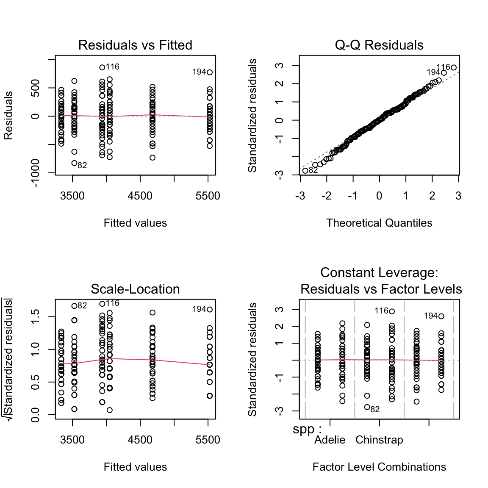{width=576}
:::

```{.r .cell-code}
par(mfrow = c(1, 1))
```
:::


## Check for Normality of Residuals


::: {.cell}

```{.r .cell-code}
# Extract residuals from the model
pb_resid_df <- augment(pb_model)

# Create Q-Q plot of residuals
ggplot(pb_resid_df, aes(sample = .resid)) +
  stat_qq() +
  stat_qq_line() +
  labs(title = "Q-Q Plot of Residuals",
       x = "Theoretical Quantiles",
       y = "Sample Quantiles")
```

::: {.cell-output-display}
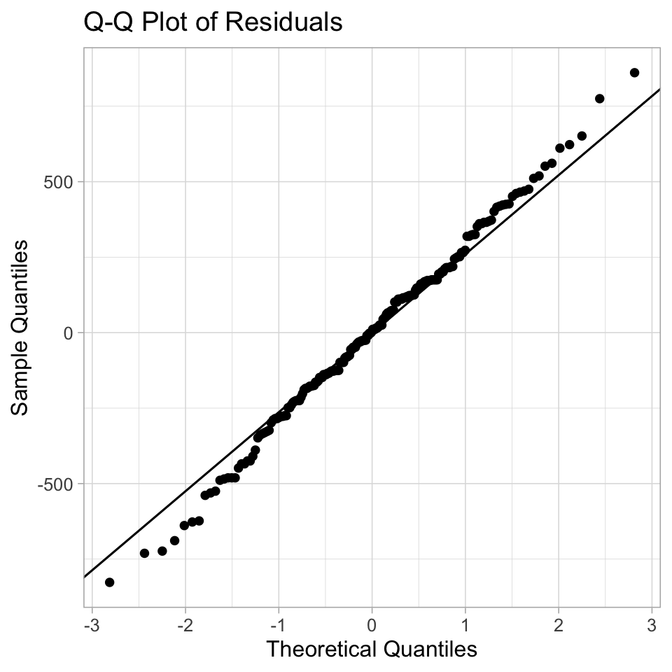{width=336}
:::
:::


# Lecture 12: Factorial ANOVA

## Check for Normality of Residuals


::: {.cell}

```{.r .cell-code}
# Histogram of residuals
ggplot(pb_resid_df, aes(x = .resid)) +
  geom_histogram(bins = 15, fill = "snow", color = "black") +
  labs(title = "Histogram of Residuals",
       x = "Residuals",
       y = "Count")
```

::: {.cell-output-display}
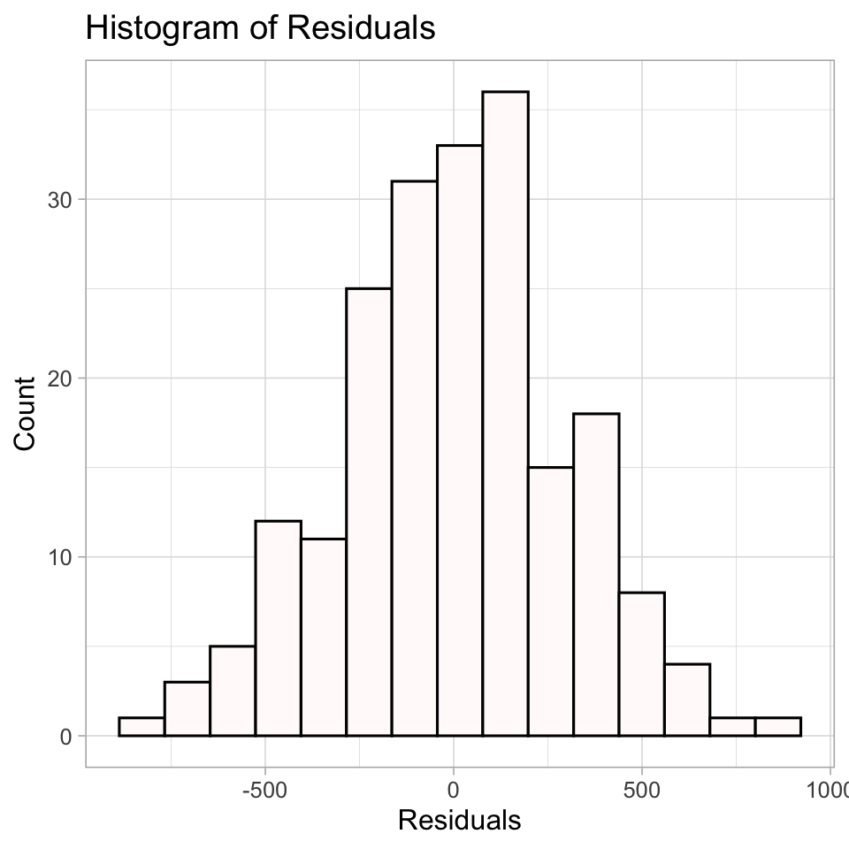{width=336}
:::
:::


# Lecture 12: Factorial ANOVA

## Check for Normality of Residuals


::: {.cell}

```{.r .cell-code}
# Shapiro-Wilk test for normality
shapiro.test(pb_model$residuals)
```

::: {.cell-output .cell-output-stdout}

```

	Shapiro-Wilk normality test

data:  pb_model$residuals
W = 0.99612, p-value = 0.8886
```


:::

```{.r .cell-code}
# or
shapiro.test(residuals(pb_model))
```

::: {.cell-output .cell-output-stdout}

```

	Shapiro-Wilk normality test

data:  residuals(pb_model)
W = 0.99612, p-value = 0.8886
```


:::
:::


# Lecture 12: Factorial ANOVA


::: {.cell}

```{.r .cell-code}
# Levene's test for homogeneity of variances
leveneTest(mass_g ~ spp * sex, data = pb_df)
```

::: {.cell-output .cell-output-stdout}

```
Levene's Test for Homogeneity of Variance (center = median)
       Df F value Pr(>F)
group   5  0.7841 0.5622
      198               
```


:::
:::


# Lecture 12: Factorial ANOVA

## Check for homogeneity of variances


::: {.cell}

```{.r .cell-code}
# Residuals vs. fitted values plot
ggplot(pb_resid_df, aes(x = .fitted, y = .resid)) +
  geom_point() +
  geom_hline(yintercept = 0, linetype = "dashed", color = "red") +
  labs(title = "Residuals vs Fitted Values",
       x = "Fitted Values",
       y = "Residuals")
```

::: {.cell-output-display}
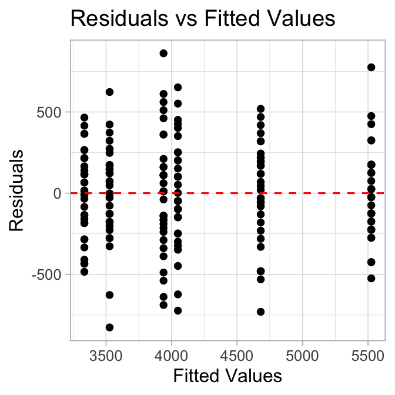{width=336}
:::
:::


# Lecture 12: Factorial ANOVA

## Check for homogeneity of variances


::: {.cell}

```{.r .cell-code}
# Add residuals to original data for plotting
pb_resid_group_df <- pb_df %>%
  mutate(residuals = residuals(pb_model))

# Residuals by group
ggplot(pb_resid_group_df, aes(x = interaction(spp, sex), y = residuals)) +
  geom_boxplot() +
  labs(title = "Residuals by Group",
       x = "Species:Sex Combination",
       y = "Residuals") +
  theme(axis.text.x = element_text(angle = 45, hjust = 1))
```

::: {.cell-output-display}
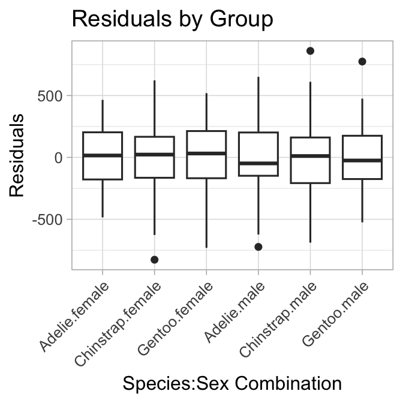{width=336}
:::
:::


# Lecture 12: Factorial ANOVA

## Estimated Marginal Means and Effects


::: {.cell}

```{.r .cell-code}
# Get estimated marginal means from the linear model
# Main effect of species
sppb_emm <- emmeans(pb_model, ~ spp)
sppb_emm
```

::: {.cell-output .cell-output-stdout}

```
 spp       emmean   SE  df lower.CL upper.CL
 Adelie      3692 36.8 198     3619     3764
 Chinstrap   3733 36.8 198     3661     3806
 Gentoo      5103 36.8 198     5030     5175

Results are averaged over the levels of: sex 
Confidence level used: 0.95 
```


:::

```{.r .cell-code}
pairs(sppb_emm)
```

::: {.cell-output .cell-output-stdout}

```
 contrast           estimate SE  df t.ratio p.value
 Adelie - Chinstrap    -41.5 52 198  -0.799  0.7041
 Adelie - Gentoo     -1411.4 52 198 -27.145 <0.0001
 Chinstrap - Gentoo  -1369.9 52 198 -26.346 <0.0001

Results are averaged over the levels of: sex 
P value adjustment: tukey method for comparing a family of 3 estimates 
```


:::
:::


## Estimated Marginal Means and Effects


::: {.cell}

```{.r .cell-code}
plot(sppb_emm)
```

::: {.cell-output-display}
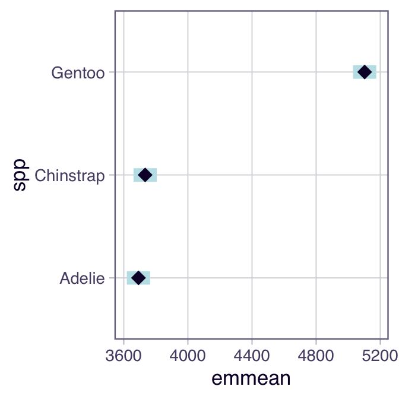{width=336}
:::
:::


# Lecture 12: Factorial ANOVA

## Estimated Marginal Means and Effects


::: {.cell}

```{.r .cell-code}
# Main effect of sex
sexb_emm <- emmeans(pb_model, ~ sex)
sexb_emm
```

::: {.cell-output .cell-output-stdout}

```
 sex    emmean SE  df lower.CL upper.CL
 female   3848 30 198     3788     3907
 male     4504 30 198     4445     4563

Results are averaged over the levels of: spp 
Confidence level used: 0.95 
```


:::

```{.r .cell-code}
pairs(sexb_emm)
```

::: {.cell-output .cell-output-stdout}

```
 contrast      estimate   SE  df t.ratio p.value
 female - male     -657 42.5 198 -15.467 <0.0001

Results are averaged over the levels of: spp 
```


:::
:::


# Lecture 12: Factorial ANOVA

## Estimated Marginal Means and Effects


::: {.cell}

```{.r .cell-code}
# Main effect of sex
plot(sexb_emm)
```

::: {.cell-output-display}
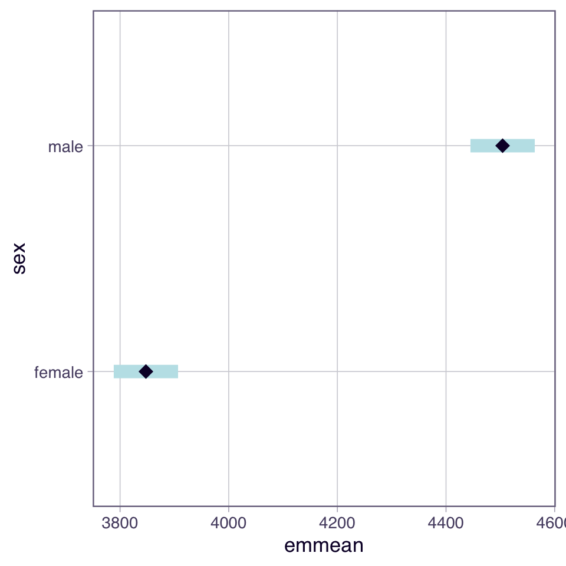{width=336}
:::
:::


# Lecture 12: Factorial ANOVA

## Estimated Marginal Means and Effects


::: {.cell}

```{.r .cell-code}
# Interaction effects
interactionb_emm <- emmeans(pb_model, ~ spp * sex)
interactionb_emm
```

::: {.cell-output .cell-output-stdout}

```
 spp       sex    emmean SE  df lower.CL upper.CL
 Adelie    female   3335 52 198     3232     3437
 Chinstrap female   3527 52 198     3425     3630
 Gentoo    female   4681 52 198     4578     4783
 Adelie    male     4049 52 198     3946     4151
 Chinstrap male     3939 52 198     3836     4042
 Gentoo    male     5525 52 198     5422     5628

Confidence level used: 0.95 
```


:::
:::


::: {.cell}

```{.r .cell-code}
# Compare to raw means
pb_df %>%
  group_by(spp, sex) %>%
  summarise(
    raw_mean = mean(mass_g),
    .groups = 'drop'
  ) %>%
  pivot_wider(names_from = sex, values_from = raw_mean)
```

::: {.cell-output .cell-output-stdout}

```
# A tibble: 3 × 3
  spp       female  male
  <fct>      <dbl> <dbl>
1 Adelie     3335. 4049.
2 Chinstrap  3527. 3939.
3 Gentoo     4681. 5525 
```


:::
:::


::: {.cell}

```{.r .cell-code}
pairs(interactionb_emm)
```

::: {.cell-output .cell-output-stdout}

```
 contrast                          estimate   SE  df t.ratio p.value
 Adelie female - Chinstrap female      -193 73.5 198  -2.620  0.0973
 Adelie female - Gentoo female        -1346 73.5 198 -18.310 <0.0001
 Adelie female - Adelie male           -714 73.5 198  -9.710 <0.0001
 Adelie female - Chinstrap male        -604 73.5 198  -8.220 <0.0001
 Adelie female - Gentoo male          -2190 73.5 198 -29.789 <0.0001
 Chinstrap female - Gentoo female     -1154 73.5 198 -15.690 <0.0001
 Chinstrap female - Adelie male        -521 73.5 198  -7.090 <0.0001
 Chinstrap female - Chinstrap male     -412 73.5 198  -5.600 <0.0001
 Chinstrap female - Gentoo male       -1998 73.5 198 -27.169 <0.0001
 Gentoo female - Adelie male            632 73.5 198   8.600 <0.0001
 Gentoo female - Chinstrap male         742 73.5 198  10.090 <0.0001
 Gentoo female - Gentoo male           -844 73.5 198 -11.480 <0.0001
 Adelie male - Chinstrap male           110 73.5 198   1.490  0.6711
 Adelie male - Gentoo male            -1476 73.5 198 -20.079 <0.0001
 Chinstrap male - Gentoo male         -1586 73.5 198 -21.569 <0.0001

P value adjustment: tukey method for comparing a family of 6 estimates 
```


:::
:::


::: {.cell}

```{.r .cell-code}
# Get compact letter display (cld)
cldb_interaction <- multcomp::cld(interactionb_emm, 
                       Letters = letters,
                       adjust = "sidak")

# Display the results
# print(cld_interaction)

cldb_df <- as.data.frame(cldb_interaction) %>%
  arrange(spp, sex)  # Sort by estimated marginal mean

# View the results with means and grouping letters
print(cldb_df)
```

::: {.cell-output .cell-output-stdout}

```
 spp       sex      emmean       SE  df lower.CL upper.CL .group
 Adelie    female 3334.559 51.99448 198 3196.378 3472.740  a    
 Adelie    male   4048.529 51.99448 198 3910.349 4186.710   b   
 Chinstrap female 3527.206 51.99448 198 3389.025 3665.387  a    
 Chinstrap male   3938.971 51.99448 198 3800.790 4077.151   b   
 Gentoo    female 4680.882 51.99448 198 4542.702 4819.063    c  
 Gentoo    male   5525.000 51.99448 198 5386.819 5663.181     d 

Confidence level used: 0.95 
Conf-level adjustment: sidak method for 6 estimates 
P value adjustment: sidak method for 15 tests 
significance level used: alpha = 0.05 
NOTE: If two or more means share the same grouping symbol,
      then we cannot show them to be different.
      But we also did not show them to be the same. 
```


:::
:::


# Lecture 12: Factorial ANOVA

## Estimated Marginal Means and Effects


::: {.cell}

```{.r .cell-code}
# Interaction plot with confidence intervals
emmip(pb_model, sex ~ spp, CIs = TRUE) +
  labs(title = "Interaction Plot",
       x = "Species",
       y = "Body Mass (g)")
```

::: {.cell-output-display}
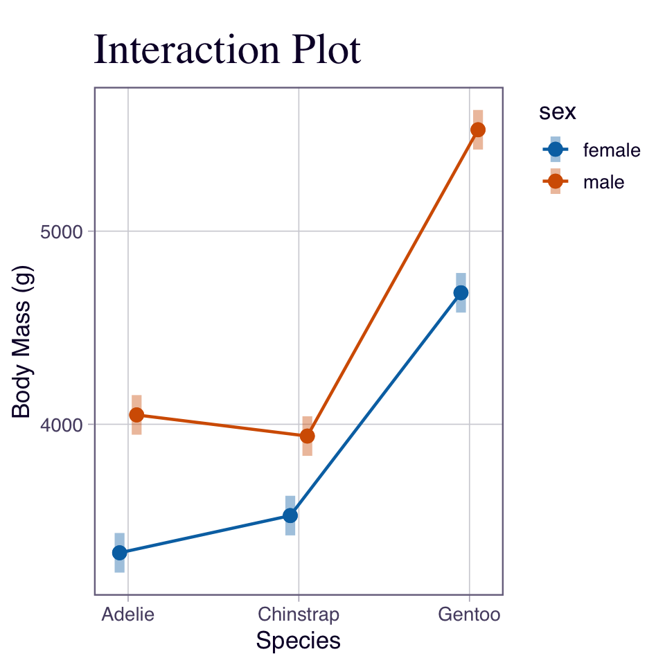{width=336}
:::
:::


# Lecture 12: Factorial ANOVA

## Estimated Marginal Means and Effects


::: {.cell}

```{.r .cell-code}
# Convert emmeans object to data frame
interactionb_df <- as.data.frame(interactionb_emm)
interactionb_df
```

::: {.cell-output .cell-output-stdout}

```
 spp       sex      emmean       SE  df lower.CL upper.CL
 Adelie    female 3334.559 51.99448 198 3232.025 3437.093
 Chinstrap female 3527.206 51.99448 198 3424.672 3629.740
 Gentoo    female 4680.882 51.99448 198 4578.348 4783.416
 Adelie    male   4048.529 51.99448 198 3945.995 4151.063
 Chinstrap male   3938.971 51.99448 198 3836.437 4041.505
 Gentoo    male   5525.000 51.99448 198 5422.466 5627.534

Confidence level used: 0.95 
```


:::
:::


# Lecture 12: Factorial ANOVA

## This is a plot you might produce for publication


::: {.cell}

```{.r .cell-code}
# Publication-quality plot with model predictions
# Convert emmeans object to data frame
pubb_interaction_df <- as.data.frame(interactionb_emm)

# Create enhanced plot with model predictions
pubb_plot <- ggplot(pubb_interaction_df, aes(x = spp, y = emmean, 
                                       color = sex, group = sex)) +
  # Add lines connecting the means
  geom_line(linewidth = 1,
            position = position_dodge(width = 0.2)) +
  # Add points at each mean
  geom_point(size = 3,
            position = position_dodge(width = 0.2)) +
  # Add error bars showing standard error
  geom_errorbar(aes(ymin = emmean - SE, ymax = emmean + SE), 
                width = 0.2,
                position = position_dodge(width = 0.2)) +
  # Simple labels
  labs(
    x = "Species",
    y = "Body Mass (g)",
    color = "Sex"
  ) +
  theme_light()

pubb_plot
```

::: {.cell-output-display}
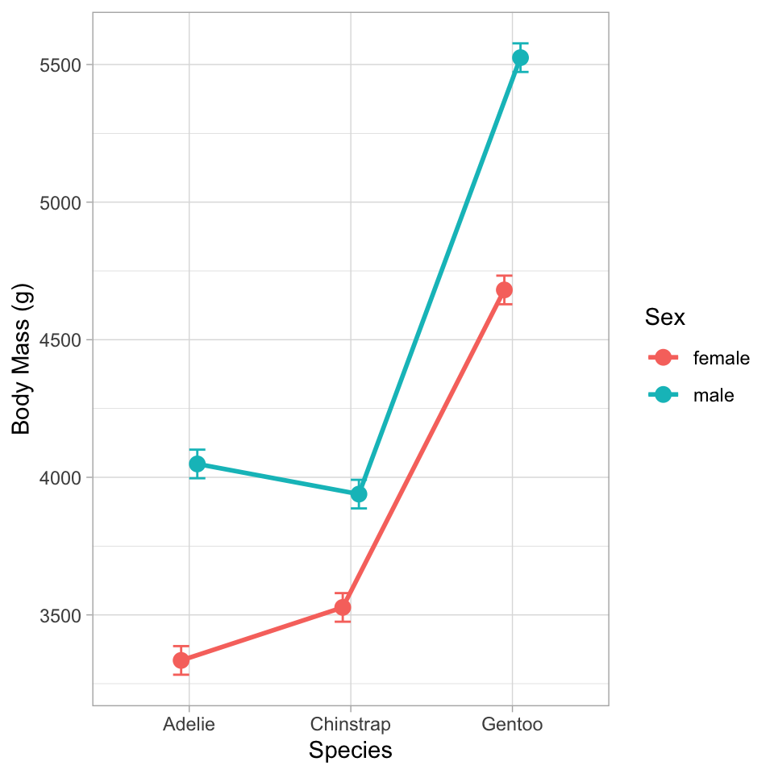{width=336}
:::
:::


# Lecture 12: Results Interpretation for Linear Model Approach

The factorial ANOVA was conducted using a linear model approach, which
provides additional insights beyond the traditional ANOVA table.

Key findings from the linear model analysis:

1.  **Interaction effect**: The interaction between species and sex was
    \[significant/not significant\] (F = \[value from output\], df = 2,
    \[residual df\], p = \[value from output\]), indicating that the
    difference between males and females \[varies/is consistent\] across
    species.

2.  **Model fit**: The overall model explains approximately \[value\]%
    of the variance in body mass (R-squared = \[value\]), indicating a
    good fit to the data.

# Lecture 12: Understanding Sums of Squares Types

When we have balanced designs (equal sample sizes) or want to test
different hypotheses, we can use different types of sums of squares.
Let's compare Type I, Type II, and Type III.

## Type I Sums of Squares (Sequential)


::: {.cell}

```{.r .cell-code}
# Type I SS - order matters!
# This is the default in R's anova() function
type1b_anova <- anova(pb_model)
type1b_anova
```

::: {.cell-output .cell-output-stdout}

```
Analysis of Variance Table

Response: mass_g
           Df   Sum Sq  Mean Sq  F value    Pr(>F)    
spp         2 87725999 43862999 477.2049 < 2.2e-16 ***
sex         1 21988483 21988483 239.2224 < 2.2e-16 ***
spp:sex     2  1672776   836388   9.0994 0.0001657 ***
Residuals 198 18199467    91916                       
---
Signif. codes:  0 '***' 0.001 '**' 0.01 '*' 0.05 '.' 0.1 ' ' 1
```


:::
:::


Type I SS tests effects in the order they appear in the model. Each term
is adjusted for terms that appear before it in the model.

## Type II Sums of Squares


::: {.cell}

```{.r .cell-code}
# Type II SS - each main effect adjusted for other main effects
# but not for interactions
type2b_anova <- Anova(pb_model, type = 2)
type2b_anova
```

::: {.cell-output .cell-output-stdout}

```
Anova Table (Type II tests)

Response: mass_g
            Sum Sq  Df  F value    Pr(>F)    
spp       87725999   2 477.2049 < 2.2e-16 ***
sex       21988483   1 239.2224 < 2.2e-16 ***
spp:sex    1672776   2   9.0994 0.0001657 ***
Residuals 18199467 198                       
---
Signif. codes:  0 '***' 0.001 '**' 0.01 '*' 0.05 '.' 0.1 ' ' 1
```


:::
:::


Type II SS tests each main effect after adjusting for other main
effects, but not for the interaction. This is appropriate when
interactions are not significant.

## Type III Sums of Squares


::: {.cell}

```{.r .cell-code}
# Type III SS - each effect adjusted for all other effects
# This is what we used earlier
type3b_anova <- Anova(pb_model, type = 3)
type3b_anova
```

::: {.cell-output .cell-output-stdout}

```
Anova Table (Type III tests)

Response: mass_g
                Sum Sq  Df    F value    Pr(>F)    
(Intercept) 3557308900   1 38701.5271 < 2.2e-16 ***
spp           87725999   2   477.2049 < 2.2e-16 ***
sex           21988483   1   239.2224 < 2.2e-16 ***
spp:sex        1672776   2     9.0994 0.0001657 ***
Residuals     18199467 198                         
---
Signif. codes:  0 '***' 0.001 '**' 0.01 '*' 0.05 '.' 0.1 ' ' 1
```


:::
:::


Type III SS tests each effect after adjusting for all other effects in
the model. This is the most conservative approach and is commonly used
in unbalanced designs.

## Comparing the Three Types


::: {.cell}

```{.r .cell-code}
# Create a comparison table of F-values
ssb_comparison_df <- data.frame(
  Effect = c("Species", "Sex", "Species:Sex"),
  Typeb_I_F = round(type1b_anova$`F value`[1:3], 2),
  Typeb_II_F = round(type2b_anova$`F value`[2:4], 2),
  Typeb_III_F = round(type3b_anova$`F value`[2:4], 2)
)

ssb_comparison_df
```

::: {.cell-output .cell-output-stdout}

```
       Effect Typeb_I_F Typeb_II_F Typeb_III_F
1     Species    477.20     239.22      477.20
2         Sex    239.22       9.10      239.22
3 Species:Sex      9.10         NA        9.10
```


:::
:::


::: {.cell}

```{.r .cell-code}
# Create a comparison table of p-values
pb_comparison_df <- data.frame(
  Effect = c("Species", "Sex", "Species:Sex"),
  Typeb_I_p = round(type1b_anova$`Pr(>F)`[1:3], 4),
  Typeb_II_p = round(type2b_anova$`Pr(>F)`[2:4], 4),
  Typeb_III_p = round(type3b_anova$`Pr(>F)`[2:4], 4)
)

pb_comparison_df
```

::: {.cell-output .cell-output-stdout}

```
       Effect Typeb_I_p Typeb_II_p Typeb_III_p
1     Species     0e+00      0e+00       0e+00
2         Sex     0e+00      2e-04       0e+00
3 Species:Sex     2e-04         NA       2e-04
```


:::
:::


## When Does It Matter?

The choice of SS type matters most when:

1.  **Unbalanced designs**: When sample sizes differ across groups
2.  **Correlated predictors**: When predictors are not orthogonal
3.  **Interactions present**: When there are significant interactions

For balanced designs (equal sample sizes in all cells), all three types
give the same results for main effects.

# This is the unbalanced Factorial ANOVA

We will work through the exact same data but when it was unbalanced to
see the effect that balanced and unbalanced have

# Lecture 12: Factorial ANOVA

## ANOVA Assumptions

In the factorial ANOVA, we need to check several assumptions after
fitting the model:

1.  Independence of observations
2.  Normality of residuals
3.  Homogeneity of variances

Fit the model


::: {.cell}

```{.r .cell-code}
# Fit the factorial ANOVA using linear model (lm) instead of aov
pu_model <- lm(mass_g ~ spp * sex, data = p_df)

# View the model summary to see coefficients, standard errors, etc.
summary(pu_model)
```

::: {.cell-output .cell-output-stdout}

```

Call:
lm(formula = mass_g ~ spp * sex, data = p_df)

Residuals:
    Min      1Q  Median      3Q     Max 
-827.21 -213.97   11.03  206.51  861.03 

Coefficients:
            Estimate Std. Error t value Pr(>|t|)    
(Intercept)  4173.85      17.85 233.799  < 2e-16 ***
spp1         -467.68      23.18 -20.177  < 2e-16 ***
spp2         -440.76      28.07 -15.702  < 2e-16 ***
sex1         -315.25      17.85 -17.659  < 2e-16 ***
spp1:sex1     -22.08      23.18  -0.952 0.341589    
spp2:sex1     109.37      28.07   3.896 0.000118 ***
---
Signif. codes:  0 '***' 0.001 '**' 0.01 '*' 0.05 '.' 0.1 ' ' 1

Residual standard error: 309.4 on 327 degrees of freedom
Multiple R-squared:  0.8546,	Adjusted R-squared:  0.8524 
F-statistic: 384.3 on 5 and 327 DF,  p-value: < 2.2e-16
```


:::
:::


::: {.cell}

```{.r .cell-code}
Anova(pu_model, type = 3)
```

::: {.cell-output .cell-output-stdout}

```
Anova Table (Type III tests)

Response: mass_g
                Sum Sq  Df   F value    Pr(>F)    
(Intercept) 5232595969   1 54661.828 < 2.2e-16 ***
spp          143001222   2   746.924 < 2.2e-16 ***
sex           29851220   1   311.838 < 2.2e-16 ***
spp:sex        1676557   2     8.757 0.0001973 ***
Residuals     31302628 327                        
---
Signif. codes:  0 '***' 0.001 '**' 0.01 '*' 0.05 '.' 0.1 ' ' 1
```


:::
:::


# Lecture 12: Factorial ANOVA

## ASSUMPTIONS


::: {.cell}

```{.r .cell-code}
# Create diagnostic plots
par(mfrow = c(2, 2))
plot(pu_model)
```

::: {.cell-output-display}
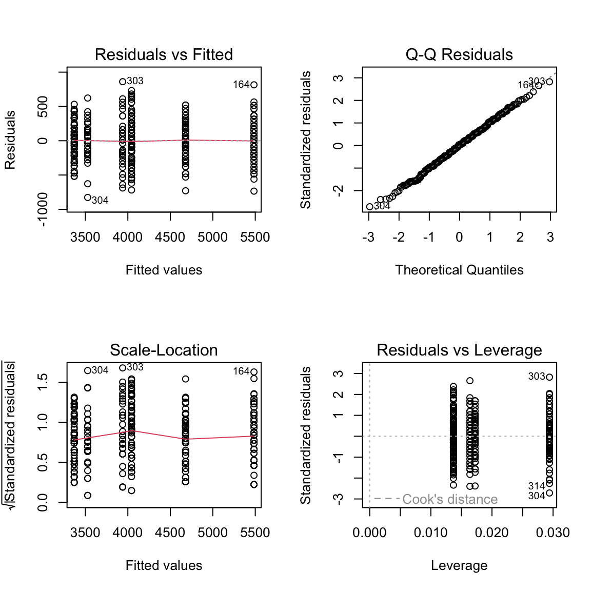{width=576}
:::

```{.r .cell-code}
par(mfrow = c(1, 1))
```
:::


## Check for Normality of Residuals


::: {.cell}

```{.r .cell-code}
# Extract residuals from the model
pu_resid_df <- augment(pu_model)

# Create Q-Q plot of residuals
ggplot(pu_resid_df, aes(sample = .resid)) +
  stat_qq() +
  stat_qq_line() +
  labs(title = "Q-Q Plot of Residuals",
       x = "Theoretical Quantiles",
       y = "Sample Quantiles")
```

::: {.cell-output-display}
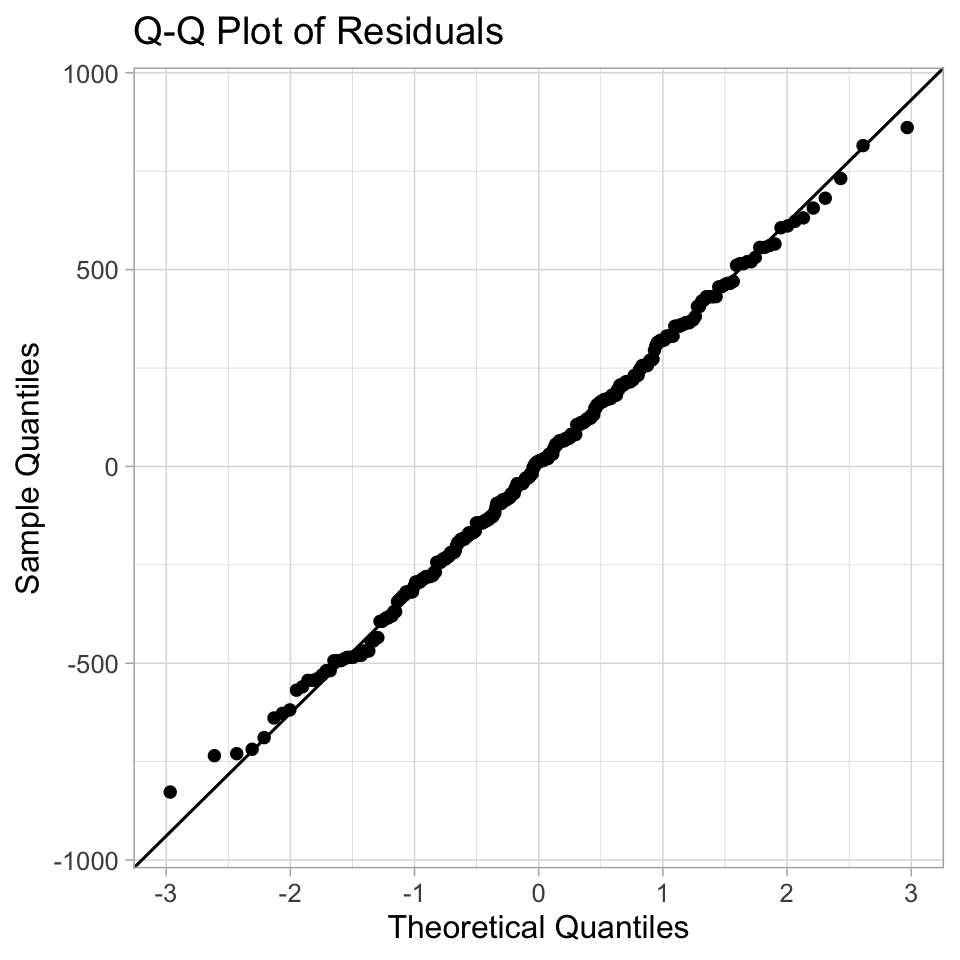{width=336}
:::
:::


# Lecture 12: Factorial ANOVA

## Check for Normality of Residuals


::: {.cell}

```{.r .cell-code}
# Histogram of residuals
ggplot(pu_resid_df, aes(x = .resid)) +
  geom_histogram(bins = 15, fill = "snow", color = "black") +
  labs(title = "Histogram of Residuals",
       x = "Residuals",
       y = "Count")
```

::: {.cell-output-display}
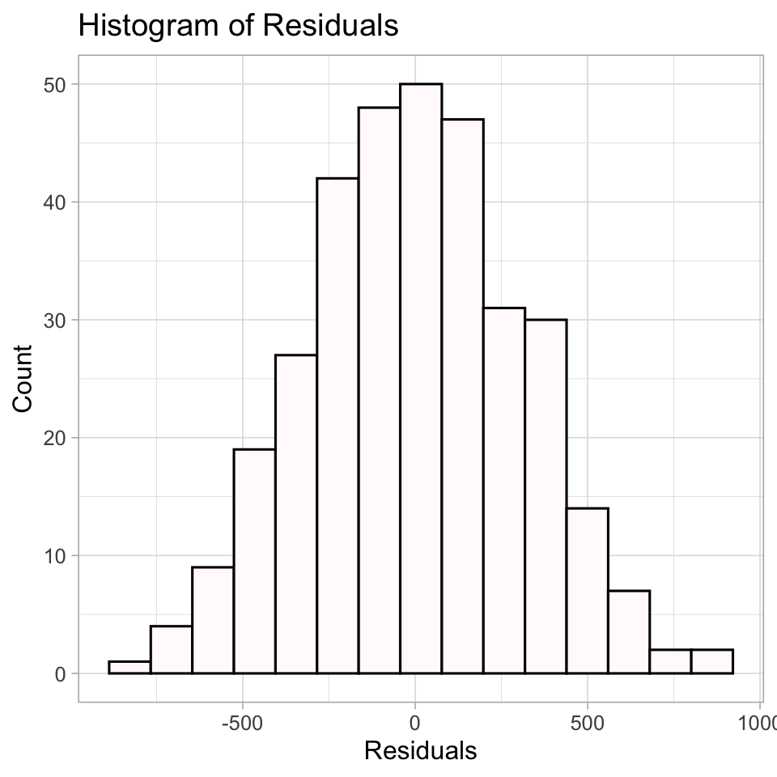{width=336}
:::
:::


# Lecture 12: Factorial ANOVA

## Check for Normality of Residuals


::: {.cell}

```{.r .cell-code}
# Shapiro-Wilk test for normality
shapiro.test(pu_model$residuals)
```

::: {.cell-output .cell-output-stdout}

```

	Shapiro-Wilk normality test

data:  pu_model$residuals
W = 0.99776, p-value = 0.9367
```


:::
:::


# Lecture 12: Factorial ANOVA


::: {.cell}

```{.r .cell-code}
# Levene's test for homogeneity of variances
leveneTest(mass_g ~ spp * sex, data = p_df)
```

::: {.cell-output .cell-output-stdout}

```
Levene's Test for Homogeneity of Variance (center = median)
       Df F value Pr(>F)
group   5  1.3908 0.2272
      327               
```


:::
:::


# Lecture 12: Factorial ANOVA

## Check for homogeneity of variances


::: {.cell}

```{.r .cell-code}
# Residuals vs. fitted values plot
ggplot(pu_resid_df, aes(x = .fitted, y = .resid)) +
  geom_point() +
  geom_hline(yintercept = 0, linetype = "dashed", color = "red") +
  labs(title = "Residuals vs Fitted Values",
       x = "Fitted Values",
       y = "Residuals")
```

::: {.cell-output-display}
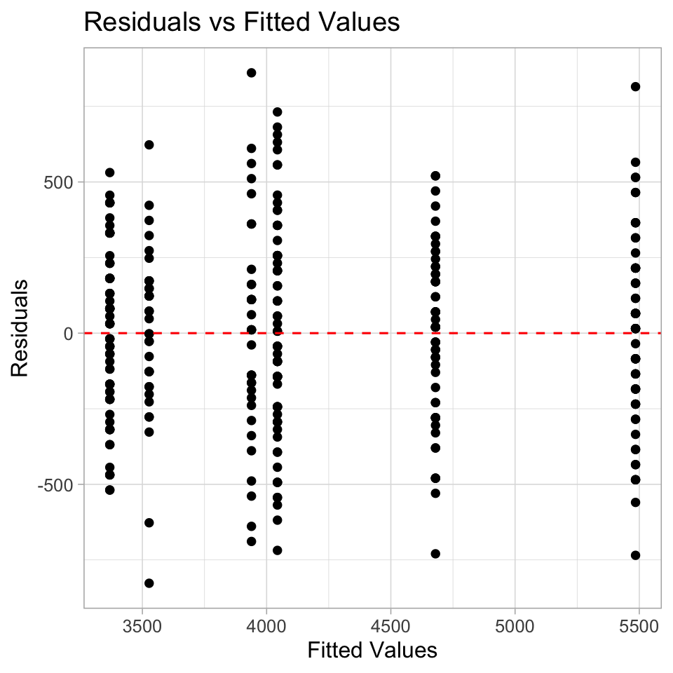{width=336}
:::
:::


# Lecture 12: Factorial ANOVA

## Check for homogeneity of variances


::: {.cell}

```{.r .cell-code}
# Add residuals to original data for plotting
pu_resid_group_df <- p_df %>%
  mutate(residuals = residuals(pu_model))

# Residuals by group
ggplot(pu_resid_group_df, aes(x = interaction(spp, sex), y = residuals)) +
  geom_boxplot() +
  labs(title = "Residuals by Group",
       x = "Species:Sex Combination",
       y = "Residuals") +
  theme(axis.text.x = element_text(angle = 45, hjust = 1))
```

::: {.cell-output-display}
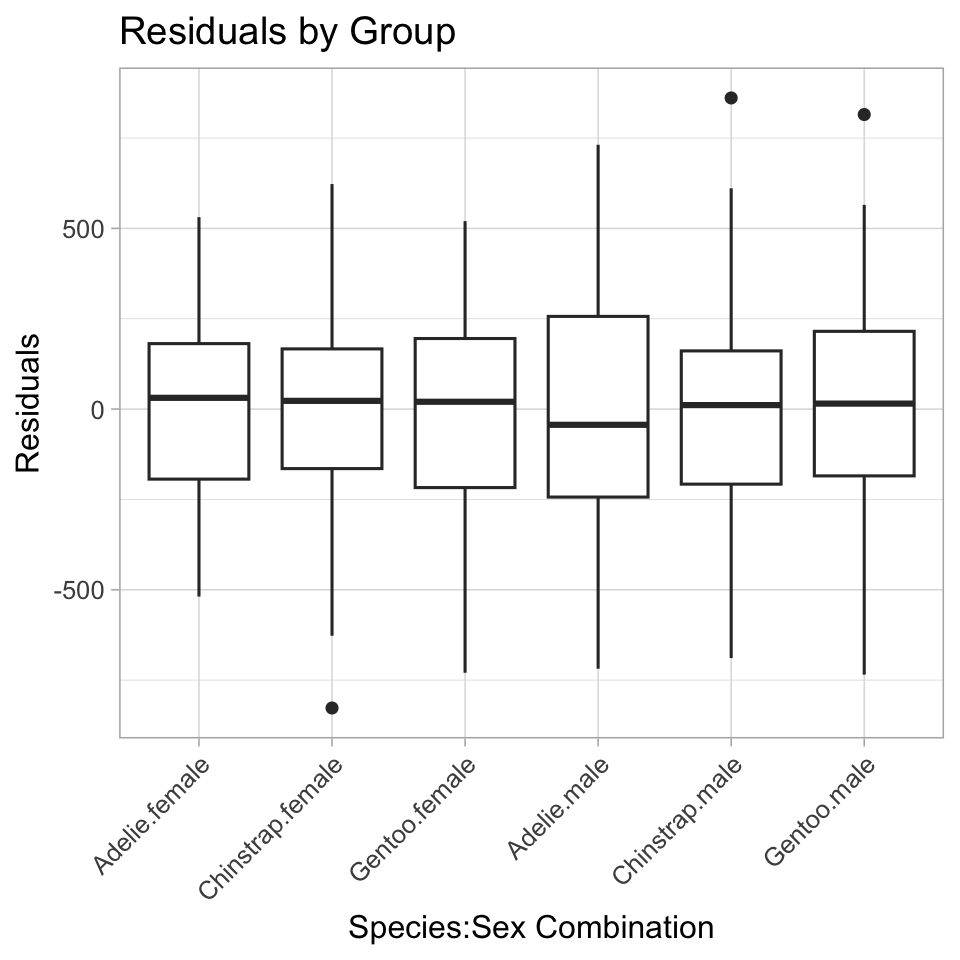{width=336}
:::
:::


# Lecture 12: Factorial ANOVA

## Estimated Marginal Means and Effects


::: {.cell}

```{.r .cell-code}
# Get estimated marginal means from the linear model
# Main effect of species
sppu_emm <- emmeans(pu_model, ~ spp)
sppu_emm
```

::: {.cell-output .cell-output-stdout}

```
 spp       emmean   SE  df lower.CL upper.CL
 Adelie      3706 25.6 327     3656     3757
 Chinstrap   3733 37.5 327     3659     3807
 Gentoo      5082 28.4 327     5026     5138

Results are averaged over the levels of: sex 
Confidence level used: 0.95 
```


:::

```{.r .cell-code}
pairs(sppu_emm)
```

::: {.cell-output .cell-output-stdout}

```
 contrast           estimate   SE  df t.ratio p.value
 Adelie - Chinstrap    -26.9 45.4 327  -0.593  0.8241
 Adelie - Gentoo     -1376.1 38.2 327 -36.007 <0.0001
 Chinstrap - Gentoo  -1349.2 47.0 327 -28.682 <0.0001

Results are averaged over the levels of: sex 
P value adjustment: tukey method for comparing a family of 3 estimates 
```


:::
:::


## Estimated Marginal Means and Effects


::: {.cell}

```{.r .cell-code}
plot(sppu_emm)
```

::: {.cell-output-display}
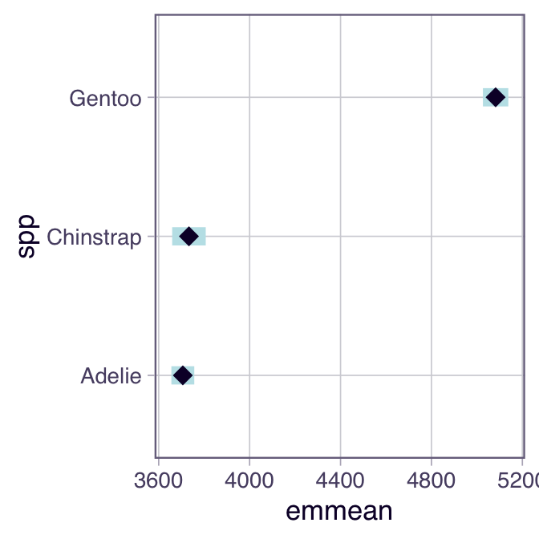{width=336}
:::
:::


# Lecture 12: Factorial ANOVA

## Estimated Marginal Means and Effects


::: {.cell}

```{.r .cell-code}
# Main effect of sex
sexu_emm <- emmeans(pu_model, ~ sex)
sexu_emm
```

::: {.cell-output .cell-output-stdout}

```
 sex    emmean   SE  df lower.CL upper.CL
 female   3859 25.3 327     3809     3908
 male     4489 25.2 327     4440     4539

Results are averaged over the levels of: spp 
Confidence level used: 0.95 
```


:::

```{.r .cell-code}
pairs(sexu_emm)
```

::: {.cell-output .cell-output-stdout}

```
 contrast      estimate   SE  df t.ratio p.value
 female - male     -631 35.7 327 -17.659 <0.0001

Results are averaged over the levels of: spp 
```


:::
:::


# Lecture 12: Factorial ANOVA

## Estimated Marginal Means and Effects


::: {.cell}

```{.r .cell-code}
# Main effect of sex
plot(sexu_emm)
```

::: {.cell-output-display}
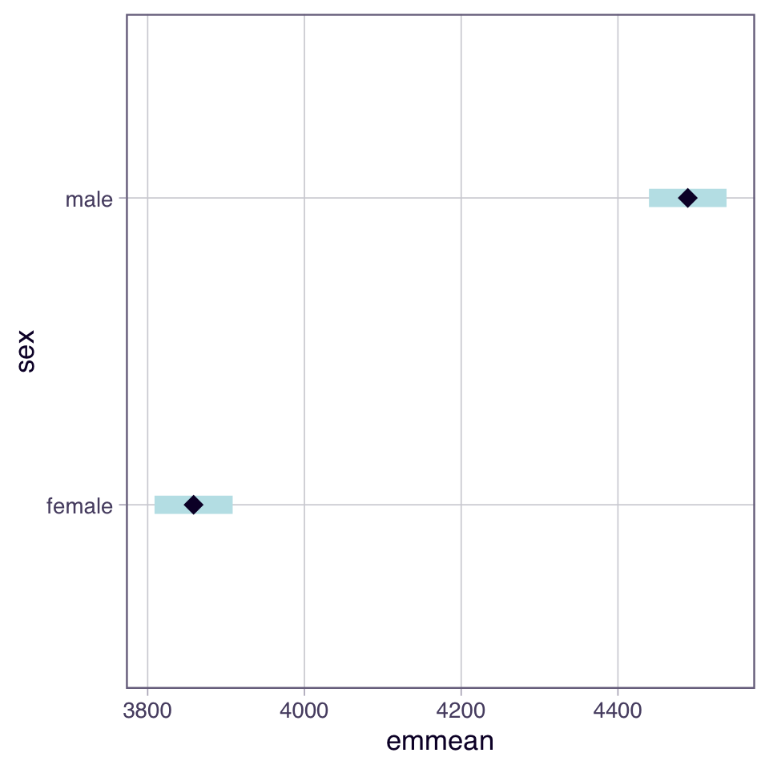{width=336}
:::
:::


# Lecture 12: Factorial ANOVA

## Estimated Marginal Means and Effects


::: {.cell}

```{.r .cell-code}
# Interaction effects
interactionu_emm <- emmeans(pu_model, ~ spp * sex)
interactionu_emm
```

::: {.cell-output .cell-output-stdout}

```
 spp       sex    emmean   SE  df lower.CL upper.CL
 Adelie    female   3369 36.2 327     3298     3440
 Chinstrap female   3527 53.1 327     3423     3632
 Gentoo    female   4680 40.6 327     4600     4760
 Adelie    male     4043 36.2 327     3972     4115
 Chinstrap male     3939 53.1 327     3835     4043
 Gentoo    male     5485 39.6 327     5407     5563

Confidence level used: 0.95 
```


:::

```{.r .cell-code}
# ~ species | sex - Gets species means conditional on each sex level separately. 
# This is useful for simple effects 
# (e.g., "Is there a species effect within males? Within females?") 
# but it's not the same as the interaction.
```
:::


::: {.cell}

```{.r .cell-code}
# Compare to raw means
p_df %>%
  group_by(spp, sex) %>%
  summarise(
    raw_mean = mean(mass_g),
    .groups = 'drop'
  ) %>%
  pivot_wider(names_from = sex, values_from = raw_mean)
```

::: {.cell-output .cell-output-stdout}

```
# A tibble: 3 × 3
  spp       female  male
  <fct>      <dbl> <dbl>
1 Adelie     3369. 4043.
2 Chinstrap  3527. 3939.
3 Gentoo     4680. 5485.
```


:::
:::


::: {.cell}

```{.ru .cell-code}
# Get compact letter display (cld)
cldu_interaction <- multcomp::cld(interactionu_emm, 
                       Letters = letters,
                       adjust = "sidak")

# Display the results
# print(cld_interaction)

cldu_df <- as.data.frame(cldu_interaction) %>%
  arrange(spp, sex)  # Sort by estimated marginal mean

# View the results with means and grouping letters
print(cldu_df)
```
:::


# Lecture 12: Factorial ANOVA

## Estimated Marginal Means and Effects


::: {.cell}

```{.r .cell-code}
# Interaction plot with confidence intervals
emmip(pu_model, sex ~ spp, CIs = TRUE) +
  labs(title = "Interaction Plot",
       x = "Species",
       y = "Body Mass (g)")
```

::: {.cell-output-display}
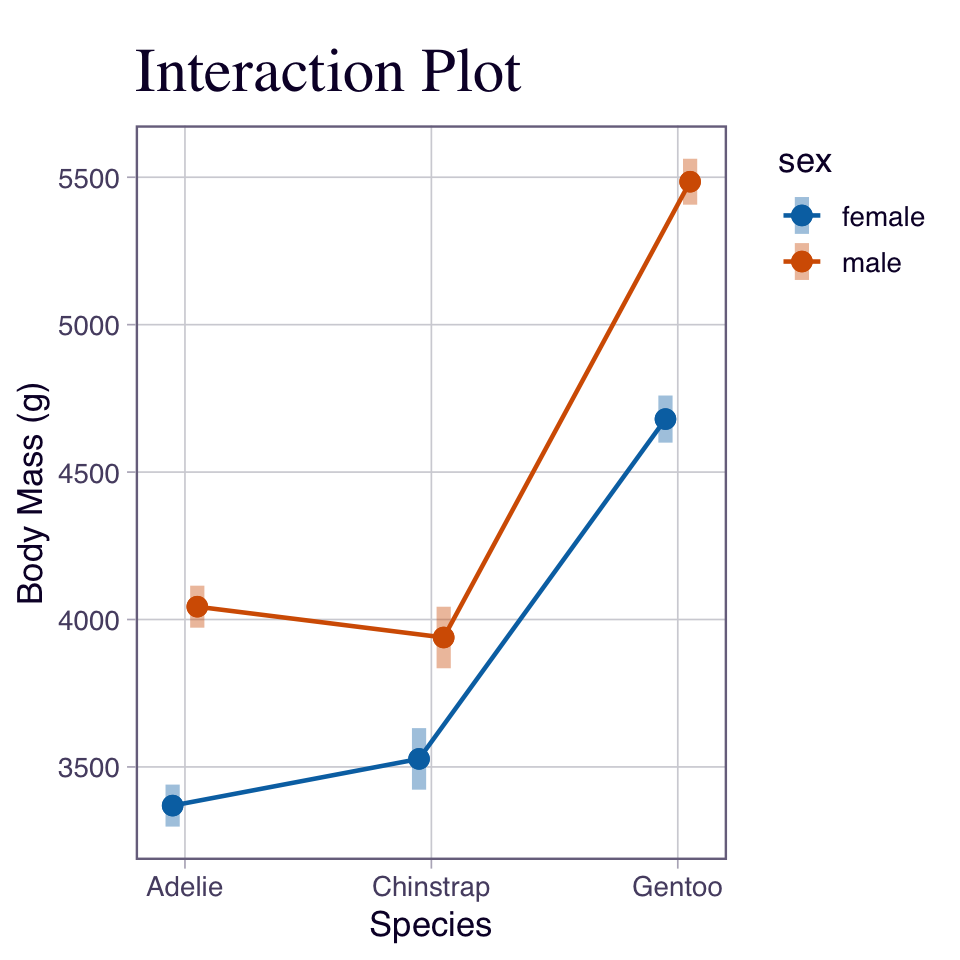{width=336}
:::
:::


# Lecture 12: Factorial ANOVA

## Estimated Marginal Means and Effects


::: {.cell}

```{.r .cell-code}
# Convert emmeans object to data frame
interactionu_df <- as.data.frame(interactionu_emm)
interactionu_df
```

::: {.cell-output .cell-output-stdout}

```
 spp       sex      emmean       SE  df lower.CL upper.CL
 Adelie    female 3368.836 36.21222 327 3297.597 3440.074
 Chinstrap female 3527.206 53.06120 327 3422.821 3631.590
 Gentoo    female 4679.741 40.62586 327 4599.820 4759.662
 Adelie    male   4043.493 36.21222 327 3972.255 4114.731
 Chinstrap male   3938.971 53.06120 327 3834.586 4043.355
 Gentoo    male   5484.836 39.61427 327 5406.905 5562.767

Confidence level used: 0.95 
```


:::
:::


# Lecture 12: Factorial ANOVA

## This is a plot you might produce for publication


::: {.cell}

```{.r .cell-code}
# Publication-quality plot with model predictions
# Convert emmeans object to data frame
pub_interaction_df <- as.data.frame(interactionu_emm)

# Create enhanced plot with model predictions
pub_plot <- ggplot(pub_interaction_df, aes(x = spp, y = emmean, 
                                       color = sex, group = sex)) +
  # Add lines connecting the means
  geom_line(linewidth = 1,
            position = position_dodge(width = 0.2)) +
  # Add points at each mean
  geom_point(size = 3,
            position = position_dodge(width = 0.2)) +
  # Add error bars showing standard error
  geom_errorbar(aes(ymin = emmean - SE, ymax = emmean + SE), 
                width = 0.2,
                position = position_dodge(width = 0.2)) +
  # Simple labels
  labs(
    x = "Species",
    y = "Body Mass (g)",
    color = "Sex"
  ) +
  theme_light()

pub_plot
```

::: {.cell-output-display}
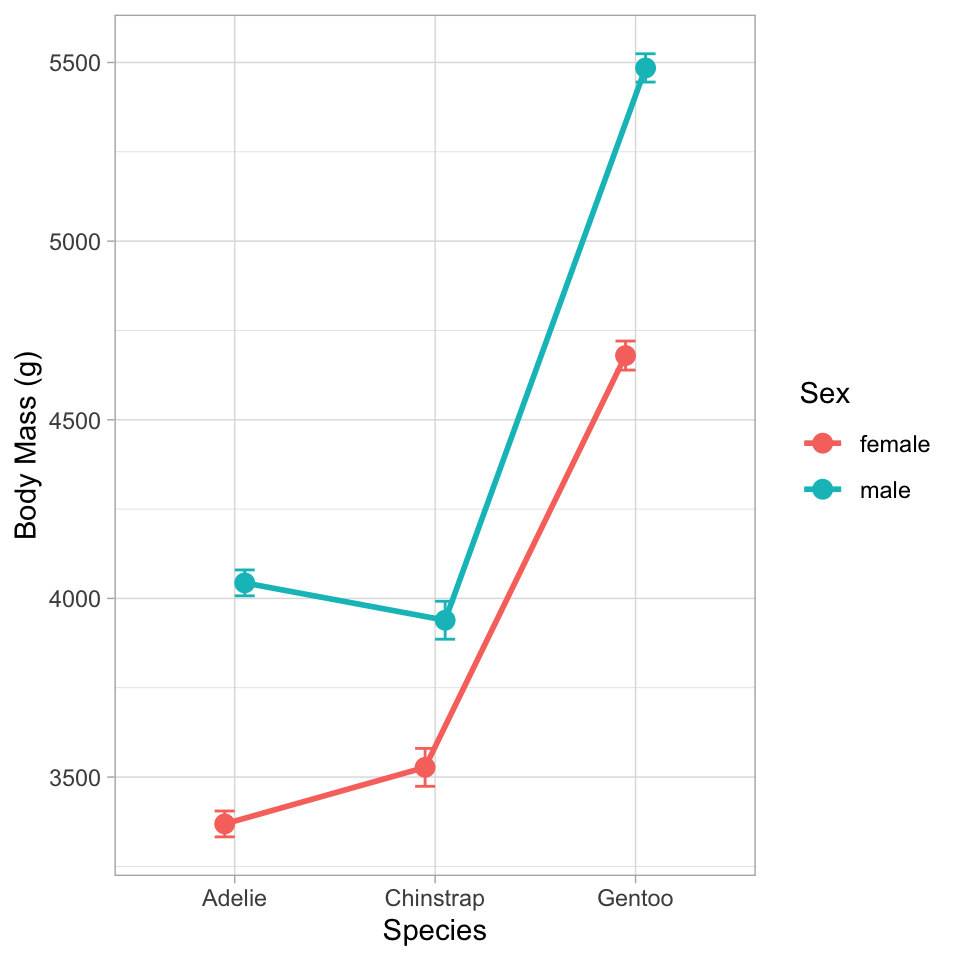{width=336}
:::
:::


# Lecture 12: Results Interpretation for Linear Model Approach

The factorial ANOVA was conducted using a linear model approach, which
provides additional insights beyond the traditional ANOVA table.

Key findings from the linear model analysis:

1.  **Main effect of species**: There was a significant effect of
    species on body mass (F = \[value from output\], df = 2, \[residual
    df\], p \< 0.001). Post-hoc comparisons showed that all three
    species differed significantly from each other in body mass.

2.  **Interaction effect**: The interaction between species and sex was
    \[significant/not significant\] (F = \[value from output\], df = 2,
    \[residual df\], p = \[value from output\]), indicating that the
    difference between males and females \[varies/is consistent\] across
    species.

3.  **Effect sizes and coefficients**: The linear model shows that:

    -   The intercept (reference level: Adelie, Female) has an estimated
        body mass of approximately \[value\] grams

    -   Males weigh approximately \[value\] grams more than females

    -   Chinstrap penguins differ from Adelie by approximately \[value\]
        grams

    -   Gentoo penguins differ from Adelie by approximately \[value\]
        grams

    -   The interaction terms indicate how the sex difference varies
        across species

4.  **Model fit**: The overall model explains approximately \[value\]%
    of the variance in body mass (R-squared = \[value\]), indicating a
    good fit to the data.

# Lecture 12: Understanding Sums of Squares Types

When we have unbalanced designs (unequal sample sizes) or want to test
different hypotheses, we can use different types of sums of squares.
Let's compare Type I, Type II, and Type III.

## Type I Sums of Squares (Sequential)


::: {.cell}

```{.r .cell-code}
# Type I SS - order matters!
# This is the default in R's anova() function
type1_anova <- anova(pu_model)
type1_anova
```

::: {.cell-output .cell-output-stdout}

```
Analysis of Variance Table

Response: mass_g
           Df    Sum Sq  Mean Sq F value    Pr(>F)    
spp         2 145190219 72595110 758.358 < 2.2e-16 ***
sex         1  37090262 37090262 387.460 < 2.2e-16 ***
spp:sex     2   1676557   838278   8.757 0.0001973 ***
Residuals 327  31302628    95727                      
---
Signif. codes:  0 '***' 0.001 '**' 0.01 '*' 0.05 '.' 0.1 ' ' 1
```


:::
:::


Type I SS tests effects in the order they appear in the model. Each term
is adjusted for terms that appear before it in the model.

## Type II Sums of Squares


::: {.cell}

```{.r .cell-code}
# Type II SS - each main effect adjusted for other main effects
# but not for interactions
type2_anova <- Anova(pu_model, type = 2)
type2_anova
```

::: {.cell-output .cell-output-stdout}

```
Anova Table (Type II tests)

Response: mass_g
             Sum Sq  Df F value    Pr(>F)    
spp       143401584   2 749.016 < 2.2e-16 ***
sex        37090262   1 387.460 < 2.2e-16 ***
spp:sex     1676557   2   8.757 0.0001973 ***
Residuals  31302628 327                      
---
Signif. codes:  0 '***' 0.001 '**' 0.01 '*' 0.05 '.' 0.1 ' ' 1
```


:::
:::


Type II SS tests each main effect after adjusting for other main
effects, but not for the interaction. This is appropriate when
interactions are not significant.

## Type III Sums of Squares


::: {.cell}

```{.r .cell-code}
# Type III SS - each effect adjusted for all other effects
# This is what we used earlier
type3_anova <- Anova(pu_model, type = 3)
type3_anova
```

::: {.cell-output .cell-output-stdout}

```
Anova Table (Type III tests)

Response: mass_g
                Sum Sq  Df   F value    Pr(>F)    
(Intercept) 5232595969   1 54661.828 < 2.2e-16 ***
spp          143001222   2   746.924 < 2.2e-16 ***
sex           29851220   1   311.838 < 2.2e-16 ***
spp:sex        1676557   2     8.757 0.0001973 ***
Residuals     31302628 327                        
---
Signif. codes:  0 '***' 0.001 '**' 0.01 '*' 0.05 '.' 0.1 ' ' 1
```


:::
:::


Type III SS tests each effect after adjusting for all other effects in
the model. This is the most conservative approach and is commonly used
in unbalanced designs.

## Comparing the Three Types


::: {.cell}

```{.r .cell-code}
# Create a comparison table of F-values
ss_comparison_df <- data.frame(
  Effect = c("Species", "Sex", "Species:Sex"),
  Type_I_F = round(type1_anova$`F value`[1:3], 2),
  Type_II_F = round(type2_anova$`F value`[2:4], 2),
  Type_III_F = round(type3_anova$`F value`[2:4], 2)
)

ss_comparison_df
```

::: {.cell-output .cell-output-stdout}

```
       Effect Type_I_F Type_II_F Type_III_F
1     Species   758.36    387.46     746.92
2         Sex   387.46      8.76     311.84
3 Species:Sex     8.76        NA       8.76
```


:::
:::


::: {.cell}

```{.r .cell-code}
# Create a comparison table of p-values
p_comparison_df <- data.frame(
  Effect = c("Species", "Sex", "Species:Sex"),
  Type_I_p = round(type1_anova$`Pr(>F)`[1:3], 4),
  Type_II_p = round(type2_anova$`Pr(>F)`[2:4], 4),
  Type_III_p = round(type3_anova$`Pr(>F)`[2:4], 4)
)

p_comparison_df
```

::: {.cell-output .cell-output-stdout}

```
       Effect Type_I_p Type_II_p Type_III_p
1     Species    0e+00     0e+00      0e+00
2         Sex    0e+00     2e-04      0e+00
3 Species:Sex    2e-04        NA      2e-04
```


:::
:::


## When Does It Matter?

The choice of SS type matters most when:

1.  **Unbalanced designs**: When sample sizes differ across groups
2.  **Correlated predictors**: When predictors are not orthogonal
3.  **Interactions present**: When there are significant interactions

For balanced designs (equal sample sizes in all cells), all three types
give the same results for main effects.

# Lecture 12: Writing the Results for a Scientific Paper

Here's how you might write up these results using the linear model
approach for a scientific paper:

```         
Results

A two-way factorial ANOVA revealed that body mass in penguins was significantly affected by both species (F2,[df] = [F-value], P < 0.001) and sex (F1,[df] = [F-value], P < 0.001). The interaction between species and sex was [significant/not significant] (F2,[df] = [F-value], P = [p-value]). The model explained [value]% of the variance in body mass (adjusted R² = [value]).

Linear model coefficient estimates indicated that body mass in the reference condition (Adelie females) was [value] ± [SE] (estimate ± SE) grams. Males weighed [value] ± [SE] grams more than females on average. Chinstrap penguins differed from Adelie penguins by [value] ± [SE] grams, while Gentoo penguins were [value] ± [SE] grams different from Adelie penguins.

Post-hoc pairwise comparisons using estimated marginal means with Tukey adjustment showed significant differences between all three species pairs (all p < 0.001). The sex difference was consistent across all three species [or varied by species if interaction is significant].

Type III sums of squares were used to account for the unbalanced design, with Type I and Type II SS showing similar results for the main effects.
```

Note: The actual values for the model coefficients and standard errors
should be obtained from the model summary output above.
