# Lecture 13: Data Overview

-   The **u_df** dataframe contains observations with the following
    variables:
    -   **patch**: Random patches (1-16) where treatments were applied
    -   **treat**: Urchin density treatment - none, low, medium, high
    -   **quad**: Replicate quadrats within each patch: treatment
        combination
    -   **algae**: Percentage cover of filamentous algae (response
        variable)


::: {.cell collapese='true'}

```{.r .cell-code}
# Summary statistics
summary_stats <- u_df %>%
  group_by(treat) %>%
  summarise(
    n = sum(!is.na(algae)),
    mean = mean(algae, na.rm=TRUE),
    sd = sd(algae, na.rm=TRUE),
    se = sd / sqrt(n),
    min = min(algae, na.rm=TRUE),
    max = max(algae, na.rm=TRUE),
    .groups = 'drop'
  )

summary_stats
## # A tibble: 4 × 7
##   treat      n  mean    sd    se   min   max
##   <fct>  <int> <dbl> <dbl> <dbl> <dbl> <dbl>
## 1 none      20  39.2 28.7  6.41      0    83
## 2 low       20  21.6 25.1  5.62      0    79
## 3 medium    20  19   25.7  5.74      0    71
## 4 high      20   1.3  3.18 0.711     0    13
```
:::


# Plots


::: {.cell collapese='true'}

```{.r .cell-code}

dodge_position <- position_dodge(width = 0.3)

u_df %>% 
  ggplot(aes(treat, algae, color = patch ))+
  stat_summary(fun = "mean", geom="point",
               position = dodge_position)+
  stat_summary(fun.data = "mean_se", geom = "errorbar", width = 0.2,
               position = dodge_position)
```

::: {.cell-output-display}
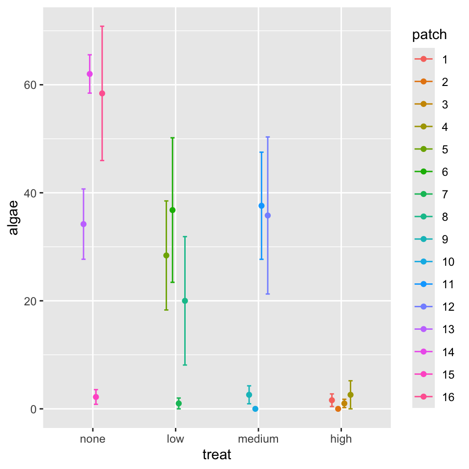{width=336}
:::
:::


# Nested ANOVA Analysis

In this experimental design, patch is nested within treat because each
patch received only one treatment level. This is a hierarchical design
where the effect of patches must be considered within each treatment.
Following the approach used in Quinn & Keough (2002), we'll use a
traditional nested ANOVA.

# nested Anova with base R


::: {.cell collapese='true'}

```{.r .cell-code}

# other ways using aov built in
# This will give you the correct F-test using PATCH within TREAT as error term
nested_model <- aov(algae ~ treat + Error(treat:patch), data = u_df)
summary(nested_model)
## 
## Error: treat:patch
##           Df Sum Sq Mean Sq F value Pr(>F)  
## treat      3  14429    4810   2.717 0.0913 .
## Residuals 12  21242    1770                 
## ---
## Signif. codes:  0 '***' 0.001 '**' 0.01 '*' 0.05 '.' 0.1 ' ' 1
## 
## Error: Within
##           Df Sum Sq Mean Sq F value Pr(>F)
## Residuals 64  19110   298.6
```
:::


# Nested ANOVA with AFEX package

-   Using afex package (recommended for unbalanced designs)
-   The afex package is specifically designed for ANOVA with Type III SS
    -   handles nested designs well


::: {.cell collapese='true'}

```{.r .cell-code}

# This works and gives you the correct answer
model_afx <- aov_car(algae ~ treat + Error(patch), 
                     data = u_df) # note this is not the best but would work as its less powerful

# ,fun_aggregate = mean
summary(model_afx)
## Anova Table (Type 3 tests)
## 
## Response: algae
##       num Df den Df    MSE      F     ges  Pr(>F)  
## treat      3     12 354.03 2.7171 0.40451 0.09126 .
## ---
## Signif. codes:  0 '***' 0.001 '**' 0.01 '*' 0.05 '.' 0.1 ' ' 1
```
:::


# Mixed Model ANOVA with random effects

-   BOBYQA (Bound Optimization BY Quadratic Approximation)
    -   optimization algorithm used in mixed-effects modeling
    -   finds the best parameter values that maximize the likelihood
        function
    -   especially useful when fitting complex models
-   So the way to code
    -   fixed effects is to put in the variable name
    -   **random effects can be coded in a range of ways**
        -   samples within a larger grouping - treatment and
            subsample...
        -   {width="357"}
        -   **RANDOM INTERCEPT - FIXED SLOPE - `+ (1|random)`**
            -   so color \~ fixed + (1\|group)
        -   **RANDOM INTERCEPT - RANDOM SLOPE - `+ (fixed|random)`**
            -   so color \~ fixed + (fixed\|group)
            -   equivalent to `algae ~ treat + (1 + fixed | random)`
    -   **Nested Design** - such that a sample can exist only within a
        larger grouping
    -   {width="478"}
        -   **RANDOM INTERCEPT - FIXED SLOPE -**
            `y ~ color + (1|green_box/grey_box)`
        -   `y ~ color + (1 | greenbox) + (1 | green_box:grey_box)`. It
            models random variation in the intercept for each patch, and
            also for each quadrat within each patch
        -   **RANDOM INTERCEPT - RANDOM SLOPE**
            `y ~ color + (color|green_box/grey_box)`
    -   Fully crossed design
        -   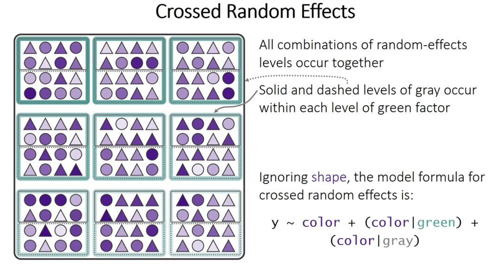{width="492"}
            -   crossed design **random intercept and random slope**
                -   y \~ color + (1 \| green_box) + (1 \| gray_box)
            -   crossed design **random intercept and random slope** \
                `y~ color + (color|green_box) + (color|gray_box)`
                -   `(color | green_box)` is shorthand for
                    `(1 + color | green_box)`. This part of the formula
                    specifies a random intercept and a random slope for
                    the `color` variable within the levels of
                    `green_box`.
                -   `(color | gray_box)` is shorthand for
                    `(1 + color | gray_box)`. Similarly, this specifies
                    a random intercept and a random slope for `color`
                    within the levels of `gray_box`


::: {.cell collapese='true'}

```{.r .cell-code}

# Fit the model with treatment as fixed effect and patch nested within treatment as random
mixed_model <- lmer(algae ~ treat + (1|patch), data = u_df,
                    control = lmerControl(calc.derivs = FALSE) # can speed up and help convergence
                    # control = lmerControl(optimizer = "bobyqa",
                    #                      optCtrl = list(maxfun = 2e5))
                    )
# Model summary
summary(mixed_model)
## Linear mixed model fit by REML. t-tests use Satterthwaite's method [
## lmerModLmerTest]
## Formula: algae ~ treat + (1 | patch)
##    Data: u_df
## Control: lmerControl(calc.derivs = FALSE)
## 
## REML criterion at convergence: 682.2
## 
## Scaled residuals: 
##     Min      1Q  Median      3Q     Max 
## -1.9808 -0.3106 -0.1093  0.2831  2.5910 
## 
## Random effects:
##  Groups   Name        Variance Std.Dev.
##  patch    (Intercept) 294.3    17.16   
##  Residual             298.6    17.28   
## Number of obs: 80, groups:  patch, 16
## 
## Fixed effects:
##             Estimate Std. Error      df t value Pr(>|t|)   
## (Intercept)   39.200      9.408  12.000   4.167  0.00131 **
## treatlow     -17.650     13.305  12.000  -1.327  0.20934   
## treatmedium  -20.200     13.305  12.000  -1.518  0.15485   
## treathigh    -37.900     13.305  12.000  -2.849  0.01466 * 
## ---
## Signif. codes:  0 '***' 0.001 '**' 0.01 '*' 0.05 '.' 0.1 ' ' 1
## 
## Correlation of Fixed Effects:
##             (Intr) tretlw trtmdm
## treatlow    -0.707              
## treatmedium -0.707  0.500       
## treathigh   -0.707  0.500  0.500
```
:::


# Mixed Model ANOVA with Random Effects

-   **METHOD 1 - the F-distribution with estimated degrees of freedom**
    -   Accounts for the uncertainty in variance component estimation
    -   More conservative (higher p-values)
    -   Better for small samples
-   **METHOD 2 - the Chi Square**
    -   Assumes variance components are known (not estimated)
    -   More liberal (lower p-values)
    -   Assumes large samples
-   **Relationship between these tests is**
    -   Chi-square = F × numerator df
-   **Why Different Results?**
    -   F-test accounts for denominator df (12 in your case) - reflects
        sample size
    -   Chi-square assumes infinite denominator df - assumes large
        samples
-   **Rule of Thumb**
    -   under 100 observations or \< 20 random effect levels: Use F-test
    -   over 500 observations and \> 50 random effect levels: Chi-square
        is okay
    -   In between: F-test is safer


::: {.cell collapese='true'}

```{.r .cell-code}

# Type III ANOVA with F-statistics (not chi-square) using Satterthwaite's method
# The issue was that you had "type = F" which should be "test.statistic = 'F'"
satt_result <- Anova(mixed_model, type = 3, 
                      test.statistic = "F",
                      ddf = "Satterthwaite")
print(satt_result)
## Analysis of Deviance Table (Type III Wald F tests with Kenward-Roger df)
## 
## Response: algae
##                   F Df Df.res   Pr(>F)   
## (Intercept) 17.3616  1     12 0.001307 **
## treat        2.7171  3     12 0.091262 . 
## ---
## Signif. codes:  0 '***' 0.001 '**' 0.01 '*' 0.05 '.' 0.1 ' ' 1
```
:::


# Alternative method to do the mixed model ANOVA


::: {.cell}

```{.r .cell-code}
# Alternative using car package
# The parameter is "test.statistic", not "type"
anova_car <- Anova(mixed_model, 
                   type = 3, 
                   test.statistic = "Chisq")
print(anova_car)
## Analysis of Deviance Table (Type III Wald chisquare tests)
## 
## Response: algae
##               Chisq Df Pr(>Chisq)    
## (Intercept) 17.3616  1  0.0000309 ***
## treat        8.1513  3    0.04299 *  
## ---
## Signif. codes:  0 '***' 0.001 '**' 0.01 '*' 0.05 '.' 0.1 ' ' 1
```
:::


# Lecture 13: ANOVA Results

The nested ANOVA model is specified as:

$algae_{ijk} = \mu + \alpha_i + \beta_{j(i)} + \epsilon_{ijk}$

Where:

-   \- $\mu$ is the overall mean
-   \- $\alpha_i$ is the fixed effect of treatment $i$
-   \- $\beta_{j(i)}$ is the random effect of patch $j$ nested within
    treatment $i$
-   \- $\epsilon_{ijk}$ is the residual error for quadrat $k$ in patch
    $j$ within treatment $i$


::: {.cell}

```{.r .cell-code}

satt_result
## Analysis of Deviance Table (Type III Wald F tests with Kenward-Roger df)
## 
## Response: algae
##                   F Df Df.res   Pr(>F)   
## (Intercept) 17.3616  1     12 0.001307 **
## treat        2.7171  3     12 0.091262 . 
## ---
## Signif. codes:  0 '***' 0.001 '**' 0.01 '*' 0.05 '.' 0.1 ' ' 1
```
:::


# Lecture 13 Assumption Tests

Creates all 4 diagnostic plots automatically


::: {.cell}

```{.r .cell-code}
# 2. Simulate residuals from the fitted mixed-effects model
# We set a seed for reproducibility of the simulation
set.seed(123) 
simulation_output <- simulateResiduals(fittedModel = mixed_model, 
                                         # Number of simulations, 500 is a good number
                                       plot = FALSE) # We will plot this manually in the next step

# 3. Create the diagnostic plots
# Create only the Q-Q uniformity plot
plotQQunif(simulation_output)
```

::: {.cell-output-display}
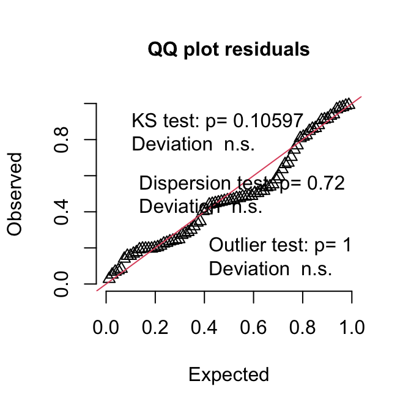{width=336}
:::
:::


::: {.cell}

```{.r .cell-code}
# Create only the residuals vs. predicted values plot
plotResiduals(simulation_output)
```

::: {.cell-output-display}
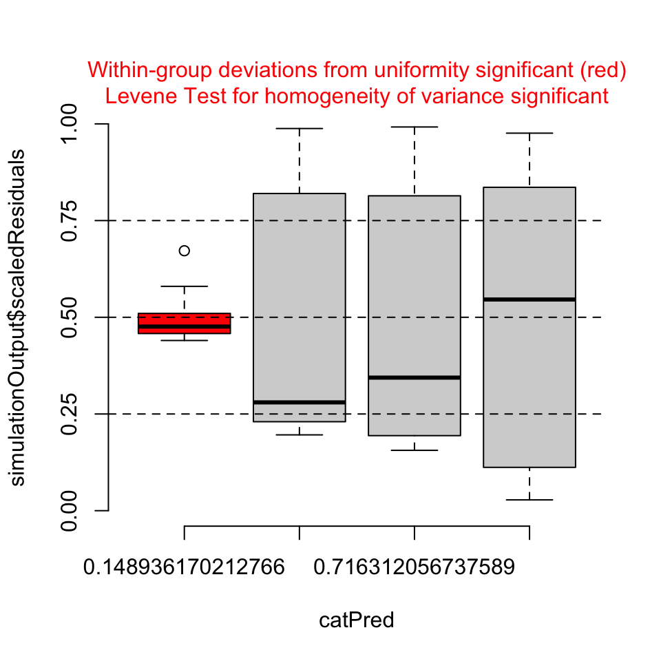{width=336}
:::
:::


::: {.cell}

```{.r .cell-code}
# 4. Optional: Perform formal tests for dispersion and outliers
# These results are also shown on the plot, but you can run them separately
testDispersion(simulation_output)
```

::: {.cell-output-display}
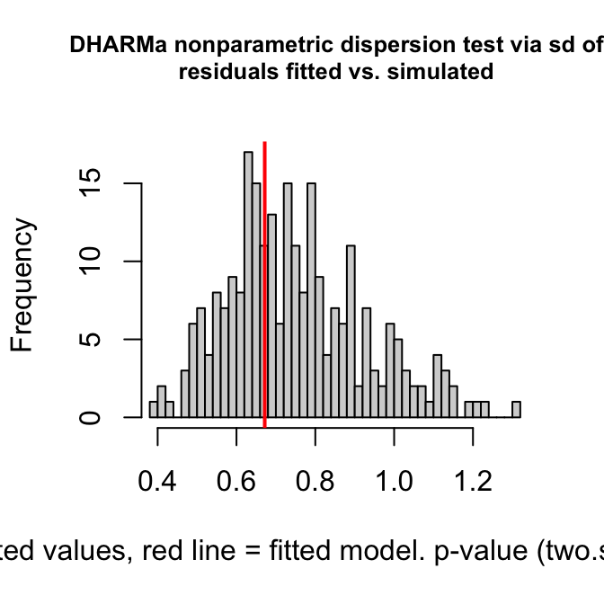{width=336}
:::

```
## 
## 	DHARMa nonparametric dispersion test via sd of residuals fitted vs.
## 	simulated
## 
## data:  simulationOutput
## dispersion = 0.89422, p-value = 0.72
## alternative hypothesis: two.sided
```
:::


::: {.cell}

```{.r .cell-code}
testOutliers(simulation_output)
```

::: {.cell-output-display}
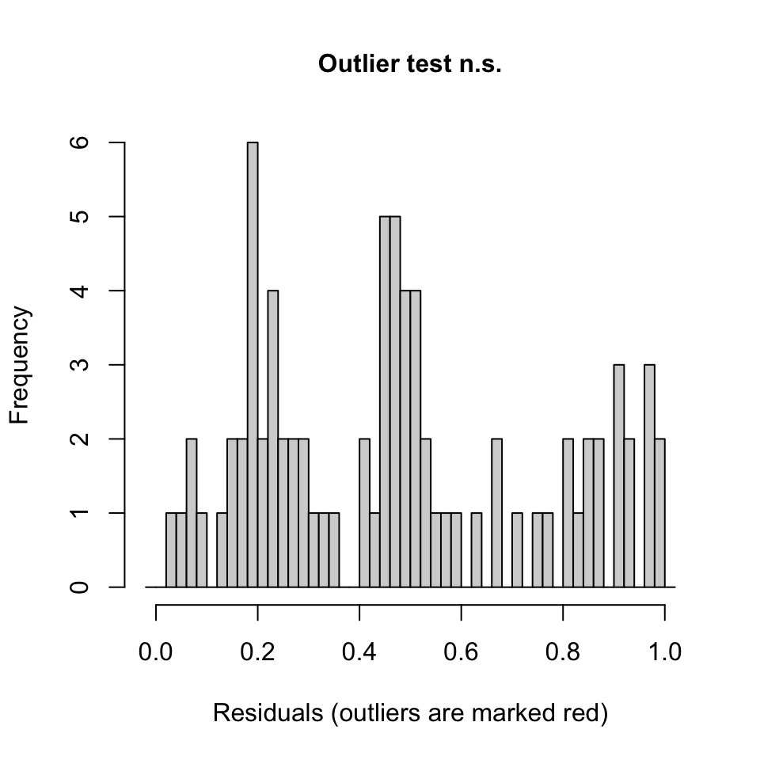{width=336}
:::

```
## 
## 	DHARMa outlier test based on exact binomial test with approximate
## 	expectations
## 
## data:  simulation_output
## outliers at both margin(s) = 0, observations = 80, p-value = 1
## alternative hypothesis: true probability of success is not equal to 0.007968127
## 95 percent confidence interval:
##  0.00000000 0.04506404
## sample estimates:
## frequency of outliers (expected: 0.00796812749003984 ) 
##                                                      0
```
:::


::: {.cell}

```{.r .cell-code}
plot(mixed_model, type = c("p", "smooth"))
```

::: {.cell-output-display}
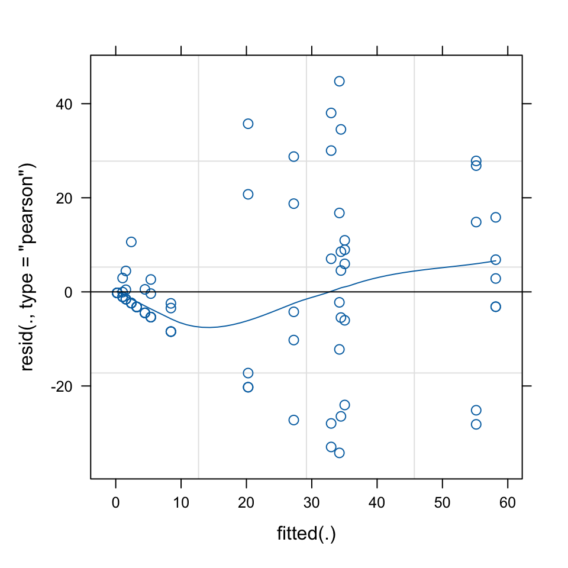{width=336}
:::
:::


# Cooks influence plot using car

this will tell you if there are outliers greater than the standard 0.5
cooks distance


::: {.cell}

```{.r .cell-code}
car::influencePlot(mixed_model)
```

::: {.cell-output-display}
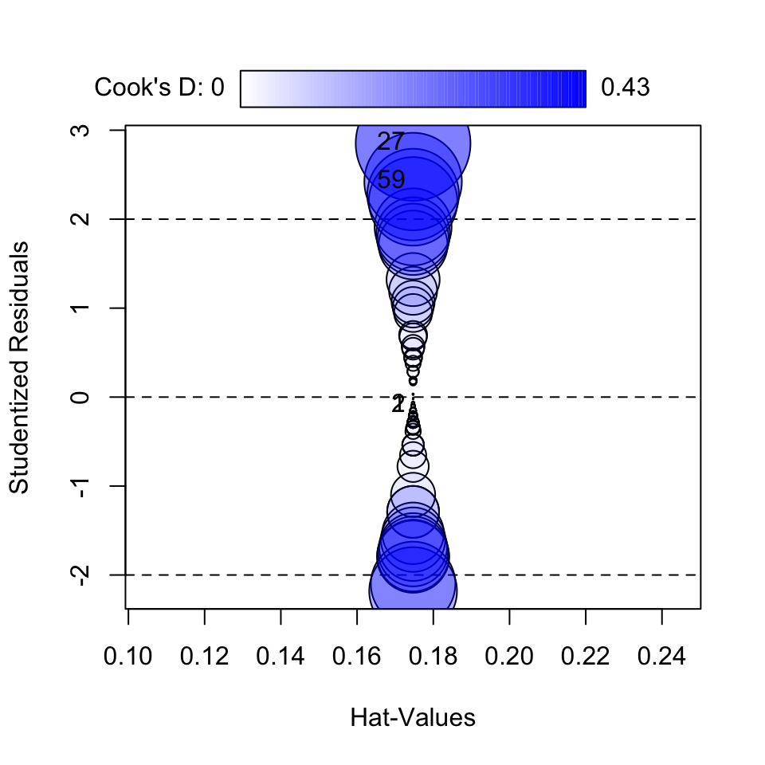{width=336}
:::

```
##        StudRes       Hat        CookD
## 1  -0.09869848 0.1746972 0.0005155059
## 2  -0.09869848 0.1746972 0.0005155059
## 27  2.85206412 0.1746972 0.4304585311
## 59  2.42281033 0.1746972 0.3106358546
```
:::


::: {.cell}

```{.r .cell-code}
dotwhisker::dwplot(mixed_model, effects = "fixed") + geom_vline(xintercept = 0, color="darkblue", linewidth = 1)
## Warning: Using the `size` aesthetic with geom_segment was deprecated in ggplot2 3.4.0.
## ℹ Please use the `linewidth` aesthetic instead.
## ℹ The deprecated feature was likely used in the dotwhisker package.
##   Please report the issue at <https://github.com/fsolt/dotwhisker/issues>.
```

::: {.cell-output-display}
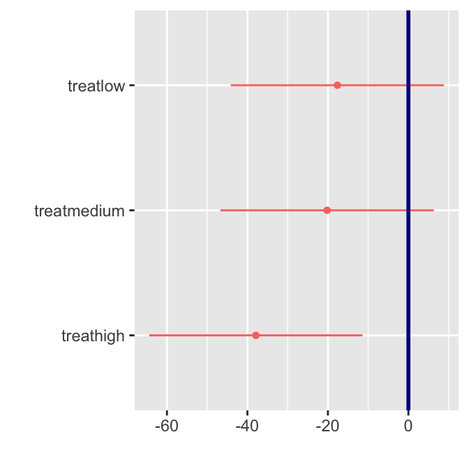{width=336}
:::
:::


::: {.cell}

```{.r .cell-code}
VarCorr(mixed_model)
##  Groups   Name        Std.Dev.
##  patch    (Intercept) 17.156  
##  Residual             17.280

# allFit(mixed_model)
```
:::


# Lecture 13: Post-hoc Comparisons

Although the main effect of treatment was not significant in the nested
ANOVA (p = r format(p_treat, digits=3)), we can still examine the mean
differences between treatments to understand patterns in the data.
However, we should interpret these with caution given the lack of
statistical significance at the α = 0.05 level.


::: {.cell}

```{.r .cell-code}
# Calculate estimated marginal means
emm <- emmeans(nested_model, ~ treat)

summary(emm)
##  treat  emmean   SE df lower.CL upper.CL
##  none     39.2 9.41 12    18.70     59.7
##  low      21.6 9.41 12     1.05     42.0
##  medium   19.0 9.41 12    -1.50     39.5
##  high      1.3 9.41 12   -19.20     21.8
## 
## Warning: EMMs are biased unless design is perfectly balanced 
## Confidence level used: 0.95
```
:::


# Lecture 13: Tukey Pairwise Comparisons


::: {.cell}

```{.r .cell-code}
# Pairwise comparisons with Tukey adjustment
pairs <- pairs(emm, adjust = "sidak")
pairs
##  contrast      estimate   SE df t.ratio p.value
##  none - low       17.65 13.3 12   1.327  0.7557
##  none - medium    20.20 13.3 12   1.518  0.6356
##  none - high      37.90 13.3 12   2.849  0.0848
##  low - medium      2.55 13.3 12   0.192  1.0000
##  low - high       20.25 13.3 12   1.522  0.6331
##  medium - high    17.70 13.3 12   1.330  0.7534
## 
## P value adjustment: sidak method for 6 tests
```
:::


# Lecture 13: Letter Display


::: {.cell}

```{.r .cell-code}
# Extract compact letter display for plotting
cld <- multcomp::cld(emm, alpha = 0.05, Letters = letters)

cld
##  treat  emmean   SE df lower.CL upper.CL .group
##  high      1.3 9.41 12   -19.20     21.8  a    
##  medium   19.0 9.41 12    -1.50     39.5  a    
##  low      21.6 9.41 12     1.05     42.0  a    
##  none     39.2 9.41 12    18.70     59.7  a    
## 
## Warning: EMMs are biased unless design is perfectly balanced 
## Confidence level used: 0.95 
## P value adjustment: tukey method for comparing a family of 4 estimates 
## significance level used: alpha = 0.05 
## NOTE: If two or more means share the same grouping symbol,
##       then we cannot show them to be different.
##       But we also did not show them to be the same.
```
:::


::: {.callout-important appearance="simple"}
Interpretation of Treatment Comparisons The mean algae cover for the
Control treatment (1.30%) appears considerably lower than for the
reduced urchin density treatments (66% Density: 21.55%, 33% Density:
19.00%, Removed: 39.20%). While the visual pattern suggests an inverse
relationship between urchin density and algae cover, with complete
removal showing the highest algae cover, the nested ANOVA showed that
these differences were not statistically significant at the α = 0.05
level (p = xxxx). The high variability among patches within treatments
likely contributed to the lack of statistical significance for the
treatment effect.
:::

# Lecture 13: Visualization


::: {.cell}

```{.r .cell-code}
# Create boxplot
ggplot_boxplot <- ggplot(u_df, aes(x = treat, y = algae, fill = treat)) +
  geom_boxplot(alpha = 0.7, outlier.shape = NA) +
  geom_jitter(width = 0.2, alpha = 0.4, size = 1) +
  scale_fill_viridis_d(option = "D", end = 0.85) +
  labs(
    title = "Effect of Urchin Density on Filamentous Algae Cover",
    x = "Urchin Density Treatment",
    y = "Filamentous Algae Cover (%)",
    caption = "Figure 1: Boxplots showing the distribution of algal cover across urchin density treatments.\nDespite visual differences, the treatment effect was not statistically significant (p = 0.091)."
  ) +
  # theme_cowplot() +
  theme(
    legend.position = "none",
    plot.title = element_text(face = "bold", size = 14),
    axis.title = element_text(face = "bold", size = 12),
    axis.text = element_text(size = 10),
    plot.caption = element_text(hjust = 0, face = "italic", size = 10)
  )

print(ggplot_boxplot)
```

::: {.cell-output-display}
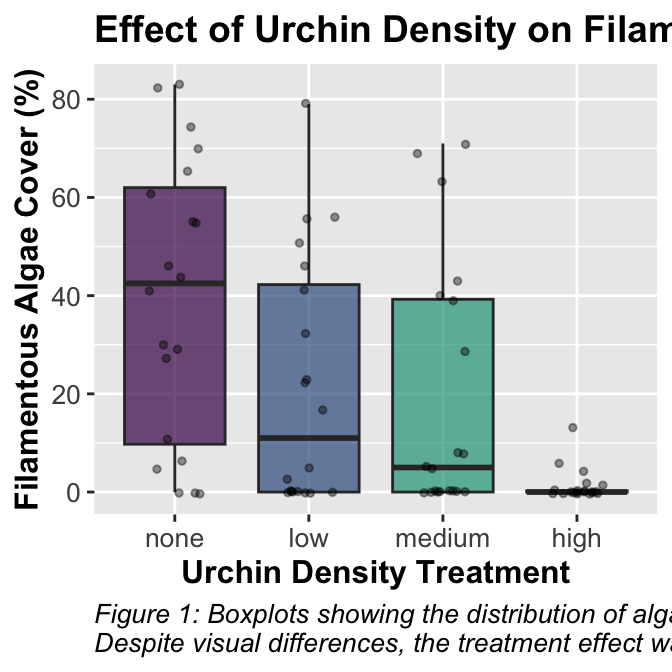{width=336}
:::
:::


# Lecture 13: Means Plot

-   text


::: {.cell}

```{.r .cell-code}
# Create means plot
means_plot <- ggplot(summary_stats, aes(x = treat, y = mean, group = 1)) +
  # geom_line(size = 1) +
  geom_point(size = 3, shape = 21, fill = "white") +
  geom_errorbar(aes(ymin = mean - se, ymax = mean + se), width = 0.2) +
  labs(
    title = "Mean Algae Cover by Urchin Density Treatment",
    x = "Urchin Density Treatment",
    y = "Mean Filamentous Algae Cover (%)",
    caption = "Figure 2: Mean (± SE) percentage cover of filamentous algae across urchin density treatments."
  ) +
  # theme_cowplot() +
  theme(
    plot.title = element_text(face = "bold", size = 14),
    axis.title = element_text(face = "bold", size = 12),
    axis.text = element_text(size = 10),
    plot.caption = element_text(hjust = 0, face = "italic", size = 10)
  )

print(means_plot)
```

::: {.cell-output-display}
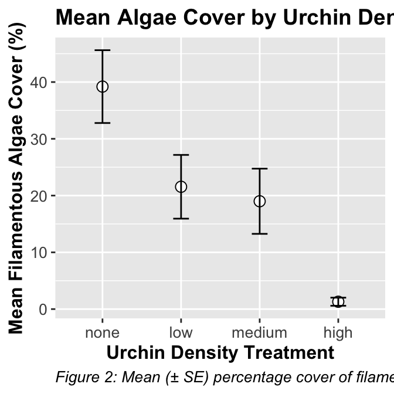{width=336}
:::
:::


# Lecture 13: Discussion

::: {.callout-important appearance="simple"}
Scientific Interpretation Our nested ANOVA analysis revealed substantial
spatial heterogeneity in algae cover, with significant variation among
patches within each treatment (p \< 0.001). Surprisingly, the effect of
urchin density treatments on filamentous algae cover was not
statistically significant at the α = 0.05 level (p = 0.091), despite
apparent trends in the data. The descriptive statistics show a pattern
where algae cover appears to increase as urchin density decreases, with
the Control treatment (mean = 1.3%) showing minimal algae cover compared
to reduced density treatments (66% Density: 21.55%, 33% Density: 19.00%,
and Removed: 39.20%). This pattern suggests a potential
density-dependent relationship between urchin grazing and algal
abundance, but the high variability among patches masked the treatment
effect. The substantial variance component associated with patches
nested within treatments (294.31, approximately 39.5% of total variance)
underscores the importance of spatial heterogeneity in structuring algal
communities. This finding highlights the necessity of accounting for
spatial variability when designing and analyzing ecological field
experiments. From an ecological perspective, these results suggest that
while sea urchins may influence algal communities through grazing, local
environmental factors and patch-specific conditions play a dominant role
in determining algae cover. This has important implications for
ecosystem management, as it indicates that the effects of urchin density
manipulations may be context-dependent and influenced by local
environmental conditions.
:::

# Comparison with Traditional Nested ANOVA

The linear mixed model approach provides similar results to the
traditional nested ANOVA approach. The main advantage of the mixed model
is the more elegant handling of random effects and the extensive
diagnostic tools available through packages like DHARMa.

The mixed model approach confirms that:

1.  Treatment effects are not significant (p = 0.091)

In both methods, the key ecological finding is the strong spatial
heterogeneity in algal cover that overrides the grazing effect of
urchins at different densities.
