# THE SETUP


::: {.cell}

```{.r .cell-code}
# Load required packages
# install.packages("ResourceSelection")
# install.packages("pscl")
library(janitor)
library(pscl)
library(tinytable)
library(skimr)
library(performance)
library(ResourceSelection)
library(car)
library(emmeans)
library(DHARMa)
library(MASS)
library(broom)
library(flextable)
library(parameters)
library(patchwork)  # For combining plots
library(faraway)  # For gala dataset
library(tidyverse)


# Set options
options(scipen = 999)
```
:::


# Lecture 14: Generalized Linear Models Activity

## Generalized Linear Models (GLMs) extend linear models to handle different types of response variables:

- **Normal distribution**: Continuous data (like regular ANOVA/regression)
- **Poisson distribution**: Count data
- **Binomial distribution**: Binary data (presence/absence, success/failure)
- **Gamma distribution**: Positive continuous data
- **Negative binomial**: Overdispersed count data

## The Three Components of GLMs

1.  **Random component**: The response variable and its probability distribution
2.  **Systematic component**: The predictor variables (continuous or categorical)
3.  **Link function**: Connects expected value of Y to predictor variables

------------------------------------------------------------------------

# How to approach the problem

- **What is the question?**
  - unclear data mining can lead to lost time
- **Data Variable type**: what does the data look like - types of variable read in
- **Data Completeness**: Is there a lot of sparcity
- **Data Structure**: what does the data look like graphically
- **Model Choice:** what is the right model to analyze the data to answer your question
- **Model Run:** run model - summary
- **Model Assumptions**: test early before you get excited and bend the rules
- **Model Statistics** : run the final stats
- Model Followup tests: post F pairwise comparisons or others
- **Graphical display of results:** highlighting the data and statistics

------------------------------------------------------------------------

# Part 1: Gaussian GLM

The simplest form of GLM uses a normal (Gaussian) distribution with an identity link function. This is equivalent to standard ANOVA

Let's compare a standard linear model and a Gaussian GLM

## Island Biogeography Data

The `gala` dataframe from the `faraway` package contains data on 30 Galapagos islands, testing MacArthur-Wilson's theory of island biogeography.

- **Variables in the dataframe:**
  - `spp`Number of plant species (count data)
  - `endemics`Number of endemic species (count data)
  - `area`Island area (km²)
  - `elevation -`Maximum elevation (m)
  - `Nearest` - Distance to nearest island (km)
  - `scruz` - Distance to Santa Cruz island (km)
  - `adjacent` - area of adjacent island (km²)

## The data - variable types


::: {.cell}

```{.r .cell-code}
# Create a categorical variable for demonstration
g_df <- gala %>% clean_names() %>%
  rename(spp = species) %>% 
  mutate(size_cat = case_when(
    area < 1 ~ "small",
    area >= 1 & area < 100 ~ "medium",
    area >= 100 ~ "large"
  ),
  size_cat = factor(size_cat, levels = c("small", "medium", "large")))

g_df <- g_df %>% filter(area < 3000)

head(g_df %>% dplyr::select(-scruz, -adjacent), 10)
```

::: {.cell-output .cell-output-stdout}

```
             spp endemics  area elevation nearest size_cat
Baltra        58       23 25.09       346     0.6   medium
Bartolome     31       21  1.24       109     0.6   medium
Caldwell       3        3  0.21       114     2.8    small
Champion      25        9  0.10        46     1.9    small
Coamano        2        1  0.05        77     1.9    small
Daphne.Major  18       11  0.34       119     8.0    small
Daphne.Minor  24        0  0.08        93     6.0    small
Darwin        10        7  2.33       168    34.1   medium
Eden           8        4  0.03        71     0.4    small
Enderby        2        2  0.18       112     2.6    small
```


:::
:::


## Data completeness

### The Formula for Geometric Mean (GM)

- The geometric mean is the *n*-th root of the *product* of *n* numbers.^2^

- For a set of numbers $x_1, x_2, ..., x_n$, the formula is:

- $GM = \sqrt[n]{x_1 \cdot x_2 \cdot \dots \cdot x_n}$


::: {.cell}

```{.r .cell-code}
g_df %>% skim()
```

::: {.cell-output-display}

Table: Data summary

|                         |           |
|:------------------------|:----------|
|Name                     |Piped data |
|Number of rows           |29         |
|Number of columns        |8          |
|_______________________  |           |
|Column type frequency:   |           |
|factor                   |1          |
|numeric                  |7          |
|________________________ |           |
|Group variables          |None       |


**Variable type: factor**

|skim_variable | n_missing| complete_rate|ordered | n_unique|top_counts               |
|:-------------|---------:|-------------:|:-------|--------:|:------------------------|
|size_cat      |         0|             1|FALSE   |        3|med: 12, sma: 11, lar: 6 |


**Variable type: numeric**

|skim_variable | n_missing| complete_rate|   mean|     sd|    p0|   p25|    p50|    p75|    p100|hist  |
|:-------------|---------:|-------------:|------:|------:|-----:|-----:|------:|------:|-------:|:-----|
|spp           |         0|             1|  76.21| 105.25|  2.00| 12.00|  40.00|  93.00|  444.00|▇▂▁▁▁ |
|endemics      |         0|             1|  23.93|  25.05|  0.00|  7.00|  17.00|  30.00|   95.00|▇▅▁▁▁ |
|area          |         0|             1| 109.72| 235.81|  0.01|  0.23|   2.33|  58.27|  903.82|▇▁▁▁▁ |
|elevation     |         0|             1| 321.86| 343.31| 25.00| 94.00| 186.00| 367.00| 1494.00|▇▂▂▁▁ |
|nearest       |         0|             1|  10.38|  14.42|  0.20|  1.10|   3.30|  10.70|   47.40|▇▁▁▂▁ |
|scruz         |         0|             1|  57.97|  69.01|  0.00| 10.70|  47.40|  85.90|  290.20|▇▃▁▁▁ |
|adjacent      |         0|             1| 248.22| 876.89|  0.03|  0.52|   2.33|  58.27| 4669.32|▇▁▁▁▁ |


:::
:::


## Data graphically


::: {.cell}

```{.r .cell-code}
#| message: false
#| warning: false
#| paged-print: false

ggplot(g_df, aes(x = spp)) +
  geom_histogram(binwidth = 25, fill = "darkblue", color = "black") +
  labs(title = "Distribution of species Richness",
       subtitle = "Galapagos Islands",
       x = "Number of Plant species",
       y = "Number of Islands") +
  theme_minimal()
```

::: {.cell-output-display}
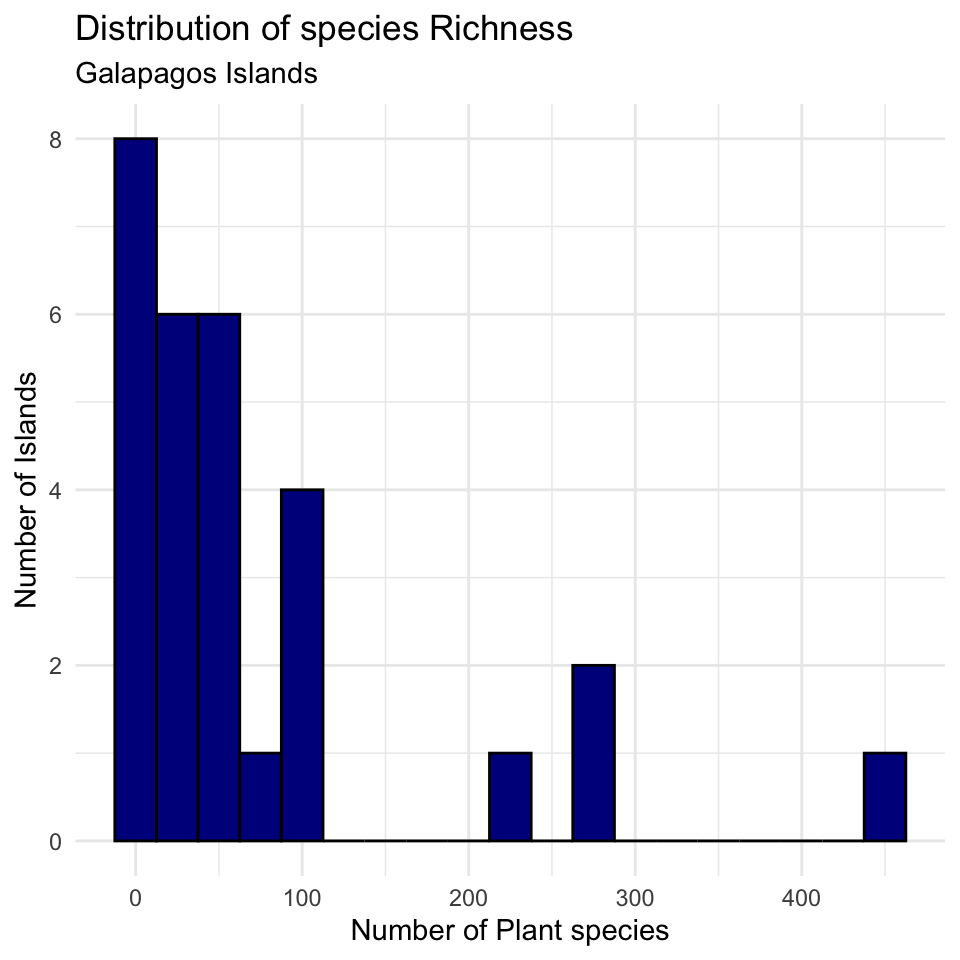{width=480}
:::
:::


## Data graphically as size categories


::: {.cell}

```{.r .cell-code}
ggplot(g_df, aes(x = size_cat, y = spp, fill = size_cat)) +
  geom_boxplot(color = "darkblue") +
  labs(title = "Distribution of species Richness",
       subtitle = "Galapagos Islands",
       x = "Number of Plant species",
       y = "Number of Islands") +
  theme_minimal()
```

::: {.cell-output-display}
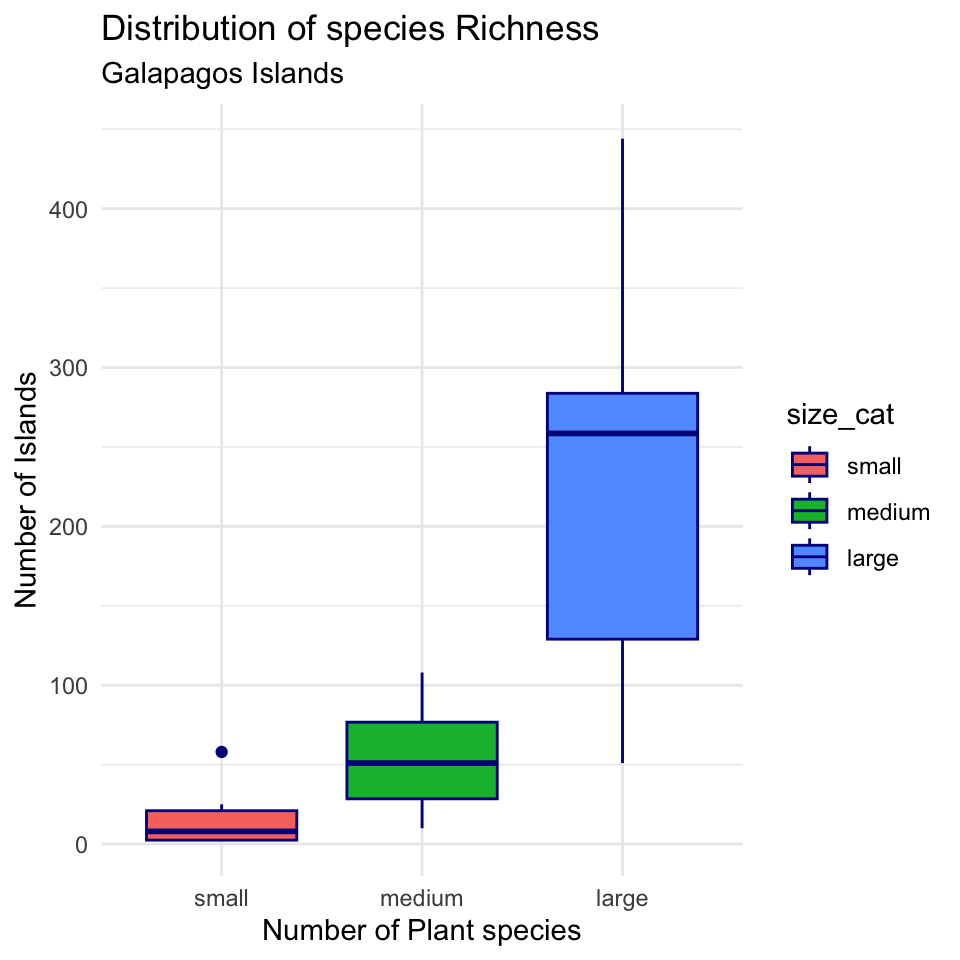{width=480}
:::
:::


# GLM with Gaussian (Normal) Distribution: Setup

The simplest form of GLM uses a normal (Gaussian) distribution with an identity link function. This is equivalent to standard linear model

Let's compare a standard linear model and a Gaussian GLM using the Galapagos dataset, modeling endemic species richness by island size category.

## Linear model the old way


::: {.cell}

```{.r .cell-code}
# Fit a standard linear model
lm_model <- lm(endemics ~ size_cat, data = g_df)
summary(lm_model)
```

::: {.cell-output .cell-output-stdout}

```

Call:
lm(formula = endemics ~ size_cat, data = g_df)

Residuals:
    Min      1Q  Median      3Q     Max 
-39.000  -4.636  -0.667   6.333  33.000 

Coefficients:
               Estimate Std. Error t value     Pr(>|t|)    
(Intercept)       5.636      4.236   1.331       0.1948    
size_catmedium   16.030      5.864   2.734       0.0111 *  
size_catlarge    56.364      7.130   7.905 0.0000000221 ***
---
Signif. codes:  0 '***' 0.001 '**' 0.01 '*' 0.05 '.' 0.1 ' ' 1

Residual standard error: 14.05 on 26 degrees of freedom
Multiple R-squared:  0.708,	Adjusted R-squared:  0.6855 
F-statistic: 31.51 on 2 and 26 DF,  p-value: 0.0000001124
```


:::
:::


## The ANOVA model


::: {.cell}

```{.r .cell-code}
Anova(lm_model, type = 3 )
```

::: {.cell-output .cell-output-stdout}

```
Anova Table (Type III tests)

Response: endemics
             Sum Sq Df F value       Pr(>F)    
(Intercept)   349.5  1  1.7707       0.1948    
size_cat    12438.6  2 31.5135 0.0000001124 ***
Residuals    5131.2 26                         
---
Signif. codes:  0 '***' 0.001 '**' 0.01 '*' 0.05 '.' 0.1 ' ' 1
```


:::
:::


## The Gaussian GLM model


::: {.cell}

```{.r .cell-code}
# Fit a Gaussian GLM
gauss_model <- glm(endemics ~ size_cat,  data = g_df, 
                       family = gaussian(link = "identity"))

summary(gauss_model)
```

::: {.cell-output .cell-output-stdout}

```

Call:
glm(formula = endemics ~ size_cat, family = gaussian(link = "identity"), 
    data = g_df)

Coefficients:
               Estimate Std. Error t value     Pr(>|t|)    
(Intercept)       5.636      4.236   1.331       0.1948    
size_catmedium   16.030      5.864   2.734       0.0111 *  
size_catlarge    56.364      7.130   7.905 0.0000000221 ***
---
Signif. codes:  0 '***' 0.001 '**' 0.01 '*' 0.05 '.' 0.1 ' ' 1

(Dispersion parameter for gaussian family taken to be 197.3543)

    Null deviance: 17569.9  on 28  degrees of freedom
Residual deviance:  5131.2  on 26  degrees of freedom
AIC: 240.4

Number of Fisher Scoring iterations: 2
```


:::
:::


## GLM ANOVA


::: {.cell}

```{.r .cell-code}
Anova(gauss_model, type = "III", test = "F")
```

::: {.cell-output .cell-output-stdout}

```
Analysis of Deviance Table (Type III tests)

Response: endemics
Error estimate based on Pearson residuals 

           Sum Sq Df F values       Pr(>F)    
size_cat  12438.6  2   31.514 0.0000001124 ***
Residuals  5131.2 26                          
---
Signif. codes:  0 '***' 0.001 '**' 0.01 '*' 0.05 '.' 0.1 ' ' 1
```


:::
:::


## Assumption Tests of Both Models

### Linear model assumptions


::: {.cell}

```{.r .cell-code}
# Create diagnostic plots
par(mfrow = c(1, 1))
plot(lm_model)
```

::: {.cell-output-display}
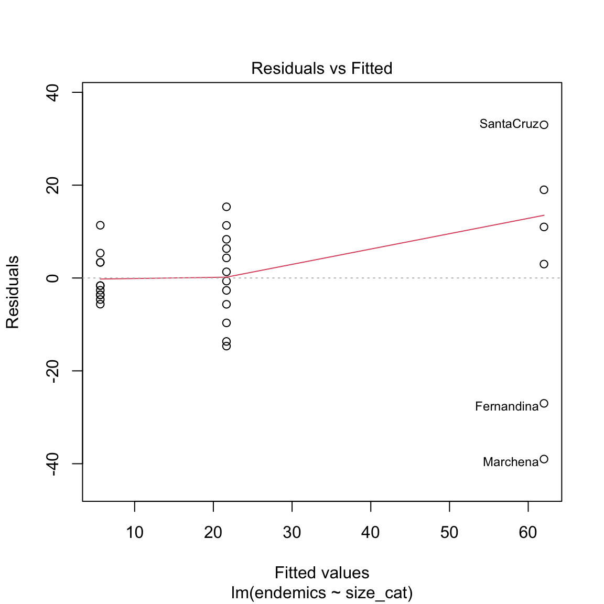{width=576}
:::

::: {.cell-output-display}
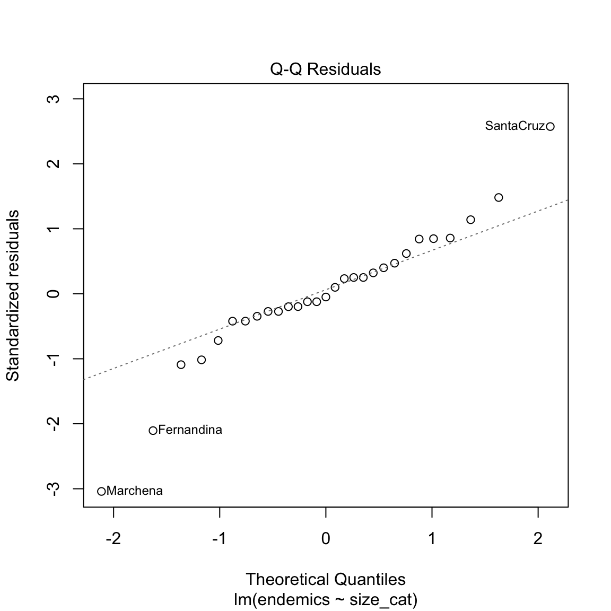{width=576}
:::

::: {.cell-output-display}
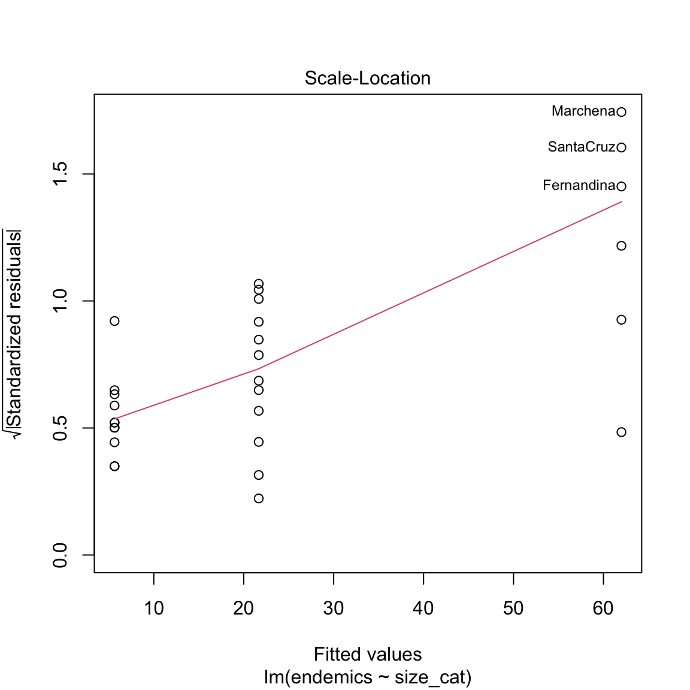{width=576}
:::

::: {.cell-output-display}
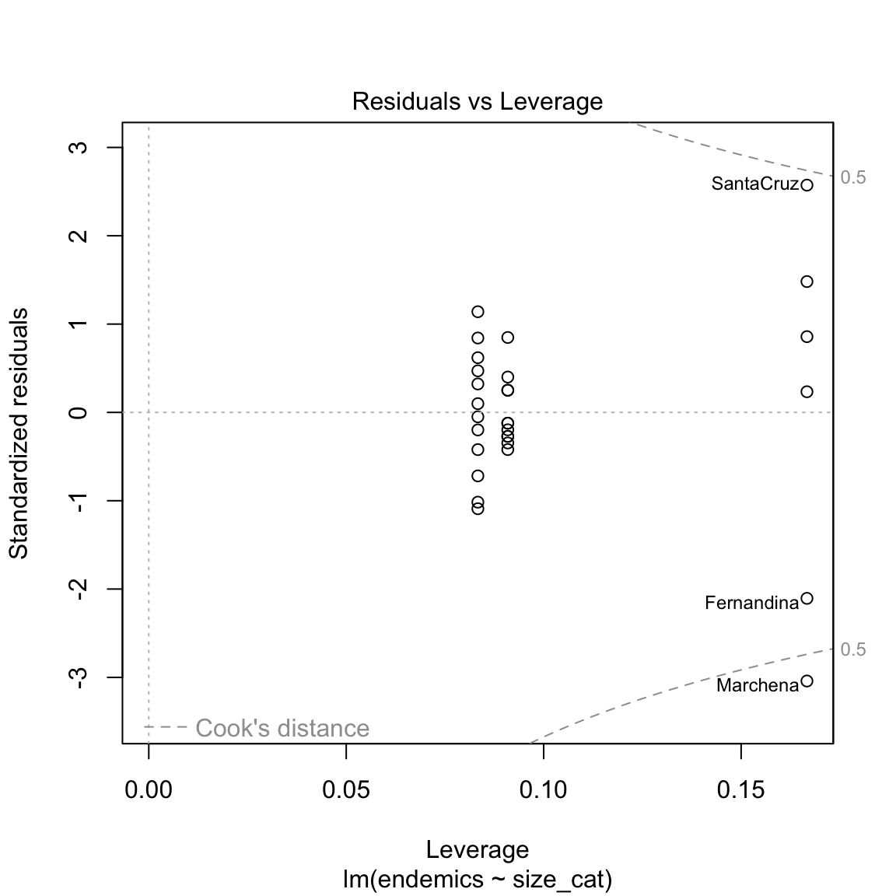{width=576}
:::

```{.r .cell-code}
par(mfrow = c(1, 1))
```
:::


### GLM ASSUMPTIONS


::: {.cell}

```{.r .cell-code}
# Create diagnostic plots
# par(mfrow = c(2, 2))
plot(gauss_model)
```

::: {.cell-output-display}
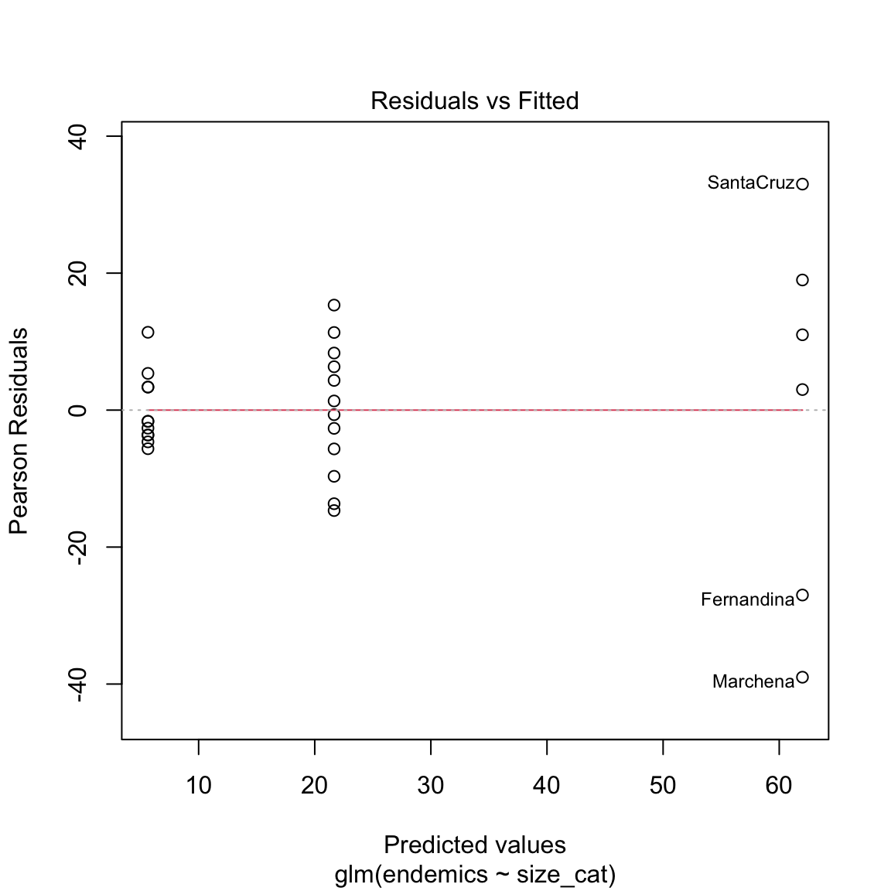{width=576}
:::

::: {.cell-output-display}
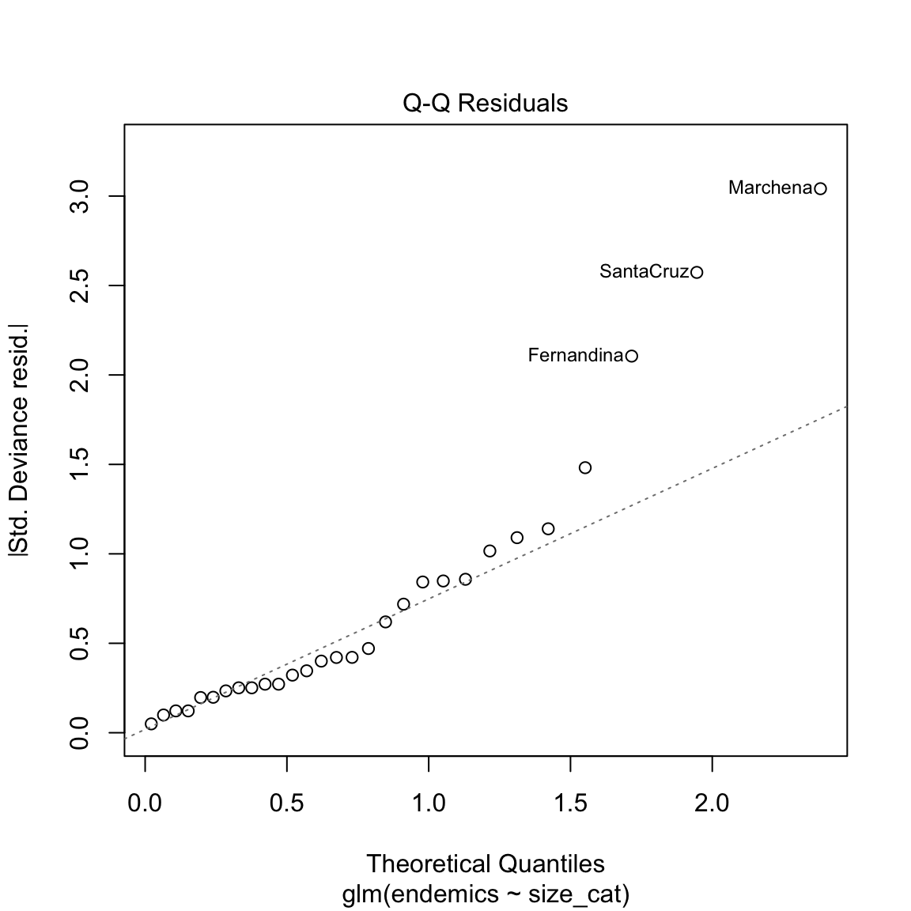{width=576}
:::

::: {.cell-output-display}
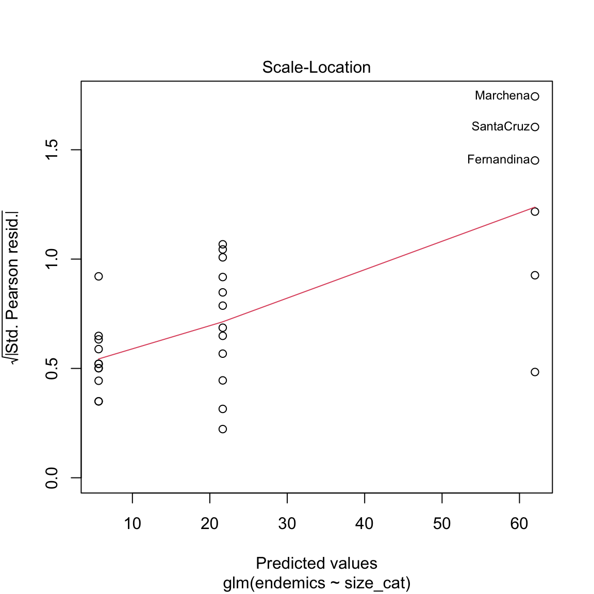{width=576}
:::

::: {.cell-output-display}
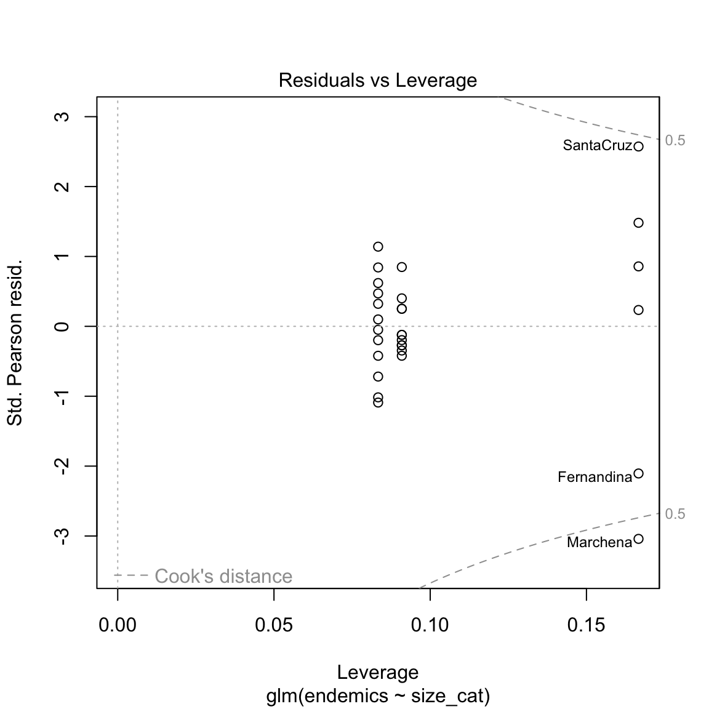{width=576}
:::

```{.r .cell-code}
# par(mfrow = c(1, 1))
```
:::


### Shapiro Wilk Test Linear Model


::: {.cell}

```{.r .cell-code}
shapiro.test(residuals(lm_model))
```

::: {.cell-output .cell-output-stdout}

```

	Shapiro-Wilk normality test

data:  residuals(lm_model)
W = 0.94396, p-value = 0.1273
```


:::
:::


### Shapiro Test Gaussian Model


::: {.cell}

```{.r .cell-code}
shapiro.test(residuals(gauss_model))
```

::: {.cell-output .cell-output-stdout}

```

	Shapiro-Wilk normality test

data:  residuals(gauss_model)
W = 0.94396, p-value = 0.1273
```


:::
:::


## Levenes Test - this is why a Poisson Model fits


::: {.cell}

```{.r .cell-code}
leveneTest(endemics ~ size_cat,  data = g_df)
```

::: {.cell-output .cell-output-stdout}

```
Levene's Test for Homogeneity of Variance (center = median)
      Df F value   Pr(>F)   
group  2  7.9881 0.001975 **
      26                    
---
Signif. codes:  0 '***' 0.001 '**' 0.01 '*' 0.05 '.' 0.1 ' ' 1
```


:::
:::


## Dharma Assumption Test


::: {.cell}

```{.r .cell-code}
# 1. Simulate residuals
# (This is the standard first step for all DHARMa diagnostics)
sim_gauss_res <- simulateResiduals(fittedModel = gauss_model, n = 1000)

# 2. Test for dispersion
# This will provide a p-value and the ratio
testDispersion(sim_gauss_res)
```

::: {.cell-output-display}
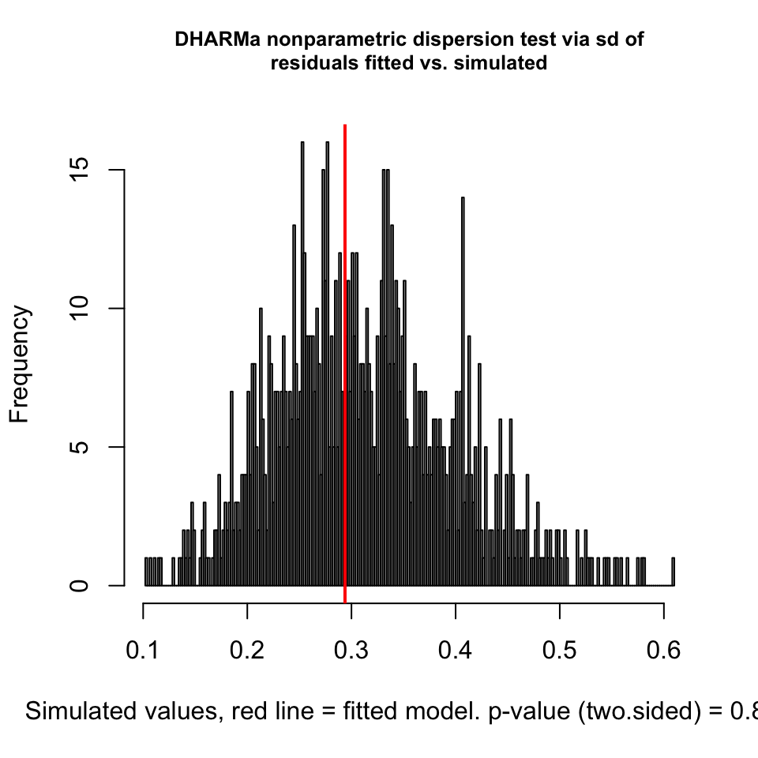{width=480}
:::

::: {.cell-output .cell-output-stdout}

```

	DHARMa nonparametric dispersion test via sd of residuals fitted vs.
	simulated

data:  simulationOutput
dispersion = 0.93779, p-value = 0.882
alternative hypothesis: two.sided
```


:::

```{.r .cell-code}
# Plot diagnostic plots
plot(sim_gauss_res)
```

::: {.cell-output-display}
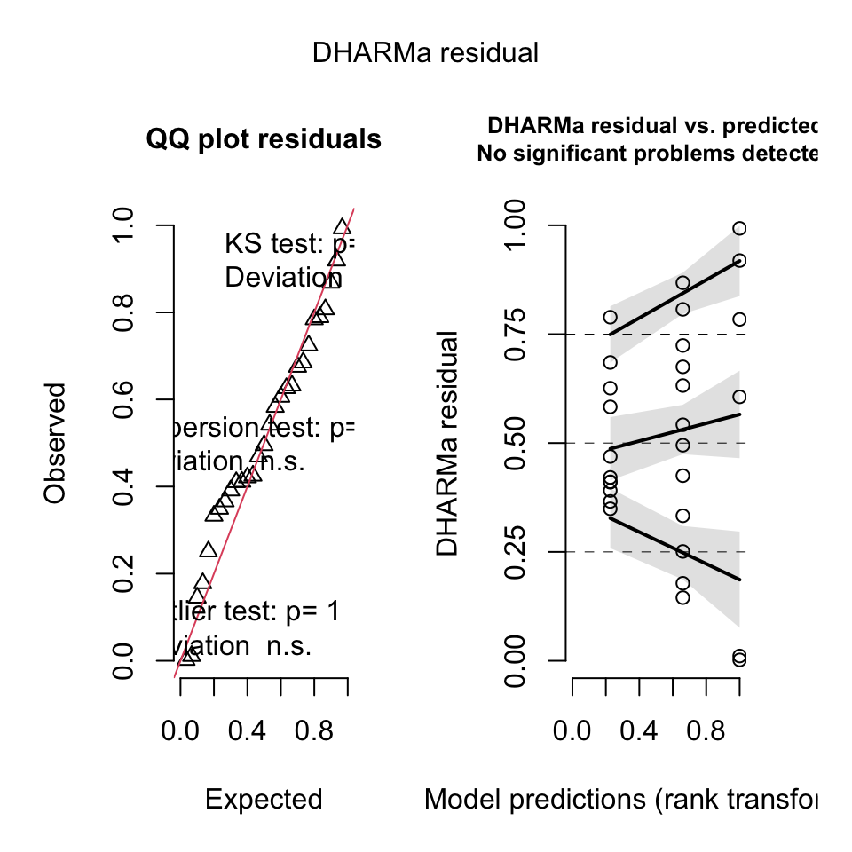{width=480}
:::
:::


## Emmeans Linear Model


::: {.cell}

```{.r .cell-code}
# Calculate estimated marginal means
lm_emmeans <- emmeans(lm_model, ~ size_cat)
lm_emmeans
```

::: {.cell-output .cell-output-stdout}

```
 size_cat emmean   SE df lower.CL upper.CL
 small      5.64 4.24 26    -3.07     14.3
 medium    21.67 4.06 26    13.33     30.0
 large     62.00 5.74 26    50.21     73.8

Confidence level used: 0.95 
```


:::
:::


## Emmeans GLM Mode


::: {.cell}

```{.r .cell-code}
# Calculate estimated marginal means
gauss_emmeans <- emmeans(gauss_model, ~ size_cat)
gauss_emmeans
```

::: {.cell-output .cell-output-stdout}

```
 size_cat emmean   SE df lower.CL upper.CL
 small      5.64 4.24 26    -3.07     14.3
 medium    21.67 4.06 26    13.33     30.0
 large     62.00 5.74 26    50.21     73.8

Confidence level used: 0.95 
```


:::
:::


### Pairs LM


::: {.cell}

```{.r .cell-code}
# # Pairwise comparisons with Sidak correction
lm_pairs <- pairs(lm_emmeans, adjust = "sidak")
lm_pairs
```

::: {.cell-output .cell-output-stdout}

```
 contrast       estimate   SE df t.ratio p.value
 small - medium    -16.0 5.86 26  -2.734  0.0330
 small - large     -56.4 7.13 26  -7.905 <0.0001
 medium - large    -40.3 7.02 26  -5.742 <0.0001

P value adjustment: sidak method for 3 tests 
```


:::
:::


### Pairs GLM


::: {.cell}

```{.r .cell-code}
# # Pairwise comparisons with Sidak correction
gauss_pairs <- pairs(gauss_emmeans, adjust = "sidak")
gauss_pairs
```

::: {.cell-output .cell-output-stdout}

```
 contrast       estimate   SE df t.ratio p.value
 small - medium    -16.0 5.86 26  -2.734  0.0330
 small - large     -56.4 7.13 26  -7.905 <0.0001
 medium - large    -40.3 7.02 26  -5.742 <0.0001

P value adjustment: sidak method for 3 tests 
```


:::
:::


### Plot of GLM


::: {.cell}

```{.r .cell-code}
plot(gauss_emmeans, comparisons = TRUE)
```

::: {.cell-output-display}
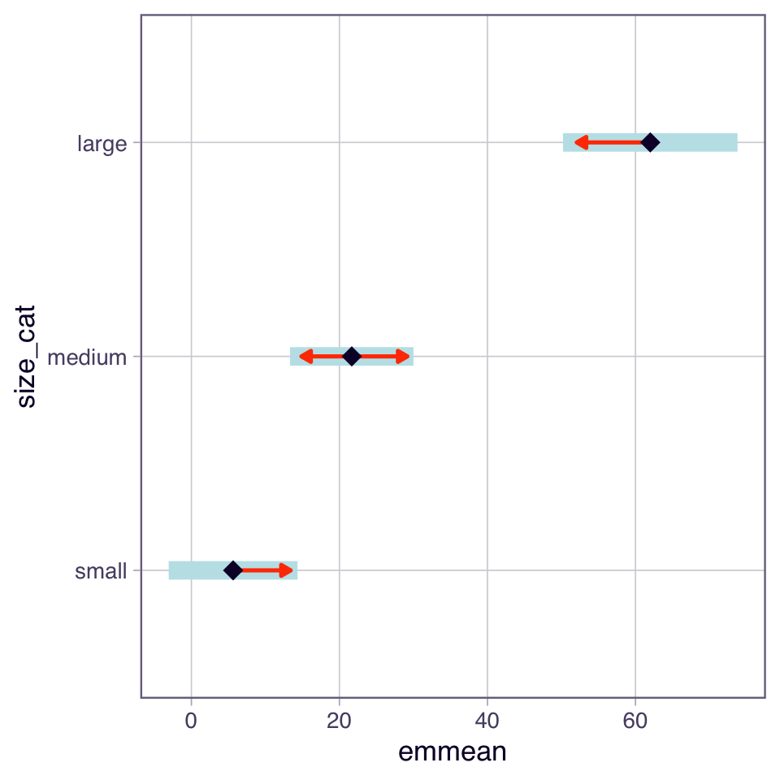{width=480}
:::
:::


# GLM ANOVA with Poisson Distribution

- **Poisson GLMs** Poisson model used when response variable is **count data**:
  - Number of species on an island
  - Number of parasites in a host
  - Number of bird nests in a plot
  - Number of seeds produced by a plant
- The Poisson distribution assumes:
  - Counts are non-negative integers (0, 1, 2, 3, ...)
  - The mean equals the variance
  - Events occur independently
- **Key consideration:** If variance \> mean (overdispersion), consider negative binomial regression instead.
- Now let's fit a Poisson GLM to model the relationship between the rounded quarter-mile time and the number of cylinders:

## Fit Poisson GLM with size_cat as predictor


::: {.cell}

```{.r .cell-code}
poiss_model <- glm(spp ~ size_cat, 
                          data = g_df,
                          family = poisson(link = "log"))
summary(poiss_model)
```

::: {.cell-output .cell-output-stdout}

```

Call:
glm(formula = spp ~ size_cat, family = poisson(link = "log"), 
    data = g_df)

Coefficients:
               Estimate Std. Error z value            Pr(>|z|)    
(Intercept)     2.67101    0.07930   33.68 <0.0000000000000002 ***
size_catmedium  1.33784    0.08833   15.15 <0.0000000000000002 ***
size_catlarge   2.77429    0.08372   33.14 <0.0000000000000002 ***
---
Signif. codes:  0 '***' 0.001 '**' 0.01 '*' 0.05 '.' 0.1 ' ' 1

(Dispersion parameter for poisson family taken to be 1)

    Null deviance: 3031.18  on 28  degrees of freedom
Residual deviance:  898.03  on 26  degrees of freedom
AIC: 1057.2

Number of Fisher Scoring iterations: 5
```


:::
:::


## GLM with Poisson Distribution: Setup

**Does island size category, as a whole, have a statistically significant effect on the number of plant species?**

- `test = "LR"`: important part!
  - normal ANOVA (with a Gaussian/normal distribution) test is an F-test.
  - GLM (like Poisson) can't use F-test in the same way
    - use a Likelihood Ratio (LR) test
    - LR test statistically compares fit of full model (the one with size_cat) to simpler null model (one without size_cat)
    - LR test tells us if it is significant


::: {.cell}

```{.r .cell-code}
Anova(poiss_model, type = "III", test = "LR")
```

::: {.cell-output .cell-output-stdout}

```
Analysis of Deviance Table (Type III tests)

Response: spp
         LR Chisq Df            Pr(>Chisq)    
size_cat   2133.2  2 < 0.00000000000000022 ***
---
Signif. codes:  0 '***' 0.001 '**' 0.01 '*' 0.05 '.' 0.1 ' ' 1
```


:::
:::


## Let's check for overdispersion, which is common in count data:

- Should be close to 1 for a well-fitting Poisson model

- If \> 1.5, may indicate overdispersion

  - **What is Underdispersion?**
    - In a Poisson model, we expect the variance to equal the mean. The dispersion parameter measures the ratio of observed variance to expected variance:
      - **Dispersion ≈ 1**: Good fit (variance = mean, as Poisson assumes)
      - **Dispersion \> 1**: Overdispersion (variance \> mean)
      - **Dispersion \< 1**: **Underdispersion** (variance \< mean)
  - a dispersion parameter this large is a warning
  - our data more variable than a Poisson model expects
  - use a Negative Binomial model


::: {.cell}

```{.r .cell-code}
# Pass your model to the function
performance::check_overdispersion(poiss_model)
```

::: {.cell-output .cell-output-stdout}

```
# Overdispersion test

       dispersion ratio =  33.525
  Pearson's Chi-Squared = 871.642
                p-value = < 0.001
```


:::

::: {.cell-output .cell-output-stderr}

```
Overdispersion detected.
```


:::
:::


### DHARMA assumption plots


::: {.cell}

```{.r .cell-code}
# 1. Simulate residuals
# (This is the standard first step for all DHARMa diagnostics)
sim_res <- simulateResiduals(fittedModel = poiss_model, n = 1000)

# 2. Test for dispersion
# This will provide a p-value and the ratio
testDispersion(sim_res)
```

::: {.cell-output-display}
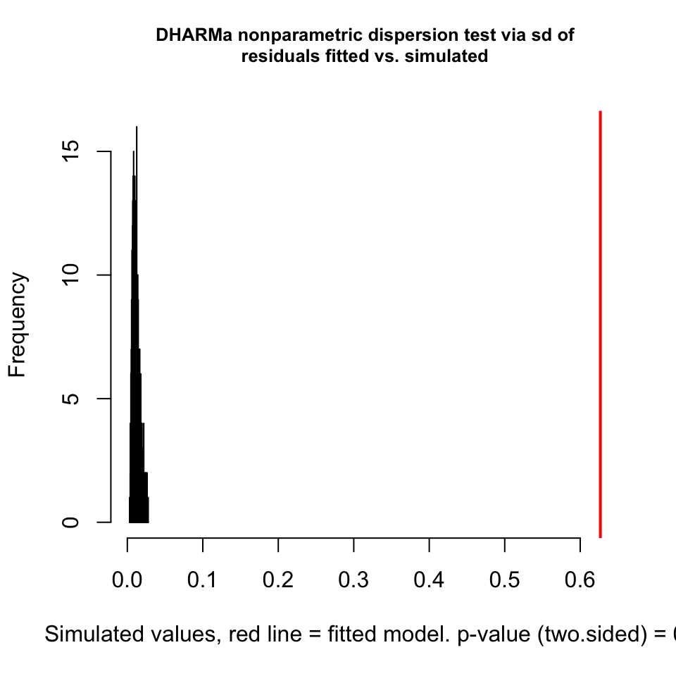{width=480}
:::

::: {.cell-output .cell-output-stdout}

```

	DHARMa nonparametric dispersion test via sd of residuals fitted vs.
	simulated

data:  simulationOutput
dispersion = 55.559, p-value < 0.00000000000000022
alternative hypothesis: two.sided
```


:::

```{.r .cell-code}
# Plot diagnostic plots
plot(sim_res)
```

::: {.cell-output-display}
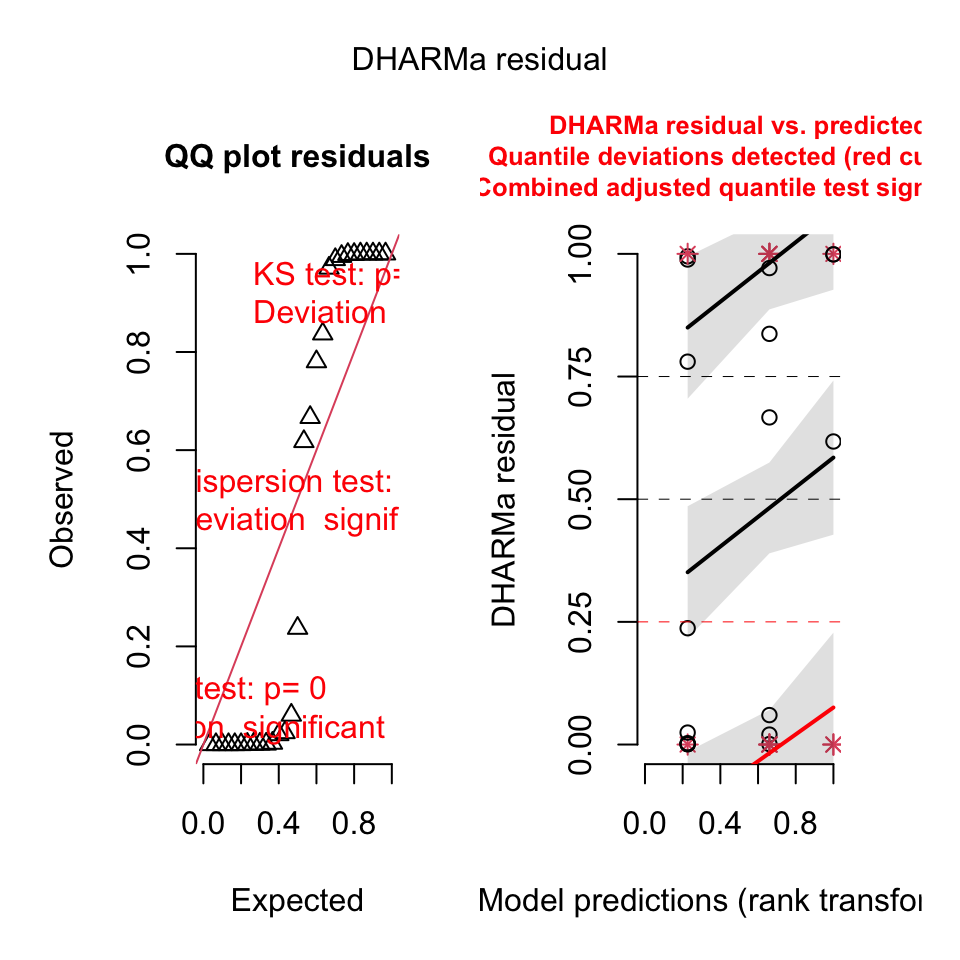{width=480}
:::
:::


### WHY DOES THE SHAPIRO TEST NOT WORK???

this you should consider - well it shouldn't but it does this time . dang it...


::: {.cell}

```{.r .cell-code}
shapiro.test(residuals(poiss_model))
```

::: {.cell-output .cell-output-stdout}

```

	Shapiro-Wilk normality test

data:  residuals(poiss_model)
W = 0.98973, p-value = 0.9909
```


:::
:::


## Poisson GLM Emmeans


::: {.cell}

```{.r .cell-code}
# 1. Calculate Estimated Marginal Means (EMMs)
# type = "response" converts the log-means back to the "species count" scale
pois_emm <- emmeans(poiss_model, 
                    specs = ~ size_cat,
                    type = "response")
print(pois_emm)
```

::: {.cell-output .cell-output-stdout}

```
 size_cat  rate   SE  df asymp.LCL asymp.UCL
 small     14.5 1.15 Inf      12.4      16.9
 medium    55.1 2.14 Inf      51.0      59.4
 large    231.7 6.21 Inf     219.8     244.2

Confidence level used: 0.95 
Intervals are back-transformed from the log scale 
```


:::
:::


## POISSON GLM Pairs Plots


::: {.cell}

```{.r .cell-code}
# 2. Pairwise Comparisons
# Compares all pairs: Small-Medium, Small-Large, Medium-Large
pois_pairs <- pairs(pois_emm, adjust = "tukey")
print(pois_pairs)
```

::: {.cell-output .cell-output-stdout}

```
 contrast        ratio      SE  df null z.ratio p.value
 small / medium 0.2624 0.02320 Inf    1 -15.146 <0.0001
 small / large  0.0624 0.00522 Inf    1 -33.139 <0.0001
 medium / large 0.2378 0.01120 Inf    1 -30.403 <0.0001

P value adjustment: tukey method for comparing a family of 3 estimates 
Tests are performed on the log scale 
```


:::

```{.r .cell-code}
# 3. Compact Letter Display (CLD)
# The easiest way to see the groupings
pois_cld <- multcomp::cld(pois_emm, 
                          Letters = letters,  
                          alpha = 0.05)
print(pois_cld)
```

::: {.cell-output .cell-output-stdout}

```
 size_cat  rate   SE  df asymp.LCL asymp.UCL .group
 small     14.5 1.15 Inf      12.4      16.9  a    
 medium    55.1 2.14 Inf      51.0      59.4   b   
 large    231.7 6.21 Inf     219.8     244.2    c  

Confidence level used: 0.95 
Intervals are back-transformed from the log scale 
P value adjustment: tukey method for comparing a family of 3 estimates 
Tests are performed on the log scale 
significance level used: alpha = 0.05 
NOTE: If two or more means share the same grouping symbol,
      then we cannot show them to be different.
      But we also did not show them to be the same. 
```


:::
:::


Poisson GLM Plot


::: {.cell}

```{.r .cell-code}
# 1. Get the estimated means and CIs into a dataframe
emm_poiss_df <- as.data.frame(pois_emm)

# 2. Create visualization
ggplot() +
  # Plot raw data (jittered so we can see the points)
  geom_jitter(data = g_df,
              aes(x = size_cat, y = spp),
              width = 0.2, # Spreads points horizontally
              alpha = 0.5) +
  # Add estimated means (points)
  geom_point(data = emm_poiss_df, 
             aes(x = size_cat, y = rate), # 'rate' is the mean
             size = 4, color = "blue") +
  # Add confidence intervals (error bars)
  geom_errorbar(data = emm_poiss_df, 
                aes(x = size_cat, 
                    ymin = asymp.LCL, # Lower Confidence Limit
                    ymax = asymp.UCL), # Upper Confidence Limit
                width = 0.2, color = "blue", linewidth = 1) +
  labs(title = "species Richness by Island Size Category",
       subtitle = "Poisson GLM predictions (on the response scale)",
       x = "Island Size Category",
       y = "Number of Plant species") +
  theme_minimal()
```

::: {.cell-output-display}
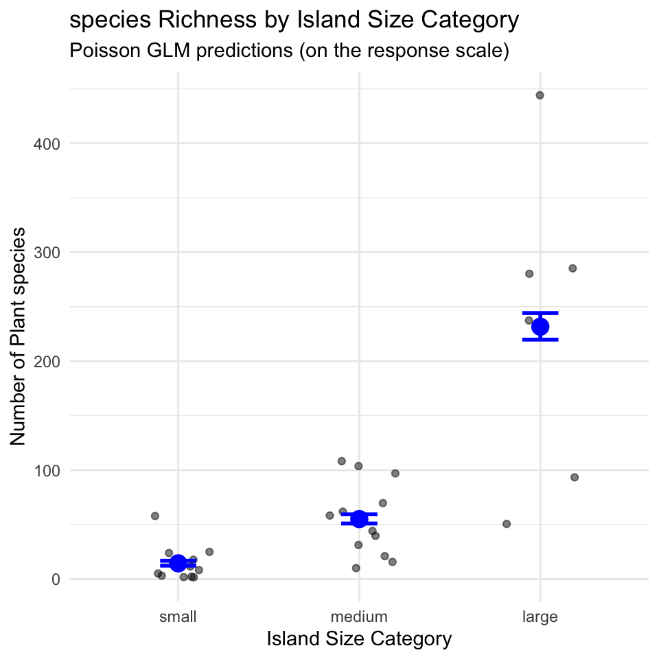{width=480}
:::
:::


# Negative Binomial GLM ANOVA

- Dealing with Overdispersion in Count Data
  - count data shows more variability than expected under a Poisson distribution (variance \> mean
  - need to use negative binomial model
  - `model_nb <- glm.nb(qsec_round ~ cyl, data = mtcars_count)`
- negative binomial model includes a dispersion parameter (theta)
- allows the variance to be larger than the mean
- standard errors bigger because NB model accounts for high variability (overdispersion)
- estimates dispersion parameter 'Theta' (or 1/theta)
- how it models the overdispersion.


::: {.cell}
::: {.cell-output .cell-output-stdout}

```

Call:
glm.nb(formula = spp ~ size_cat, data = g_df, init.theta = 1.660219232, 
    link = log)

Coefficients:
               Estimate Std. Error z value             Pr(>|z|)    
(Intercept)      2.6710     0.2471  10.810 < 0.0000000000000002 ***
size_catmedium   1.3378     0.3358   3.984      0.0000677150798 ***
size_catlarge    2.7743     0.4027   6.889      0.0000000000056 ***
---
Signif. codes:  0 '***' 0.001 '**' 0.01 '*' 0.05 '.' 0.1 ' ' 1

(Dispersion parameter for Negative Binomial(1.6602) family taken to be 1)

    Null deviance: 81.681  on 28  degrees of freedom
Residual deviance: 31.824  on 26  degrees of freedom
AIC: 283.97

Number of Fisher Scoring iterations: 1

              Theta:  1.660 
          Std. Err.:  0.442 

 2 x log-likelihood:  -275.972 
```


:::
:::


## Assumptions


::: {.cell}

```{.r .cell-code}
# 1. Simulate residuals
nb_sim_res <- simulateResiduals(fittedModel = nb_model)

# 2. Plot the diagnostics
plot(nb_sim_res)
```

::: {.cell-output-display}
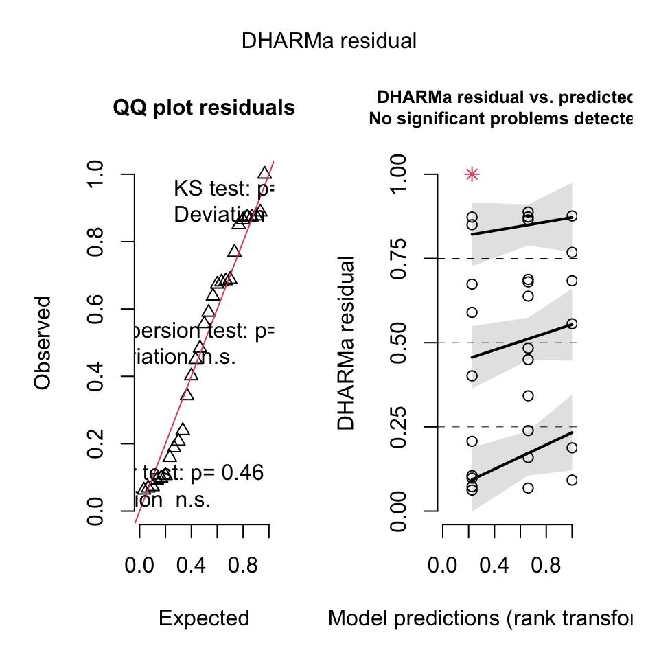{width=480}
:::
:::


### Note Shapiro test does not work


::: {.cell}

```{.r .cell-code}
shapiro.test(residuals(nb_model))
```

::: {.cell-output .cell-output-stdout}

```

	Shapiro-Wilk normality test

data:  residuals(nb_model)
W = 0.94501, p-value = 0.1357
```


:::
:::


## Overdispersion


::: {.cell}

```{.r .cell-code}
# This will test if there is *still* significant overdispersion
check_overdispersion(nb_model)
```

::: {.cell-output .cell-output-stdout}

```
# Overdispersion test

 dispersion ratio = 0.586
          p-value = 0.632
```


:::

::: {.cell-output .cell-output-stderr}

```
No overdispersion detected.
```


:::
:::


# ANOVA GLM Negative Binmial


::: {.cell}

```{.r .cell-code}
# Get the overall Anova (Type III Likelihood Ratio test)
nb_anova <- Anova(nb_model, type = "III", test = "LR")

print(nb_anova)
```

::: {.cell-output .cell-output-stdout}

```
Analysis of Deviance Table (Type III tests)

Response: spp
         LR Chisq Df       Pr(>Chisq)    
size_cat   49.858  2 0.00000000001491 ***
---
Signif. codes:  0 '***' 0.001 '**' 0.01 '*' 0.05 '.' 0.1 ' ' 1
```


:::
:::


::: {.cell}

```{.r .cell-code}
# 1. Calculate the Estimated Marginal Means on the "response" scale
nb_emmeans <- emmeans(nb_model, spec = ~ size_cat, type = "response")

print(nb_emmeans)
```

::: {.cell-output .cell-output-stdout}

```
 size_cat response    SE  df asymp.LCL asymp.UCL
 small        14.5  3.57 Inf      8.91      23.5
 medium       55.1 12.50 Inf     35.27      86.0
 large       231.7 73.70 Inf    124.22     432.0

Confidence level used: 0.95 
Intervals are back-transformed from the log scale 
```


:::
:::


### Pairwise


::: {.cell}

```{.r .cell-code}
# 2. Run pairwise comparisons on those means
nb_pairs <- pairs(nb_emmeans)

print(nb_pairs)
```

::: {.cell-output .cell-output-stdout}

```
 contrast        ratio     SE  df null z.ratio p.value
 small / medium 0.2624 0.0881 Inf    1  -3.984  0.0002
 small / large  0.0624 0.0251 Inf    1  -6.889 <0.0001
 medium / large 0.2378 0.0929 Inf    1  -3.675  0.0007

P value adjustment: tukey method for comparing a family of 3 estimates 
Tests are performed on the log scale 
```


:::
:::


::: {.cell}

```{.r .cell-code}
# 3. Get the Compact Letter Display (CLD)
nb_cld  <- multcomp::cld(nb_emmeans, Letters = letters)

print(nb_cld)
```

::: {.cell-output .cell-output-stdout}

```
 size_cat response    SE  df asymp.LCL asymp.UCL .group
 small        14.5  3.57 Inf      8.91      23.5  a    
 medium       55.1 12.50 Inf     35.27      86.0   b   
 large       231.7 73.70 Inf    124.22     432.0    c  

Confidence level used: 0.95 
Intervals are back-transformed from the log scale 
P value adjustment: tukey method for comparing a family of 3 estimates 
Tests are performed on the log scale 
significance level used: alpha = 0.05 
NOTE: If two or more means share the same grouping symbol,
      then we cannot show them to be different.
      But we also did not show them to be the same. 
```


:::
:::


# REGRESSIONS------

# Generalized Linear Models (GLMs) extend linear models to handle different types of response variables:

- Normal distribution: Continuous data (like regular ANOVA/regression)
- Poisson distribution: Count data
- Binomial distribution: Binary data (presence/absence, success/failure)
- Gamma distribution: Positive continuous data
- Negative binomial: Overdispersed count data

# Gaussian GLM (equivalent to simple linear regression)

The simplest form of GLM uses a normal (Gaussian) distribution with an identity link function. This is equivalent to a standard linear regression.

Let's compare a standard linear model and a Gaussian GLM.


::: {.cell}

```{.r .cell-code}
# 1. Distribution of Endemic Species
p1 <- ggplot(g_df, aes(x = endemics)) +
  geom_histogram(binwidth = 10, fill = "darkblue", color = "black") +
  labs(title = "Distribution of Endemic Species",
       x = "Number of Endemic Species",
       y = "Number of Islands") +
  theme_minimal()

# 2. Distribution of All Species
p2 <- ggplot(g_df, aes(x = spp)) +
  geom_histogram(binwidth = 25, fill = "darkgreen", color = "black") +
  labs(title = "Distribution of All Species",
       x = "Number of Plant Species",
       y = "Number of Islands") +
  theme_minimal()

# 3. Endemics vs Area (for Gaussian model)
p3 <- ggplot(g_df, aes(x = area, y = endemics)) +
  geom_point() +
  geom_smooth(method = "lm", se = FALSE, color = "blue") +
  labs(title = "Endemic Species vs. Island Area",
       x = "Area (km²)",
       y = "Number of Endemic Species") +
  theme_minimal()

# 4. Species vs Area (for Poisson/NB models)
p4 <- ggplot(g_df, aes(x = area, y = spp)) +
  geom_point() +
  labs(title = "All Species vs. Island Area",
       x = "Area (km²)",
       y = "Number of Plant Species") +
  theme_minimal()

# Combine plots
(p1 + p2) / (p3 + p4)
```

::: {.cell-output .cell-output-stderr}

```
`geom_smooth()` using formula = 'y ~ x'
```


:::

::: {.cell-output-display}
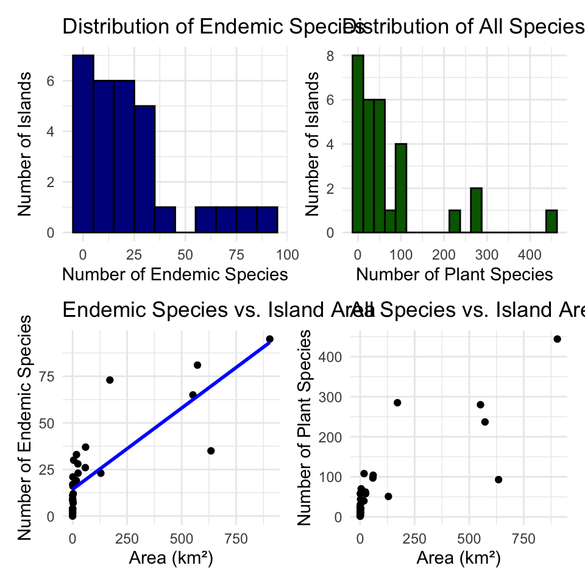{width=480}
:::
:::


# GLM with Gaussian (Normal) Distribution: Setup

We will model the continuous endemics variable as a function of the continuous area variable. This is a simple linear regression. We compare the lm() function with the glm() function using family = gaussian.

# The linear model summary


::: {.cell}

```{.r .cell-code}
# Fit a standard linear model
lm_reg_model <- lm(endemics ~ area, data = g_df)
summary(lm_reg_model)
```

::: {.cell-output .cell-output-stdout}

```

Call:
lm(formula = endemics ~ area, data = g_df)

Residuals:
    Min      1Q  Median      3Q     Max 
-34.690 -10.366  -2.612   6.528  43.733 

Coefficients:
            Estimate Std. Error t value     Pr(>|t|)    
(Intercept) 14.36338    2.99342   4.798 0.0000523735 ***
area         0.08720    0.01168   7.468 0.0000000493 ***
---
Signif. codes:  0 '***' 0.001 '**' 0.01 '*' 0.05 '.' 0.1 ' ' 1

Residual standard error: 14.57 on 27 degrees of freedom
Multiple R-squared:  0.6738,	Adjusted R-squared:  0.6617 
F-statistic: 55.77 on 1 and 27 DF,  p-value: 0.00000004929
```


:::
:::


# The ANOVA model

This table gives the F-statistic for the overall model, which in a simple linear regression, tests the same hypothesis as the t-test for the area slope.


::: {.cell}

```{.r .cell-code}
Anova(lm_reg_model, type = 3 )
```

::: {.cell-output .cell-output-stdout}

```
Anova Table (Type III tests)

Response: endemics
             Sum Sq Df F value        Pr(>F)    
(Intercept)  4887.1  1  23.024 0.00005237345 ***
area        11838.8  1  55.775 0.00000004929 ***
Residuals    5731.0 27                          
---
Signif. codes:  0 '***' 0.001 '**' 0.01 '*' 0.05 '.' 0.1 ' ' 1
```


:::
:::


# The Gaussian GLM model

Note the estimates and p-values are identical to the lm() output.


::: {.cell}

```{.r .cell-code}
# Fit a Gaussian GLM
gauss_reg_model <- glm(endemics ~ area,  data = g_df, 
                   family = gaussian(link = "identity"))

summary(gauss_reg_model)
```

::: {.cell-output .cell-output-stdout}

```

Call:
glm(formula = endemics ~ area, family = gaussian(link = "identity"), 
    data = g_df)

Coefficients:
            Estimate Std. Error t value     Pr(>|t|)    
(Intercept) 14.36338    2.99342   4.798 0.0000523735 ***
area         0.08720    0.01168   7.468 0.0000000493 ***
---
Signif. codes:  0 '***' 0.001 '**' 0.01 '*' 0.05 '.' 0.1 ' ' 1

(Dispersion parameter for gaussian family taken to be 212.261)

    Null deviance: 17570  on 28  degrees of freedom
Residual deviance:  5731  on 27  degrees of freedom
AIC: 241.6

Number of Fisher Scoring iterations: 2
```


:::
:::


# GLM ANOVA

Again, this F-test is identical to the one from the lm() model.


::: {.cell}

```{.r .cell-code}
Anova(gauss_reg_model, type = "III", test = "F")
```

::: {.cell-output .cell-output-stdout}

```
Analysis of Deviance Table (Type III tests)

Response: endemics
Error estimate based on Pearson residuals 

          Sum Sq Df F values        Pr(>F)    
area       11839  1   55.775 0.00000004929 ***
Residuals   5731 27                           
---
Signif. codes:  0 '***' 0.001 '**' 0.01 '*' 0.05 '.' 0.1 ' ' 1
```


:::
:::


# Assumption Tests of Both Models

The diagnostic plots for lm_model and gauss_model will be identical.


::: {.cell}

```{.r .cell-code}
# Create diagnostic plots for lm()
par(mfrow = c(1, 1))
plot(lm_reg_model)
```

::: {.cell-output-display}
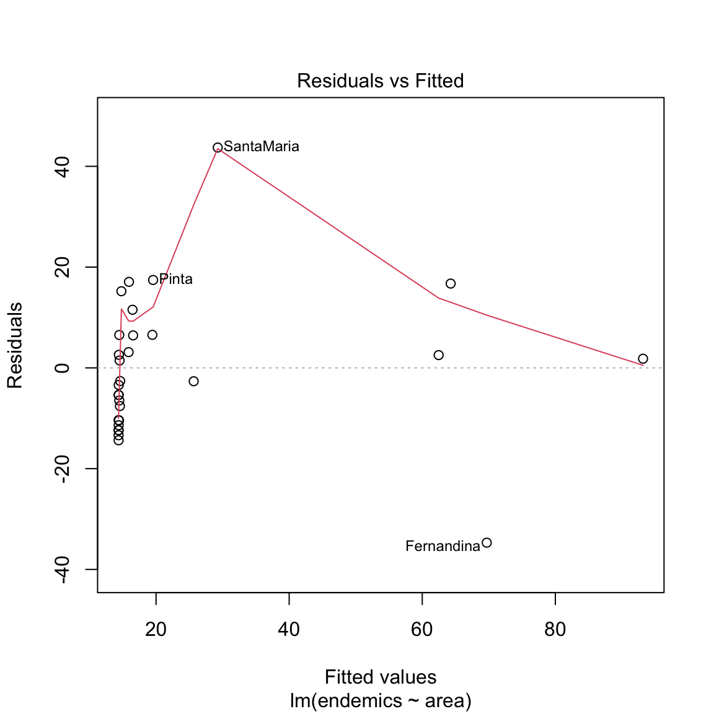{width=576}
:::

::: {.cell-output-display}
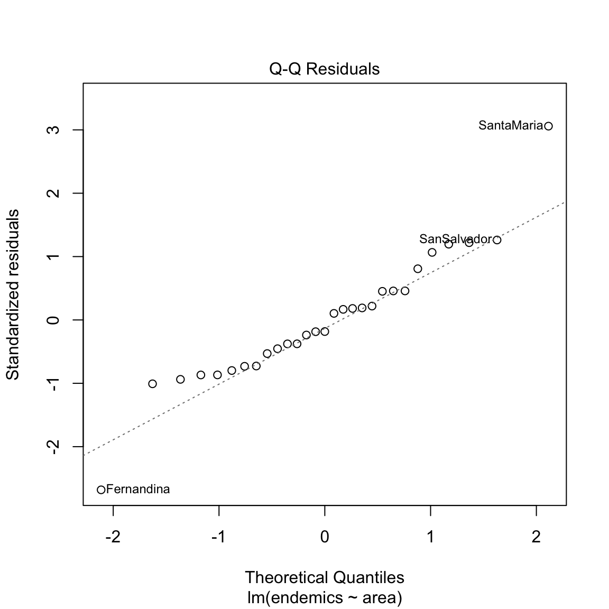{width=576}
:::

::: {.cell-output-display}
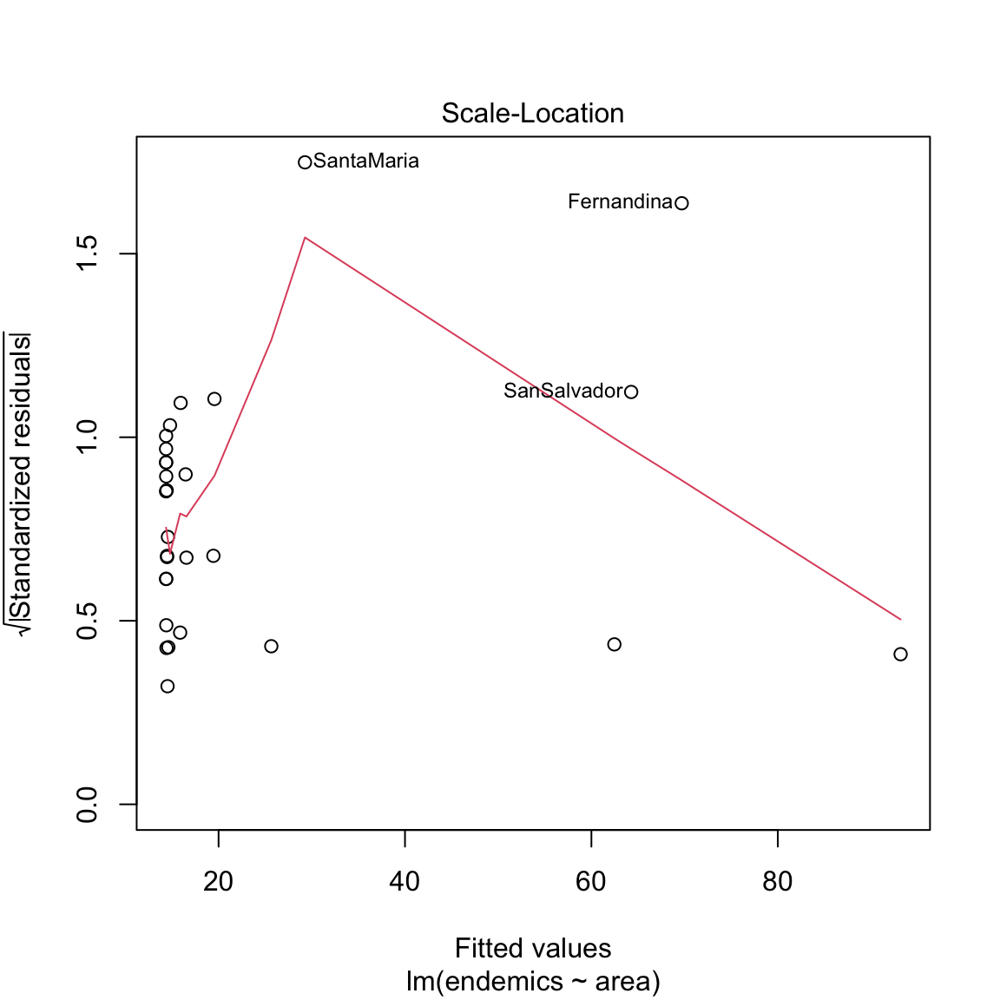{width=576}
:::

::: {.cell-output-display}
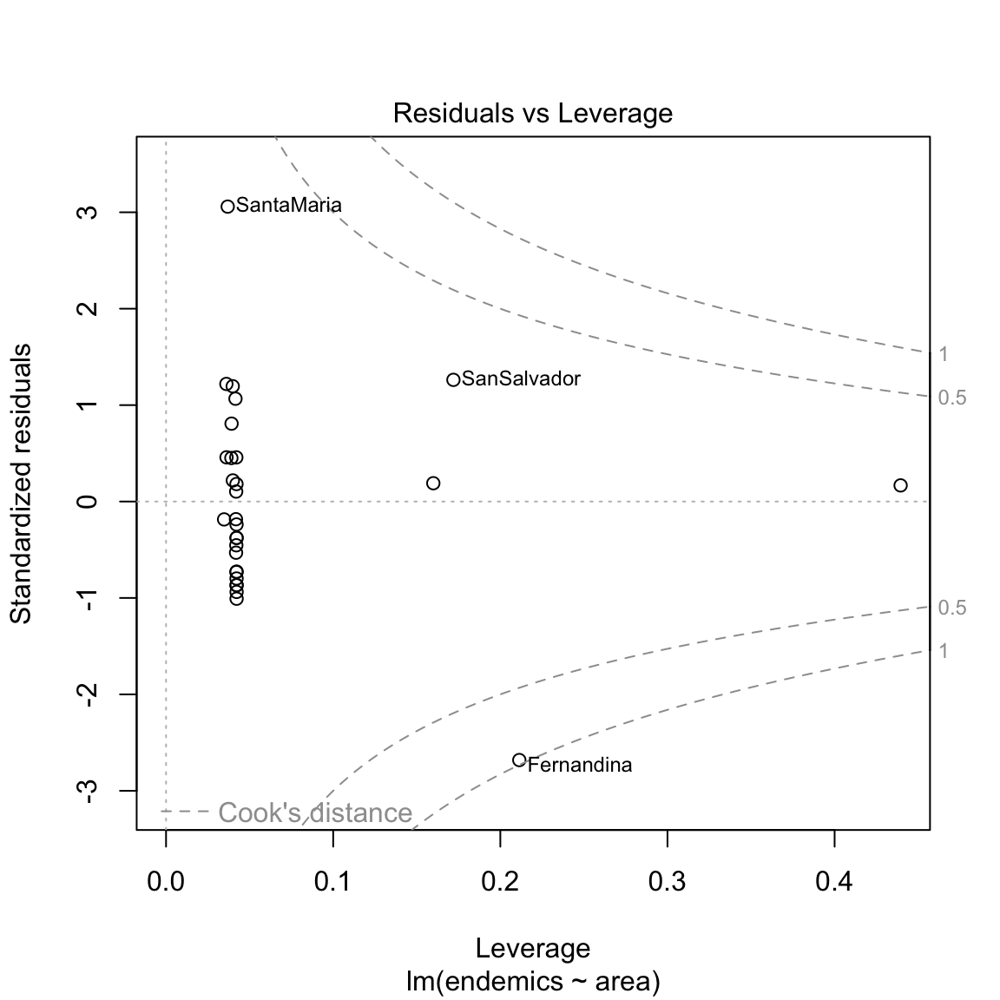{width=576}
:::

```{.r .cell-code}
par(mfrow = c(1, 1))
```
:::


# Shapiro-Wilk Test (Normality of Residuals)


::: {.cell}

```{.r .cell-code}
shapiro.test(residuals(lm_reg_model))
```

::: {.cell-output .cell-output-stdout}

```

	Shapiro-Wilk normality test

data:  residuals(lm_reg_model)
W = 0.93735, p-value = 0.08547
```


:::
:::


::: {.cell}

```{.r .cell-code}
shapiro.test(residuals(gauss_reg_model))
```

::: {.cell-output .cell-output-stdout}

```

	Shapiro-Wilk normality test

data:  residuals(gauss_reg_model)
W = 0.93735, p-value = 0.08547
```


:::
:::


# GLM Regression with Poisson Distribution

- Poisson GLMs are used when the response variable is count data.
- We will now model the total number of species (spp) as a function of island area.
- The Poisson distribution assumes the mean equals the variance.
- Key consideration: If variance \> mean (overdispersion), we should use a negative binomial model instead.
- Fit Poisson GLM with area as predictor


::: {.cell}

```{.r .cell-code}
poiss_reg_model <- glm(spp ~ area, 
                   data = g_df,
                   family = poisson(link = "log"))
summary(poiss_reg_model)
```

::: {.cell-output .cell-output-stdout}

```

Call:
glm(formula = spp ~ area, family = poisson(link = "log"), data = g_df)

Coefficients:
              Estimate Std. Error z value            Pr(>|z|)    
(Intercept) 3.73721483 0.03022162  123.66 <0.0000000000000002 ***
area        0.00269318 0.00005759   46.76 <0.0000000000000002 ***
---
Signif. codes:  0 '***' 0.001 '**' 0.01 '*' 0.05 '.' 0.1 ' ' 1

(Dispersion parameter for poisson family taken to be 1)

    Null deviance: 3031.2  on 28  degrees of freedom
Residual deviance: 1229.5  on 27  degrees of freedom
AIC: 1386.6

Number of Fisher Scoring iterations: 5
```


:::
:::


# GLM with Poisson Distribution: ANOVA

Does island area, as a whole, have a statistically significant effect on the number of plant species? We use a Likelihood Ratio (LR) test.


::: {.cell}

```{.r .cell-code}
Anova(poiss_reg_model, type = "III", test = "LR")
```

::: {.cell-output .cell-output-stdout}

```
Analysis of Deviance Table (Type III tests)

Response: spp
     LR Chisq Df            Pr(>Chisq)    
area   1801.7  1 < 0.00000000000000022 ***
---
Signif. codes:  0 '***' 0.001 '**' 0.01 '*' 0.05 '.' 0.1 ' ' 1
```


:::
:::


::: {.cell}

```{.r .cell-code}
# Calculate the dispersion parameter
# A simpler check
performance::check_overdispersion(poiss_reg_model)
```

::: {.cell-output .cell-output-stdout}

```
# Overdispersion test

       dispersion ratio =   52.256
  Pearson's Chi-Squared = 1410.899
                p-value =  < 0.001
```


:::

::: {.cell-output .cell-output-stderr}

```
Overdispersion detected.
```


:::
:::


# DHARMa Residual Diagnostics

We can use the DHARMa package to check model assumptions. The Q-Q plot clearly shows the model fits poorly.


::: {.cell}

```{.r .cell-code}
# 1. Simulate residuals
sim_pois_res <- simulateResiduals(fittedModel = poiss_reg_model, n = 1000)

# 2. Test for dispersion
testDispersion(sim_pois_res)
```

::: {.cell-output-display}
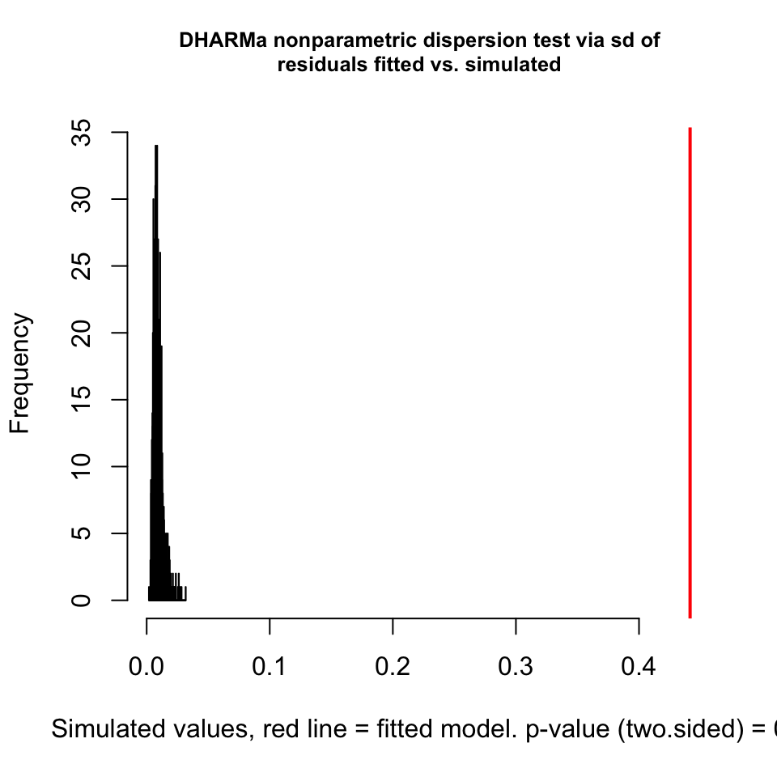{width=480}
:::

::: {.cell-output .cell-output-stdout}

```

	DHARMa nonparametric dispersion test via sd of residuals fitted vs.
	simulated

data:  simulationOutput
dispersion = 48.199, p-value < 0.00000000000000022
alternative hypothesis: two.sided
```


:::

```{.r .cell-code}
# Plot diagnostic plots
plot(sim_pois_res)
```

::: {.cell-output .cell-output-stderr}

```
qu = 0.25, log(sigma) = -2.941789 : outer Newton did not converge fully.
```


:::

::: {.cell-output .cell-output-stderr}

```
qu = 0.25, log(sigma) = -2.915169 : outer Newton did not converge fully.
```


:::

::: {.cell-output .cell-output-stderr}

```
qu = 0.25, log(sigma) = -2.999691 : outer Newton did not converge fully.
```


:::

::: {.cell-output .cell-output-stderr}

```
qu = 0.75, log(sigma) = -3.59874 : outer Newton did not converge fully.
```


:::

::: {.cell-output-display}
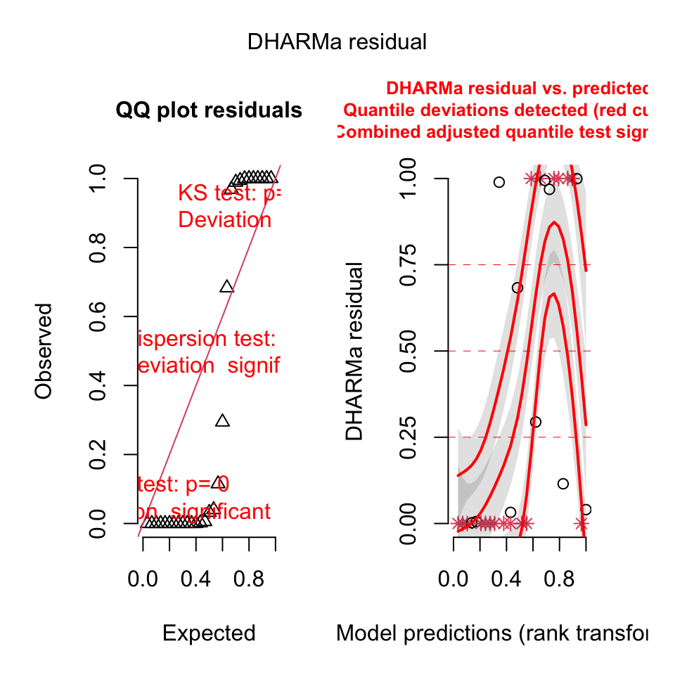{width=480}
:::
:::


# Plotting the Poisson Regression

Even though the model is a poor fit, we can visualize its prediction.


::: {.cell}

```{.r .cell-code}
ggplot(g_df, aes(x = area, y = spp)) +
  geom_point(alpha = 0.6) +
  geom_smooth(method = "glm", 
              method.args = list(family = "poisson"),
              se = TRUE, 
              color = "blue") +
  labs(title = "Species Richness by Island Area",
       subtitle = "Poisson GLM regression line",
       x = "Island Area (km²)",
       y = "Number of Plant Species") +
  theme_minimal()
```

::: {.cell-output .cell-output-stderr}

```
`geom_smooth()` using formula = 'y ~ x'
```


:::

::: {.cell-output-display}
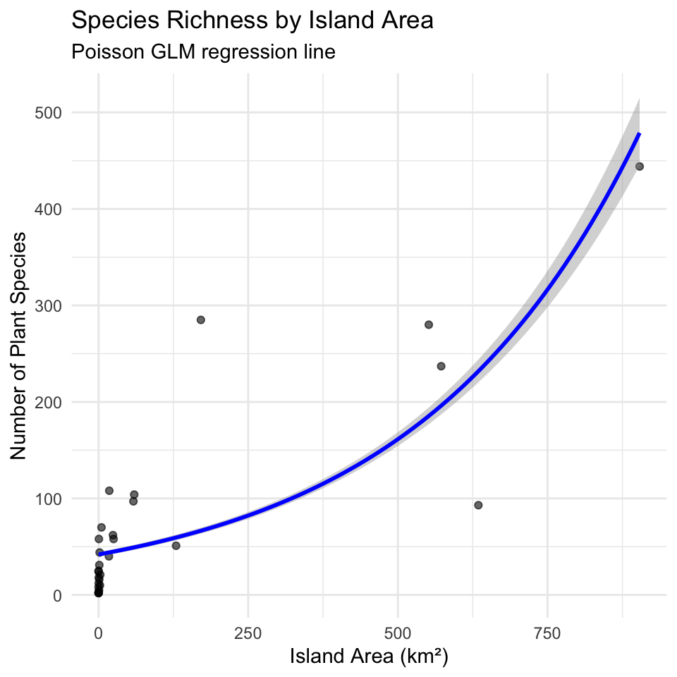{width=480}
:::
:::


# Negative Binomial GLM Regression

Used to handle overdispersed count data.

The negative binomial model includes a dispersion parameter (theta) to account for the variance being larger than the mean.


::: {.cell}

```{.r .cell-code}
nb_reg_model <- glm.nb(spp ~ area, data = g_df)
summary(nb_reg_model)
```

::: {.cell-output .cell-output-stdout}

```

Call:
glm.nb(formula = spp ~ area, data = g_df, init.theta = 1.098629663, 
    link = log)

Coefficients:
             Estimate Std. Error z value             Pr(>|z|)    
(Intercept) 3.6082304  0.1987610   18.15 < 0.0000000000000002 ***
area        0.0033531  0.0007672    4.37            0.0000124 ***
---
Signif. codes:  0 '***' 0.001 '**' 0.01 '*' 0.05 '.' 0.1 ' ' 1

(Dispersion parameter for Negative Binomial(1.0986) family taken to be 1)

    Null deviance: 55.178  on 28  degrees of freedom
Residual deviance: 32.695  on 27  degrees of freedom
AIC: 295.08

Number of Fisher Scoring iterations: 1

              Theta:  1.099 
          Std. Err.:  0.271 

 2 x log-likelihood:  -289.083 
```


:::
:::


# NB Assumption Diagnostics (DHARMa)

The DHARMa residual plot looks much better. The Q-Q plot is nearly on the line, and the residual vs. predicted plot shows no strong pattern.


::: {.cell}

```{.r .cell-code}
# 1. Simulate residuals
nb_sim_reg_res <- simulateResiduals(fittedModel = nb_reg_model)

# 2. Plot the diagnostics
plot(nb_sim_reg_res)
```

::: {.cell-output-display}
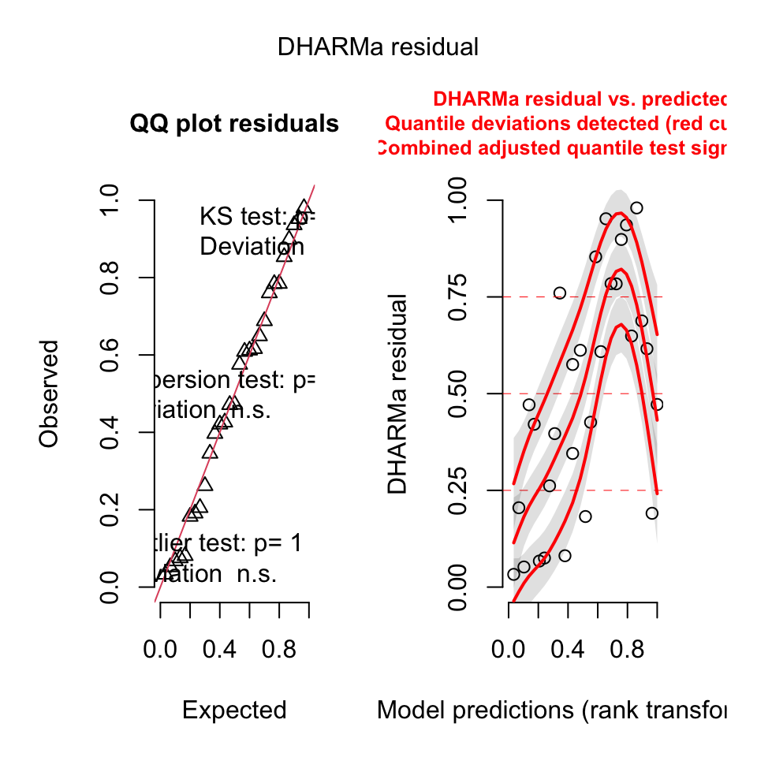{width=480}
:::
:::


# Overdispersion Check

The check_overdispersion test on the DHARMa residuals shows no remaining overdispersion (p = 0.816). This model successfully handled the issue.


::: {.cell}

```{.r .cell-code}
testDispersion(nb_sim_reg_res)
```

::: {.cell-output-display}
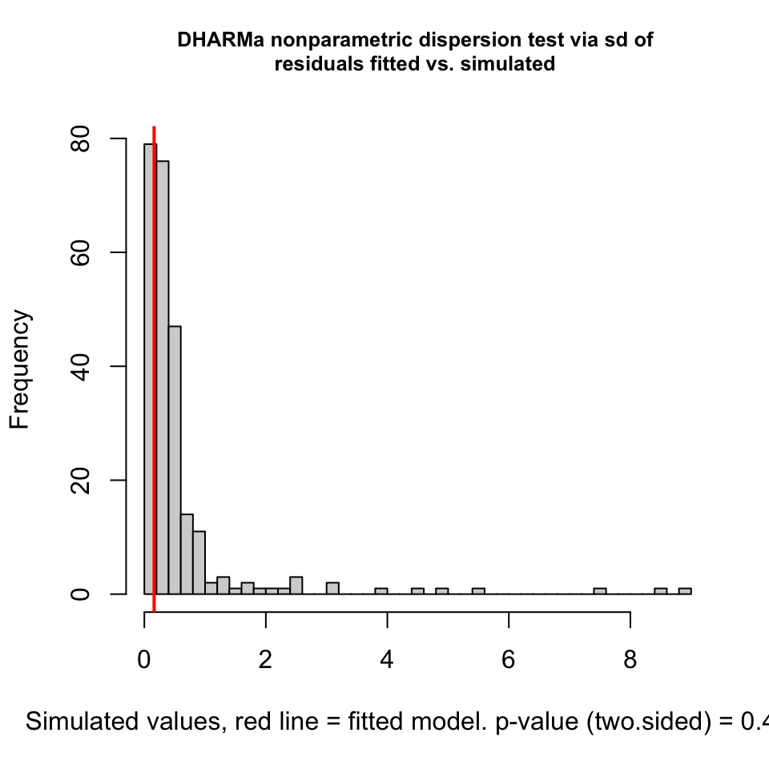{width=480}
:::

::: {.cell-output .cell-output-stdout}

```

	DHARMa nonparametric dispersion test via sd of residuals fitted vs.
	simulated

data:  simulationOutput
dispersion = 0.27162, p-value = 0.488
alternative hypothesis: two.sided
```


:::
:::


# ANOVA GLM Negative Binomial

We again use a Likelihood Ratio (LR) test to get the overall p-value for the area predictor.


::: {.cell}

```{.r .cell-code}
# Get the overall Anova (Type III Likelihood Ratio test)
nb_reg_anova <- Anova(nb_reg_model, type = "III", test = "LR")

print(nb_anova)
```

::: {.cell-output .cell-output-stdout}

```
Analysis of Deviance Table (Type III tests)

Response: spp
         LR Chisq Df       Pr(>Chisq)    
size_cat   49.858  2 0.00000000001491 ***
---
Signif. codes:  0 '***' 0.001 '**' 0.01 '*' 0.05 '.' 0.1 ' ' 1
```


:::
:::


# Plotting the Negative Binomial Regression

This plot shows the fitted line from our final, best-fitting model.


::: {.cell}

```{.r .cell-code}
ggplot(g_df, aes(x = area, y = spp)) +
  geom_point(alpha = 0.6) +
  geom_smooth(method = "glm.nb",
              se = FALSE,
              color = "purple") +
  labs(title = "Species Richness by Island Area",
       subtitle = "Negative Binomial GLM regression line",
       x = "Island Area (km²)",
       y = "Number of Plant Species") +
  theme_minimal()
```

::: {.cell-output .cell-output-stderr}

```
`geom_smooth()` using formula = 'y ~ x'
```


:::

::: {.cell-output-display}
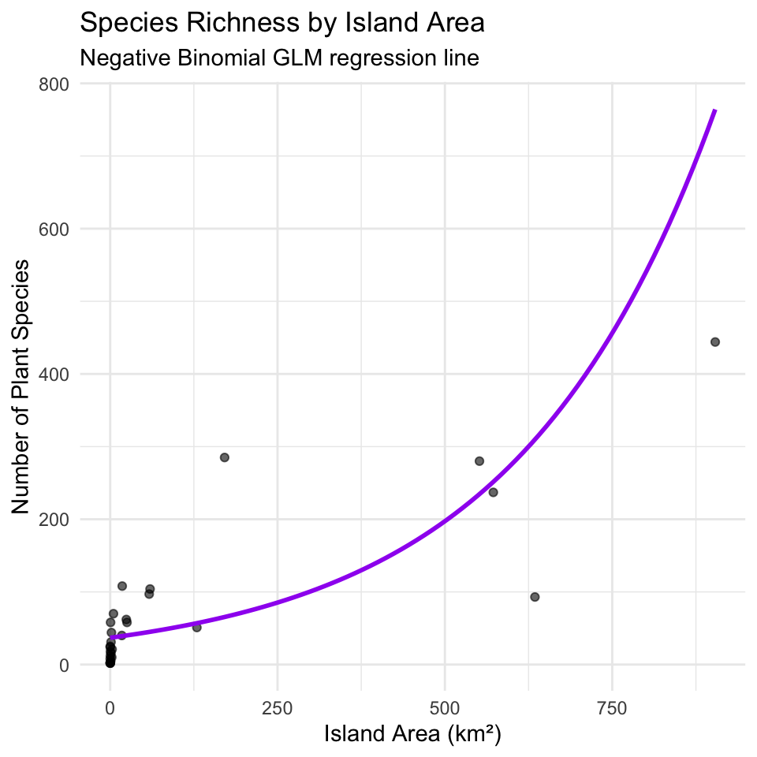{width=480}
:::
:::


# Logistic Regression

Logistic regression is a GLM used when the response variable is binary (e.g., dead/alive, present/absent). It models the probability of the response being "1" (success) given predictor values.

Let's examine the simple logistic regression model:

$$\pi(x) = \frac{e^{\beta_0 + \beta_1 x}}{1 + e^{\beta_0 + \beta_1 x}}$$

- Where:
  - $\pi(x)$ is the probability that Y = 1 given X = x
  - $\beta_0$ is the intercept
  - $\beta_1$ is the slope (rate of change in $\pi(x)$ for a unit change in X)

To linearize this relationship, we use the logit link function:

$$g(x) = \log\left(\frac{\pi(x)}{1-\pi(x)}\right) = \beta_0 + \beta_1 x$$

This transforms the probability (which is bounded between 0 and 1) to a linear function that can range from -∞ to +∞.

# Example: Lizard Presence on Islands

Based on the example from Polis et al. (1998), we'll model the presence/absence of lizards (*Uta*) on islands in the Gulf of California based on perimeter/area ratio.


::: {.cell}

```{.r .cell-code}
set.seed(123)
island_data <- data.frame(
  island_id = 1:30,
  pa_ratio = seq(5, 70, length.out = 30),
  uta_present = c(rep(1, 10), 
                  rbinom(10, 1, prob = 0.5),  # Mixed outcomes in middle
                  rep(0, 10)))%>%
  mutate(uta_present_factor = factor(uta_present, levels = c(0, 1), 
         labels = c("Absent", "Present")))
```
:::


::: {.cell}

```{.r .cell-code}
ggplot() +
  # Add jittered points for observed data
  geom_point(data = island_data, 
              aes(x = pa_ratio, y = uta_present),
              position = position_dodge2(width=.1), alpha = 0.7) +
  labs(title = "Probability of Uta Presence vs. Perimeter/area Ratio",
       x = "Perimeter/area Ratio",
       y = "Probability of Presence") +
  scale_y_continuous(limits = c(0, 1)) +
  theme_minimal()
```

::: {.cell-output-display}
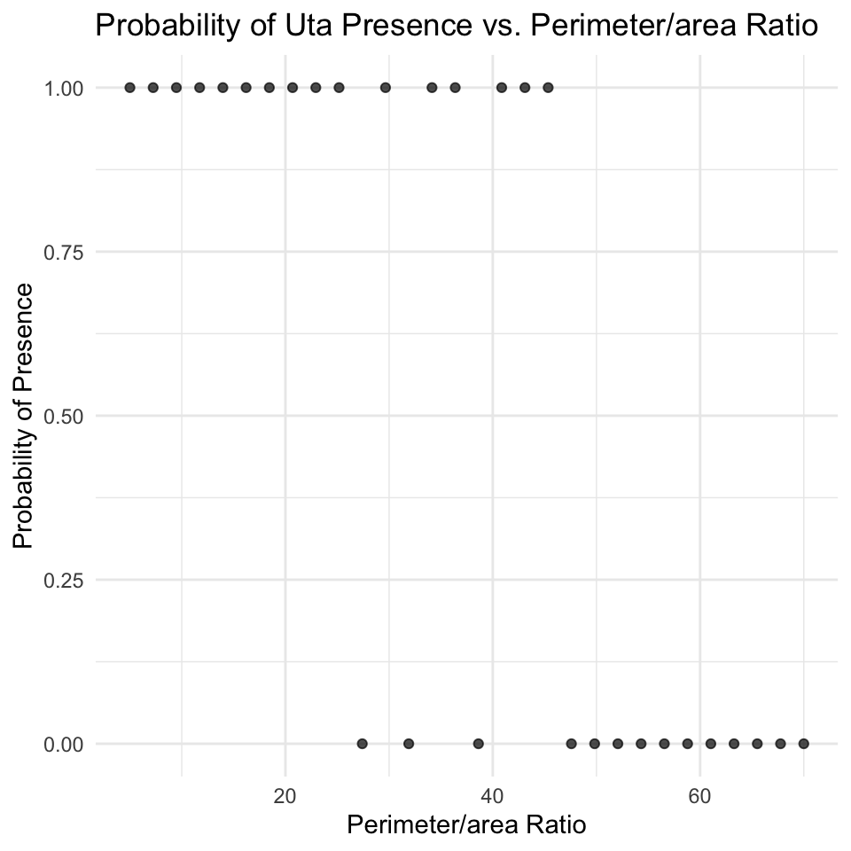{width=480}
:::
:::


# Example: Lizard Presence on Islands

Based on the example from Polis et al. (1998), we'll model the presence/absence of lizards (*Uta*) on islands in the Gulf of California based on perimeter/area ratio.


::: {.cell}

```{.r .cell-code}
# Fit the logistic regression model
lizard_model <- glm(uta_present ~ pa_ratio, 
                    data = island_data, 
                    family = binomial(link = "logit"))

# Model summary
summary(lizard_model)
```

::: {.cell-output .cell-output-stdout}

```

Call:
glm(formula = uta_present ~ pa_ratio, family = binomial(link = "logit"), 
    data = island_data)

Coefficients:
            Estimate Std. Error z value Pr(>|z|)   
(Intercept)   5.9374     2.1297   2.788  0.00530 **
pa_ratio     -0.1493     0.0517  -2.887  0.00388 **
---
Signif. codes:  0 '***' 0.001 '**' 0.01 '*' 0.05 '.' 0.1 ' ' 1

(Dispersion parameter for binomial family taken to be 1)

    Null deviance: 41.455  on 29  degrees of freedom
Residual deviance: 19.090  on 28  degrees of freedom
AIC: 23.09

Number of Fisher Scoring iterations: 6
```


:::
:::


# Lizard Example: Visualization and Testing

Let's visualize the data and the fitted model:


::: {.cell}

```{.r .cell-code}
#| paged-print: false
# Create a dataframe for predictions
pred_data <- data.frame(
  pa_ratio = seq(min(island_data$pa_ratio), 
                max(island_data$pa_ratio), 
                length.out = 100)
)

# Get predicted probabilities
pred_data$prob <- predict(lizard_model, 
                         newdata = pred_data, 
                         type = "response")

# Plot
ggplot() +
  # Add jittered points for observed data
  geom_point(data = island_data, 
              aes(x = pa_ratio, y = uta_present),
              position = position_dodge2(width=.1), alpha = 0.7) +
  # Add predicted probability curve
  geom_line(data = pred_data, 
            aes(x = pa_ratio, y = prob), 
            color = "blue", size = 1) +
  # Add confidence intervals (optional)
  labs(title = "Probability of Uta Presence vs. Perimeter/area Ratio",
       x = "Perimeter/area Ratio",
       y = "Probability of Presence") +
  scale_y_continuous(limits = c(0, 1)) +
  theme_minimal()
```

::: {.cell-output .cell-output-stderr}

```
Warning: Using `size` aesthetic for lines was deprecated in ggplot2 3.4.0.
ℹ Please use `linewidth` instead.
```


:::

::: {.cell-output-display}
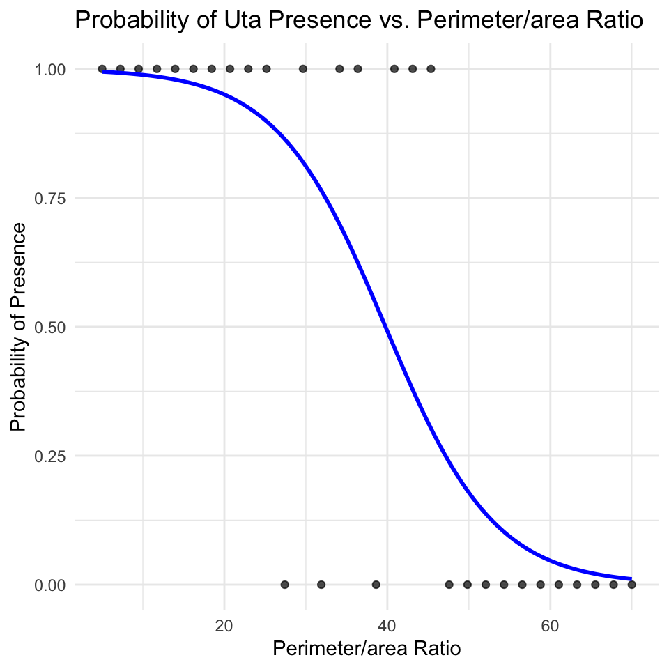{width=480}
:::
:::


We want to test the null hypothesis that β₁ = 0, meaning there's no relationship between P/A ratio and lizard presence.

There are two common ways to test this hypothesis:

1.  **Wald test**: Tests if the parameter estimate divided by its standard error differs significantly from zero

2.  **Likelihood ratio test**: Compares the fit of the full model to a reduced model without the predictor variable


::: {.cell}

```{.r .cell-code}
reduced_model <- glm(uta_present ~ 1, 
                     data = island_data, 
                     family = binomial(link = "logit"))
anova(reduced_model, lizard_model, test = "Chisq")
```

::: {.cell-output .cell-output-stdout}

```
Analysis of Deviance Table

Model 1: uta_present ~ 1
Model 2: uta_present ~ pa_ratio
  Resid. Df Resid. Dev Df Deviance    Pr(>Chi)    
1        29     41.455                            
2        28     19.090  1   22.365 0.000002254 ***
---
Signif. codes:  0 '***' 0.001 '**' 0.01 '*' 0.05 '.' 0.1 ' ' 1
```


:::
:::


# Interpreting the Odds Ratio

### Working with Odds Ratios

The odds ratio represents how the odds of the event (e.g., lizard presence) change with a unit increase in the predictor.

- **Odds ratio = exp(β₁)**
- If odds ratio \> 1: Increasing the predictor increases the odds of event
- If odds ratio \< 1: Increasing the predictor decreases the odds of event
- If odds ratio = 1: No effect of predictor on odds of event
- For every one-unit increase in island's Perimeter/area Ratio - odds of finding a lizard present multiplied by 0.898
- the odds decrease by 10.2% (which is 1 - 0.898) for every one-unit increase in the P/A ratio
- entire interval is below 1.0, you can be confident the relationship is negative: more P/A ratio means lower odds of lizards


::: {.cell}

```{.r .cell-code}
coef_lizard <- coef(lizard_model)[2]  # Extract slope coefficient
odds_ratio <- exp(coef_lizard)
ci <- exp(confint(lizard_model, "pa_ratio"))
```

::: {.cell-output .cell-output-stderr}

```
Waiting for profiling to be done...
```


:::

```{.r .cell-code}
cat("Odds Ratio:", round(odds_ratio, 3), "\n\n",
"95% CI:", round(ci[1], 3), "to", round(ci[2], 3), "\n")
```

::: {.cell-output .cell-output-stdout}

```
Odds Ratio: 0.861 

 95% CI: 0.753 to 0.932 
```


:::
:::


::: {.cell}

```{.r .cell-code}
# This function is specifically for model parameters
model_parameters(lizard_model, exponentiate = TRUE)
```

::: {.cell-output .cell-output-stdout}

```
Parameter   | Odds Ratio |     SE |            95% CI |     z |     p
---------------------------------------------------------------------
(Intercept) |     378.94 | 807.02 | [14.47, 94371.40] |  2.79 | 0.005
pa ratio    |       0.86 |   0.04 | [ 0.75,     0.93] | -2.89 | 0.004
```


:::

::: {.cell-output .cell-output-stderr}

```

Uncertainty intervals (profile-likelihood) and p-values (two-tailed)
  computed using a Wald z-distribution approximation.
```


:::
:::


This gives you the odds ratio (in the estimate column) and the exponentiated CIs (conf.low, conf.high) for all terms in your model, all in one clean table.


::: {.cell}

```{.r .cell-code}
library(broom)

# This one function does everything
tidy(lizard_model, exponentiate = TRUE, conf.int = TRUE)
```

::: {.cell-output .cell-output-stdout}

```
# A tibble: 2 × 7
  term        estimate std.error statistic p.value conf.low conf.high
  <chr>          <dbl>     <dbl>     <dbl>   <dbl>    <dbl>     <dbl>
1 (Intercept)  379.       2.13        2.79 0.00530   14.5   94371.   
2 pa_ratio       0.861    0.0517     -2.89 0.00388    0.753     0.932
```


:::
:::


# Assessing Model Fit

There are several ways to assess the goodness-of-fit for logistic regression models:


::: {.cell}

```{.r .cell-code}
# This one function gives McFadden's and other popular R² values
performance::r2(lizard_model)
```

::: {.cell-output .cell-output-stdout}

```
# R2 for Logistic Regression
  Tjur's R2: 0.588
```


:::

```{.r .cell-code}
pscl::pR2(lizard_model)
```

::: {.cell-output .cell-output-stdout}

```
fitting null model for pseudo-r2
```


:::

::: {.cell-output .cell-output-stdout}

```
        llh     llhNull          G2    McFadden        r2ML        r2CU 
 -9.5450726 -20.7276993  22.3652534   0.5395016   0.5255070   0.7017187 
```


:::

```{.r .cell-code}
# 'g' is the number of groups to test (e.g., 10 for deciles)
# Note: You need to provide the observed 'y' values
hoslem.test(lizard_model$y, fitted(lizard_model), g = 10)
```

::: {.cell-output .cell-output-stdout}

```

	Hosmer and Lemeshow goodness of fit (GOF) test

data:  lizard_model$y, fitted(lizard_model)
X-squared = 2.4032, df = 8, p-value = 0.9661
```


:::
:::


Logistic regression has different and generally fewer assumptions to test than standard linear regression.

- The main "assumptions" for logistic regression are:

  - Binary Outcome: The dependent variable must be binary (0/1) or proportional (e.g., number of successes / number of trials). Your uta_present is 0/1, so this is met.

  - Independence of Observations: Each observation (each island) must be independent. This is a study design assumption.

  - Linearity of the Logit: This is the most important one to test. It assumes a linear relationship between any continuous predictors and the log-odds (logit) of the outcome.

  - No (or little) Multicollinearity: If you have multiple predictors, they shouldn't be highly correlated with each other.

1.  Linearity of the Logit (The Most Important Check) continuous predictor (pa_ratio) has a linear relationship with the log-odds of the outcome looking for a flat, non-curved line.


::: {.cell}

```{.r .cell-code}
# This runs multiple checks, but the "Linearity" one is key
check_model(lizard_model, residual_type = "normal")
```

::: {.cell-output-display}
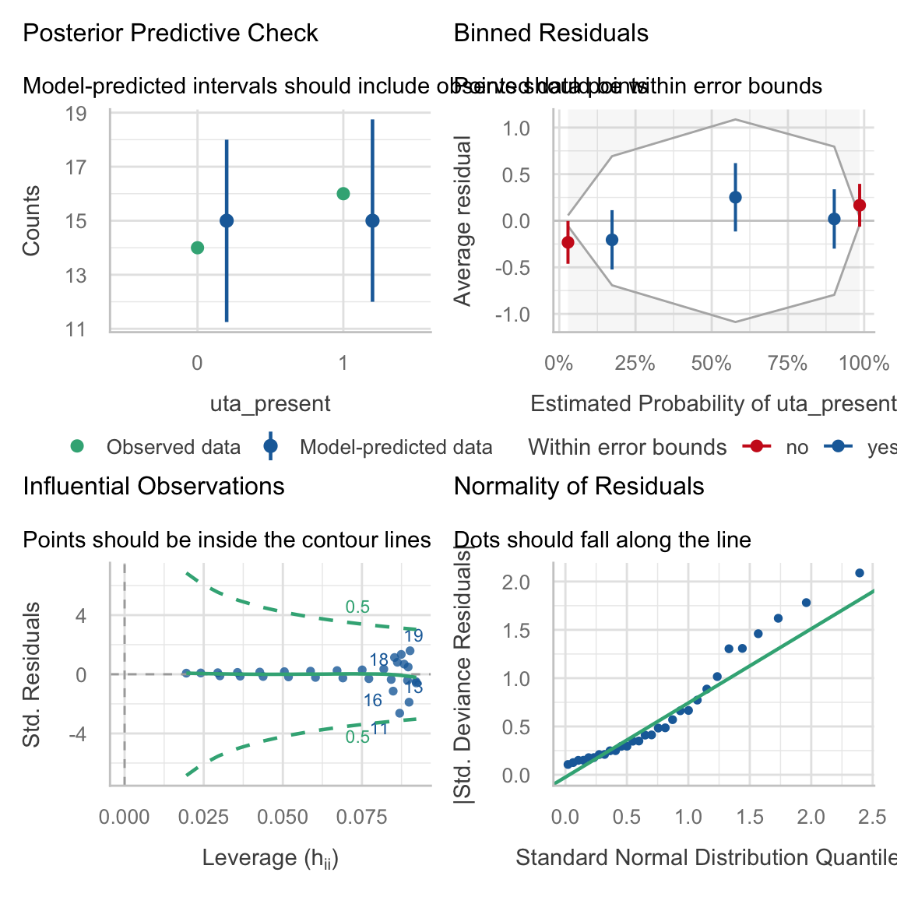{width=576}
:::
:::


DHARMa is excellent for GLMs. It simulates residuals and plots them against predictors. This is a very robust way to check for all kinds of model misfit, including non-linearity. plotResiduals function will show three quantile regression lines. You want all three (the solid red one and two dashed ones) to be flat and near 0.5. If they are sloped or curved, it indicates a pattern that your model missed (i.e., non-linearity).


::: {.cell}

```{.r .cell-code}
# 1. Simulate the residuals
sim_res <- simulateResiduals(fittedModel = lizard_model)

# 2. Plot residuals against the predictor
# DHARMa has a specific function for this
plotResiduals(sim_res, lizard_model$model$pa_ratio, 
              xlab = "Perimeter/area Ratio", 
              main = "DHARMa Residuals vs. Predictor")
```

::: {.cell-output-display}
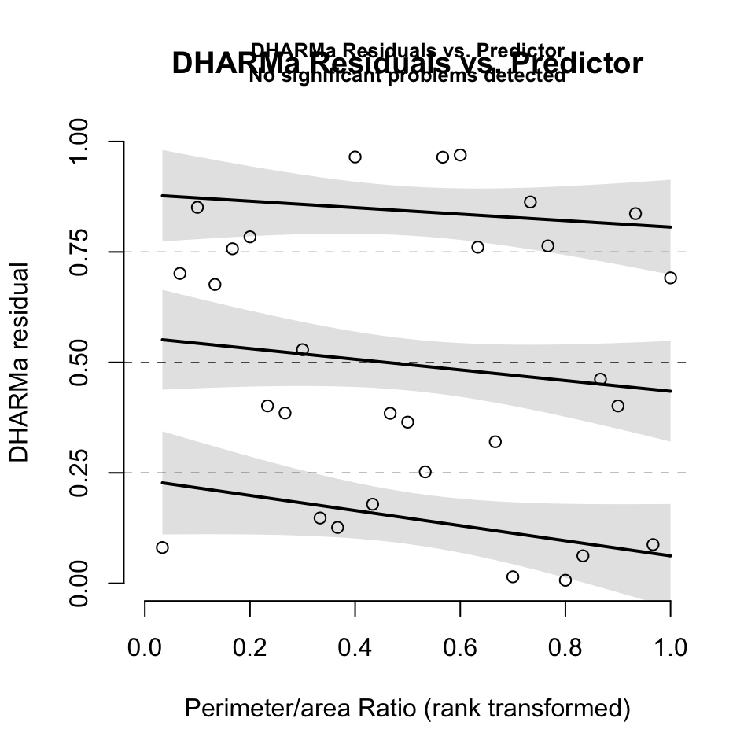{width=480}
:::
:::


2.  Multicollinearity only with 2 or more predictors

if you did have more predictors (e.g., pa_ratio and island_area), you would test it like this:

3.  Overall Model Fit (Goodness-of-Fit) This isn't an "assumption" so much as a check that the model as a whole is adequate. You already have the two main tests in your file!

Hosmer-Lemeshow Test (from your code) Interpretation: For this test, a GOOD model has a non-significant p-value (p \> 0.05). This means your model's predicted probabilities are not significantly different from the observed probabilities in the data, which is what you want.


::: {.cell}

```{.r .cell-code}
# You need the pscl library
# library(pscl) 

# Note: g = 10 (deciles) is a common choice
hoslem.test(lizard_model$y, fitted(lizard_model), g = 10)
```

::: {.cell-output .cell-output-stdout}

```

	Hosmer and Lemeshow goodness of fit (GOF) test

data:  lizard_model$y, fitted(lizard_model)
X-squared = 2.4032, df = 8, p-value = 0.9661
```


:::
:::
