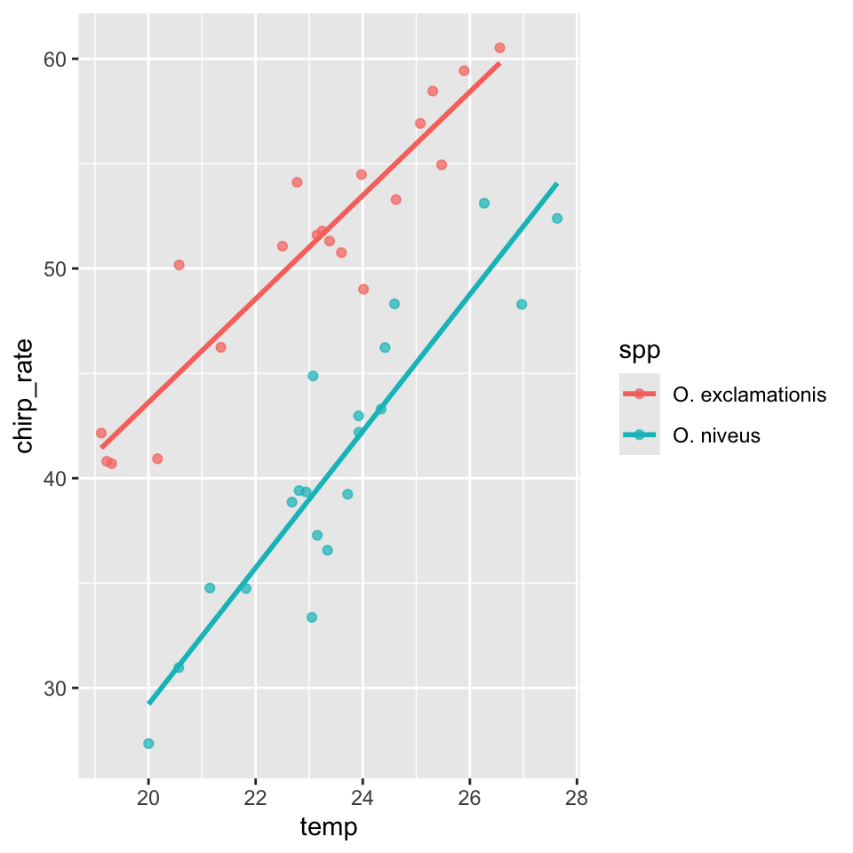
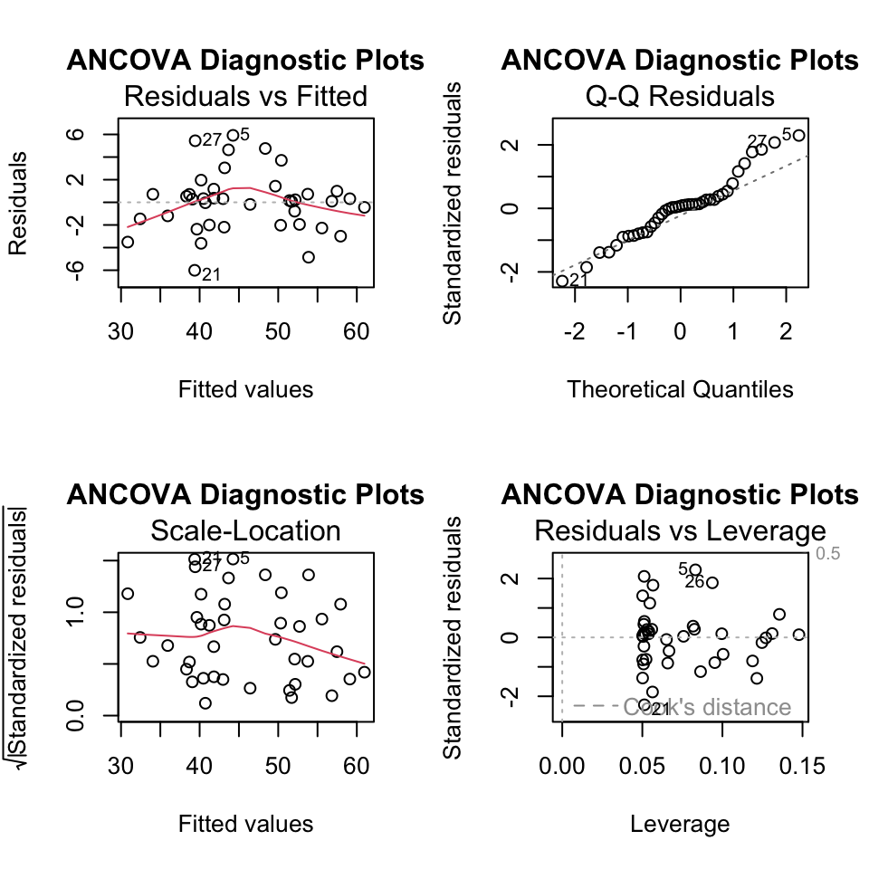
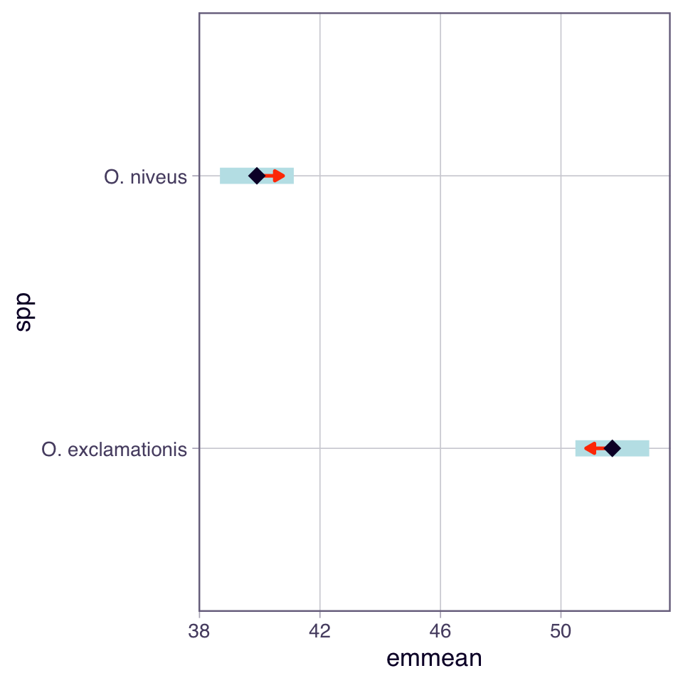
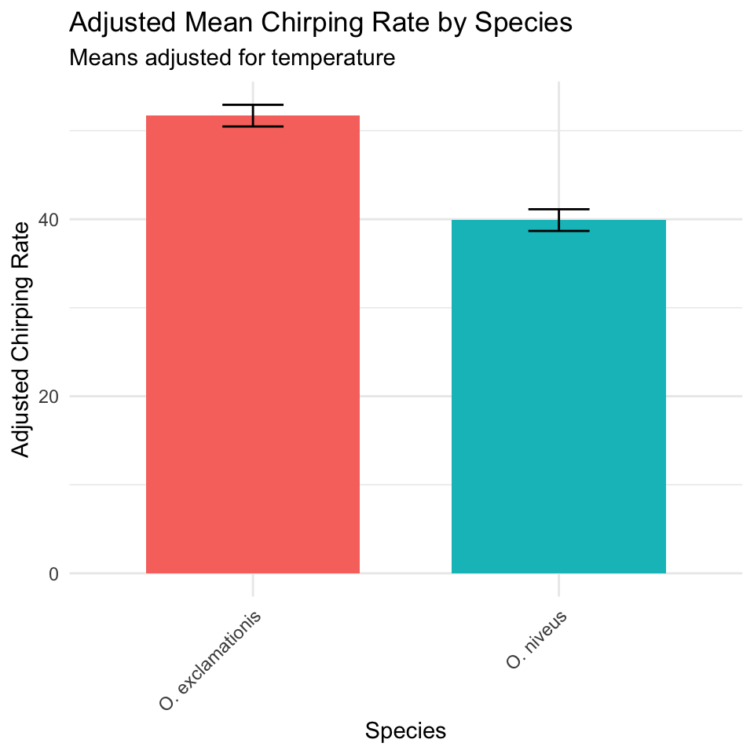
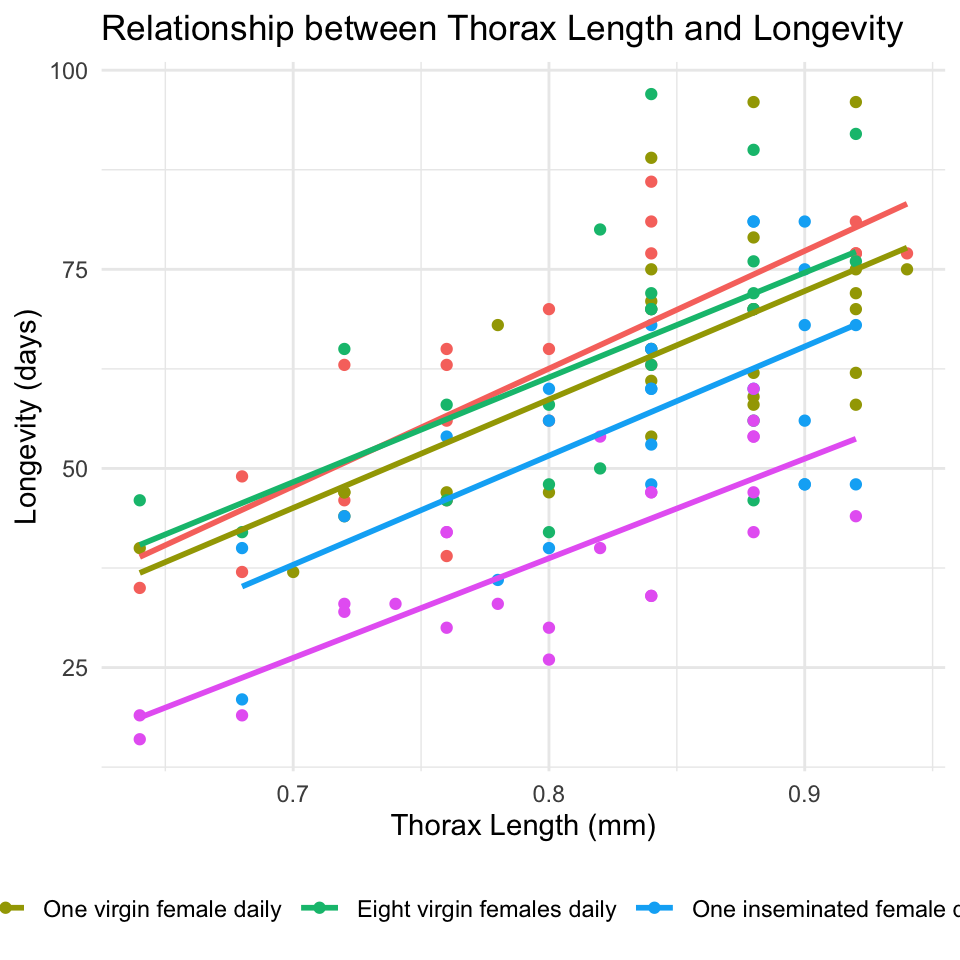
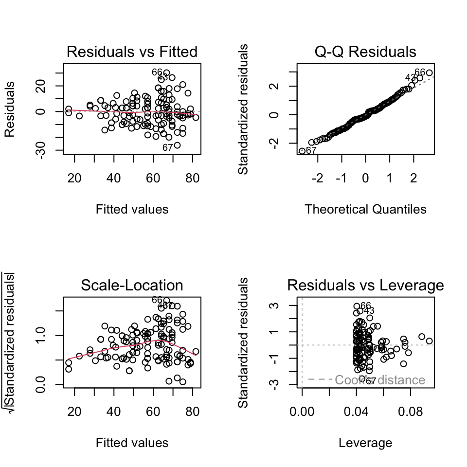
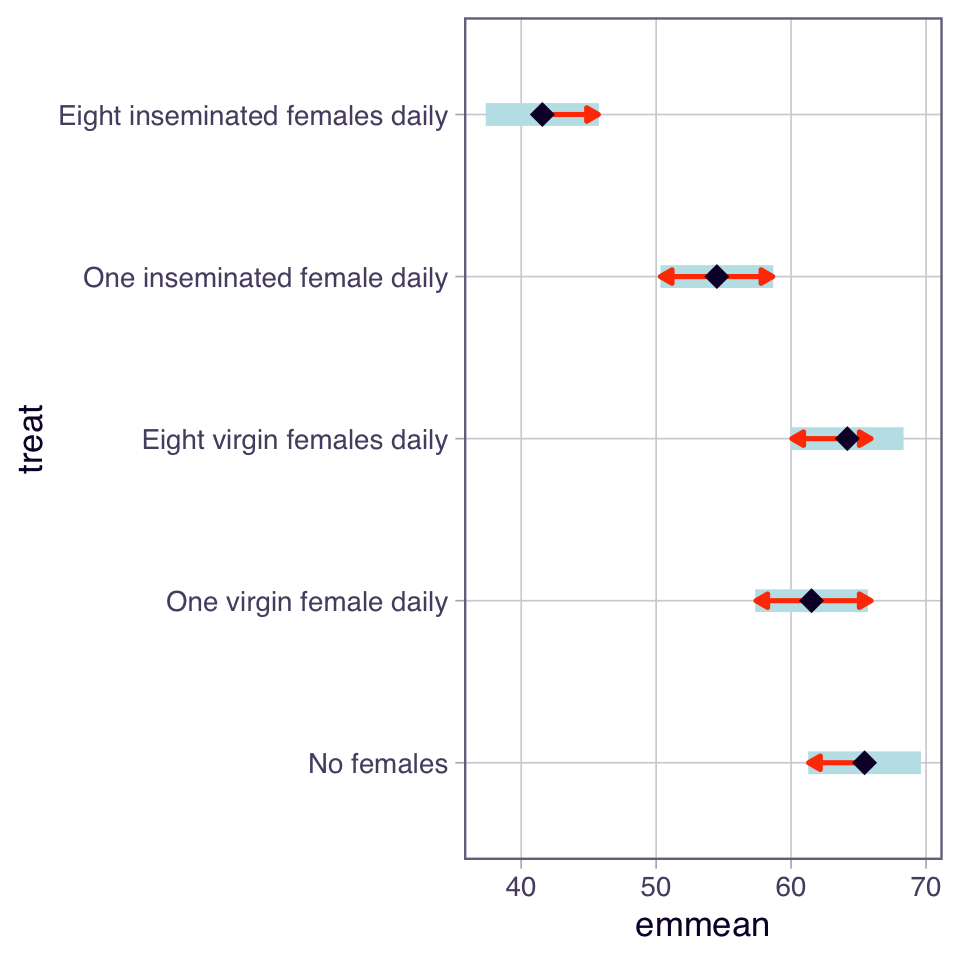
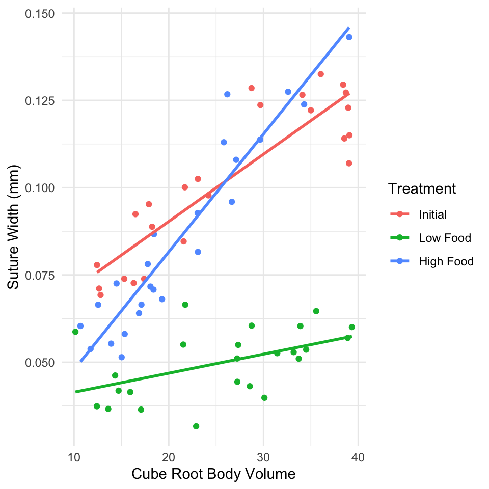

# Lecture 15: Analysis of Covariance (ANCOVA)

## What is ANCOVA?

- ANCOVA (Analysis of Covariance) combines regression and ANOVA to:
  - Compare group means while adjusting for a continuous covariate
  - Increase statistical power by reducing residual error
  - Control for confounding variables

## When to Use ANCOVA

- Use ANCOVA when you have:
  - **Response variable**: Continuous
  - **Predictor variable**: Categorical (factor/groups)
  - **Covariate**: Continuous variable that affects the response

## Key Assumptions of ANCOVA

1.  **Independence** of observations
2.  **Normality** of residuals
3.  **Homogeneity of variances** across groups
4.  **Linearity** between response and covariate within each group
5.  **Homogeneity of slopes** (most critical!) - regression slopes must be not significantly different across all groups

::: {.callout-important appearance="simple"}
## Critical First Step

Always test for **homogeneity of slopes** before proceeding with ANCOVA. If slopes differ significantly between groups, standard ANCOVA is inappropriate.
:::

# Part 1: Cricket Chirping Analysis

## Data Overview

We want to compare chirping rate of two cricket species: - *Oecanthus exclamationis* - *Oecanthus niveus*

But we measured rates at different temperatures, and there's a relationship between pulse rate and temperature. ANCOVA lets us adjust for temperature effect to get a more powerful test!


::: {.cell}

```{.r .cell-code}
# Create simulated cricket data based on lecture example
set.seed(456)
n <- 40
spp <- rep(c("O. exclamationis", "O. niveus"), each = n/2)
temp <- c(rnorm(n/2, mean = 22, sd = 2), rnorm(n/2, mean = 24, sd = 2))
chirp_rate <- 40 + 2.5 * (temp - 23) + ifelse(spp == "O. exclamationis", 10, 0) + rnorm(n, sd = 3)
c_df <- data.frame(spp = spp, temp = temp, chirp_rate = chirp_rate)

# View data structure

head(c_df)
```

::: {.cell-output .cell-output-stdout}

```
               spp     temp chirp_rate
1 O. exclamationis 19.31296   40.69557
2 O. exclamationis 23.24355   51.78799
3 O. exclamationis 23.60175   50.75553
4 O. exclamationis 19.22222   40.80589
5 O. exclamationis 20.57129   50.16484
6 O. exclamationis 21.35188   46.24225
```


:::
:::


::: {.cell}

```{.r .cell-code}
# Plot with regression lines by species
ggplot(c_df, aes(x = temp, y = chirp_rate, color = spp)) +
  geom_point(alpha = 0.7) +
  geom_smooth(method = "lm", se = FALSE) 
```

::: {.cell-output .cell-output-stderr}

```
`geom_smooth()` using formula = 'y ~ x'
```


:::

::: {.cell-output-display}
{width=480}
:::
:::


## Step 1: Test Homogeneity of Slopes

This is the most critical assumption! We test if the regression slopes are equal across all groups.


::: {.cell}

```{.r .cell-code}
options(contrasts = c("contr.sum", "contr.poly")) # for true type 3 anovas
# options(contrasts = c("contr.treatment", "contr.poly")) # original version
# see below for interpretation...

# Test for homogeneity of slopes by including interaction term
lm_int_model <- lm(chirp_rate ~ temp * spp, data = c_df)
Anova(lm_int_model, type = 3)
```

::: {.cell-output .cell-output-stdout}

```
Anova Table (Type III tests)

Response: chirp_rate
             Sum Sq Df  F value                Pr(>F)    
(Intercept)  133.06  1  19.7625            0.00008062 ***
temp        1372.62  1 203.8707 < 0.00000000000000022 ***
spp           69.76  1  10.3617              0.002724 ** 
temp:spp      26.08  1   3.8734              0.056796 .  
Residuals    242.38 36                                   
---
Signif. codes:  0 '***' 0.001 '**' 0.01 '*' 0.05 '.' 0.1 ' ' 1
```


:::
:::


**Interpretation**: - p \> 0.05, slopes homogeneous - proceed with ANCOVA - p \< 0.05, slopes differ and standard ANCOVA is inappropriate

### The contrasts setting changes the specific hypothesis being tested for your main effects.

- contr.treatment the test for temp is testing the effect of temperature only for the reference species (O. exclamationis)
- one level of factor is the "reference" level ("O. exclamationis" comes first alphabetically).
- is mean chirp_rate equal to zero for the reference species ("O. exclamationis") when temp is 0?

### With contr.sum, test for temp is testing the average effect of temperature across both species.

- "sum coding" or "deviation coding."
- compares each factor level to the grand mean
- is average mean chirp_rate (averaged across both species) equal to zero when temp is 0?

::: {.callout-important appearance="simple"}
Intercept is hard to interpret in both models because temp = 0 is meaningless - center temp variable (e.g., temp_c = temp - mean(temp)) - run model - intercept would then test the chirp_rate at the average temperature - much more interpretable
:::

# Step 2: Fit ANCOVA Model

Since slopes are homogeneous (p \> 0.05), fit ANCOVA model without interaction term


::: {.cell}

```{.r .cell-code}
# Fit ANCOVA model (without interaction)
ancova_model <- lm(chirp_rate ~ temp + spp, data = c_df)

# Get model summary
summary(ancova_model)
```

::: {.cell-output .cell-output-stdout}

```

Call:
lm(formula = chirp_rate ~ temp + spp, data = c_df)

Residuals:
    Min      1Q  Median      3Q     Max 
-6.0065 -1.9653  0.1923  0.7886  5.9192 

Coefficients:
            Estimate Std. Error t value             Pr(>|t|)    
(Intercept) -19.1014     4.7795  -3.997             0.000295 ***
temp          2.7926     0.2048  13.634 0.000000000000000530 ***
spp1          5.9003     0.4296  13.733 0.000000000000000424 ***
---
Signif. codes:  0 '***' 0.001 '**' 0.01 '*' 0.05 '.' 0.1 ' ' 1

Residual standard error: 2.694 on 37 degrees of freedom
Multiple R-squared:  0.8994,	Adjusted R-squared:  0.894 
F-statistic: 165.4 on 2 and 37 DF,  p-value: < 0.00000000000000022
```


:::
:::


- Interpretation
  - spp1 is clue that contr.sum is active
  - represents coefficient for first species (O. exclamationis) relative to grand mean.
  - (Intercept): -19.1014 - average chirp_rate (across both species) when temp is 0
  - temp: 2.7926 - common slope- for every 1-degree increase in temp- chirp_rate increases by 2.7926 units
  - spp1: 5.9003- spp1 coefficient - deviation from grand mean for first species- O. exclamationis
  - effect for O. niveus is assumed to be -5.9003


::: {.cell}

```{.r .cell-code}
# View ANOVA table
Anova(ancova_model, type = 2)
```

::: {.cell-output .cell-output-stdout}

```
Anova Table (Type II tests)

Response: chirp_rate
           Sum Sq Df F value                Pr(>F)    
temp      1348.81  1  185.90 0.0000000000000005296 ***
spp       1368.34  1  188.59 0.0000000000000004236 ***
Residuals  268.46 37                                  
---
Signif. codes:  0 '***' 0.001 '**' 0.01 '*' 0.05 '.' 0.1 ' ' 1
```


:::
:::


Both Type II (technically more appropriate) and Type III end up doing the exact same calculation:

- test for temp gets the Sum of Squares for temp after accounting for spp.
- test for spp gets the Sum of Squares for spp after accounting for temp.

## Step 3: Check Model Assumptions


::: {.cell}

```{.r .cell-code}
# Create diagnostic plots
par(mfrow = c(2, 2))
plot(ancova_model, main = "ANCOVA Diagnostic Plots")
```

::: {.cell-output-display}
{width=480}
:::

```{.r .cell-code}
par(mfrow = c(1, 1))
```
:::


::: {.cell}

```{.r .cell-code}
shapiro.test(ancova_model$residuals)
```

::: {.cell-output .cell-output-stdout}

```

	Shapiro-Wilk normality test

data:  ancova_model$residuals
W = 0.96208, p-value = 0.1971
```


:::
:::


::: {.cell}

```{.r .cell-code}
leveneTest(chirp_rate ~  spp, data = c_df)
```

::: {.cell-output .cell-output-stderr}

```
Warning in leveneTest.default(y = y, group = group, ...): group coerced to
factor.
```


:::

::: {.cell-output .cell-output-stdout}

```
Levene's Test for Homogeneity of Variance (center = median)
      Df F value Pr(>F)
group  1  0.3897 0.5362
      38               
```


:::
:::


Breusch-Pagan (BP) Test for homoscedasticity


::: {.cell}

```{.r .cell-code}
lmtest::bptest(ancova_model)
```

::: {.cell-output .cell-output-stdout}

```

	studentized Breusch-Pagan test

data:  ancova_model
BP = 1.0098, df = 2, p-value = 0.6036
```


:::
:::


## Step 4: Calculate Adjusted Means

ANCOVA compares adjusted means - what each group's mean would be at the overall mean of the covariate.


::: {.cell}

```{.r .cell-code}
# Calculate adjusted means using emmeans
c_emmeans <- emmeans(ancova_model, "spp")

# Convert to dataframe for plotting
cricket_adj_means_df <- as.data.frame(c_emmeans)
cricket_adj_means_df
```

::: {.cell-output .cell-output-stdout}

```
 spp                emmean        SE df lower.CL upper.CL
 O. exclamationis 51.70513 0.6049702 37 50.47934 52.93091
 O. niveus        39.90462 0.6049702 37 38.67883 41.13040

Confidence level used: 0.95 
```


:::
:::


## Step 5: Pairwise Comparisons


::: {.cell}

```{.r .cell-code}
# Pairwise comparisons of adjusted means
pairs(c_emmeans, adjust = "sidak")
```

::: {.cell-output .cell-output-stdout}

```
 contrast                     estimate    SE df t.ratio p.value
 O. exclamationis - O. niveus     11.8 0.859 37  13.733 <0.0001
```


:::
:::


## Step 6: Visualize Results


::: {.cell}

```{.r .cell-code}
# Plot adjusted means with confidence intervals
plot(c_emmeans, comparisons = TRUE) 
```

::: {.cell-output-display}
{width=480}
:::
:::


::: {.cell}

```{.r .cell-code}
# Bar chart of adjusted means
c_emmeans_df <- as.data.frame(c_emmeans)
ggplot(c_emmeans_df, aes(x = spp, y = emmean, fill = spp)) +
  geom_bar(stat = "identity", width = 0.7) +
  geom_errorbar(aes(ymin = lower.CL, ymax = upper.CL), width = 0.2) +
  labs(title = "Adjusted Mean Chirping Rate by Species",
       subtitle = "Means adjusted for temperature",
       x = "Species",
       y = "Adjusted Chirping Rate") +
  theme_minimal() +
  theme(legend.position = "none",
        axis.text.x = element_text(angle = 45, hjust = 1))
```

::: {.cell-output-display}
{width=480}
:::
:::


# Part 2: Partridge Longevity Analysis

## Data Overview

We'll analyze the effect of mating strategy on male fruitfly longevity, using thorax length as a covariate.


::: {.cell}

```{.r .cell-code}
# Load the partridge dataset
p_df <- read.csv("data/partridge.csv") %>% clean_names() %>% 
  rename(
    treat = treatmen
  )

# Create better treatment names
p_df$treat <- factor(p_df$treat,
                            levels = 1:5,
                            labels = c("No females", 
                                      "One virgin female daily",
                                      "Eight virgin females daily",
                                      "One inseminated female daily",
                                      "Eight inseminated females daily"))

# View data structure
head(p_df)
```

::: {.cell-output .cell-output-stdout}

```
  partners type      treat longev  llongev thorax     resid1 predict1
1        8    0 No females     35 1.544068   0.64  -5.868456 40.86846
2        8    0 No females     37 1.568202   0.68  -9.301196 46.30120
3        8    0 No females     49 1.690196   0.68   2.698804 46.30120
4        8    0 No females     46 1.662758   0.72  -5.733936 51.73394
5        8    0 No females     63 1.799341   0.72  11.266064 51.73394
6        8    0 No females     39 1.591065   0.76 -18.166676 57.16668
       resid2 predict2
1 -0.04743024 1.591498
2 -0.07105067 1.639252
3  0.05094369 1.639252
4 -0.02424867 1.687007
5  0.11233405 1.687007
6 -0.14369601 1.734761
```


:::
:::


::: {.cell}

```{.r .cell-code}
# Visualize the relationship between thorax length and longevity by treatment
ggplot(p_df, aes(x = thorax, y = longev, color = treat)) + 
  geom_point() +
  geom_smooth(method = "lm", se = FALSE) +
  labs(title = "Relationship between Thorax Length and Longevity",
       x = "Thorax Length (mm)",
       y = "Longevity (days)",
       color = "Treatment") +
  theme_minimal() +
  theme(legend.position = "bottom")
```

::: {.cell-output .cell-output-stderr}

```
`geom_smooth()` using formula = 'y ~ x'
```


:::

::: {.cell-output-display}
{width=480}
:::
:::


## Step 1: Test Homogeneity of Slopes


::: {.cell}

```{.r .cell-code}
# Test for homogeneity of slopes
homo_slopes_model <- lm(longev ~ thorax * treat, data = p_df)
Anova(homo_slopes_model, type = 3)
```

::: {.cell-output .cell-output-stdout}

```
Anova Table (Type III tests)

Response: longev
              Sum Sq  Df  F value                Pr(>F)    
(Intercept)   2963.8   1  26.0142           0.000001349 ***
thorax       12805.8   1 112.3988 < 0.00000000000000022 ***
treat           36.9   4   0.0810                0.9881    
thorax:treat    42.5   4   0.0933                0.9844    
Residuals    13102.1 115                                   
---
Signif. codes:  0 '***' 0.001 '**' 0.01 '*' 0.05 '.' 0.1 ' ' 1
```


:::
:::


## Step 2: Fit ANCOVA Model


::: {.cell}

```{.r .cell-code}
# Fit the ANCOVA model (without interaction)
p_ancova_model <- lm(longev ~ thorax + treat, data = p_df)

# Get more detailed summary
summary(p_ancova_model)
```

::: {.cell-output .cell-output-stdout}

```

Call:
lm(formula = longev ~ thorax + treat, data = p_df)

Residuals:
    Min      1Q  Median      3Q     Max 
-26.189  -6.599  -0.989   6.408  30.244 

Coefficients:
            Estimate Std. Error t value             Pr(>|t|)    
(Intercept)  -54.062     10.255  -5.272          0.000000612 ***
thorax       135.819     12.439  10.919 < 0.0000000000000002 ***
treat1         8.006      1.890   4.237          0.000044991 ***
treat2         4.077      1.889   2.158             0.032935 *  
treat3         6.730      1.881   3.578             0.000502 ***
treat4        -2.940      1.891  -1.554             0.122749    
---
Signif. codes:  0 '***' 0.001 '**' 0.01 '*' 0.05 '.' 0.1 ' ' 1

Residual standard error: 10.51 on 119 degrees of freedom
Multiple R-squared:  0.6564,	Adjusted R-squared:  0.6419 
F-statistic: 45.46 on 5 and 119 DF,  p-value: < 0.00000000000000022
```


:::
:::


::: {.cell}

```{.r .cell-code}
# View ANOVA table
Anova(p_ancova_model, type = "II")
```

::: {.cell-output .cell-output-stdout}

```
Anova Table (Type II tests)

Response: longev
           Sum Sq  Df F value                Pr(>F)    
thorax    13168.9   1 119.219 < 0.00000000000000022 ***
treat      9611.5   4  21.753    0.0000000000001719 ***
Residuals 13144.7 119                                  
---
Signif. codes:  0 '***' 0.001 '**' 0.01 '*' 0.05 '.' 0.1 ' ' 1
```


:::
:::


## Step 3: Check Assumptions


::: {.cell}

```{.r .cell-code}
# Create diagnostic plots
par(mfrow = c(2, 2))
plot(p_ancova_model)
```

::: {.cell-output-display}
{width=480}
:::
:::


::: {.cell}

```{.r .cell-code}
shapiro.test(p_ancova_model$residuals)
```

::: {.cell-output .cell-output-stdout}

```

	Shapiro-Wilk normality test

data:  p_ancova_model$residuals
W = 0.99174, p-value = 0.6689
```


:::
:::


::: {.cell}

```{.r .cell-code}
leveneTest( ~ thorax * treat, data = p_df)
```

::: {.cell-output .cell-output-stdout}

```
Levene's Test for Homogeneity of Variance (center = median)
       Df F value Pr(>F)
group   4  0.6535 0.6255
      120               
```


:::
:::


Breusch-Pagan (BP) Test for homoscedasticity


::: {.cell}

```{.r .cell-code}
lmtest::bptest(p_ancova_model)
```

::: {.cell-output .cell-output-stdout}

```

	studentized Breusch-Pagan test

data:  p_ancova_model
BP = 11.763, df = 5, p-value = 0.03818
```


:::
:::


## Step 4: Calculate Adjusted Means


::: {.cell}

```{.r .cell-code}
# Get adjusted means using emmeans
p_means <- emmeans(p_ancova_model, "treat")
p_means
```

::: {.cell-output .cell-output-stdout}

```
 treat                           emmean   SE  df lower.CL upper.CL
 No females                        65.4 2.11 119     61.3     69.6
 One virgin female daily           61.5 2.11 119     57.3     65.7
 Eight virgin females daily        64.2 2.10 119     60.0     68.3
 One inseminated female daily      54.5 2.11 119     50.3     58.7
 Eight inseminated females daily   41.6 2.12 119     37.4     45.8

Confidence level used: 0.95 
```


:::
:::


## Step 5: Pairwise Comparisons


::: {.cell}

```{.r .cell-code}
# Pairwise comparisons of adjusted means
pairs(p_means, adjust = "tukey")
```

::: {.cell-output .cell-output-stdout}

```
 contrast                                                       estimate   SE
 No females - One virgin female daily                               3.93 3.00
 No females - Eight virgin females daily                            1.28 2.98
 No females - One inseminated female daily                         10.95 3.00
 No females - Eight inseminated females daily                      23.88 2.97
 One virgin female daily - Eight virgin females daily              -2.65 2.98
 One virgin female daily - One inseminated female daily             7.02 2.97
 One virgin female daily - Eight inseminated females daily         19.95 3.01
 Eight virgin females daily - One inseminated female daily          9.67 2.98
 Eight virgin females daily - Eight inseminated females daily      22.60 2.99
 One inseminated female daily - Eight inseminated females daily    12.93 3.01
  df t.ratio p.value
 119   1.311  0.6849
 119   0.428  0.9929
 119   3.650  0.0035
 119   8.031 <0.0001
 119  -0.891  0.8996
 119   2.361  0.1336
 119   6.636 <0.0001
 119   3.249  0.0129
 119   7.560 <0.0001
 119   4.298  0.0003

P value adjustment: tukey method for comparing a family of 5 estimates 
```


:::
:::


::: {.cell}

```{.r .cell-code}
# Plot adjusted means with confidence intervals
plot(p_means, comparisons = TRUE)
```

::: {.cell-output-display}
{width=480}
:::
:::


::: {.cell}

```{.r .cell-code}
multcomp::cld(p_means) # Letters = letters
```

::: {.cell-output .cell-output-stdout}

```
 treat                           emmean   SE  df lower.CL upper.CL .group
 Eight inseminated females daily   41.6 2.12 119     37.4     45.8  1    
 One inseminated female daily      54.5 2.11 119     50.3     58.7   2   
 One virgin female daily           61.5 2.11 119     57.3     65.7   23  
 Eight virgin females daily        64.2 2.10 119     60.0     68.3    3  
 No females                        65.4 2.11 119     61.3     69.6    3  

Confidence level used: 0.95 
P value adjustment: tukey method for comparing a family of 5 estimates 
significance level used: alpha = 0.05 
NOTE: If two or more means share the same grouping symbol,
      then we cannot show them to be different.
      But we also did not show them to be the same. 
```


:::
:::


# Part 3: Example with Heterogeneous Slopes

Example where slopes are **NOT** homogeneous using sea urchin data.


::: {.cell}

```{.r .cell-code}
# Create simulated sea urchin data with heterogeneous slopes 
# used LM to get data estimate
set.seed(345)
n <- 72  # 24 urchins per group

# Create data frame
treatments <- rep(c("Initial", "Low Food", "High Food"), each = n/3)
volume <- c(
  runif(n/3, 10, 40),  # Initial
  runif(n/3, 10, 40),  # Low Food
  runif(n/3, 10, 40)   # High Food
)

# Create suture width with different slopes for each treatment
suture_width <- ifelse(
  treatments == "Initial", 0.05 + 0.002 * volume,
  ifelse(
    treatments == "Low Food", 0.04 + 0.0005 * volume,
    0.02 + 0.003 * volume  # High Food
  )
) + rnorm(n, 0, 0.01)

u_df <- data.frame(treatment = treatments, volume = volume, suture_width = suture_width)

# Explicitly set "Initial" as the reference level for the factor
u_df$treatment <- factor(u_df$treatment, levels = c("Initial", "Low Food", "High Food"))
```
:::


::: {.cell}

```{.r .cell-code}
# Plot the data with regression lines
ggplot(u_df, aes(x = volume, y = suture_width, color = treatment)) +
  geom_point() +
  geom_smooth(method = "lm", se = FALSE) +
  labs(
       x = "Cube Root Body Volume",
       y = "Suture Width (mm)",
       color = "Treatment") +
  theme_minimal() 
```

::: {.cell-output .cell-output-stderr}

```
`geom_smooth()` using formula = 'y ~ x'
```


:::

::: {.cell-output-display}
{width=480}
:::
:::


## Test for Homogeneity of Slopes


::: {.cell}

```{.r .cell-code}
# Fit model with interaction
urchin_model <- lm(suture_width ~ volume * treatment, data = u_df)
Anova(urchin_model, type = 3)
```

::: {.cell-output .cell-output-stdout}

```
Anova Table (Type III tests)

Response: suture_width
                    Sum Sq Df F value                Pr(>F)    
(Intercept)      0.0093295  1  104.97  0.000000000000002828 ***
volume           0.0197876  1  222.63 < 0.00000000000000022 ***
treatment        0.0020070  2   11.29  0.000060644383975751 ***
volume:treatment 0.0062129  2   34.95  0.000000000044525318 ***
Residuals        0.0058662 66                                  
---
Signif. codes:  0 '***' 0.001 '**' 0.01 '*' 0.05 '.' 0.1 ' ' 1
```


:::
:::


**Result**: With p \< 0.05 - heterogeneous slopes! - Standard ANCOVA inappropriate here

## What to do with Heterogeneous Slopes

When slopes are not homogeneous have several options:


::: {.cell}

```{.r .cell-code}
# Option: Analyze groups separately
initial_model <- lm(suture_width ~ volume, data = filter(u_df, treatment == "Initial"))
low_food_model <- lm(suture_width ~ volume, data = filter(u_df, treatment == "Low Food"))
high_food_model <- lm(suture_width ~ volume, data = filter(u_df, treatment == "High Food"))

# Summary for each group
initial_model
```

::: {.cell-output .cell-output-stdout}

```

Call:
lm(formula = suture_width ~ volume, data = filter(u_df, treatment == 
    "Initial"))

Coefficients:
(Intercept)       volume  
   0.051785     0.001926  
```


:::

```{.r .cell-code}
low_food_model
```

::: {.cell-output .cell-output-stdout}

```

Call:
lm(formula = suture_width ~ volume, data = filter(u_df, treatment == 
    "Low Food"))

Coefficients:
(Intercept)       volume  
  0.0359532    0.0005453  
```


:::

```{.r .cell-code}
high_food_model
```

::: {.cell-output .cell-output-stdout}

```

Call:
lm(formula = suture_width ~ volume, data = filter(u_df, treatment == 
    "High Food"))

Coefficients:
(Intercept)       volume  
   0.014077     0.003376  
```


:::
:::


# Option 2 - Johnson-Neyman procedure


::: {.cell}

```{.r .cell-code}
# install.packages("interactions") # Run this once if you don't have it
library(interactions)
jn_model <- lm(suture_width ~ volume + treatment + volume * treatment, data = u_df)

# --- The Fix ---
# pred = "treatment" (the categorical predictor)
# modx = "volume" (the continuous moderator)
sim_slopes(jn_model,
           pred = "volume",
           modx = "treatment",
           johnson_neyman = TRUE)
```

::: {.cell-output .cell-output-stderr}

```
Warning: Johnson-Neyman intervals are not available for factor predictors or
moderators.
```


:::

::: {.cell-output .cell-output-stdout}

```
SIMPLE SLOPES ANALYSIS

Slope of volume when treatment = Initial: 

  Est.   S.E.   t val.      p
------ ------ -------- ------
  0.00   0.00     9.87   0.00

Slope of volume when treatment = Low Food: 

  Est.   S.E.   t val.      p
------ ------ -------- ------
  0.00   0.00     2.47   0.02

Slope of volume when treatment = High Food: 

  Est.   S.E.   t val.      p
------ ------ -------- ------
  0.00   0.00    13.06   0.00
```


:::
:::


# Summary Checklist for ANCOVA

When conducting ANCOVA, always follow these steps:

::: {.callout-tip appearance="simple"}
## ANCOVA Checklist

1.  **Visualize your data** - plot response vs covariate, colored by groups
2.  **Test homogeneity of slopes** - fit model with interaction term
    - If p \> 0.05: proceed with ANCOVA
    - If p \< 0.05: use alternative approaches
3.  **Fit ANCOVA model** - response \~ covariate + factor
4.  **Check assumptions** - use diagnostic plots
5.  **Interpret results** - focus on adjusted means, not raw means
6.  **Conduct post-hoc tests** - pairwise comparisons if needed
7.  **Visualize results** - show adjusted means with confidence intervals
:::

## Key Points to Remember

- **ANCOVA increases power** by accounting for covariate variation
- **Adjusted means** are what we compare, not raw group means
- **Homogeneity of slopes** is the most critical assumption
- **Parallel lines** in plot suggest homogeneous slopes
- **Non-parallel lines** indicate heterogeneous slopes - use alternative methods

::: {.callout-important appearance="simple"}
## Key Points from ANCOVA Analysis

1.  **Test homogeneity of slopes first** - most critical assumption
2.  **ANCOVA compares adjusted means** at the mean value of the covariate
3.  **Increases statistical power** by removing variation due to the covariate
4.  **Choose appropriate methods** based on whether slopes are homogeneous
5.  **Visualize your results** showing relationship between variables
6.  **Check all assumptions** using diagnostic plots
7.  **Interpret in biological context** - what do the adjusted means tell us?

Remember: covariate should be measured independently of the treatment and should not be affected by the treatment itself!
:::