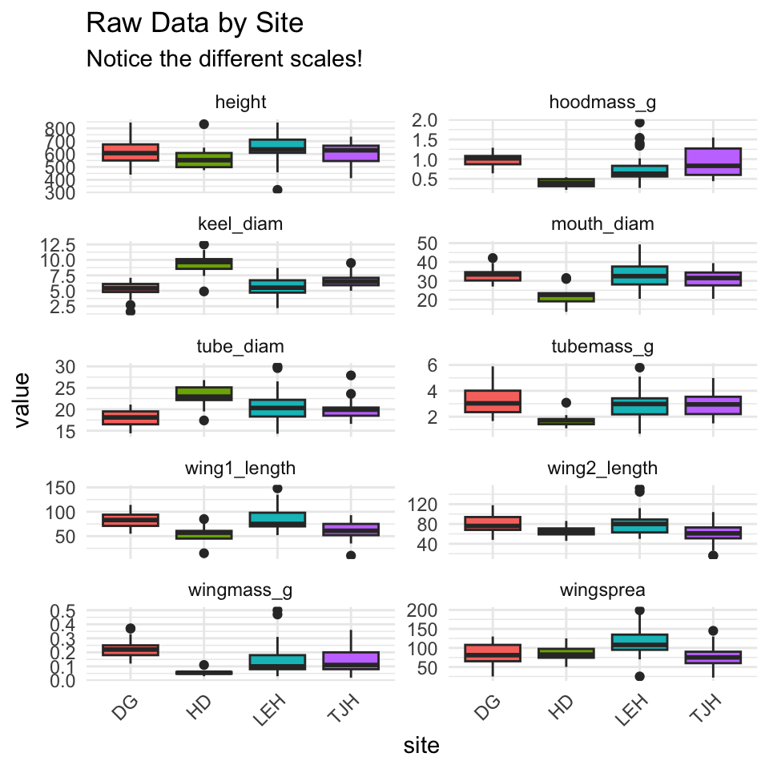
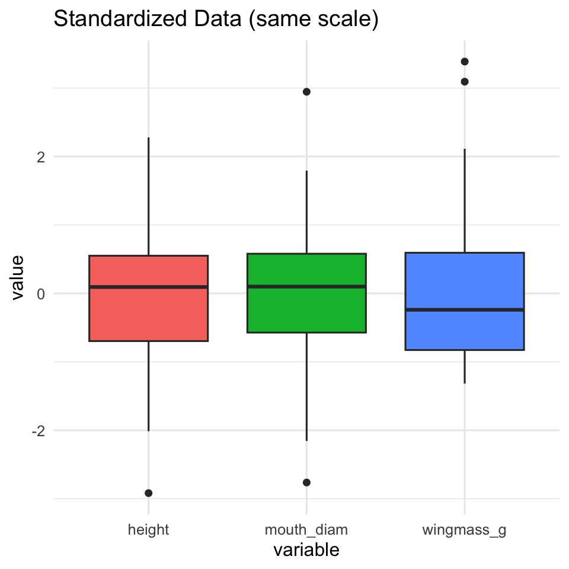
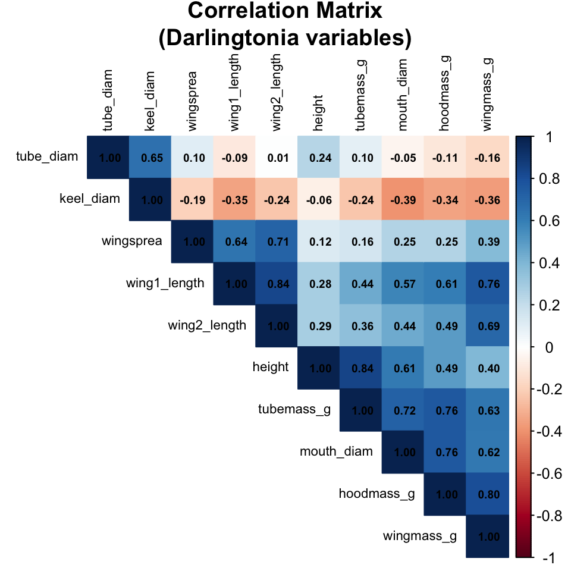
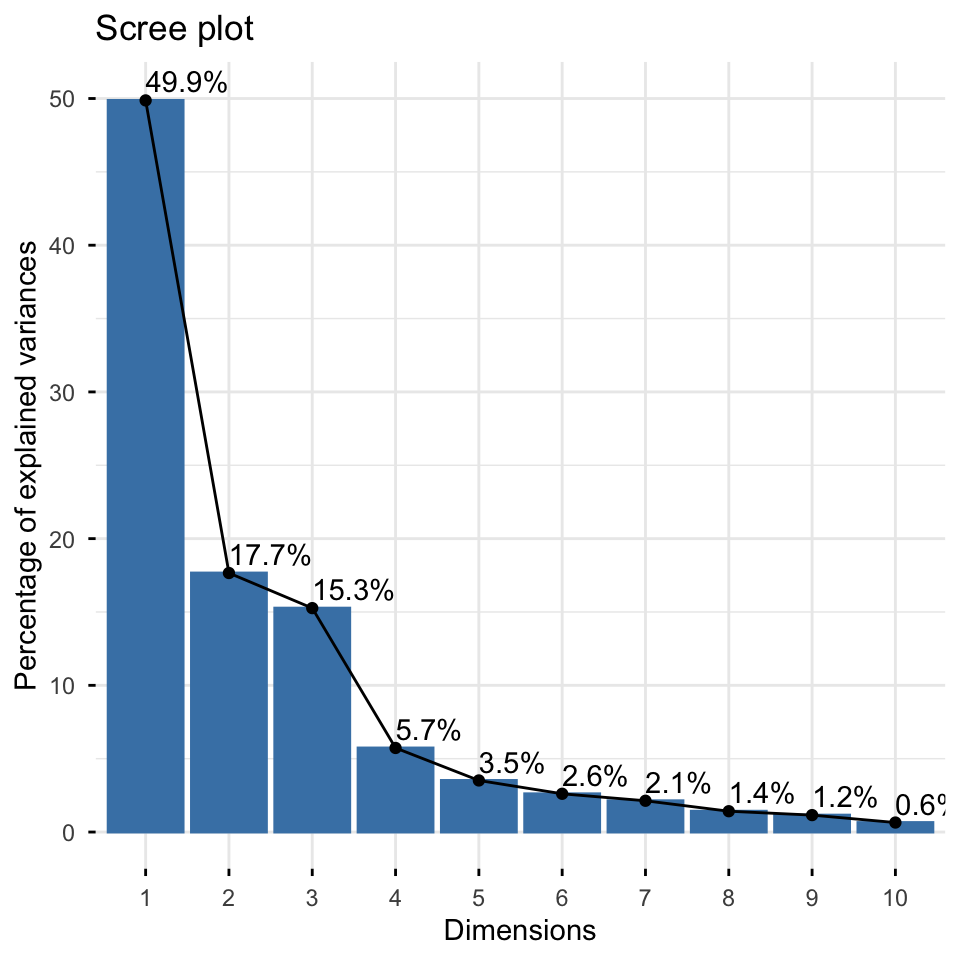
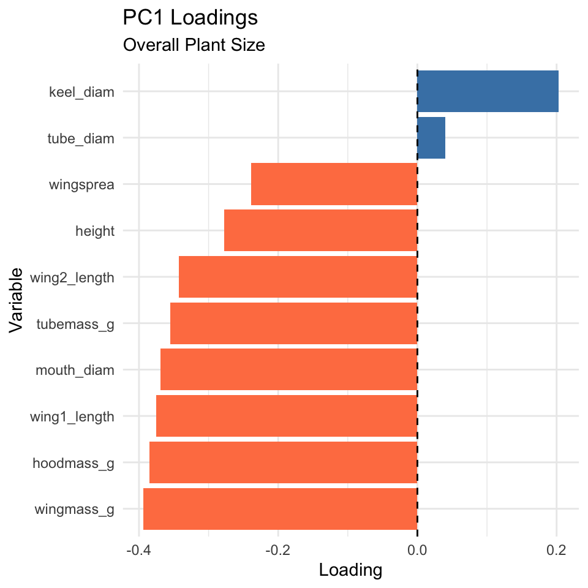
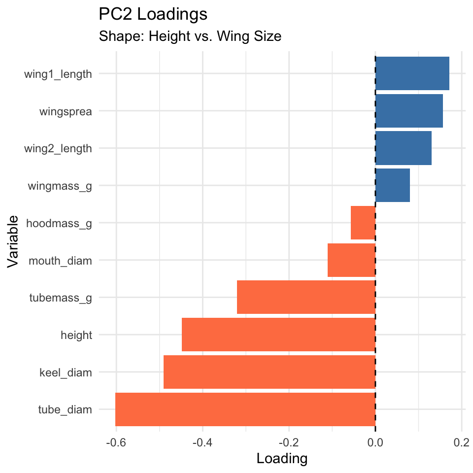
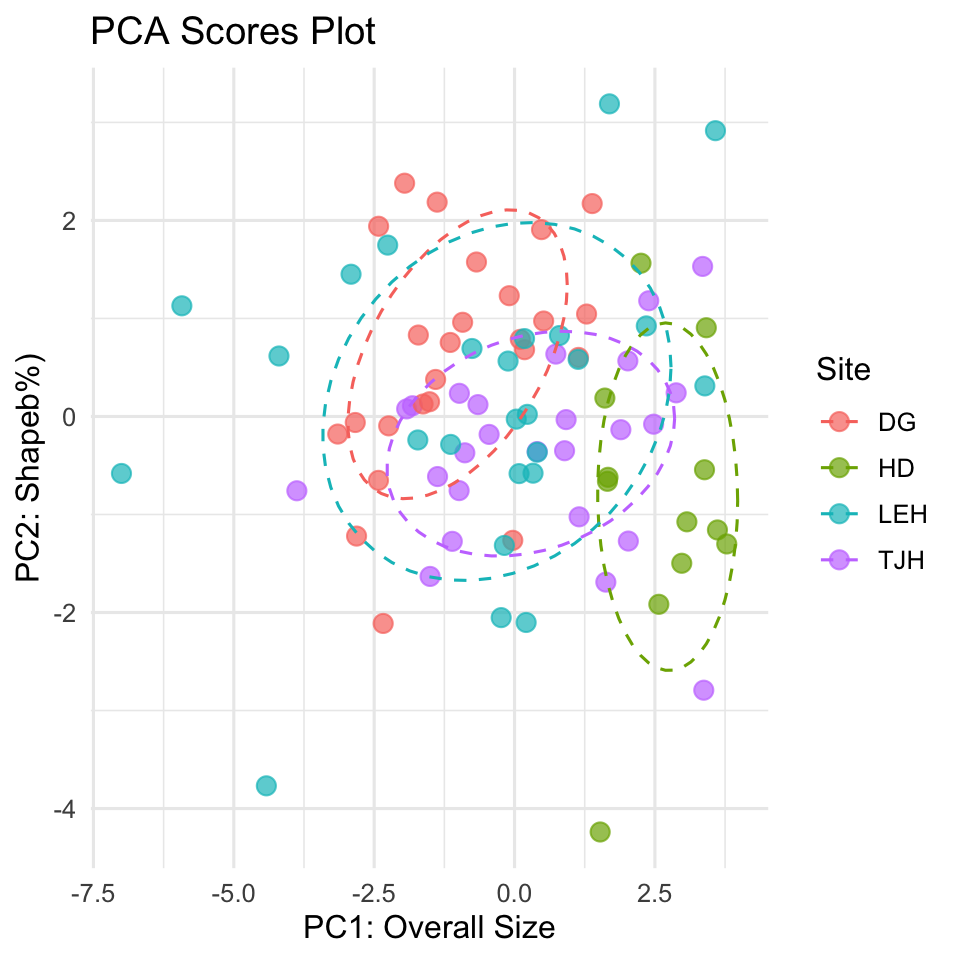
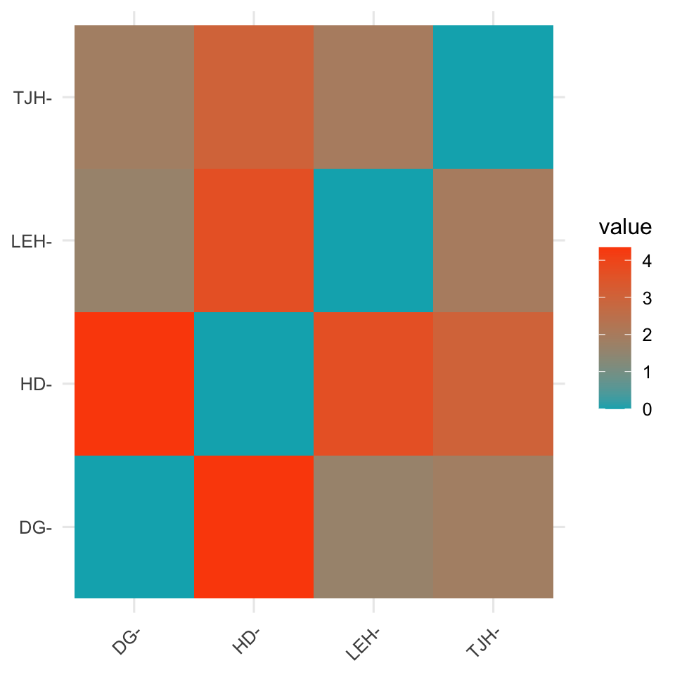

::: {.cell}

```{.r .cell-code}
# Load required packages
library(car)          # For ANOVA tests
library(emmeans)      # For estimated marginal means
library(psych)
library(vegan)
library(ggfortify)
library(corrplot)
library(FactoMineR)
library(factoextra)
library(ggrepel)
library(plotly)
library(broom)        # For model summaries
library(patchwork)    # For combining plots
library(janitor)      # For cleaning names
library(tidyverse)    # For data manipulation and visualization

# Set theme for all plots
theme_set(theme_minimal(base_size = 12))


# # Set options
# options(scipen = 999)
```
:::


# Lecture 16: PCA


::: {.cell}

```{.r .cell-code}
# read file
# Load the data
darlingtonia <- read_csv("darlingtonia.csv")
```

::: {.cell-output .cell-output-stderr}

```
Rows: 87 Columns: 11
── Column specification ────────────────────────────────────────────────────────
Delimiter: ","
chr  (1): site
dbl (10): height, mouth_diam, tube_diam, keel_diam, wing1_length, wing2_leng...

ℹ Use `spec()` to retrieve the full column specification for this data.
ℹ Specify the column types or set `show_col_types = FALSE` to quiet this message.
```


:::

```{.r .cell-code}
# View the structure
head(darlingtonia)
```

::: {.cell-output .cell-output-stdout}

```
# A tibble: 6 × 11
  site  height mouth_diam tube_diam keel_diam wing1_length wing2_length
  <chr>  <dbl>      <dbl>     <dbl>     <dbl>        <dbl>        <dbl>
1 TJH      654       38.4      16.6       6.4           85           76
2 TJH      413       22.2      17.2       5.9           55           26
3 TJH      610       31.2      19.9       6.7           62           60
4 TJH      546       34.4      20.8       6.3           84           79
5 TJH      665       30.5      20.4       6.6           60           51
6 TJH      665       33.6      19.5       6.6           84           66
# ℹ 4 more variables: wingsprea <dbl>, hoodmass_g <dbl>, tubemass_g <dbl>,
#   wingmass_g <dbl>
```


:::

```{.r .cell-code}
darlingtonia %>%
  count(site, name = "n_plants")
```

::: {.cell-output .cell-output-stdout}

```
# A tibble: 4 × 2
  site  n_plants
  <chr>    <int>
1 DG          25
2 HD          12
3 LEH         25
4 TJH         25
```


:::
:::


::: {.cell}

```{.r .cell-code}
# Create long format for easier plotting
darl_long <- darlingtonia %>%
  pivot_longer(cols = -site,
               names_to = "variable",
               values_to = "value")

# Box plots by site
ggplot(darl_long, aes(x = site, y = value, fill = site)) +
  geom_boxplot() +
  facet_wrap(~variable, scales = "free_y", ncol = 2) +
  theme_minimal() +
  theme(legend.position = "none",
        axis.text.x = element_text(angle = 45, hjust = 1)) +
  labs(title = "Raw Data by Site",
       subtitle = "Notice the different scales!")
```

::: {.cell-output-display}
{width=480}
:::
:::


::: {.cell}

```{.r .cell-code}
# Example: standardize height
darlingtonia %>% 
  group_by(site) %>% 
  summarize(
    mean_height = mean(height),
    sd_height = sd(height),
    mean_wingmass = mean(wingmass_g),
    sd_wingmass = sd(wingmass_g)
  )
```

::: {.cell-output .cell-output-stdout}

```
# A tibble: 4 × 5
  site  mean_height sd_height mean_wingmass sd_wingmass
  <chr>       <dbl>     <dbl>         <dbl>       <dbl>
1 DG           619.     101.         0.225       0.0682
2 HD           574.     101.         0.0567      0.0202
3 LEH          638.     115.         0.151       0.122 
4 TJH          610.      82.0        0.134       0.0853
```


:::

```{.r .cell-code}
# After standardization, both will have:
# mean = 0, sd = 1
```
:::


::: {.cell}

```{.r .cell-code}
# Select only numeric variables for PCA
darl_numeric <- darlingtonia %>%
  dplyr::select(-site)

# Standardize using scale()
# This centers (mean=0) and scales (sd=1) each variable
darl_scaled <- scale(darl_numeric)

darl_scaled_df  <- as.data.frame(darl_scaled)

darl_scaled_df %>%
  select(height, mouth_diam, wingmass_g) %>%
  pivot_longer(cols = c(height, mouth_diam, wingmass_g) , names_to = "variable", values_to = "value") %>%
  ggplot(aes(x = variable, y = value, fill  = variable)) +
  geom_boxplot() +
  labs(title = "Standardized Data (same scale)") +
  theme(legend.position = "none")
```

::: {.cell-output-display}
{width=480}
:::
:::


::: {.cell}

```{.r .cell-code}
# Calculate correlation matrix
cor_matrix <- cor(darl_numeric)

# Visualize with corrplot
corrplot(cor_matrix, 
         method = "color",
         type = "upper",
         order = "hclust",
         tl.col = "black",
         tl.cex = 0.7,
         addCoef.col = "black",
         number.cex = 0.6,
         title = "Correlation Matrix\n(Darlingtonia variables)",
         mar = c(0,0,2,0))
```

::: {.cell-output-display}
{width=480}
:::
:::


::: {.cell}

```{.r .cell-code}
# Calculate correlation matrix
cor_matrix <- cor(darl_numeric)

# Display rounded values
round(cor_matrix, 2)
```

::: {.cell-output .cell-output-stdout}

```
             height mouth_diam tube_diam keel_diam wing1_length wing2_length
height         1.00       0.61      0.24     -0.06         0.28         0.29
mouth_diam     0.61       1.00     -0.05     -0.39         0.57         0.44
tube_diam      0.24      -0.05      1.00      0.65        -0.09         0.01
keel_diam     -0.06      -0.39      0.65      1.00        -0.35        -0.24
wing1_length   0.28       0.57     -0.09     -0.35         1.00         0.84
wing2_length   0.29       0.44      0.01     -0.24         0.84         1.00
wingsprea      0.12       0.25      0.10     -0.19         0.64         0.71
hoodmass_g     0.49       0.76     -0.11     -0.34         0.61         0.49
tubemass_g     0.84       0.72      0.10     -0.24         0.44         0.36
wingmass_g     0.40       0.62     -0.16     -0.36         0.76         0.69
             wingsprea hoodmass_g tubemass_g wingmass_g
height            0.12       0.49       0.84       0.40
mouth_diam        0.25       0.76       0.72       0.62
tube_diam         0.10      -0.11       0.10      -0.16
keel_diam        -0.19      -0.34      -0.24      -0.36
wing1_length      0.64       0.61       0.44       0.76
wing2_length      0.71       0.49       0.36       0.69
wingsprea         1.00       0.25       0.16       0.39
hoodmass_g        0.25       1.00       0.76       0.80
tubemass_g        0.16       0.76       1.00       0.63
wingmass_g        0.39       0.80       0.63       1.00
```


:::
:::


::: {.cell}

```{.r .cell-code}
# Perform PCA using prcomp()
# center = TRUE: center variables (mean = 0)
# scale. = TRUE: scale variables (sd = 1)
pca_result <- prcomp(darl_numeric, 
                     center = TRUE, 
                     scale = TRUE)


# View summary
summary(pca_result)
```

::: {.cell-output .cell-output-stdout}

```
Importance of components:
                          PC1    PC2    PC3     PC4     PC5     PC6     PC7
Standard deviation     2.2332 1.3288 1.2354 0.75701 0.59301 0.51062 0.46177
Proportion of Variance 0.4987 0.1766 0.1526 0.05731 0.03517 0.02607 0.02132
Cumulative Proportion  0.4987 0.6753 0.8279 0.88521 0.92038 0.94645 0.96777
                          PC8     PC9    PC10
Standard deviation     0.3768 0.33982 0.25457
Proportion of Variance 0.0142 0.01155 0.00648
Cumulative Proportion  0.9820 0.99352 1.00000
```


:::
:::


::: {.cell}

```{.r .cell-code}
# Create scree plot
fviz_eig(pca_result, 
         addlabels = TRUE, 
         ylim = c(0, 50))
```

::: {.cell-output-display}
{width=480}
:::
:::


::: {.cell}

```{.r .cell-code}
# View loadings for first 3 PCs
loadings <- pca_result$rotation[, 1:3]
round(loadings, 3)
```

::: {.cell-output .cell-output-stdout}

```
                PC1    PC2    PC3
height       -0.278 -0.449  0.198
mouth_diam   -0.369 -0.110  0.214
tube_diam     0.040 -0.602 -0.390
keel_diam     0.202 -0.491 -0.328
wing1_length -0.375  0.171 -0.280
wing2_length -0.342  0.131 -0.415
wingsprea    -0.239  0.156 -0.549
hoodmass_g   -0.385 -0.057  0.185
tubemass_g   -0.355 -0.320  0.263
wingmass_g   -0.393  0.080 -0.007
```


:::
:::


::: {.cell}

```{.r .cell-code}
pc1_loads <- tibble(
  Variable = rownames(pca_result$rotation),
  Loading = pca_result$rotation[, 1]) %>%
  arrange(desc(abs(Loading)))
pc1_loads
```

::: {.cell-output .cell-output-stdout}

```
# A tibble: 10 × 2
   Variable     Loading
   <chr>          <dbl>
 1 wingmass_g   -0.393 
 2 hoodmass_g   -0.385 
 3 wing1_length -0.375 
 4 mouth_diam   -0.369 
 5 tubemass_g   -0.355 
 6 wing2_length -0.342 
 7 height       -0.278 
 8 wingsprea    -0.239 
 9 keel_diam     0.202 
10 tube_diam     0.0402
```


:::
:::


::: {.cell}

```{.r .cell-code}
# Visualize PC1 loadings
pc1_loads %>%
  ggplot(aes(x = reorder(Variable, Loading), y = Loading)) +
  geom_col(aes(fill = Loading > 0), show.legend = FALSE) +
  coord_flip() +
  geom_hline(yintercept = 0, linetype = "dashed") +
  labs(title = "PC1 Loadings",
       subtitle = "Overall Plant Size",
       x = "Variable",
       y = "Loading") +
  scale_fill_manual(values = c("FALSE" = "coral", "TRUE" = "steelblue")) +
  theme_minimal()
```

::: {.cell-output-display}
{width=480}
:::
:::


::: {.cell}

```{.r .cell-code}
pc2_loads <- tibble(
  Variable = rownames(pca_result$rotation),
  Loading = pca_result$rotation[, 2]
) %>%
  arrange(desc(abs(Loading)))

pc2_loads
```

::: {.cell-output .cell-output-stdout}

```
# A tibble: 10 × 2
   Variable     Loading
   <chr>          <dbl>
 1 tube_diam    -0.602 
 2 keel_diam    -0.491 
 3 height       -0.449 
 4 tubemass_g   -0.320 
 5 wing1_length  0.171 
 6 wingsprea     0.156 
 7 wing2_length  0.131 
 8 mouth_diam   -0.110 
 9 wingmass_g    0.0800
10 hoodmass_g   -0.0575
```


:::
:::


::: {.cell}

```{.r .cell-code}
# Visualize PC2 loadings
pc2_loads %>%
  ggplot(aes(x = reorder(Variable, Loading), y = Loading)) +
  geom_col(aes(fill = Loading > 0), show.legend = FALSE) +
  coord_flip() +
  geom_hline(yintercept = 0, linetype = "dashed") +
  labs(title = "PC2 Loadings",
       subtitle = "Shape: Height vs. Wing Size",
       x = "Variable",
       y = "Loading") +
  scale_fill_manual(values = c("FALSE" = "coral", "TRUE" = "steelblue")) +
  theme_minimal()
```

::: {.cell-output-display}
{width=480}
:::
:::


::: {.cell}

```{.r .cell-code}
# PC scores are in pca_result$x
pc_scores <- as_tibble(pca_result$x) %>%
  mutate(site = darlingtonia$site,
         plant_id = 1:n())

# First few plants
pc_scores %>%
  select(plant_id, site, PC1, PC2, PC3) %>%
  head(10)
```

::: {.cell-output .cell-output-stdout}

```
# A tibble: 10 × 5
   plant_id site     PC1     PC2    PC3
      <int> <chr>  <dbl>   <dbl>  <dbl>
 1        1 TJH   -1.92   0.0772  1.53 
 2        2 TJH    3.35   1.53    0.755
 3        3 TJH    0.918 -0.0320  0.248
 4        4 TJH   -0.983  0.236  -0.242
 5        5 TJH    1.15  -1.02    1.54 
 6        6 TJH   -1.37  -0.613   0.847
 7        7 TJH   -1.50  -1.63    0.693
 8        8 TJH   -0.651  0.121  -0.412
 9        9 TJH    2.48  -0.0786 -0.260
10       10 TJH   -1.11  -1.27    2.27 
```


:::
:::


::: {.cell}

```{.r .cell-code}
# Basic scores plot
ggplot(pc_scores, aes(x = PC1, y = PC2, color = site)) +
  geom_point(size = 3, alpha = 0.7) +
  stat_ellipse(level = 0.68, linetype = 2) +
  labs(title = "PCA Scores Plot",
       x = paste0("PC1: Overall Size"),
       y = paste0("PC2: Shapeb%)"),
       color = "Site") +
  theme_minimal(base_size = 12) +
  theme(legend.position = "right")
```

::: {.cell-output-display}
{width=480}
:::
:::


::: {.cell}

```{.r .cell-code}
pc_data <- as.data.frame(pca_result$x) %>%
  mutate(site = darlingtonia$site)

plot_ly(pc_data, 
        x = ~PC1, y = ~PC2, z = ~PC3,
        color = ~site,
        type = "scatter3d",
        mode = "markers") %>%
  layout(scene = list(
    xaxis = list(title = "PC1"),
    yaxis = list(title = "PC2"),
    zaxis = list(title = "PC3")
  ))
```

::: {.cell-output-display}

```{=html}
<div class="plotly html-widget html-fill-item" id="htmlwidget-998397dc01a3f19b118d" style="width:100%;height:650px;"></div>
<script type="application/json" data-for="htmlwidget-998397dc01a3f19b118d">{"x":{"visdat":{"141d31b46f5ba":["function () ","plotlyVisDat"]},"cur_data":"141d31b46f5ba","attrs":{"141d31b46f5ba":{"x":{},"y":{},"z":{},"mode":"markers","color":{},"alpha_stroke":1,"sizes":[10,100],"spans":[1,20],"type":"scatter3d"}},"layout":{"margin":{"b":40,"l":60,"t":25,"r":10},"scene":{"xaxis":{"title":"PC1"},"yaxis":{"title":"PC2"},"zaxis":{"title":"PC3"}},"hovermode":"closest","showlegend":true},"source":"A","config":{"modeBarButtonsToAdd":["hoverclosest","hovercompare"],"showSendToCloud":false},"data":[{"x":[-2.2417084302101471,-3.1488111996745194,-0.031357247571229777,-1.629226205483864,0.17864887947362329,-2.8137205962749716,-1.5136271507468295,0.48047835290602409,-2.4235581558893076,-2.4207859653813832,-1.7134269393451564,-2.836543931789175,1.2828622649504529,-0.67781996575422787,-2.3395163552335601,-1.9577431510255812,1.1390722661876604,-1.1455578611843447,-1.3783995382486087,0.10266145762430659,0.51843584966760059,1.3830217303046743,-0.094323016367073104,-0.92431846827749786,-1.4055358982329349],"y":[-0.09583126511955524,-0.17938019412960229,-1.2637405550382301,0.12719197448843936,0.68120234770657284,-1.2201747859334831,0.15017946717123248,1.9063329825517352,-0.65192516841892734,1.9405292592885268,0.83075710209431686,-0.061505549807052806,1.0450338094306302,1.575728764276918,-2.111589479608059,2.3799587171442398,0.60251064373720209,0.75510383660089508,2.186558546903056,0.78706210460312631,0.9738371677156481,2.1720231459760204,1.2321344985110778,0.9609507941585228,0.37764596968802638],"z":[0.098742836455033053,-1.034346133503032,2.0761936135999326,0.74632879266233787,0.41890583932227732,-0.30478111450845841,0.44104000807534677,-0.81898748834020418,1.5251514698526025,-0.49142084414175274,-0.23363784478466745,-0.040276923734023376,-0.72612091951923852,-0.83338789604054175,2.8846790041299251,0.56426987795404071,-0.50888350106630131,0.18713023961205363,1.4029812725704285,1.3836929474690494,1.23050024494273,2.2340039565314482,0.91352421351709834,1.6198246243563499,0.8148089638927386],"mode":"markers","type":"scatter3d","name":"DG","marker":{"color":"rgba(102,194,165,1)","line":{"color":"rgba(102,194,165,1)"}},"textfont":{"color":"rgba(102,194,165,1)"},"error_y":{"color":"rgba(102,194,165,1)"},"error_x":{"color":"rgba(102,194,165,1)"},"line":{"color":"rgba(102,194,165,1)"},"frame":null},{"x":[3.0695543372075611,2.5698291790774679,3.4152914347624499,1.5250888497266184,1.6546722227528461,3.6137024574162826,1.6087835605716005,2.9781234964510683,3.3834367255909426,3.7796218062665554,1.664711961337906,2.2522500324053358],"y":[-1.0747707829442734,-1.916299100291202,0.90516782805261708,-4.2391205309431097,-0.66142974558611312,-1.1577323280075973,0.1877317931392771,-1.4975315584230366,-0.54356104351226175,-1.3005775081041901,-0.6206374277052199,1.5636573250450552],"z":[-1.3691542016650271,-1.4902359590376695,-0.84073587601482735,-0.43420286112158585,-2.5204942170235283,-2.9843543192027706,-2.4998667474295142,-1.3830146500820601,-1.4497714496960936,0.46288596754746492,-0.68468238939608272,0.065482850202376333],"mode":"markers","type":"scatter3d","name":"HD","marker":{"color":"rgba(252,141,98,1)","line":{"color":"rgba(252,141,98,1)"}},"textfont":{"color":"rgba(252,141,98,1)"},"error_y":{"color":"rgba(252,141,98,1)"},"error_x":{"color":"rgba(252,141,98,1)"},"line":{"color":"rgba(252,141,98,1)"},"frame":null},{"x":[3.3893861534747325,0.32951405185554217,0.080752236782147227,-2.25927531678219,-2.9118986242159339,-1.7227211355727985,0.030878093641676787,0.7999834169250537,-0.18106883719102101,-1.1378224537895201,-0.11528437599363446,0.20649941380454398,3.5783094953764873,0.40358824121884163,1.1328890334867501,1.6902086874735263,-0.23799959809853669,2.3465745379848815,0.17780660427383924,-0.7578615384730174,0.22733493991378573,-4.1956970001066161,-5.9251916806860763,-7.0006379895354138,-4.4201288004318666],"y":[0.31187931289457943,-0.57846014965785786,-0.58292140027887596,1.7483418286793233,1.4511768294798169,-0.23976890403647311,-0.027181811234005527,0.82575778335349559,-1.3156607250662957,-0.28511180925329765,0.5652689262401247,-2.1016207483400065,2.9157078187512524,-0.36433496097997536,0.58249871502575845,3.1893384058039476,-2.0520950294853235,0.92397660743579124,0.79459254413788183,0.69339765095368933,0.021499730336819046,0.61700649686652842,1.1290868542094119,-0.58144928437060617,-3.7682581555512771],"z":[0.29110352965563191,0.62313754959789958,1.4972708501513399,-0.62260520991658341,-1.5334043272083977,0.76303017903470904,1.5970137288248001,0.47311858257850542,-1.9360968667375285,-0.3080653560327557,-0.71780570926704468,-0.30165404405928603,-0.14834176675419605,-0.38756479256775239,-1.5089943923020748,0.23138974544181987,-1.4989137648530448,-1.271537290404636,-1.0987584815992129,-1.1516321867704016,-1.1530050289500637,0.26291950309547796,-3.1047473327126514,-2.0740832353846144,-0.80305585146951075],"mode":"markers","type":"scatter3d","name":"LEH","marker":{"color":"rgba(141,160,203,1)","line":{"color":"rgba(141,160,203,1)"}},"textfont":{"color":"rgba(141,160,203,1)"},"error_y":{"color":"rgba(141,160,203,1)"},"error_x":{"color":"rgba(141,160,203,1)"},"line":{"color":"rgba(141,160,203,1)"},"frame":null},{"x":[-1.9215219426413912,3.3499988030811836,0.91827709837975502,-0.98257870519661428,1.1500885487363428,-1.3714136655991702,-1.5044504781464787,-0.65128080835888069,2.4769129137958559,-1.1086700213034903,2.8785450826012284,-1.8186796099754226,-3.8769412473540279,-0.98706777065364215,0.89125024275521114,2.3898893935763699,-0.88544150326496052,0.7355665825724641,1.8933598123170239,0.40339776062422567,-0.45273522722207948,1.6260513886731713,3.3702739742634948,2.0179804628088385,2.0267845722053019],"y":[0.077198456418082428,1.5308406216093509,-0.032013230717069546,0.23616046666696494,-1.0237391318751694,-0.61295599331081574,-1.6319655460983491,0.12102596107119343,-0.078642920265714816,-1.2739075321409794,0.24118629629930766,0.10930924058571079,-0.75802845023592647,-0.75638619559834408,-0.34953006493302008,1.1803608638928484,-0.37077628525753165,0.63643038793810947,-0.13498245826379696,-0.35793578837779866,-0.18311125105099926,-1.6899541093453001,-2.792649991926734,0.56695837770330837,-1.2710493034129666],"z":[1.5264877253014526,0.75470164647235638,0.24750403494827142,-0.24238412638514892,1.5372036163838703,0.84661071258278875,0.69262951931477945,-0.41170574097695545,-0.26039969437698463,2.270291384348829,0.81350601338027162,-0.54076718980083704,-0.24119783839284614,1.5041223875831562,1.3644732863094269,1.4471270444656921,1.1607980074510724,-0.86373545579863853,0.12636711095476841,0.64144935990648644,0.30557502071889925,0.025175590948726984,1.7186316449569992,-0.53991037678088316,1.5769368987081724],"mode":"markers","type":"scatter3d","name":"TJH","marker":{"color":"rgba(231,138,195,1)","line":{"color":"rgba(231,138,195,1)"}},"textfont":{"color":"rgba(231,138,195,1)"},"error_y":{"color":"rgba(231,138,195,1)"},"error_x":{"color":"rgba(231,138,195,1)"},"line":{"color":"rgba(231,138,195,1)"},"frame":null}],"highlight":{"on":"plotly_click","persistent":false,"dynamic":false,"selectize":false,"opacityDim":0.20000000000000001,"selected":{"opacity":1},"debounce":0},"shinyEvents":["plotly_hover","plotly_click","plotly_selected","plotly_relayout","plotly_brushed","plotly_brushing","plotly_clickannotation","plotly_doubleclick","plotly_deselect","plotly_afterplot","plotly_sunburstclick"],"base_url":"https://plot.ly"},"evals":[],"jsHooks":[]}</script>
```

:::
:::


::: {.cell}

```{.r .cell-code}
# 1. Prepare PC Scores with Site
pc_scores_for_dist <- as.data.frame(pca_result$x) %>%
  mutate(site = darlingtonia$site)

# 2. Calculate the mean PC scores for each site (the site "centroids")
site_centroids <- pc_scores_for_dist %>%
  group_by(site) %>%
  summarise(across(starts_with("PC"), mean)) %>%
  ungroup()

# 3. Set site names as row names BEFORE calculating distances
site_centroids_matrix <- site_centroids %>%
  column_to_rownames("site")  # This keeps site names as row names

# 4. Calculate the Euclidean distance matrix between site centroids
dist_matrix <- dist(site_centroids_matrix, method = "euclidean")

# Display the distance matrix
dist_matrix
```

::: {.cell-output .cell-output-stdout}

```
          DG       HD      LEH
HD  4.346434                  
LEH 1.621198 3.659711         
TJH 1.843120 3.021386 1.960547
```


:::

```{.r .cell-code}
# Visualize the distance matrix
fviz_dist(dist_matrix, 
          gradient = list(low = "#00AFBB", high = "#FC4E07"))
```

::: {.cell-output-display}
{width=480}
:::
:::
