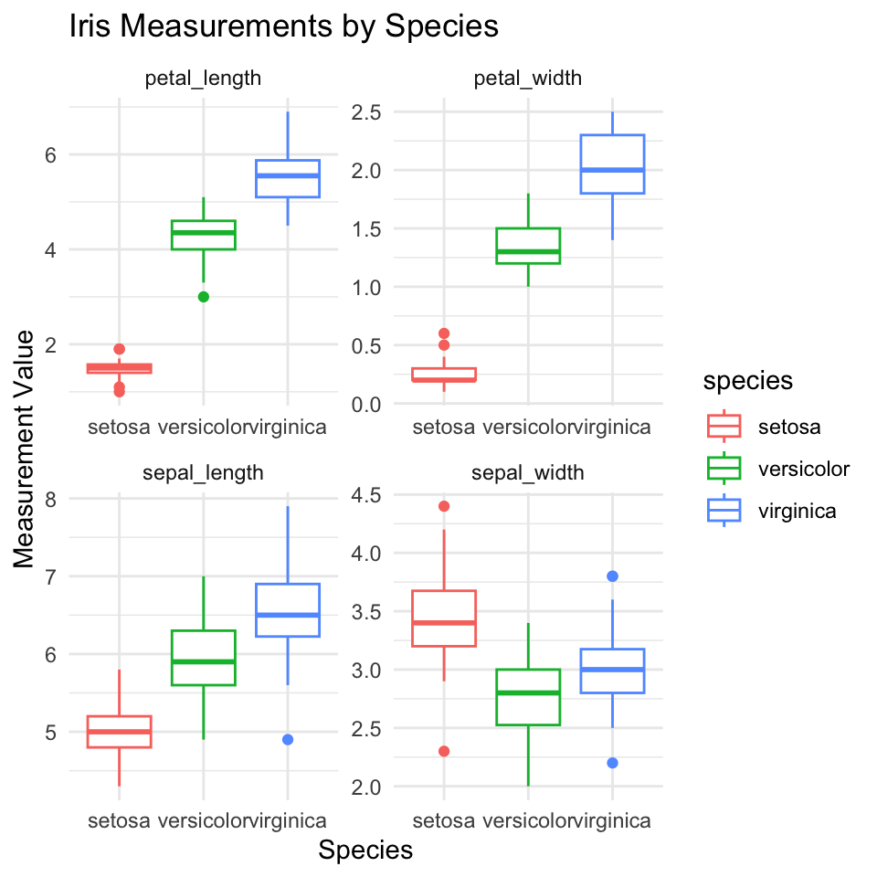
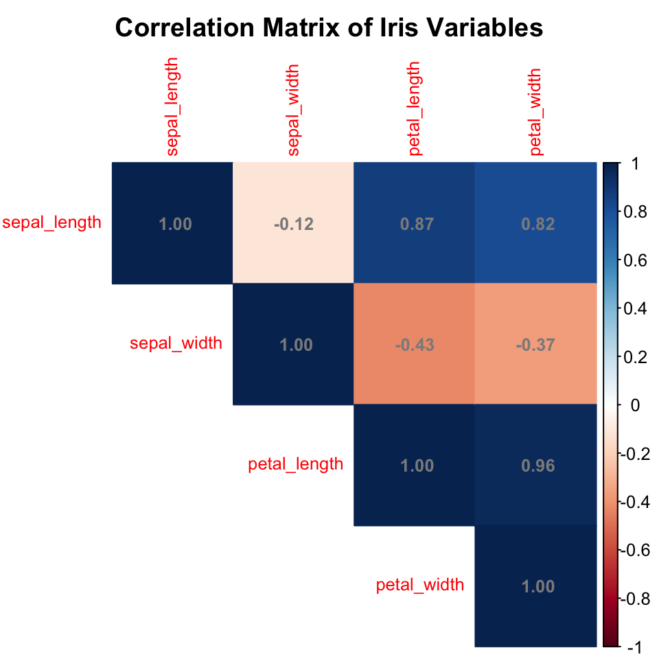
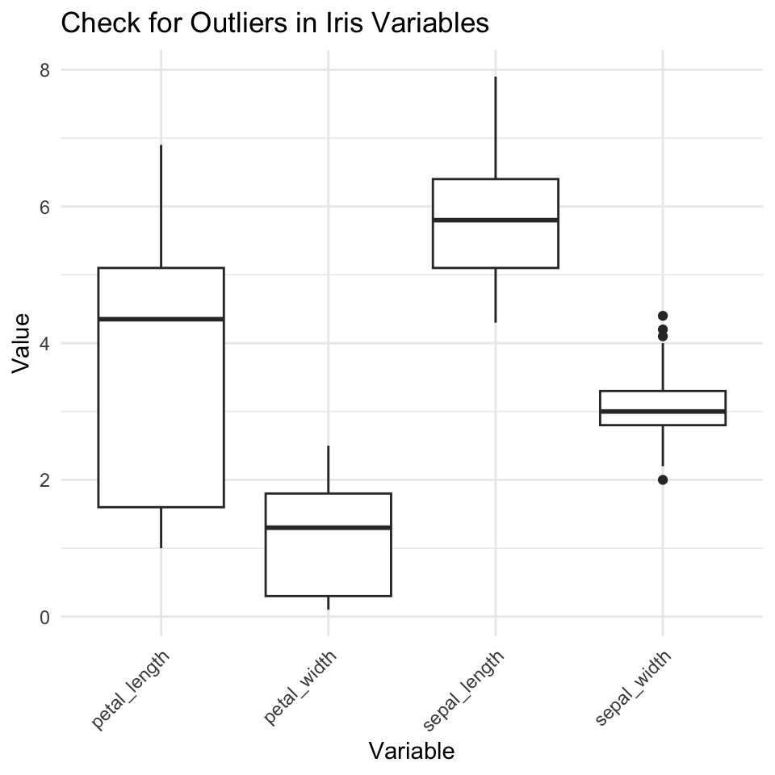
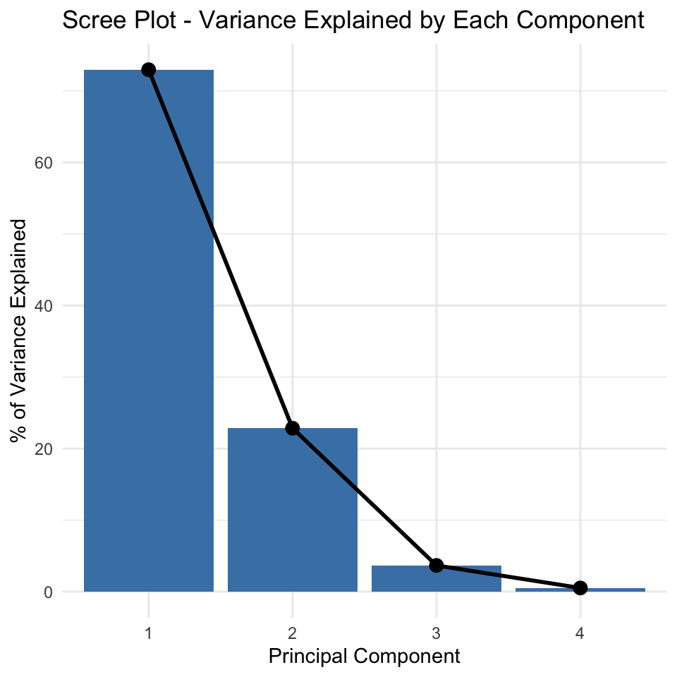
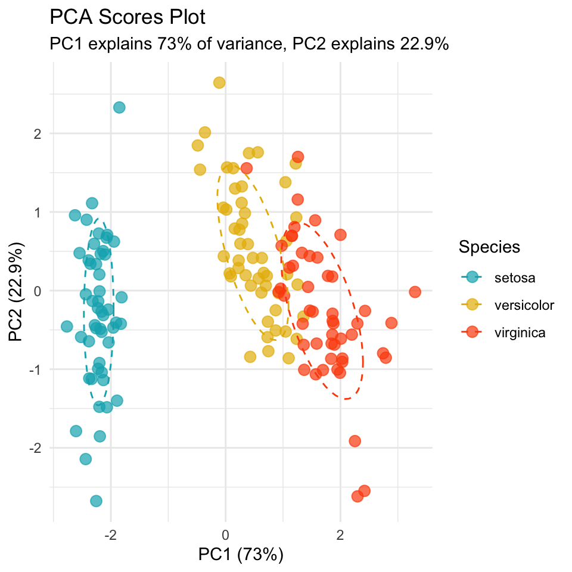
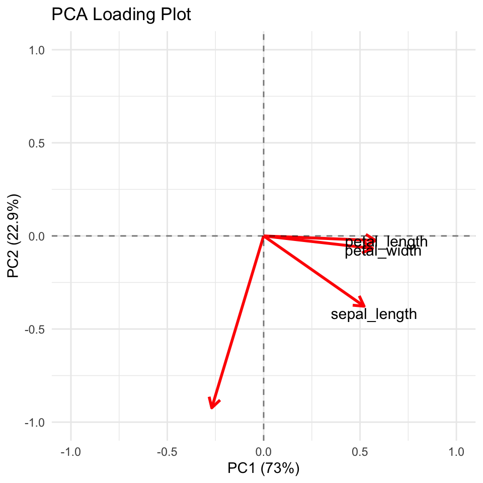
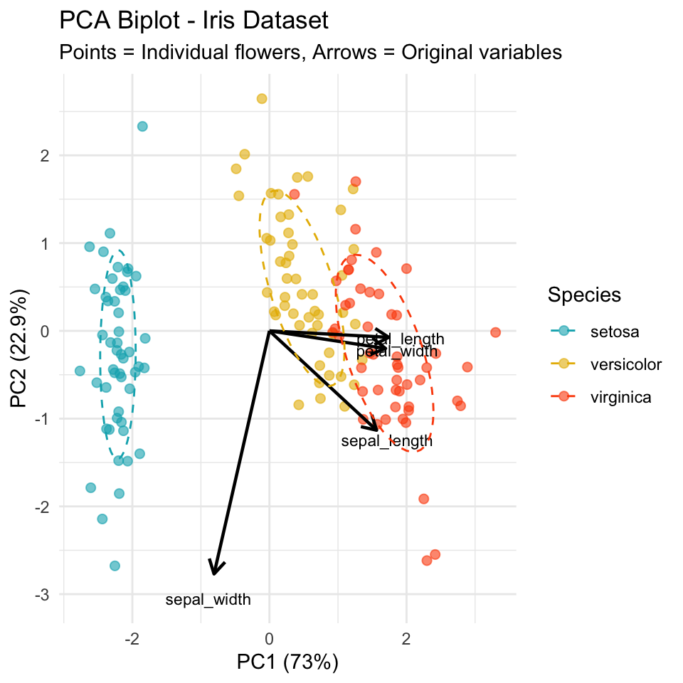

# Lecture 17: Principal Component Analysis (PCA)

## What is PCA?

PCA (Principal Component Analysis) is a technique to: - Reduce the number of variables in your dataset - Find patterns in high-dimensional data - Create new uncorrelated variables (principal components) from correlated original variables - Visualize complex relationships in multivariate data

## When to Use PCA

Use PCA when you have: - **Multiple continuous variables** that may be correlated - **Too many variables** to analyze or visualize easily - **Need to reduce dimensionality** while retaining most information - **Want to explore patterns** in multivariate data

## Key Assumptions of PCA

1.  **Linear relationships** between variables
2.  **No extreme outliers** (can distort results)
3.  **Variables should be correlated** (if not, PCA won't reduce dimensions effectively)
4.  **Adequate sample size** (generally n \> 50)
5.  **Consider standardization** when variables have different scales

::: {.callout-important appearance="simple"}
## Critical First Step

Always **standardize your data** when variables are measured on different scales. This prevents variables with larger values from dominating the analysis.
:::

# Part 1: Iris Data Analysis

## Data Overview

We'll analyze the famous iris dataset with measurements from three species: - *Iris setosa* - *Iris versicolor* - *Iris virginica*

Each flower has 4 measurements: sepal length, sepal width, petal length, and petal width.


::: {.cell}

```{.r .cell-code}
# Load the iris dataset from CSV
iris_df <- read.csv("data/iris.csv") %>% 
  clean_names() %>% 
  mutate(ind = row_number()) %>% 
  mutate(species_ind = paste(species, ind, sep="_"))

# View data structure
head(iris_df)
```

::: {.cell-output .cell-output-stdout}

```
  sepal_length sepal_width petal_length petal_width species ind species_ind
1          5.1         3.5          1.4         0.2  setosa   1    setosa_1
2          4.9         3.0          1.4         0.2  setosa   2    setosa_2
3          4.7         3.2          1.3         0.2  setosa   3    setosa_3
4          4.6         3.1          1.5         0.2  setosa   4    setosa_4
5          5.0         3.6          1.4         0.2  setosa   5    setosa_5
6          5.4         3.9          1.7         0.4  setosa   6    setosa_6
```


:::

```{.r .cell-code}
# Get numeric values only for PCA
iris_data_df <- iris_df %>% 
  dplyr::select(sepal_length, sepal_width, petal_length, petal_width)

# Keep species info for later
iris_species_df <- iris_df %>% 
  dplyr::select(species, ind, species_ind)
```
:::


::: {.cell}

```{.r .cell-code}
# Create long format for visualization
iris_long_df <- iris_df %>%
  pivot_longer(
    cols = c(sepal_length, sepal_width, petal_length, petal_width),
    names_to = "variable",
    values_to = "values"
  )

# Overview plot
overview_plot <- iris_long_df %>% 
  ggplot(aes(species, values, color = species)) + 
  geom_boxplot() +
  facet_wrap(~variable, scales = "free") +
  labs(title = "Iris Measurements by Species",
       x = "Species",
       y = "Measurement Value") +
  theme_minimal()

overview_plot
```

::: {.cell-output-display}
{width=480}
:::
:::


## Step 1: Check PCA Assumptions

### Check Correlations


::: {.cell}

```{.r .cell-code}
# Calculate correlation matrix
cor_matrix <- cor(iris_data_df)

# Display correlation matrix
cor_matrix
```

::: {.cell-output .cell-output-stdout}

```
             sepal_length sepal_width petal_length petal_width
sepal_length    1.0000000  -0.1175698    0.8717538   0.8179411
sepal_width    -0.1175698   1.0000000   -0.4284401  -0.3661259
petal_length    0.8717538  -0.4284401    1.0000000   0.9628654
petal_width     0.8179411  -0.3661259    0.9628654   1.0000000
```


:::
:::


::: {.cell}

```{.r .cell-code}
# Visualize correlations
corrplot(cor_matrix, method = "color", type = "upper", 
         addCoef.col = "grey55", tl.cex = 0.8, number.cex = 0.8,
         title = "Correlation Matrix of Iris Variables",
         mar = c(0, 0, 2, 0))
```

::: {.cell-output-display}
{width=480}
:::
:::


### Check for Outliers


::: {.cell}

```{.r .cell-code}
# Create boxplots to check for outliers
outlier_plot <- iris_data_df %>% 
  pivot_longer(everything(), names_to = "variable", values_to = "value") %>% 
  ggplot(aes(x = variable, y = value)) +
  geom_boxplot() +
  labs(title = "Check for Outliers in Iris Variables",
       x = "Variable", 
       y = "Value") +
  theme_minimal() +
  theme(axis.text.x = element_text(angle = 45, hjust = 1))

outlier_plot
```

::: {.cell-output-display}
{width=480}
:::
:::


## Step 2: Standardize the Data

Since our variables have different scales (e.g., petal width ranges 0.1-2.5 while sepal length ranges 4-8), we need to standardize.


::: {.cell}

```{.r .cell-code}
# Standardize the data (mean = 0, sd = 1)
iris_scaled <- scale(iris_data_df)

# Convert back to data frame
iris_scaled_df <- as.data.frame(iris_scaled)

# Check standardization worked
colMeans(iris_scaled_df)
```

::: {.cell-output .cell-output-stdout}

```
 sepal_length   sepal_width  petal_length   petal_width 
-1.457168e-15 -1.638319e-15 -1.292300e-15 -5.543714e-16 
```


:::

```{.r .cell-code}
apply(iris_scaled_df, 2, sd)
```

::: {.cell-output .cell-output-stdout}

```
sepal_length  sepal_width petal_length  petal_width 
           1            1            1            1 
```


:::
:::


## Step 3: Perform PCA


::: {.cell}

```{.r .cell-code}
# Run PCA on standardized data
iris_pca_model <- prcomp(iris_scaled, center = FALSE, scale. = FALSE)

# View PCA summary
summary(iris_pca_model)
```

::: {.cell-output .cell-output-stdout}

```
Importance of components:
                          PC1    PC2     PC3     PC4
Standard deviation     1.7084 0.9560 0.38309 0.14393
Proportion of Variance 0.7296 0.2285 0.03669 0.00518
Cumulative Proportion  0.7296 0.9581 0.99482 1.00000
```


:::
:::


## Step 4: Extract and Understand Results

### Eigenvalues and Variance Explained


::: {.cell}

```{.r .cell-code}
# Extract eigenvalues
eigenvalues <- iris_pca_model$sdev^2
prop_variance <- eigenvalues / sum(eigenvalues)
cumsum_variance <- cumsum(prop_variance)

# Create summary table
pca_summary_df <- data.frame(
  Component = paste0("PC", 1:length(eigenvalues)),
  Eigenvalue = eigenvalues,
  Prop_Variance = prop_variance,
  Cumsum_Variance = cumsum_variance
)

pca_summary_df
```

::: {.cell-output .cell-output-stdout}

```
  Component Eigenvalue Prop_Variance Cumsum_Variance
1       PC1 2.91849782   0.729624454       0.7296245
2       PC2 0.91403047   0.228507618       0.9581321
3       PC3 0.14675688   0.036689219       0.9948213
4       PC4 0.02071484   0.005178709       1.0000000
```


:::
:::


### Component Loadings


::: {.cell}

```{.r .cell-code}
# Extract loadings (eigenvectors)
loadings_df <- data.frame(
  Variable = rownames(iris_pca_model$rotation),
  PC1 = iris_pca_model$rotation[, 1],
  PC2 = iris_pca_model$rotation[, 2],
  PC3 = iris_pca_model$rotation[, 3],
  PC4 = iris_pca_model$rotation[, 4]
)

loadings_df
```

::: {.cell-output .cell-output-stdout}

```
                 Variable        PC1         PC2        PC3        PC4
sepal_length sepal_length  0.5210659 -0.37741762  0.7195664  0.2612863
sepal_width   sepal_width -0.2693474 -0.92329566 -0.2443818 -0.1235096
petal_length petal_length  0.5804131 -0.02449161 -0.1421264 -0.8014492
petal_width   petal_width  0.5648565 -0.06694199 -0.6342727  0.5235971
```


:::
:::


## Step 5: Determine Number of Components

### Scree Plot


::: {.cell}

```{.r .cell-code}
# Create scree plot
scree_data_df <- data.frame(
  Component = factor(1:4),
  Variance = prop_variance * 100
)

scree_plot <- ggplot(scree_data_df, aes(x = Component, y = Variance)) +
  geom_col(fill = "steelblue") +
  geom_line(aes(group = 1), size = 1) +
  geom_point(size = 3) +
  labs(title = "Scree Plot - Variance Explained by Each Component",
       x = "Principal Component",
       y = "% of Variance Explained") +
  theme_minimal()
```

::: {.cell-output .cell-output-stderr}

```
Warning: Using `size` aesthetic for lines was deprecated in ggplot2 3.4.0.
ℹ Please use `linewidth` instead.
```


:::

```{.r .cell-code}
scree_plot
```

::: {.cell-output-display}
{width=480}
:::
:::


### Apply Decision Rules


::: {.cell}

```{.r .cell-code}
# Eigenvalue > 1 rule
components_to_keep <- sum(eigenvalues > 1)
components_to_keep
```

::: {.cell-output .cell-output-stdout}

```
[1] 1
```


:::

```{.r .cell-code}
# Components explaining at least 80% variance
components_80_percent <- which(cumsum_variance >= 0.80)[1]
components_80_percent
```

::: {.cell-output .cell-output-stdout}

```
[1] 2
```


:::
:::


## Step 6: Create PCA Scores


::: {.cell}

```{.r .cell-code}
# Extract PCA scores
pca_scores_df <- data.frame(
  iris_pca_model$x,
  species = iris_species_df$species
)

# View first few rows
head(pca_scores_df)
```

::: {.cell-output .cell-output-stdout}

```
        PC1        PC2         PC3          PC4 species
1 -2.257141 -0.4784238  0.12727962  0.024087508  setosa
2 -2.074013  0.6718827  0.23382552  0.102662845  setosa
3 -2.356335  0.3407664 -0.04405390  0.028282305  setosa
4 -2.291707  0.5953999 -0.09098530 -0.065735340  setosa
5 -2.381863 -0.6446757 -0.01568565 -0.035802870  setosa
6 -2.068701 -1.4842053 -0.02687825  0.006586116  setosa
```


:::
:::


## Step 7: Visualize Results

### PCA Scores Plot


::: {.cell}

```{.r .cell-code}
# Create scores plot
scores_plot <- ggplot(pca_scores_df, aes(x = PC1, y = PC2, color = species)) +
  geom_point(size = 3, alpha = 0.7) +
  stat_ellipse(level = 0.68, linetype = 2) +
  labs(title = "PCA Scores Plot",
       subtitle = paste0("PC1 explains ", round(prop_variance[1]*100, 1), 
                        "% of variance, PC2 explains ", round(prop_variance[2]*100, 1), "%"),
       x = paste0("PC1 (", round(prop_variance[1]*100, 1), "%)"),
       y = paste0("PC2 (", round(prop_variance[2]*100, 1), "%)"),
       color = "Species") +
  theme_minimal() +
  scale_color_manual(values = c("#00AFBB", "#E7B800", "#FC4E07"))

scores_plot
```

::: {.cell-output-display}
{width=480}
:::
:::


### Loading Plot


::: {.cell}

```{.r .cell-code}
# Create loading plot
loading_data_df <- loadings_df %>%
  dplyr::select(Variable, PC1, PC2)

loading_plot <- ggplot(loading_data_df, aes(x = 0, y = 0)) +
  geom_segment(aes(xend = PC1, yend = PC2), 
               arrow = arrow(length = unit(0.3, "cm")),
               color = "red", size = 1) +
  geom_text(aes(x = PC1 * 1.1, y = PC2 * 1.1, label = Variable),
            size = 4) +
  xlim(-1, 1) + ylim(-1, 1) +
  labs(title = "PCA Loading Plot",
       x = paste0("PC1 (", round(prop_variance[1]*100, 1), "%)"),
       y = paste0("PC2 (", round(prop_variance[2]*100, 1), "%)")) +
  theme_minimal() +
  geom_vline(xintercept = 0, linetype = "dashed", alpha = 0.5) +
  geom_hline(yintercept = 0, linetype = "dashed", alpha = 0.5)

loading_plot
```

::: {.cell-output .cell-output-stderr}

```
Warning: Removed 1 row containing missing values or values outside the scale range
(`geom_text()`).
```


:::

::: {.cell-output-display}
{width=480}
:::
:::


### Combined Biplot


::: {.cell}

```{.r .cell-code}
# Scale factor for arrows
arrow_scale <- 3

# Create biplot manually
biplot_plot <- ggplot(pca_scores_df, aes(x = PC1, y = PC2)) +
  # Add points for observations
  geom_point(aes(color = species), size = 2, alpha = 0.6) +
  # Add arrows for variables
  geom_segment(data = loading_data_df,
               aes(x = 0, y = 0, 
                   xend = PC1 * arrow_scale, 
                   yend = PC2 * arrow_scale),
               arrow = arrow(length = unit(0.3, "cm")),
               color = "black", size = 0.8) +
  # Add variable labels
  geom_text(data = loading_data_df,
            aes(x = PC1 * arrow_scale * 1.1, 
                y = PC2 * arrow_scale * 1.1, 
                label = Variable),
            size = 3) +
  # Add ellipses
  stat_ellipse(aes(color = species), level = 0.68, linetype = 2) +
  labs(title = "PCA Biplot - Iris Dataset",
       subtitle = "Points = Individual flowers, Arrows = Original variables",
       x = paste0("PC1 (", round(prop_variance[1]*100, 1), "%)"),
       y = paste0("PC2 (", round(prop_variance[2]*100, 1), "%)"),
       color = "Species") +
  theme_minimal() +
  scale_color_manual(values = c("#00AFBB", "#E7B800", "#FC4E07"))

biplot_plot
```

::: {.cell-output-display}
{width=480}
:::
:::


## Step 8: Interpret Results


::: {.cell}

```{.r .cell-code}
# PC1 interpretation
pc1_loadings <- iris_pca_model$rotation[, 1]
pc1_loadings
```

::: {.cell-output .cell-output-stdout}

```
sepal_length  sepal_width petal_length  petal_width 
   0.5210659   -0.2693474    0.5804131    0.5648565 
```


:::

```{.r .cell-code}
# PC2 interpretation
pc2_loadings <- iris_pca_model$rotation[, 2]
pc2_loadings
```

::: {.cell-output .cell-output-stdout}

```
sepal_length  sepal_width petal_length  petal_width 
 -0.37741762  -0.92329566  -0.02449161  -0.06694199 
```


:::

```{.r .cell-code}
# Variance explained summary
total_variance_2pc <- sum(prop_variance[1:2])
total_variance_2pc
```

::: {.cell-output .cell-output-stdout}

```
[1] 0.9581321
```


:::
:::


# Summary Checklist for PCA

When conducting PCA, always follow these steps:

::: {.callout-tip appearance="simple"}
## PCA Checklist

1.  **Explore your data** - check distributions and relationships
2.  **Check correlations** - PCA works best with correlated variables
3.  **Check for outliers** - they can distort results
4.  **Standardize if needed** - essential when variables have different scales
5.  **Run PCA** - extract components
6.  **Determine number of components** - use scree plot and variance explained
7.  **Interpret loadings** - understand what each component represents
8.  **Visualize results** - create scores plots and biplots
9.  **Validate interpretation** - ensure it makes biological sense
:::

## Key Points to Remember

- **PCA finds new variables** (components) that are linear combinations of original variables
- **Components are uncorrelated** and ordered by variance explained
- **Standardization is crucial** when variables have different units/scales
- **First few components** usually capture most variation
- **Loadings show** how original variables contribute to components
- **Scores show** where observations fall in the new component space

::: {.callout-important appearance="simple"}
## Key Points from PCA Analysis

1.  **Check assumptions first** - especially correlations and outliers
2.  **Standardize when necessary** - prevents scale effects from dominating
3.  **Use multiple criteria** to decide number of components (scree plot, eigenvalue \> 1, variance explained)
4.  **Interpret components** based on loadings - what do they represent biologically?
5.  **Visualize in 2D** using first two components if they explain sufficient variance
6.  **PCA is exploratory** - use it to understand patterns, not for hypothesis testing
7.  **Document your choices** - why you kept certain components, how you interpreted them

Remember: PCA is a dimension reduction technique - the goal is to simplify complex data while retaining the important patterns!
:::