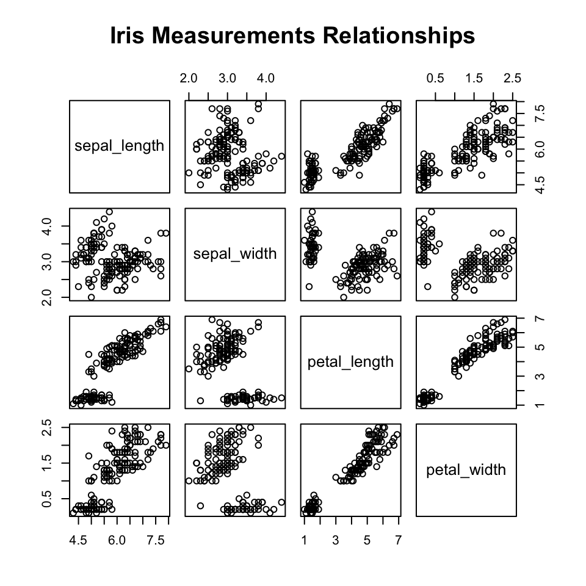
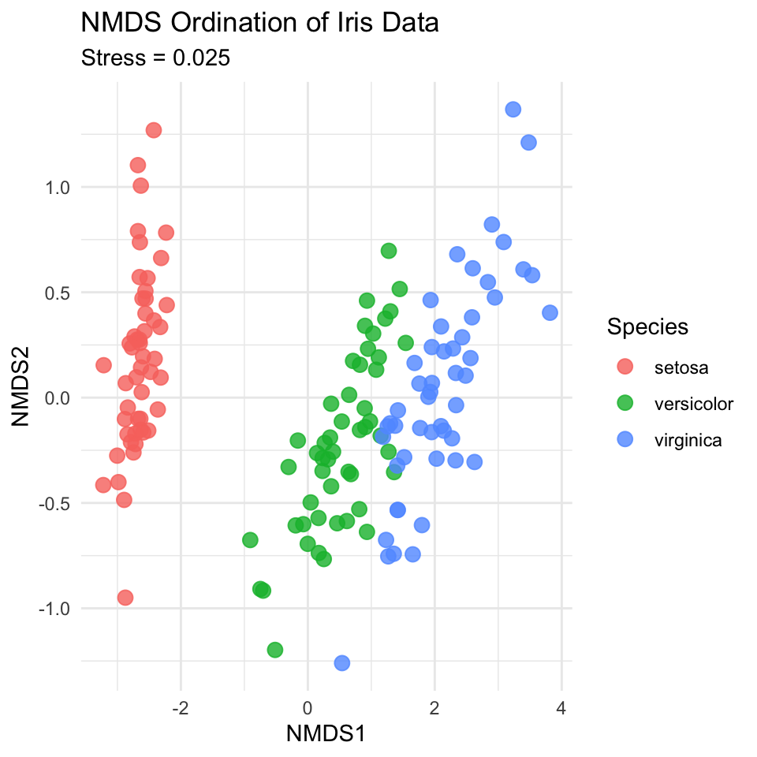
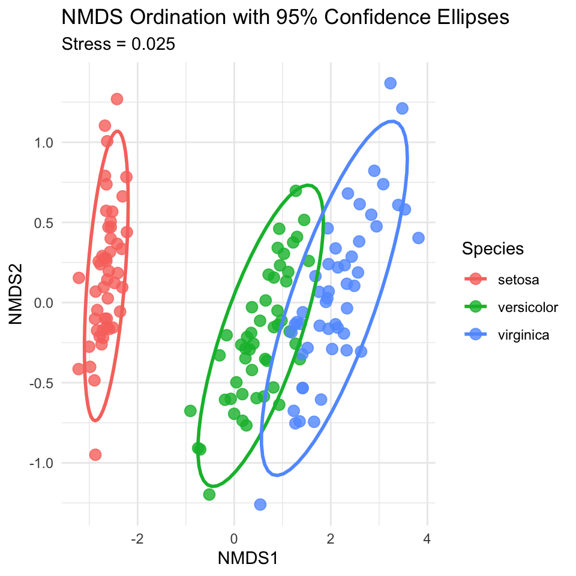
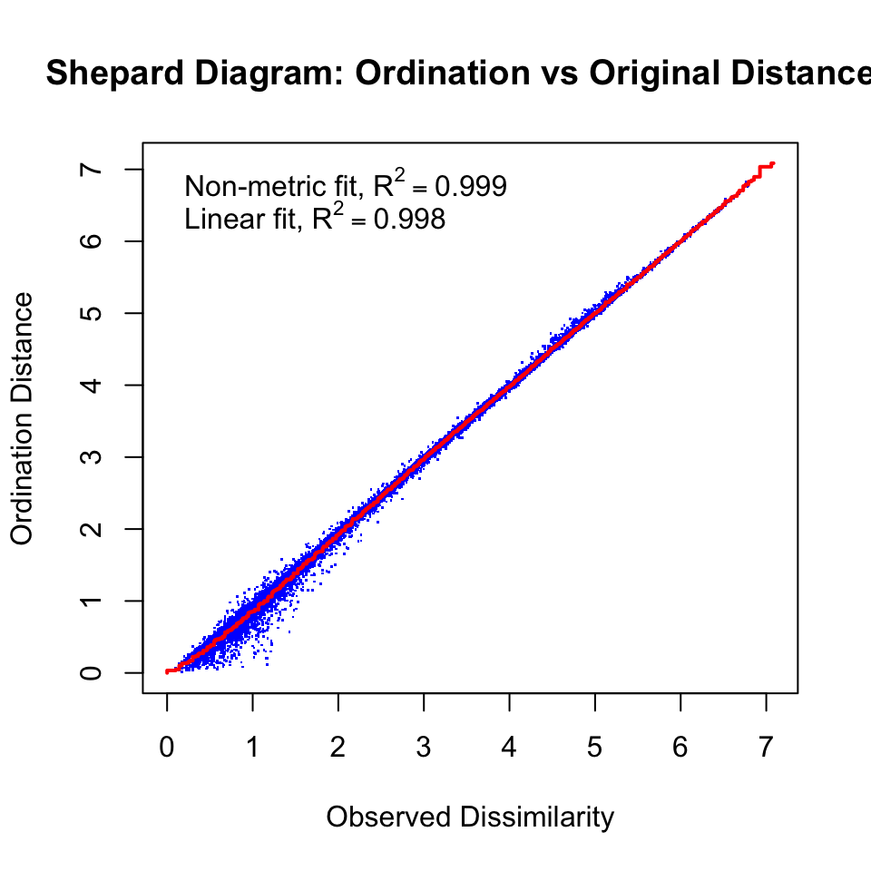
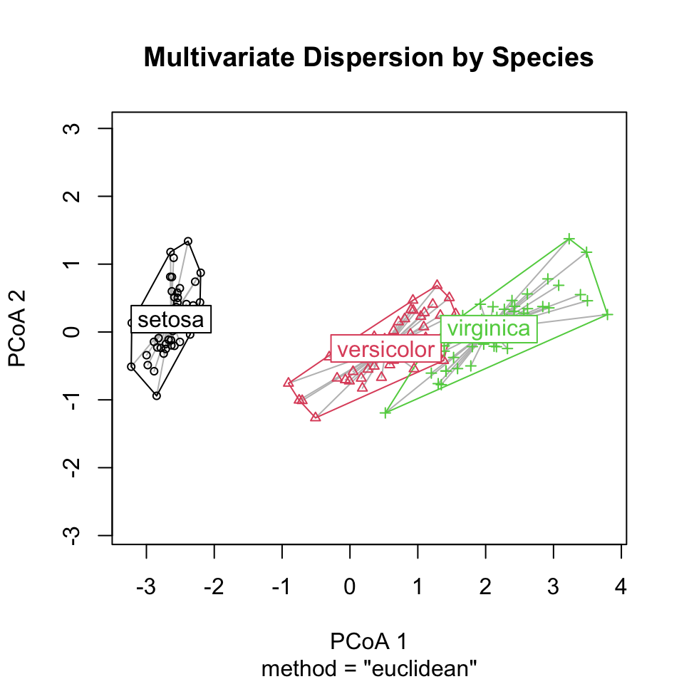
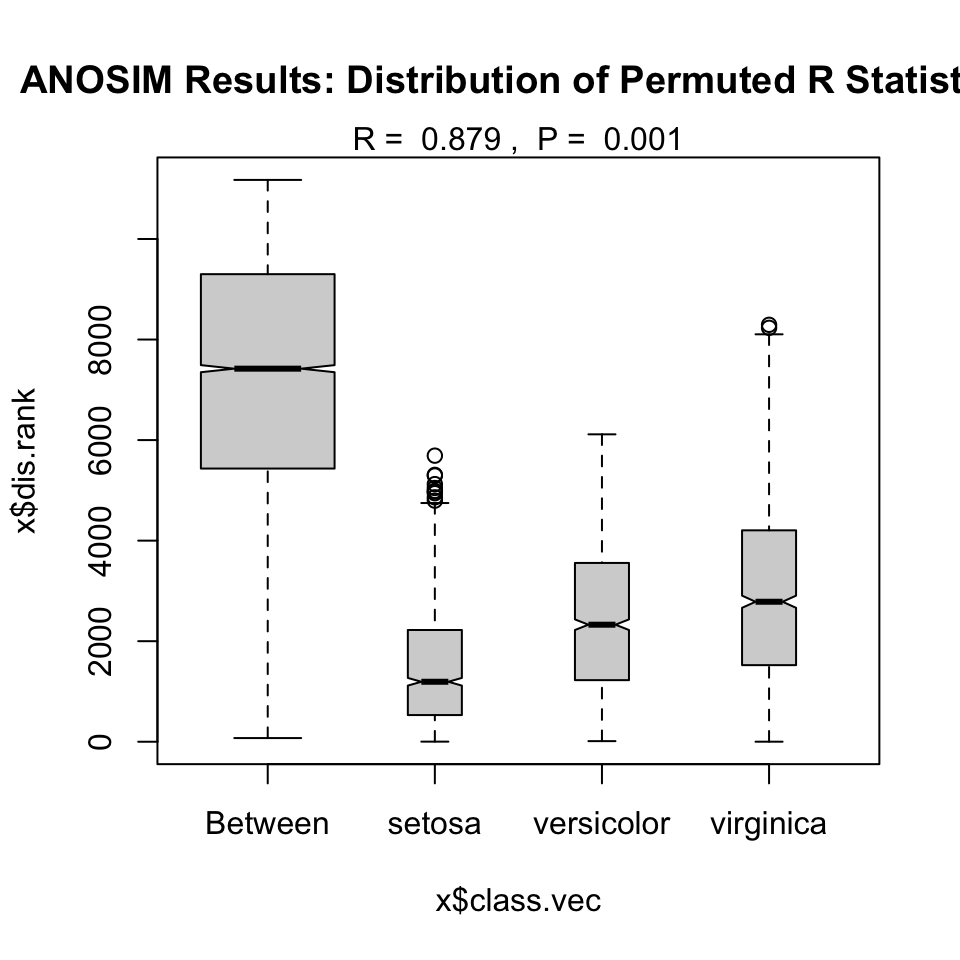
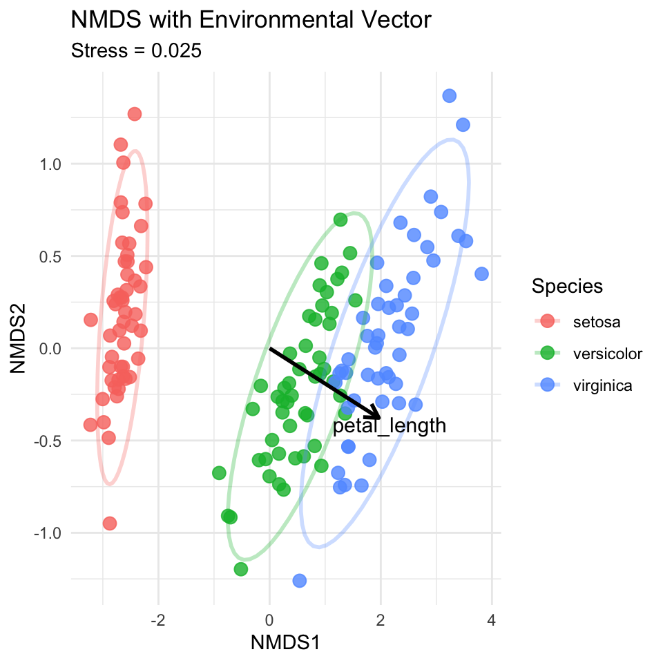

# Lecture 18: Non-metric Multidimensional Scaling (NMDS) and PERMANOVA

## What is NMDS?

NMDS (Non-metric Multidimensional Scaling) is an ordination technique
that: - Visualizes dissimilarity between objects in reduced dimensions -
Preserves rank order of distances, not exact distances - Works well with
non-linear ecological relationships - Makes few assumptions about data
structure

## When to Use NMDS

Use NMDS when you have: - **Community data**: Species abundance or
presence/absence matrices - **Non-linear relationships**: When PCA
assumptions are violated - **Complex ecological gradients**: Multiple
environmental factors affecting communities

## Key Concepts of NMDS

1.  **Dissimilarity matrices** instead of covariance
2.  **Stress values** measure goodness of fit (\<0.2 is acceptable)
3.  **Iterative algorithm** to find optimal configuration
4.  **No eigenvalues** - axes have no inherent meaning
5.  **Rank-based** - preserves order, not exact distances

::: {.callout-important appearance="simple"}
## Critical First Step

Always check your stress value! Stress \< 0.1 is excellent, 0.1-0.2 is
good, \> 0.2 is poor representation.
:::

# Part 1: Data Preparation and Exploration

## Load and Prepare Data

We'll use the iris dataset for this analysis, treating it as if the
measurements represent abundances of different "species" at different
"sites".


::: {.cell}

```{.r .cell-code}
# Load iris data
iris_df <- read_csv("data/iris.csv") %>%
  clean_names()
```

::: {.cell-output .cell-output-stderr}

```
Rows: 150 Columns: 5
── Column specification ────────────────────────────────────────────────────────
Delimiter: ","
chr (1): species
dbl (4): sepal_length, sepal_width, petal_length, petal_width

ℹ Use `spec()` to retrieve the full column specification for this data.
ℹ Specify the column types or set `show_col_types = FALSE` to quiet this message.
```


:::

```{.r .cell-code}
# View data structure
head(iris_df)
```

::: {.cell-output .cell-output-stdout}

```
# A tibble: 6 × 5
  sepal_length sepal_width petal_length petal_width species
         <dbl>       <dbl>        <dbl>       <dbl> <chr>  
1          5.1         3.5          1.4         0.2 setosa 
2          4.9         3            1.4         0.2 setosa 
3          4.7         3.2          1.3         0.2 setosa 
4          4.6         3.1          1.5         0.2 setosa 
5          5           3.6          1.4         0.2 setosa 
6          5.4         3.9          1.7         0.4 setosa 
```


:::
:::


::: {.cell}

```{.r .cell-code}
# For NMDS, we need just the numeric columns (our "species" data)
# We'll keep species as our grouping variable
iris_species_df <- iris_df %>%
  dplyr::select(species)

iris_numeric_df <- iris_df %>%
  dplyr::select(-species)

# Check the structure
str(iris_numeric_df)
```

::: {.cell-output .cell-output-stdout}

```
tibble [150 × 4] (S3: tbl_df/tbl/data.frame)
 $ sepal_length: num [1:150] 5.1 4.9 4.7 4.6 5 5.4 4.6 5 4.4 4.9 ...
 $ sepal_width : num [1:150] 3.5 3 3.2 3.1 3.6 3.9 3.4 3.4 2.9 3.1 ...
 $ petal_length: num [1:150] 1.4 1.4 1.3 1.5 1.4 1.7 1.4 1.5 1.4 1.5 ...
 $ petal_width : num [1:150] 0.2 0.2 0.2 0.2 0.2 0.4 0.3 0.2 0.2 0.1 ...
```


:::
:::


## Visualize the Data


::: {.cell}

```{.r .cell-code}
# Create a pairs plot to see relationships
iris_pairs_plot <- iris_df %>%
  dplyr::select(-species) %>%
  pairs(main = "Iris Measurements Relationships")
```

::: {.cell-output-display}
{width=480}
:::
:::


# Part 2: Running NMDS

## Step 1: Calculate Distance Matrix


::: {.cell}

```{.r .cell-code}
# Calculate Bray-Curtis distance (common for ecological data)
# For iris data, we'll use Euclidean distance since these are measurements
iris_dist <- dist(iris_numeric_df, method = "euclidean")

# Check the first few distances
iris_dist[1:5]
```

::: {.cell-output .cell-output-stdout}

```
[1] 0.5385165 0.5099020 0.6480741 0.1414214 0.6164414
```


:::
:::


## Step 2: Run NMDS


::: {.cell}

```{.r .cell-code}
# Run NMDS with 2 dimensions
set.seed(123)  # For reproducibility
iris_nmds_model <- metaMDS(iris_numeric_df, 
                           distance = "euclidean",
                           k = 2,  # Number of dimensions
                           trymax = 100)  # Maximum iterations
```

::: {.cell-output .cell-output-stdout}

```
Run 0 stress 0.02525035 
Run 1 stress 0.04045544 
Run 2 stress 0.03566855 
Run 3 stress 0.0268287 
Run 4 stress 0.03695952 
Run 5 stress 0.03104439 
Run 6 stress 0.02682881 
Run 7 stress 0.03962709 
Run 8 stress 0.03210416 
Run 9 stress 0.04325555 
Run 10 stress 0.02525031 
... New best solution
... Procrustes: rmse 1.741237e-05  max resid 7.129696e-05 
... Similar to previous best
Run 11 stress 0.02525038 
... Procrustes: rmse 1.217807e-05  max resid 8.876481e-05 
... Similar to previous best
Run 12 stress 0.04000578 
Run 13 stress 0.03552087 
Run 14 stress 0.0309981 
Run 15 stress 0.04078306 
Run 16 stress 0.04008785 
Run 17 stress 0.03197035 
Run 18 stress 0.02525033 
... Procrustes: rmse 5.481604e-06  max resid 2.712782e-05 
... Similar to previous best
Run 19 stress 0.02682875 
Run 20 stress 0.03270101 
*** Best solution repeated 3 times
```


:::

```{.r .cell-code}
# Check the results
iris_nmds_model
```

::: {.cell-output .cell-output-stdout}

```

Call:
metaMDS(comm = iris_numeric_df, distance = "euclidean", k = 2,      trymax = 100) 

global Multidimensional Scaling using monoMDS

Data:     iris_numeric_df 
Distance: euclidean 

Dimensions: 2 
Stress:     0.02525031 
Stress type 1, weak ties
Best solution was repeated 3 times in 20 tries
The best solution was from try 10 (random start)
Scaling: centring, PC rotation 
Species: expanded scores based on 'iris_numeric_df' 
```


:::
:::


**Interpretation**: - Stress value:
0.025 - This is
excellent
representation

## Step 3: Extract NMDS Scores


::: {.cell}

```{.r .cell-code}
# Extract NMDS scores for plotting
nmds_scores_df <- as.data.frame(iris_nmds_model$points) %>%
  rename(nmds1 = MDS1, nmds2 = MDS2) %>%
  bind_cols(iris_species_df)

# View the scores
head(nmds_scores_df)
```

::: {.cell-output .cell-output-stdout}

```
      nmds1      nmds2 species
1 -2.687311  0.2758924  setosa
2 -2.717262 -0.1705943  setosa
3 -2.882071 -0.1017541  setosa
4 -2.746720 -0.2603709  setosa
5 -2.730486  0.2902002  setosa
6 -2.311408  0.6625723  setosa
```


:::
:::


## Step 4: Create NMDS Plot


::: {.cell}

```{.r .cell-code}
# Basic NMDS plot
nmds_basic_plot <- ggplot(nmds_scores_df, aes(x = nmds1, y = nmds2, color = species)) +
  geom_point(size = 3, alpha = 0.8) +
  labs(title = "NMDS Ordination of Iris Data",
       subtitle = paste("Stress =", round(iris_nmds_model$stress, 3)),
       x = "NMDS1", 
       y = "NMDS2",
       color = "Species") +
  theme_minimal()

nmds_basic_plot
```

::: {.cell-output-display}
{width=480}
:::
:::


## Step 5: Add Confidence Ellipses


::: {.cell}

```{.r .cell-code}
# NMDS plot with ellipses
nmds_ellipse_plot <- ggplot(nmds_scores_df, aes(x = nmds1, y = nmds2, color = species)) +
  geom_point(size = 3, alpha = 0.8) +
  stat_ellipse(level = 0.95, size = 1) +
  labs(title = "NMDS Ordination with 95% Confidence Ellipses",
       subtitle = paste("Stress =", round(iris_nmds_model$stress, 3)),
       x = "NMDS1", 
       y = "NMDS2",
       color = "Species") +
  theme_minimal()
```

::: {.cell-output .cell-output-stderr}

```
Warning: Using `size` aesthetic for lines was deprecated in ggplot2 3.4.0.
ℹ Please use `linewidth` instead.
```


:::

```{.r .cell-code}
nmds_ellipse_plot
```

::: {.cell-output-display}
{width=480}
:::
:::


## Step 6: Stress Plot (Shepard Diagram)


::: {.cell}

```{.r .cell-code}
# Create stress plot to evaluate fit
stressplot(iris_nmds_model, main = "Shepard Diagram: Ordination vs Original Distances")
```

::: {.cell-output-display}
{width=480}
:::
:::


# Part 3: PERMANOVA Analysis

## What is PERMANOVA?

PERMANOVA (Permutational Multivariate Analysis of Variance) tests
whether groups have different multivariate centroids using permutation
tests.

## Step 1: Run PERMANOVA


::: {.cell}

```{.r .cell-code}
# Run PERMANOVA to test if species differ in multivariate space
set.seed(456)
iris_permanova_model <- adonis2(iris_numeric_df ~ species, 
                                data = iris_df,
                                method = "euclidean",
                                permutations = 999)

# View results
iris_permanova_model
```

::: {.cell-output .cell-output-stdout}

```
Permutation test for adonis under reduced model
Permutation: free
Number of permutations: 999

adonis2(formula = iris_numeric_df ~ species, data = iris_df, permutations = 999, method = "euclidean")
          Df SumOfSqs      R2      F Pr(>F)    
Model      2   592.07 0.86894 487.33  0.001 ***
Residual 147    89.30 0.13106                  
Total    149   681.37 1.00000                  
---
Signif. codes:  0 '***' 0.001 '**' 0.01 '*' 0.05 '.' 0.1 ' ' 1
```


:::
:::


**Interpretation**: - F-statistic:
487.33 - R² (variance explained):
0.869 - p-value:
0.001

## Step 2: Check Homogeneity of Dispersions

Before interpreting PERMANOVA, we need to check if groups have similar
multivariate spread.


::: {.cell}

```{.r .cell-code}
# Test homogeneity of multivariate dispersions
iris_dist_full <- dist(iris_numeric_df)
dispersion_model <- betadisper(iris_dist_full, iris_df$species)

# Test for differences in dispersion
dispersion_test <- anova(dispersion_model)
dispersion_test
```

::: {.cell-output .cell-output-stdout}

```
Analysis of Variance Table

Response: Distances
           Df  Sum Sq Mean Sq F value  Pr(>F)    
Groups      2  2.9092 1.45458  10.748 4.4e-05 ***
Residuals 147 19.8941 0.13533                    
---
Signif. codes:  0 '***' 0.001 '**' 0.01 '*' 0.05 '.' 0.1 ' ' 1
```


:::
:::


## Step 3: Visualize Dispersions


::: {.cell}

```{.r .cell-code}
# Plot dispersions
plot(dispersion_model, main = "Multivariate Dispersion by Species")
```

::: {.cell-output-display}
{width=480}
:::
:::


## Step 4: Pairwise PERMANOVA


::: {.cell}

```{.r .cell-code}
# Function for pairwise PERMANOVA comparisons
pairwise_permanova <- function(data_matrix, groups, distance_method = "euclidean") {
  # Get unique group combinations
  group_levels <- unique(groups)
  comparisons <- combn(group_levels, 2)
  
  # Initialize results
  results_df <- data.frame(
    group1 = character(),
    group2 = character(),
    f_statistic = numeric(),
    r_squared = numeric(),
    p_value = numeric()
  )
  
  # Run pairwise comparisons
  for(i in 1:ncol(comparisons)) {
    # Subset data
    group1 <- comparisons[1, i]
    group2 <- comparisons[2, i]
    subset_indices <- which(groups %in% c(group1, group2))
    
    subset_data <- data_matrix[subset_indices, ]
    subset_groups <- groups[subset_indices]
    
    # Run PERMANOVA
    temp_result <- adonis2(subset_data ~ subset_groups, 
                          method = distance_method,
                          permutations = 999)
    
    # Store results
    results_df <- rbind(results_df, data.frame(
      group1 = group1,
      group2 = group2,
      f_statistic = temp_result$F[1],
      r_squared = temp_result$R2[1],
      p_value = temp_result$"Pr(>F)"[1]
    ))
  }
  
  # Adjust p-values for multiple comparisons
  results_df$p_adjusted <- p.adjust(results_df$p_value, method = "bonferroni")
  
  return(results_df)
}

# Run pairwise comparisons
pairwise_results_df <- pairwise_permanova(iris_numeric_df, iris_df$species)
pairwise_results_df
```

::: {.cell-output .cell-output-stdout}

```
      group1     group2 f_statistic r_squared p_value p_adjusted
1     setosa versicolor    551.0039 0.8489994   0.001      0.003
2     setosa  virginica    943.7992 0.9059320   0.001      0.003
3 versicolor  virginica     86.7697 0.4696100   0.001      0.003
```


:::
:::


# Part 4: ANOSIM Analysis

## What is ANOSIM?

ANOSIM (Analysis of Similarities) tests whether there is a significant
difference between groups using rank dissimilarities.

## Step 1: Run ANOSIM


::: {.cell}

```{.r .cell-code}
# Run ANOSIM
set.seed(789)
iris_anosim_model <- anosim(iris_dist_full, iris_df$species, permutations = 999)

# View results
iris_anosim_model
```

::: {.cell-output .cell-output-stdout}

```

Call:
anosim(x = iris_dist_full, grouping = iris_df$species, permutations = 999) 
Dissimilarity: euclidean 

ANOSIM statistic R: 0.8794 
      Significance: 0.001 

Permutation: free
Number of permutations: 999
```


:::
:::


**Interpretation**: - R statistic:
0.879 - p-value:
0.001 - R close to 1 indicates strong separation
between groups

## Step 2: Plot ANOSIM Results


::: {.cell}

```{.r .cell-code}
# Plot ANOSIM results
plot(iris_anosim_model, main = "ANOSIM Results: Distribution of Permuted R Statistics")
```

::: {.cell-output-display}
{width=480}
:::
:::


# Part 5: Environmental Fitting (Optional)

If we had environmental variables, we could fit them to the ordination.


::: {.cell}

```{.r .cell-code}
# For demonstration, let's use petal_length as an "environmental" variable
env_data_df <- data.frame(petal_length = iris_df$petal_length)

# Fit environmental vector
env_fit_model <- envfit(iris_nmds_model, env_data_df, permutations = 999)
env_fit_model
```

::: {.cell-output .cell-output-stdout}

```

***VECTORS

                NMDS1    NMDS2     r2 Pr(>r)    
petal_length  0.98205 -0.18862 0.9979  0.001 ***
---
Signif. codes:  0 '***' 0.001 '**' 0.01 '*' 0.05 '.' 0.1 ' ' 1
Permutation: free
Number of permutations: 999
```


:::
:::


## Visualize Environmental Vectors


::: {.cell}

```{.r .cell-code}
# Extract vector coordinates
env_coords_df <- as.data.frame(env_fit_model$vectors$arrows * 2)  # Scale for visibility
env_coords_df$variable <- rownames(env_coords_df)

# NMDS plot with environmental vector
nmds_env_plot <- ggplot(nmds_scores_df, aes(x = nmds1, y = nmds2, color = species)) +
  geom_point(size = 3, alpha = 0.8) +
  stat_ellipse(level = 0.95, size = 1, alpha = 0.3) +
  geom_segment(data = env_coords_df,
               aes(x = 0, y = 0, xend = NMDS1, yend = NMDS2),
               arrow = arrow(length = unit(0.3, "cm")),
               color = "black", size = 1) +
  geom_text(data = env_coords_df,
            aes(x = NMDS1 * 1.1, y = NMDS2 * 1.1, label = variable),
            color = "black", size = 4) +
  labs(title = "NMDS with Environmental Vector",
       subtitle = paste("Stress =", round(iris_nmds_model$stress, 3)),
       x = "NMDS1", 
       y = "NMDS2",
       color = "Species") +
  theme_minimal()

nmds_env_plot
```

::: {.cell-output-display}
{width=480}
:::
:::


# Summary Checklist for NMDS and PERMANOVA

::: {.callout-tip appearance="simple"}
## Analysis Checklist

1.  **Prepare your data** - ensure numeric matrix format
2.  **Choose appropriate distance measure**
    - Bray-Curtis for abundance data
    - Euclidean for measurement data
3.  **Run NMDS** with sufficient iterations
4.  **Check stress value** - must be \< 0.2
5.  **Create ordination plots** with groups identified
6.  **Test homogeneity of dispersions** before PERMANOVA
7.  **Run PERMANOVA** to test group differences
8.  **Consider ANOSIM** as complementary test
9.  **Fit environmental variables** if available
:::

## Key Points to Remember

- **NMDS preserves rank order** of distances, not exact values
- **Stress \< 0.2** is acceptable, \< 0.1 is excellent
- **PERMANOVA tests centroids**, ANOSIM tests overlap
- **Check dispersion homogeneity** - violated assumption affects
  interpretation
- **Multiple comparisons** require p-value adjustment
- **Axes have no inherent meaning** in NMDS (unlike PCA)
- **Use appropriate distance measures** for your data type

::: {.callout-important appearance="simple"}
## Key Takeaways from NMDS/PERMANOVA Analysis

1.  **NMDS is flexible** - works with any distance measure and makes few
    assumptions
2.  **Stress indicates fit quality** - always report and check this
    value
3.  **PERMANOVA is powerful** but assumes homogeneous dispersions
4.  **ANOSIM is complementary** - provides different perspective on
    group separation
5.  **Visualization is crucial** - always plot your ordination results
6.  **Environmental fitting** helps interpret ecological patterns
7.  **Permutation tests** avoid distributional assumptions

Remember: NMDS is iterative and may find different solutions - always
set a seed for reproducibility!
:::