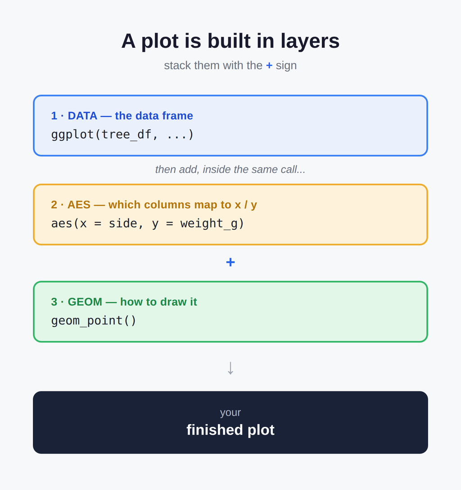
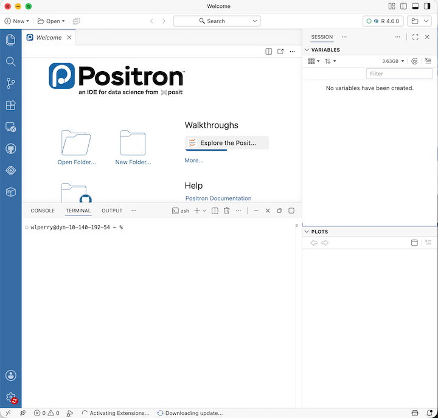
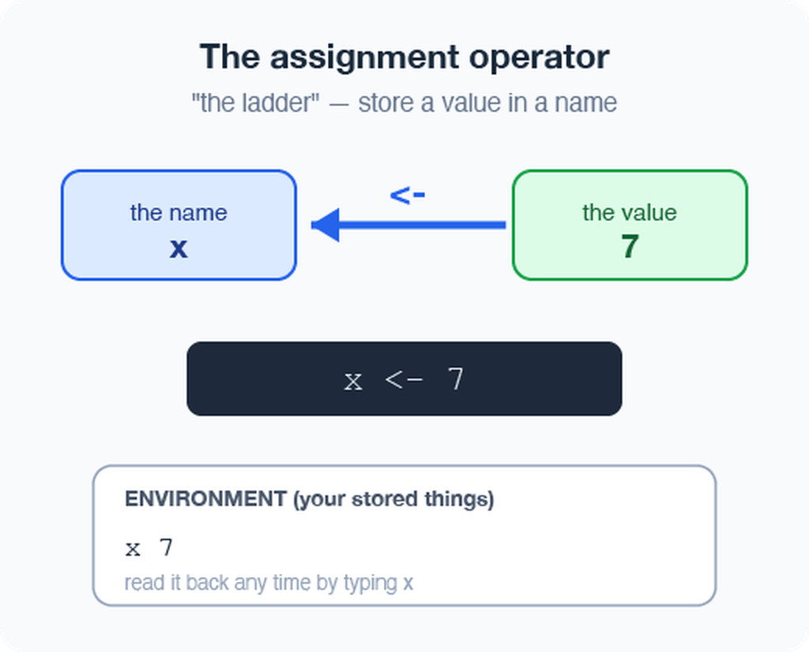
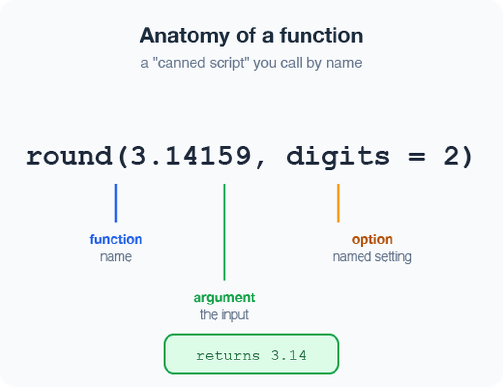
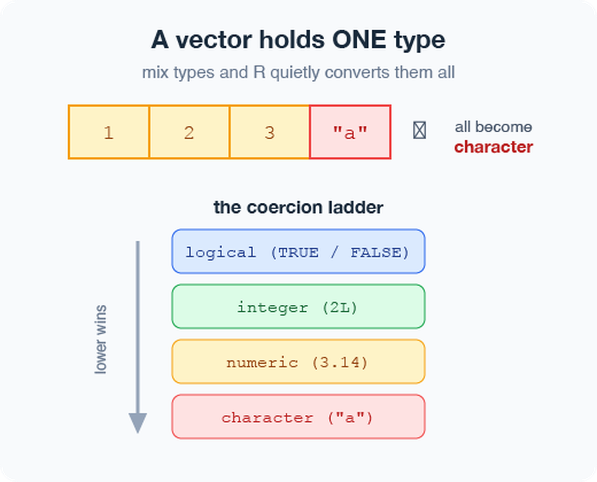
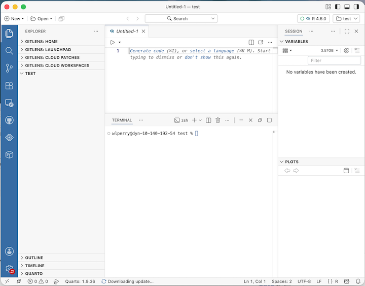
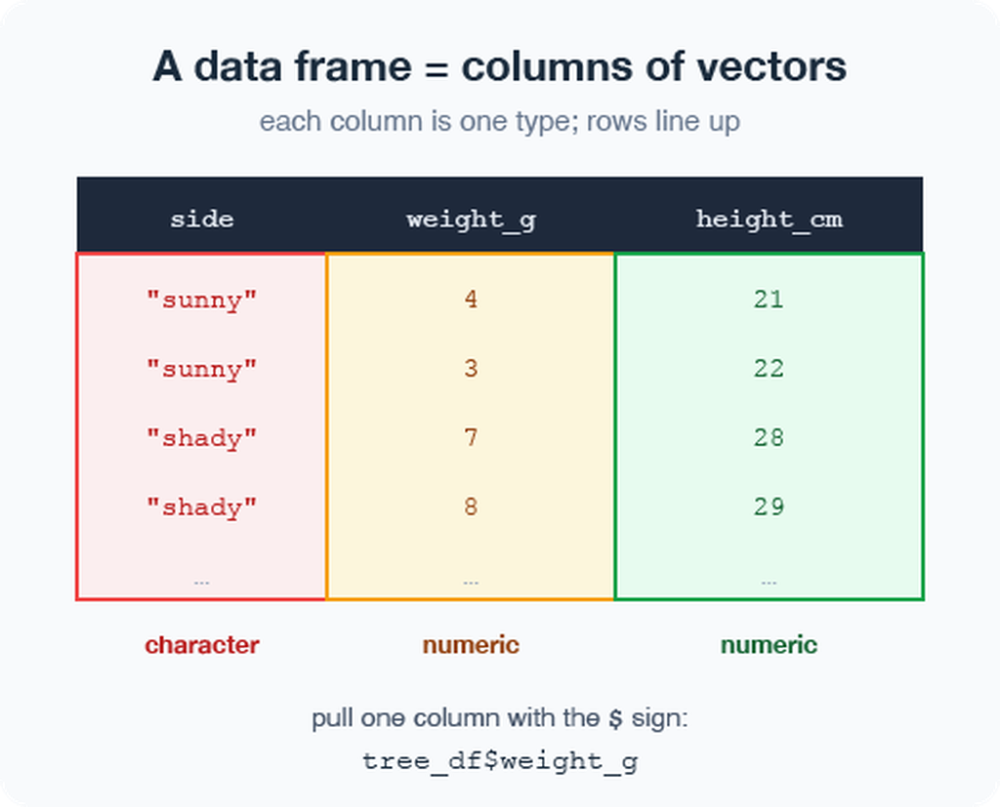
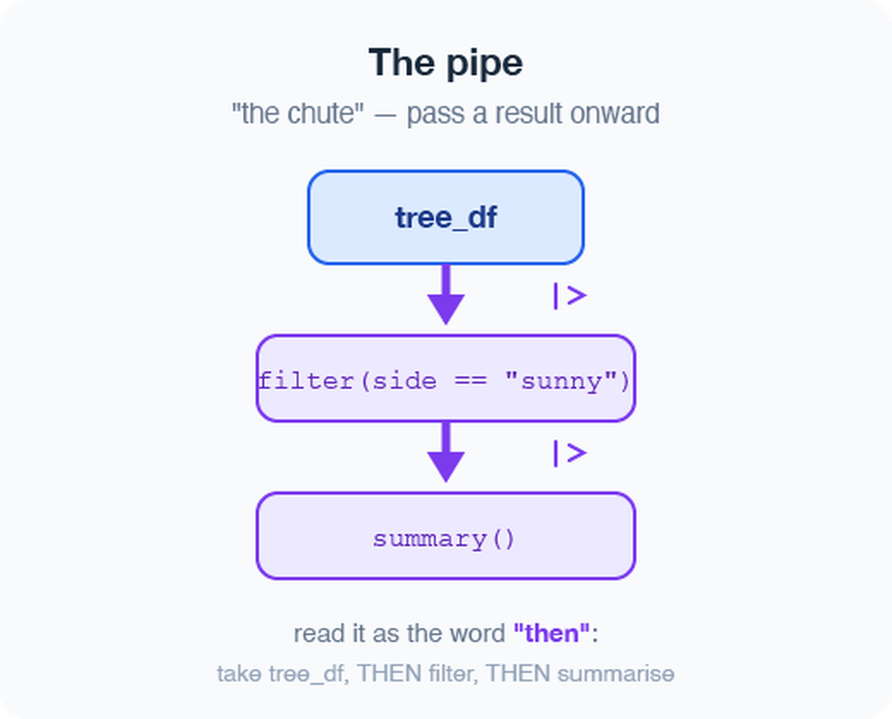
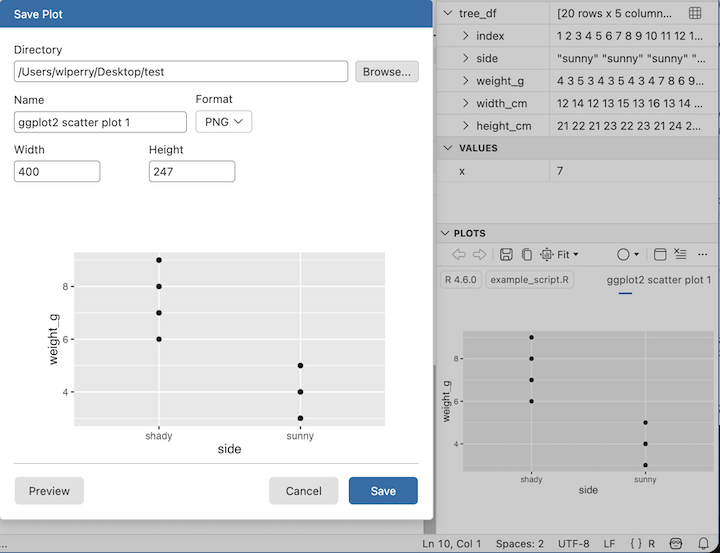

# Where we left off (Lecture 01)

- **Science fundamentals** — falsifiable predictions; null vs. alternate hypotheses
- **Our class project** — leaf morphology: *sunny vs. shady* sides of trees
- **Design** — randomization, replication (multiple trees), sampling limits
- **Variables** — dependent (leaf mass/size) vs. independent (side of tree)
- **Spreadsheet hygiene** — metadata, consistent column names, units, clean sheet design
- **Installed** R and Positron before today

::: callout-note
**✅ Key idea**

Today we take that tidy spreadsheet and bring it to life in R.
:::

# Goals for today

:::::: columns
:::: {.column width="60%"}
- Get **R** and **Positron** oriented — the four panes
- Organize a project so future-you can find things
- Learn how R actually works:
  - using it as a **calculator**
  - storing things with **`<-`** the assignment operator - alligator eats the minus sign...
  - **values**, **vectors**, and **data types**
  - writing a **script**
- Load our tree data and make a **first plot**

::: callout-tip
**🖐 Try it yourself**

By the end you will run real code on **our** leaf data — not a toy dataset.
:::
::::

::: {.column width="40%"}
{width="55%"}
:::
::::::

# Part 1 · Setting up

### What is R, really?

:::::: columns
:::: {.column width="60%"}
- **R** is the engine — a free language for data and statistics
- We drive that engine through an **IDE** (a code editor)
- Two good IDEs — you may try both:
  - **Positron** — what we use *(recommended)*
  - **RStudio** — the long-time classic

::: callout-note
**📖 New word**

**IDE** = *Integrated Development Environment*. Think of R as the car engine and the IDE as the seat, wheel, and dashboard.
:::
::::

::: {.column width="40%"}
{width="65%"}
:::
::::::

# Organize the project *before* you code

::::::: columns
:::: {.column width="60%"}
Make **one folder per project**. Everything for the tree experiment lives together:

```         
tree_project/
├── data/          ← your Excel and CSV files
├── scripts/       ← your .R code files
└── figures/       ← plots you save
```

- In Positron: **File → Open Folder…** and pick this folder
- Every path is then **relative** to the project — no more `C:/Users/.../Desktop/...` nightmares

::: callout-note
**✅ Key idea**

A tidy folder today saves an hour of "where did I put that file?" next week.
:::

::: callout-note
**📚 Reference**

R for Data Science (2e), Ch. 6 — *Workflow: scripts and projects*. Covers exactly this: projects, relative paths, and "what is the source of truth."
:::
::::

:::: {.column width="40%"}
::: callout-note
**📊 Coming from Excel?**

- In Excel you keep one big file and it can be hard to figure out what was done and how
- In R we keep **raw data untouched** and
  - write *new* processed files
    - — so you can **always trace your steps** and n**ever overwrite your original numbers**
:::
::::
:::::::

# A quick tour of Positron

:::::: columns
:::: {.column width="60%"}
Four panes you will use constantly:

- **Editor** (top-left) — your scripts live here when you have a script open
- **Console / Terminal** (bottom) — where code runs
- **Variables / Session** (right) — everything you have stored
- **Plots** (right) — your figures appear here

::: callout-tip
**🖐 Try it yourself**

- Find each pane on your screen now.
- Click the **Console** tab — that is where we start next.
:::
::::

::: {.column width="40%"}
{width="65%"}
:::
::::::

# Part 2 · How R works

### R is a calculator

::::::: columns
:::: {.column width="60%"}
Type math straight into the **console** and press Enter:

``` r
3 + 5
12 / 7
2 ^ 10
```

R answers immediately. The console is great for quick "what is the answer?" questions.

::: callout-warning
**⚠️ Watch out!**

- A `+` at the start of the console line means R is **still waiting** for you to finish a command.
- Press Esc to start over.
:::
::::

:::: {.column width="40%"}
::: callout-note
**📊 Coming from Excel?**

- This is just like typing `=3+5` into an Excel cell
- except there are no cells, just a line you type and run
:::
::::
:::::::

# Storing values with `<-` assignment operator - alligator eats the minus sign

:::::: columns
:::: {.column width="60%"}
To keep a value, give it a **name** with the assignment operator `<-`:

``` r
x <- 7          # store 7 under the name x
x               # type the name to read it back
x * 2           # use it in math
```

- `<-` puts the value into your **environment** (look in the Variables pane!)
- Shortcut: Alt + - (Win) or Option + - (Mac) types `<-` for you

::: callout-note
**📖 New word**

**Assignment operator** `<-` "puts the thing on right and stores it in the name on left." Do not use `=`
:::
::::

::: {.column width="40%"}
{width="55%"}
:::
::::::

# Naming your objects well

::::::: columns
:::: {.column width="60%"}
Good names make code readable months later:

- Be **explicit**, not too long: `leaf_mass`, not `x2`
- **Cannot start with a number** — `x2` ✅, `2x` ❌
- R is **case-sensitive** — `weight_g` ≠ `Weight_g`
- Use **`lower_snake_case`** — words separated by underscores

``` r
leaf_mass   <- c(4, 3, 5, 7)   # good
LeafMass    <- c(4, 3, 5, 7)   # works but avoid
leaf.mass   <- c(4, 3, 5, 7)   # avoid dots
```

::: callout-warning
**⚠️ Watch out!**

`weight_g` and `weight_G` are two *different* objects. Pick one style and stick with it. I **URGE** you to use lower case and underscores — `lower_snake_case`, always.
:::
::::

:::: {.column width="40%"}
::: callout-note
**📖 New word**

**Object** (R) = **variable** (Excel/other languages). Same idea: a named container that holds something.

- Our naming convention throughout this course:
  - data frames → `_df`
  - plots → `_plot`
  - models → `_model`
:::

::: callout-note
**📚 Reference**

R for Data Science (2e), Ch. 2 — *Workflow: basics* (naming, calling functions) and Ch. 4 — *Workflow: code style* (spacing, pipes). Short chapters — worth reading both.
:::
::::
:::::::

# Leave notes with comments `#`

::::::: columns
:::: {.column width="60%"}
Anything to the right of `#` is **ignored by R** — it is a note for humans:

``` r
# weights of four leaves, in grams
leaf_mass <- c(4, 3, 5, 7)

mean(leaf_mass)   # average leaf mass
```

- Comment generously — your future self will thank you
- Shortcut to toggle: Ctrl/Cmd + Shift + C - this can be modified

::: callout-note
**✅ Key idea**

If a line confused you while writing it, comment *why* you did it.
:::
::::

:::: {.column width="40%"}
::: callout-note
**📊 Coming from Excel?**

Comments are like the notes you scribble in a cell — but they never get in the way of the numbers or the code.
:::
::::
:::::::

# Functions and their arguments

::::: columns
:::: {.column width="60%"}
A **function** is a canned script you call by name. You feed it **arguments** (inputs); it **returns** a result:

``` r
sqrt(10)                         # one argument
round(3.14159)                   # default: 0 digits → 3
round(3.14159, 2)                # two digits → 3.14
round(x = 3.14159, digits = 2)  # named arguments
```

Stuck on a function?

``` r
?round        # open the help page
args(round)   # what arguments does it take?
```

::: callout-note
**📖 New word**

**Argument** = an input you hand to a function inside its `( )`.
:::
::::

{width="55%"}
:::::

# Vectors — a row of values

::::::: columns
:::: {.column width="60%"}
A **vector** is a series of values built with `c()` ("combine") or concatenated list:

``` r
weight_g <- c(4, 3, 5, 7)          # numbers
side     <- c("sunny", "shady")     # text needs quotes
```

Inspect any vector:

``` r
length(weight_g)   # how many values?
class(weight_g)    # what type?
str(weight_g)      # quick structure overview
```

::: callout-warning
**⚠️ Watch out!**

Quotes matter: `"sunny"` is text. Without quotes, R hunts for an **object** named `sunny` and errors when it cannot find one.
:::
::::

:::: {.column width="40%"}
::: callout-note
**✅ Key idea**

A vector is the workhorse of R. A spreadsheet **column** is really just a vector.
:::
::::
:::::::

# Data types live inside vectors

:::::: columns
:::: {.column width="60%"}
Every vector holds **one type**:

- `numeric` — `4`, `3.5`
- `character` — `"sunny"`
- `logical` — `TRUE` / `FALSE`

Mix types and R quietly **coerces** them all to one:

``` r
c(1, 2, 3, "a")     # all become character
c(1, 2, 3, TRUE)    # TRUE becomes 1
class(c(1, 2, 3, "a"))
```

::: callout-note
**📖 New word**

**Coercion** = R automatically converting everything in a vector to a single shared type.
:::
::::

::: {.column width="40%"}
{width="55%"}
:::
::::::

# Part 3 · From console to script

### Do not retype — use a **script**

:::::: columns
:::: {.column width="60%"}
**The console forgets and you would have to retype all of your code over and over....**

A **script** (`.R` file) remembers and re-runs code

- **File → New File → R File** opens a blank script
- Type your commands, one per line
- Put the cursor on a line and press Ctrl/Cmd + Enter to run it
- **Save** with Ctrl/Cmd + S — reopen later and re-run everything

``` r
x    <- 7
y    <- 5
x + y
```

::: callout-note
**✅ Key idea**

- Console = scratch paper.
- Script = the lab notebook you keep.
:::
::::

::: {.column width="40%"}
{width="65%"}
:::
::::::

# Packages — extending what R can do

::::::: columns
:::: {.column width="60%"}
Like apps for your phone, **packages** add new abilities to R.

**Install once** — downloads to your computer (do this in the Console, not in your script):

``` r
install.packages("tidyverse")
install.packages("readxl")
install.packages("janitor")
```

**Load every session** — activates it for today (put this at the top of every script):

``` r
library(tidyverse)   # data wrangling + plotting
library(readxl)      # read Excel files
library(janitor)      # cleans up messy column names
```

::: callout-warning
**⚠️ Watch out!**

If R says *"could not find function `read_excel`"*, you forgot the `library(readxl)` line.
:::
::::

:::: {.column width="40%"}
::: callout-note
**📖 New words**

- **Package** = the installed toolbox (install once).
- **Library** = loading that toolbox into today's session (every session).
:::
::::
:::::::

# Part 4 · Loading our data

### Two functions for two file types

::::::: columns
:::: {.column width="60%"}
Put your files in the project's `data/` folder, then:

``` r
library(tidyverse)
library(readxl)
library(janitor)

# Excel files (.xlsx)
tree_df <- read_excel("data/2026_06_25_tree_experiment_raw_data.xlsx") %>%
  clean_names()

# CSV files (.csv) — used by NOAA, iNaturalist, many databases
noaa_df <- read_csv("data/noaa_global_yearly_temps.csv") %>%
  clean_names()
```

::: callout-note
**✅ Key idea**

- `read.csv()` - comes with base r and can have issues
- `read_excel()`  - needs `library(readxl)`.
- `read_csv()`  - needs `library(tidyverse)`
- `clean_names()` - needs `library(janitor)`; turns messy Excel headers like
  `"Leaf Weight (g)"` into tidy names like `leaf_weight_g` automatically
:::
::::

:::: {.column width="40%"}
::: callout-note
**📊 Coming from Excel?**

`read_excel()` and `read_csv()` are the bridge from your file into R. Your file's first row becomes the **column names** in R.
:::

::: callout-note
**📚 Reference**

R for Data Science (2e), Ch. 7 — *Data import*. Covers `read_csv()` in depth, including column types and messy real-world files.
:::
::::
:::::::

# Meet the data frame

:::::: columns
:::: {.column width="60%"}
A **data frame** is a table: each **column is a vector** of one type, and the rows line up.

Our `tree_df` has five columns:

- `index` — leaf number *(numeric)*
- `side` — `"sunny"` / `"shady"` *(character)*
- `weight_g`, `width_cm`, `height_cm` *(numeric)*

Pull a single column with `$`:

``` r
tree_df$weight_g     # just the weights, as a vector
```

::: callout-note
**📖 New word**

**Data frame** = R's word for a spreadsheet-style table.
:::
::::

::: {.column width="40%"}
{width="55%"}
:::
::::::

# Look at your data before trusting it

:::::::: columns
:::: {.column width="60%"}
Always eyeball a new data frame:

``` r
head(tree_df)      # first 6 rows
tail(tree_df)      # last 6 rows
dim(tree_df)       # rows, columns  → 20  5
names(tree_df)     # column names

# Tidyverse-style structure check (prefer this over str):
glimpse(tree_df)   # one line per column: name, type, first values

# Base R equivalent:
str(tree_df)       # same information, different layout
```

::: callout-tip
**🖐 Try it yourself**

Run `glimpse(tree_df)`. How many rows? What type is `side`?
:::
::::

::::: {.column width="40%"}
::: callout-note
**✅ Key idea**

Check `dim()` and `glimpse()` every single time you load data. Typos and wrong column types hide here.
:::

::: callout-warning
**⚠️ Watch out!**

If a number column shows as `<chr>`, a stray letter or comma snuck into your spreadsheet.
:::
:::::
::::::::

# The pipe `%>%` — read it as "then"

::::::: columns
:::: {.column width="60%"}
The **pipe** sends a result straight into the next function. Read `%>%` as the word **"then"**:

``` r
# Start with simple examples:
tree_df %>% nrow()         # take tree_df, THEN count rows
tree_df %>% names()        # take tree_df, THEN list column names
tree_df %>% summary()      # take tree_df, THEN summarize

# Chain two steps:
tree_df %>%
  head(3)                  # take tree_df, THEN show first 3 rows
```

In Lecture 03 we will chain more steps together.

::: callout-note
**📖 New word**

**Pipe** `%>%` = "take what is on the left and feed it to the function on the right."
:::
::::

:::: {.column width="40%"}
{width="55%"}

::: callout-note
**Two pipes — same idea:**

- `%>%` — from tidyverse (we use this one)
- `|>` — built into R 4.1+ (the "native pipe")
- They behave identically for everything in this course but I prefer the %\>%
:::
::::
:::::::

# Part 5 · Your first plot

### ggplot: build a picture in layers

::::: columns
:::: {.column width="60%"}
Plots are built from three core pieces, joined with `+`:

``` r
ggplot(tree_df, aes(x = side, y = weight_g))
```

1.  **data** — which data frame (`tree_df`)
2.  **aes** — which columns map to x and y
3.  **geom** — how to draw it (add with `+`)

``` r
ggplot(tree_df, aes(x = side, y = weight_g)) +
  geom_point()
```

::: callout-warning
**⚠️ Watch out!**

- The `+` must sit at the **end** of a line, never the start.
- `+` at the start = error
- AND YES — it's confusing to use `%>%` for code and `+` for plots, but that's just how it is.
:::

::: callout-note
**📚 Reference**

R for Data Science (2e), Ch. 1 — *Data Visualization*, and Whitlock & Schluter, Ch. 2 — *Displaying Data*, on why we choose one graph type over another for a given kind of data.
:::
::::

{width="55%"}
:::::

# Improve it one layer at a time

:::::: columns
:::: {.column width="60%"}
Since `side` is a category, a **boxplot** with the raw points on top tells the story well:

``` r
ggplot(tree_df, aes(x = side, y = weight_g)) +
  geom_boxplot() +
  geom_jitter(width = 0.15, alpha = 0.6, color = "tomato") +
  geom_point(position = position_dodge(width = 0.15, alpha = 0.6, color = "tomato")) + 
# the two above are about the same but I prefer the lower one for a few reasons....
  labs(x = "Side of tree",
       y = "Leaf weight (g)",
       title = "Sunny vs. shady leaves")
```

::: callout-tip
**🖐 Try it yourself**

Swap `weight_g` for `height_cm`. What changes? Try `geom_violin()` instead of `geom_boxplot()`.
:::
::::

::: {.column width="40%"}
**Before you run it:** sketch what you expect this plot to look like — boxes, dots, axes — then compare it to what R draws.
:::
::::::

# Save your plot and your script

::::::: columns
:::: {.column width="60%"}
Store the plot in an object, then save it as a PNG:

``` r
leaf_plot <- ggplot(tree_df, aes(x = side, y = weight_g)) +
  geom_boxplot()

# Save to the figures/ folder — always use PNG, dpi = 300
ggsave("figures/leaf_weight.png",
       plot   = leaf_plot,
       width  = 6,
       height = 6,
       units  = "in",
       dpi    = 300)
```

- **📖 File format tip**
- Save figures as **PNG** (`.png`) for reports and Canvas submissions.
- `dpi = 300` means 300 dots per inch — high enough for print and posters.

::: callout-warning
**⚠️ Watch out!**

`ggsave()` wants the **filename first**, then `plot = `. Also: `dpi = 300` is publication quality — always use it.
:::
::::

:::: {.column width="40%"}
::: callout-note
{width="55%"}
:::
::::
:::::::

# Wrap-up · What you can now do

::::::: columns
:::: {.column width="60%"}
- Set up R + Positron and organize a project folder
- Use R as a calculator and **store values** with `<-`
- Write and run a **script**, with `#` comments
- Call **functions** and read their help with `?`
- Build **vectors**, know their types
- Load Excel and CSV data with `read_excel()` and `read_csv()`
- Inspect a data frame with `glimpse()`, `head()`, `dim()`
- Use the **pipe** `%>%` to chain steps
- Make and **save** a first `ggplot` as a PNG

::: callout-tip
**🖐 Before next class**

Load `tree_df`, run `glimpse()`, and make one plot of `width_cm` by `side`. Save it to `figures/`.
:::
::::

:::: {.column width="40%"}
::: callout-note
**✅ Key idea**

You went from a blank console to a saved figure of **our** data. That is the whole workflow in miniature.
:::

**Up next — Lecture 03 & 04 (Week 2):**

- Two lectures on `ggplot2` in depth — `stat_summary()`, `facet_wrap()`/`facet_grid()`, `scale_color_manual()`, `coord_cartesian()`, and themes
- We will keep using our own leaf data the whole time
::::
:::::::

# → ACTIVITY 2 starts now

::: {.activitybanner}
**🛑 Go to Activity 2 — "Introduction to R and Positron"**

Open the **Activity 2** worksheet and work through it at your own pace,
typing every code chunk into your own script in Positron. It repeats
everything on these slides, in the same order, with blanks for you to fill
in. Raise your hand if you get stuck — that is expected and normal.
:::

# Suggested reading before Lecture 03

- **R for Data Science (2e)**, Ch. 1 — *Data Visualization* (read fully this time — you skimmed it before Lecture 02)
- **R for Data Science (2e)**, Ch. 6 — *Workflow: scripts and projects*, if you have not read it yet
- **Whitlock & Schluter**, Ch. 2 — *Displaying Data*

::: callout-note
Both books are in the course `readings/` folder.
:::

# Getting unstuck

::::::: columns
:::: {.column width="60%"}
When code breaks (it will — that is normal):

- `?function_name` — the built-in help page
- Read the **error message** out loud; it usually names the line
- Check: did you load `library(tidyverse)` and `library(readxl)`?
- Check: spelling? A missing `)` or `+`?
- The **posit/tidyverse cheatsheets** are excellent: [posit.co/resources/cheatsheets](https://posit.co/resources/cheatsheets/)
- Bring the exact error (copy-paste it) to class or office hours

::: callout-note
**✅ Key idea**

Every coder googles error messages daily. Getting stuck is not failing — it is the job. Your job is to learn, and learning means breaking things and figuring out why.
:::
::::

:::: {.column width="40%"}
::: callout-note
**📊 Coming from Excel?**

In Excel you fix errors by clicking around. In R you fix them by **reading the message** and editing one line. Slower at first, far more powerful soon.
:::
::::
:::::::
