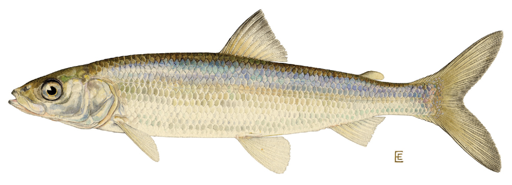

{width="80%"}

------------------------------------------------------------------------

# Overview

The **North Temperate Lakes Long-Term Ecological Research Program (NTL-LTER)** in Wisconsin has monitored fish populations since 1981 — one of the longest continuous fish datasets in North America. **Cisco** (*Coregonus artedi*) are especially important because they depend on cold, oxygen-rich water. As lakes warm with climate change, cisco are predicted to decline. Understanding how body size varies among years is one way biologists track whether populations are changing.

In Lectures 03–04 and Worksheets 03–04 you learned to wrangle data, calculate descriptive statistics, and run a two-sample Welch's t-test. This homework asks you to apply all those skills to a new, real dataset and answer: **Did cisco body weight differ between 1981 and 1982 in Trout Lake?**

> **Submit to Canvas:** (1) your completed `.R` script and (2) two saved PNG figures. Fill in all answer boxes **in the script as `#` comments** below the relevant code. The question numbers here match the `# Q__` markers in the skeleton script.

------------------------------------------------------------------------

# The Data

| Column       | Type | What it holds                 |
|--------------|------|-------------------------------|
| `lakeid`     | chr  | lake code (`TR` = Trout Lake) |
| `year4`      | num  | year of catch (1981–2006)     |
| `sampledate` | chr  | sampling date (MM/DD/YYYY)    |
| `gearid`     | chr  | gill-net mesh size code       |
| `spname`     | chr  | species (always `CISCO`)      |
| `length`     | num  | total body length **(mm)**    |
| `weight`     | num  | body weight **(g)**           |
| `sex`        | chr  | M, F, I, or NA                |

**Source:** Ogle DH (2023). *FSAdata* R package / NTL-LTER, UW–Madison.

------------------------------------------------------------------------

# Part 1 · Load and inspect (→ see Lecture 02, Worksheet 02)

After loading the data what is the size of the dataframe

> **Q1 — Total rows in the raw dataset:** \_\_\_\_\_\_\_\_
>
> **Q2 — Total columns:** \_\_\_\_\_\_\_\_

How many fish were caught each year.

> **Q3 — Year with the most fish:** \_\_\_\_\_\_\_\_    n = \_\_\_\_\_\_\_\_
>
> **Q4 — Year with the second most fish:** \_\_\_\_\_\_\_\_    n = \_\_\_\_\_\_\_\_

------------------------------------------------------------------------

# Part 2 · Wrangle (→ see Lecture 03, Worksheet 03)

Complete the pipeline in the skeleton script. After filtering to 1981 and 1982 (removing any fish with missing length, missing weight, or weight = 0):

> **Q5 — Rows remaining after filtering:** \_\_\_\_\_\_\_\_

Check with `count(cisco_df, year)`:

> **Q6 — n for 1981:** \_\_\_\_\_\_\_\_    **Q7 — n for 1982:** \_\_\_\_\_\_\_\_

Arrange the data by length descending and look at the five largest fish.

> **Q8 — Year of the heaviest fish:** \_\_\_\_\_\_\_\_    Weight: \_\_\_\_\_\_\_\_ g

------------------------------------------------------------------------

# Part 3 · Descriptive statistics (→ see Lecture 03, Worksheet 03)

Run your `group_by(year) %>% summarize(...)` pipeline (see Q in the skeleton).

Fill in the table below from the `cisco_stats_df` output:

|                  | **1981** | **1982** |
|------------------|----------|----------|
| n                |          |          |
| Mean weight (g)  |          |          |
| SD weight (g)    |          |          |
| SE weight (g)    |          |          |
| Mean length (mm) |          |          |

> **Q9 — Is 1982 mean weight higher than 1981?** Y / N
>
> **Q10 — Difference in mean weight (1982 − 1981):** \_\_\_\_\_\_\_\_ g

------------------------------------------------------------------------

# Part 4 · Visualize (→ see Lecture 03, Worksheet 03)

Make and save a boxplot with jittered points and a mean ± SE plot (see skeleton).

Describe what you see in the boxplot:

> **Q11 — Degree of overlap between the two groups (none / some / substantial):** \_\_\_\_\_\_\_\_\_\_\_\_\_\_\_\_
>
> **Q12 — Approximate median weight for 1981 (from the box):** \_\_\_\_\_\_\_\_ g
>
> **Q13 — Approximate median weight for 1982 (from the box):** \_\_\_\_\_\_\_\_ g
>
> **Q14 — Do the SE error bars overlap? Y / N:** \_\_\_\_\_\_\_\_   What does this suggest? \_\_\_\_\_\_\_\_\_\_\_\_\_\_\_\_

------------------------------------------------------------------------

# Part 5 · Five-step Welch's t-test (→ see Lecture 04, Worksheet 04)

Work through each step in order.

### Step 1 — Hypotheses

Write your hypotheses **before** looking at the test result.

> **Q15 — H₀ (plain English):**
>
> ------------------------------------------------------------------------
>
> **Q16 — Hₐ (plain English):**
>
> ------------------------------------------------------------------------
>
> **Significance level:** α = \_\_\_\_\_\_\_\_ **Test type (one- or two-tailed):** \_\_\_\_\_\_\_\_

------------------------------------------------------------------------

### Step 2 — Normality: histogram

Make the histogram of body weight, faceted by year (see skeleton).

> **Q17 — Shape of 1981 distribution (bell-shaped / right-skewed / other):** \_\_\_\_\_\_\_\_\_\_\_\_\_\_\_\_
>
> **Q18 — Shape of 1982 distribution:** \_\_\_\_\_\_\_\_\_\_\_\_\_\_\_\_

------------------------------------------------------------------------

### Step 3 — Normality: QQ plot + Shapiro-Wilk

Run `shapiro.test()` on each year's weights separately (see skeleton).

> **Q19 — Shapiro-Wilk 1981:** W = \_\_\_\_\_\_\_\_   p = \_\_\_\_\_\_\_\_
>
> **Q20 — Shapiro-Wilk 1982:** W = \_\_\_\_\_\_\_\_   p = \_\_\_\_\_\_\_\_

::: callout-note
Both groups may fail Shapiro-Wilk (p \< 0.05). With **n \> 80** the t-test is robust to non-normality because of the Central Limit Theorem — the sampling distribution of the mean is approximately normal even when raw data are not. Check the QQ plot: if points roughly follow the line without extreme curvature, proceed. (See Lecture 04, Step 3)
:::

> **Q21 — Decision: proceed with the t-test?** Y / N   **Reason:**
>
> ------------------------------------------------------------------------

------------------------------------------------------------------------

### Step 4 — Variance: Levene's test

Run `leveneTest(weight ~ year, data = cisco_df)` (see skeleton).

> **Q22 — Levene's F:** \_\_\_\_\_\_\_\_   **p:** \_\_\_\_\_\_\_\_
>
> **Q23 — Are the variances equal?** Y / N
>
> **Q24 — Does this change which t-test we run?** Y / N   **Why:**
>
> ------------------------------------------------------------------------

------------------------------------------------------------------------

### Step 5 — Run the test and interpret

Run `t.test(y ~ x, data = df, var.equal = FALSE, alternative = "two.sided")`.

> **Q25 — t-statistic:** \_\_\_\_\_\_\_\_
>
> **Q26 — df (Welch-Satterthwaite — probably not a whole number):** \_\_\_\_\_\_\_\_
>
> **Q27 — p-value (write the full number, not just "\< 0.05"):** \_\_\_\_\_\_\_\_
>
> **Q28 — 95% CI for the difference in means:** \_\_\_\_\_\_\_\_ to \_\_\_\_\_\_\_\_ g
>
> **Q29 — Mean weight 1981:** \_\_\_\_\_\_\_\_ g    **Mean weight 1982:** \_\_\_\_\_\_\_\_ g
>
> **Q30 — Is p \< α?** Y / N    **Decision (reject / fail to reject H₀):** \_\_\_\_\_\_\_\_\_\_\_\_\_\_\_\_

------------------------------------------------------------------------

# Part 6 · Results sentence (→ see Lecture 04)

Complete the sentence below by filling in every blank:

> **Q31:** "Cisco body weight was significantly **\[higher / lower\]** in **\_\_\_\_\_\_** than in **\_\_\_\_\_\_** (Welch's t-test: t(**\_\_\_\_\_\_**) = **\_\_\_\_\_\_**, p **\_\_\_\_\_\_**). Mean ± SE body weight was **\_\_\_\_\_\_** ± **\_\_\_\_\_\_** g in 1981 and **\_\_\_\_\_\_** ± **\_\_\_\_\_\_** g in 1982, a difference of **\_\_\_\_\_\_** g."

Then write 1–2 sentences suggesting a biological explanation for why body size differed between these two consecutive years:

> **Q32 — Biological explanation:**
>
> ------------------------------------------------------------------------
>
> ------------------------------------------------------------------------

------------------------------------------------------------------------

# Submission checklist

Before uploading to Canvas, confirm:

- [ ] `03_cisco.R` runs top to bottom without errors
- [ ] All `# Q__` answers are filled in the script
- [ ] `figures/cisco_weight_boxplot.png` exists (5 × 5 in, dpi = 300)
- [ ] `figures/cisco_weight_mean_se.png` exists (5 × 5 in, dpi = 300)
- [ ] Results sentence (Q31) is complete with all blanks filled
- [ ] Biological explanation (Q32) is written

------------------------------------------------------------------------

# Going further (optional — no points)

Run the code below in your script to visualize the **full 25-year time series** of mean Cisco body weight. Does body size show a trend over the monitoring period?

``` r
cisco_raw_df %>%
  filter(!is.na(weight), weight > 0) %>%
  group_by(year4) %>%
  summarize(n = n(), mean_wt = mean(weight, na.rm = TRUE),
            se_wt = sd(weight, na.rm = TRUE) / sqrt(n)) %>%
  ggplot(aes(x = year4, y = mean_wt)) +
  geom_point(aes(size = n), color = "steelblue", alpha = 0.8) +
  geom_line(color = "steelblue", linewidth = 0.6) +
  geom_errorbar(aes(ymin = mean_wt - se_wt, ymax = mean_wt + se_wt),
                width = 0.3, alpha = 0.5) +
  geom_smooth(method = "lm", se = FALSE, linetype = "dashed", color = "tomato") +
  labs(title = "25-Year Cisco Body Weight Trend — Trout Lake, WI",
       subtitle = "Annual mean ± SE; point size = sample size",
       x = "Year", y = "Mean Body Weight (g)",
       caption = "Dashed line = linear trend. NTL-LTER / FSAdata") +
  theme_minimal()
```

Notice: the long-term trend in mean body weight is less dramatic than the year-to-year variation you found in your t-test. This is why both **single-year comparisons** and **long-term trends** matter in ecology.

------------------------------------------------------------------------

*Data: Ogle DH (2023). FSAdata / NTL-LTER, University of Wisconsin–Madison, 1981–2006.*