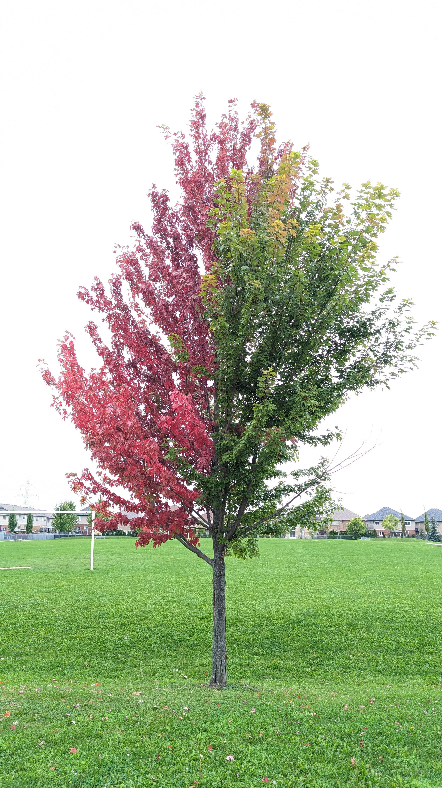

{width="50%"}

------------------------------------------------------------------------

# Overview

In Lectures 01–02 and Worksheets 01–02 your class designed an experiment, collected leaf measurements, organized the data in a spreadsheet, and wrote your first R code. This homework asks you to take the next step on your own: **set up a project, load the class dataset into R, inspect it, and make a first plot** — then push a little further and connect it back to the science, in your own hand.

You will practice the skills from Lectures 01–02:

- Setting up an R project with the correct folder structure
- Installing packages once, loading libraries every session
- Loading data with `read_excel()` and cleaning names with `clean_names()`
- Inspecting a data frame with `glimpse()`, `head()`, and `dim()`
- Using the pipe `%>%` to chain steps
- Making a `geom_point()` plot

**Science context — Our hypotheses:**

> **Null Hypothesis (H₀):** There is no difference in leaf size or shape between the sunny and shady sides of a tree.
>
> **Alternate Hypothesis (Hₐ):** Leaf size differs between the sunny and shady sides of a tree (shady leaves are predicted to be larger).

> **Submit to Canvas:** (1) your completed `01_leaves.R` script, (2) one saved PNG figure, and (3) **one photo of your handwritten Part 4 and Part 5 answers** (a clear phone photo is fine — a single page, both sides if needed). Fill in Parts 1–3 as `#` comments in the script below the relevant code, matching the `# Q__` markers in the skeleton script. **Parts 4 and 5 must be handwritten on paper and photographed — typed answers to those two parts receive at most half credit, even if correct.** I want to see your own reasoning and your own numbers in your own hand, not a pasted answer.

------------------------------------------------------------------------

# The Data

Your class measured leaves from the sunny and shady sides of a tree. The data file `2026_06_25_tree_experiment_raw_data.xlsx` (posted on Canvas) has the following columns:

| Column      | Type | What it holds                           |
|-------------|------|------------------------------------------|
| `index`     | num  | Row number                                |
| `side`      | chr  | `"sunny"` or `"shady"`                    |
| `weight_g`  | num  | Leaf weight **(g)**                       |
| `width_cm`  | num  | Leaf width at the widest point **(cm)**   |
| `height_cm` | num  | Leaf length from base to tip **(cm)**     |

**Reference:** Lectures 01–02 and Worksheets 01–02; Whitlock & Schluter, Ch. 1 — *Statistics and Samples*; [R for Data Science Ch. 1–2](https://r4ds.hadley.nz/)

------------------------------------------------------------------------

# Part 1 · Set up and load (→ Lecture 02, Worksheet 02)

### Get your project organized

Before writing any code, confirm that your project folder looks like this:

```
tree_project/
├── data/
│   └── 2026_06_25_tree_experiment_raw_data.xlsx   ← copy from Canvas; never touch this file
├── scripts/
│   └── 01_leaves.R                                ← your script for this homework
└── figures/                                        ← plots you save will go here
```

Open `tree_project` as your workspace in Positron (**File → Open Folder**).

### Load the data

In your skeleton script, load `tidyverse`, `readxl`, and `janitor`, then load the data with `read_excel()` and clean the column names with `clean_names()`.

After loading, answer:

> **Q1 — Total rows in the dataset:** \_\_\_\_\_\_\_\_
>
> **Q2 — Total columns:** \_\_\_\_\_\_\_\_
>
> **Q3 — Data type of the `side` column (from `glimpse()`):** \_\_\_\_\_\_\_\_

Count leaves by side using `count(tree_df, side)`:

> **Q4 — Number of sunny leaves:** \_\_\_\_\_\_\_\_
>
> **Q5 — Number of shady leaves:** \_\_\_\_\_\_\_\_

------------------------------------------------------------------------

# Part 2 · Inspecting the data (→ Lecture 02, Worksheet 02)

Run `head(tree_df)`, `glimpse(tree_df)`, and `dim(tree_df)` in the skeleton script.

> **Q6 — Paste the first row's `weight_g`, `width_cm`, and `height_cm` values:**
>
> ------------------------------------------------------------------------
>
> **Q7 — In your own words, what does `glimpse()` show you that `head()` does not?**
>
> ------------------------------------------------------------------------

------------------------------------------------------------------------

# Part 3 · Your first plot — `geom_point()` (→ Lecture 02, Worksheet 02)

Complete the plot in the skeleton script: `weight_g` on the y-axis, `width_cm` on the x-axis, colored by `side`. Save it as a PNG at `dpi = 300`.

> **Q8 — Do heavier leaves also tend to be wider? Y / N**
>
> **Q9 — Which side (sunny or shady) looks like it has the heavier leaves, just from eyeballing the plot?**
>
> ------------------------------------------------------------------------

------------------------------------------------------------------------

# Part 4 · Predict, then check — **by hand, on paper** (→ Lecture 02)

Do this part **in this order** — predicting after you already know the answer defeats the point, and it is easy for a grader to tell.

**Your ID number for this assignment:** take the last two digits of your student ID (e.g., ID ...4471 → use `71`). Write that number here: \_\_\_\_\_\_\_\_ — call it your **ID code**.

1. **Before running anything new**, sketch by hand what you expect a boxplot of `weight_g` by `side` to look like (just two rough boxes, roughly where you think the middles and spreads will fall). Do this from memory of your Part 3 scatterplot — no peeking at new output yet.
2. Now run this in your script (new code, not covered in Worksheet 02 — figure it out from the shape of the `geom_point()` code you already wrote):

``` r
tree_df %>%
  ggplot(aes(x = side, y = weight_g)) +
  geom_boxplot()
```

3. **By hand**, compare your sketch to the real plot: were you right about which side is higher, and about which side is more spread out? What surprised you, if anything?
4. In your script, run `tree_df %>% filter(index == <your ID code>)` (if your ID code is larger than the number of rows, use `index == (<your ID code> %% nrow(tree_df))` instead — ask if this is unclear). **By hand**, write down that one leaf's `side`, `weight_g`, `width_cm`, and `height_cm`. This is *your* specific leaf — your answer to Q10 below must use these exact numbers, not the class averages.

------------------------------------------------------------------------

# Part 5 · Connecting back to the science — **by hand, on paper**

Answer these in your own words, **as if explaining to a friend who has never taken a science class** — no textbook jargon. There are no wrong answers here; we are thinking like scientists. Use your own specific numbers from Part 4 where asked.

> **Q10 — Using your specific leaf from Part 4 (Q4 above) and the boxplot from Part 4, explain in plain language whether *that one leaf* looks typical for its side or unusual, and why.**
>
> ------------------------------------------------------------------------
>
> **Q11 — Restate the null and alternate hypotheses in your own words — no copying the wording from the slides.**
>
> ------------------------------------------------------------------------
>
> **Q12 — Why might shady leaves need to be larger to survive? (Think about what a leaf does and what it has less of on the shady side.)**
>
> ------------------------------------------------------------------------
>
> ------------------------------------------------------------------------
>
> **Q13 — Your class measured multiple leaves per side. Why is it important to measure more than one leaf per side rather than just one? Answer using your own analogy — a comparison to something outside of science.**
>
> ------------------------------------------------------------------------
>
> ------------------------------------------------------------------------

------------------------------------------------------------------------

# Submission checklist

Before uploading to Canvas, confirm:

- [ ] `01_leaves.R` runs top to bottom without errors (**Ctrl/Cmd + Shift + Enter**)
- [ ] Parts 1–3 answers (Q1–Q9) are filled in the script as comments
- [ ] `figures/leaf_weight_vs_width.png` exists (dpi = 300)
- [ ] Parts 4–5 (including your sketch, your ID-code leaf, and Q10–Q13) are **handwritten on paper**
- [ ] A single clear photo of your handwritten pages is uploaded to Canvas

------------------------------------------------------------------------

# Going further (optional — no points)

You have not learned `group_by()`, faceting, or trend lines yet — those are coming in Lectures 03–06. If you want a preview, try this in your script (it's fine if you don't fully understand every line yet):

``` r
tree_df %>%
  ggplot(aes(x = width_cm, y = weight_g, color = side)) +
  geom_point(size = 3, alpha = 0.7) +
  geom_smooth(method = "lm", se = TRUE) +
  labs(x = "Leaf width (cm)", y = "Leaf weight (g)",
       color = "Side of tree",
       title = "Leaf weight vs. width — sunny vs. shady") +
  theme_bw()
```

Do the trend lines look similar for sunny and shady leaves? What does it mean if they have different slopes? We'll answer this properly in the GGPlot units.

------------------------------------------------------------------------

*Data collected by BIOL 3810 students, University of Minnesota Duluth. Lectures 01–02 and Worksheets 01–02 cover all skills needed for this assignment.*
