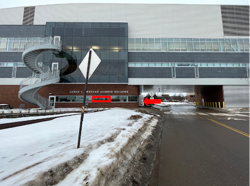

# Lecture 1 · Syllabus

- The syllabus has **all the details** — topics, grading, policies, schedule
- Read it before Thursday
- It will evolve — check Canvas for the current version

::: {.callout-note}
**✅ Key idea**

The syllabus is the contract between us. If something is unclear, ask now — not at exam time.
:::

# Lecture 1 · Who am I?

:::: {.columns}
::: {.column width="60%"}
- **Bill Perry** — call me Bill or Dr. Perry
- Office: Swenson Science Building 13
- Phone: 218-726-8145
- Email: wlperry\@d.umn.edu
- Drop-in hours: Monday 12:15–1:15, Tuesday 2–3 (tentative)
- Lab: SSB 170

::: {.callout-tip}
**Best way to reach me:** email or drop in.
If I am in the lab I am usually around.
:::
:::
::: {.column width="40%"}

:::
::::

# Lecture 1 · My goals for this course

- Help you learn the tools to **organize and present data** from potentially very large datasets
- How to use **Excel** for some tasks — and when to stop using it
- How to use **R** — a coding language — to work with data and graphics
- How to **organize, clean, summarize, and visualize** data — the pipeline
- How to formulate and test **hypotheses**
- How to use **statistics** to test those hypotheses
- How to **interpret** what the data is telling us

::: {.callout-note}
**The pipeline:** raw data → clean → summarize → visualize → test → report
This course teaches every step.
:::

# Lecture 1 · My expectations

:::: {.columns}
::: {.column width="60%"}
- **Communication** — ask questions in class, in office hours, by email
- **Practice** — the only way to learn to code is to write code
- **Failure** — every error message is information; celebrate finding bugs
- **Learn to troubleshoot** — reading error messages is a skill we will practice

::: {.callout-important}
**Getting stuck is not failing — it is the job.**

Every working data scientist searches Google for error messages every single day.
:::
:::
::: {.column width="40%"}
**What I will do:**

- Provide clear examples
- Walk through code line by line
- Give you real datasets to work with

**What you need to do:**

- Type the code yourself (do not copy-paste)
- Run it, break it, fix it
- Bring questions to class
:::
::::

# Lecture 1 · Science

:::: {.columns}
::: {.column width="60%"}
- Science is a way to **acquire, organize, and apply knowledge**
- We make **predictions** and test them with a **falsifiable approach** — statistics
- Explanations that **cannot be tested or falsified** are not science

**Example:**
- "Leaves on the shady side are bigger" — **testable**
- "The forest has a spirit that controls leaf size" — **not testable**
:::
::: {.column width="40%"}
::: {.callout-note}
**📖 New vocabulary**

**Falsifiable** = a prediction that could, in principle, be shown to be wrong.

A good hypothesis is one you could prove false with the right data.
:::
:::
::::

# Today · Real-world data science

- Talking about data science is **super boring**
- The only way to learn it is to **do it** — collect data, enter it, analyze it
- This lecture and the next will be about how to work with data from the **very start**
- Your task: **collect data → organize it → enter it into a spreadsheet → develop metadata**

::: {.callout-tip}
**🖐 Try it yourself**

We are going to go outside, collect leaves, and build our first dataset today.
That dataset will follow us for the first half of the course.
:::

# What will we do

:::: {.columns}
::: {.column width="60%"}
- We are going to **measure something in nature**
- Suggestion: leaf mass and surface area from the **sunny side vs. shady side** of a tree
  - Do leaves respond to light intensity?

**The null hypothesis (H₀):**

*There is no difference in leaf size or shape between the two sides of a tree.*

**The alternate hypothesis (Hₐ):**

*Leaf size differs between the sunny and shady sides.*
:::
::: {.column width="40%"}
::: {.callout-note}
**📖 New vocabulary**

**Null hypothesis (H₀)** — the "nothing is happening" claim.
Statistics will tell us whether the data are consistent with this or not.

**Alternate hypothesis (Hₐ)** — the claim we think might be true.
:::
:::
::::

# How does leaf size vary?

- Does the sunny side vs. shady side of a tree differ due to light?
- **Predict:** what do you think will happen before we collect any data?

  *Your prediction:*

- **Hypothesize:** what is the formal testable statement?

  *Your null hypothesis:*

  *Your alternate hypothesis:*

::: {.callout-tip}
**Key distinction**

A **prediction** says what you think will happen.
A **hypothesis** is a formal statement that can be accepted or rejected with data.
:::

# How would we collect data to test this?

- Can we collect leaves from **one tree** to do this?
  - YES? NO? — Discuss
- What is the problem with using only one tree?
- How might results from many trees differ from one tree?
- Do we need to be sure our sample is **randomly selected**?
  - Why do we need to randomize?
  - How can we randomize our sampling?

::: {.callout-important}
**Replication and randomization**

These two principles are the foundation of all experimental design.
One tree is a sample size of one — we cannot generalize from that.
:::

# What variables could we record?

:::: {.columns}
::: {.column width="60%"}
- What variables could we record about the **tree**?
- What variables could we record about the **leaf**?

**Dependent variable (response):**
- The thing we measure — it *depends on* our treatment
- Example: leaf mass, leaf area

**Independent variable (explanatory):**
- The thing we control or group by
- Example: side of tree (sunny vs. shady)
:::
::: {.column width="40%"}
::: {.callout-note}
**📖 New vocabulary**

**Dependent variable** → what you measure (Y)

**Independent variable** → what you control or group by (X)

In a graph: Y goes on the vertical axis, X goes on the horizontal axis.
:::
:::
::::

# Each group needs to collect at least 3 pairs of leaves

- Collect **1 mature leaf from the sunny side** and **1 from the shady side** of the same tree
- Do this on **at least 2 separate trees** (we share trees since we are limited)
- Standardize your collection:
  - How high do we collect from?
  - What does "mature" mean?
  - Any other decisions to standardize?

::: {.callout-important}
**⚠️ Watch out!**

If everyone collects differently (different heights, different leaf ages), we cannot combine our data. Agree on the rules **before** collecting.
:::

# Back in the lab · Before we begin

:::: {.columns}
::: {.column width="60%"}
**What can we measure?**

- mass (grams)
- length (mm or cm)
- width (mm or cm)
- surface area (cm²) — how?
- others?

**Decisions to make as a group:**

- What units?
- What abbreviations?
- What if a leaf is damaged?
:::
::: {.column width="40%"}
::: {.callout-note}
**📖 New vocabulary**

**Metadata** = data *about* your data.

Who collected it? When? Where? With what instrument? Under what conditions?

Without metadata, data are nearly useless to anyone else — including future you.
:::
:::
::::

# Back in the lab · Setting up the spreadsheet

- How do you enter this into the Excel sheet?
  - What does the sheet look like? Mock something up
- What are the **column names** you will use?
- What are the **units** for each column?
- What is the **vocabulary**? (no spaces in column names, use `_` instead)
- Where does the **metadata** go?

::: {.callout-tip}
**Best practice for column names:**

`leaf_mass_g`, not `Leaf Mass (g)`

Consistent, no spaces, no special characters, units in the name.
:::

# Can you make a graph in Excel?

- Using what you collected, make a simple Excel chart
  - What would the graph look like?
  - What goes on the X axis? The Y axis?
  - What can you derive from the data already?

::: {.callout-note}
Excel is great for a first look. But as datasets grow larger and analyses more complex, we need R. Starting Thursday you will see why.
:::

# What R code looks like · A preview

You do not need to understand this yet — just look at the shape of it.

```r
# Load the tools we need
library(tidyverse)
library(readxl)

# Read our leaf data into R
tree_df <- read_excel("data/tree_experiment.xlsx")

# Compute the mean weight for each side
tree_df %>%
  group_by(side) %>%
  summarize(mean_weight = mean(weight_g))

# Make a plot
ggplot(tree_df, aes(x = side, y = weight_g)) +
  geom_boxplot()
```

::: {.callout-tip}
**🖐 Notice**

It reads almost like English: *take tree_df, then group by side, then compute the mean*.
That is the goal — code that tells a clear story.
:::

# Before Thursday · Install R and Positron

Downloading R and Positron:

1. Download **R** — [cran.r-project.org](https://cran.r-project.org/)
   - Installs to your computer — can you find it?
2. Download **Positron** — [positron.posit.co](https://positron.posit.co/download.html)
   - Install **R first**, then Positron — Positron needs to find R on your machine

::: {.callout-important}
**⚠️ Watch out!**

Install R first, then Positron.
If you install Positron first, it may not find R automatically.
:::

*See you Thursday — bring your laptop and the leaf data you entered in Excel.*
