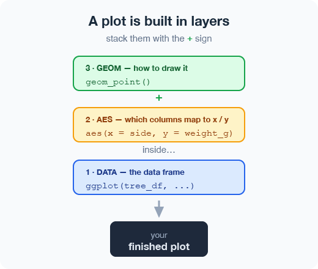
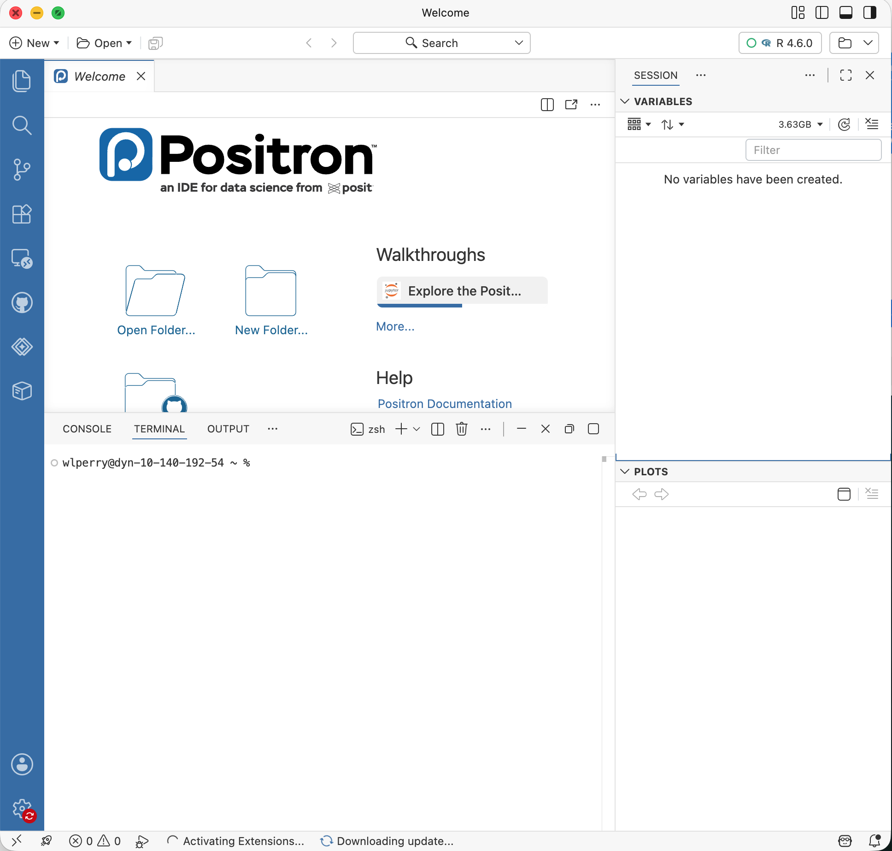
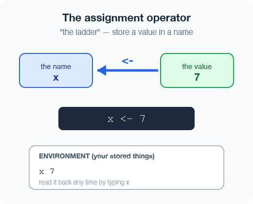
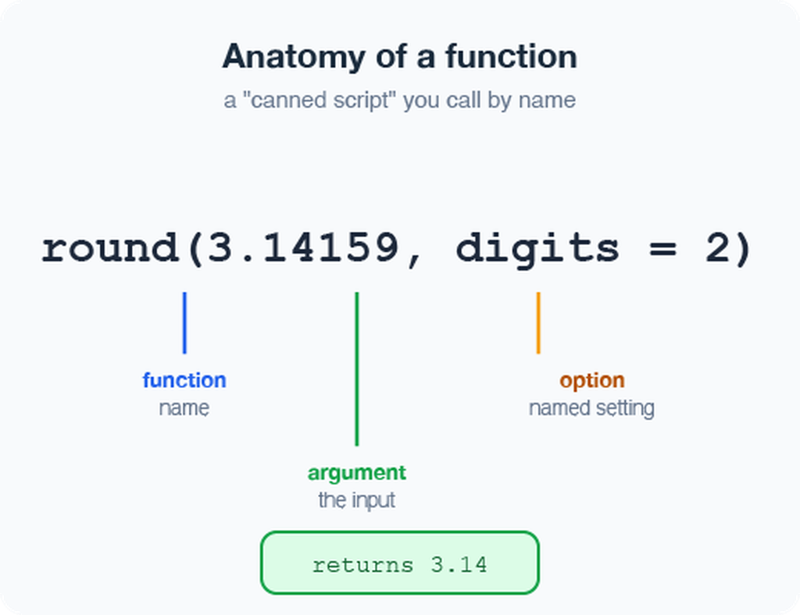
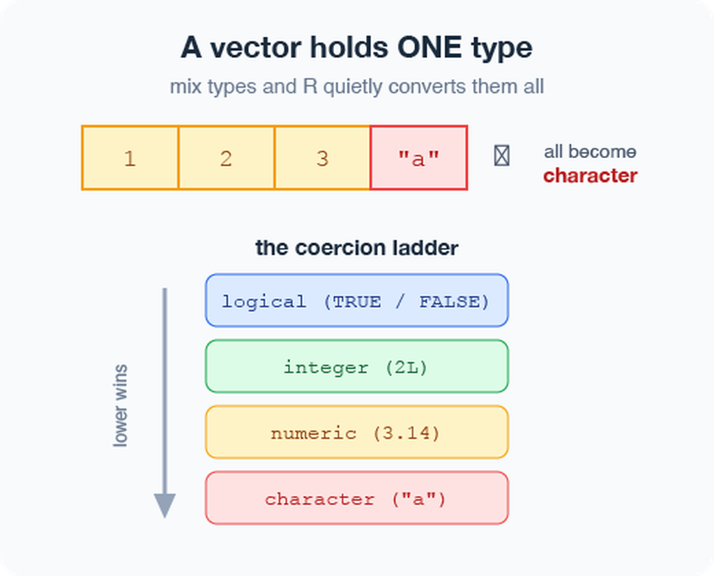
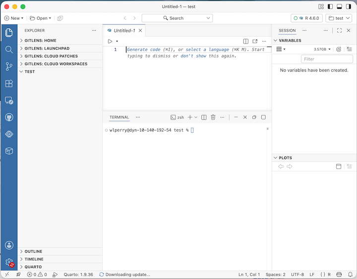
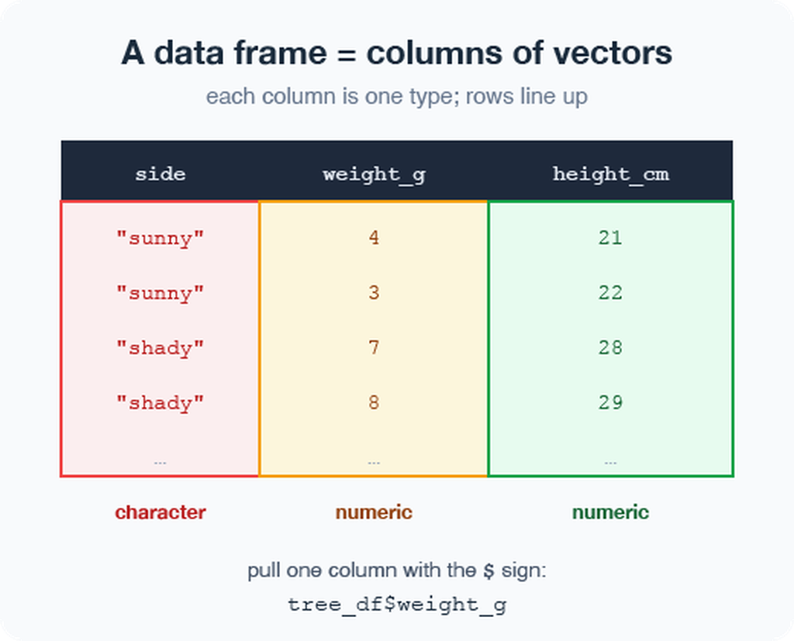
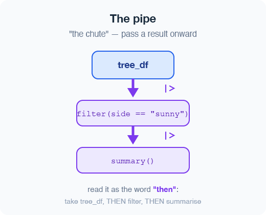
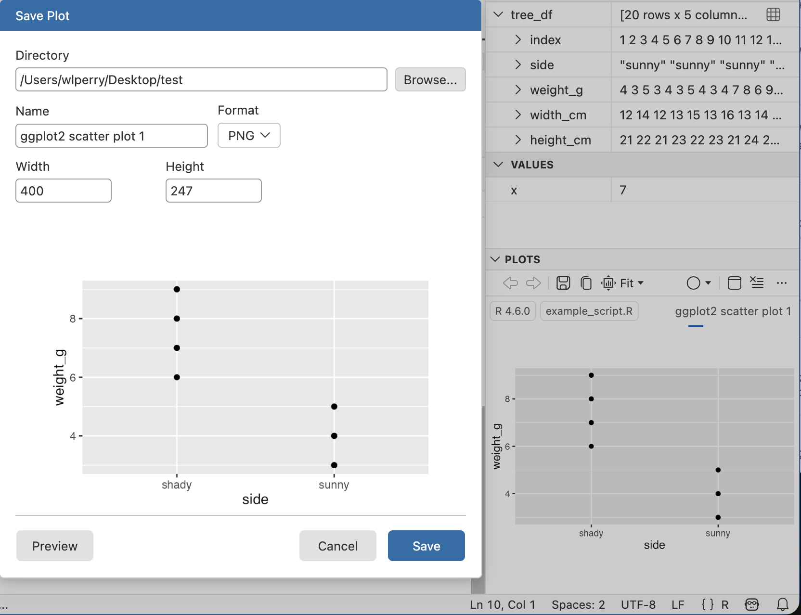

# Where we left off (Lecture 01)

- **Science fundamentals** — falsifiable predictions; null vs. alternate hypotheses
- **Our class project** — leaf morphology: *sunny vs. shady* sides of trees
- **Design** — randomization, replication (multiple trees), sampling limits
- **Variables** — dependent (leaf mass/size) vs. independent (side of tree)
- **Spreadsheet hygiene** — metadata, consistent column names, units, clean sheet design
- **Installed** R and Positron before today

::: {.callout-note}
**✅ Key idea**

Today we take that tidy spreadsheet and bring it to life in R.
:::

# Goals for today

:::: {.columns}
::: {.column width="60%"}
- Get **R** and **Positron** oriented — the four panes
- Organize a project so future-you can find things
- Learn how R actually works:
  - using it as a **calculator**
  - storing things with `<-`
  - **functions**, **vectors**, and **data types**
  - writing a **script**
- Load our tree data and make a **first plot**

::: {.callout-tip}
**🖐 Try it yourself**

By the end you will run real code on **our** leaf data — not a toy dataset.
:::
:::
::: {.column width="40%"}

:::
::::

# Part 1 · Setting up

### What is R, really?

:::: {.columns}
::: {.column width="60%"}
- **R** is the engine — a free language for data and statistics
- We drive that engine through an **IDE** (a code editor)
- Two good IDEs — you may try both:
  - **Positron** — what we use *(recommended)*
  - **RStudio** — the long-time classic

::: {.callout-note}
**📖 New word**

**IDE** = *Integrated Development Environment*.
Think of R as the car engine and the IDE as the seat, wheel, and dashboard.
:::
:::
::: {.column width="40%"}

:::
::::

# Organize the project *before* you code

:::: {.columns}
::: {.column width="60%"}
Make **one folder per project**. Everything for the tree experiment lives together:

```
tree_project/
├── data/          ← your Excel and CSV files
├── scripts/       ← your .R code files
└── figures/       ← plots you save
```

- In Positron: **File → Open Folder…** and pick this folder
- Every path is then **relative** to the project — no more `C:/Users/.../Desktop/...` nightmares

::: {.callout-note}
**✅ Key idea**

A tidy folder today saves an hour of "where did I put that file?" next week.
:::
:::
::: {.column width="40%"}
::: {.callout-note}
**📊 Coming from Excel?**

In Excel you keep one big file. In R we keep **raw data untouched** and write *new* processed files — so you can always trace your steps and never overwrite your original numbers.
:::
:::
::::

# A quick tour of Positron

:::: {.columns}
::: {.column width="60%"}
Four panes you will use constantly:

- **Editor** (top-left) — your scripts live here
- **Console / Terminal** (bottom) — where code runs
- **Variables / Session** (right) — everything you have stored
- **Plots** (right) — your figures appear here

::: {.callout-tip}
**🖐 Try it yourself**

Find each pane on your screen now. Click the **Console** tab — that is where we start next.
:::
:::
::: {.column width="40%"}

:::
::::

# Part 2 · How R works

### R is a calculator

:::: {.columns}
::: {.column width="60%"}
Type math straight into the **console** and press Enter:

```r
3 + 5
12 / 7
2 ^ 10
```

R answers immediately. The console is great for quick "what is the answer?" questions.

::: {.callout-warning}
**⚠️ Watch out!**

A `+` at the start of the console line means R is **still waiting** for you to finish a command. Press Esc to start over.
:::
:::
::: {.column width="40%"}
::: {.callout-note}
**📊 Coming from Excel?**

This is just like typing `=3+5` into an Excel cell — except there are no cells, just a line you type and run.
:::
:::
::::

# Storing values with `<-`

:::: {.columns}
::: {.column width="60%"}
To keep a value, give it a **name** with the assignment operator `<-`:

```r
x <- 7          # store 7 under the name x
x               # type the name to read it back
x * 2           # use it in math
```

- `<-` puts the value into your **environment** (look in the Variables pane!)
- Shortcut: Alt + - (Win) or Option + - (Mac) types `<-` for you

::: {.callout-note}
**📖 New word**

**Assignment operator** `<-` = "take the thing on the right and store it under the name on the left."
:::
:::
::: {.column width="40%"}

:::
::::

# Naming your objects well

:::: {.columns}
::: {.column width="60%"}
Good names make code readable months later:

- Be **explicit**, not too long: `leaf_mass`, not `x2`
- **Cannot start with a number** — `x2` ✅, `2x` ❌
- R is **case-sensitive** — `weight_g` ≠ `Weight_g`
- Use **`lower_snake_case`** — words separated by underscores

```r
leaf_mass   <- c(4, 3, 5, 7)   # good
LeafMass    <- c(4, 3, 5, 7)   # works but avoid
leaf.mass   <- c(4, 3, 5, 7)   # avoid dots
```

::: {.callout-warning}
**⚠️ Watch out!**

`weight_g` and `weight_G` are two *different* objects. Pick one style and stick with it.
:::
:::
::: {.column width="40%"}
::: {.callout-note}
**📖 New word**

**Object** (R) = **variable** (Excel/other languages). Same idea: a named container that holds something.

Our naming convention throughout this course:
- data frames → `_df`
- plots → `_plot`
- models → `_model`
:::
:::
::::

# Leave notes with comments `#`

:::: {.columns}
::: {.column width="60%"}
Anything to the right of `#` is **ignored by R** — it is a note for humans:

```r
# weights of four leaves, in grams
leaf_mass <- c(4, 3, 5, 7)

mean(leaf_mass)   # average leaf mass
```

- Comment generously — your future self will thank you
- Shortcut to toggle: Ctrl/Cmd + Shift + C

::: {.callout-note}
**✅ Key idea**

If a line confused you while writing it, comment *why* you did it.
:::
:::
::: {.column width="40%"}
::: {.callout-note}
**📊 Coming from Excel?**

Comments are like the notes you scribble in a cell — but they never get in the way of the numbers or the code.
:::
:::
::::

# Functions and their arguments

:::: {.columns}
::: {.column width="60%"}
A **function** is a canned script you call by name. You feed it **arguments** (inputs); it **returns** a result:

```r
sqrt(10)                         # one argument
round(3.14159)                   # default: 0 digits → 3
round(3.14159, 2)                # two digits → 3.14
round(x = 3.14159, digits = 2)  # named arguments
```

Stuck on a function?

```r
?round        # open the help page
args(round)   # what arguments does it take?
```

::: {.callout-note}
**📖 New word**

**Argument** = an input you hand to a function inside its `( )`.
:::
:::
::: {.column width="40%"}

:::
::::

# Vectors — a row of values

:::: {.columns}
::: {.column width="60%"}
A **vector** is a series of values built with `c()` ("combine"):

```r
weight_g <- c(4, 3, 5, 7)          # numbers
side     <- c("sunny", "shady")     # text needs quotes
```

Inspect any vector:

```r
length(weight_g)   # how many values?
class(weight_g)    # what type?
str(weight_g)      # quick structure overview
```

::: {.callout-warning}
**⚠️ Watch out!**

Quotes matter: `"sunny"` is text. Without quotes, R hunts for an **object** named `sunny` and errors when it cannot find one.
:::
:::
::: {.column width="40%"}
::: {.callout-note}
**✅ Key idea**

A vector is the workhorse of R. A spreadsheet **column** is really just a vector.
:::
:::
::::

# Data types live inside vectors

:::: {.columns}
::: {.column width="60%"}
Every vector holds **one type**:

- `numeric` — `4`, `3.5`
- `character` — `"sunny"`
- `logical` — `TRUE` / `FALSE`

Mix types and R quietly **coerces** them all to one:

```r
c(1, 2, 3, "a")     # all become character
c(1, 2, 3, TRUE)    # TRUE becomes 1
class(c(1, 2, 3, "a"))
```

::: {.callout-note}
**📖 New word**

**Coercion** = R automatically converting everything in a vector to a single shared type.
:::
:::
::: {.column width="40%"}

:::
::::

# Part 3 · From console to script

### Do not retype — use a **script**

:::: {.columns}
::: {.column width="60%"}
The console forgets. A **script** (`.R` file) remembers and re-runs.

- **File → New File → R File** opens a blank script
- Type your commands, one per line
- Put the cursor on a line and press Ctrl/Cmd + Enter to run it
- **Save** with Ctrl/Cmd + S — reopen later and re-run everything

```r
x    <- 7
y    <- 5
x + y
```

::: {.callout-note}
**✅ Key idea**

Console = scratch paper. Script = the lab notebook you keep.
:::
:::
::: {.column width="40%"}

:::
::::

# Packages — extending what R can do

:::: {.columns}
::: {.column width="60%"}
Like apps for your phone, **packages** add new abilities to R.

**Install once** — downloads to your computer (do this in the Console, not in your script):

```r
install.packages("tidyverse")
install.packages("readxl")
```

**Load every session** — activates it for today (put this at the top of every script):

```r
library(tidyverse)   # data wrangling + plotting
library(readxl)      # read Excel files
```

::: {.callout-warning}
**⚠️ Watch out!**

If R says *"could not find function `read_excel`"*, you forgot the `library(readxl)` line.
:::
:::
::: {.column width="40%"}
::: {.callout-note}
**📖 New words**

**Package** = the installed toolbox (install once).

**Library** = loading that toolbox into today's session (every session).
:::
:::
::::

# Part 4 · Loading our data

### Two functions for two file types

:::: {.columns}
::: {.column width="60%"}
Put your files in the project's `data/` folder, then:

```r
library(tidyverse)
library(readxl)

# Excel files (.xlsx)
tree_df <- read_excel("data/2026_06_25_tree_experiment_raw_data.xlsx")

# CSV files (.csv) — used by NOAA, iNaturalist, many databases
noaa_df <- read_csv("data/noaa_global_yearly_temps.csv")
```

::: {.callout-note}
**✅ Key idea**

`read_excel()` needs `library(readxl)`.
`read_csv()` comes with `library(tidyverse)` — no extra install needed.
:::
:::
::: {.column width="40%"}
::: {.callout-note}
**📊 Coming from Excel?**

`read_excel()` and `read_csv()` are the bridge from your file into R. Your file's first row becomes the **column names** in R.
:::
:::
::::

# Meet the data frame

:::: {.columns}
::: {.column width="60%"}
A **data frame** is a table: each **column is a vector** of one type, and the rows line up.

Our `tree_df` has five columns:

- `index` — leaf number *(numeric)*
- `side` — `"sunny"` / `"shady"` *(character)*
- `weight_g`, `width_cm`, `height_cm` *(numeric)*

Pull a single column with `$`:

```r
tree_df$weight_g     # just the weights, as a vector
```

::: {.callout-note}
**📖 New word**

**Data frame** = R's word for a spreadsheet-style table.
:::
:::
::: {.column width="40%"}

:::
::::

# Look at your data before trusting it

:::: {.columns}
::: {.column width="60%"}
Always eyeball a new data frame:

```r
head(tree_df)      # first 6 rows
tail(tree_df)      # last 6 rows
dim(tree_df)       # rows, columns  → 20  5
names(tree_df)     # column names

# Tidyverse-style structure check (prefer this over str):
glimpse(tree_df)   # one line per column: name, type, first values

# Base R equivalent:
str(tree_df)       # same information, different layout
```

::: {.callout-tip}
**🖐 Try it yourself**

Run `glimpse(tree_df)`. How many rows? What type is `side`?
:::
:::
::: {.column width="40%"}
::: {.callout-note}
**✅ Key idea**

Check `dim()` and `glimpse()` every single time you load data. Typos and wrong column types hide here.
:::

::: {.callout-warning}
**⚠️ Watch out!**

If a number column shows as `<chr>`, a stray letter or comma snuck into your spreadsheet.
:::
:::
::::

# The pipe `%>%` — read it as "then"

:::: {.columns}
::: {.column width="60%"}
The **pipe** sends a result straight into the next function. Read `%>%` as the word **"then"**:

```r
# Start with simple examples:
tree_df %>% nrow()         # take tree_df, THEN count rows
tree_df %>% names()        # take tree_df, THEN list column names
tree_df %>% summary()      # take tree_df, THEN summarize

# Chain two steps:
tree_df %>%
  head(3)                  # take tree_df, THEN show first 3 rows
```

In Lecture 03 we will chain more steps together.

::: {.callout-note}
**📖 New word**

**Pipe** `%>%` = "take what is on the left and feed it to the function on the right."
:::
:::
::: {.column width="40%"}


::: {.callout-note}
**Two pipes — same idea:**

`%>%` — from tidyverse (we use this one)
`|>` — built into R 4.1+ (the "native pipe")

They behave identically for everything in this course.
:::
:::
::::

# Part 5 · Your first plot

### ggplot: build a picture in layers

:::: {.columns}
::: {.column width="60%"}
Plots are built from three core pieces, joined with `+`:

```r
ggplot(tree_df, aes(x = side, y = weight_g))
```

1. **data** — which data frame (`tree_df`)
2. **aes** — which columns map to x and y
3. **geom** — how to draw it (add with `+`)

```r
ggplot(tree_df, aes(x = side, y = weight_g)) +
  geom_point()
```

::: {.callout-warning}
**⚠️ Watch out!**

The `+` must sit at the **end** of a line, never the start. `+` at the start = error.
:::
:::
::: {.column width="40%"}

:::
::::

# Improve it one layer at a time

:::: {.columns}
::: {.column width="60%"}
Since `side` is a category, a **boxplot** with the raw points on top tells the story well:

```r
ggplot(tree_df, aes(x = side, y = weight_g)) +
  geom_boxplot() +
  geom_jitter(width = 0.15, alpha = 0.6, color = "tomato") +
  labs(x = "Side of tree",
       y = "Leaf weight (g)",
       title = "Sunny vs. shady leaves")
```

::: {.callout-tip}
**🖐 Try it yourself**

Swap `weight_g` for `height_cm`. What changes?
Try `geom_violin()` instead of `geom_boxplot()`.
:::
:::
::: {.column width="40%"}

:::
::::

# Save your plot and your script

:::: {.columns}
::: {.column width="60%"}
Store the plot in an object, then save it as a PNG:

```r
leaf_plot <- ggplot(tree_df, aes(x = side, y = weight_g)) +
  geom_boxplot()

# Save to the figures/ folder — always use PNG, dpi = 300
ggsave("figures/leaf_weight.png",
       plot   = leaf_plot,
       width  = 6,
       height = 6,
       units  = "in",
       dpi    = 300)
```

::: {.callout-warning}
**⚠️ Watch out!**

`ggsave()` wants the **filename first**, then `plot =`.
Also: `dpi = 300` is publication quality — always use it.
:::
:::
::: {.column width="40%"}
::: {.callout-note}
**📖 File format tip**

Save figures as **PNG** (`.png`) for reports and Canvas submissions.

`dpi = 300` means 300 dots per inch — high enough for print and posters.
:::
:::
::::

# Wrap-up · What you can now do

:::: {.columns}
::: {.column width="60%"}
- Set up R + Positron and organize a project folder
- Use R as a calculator and **store values** with `<-`
- Write and run a **script**, with `#` comments
- Call **functions** and read their help with `?`
- Build **vectors**, know their types
- Load Excel and CSV data with `read_excel()` and `read_csv()`
- Inspect a data frame with `glimpse()`, `head()`, `dim()`
- Use the **pipe** `%>%` to chain steps
- Make and **save** a first `ggplot` as a PNG

::: {.callout-tip}
**🖐 Before next class**

Load `tree_df`, run `glimpse()`, and make one plot of `width_cm` by `side`. Save it to `figures/`.
:::
:::
::: {.column width="40%"}
::: {.callout-note}
**✅ Key idea**

You went from a blank console to a saved figure of **our** data. That is the whole workflow in miniature.
:::

**Up next — Lecture 03:**

- `filter()` — pick rows
- `select()` — pick columns
- `mutate()` — create new columns
- `arrange()` — sort rows
- Then: descriptive statistics on our leaf data
:::
::::

# Getting unstuck

:::: {.columns}
::: {.column width="60%"}
When code breaks (it will — that is normal):

- `?function_name` — the built-in help page
- Read the **error message** out loud; it usually names the line
- Check: did you load `library(tidyverse)` and `library(readxl)`?
- Check: spelling? A missing `)` or `+`?
- The **posit/tidyverse cheatsheets** are excellent: [posit.co/resources/cheatsheets](https://posit.co/resources/cheatsheets/)
- Bring the exact error (copy-paste it) to class or office hours

::: {.callout-note}
**✅ Key idea**

Every coder googles error messages daily. Getting stuck is not failing — it is the job.
:::
:::
::: {.column width="40%"}
::: {.callout-note}
**📊 Coming from Excel?**

In Excel you fix errors by clicking around. In R you fix them by **reading the message** and editing one line. Slower at first, far more powerful soon.
:::
:::
::::
