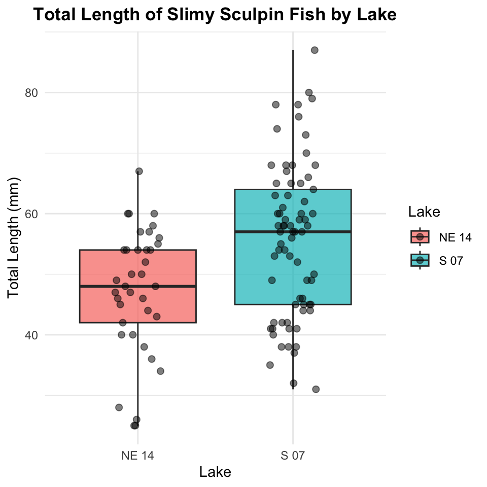
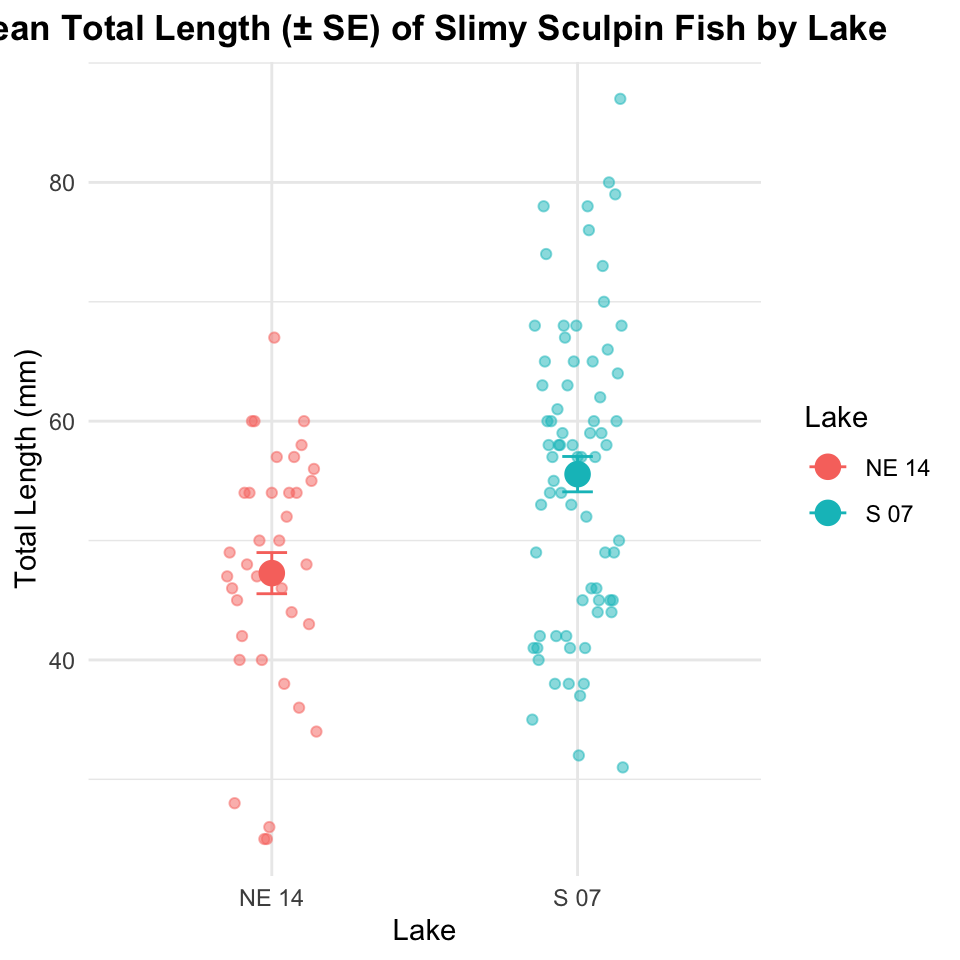
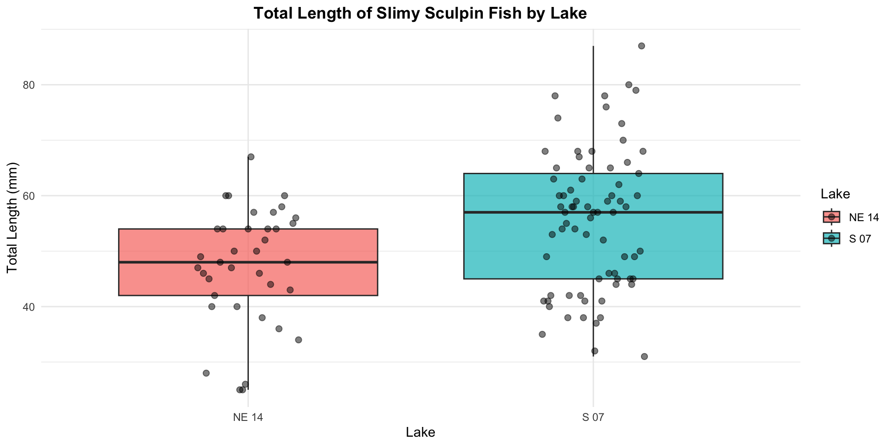
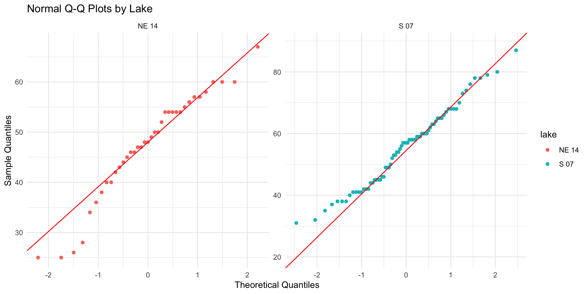
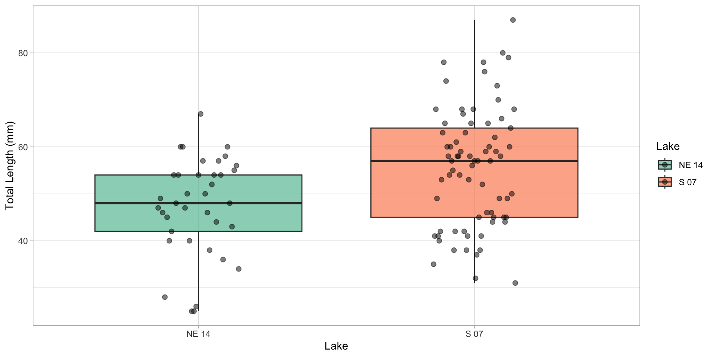
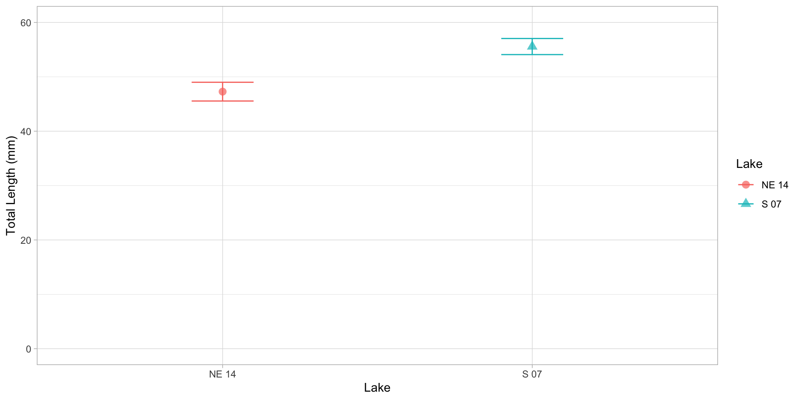

# Introduction to Two-Sample t-Test

## Background and Theory

The two-sample t-test (also known as independent samples t-test) is used to determine whether there is a statistically significant difference between the means of two independent groups. In this analysis, we will examine whether there are significant differences in the total length of slimy sculpin fish between two different lakes.

The two-sample t-test makes the following comparison:

$$H_0: \mu_1 = \mu_2$$ $$H_A: \mu_1 \neq \mu_2$$

Where:

- \- $H_0$ is the null hypothesis stating that the population means are equal

- \- $H_A$ is the alternative hypothesis stating that the population means are different

- \- $\mu_1$ is the population mean of the first group

- \- $\mu_2$ is the population mean of the second group

## Formula

The formula for the two-sample t-test with equal variances (pooled variance) is:

$$t = \frac{\bar{x}_1 - \bar{x}_2}{s_p \sqrt{\frac{1}{n_1} + \frac{1}{n_2}}}$$

Where:

- \- $\bar{x}_1$ is the sample mean of the first group

- \- $\bar{x}_2$ is the sample mean of the second group

- \- $s_p$ is the pooled standard deviation

- \- $n_1$ is the sample size of the first group

- \- $n_2$ is the sample size of the second group

The pooled standard deviation is calculated as:

$$s_p = \sqrt{\frac{(n_1-1)s_1^2 + (n_2-1)s_2^2}{n_1 + n_2 - 2}}$$

Where:

- \- $s_1^2$ is the variance of the first group

- \- $s_2^2$ is the variance of the second group

- The degrees of freedom (df) for this test is $n_1 + n_2 - 2$.

**For unequal variances (Welch's t-test), the formula is slightly different:**

$$t = \frac{\bar{x}_1 - \bar{x}_2}{\sqrt{\frac{s_1^2}{n_1} + \frac{s_2^2}{n_2}}}$$

**With degrees of freedom approximated using the Welch-Satterthwaite equation:**

$$df = \frac{(\frac{s_1^2}{n_1} + \frac{s_2^2}{n_2})^2}{\frac{(s_1^2/n_1)^2}{n_1-1} + \frac{(s_2^2/n_2)^2}{n_2-1}}$$

# Data Analysis

## Loading Libraries and Data


::: {.cell}

```{.r .cell-code}
# Load required libraries
# install.packages("gt")
library(gt)
library(broom)
library(car)  # For Levene's test
# library(ggpubr)  # For adding p-values to plots
library(coin)  # For permutation tests
library(rcompanion)  # For plotNormalHistogram
library(skimr)
library(tidyverse)


# Load the data
sculpin_df <- read_csv("data/t_test_sculpin_s07_ne14.csv")

# Preview the data
head(sculpin_df)
```

::: {.cell-output .cell-output-stdout}

```
# A tibble: 6 × 5
   site lake  species       length_mm mass_g
  <dbl> <chr> <chr>             <dbl>  <dbl>
1   109 NE 14 slimy sculpin        47   0.7 
2   109 NE 14 slimy sculpin        49   0.9 
3   109 NE 14 slimy sculpin        46   0.7 
4   109 NE 14 slimy sculpin        28   0.15
5   109 NE 14 slimy sculpin        45   0.65
6   109 NE 14 slimy sculpin        40   0.3 
```


:::
:::


## Data Overview

Let's first examine the structure of our dataset:


::: {.cell}

```{.r .cell-code}
sculpin_df %>% 
  group_by(lake) %>% 
  skim()
```

::: {.cell-output-display}

Table: Data summary

|                         |           |
|:------------------------|:----------|
|Name                     |Piped data |
|Number of rows           |110        |
|Number of columns        |5          |
|_______________________  |           |
|Column type frequency:   |           |
|character                |1          |
|numeric                  |3          |
|________________________ |           |
|Group variables          |lake       |


**Variable type: character**

|skim_variable |lake  | n_missing| complete_rate| min| max| empty| n_unique| whitespace|
|:-------------|:-----|---------:|-------------:|---:|---:|-----:|--------:|----------:|
|species       |NE 14 |         0|             1|  13|  13|     0|        1|          0|
|species       |S 07  |         0|             1|  13|  13|     0|        1|          0|


**Variable type: numeric**

|skim_variable |lake  | n_missing| complete_rate|   mean|    sd|     p0|    p25|    p50|    p75|   p100|hist  |
|:-------------|:-----|---------:|-------------:|------:|-----:|------:|------:|------:|------:|------:|:-----|
|site          |NE 14 |         0|             1| 109.00|  0.00| 109.00| 109.00| 109.00| 109.00| 109.00|▁▁▇▁▁ |
|site          |S 07  |         0|             1| 152.00|  0.00| 152.00| 152.00| 152.00| 152.00| 152.00|▁▁▇▁▁ |
|length_mm     |NE 14 |         0|             1|  47.27| 10.49|  25.00|  42.00|  48.00|  54.00|  67.00|▂▃▇▇▂ |
|length_mm     |S 07  |         0|             1|  55.56| 12.65|  31.00|  45.00|  57.00|  64.00|  87.00|▅▅▇▃▂ |
|mass_g        |NE 14 |         0|             1|   0.89|  0.52|   0.10|   0.45|   0.85|   1.25|   2.30|▇▇▇▂▁ |
|mass_g        |S 07  |         0|             1|   1.66|  1.23|   0.25|   0.80|   1.45|   2.10|   7.37|▇▃▁▁▁ |


:::
:::


### Manual Summary Method


::: {.cell}

```{.r .cell-code}
stats_df <- sculpin_df %>% 
  group_by(lake) %>% 
  summarize(mean_length_mm = round(mean(length_mm, na.rm=TRUE),2),
            stddev_length_mm = round(sd(length_mm, na.rm=TRUE),2),
            stderr_length_mm = round(sd(length_mm, na.rm=TRUE)/sum(!is.na(length_mm)),2),
            coef_var_length_mm = 
              round((sd(length_mm, na.rm=TRUE)/mean(length_mm, na.rm=TRUE))*100,2))
stats_df
```

::: {.cell-output .cell-output-stdout}

```
# A tibble: 2 × 5
  lake  mean_length_mm stddev_length_mm stderr_length_mm coef_var_length_mm
  <chr>          <dbl>            <dbl>            <dbl>              <dbl>
1 NE 14           47.3             10.5             0.28               22.2
2 S 07            55.6             12.6             0.17               22.8
```


:::
:::


### Fancy Table with the tidytable package


::: {.cell}

```{.r .cell-code}
gt_table <- stats_df %>% 
  gt() %>% 
  tab_header(
    title = "Table 1. Sculpin Length Statistics by Lake") %>% 
  cols_label(
    lake = "Lake",
    mean_length_mm = "Mean Length (mm)",
    stddev_length_mm = "Std Dev (mm)",
    stderr_length_mm = "Std Error (mm)",
    coef_var_length_mm = "CV (%)"
  )%>%
  tab_options(
    table.border.top.style = "none",
    table.border.bottom.style = "solid",
    column_labels.border.bottom.style = "solid",
    table_body.border.top.style = "none",
    table_body.hlines.style = "none")%>%
   opt_align_table_header(align = "left")
gt_table
```

::: {.cell-output-display}

```{=html}
<div id="mtpauwccyu" style="padding-left:0px;padding-right:0px;padding-top:10px;padding-bottom:10px;overflow-x:auto;overflow-y:auto;width:auto;height:auto;">
<style>#mtpauwccyu table {
  font-family: system-ui, 'Segoe UI', Roboto, Helvetica, Arial, sans-serif, 'Apple Color Emoji', 'Segoe UI Emoji', 'Segoe UI Symbol', 'Noto Color Emoji';
  -webkit-font-smoothing: antialiased;
  -moz-osx-font-smoothing: grayscale;
}

#mtpauwccyu thead, #mtpauwccyu tbody, #mtpauwccyu tfoot, #mtpauwccyu tr, #mtpauwccyu td, #mtpauwccyu th {
  border-style: none;
}

#mtpauwccyu p {
  margin: 0;
  padding: 0;
}

#mtpauwccyu .gt_table {
  display: table;
  border-collapse: collapse;
  line-height: normal;
  margin-left: auto;
  margin-right: auto;
  color: #333333;
  font-size: 16px;
  font-weight: normal;
  font-style: normal;
  background-color: #FFFFFF;
  width: auto;
  border-top-style: none;
  border-top-width: 2px;
  border-top-color: #A8A8A8;
  border-right-style: none;
  border-right-width: 2px;
  border-right-color: #D3D3D3;
  border-bottom-style: solid;
  border-bottom-width: 2px;
  border-bottom-color: #A8A8A8;
  border-left-style: none;
  border-left-width: 2px;
  border-left-color: #D3D3D3;
}

#mtpauwccyu .gt_caption {
  padding-top: 4px;
  padding-bottom: 4px;
}

#mtpauwccyu .gt_title {
  color: #333333;
  font-size: 125%;
  font-weight: initial;
  padding-top: 4px;
  padding-bottom: 4px;
  padding-left: 5px;
  padding-right: 5px;
  border-bottom-color: #FFFFFF;
  border-bottom-width: 0;
}

#mtpauwccyu .gt_subtitle {
  color: #333333;
  font-size: 85%;
  font-weight: initial;
  padding-top: 3px;
  padding-bottom: 5px;
  padding-left: 5px;
  padding-right: 5px;
  border-top-color: #FFFFFF;
  border-top-width: 0;
}

#mtpauwccyu .gt_heading {
  background-color: #FFFFFF;
  text-align: left;
  border-bottom-color: #FFFFFF;
  border-left-style: none;
  border-left-width: 1px;
  border-left-color: #D3D3D3;
  border-right-style: none;
  border-right-width: 1px;
  border-right-color: #D3D3D3;
}

#mtpauwccyu .gt_bottom_border {
  border-bottom-style: solid;
  border-bottom-width: 2px;
  border-bottom-color: #D3D3D3;
}

#mtpauwccyu .gt_col_headings {
  border-top-style: solid;
  border-top-width: 2px;
  border-top-color: #D3D3D3;
  border-bottom-style: solid;
  border-bottom-width: 2px;
  border-bottom-color: #D3D3D3;
  border-left-style: none;
  border-left-width: 1px;
  border-left-color: #D3D3D3;
  border-right-style: none;
  border-right-width: 1px;
  border-right-color: #D3D3D3;
}

#mtpauwccyu .gt_col_heading {
  color: #333333;
  background-color: #FFFFFF;
  font-size: 100%;
  font-weight: normal;
  text-transform: inherit;
  border-left-style: none;
  border-left-width: 1px;
  border-left-color: #D3D3D3;
  border-right-style: none;
  border-right-width: 1px;
  border-right-color: #D3D3D3;
  vertical-align: bottom;
  padding-top: 5px;
  padding-bottom: 6px;
  padding-left: 5px;
  padding-right: 5px;
  overflow-x: hidden;
}

#mtpauwccyu .gt_column_spanner_outer {
  color: #333333;
  background-color: #FFFFFF;
  font-size: 100%;
  font-weight: normal;
  text-transform: inherit;
  padding-top: 0;
  padding-bottom: 0;
  padding-left: 4px;
  padding-right: 4px;
}

#mtpauwccyu .gt_column_spanner_outer:first-child {
  padding-left: 0;
}

#mtpauwccyu .gt_column_spanner_outer:last-child {
  padding-right: 0;
}

#mtpauwccyu .gt_column_spanner {
  border-bottom-style: solid;
  border-bottom-width: 2px;
  border-bottom-color: #D3D3D3;
  vertical-align: bottom;
  padding-top: 5px;
  padding-bottom: 5px;
  overflow-x: hidden;
  display: inline-block;
  width: 100%;
}

#mtpauwccyu .gt_spanner_row {
  border-bottom-style: hidden;
}

#mtpauwccyu .gt_group_heading {
  padding-top: 8px;
  padding-bottom: 8px;
  padding-left: 5px;
  padding-right: 5px;
  color: #333333;
  background-color: #FFFFFF;
  font-size: 100%;
  font-weight: initial;
  text-transform: inherit;
  border-top-style: solid;
  border-top-width: 2px;
  border-top-color: #D3D3D3;
  border-bottom-style: solid;
  border-bottom-width: 2px;
  border-bottom-color: #D3D3D3;
  border-left-style: none;
  border-left-width: 1px;
  border-left-color: #D3D3D3;
  border-right-style: none;
  border-right-width: 1px;
  border-right-color: #D3D3D3;
  vertical-align: middle;
  text-align: left;
}

#mtpauwccyu .gt_empty_group_heading {
  padding: 0.5px;
  color: #333333;
  background-color: #FFFFFF;
  font-size: 100%;
  font-weight: initial;
  border-top-style: solid;
  border-top-width: 2px;
  border-top-color: #D3D3D3;
  border-bottom-style: solid;
  border-bottom-width: 2px;
  border-bottom-color: #D3D3D3;
  vertical-align: middle;
}

#mtpauwccyu .gt_from_md > :first-child {
  margin-top: 0;
}

#mtpauwccyu .gt_from_md > :last-child {
  margin-bottom: 0;
}

#mtpauwccyu .gt_row {
  padding-top: 8px;
  padding-bottom: 8px;
  padding-left: 5px;
  padding-right: 5px;
  margin: 10px;
  border-top-style: none;
  border-top-width: 1px;
  border-top-color: #D3D3D3;
  border-left-style: none;
  border-left-width: 1px;
  border-left-color: #D3D3D3;
  border-right-style: none;
  border-right-width: 1px;
  border-right-color: #D3D3D3;
  vertical-align: middle;
  overflow-x: hidden;
}

#mtpauwccyu .gt_stub {
  color: #333333;
  background-color: #FFFFFF;
  font-size: 100%;
  font-weight: initial;
  text-transform: inherit;
  border-right-style: solid;
  border-right-width: 2px;
  border-right-color: #D3D3D3;
  padding-left: 5px;
  padding-right: 5px;
}

#mtpauwccyu .gt_stub_row_group {
  color: #333333;
  background-color: #FFFFFF;
  font-size: 100%;
  font-weight: initial;
  text-transform: inherit;
  border-right-style: solid;
  border-right-width: 2px;
  border-right-color: #D3D3D3;
  padding-left: 5px;
  padding-right: 5px;
  vertical-align: top;
}

#mtpauwccyu .gt_row_group_first td {
  border-top-width: 2px;
}

#mtpauwccyu .gt_row_group_first th {
  border-top-width: 2px;
}

#mtpauwccyu .gt_summary_row {
  color: #333333;
  background-color: #FFFFFF;
  text-transform: inherit;
  padding-top: 8px;
  padding-bottom: 8px;
  padding-left: 5px;
  padding-right: 5px;
}

#mtpauwccyu .gt_first_summary_row {
  border-top-style: solid;
  border-top-color: #D3D3D3;
}

#mtpauwccyu .gt_first_summary_row.thick {
  border-top-width: 2px;
}

#mtpauwccyu .gt_last_summary_row {
  padding-top: 8px;
  padding-bottom: 8px;
  padding-left: 5px;
  padding-right: 5px;
  border-bottom-style: solid;
  border-bottom-width: 2px;
  border-bottom-color: #D3D3D3;
}

#mtpauwccyu .gt_grand_summary_row {
  color: #333333;
  background-color: #FFFFFF;
  text-transform: inherit;
  padding-top: 8px;
  padding-bottom: 8px;
  padding-left: 5px;
  padding-right: 5px;
}

#mtpauwccyu .gt_first_grand_summary_row {
  padding-top: 8px;
  padding-bottom: 8px;
  padding-left: 5px;
  padding-right: 5px;
  border-top-style: double;
  border-top-width: 6px;
  border-top-color: #D3D3D3;
}

#mtpauwccyu .gt_last_grand_summary_row_top {
  padding-top: 8px;
  padding-bottom: 8px;
  padding-left: 5px;
  padding-right: 5px;
  border-bottom-style: double;
  border-bottom-width: 6px;
  border-bottom-color: #D3D3D3;
}

#mtpauwccyu .gt_striped {
  background-color: rgba(128, 128, 128, 0.05);
}

#mtpauwccyu .gt_table_body {
  border-top-style: none;
  border-top-width: 2px;
  border-top-color: #D3D3D3;
  border-bottom-style: solid;
  border-bottom-width: 2px;
  border-bottom-color: #D3D3D3;
}

#mtpauwccyu .gt_footnotes {
  color: #333333;
  background-color: #FFFFFF;
  border-bottom-style: none;
  border-bottom-width: 2px;
  border-bottom-color: #D3D3D3;
  border-left-style: none;
  border-left-width: 2px;
  border-left-color: #D3D3D3;
  border-right-style: none;
  border-right-width: 2px;
  border-right-color: #D3D3D3;
}

#mtpauwccyu .gt_footnote {
  margin: 0px;
  font-size: 90%;
  padding-top: 4px;
  padding-bottom: 4px;
  padding-left: 5px;
  padding-right: 5px;
}

#mtpauwccyu .gt_sourcenotes {
  color: #333333;
  background-color: #FFFFFF;
  border-bottom-style: none;
  border-bottom-width: 2px;
  border-bottom-color: #D3D3D3;
  border-left-style: none;
  border-left-width: 2px;
  border-left-color: #D3D3D3;
  border-right-style: none;
  border-right-width: 2px;
  border-right-color: #D3D3D3;
}

#mtpauwccyu .gt_sourcenote {
  font-size: 90%;
  padding-top: 4px;
  padding-bottom: 4px;
  padding-left: 5px;
  padding-right: 5px;
}

#mtpauwccyu .gt_left {
  text-align: left;
}

#mtpauwccyu .gt_center {
  text-align: center;
}

#mtpauwccyu .gt_right {
  text-align: right;
  font-variant-numeric: tabular-nums;
}

#mtpauwccyu .gt_font_normal {
  font-weight: normal;
}

#mtpauwccyu .gt_font_bold {
  font-weight: bold;
}

#mtpauwccyu .gt_font_italic {
  font-style: italic;
}

#mtpauwccyu .gt_super {
  font-size: 65%;
}

#mtpauwccyu .gt_footnote_marks {
  font-size: 75%;
  vertical-align: 0.4em;
  position: initial;
}

#mtpauwccyu .gt_asterisk {
  font-size: 100%;
  vertical-align: 0;
}

#mtpauwccyu .gt_indent_1 {
  text-indent: 5px;
}

#mtpauwccyu .gt_indent_2 {
  text-indent: 10px;
}

#mtpauwccyu .gt_indent_3 {
  text-indent: 15px;
}

#mtpauwccyu .gt_indent_4 {
  text-indent: 20px;
}

#mtpauwccyu .gt_indent_5 {
  text-indent: 25px;
}

#mtpauwccyu .katex-display {
  display: inline-flex !important;
  margin-bottom: 0.75em !important;
}

#mtpauwccyu div.Reactable > div.rt-table > div.rt-thead > div.rt-tr.rt-tr-group-header > div.rt-th-group:after {
  height: 0px !important;
}
</style>
<table class="gt_table" data-quarto-disable-processing="false" data-quarto-bootstrap="false">
  <thead>
    <tr class="gt_heading">
      <td colspan="5" class="gt_heading gt_title gt_font_normal gt_bottom_border" style>Table 1. Sculpin Length Statistics by Lake</td>
    </tr>
    
    <tr class="gt_col_headings">
      <th class="gt_col_heading gt_columns_bottom_border gt_left" rowspan="1" colspan="1" scope="col" id="lake">Lake</th>
      <th class="gt_col_heading gt_columns_bottom_border gt_right" rowspan="1" colspan="1" scope="col" id="mean_length_mm">Mean Length (mm)</th>
      <th class="gt_col_heading gt_columns_bottom_border gt_right" rowspan="1" colspan="1" scope="col" id="stddev_length_mm">Std Dev (mm)</th>
      <th class="gt_col_heading gt_columns_bottom_border gt_right" rowspan="1" colspan="1" scope="col" id="stderr_length_mm">Std Error (mm)</th>
      <th class="gt_col_heading gt_columns_bottom_border gt_right" rowspan="1" colspan="1" scope="col" id="coef_var_length_mm">CV (%)</th>
    </tr>
  </thead>
  <tbody class="gt_table_body">
    <tr><td headers="lake" class="gt_row gt_left">NE 14</td>
<td headers="mean_length_mm" class="gt_row gt_right">47.27</td>
<td headers="stddev_length_mm" class="gt_row gt_right">10.49</td>
<td headers="stderr_length_mm" class="gt_row gt_right">0.28</td>
<td headers="coef_var_length_mm" class="gt_row gt_right">22.19</td></tr>
    <tr><td headers="lake" class="gt_row gt_left">S 07</td>
<td headers="mean_length_mm" class="gt_row gt_right">55.56</td>
<td headers="stddev_length_mm" class="gt_row gt_right">12.65</td>
<td headers="stderr_length_mm" class="gt_row gt_right">0.17</td>
<td headers="coef_var_length_mm" class="gt_row gt_right">22.77</td></tr>
  </tbody>
  
</table>
</div>
```

:::
:::


## 

## Data Visualization

### Box Plot with Individual Data Points

Let's create a box plot with individual data points to visualize the distribution of total length in the two lakes:


::: {.cell}

```{.r .cell-code}
# Create boxplot with individual points
sculpin_histo_plot <- sculpin_df %>%  
  ggplot(aes(x = lake, y = length_mm, fill = lake)) +
  geom_boxplot(alpha = 0.7, outlier.shape = NA) +
  geom_point(position = position_dodge2(width = 0.3), 
             alpha = 0.5, size = 2) +
  labs(
    title = "Total Length of Slimy Sculpin Fish by Lake",
    x = "Lake",
    y = "Total Length (mm)",
    fill = "Lake"
  ) +
  theme_minimal() +
  theme(
    plot.title = element_text(hjust = 0.5, face = "bold"),
    legend.position = "right"
  ) 
sculpin_histo_plot
```

::: {.cell-output-display}
{width=480}
:::
:::


### Mean and Standard Error Plot

Now, let's create a plot showing the mean and standard error for each lake, with individual data points in the background:


::: {.cell}

```{.r .cell-code}
# Create mean and standard error plot with data points

sculpin_df %>% 
ggplot( aes(x = lake, y = length_mm, color = lake)) +
  # Add individual data points in the background
  geom_point(position = position_dodge2(width = 0.3), 
             alpha = 0.5, size = 1.5) +
  # Add mean and standard error
  stat_summary(fun = mean, geom = "point", size = 4) +
  stat_summary(fun.data = mean_se, geom = "errorbar", width = 0.1) +
  labs(
    title = "Mean Total Length (± SE) of Slimy Sculpin Fish by Lake",
    x = "Lake",
    y = "Total Length (mm)",
    color = "Lake"
  ) +
  theme_minimal() +
  theme(
    plot.title = element_text(hjust = 0.5, face = "bold"),
    legend.position = "right"
  ) 
```

::: {.cell-output-display}
{width=480}
:::
:::


# Testing t-Test Assumptions

Before conducting the t-test, we need to verify that our data meets the underlying assumptions:

## Assumptions of the Two-Sample t-Test

1.  **Independence**: The observations within each group are independent, and the two groups are independent of each other.
2.  **Normality**: The data in each group follow a normal distribution.
3.  **Homogeneity of Variances**: The variances of the two groups are approximately equal (for the standard t-test).

Let's test each of these assumptions:

### 1. Independence Assumption

Independence is a design issue and can't be tested statistically. We assume our sampling design ensures independence between and within groups.

### 2. Normality Assumption

We'll check normality using:

- \- Histograms

- \- Q-Q plots

- \- Shapiro-Wilk test

#### Histograms


::: {.cell}

```{.r .cell-code}
sculpin_histo_plot
```

::: {.cell-output-display}
{width=960}
:::
:::


### QQ Plots


::: {.cell}

```{.r .cell-code}
# QQ plot for lakes
sculpin_df %>%  
  ggplot( aes(sample = length_mm, color=lake)) +
  stat_qq() +
  stat_qq_line(color = "red") +
  facet_wrap(~lake, scales = "free") +
  labs(title = "Normal Q-Q Plots by Lake",
       x = "Theoretical Quantiles",
       y = "Sample Quantiles") +
  theme_minimal()
```

::: {.cell-output-display}
{width=960}
:::
:::


### Shapiro-Wilk Test


::: {.cell}

```{.r .cell-code}
# Simple approach - just split by lake and run the test
sculpin_df %>%
  filter(lake == "S 07") %>%
  pull(length_mm) %>%
  shapiro.test()
```

::: {.cell-output .cell-output-stdout}

```

	Shapiro-Wilk normality test

data:  .
W = 0.98035, p-value = 0.3125
```


:::

```{.r .cell-code}
sculpin_df %>%
  filter(lake == "NE 14") %>%
  pull(length_mm) %>%
  shapiro.test()
```

::: {.cell-output .cell-output-stdout}

```

	Shapiro-Wilk normality test

data:  .
W = 0.9479, p-value = 0.08258
```


:::
:::


### nicer way #1


::: {.cell}

```{.r .cell-code}
# using the broom package
sculpin_df %>%
  group_by(lake) %>%
  group_modify(~ broom::tidy(shapiro.test(.x$length_mm)))
```

::: {.cell-output .cell-output-stdout}

```
# A tibble: 2 × 4
# Groups:   lake [2]
  lake  statistic p.value method                     
  <chr>     <dbl>   <dbl> <chr>                      
1 NE 14     0.948  0.0826 Shapiro-Wilk normality test
2 S 07      0.980  0.313  Shapiro-Wilk normality test
```


:::
:::


### nicer way #2


::: {.cell}

```{.r .cell-code}
normality_results <- sculpin_df %>%
  group_by(lake) %>%
  summarize(
    shapiro_stat = shapiro.test(length_mm)$statistic,
    shapiro_p_value = shapiro.test(length_mm)$p.value,
    normal_distribution = if_else(shapiro_p_value > 0.05, "Normal", "Non-normal"))
normality_results
```

::: {.cell-output .cell-output-stdout}

```
# A tibble: 2 × 4
  lake  shapiro_stat shapiro_p_value normal_distribution
  <chr>        <dbl>           <dbl> <chr>              
1 NE 14        0.948          0.0826 Normal             
2 S 07         0.980          0.313  Normal             
```


:::
:::


### nicer way #3


::: {.cell}

```{.r .cell-code}
sculpin_df %>%
  group_by(lake) %>%
  group_walk(~ {
    cat("Shapiro-Wilk test for Lake", .y$lake, ":\n")
    test_result <- shapiro.test(.x$length_mm)
    print(test_result)
    cat("\n")
  })
```

::: {.cell-output .cell-output-stdout}

```
Shapiro-Wilk test for Lake NE 14 :

	Shapiro-Wilk normality test

data:  .x$length_mm
W = 0.9479, p-value = 0.08258


Shapiro-Wilk test for Lake S 07 :

	Shapiro-Wilk normality test

data:  .x$length_mm
W = 0.98035, p-value = 0.3125
```


:::
:::


### 3. Homogeneity of Variances

We'll check for homogeneity of variances using:

- Visual inspection of boxplots (already done above)
- Levene's test


::: {.cell}

```{.r .cell-code}
# Levene's test for homogeneity of variances
leveneTest(length_mm ~ lake, data = sculpin_df)
```

::: {.cell-output .cell-output-stdout}

```
Levene's Test for Homogeneity of Variance (center = median)
       Df F value Pr(>F)
group   1   2.029 0.1572
      108               
```


:::
:::


## Interpretation of Assumption Tests

Based on the results of our assumption tests:

1.  **Independence**: We assume this is met based on the data collection process, as samples from each lake were collected independently of one another.

2.  **Normality**:

    - The Q-Q plots show that the data points largely follow the theoretical normal distribution line for both lakes, with some minor deviations at the extremes.
    - The Shapiro-Wilk test results will help us formally assess normality. If the p-value is greater than 0.05, we fail to reject the null hypothesis that the data is normally distributed.
    - For samples larger than 30, the Central Limit Theorem suggests that the sampling distribution of means will be approximately normal regardless of the underlying distribution.

3.  **Homogeneity of Variances**:

    - Levene's test evaluates whether the variances between groups are equal.
    - A p-value greater than 0.05 indicates that we cannot reject the null hypothesis of equal variances.
    - As a rule of thumb, if the variance ratio is less than 4:1, the t-test is reasonably robust to violations of this assumption.
    - If this assumption is violated, we should consider using Welch's t-test instead, which does not assume equal variances.

# Two-Sample t-Test

Now that we've checked the assumptions, we can perform the two-sample t-test:


::: {.cell}

```{.r .cell-code}
# Perform the t-test with equal variance (standard t-test)
t_test_equal_var <- t.test(
  length_mm ~ lake,
  data = sculpin_df,
  var.equal = TRUE  # Use pooled variance
)

# Display the results
t_test_equal_var
```

::: {.cell-output .cell-output-stdout}

```

	Two Sample t-test

data:  length_mm by lake
t = -3.4314, df = 108, p-value = 0.0008519
alternative hypothesis: true difference in means between group NE 14 and group S 07 is not equal to 0
95 percent confidence interval:
 -13.080929  -3.501818
sample estimates:
mean in group NE 14  mean in group S 07 
           47.27027            55.56164 
```


:::
:::


::: {.cell}

```{.r .cell-code}
# For comparison, also perform Welch's t-test (unequal variances)
t_test_welch <- t.test(
  length_mm ~ lake,
  data = sculpin_df,
  var.equal = FALSE  # Use Welch's correction
)


t_test_welch
```

::: {.cell-output .cell-output-stdout}

```

	Welch Two Sample t-test

data:  length_mm by lake
t = -3.6483, df = 85.45, p-value = 0.0004533
alternative hypothesis: true difference in means between group NE 14 and group S 07 is not equal to 0
95 percent confidence interval:
 -12.809687  -3.773061
sample estimates:
mean in group NE 14  mean in group S 07 
           47.27027            55.56164 
```


:::
:::


## Line-by-Line Interpretation of t-Test Results

Let's break down the t-test output:

1.  **Test Type**: Two Sample t-test
2.  **Formula**: `length_mm ~ lake` means we're testing if total length differs by lake
3.  **Data**: Our filtered sculpin dataset
4.  **t-value**: The calculated t-statistic
5.  **Degrees of Freedom (df)**: n₁ + n₂ - 2
6.  **p-value**: The probability of observing this data (or more extreme) if the null hypothesis is true
7.  **Alternative Hypothesis**: The means are different
8.  **95% Confidence Interval**: The estimated range for the true difference in means
9.  **Sample Estimates**: The means of each group

## Visual Representation of t-Test Results


::: {.cell}

```{.r .cell-code}
sculpin_df %>% 
  ggplot( aes(x = lake, y = length_mm, fill = lake)) +
  geom_boxplot(alpha = 0.7, outlier.shape = NA) +
  geom_point(position = position_dodge2(width = 0.3), 
             alpha = 0.5, size = 2) +
  labs(
    x = "Lake",
    y = "Total Length (mm)",
    fill = "Lake") +
  theme_light() +
  theme(
    plot.title = element_text(hjust = 0.5, face = "bold"),
    legend.position = "right"
  ) +
  scale_fill_brewer(palette = "Set2")
```

::: {.cell-output-display}
{width=960}
:::
:::


::: {.cell}

```{.r .cell-code}
sculpin_df %>% 
  ggplot(aes(x = lake, y = length_mm, color=lake, shape = lake, fill = lake)) +
  stat_summary(fun = mean, geom = "point", alpha = 0.7, size=3) +  # bars for means
  stat_summary(fun.data = mean_se, geom = "errorbar", width = 0.2) +  # error bars for SE
  labs(
    x = "Lake",
    y = "Total Length (mm)",
    fill = "Lake",
    color="Lake",
    shape = "Lake"
  ) +
  coord_cartesian(ylim = c(0, 60))+
  theme_light() +
  theme(
    plot.title = element_text(hjust = 0.5, face = "bold"),
    legend.position = "right"
  ) 
```

::: {.cell-output-display}
{width=960}
:::
:::


# Conclusion and Scientific Reporting


::: {.cell}

```{.r .cell-code}
# Calculate means and standard errors for reporting
mean_se_by_lake <- sculpin_df %>%
  group_by(lake) %>%
  summarize(
    n = n(),
    mean = mean(length_mm),
    sd = sd(length_mm),
    se = sd / sqrt(n)
  )

mean_se_by_lake
```

::: {.cell-output .cell-output-stdout}

```
# A tibble: 2 × 5
  lake      n  mean    sd    se
  <chr> <int> <dbl> <dbl> <dbl>
1 NE 14    37  47.3  10.5  1.72
2 S 07     73  55.6  12.7  1.48
```


:::

```{.r .cell-code}
# Calculate percent difference
percent_diff <- abs(diff(mean_se_by_lake$mean)) / min(mean_se_by_lake$mean) * 100
percent_diff
```

::: {.cell-output .cell-output-stdout}

```
[1] 17.54036
```


:::
:::


Based on our analysis, we can conclude:

The total length of slimy sculpin fish differs significantly between Lake S 07 and Lake NE 14 (two-sample t-test: t(`df`) = `t_statistic`, p \< 0.001). Fish from Lake S 07 were on average `(mean_diff)` mm longer than those from Lake NE 14 (mean ± SE: mm).

## How to Report These Results in a Scientific Publication

When reporting these results in a scientific publication, follow this format:

"Slimy sculpin (*Cottus cognatus*) from Lake S 07 were significantly larger than those from Lake NE 14

respectively; two-sample t-test: t(df) = `t_statistic`, p \< 0.001). This represents an approximately`percent_diff`% difference in total length between the two populations."

For figures, include:

1.  A boxplot or mean/SE plot showing the difference
2.  Clear labels and scales
3.  Sample sizes
4.  Statistical test information in the figure caption

A typical caption would read:

Note I would also add the mean and SE of each lake

"Figure X. Total length (mean ± SE) of slimy sculpin fish from two Arctic lakes. Fish from Lake S 07 (n = 73) were significantly larger than those from Lake NE 14 (n = 37) (two-sample t-test: t(108) = 3.46, p \< 0.001)."