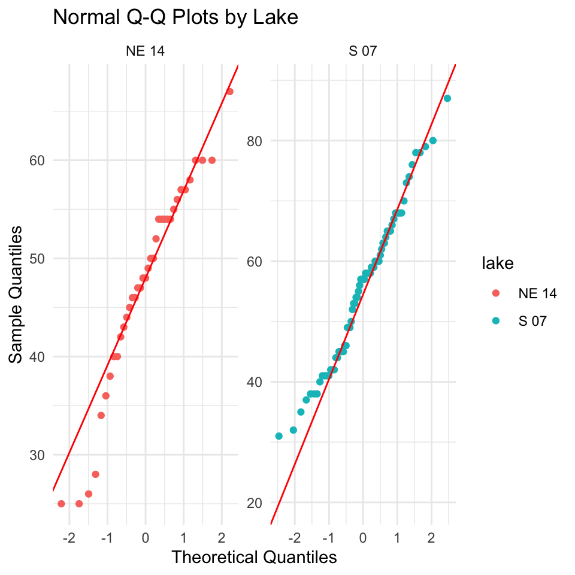
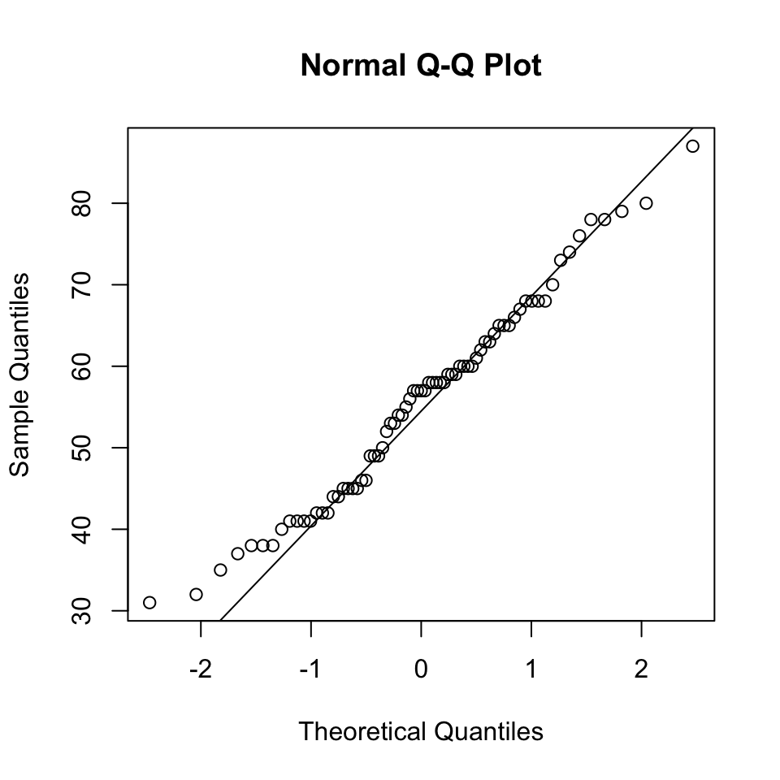
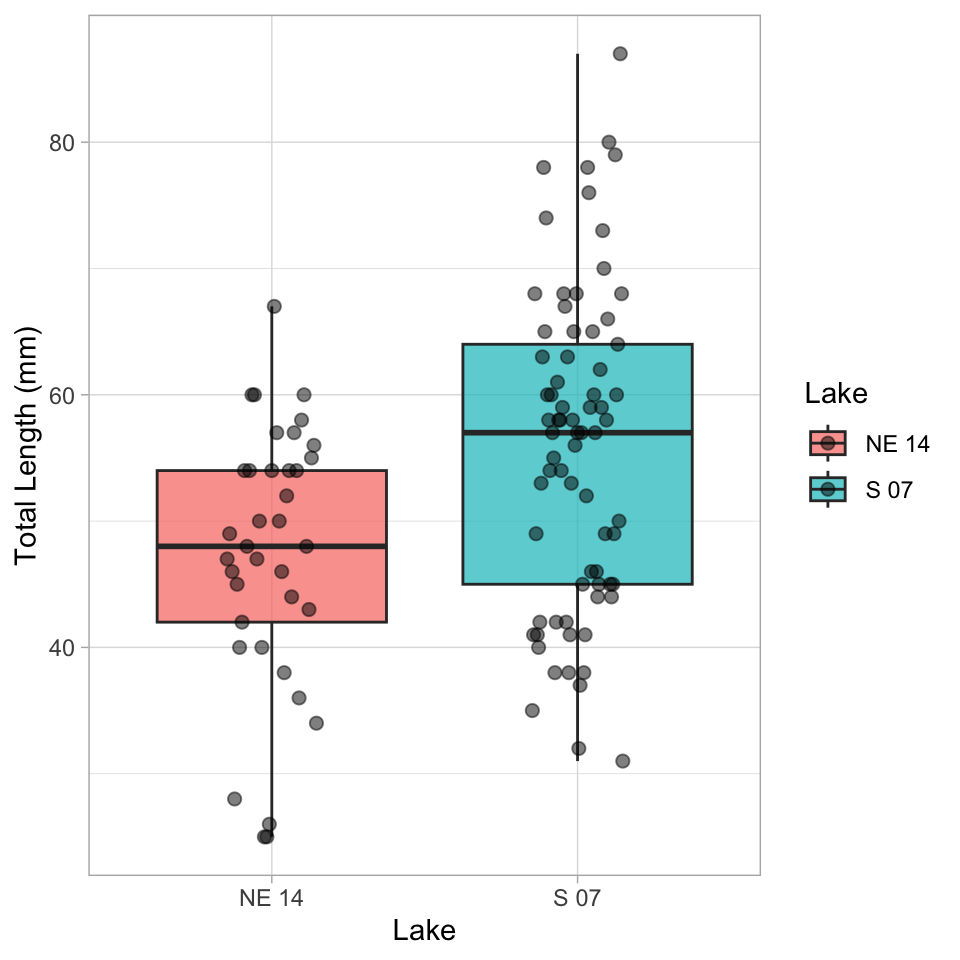
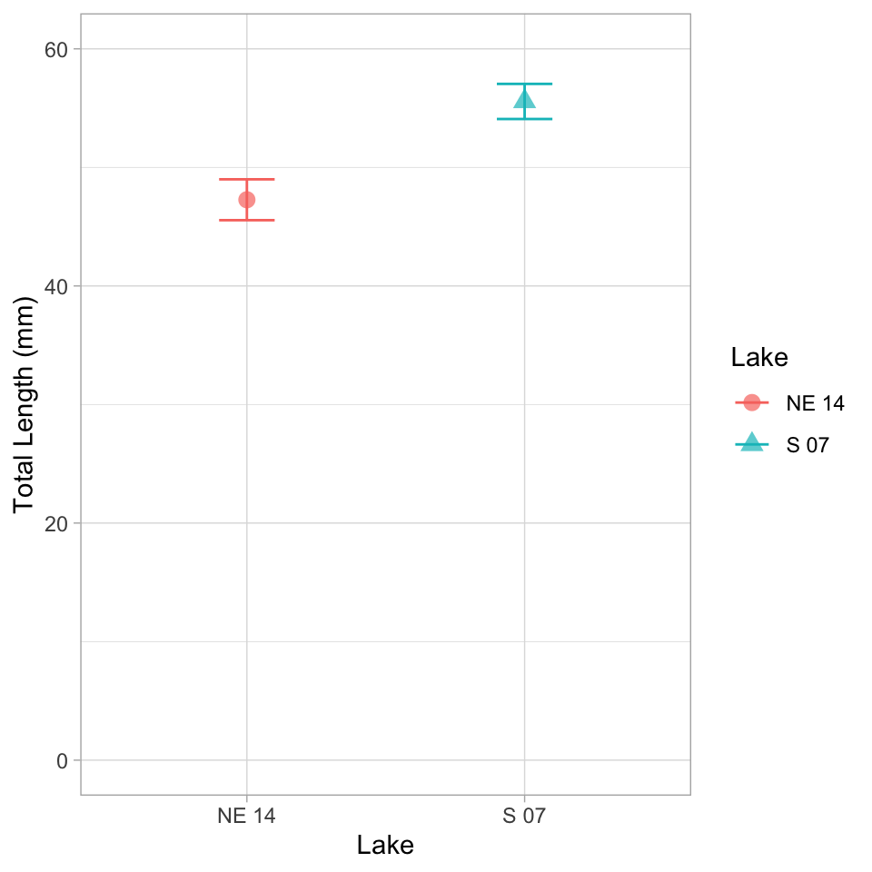

# Introduction to Welch's t-Test

## Background and Theory

Welch's t-test (also known as Welch's unequal variances t-test) is an adaptation of the standard two-sample t-test that is designed to provide a valid test when the two groups have unequal variances. This is particularly important because the assumption of equal variances is often violated in real-world data.

While the standard two-sample t-test makes the following comparison:

$H_0: \mu_1 = \mu_2$ $H_A: \mu_1 \neq \mu_2$

Where:

- $H_0$ is the null hypothesis stating that the population means are equal

- $H_A$ is the alternative hypothesis stating that the population means are different

- $\mu_1$ is the population mean of the first group

- $\mu_2$ is the population mean of the second group

## Formula for Welch's t-Test

The formula for Welch's t-test is:

$t = \frac{\bar{x}_1 - \bar{x}_2}{\sqrt{\frac{s_1^2}{n_1} + \frac{s_2^2}{n_2}}}$

Where:

- $\bar{x}_1$ is the sample mean of the first group

- $\bar{x}_2$ is the sample mean of the second group

- $s_1^2$ is the sample variance of the first group

- $s_2^2$ is the sample variance of the second group

- $n_1$ is the sample size of the first group

- $n_2$ is the sample size of the second group

The key difference from the standard t-test is that Welch's t-test does not use a pooled variance estimate, making it more robust when the variances differ between groups.

The degrees of freedom for Welch's t-test are calculated using the Welch-Satterthwaite equation:

$df = \frac{(\frac{s_1^2}{n_1} + \frac{s_2^2}{n_2})^2}{\frac{(s_1^2/n_1)^2}{n_1-1} + \frac{(s_2^2/n_2)^2}{n_2-1}}$

This often results in a non-integer value for degrees of freedom, which is why you'll typically see it rounded in reports.

# Data Analysis

## Loading Libraries and Data


::: {.cell}

```{.r .cell-code}
# Load required libraries

library(car)  # For Levene's test
```

::: {.cell-output .cell-output-stderr}

```
Loading required package: carData
```


:::

```{.r .cell-code}
# library(ggpubr)  # For adding p-values to plots
library(coin)  # For permutation tests
```

::: {.cell-output .cell-output-stderr}

```
Loading required package: survival
```


:::

```{.r .cell-code}
library(rcompanion)  # For plotNormalHistogramlibrary(tidyverse)
library(patchwork)
library(skimr)
library(tidyverse)
```

::: {.cell-output .cell-output-stderr}

```
── Attaching core tidyverse packages ──────────────────────── tidyverse 2.0.0 ──
✔ dplyr     1.2.1     ✔ readr     2.2.0
✔ forcats   1.0.1     ✔ stringr   1.6.0
✔ ggplot2   4.0.3     ✔ tibble    3.3.1
✔ lubridate 1.9.5     ✔ tidyr     1.3.2
✔ purrr     1.2.2     
```


:::

::: {.cell-output .cell-output-stderr}

```
── Conflicts ────────────────────────────────────────── tidyverse_conflicts() ──
✖ dplyr::filter() masks stats::filter()
✖ dplyr::lag()    masks stats::lag()
✖ dplyr::recode() masks car::recode()
✖ purrr::some()   masks car::some()
ℹ Use the conflicted package (<http://conflicted.r-lib.org/>) to force all conflicts to become errors
```


:::

```{.r .cell-code}
library(broom)

# Load the data
sculpin_df <- read_csv("data/t_test_sculpin_s07_ne14.csv")
```

::: {.cell-output .cell-output-stderr}

```
Rows: 110 Columns: 5
── Column specification ────────────────────────────────────────────────────────
Delimiter: ","
chr (2): lake, species
dbl (3): site, length_mm, mass_g

ℹ Use `spec()` to retrieve the full column specification for this data.
ℹ Specify the column types or set `show_col_types = FALSE` to quiet this message.
```


:::

```{.r .cell-code}
# Preview the data
head(sculpin_df)
```

::: {.cell-output .cell-output-stdout}

```
# A tibble: 6 × 5
   site lake  species       length_mm mass_g
  <dbl> <chr> <chr>             <dbl>  <dbl>
1   109 NE 14 slimy sculpin        47   0.7 
2   109 NE 14 slimy sculpin        49   0.9 
3   109 NE 14 slimy sculpin        46   0.7 
4   109 NE 14 slimy sculpin        28   0.15
5   109 NE 14 slimy sculpin        45   0.65
6   109 NE 14 slimy sculpin        40   0.3 
```


:::
:::


## Data Overview

Let's first examine the structure of our dataset:


::: {.cell}

```{.r .cell-code}
# Summary statistics
sculpin_df %>% group_by(lake) %>% skim()
```

::: {.cell-output-display}

Table: Data summary

|                         |           |
|:------------------------|:----------|
|Name                     |Piped data |
|Number of rows           |110        |
|Number of columns        |5          |
|_______________________  |           |
|Column type frequency:   |           |
|character                |1          |
|numeric                  |3          |
|________________________ |           |
|Group variables          |lake       |


**Variable type: character**

|skim_variable |lake  | n_missing| complete_rate| min| max| empty| n_unique| whitespace|
|:-------------|:-----|---------:|-------------:|---:|---:|-----:|--------:|----------:|
|species       |NE 14 |         0|             1|  13|  13|     0|        1|          0|
|species       |S 07  |         0|             1|  13|  13|     0|        1|          0|


**Variable type: numeric**

|skim_variable |lake  | n_missing| complete_rate|   mean|    sd|     p0|    p25|    p50|    p75|   p100|hist  |
|:-------------|:-----|---------:|-------------:|------:|-----:|------:|------:|------:|------:|------:|:-----|
|site          |NE 14 |         0|             1| 109.00|  0.00| 109.00| 109.00| 109.00| 109.00| 109.00|▁▁▇▁▁ |
|site          |S 07  |         0|             1| 152.00|  0.00| 152.00| 152.00| 152.00| 152.00| 152.00|▁▁▇▁▁ |
|length_mm     |NE 14 |         0|             1|  47.27| 10.49|  25.00|  42.00|  48.00|  54.00|  67.00|▂▃▇▇▂ |
|length_mm     |S 07  |         0|             1|  55.56| 12.65|  31.00|  45.00|  57.00|  64.00|  87.00|▅▅▇▃▂ |
|mass_g        |NE 14 |         0|             1|   0.89|  0.52|   0.10|   0.45|   0.85|   1.25|   2.30|▇▇▇▂▁ |
|mass_g        |S 07  |         0|             1|   1.66|  1.23|   0.25|   0.80|   1.45|   2.10|   7.37|▇▃▁▁▁ |


:::
:::


## Data Visualization

Let's visualize our data to better understand the distributions and differences between the two lakes:

### Box Plot with Individual Data Points


::: {.cell}

```{.r .cell-code}
# Create boxplot with individual points
histo_plot<- ggplot(sculpin_df, aes(x = lake, y = length_mm, fill = lake)) +
  geom_boxplot(alpha = 0.7, outlier.shape = NA) +
  geom_point(position = position_dodge2(width = 0.3), 
             alpha = 0.5, size = 2) +
  labs(
    x = "Lake",
    y = "Total Length (mm)",
    fill = "Lake"
  ) +
  theme_minimal() +
  theme(
    plot.title = element_text(hjust = 0.5, face = "bold"),
    legend.position = "right") 
histo_plot
```

::: {.cell-output-display}
{width=480}
:::
:::


The boxplot shows the distribution of total lengths for each lake. The box represents the interquartile range (IQR, from the 25th to 75th percentile), with the horizontal line inside the box indicating the median. The individual points show the actual measurements, helping us visualize the full distribution of the data.

### Mean and SE Individual Data Points


::: {.cell}

```{.r .cell-code}
mean_se_plot <- sculpin_df %>% 
ggplot( aes(x = lake, y = length_mm, color = lake)) +
  # Add individual data points in the background
  geom_point(position = position_dodge2(width = 0.3), 
             alpha = 0.5, size = 1.5) +
  # Add mean and standard error
  stat_summary(fun = mean, geom = "point", size = 4) +
  stat_summary(fun.data = mean_se, geom = "errorbar", width = 0.1) +
  labs(
    x = "Lake",
    y = "Total Length (mm)",
    color = "Lake"
  ) +
  theme_minimal() +
  theme(
    plot.title = element_text(hjust = 0.5, face = "bold"),
    legend.position = "right"
  ) 
mean_se_plot
```

::: {.cell-output-display}
{width=480}
:::
:::


# Testing Welch's t-Test Assumptions

Before conducting Welch's t-test, we need to verify that our data meets the underlying assumptions:

## Assumptions of Welch's t-Test

1.  **Independence**: The observations within each group are independent, and the two groups are independent of each other.
2.  **Normality**: The data in each group follow approximately normal distributions (though Welch's t-test is more robust to violations of normality than the standard t-test).

Unlike the standard t-test, **Welch's t-test does not assume that the variances of the two groups are equal.** This makes it more appropriate for many real-world datasets.

Let's test the assumptions we do need to meet:

### 1. Independence Assumption

Independence is a design issue and can't be tested statistically. We assume our sampling design ensures independence between and within groups.

### 2. Normality Assumption

- We'll check normality using:

  - Visual methods: Histograms and Q-Q plots

  - Formal test: Shapiro-Wilk test

    #### Histograms


::: {.cell}

```{.r .cell-code}
histo_plot
```

::: {.cell-output-display}
{width=480}
:::
:::


#### QQ Plots


::: {.cell}

```{.r .cell-code}
# QQ plot for lakes
sculpin_df %>%  
  ggplot( aes(sample = length_mm, color=lake)) +
  stat_qq() +
  stat_qq_line(color = "red") +
  facet_wrap(~lake, scales = "free") +
  labs(title = "Normal Q-Q Plots by Lake",
       x = "Theoretical Quantiles",
       y = "Sample Quantiles") +
  theme_minimal()
```

::: {.cell-output-display}
{width=480}
:::
:::


QQplots in base r


::: {.cell}

```{.r .cell-code}
# you need to isolate the dataframes or spllit them
s7_df <- sculpin_df %>%
  filter(lake == "S 07")

ne14_df <- sculpin_df %>%
  filter(lake == "NE 14")


# Basic Q-Q plot
qqnorm(s7_df$length_mm)
qqline(s7_df$length_mm)
```

::: {.cell-output-display}
{width=480}
:::
:::


#### Shapiro-Wilk Test


::: {.cell}

```{.r .cell-code}
# Simple approach - just split by lake and run the test
sculpin_df %>%
  filter(lake == "S 07") %>%
  pull(length_mm) %>%
  shapiro.test()
```

::: {.cell-output .cell-output-stdout}

```

	Shapiro-Wilk normality test

data:  .
W = 0.98035, p-value = 0.3125
```


:::

```{.r .cell-code}
sculpin_df %>%
  filter(lake == "NE 14") %>%
  pull(length_mm) %>%
  shapiro.test()
```

::: {.cell-output .cell-output-stdout}

```

	Shapiro-Wilk normality test

data:  .
W = 0.9479, p-value = 0.08258
```


:::
:::


Another way


::: {.cell}

```{.r .cell-code}
normality_results <- sculpin_df %>%
  group_by(lake) %>%
  summarize(
    shapiro_stat = shapiro.test(length_mm)$statistic,
    shapiro_p_value = shapiro.test(length_mm)$p.value,
    normal_distribution = if_else(shapiro_p_value > 0.05, "Normal", "Non-normal"))
normality_results
```

::: {.cell-output .cell-output-stdout}

```
# A tibble: 2 × 4
  lake  shapiro_stat shapiro_p_value normal_distribution
  <chr>        <dbl>           <dbl> <chr>              
1 NE 14        0.948          0.0826 Normal             
2 S 07         0.980          0.313  Normal             
```


:::
:::


And yet another way


::: {.cell}

```{.r .cell-code}
sculpin_df %>%
  group_by(lake) %>%
  group_walk(~ {
    cat("Shapiro-Wilk test for Lake", .y$lake, ":\n")
    test_result <- shapiro.test(.x$length_mm)
    print(test_result)
    cat("\n")
  })
```

::: {.cell-output .cell-output-stdout}

```
Shapiro-Wilk test for Lake NE 14 :

	Shapiro-Wilk normality test

data:  .x$length_mm
W = 0.9479, p-value = 0.08258


Shapiro-Wilk test for Lake S 07 :

	Shapiro-Wilk normality test

data:  .x$length_mm
W = 0.98035, p-value = 0.3125
```


:::
:::


and even another


::: {.cell}

```{.r .cell-code}
sculpin_df %>%
  group_by(lake) %>%
  group_modify(~ broom::tidy(shapiro.test(.x$length_mm)))
```

::: {.cell-output .cell-output-stdout}

```
# A tibble: 2 × 4
# Groups:   lake [2]
  lake  statistic p.value method                     
  <chr>     <dbl>   <dbl> <chr>                      
1 NE 14     0.948  0.0826 Shapiro-Wilk normality test
2 S 07      0.980  0.313  Shapiro-Wilk normality test
```


:::
:::


### 3. Homogeneity of Variances

We'll check for homogeneity of variances using: - Visual inspection of boxplots (already done above) - Levene's test


::: {.cell}

```{.r .cell-code}
# Levene's test for homogeneity of variances
leveneTest(length_mm ~ lake, data = sculpin_df)
```

::: {.cell-output .cell-output-stdout}

```
Levene's Test for Homogeneity of Variance (center = median)
       Df F value Pr(>F)
group   1   2.029 0.1572
      108               
```


:::
:::


## Interpretation of Assumption Tests

Based on the results of our assumption tests:

1.  **Independence**: We assume this is met based on the data collection process, as samples from each lake were collected independently of one another.

2.  **Normality**:

    - The Q-Q plots show that the data points largely follow the theoretical normal distribution line for both lakes, with some minor deviations at the extremes.
    - The Shapiro-Wilk test results will help us formally assess normality. If the p-value is greater than 0.05, we fail to reject the null hypothesis that the data is normally distributed.
    - For samples larger than 30, the Central Limit Theorem suggests that the sampling distribution of means will be approximately normal regardless of the underlying distribution.

3.  **Homogeneity of Variances**:

    - Levene's test evaluates whether the variances between groups are equal.
    - A p-value greater than 0.05 indicates that we cannot reject the null hypothesis of equal variances.
    - As a rule of thumb, if the variance ratio is less than 4:1, the t-test is reasonably robust to violations of this assumption.
    - If this assumption is violated, we should consider using Welch's t-test instead, which does not assume equal variances.

# Performing Welch's t-Test

Now that we've examined our assumptions, let's perform Welch's t-test:


::: {.cell}

```{.r .cell-code}
# Perform Welch's t-test (unequal variances)
welch_t_test <- t.test(
  length_mm ~ lake,
  data = sculpin_df,
  var.equal = FALSE  # This specifies Welch's t-test
)

# Display the results
welch_t_test
```

::: {.cell-output .cell-output-stdout}

```

	Welch Two Sample t-test

data:  length_mm by lake
t = -3.6483, df = 85.45, p-value = 0.0004533
alternative hypothesis: true difference in means between group NE 14 and group S 07 is not equal to 0
95 percent confidence interval:
 -12.809687  -3.773061
sample estimates:
mean in group NE 14  mean in group S 07 
           47.27027            55.56164 
```


:::
:::


## Line-by-Line Interpretation of Welch's t-Test Results

Let's break down the output from the Welch's t-test:

1.  **Test Type**: "Welch Two Sample t-test" indicates we're using the Welch's version of the t-test, which does not assume equal variances.

2.  **Formula**: `length_mm ~ lake` means we're testing if total length differs by lake.

3.  **Data**: Our filtered sculpin dataset.

4.  **t-value**: The calculated t-statistic. This is the ratio of the difference between group means to the standard error of that difference.

5.  **Degrees of Freedom (df)**: For Welch's t-test, this is calculated using the Welch-Satterthwaite equation and is typically not a whole number. This adjustment accounts for the different variances.

6.  **p-value**: The probability of observing a t-statistic as extreme as (or more extreme than) the one we calculated, assuming the null hypothesis is true. A p-value less than our significance level (typically 0.05) leads us to reject the null hypothesis.

7.  **Alternative Hypothesis**: States that the difference in means is not equal to 0, which corresponds to our two-sided test.

8.  **95% Confidence Interval**: The estimated range for the true difference in means. If this interval does not contain 0, it supports rejecting the null hypothesis.

9.  **Sample Estimates**: The means of each group being compared.

## Visual Representation of t-Test Results


::: {.cell}

```{.r .cell-code}
# Create a plot with the t-test results
sculpin_df %>% 
  ggplot(aes(x = lake, y = length_mm, fill = lake)) +
  geom_boxplot(alpha = 0.7, outlier.shape = NA) +
  geom_point(position = position_dodge2(width = 0.3), 
             alpha = 0.5, size = 2) +
  labs(
    x = "Lake",
    y = "Total Length (mm)",
    fill = "Lake") +
  theme_light() +
  theme(
    plot.title = element_text(hjust = 0.5, face = "bold"),
    plot.subtitle = element_text(hjust = 0.5),
    legend.position = "right"
  ) 
```

::: {.cell-output-display}
{width=480}
:::
:::


A mean and SE plot


::: {.cell}

```{.r .cell-code}
sculpin_df %>% 
  ggplot(aes(x = lake, y = length_mm, color=lake, shape = lake, fill = lake)) +
  stat_summary(fun = mean, geom = "point", alpha = 0.7, size=3) +  # bars for means
  stat_summary(fun.data = mean_se, geom = "errorbar", width = 0.2) +  # error bars for SE
  labs(
    x = "Lake",
    y = "Total Length (mm)",
    fill = "Lake",
    color="Lake",
    shape = "Lake"
  ) +
  coord_cartesian(ylim = c(0, 60))+
  theme_light() +
  theme(
    plot.title = element_text(hjust = 0.5, face = "bold"),
    legend.position = "right"
  ) 
```

::: {.cell-output-display}
{width=480}
:::
:::


A typical caption for the mean/SE plot would read:

"Figure X. Total length (mean ± SE) of slimy sculpin fish from two Arctic lakes. Fish from Lake S 07 (n = 73) were significantly larger than those from Lake NE 14 (n = 37) (Welch's t-test: t(`df`) = `t_statistic`, p \< 0.001)."

# Conclusion and Scientific Reporting


::: {.cell}

```{.r .cell-code}
# Calculate means and standard errors for reporting
mean_se_by_lake <- sculpin_df %>%
  group_by(lake) %>%
  summarize(
    n = n(),
    mean = mean(length_mm),
    sd = sd(length_mm),
    se = sd / sqrt(n)
  )

print(mean_se_by_lake)
```

::: {.cell-output .cell-output-stdout}

```
# A tibble: 2 × 5
  lake      n  mean    sd    se
  <chr> <int> <dbl> <dbl> <dbl>
1 NE 14    37  47.3  10.5  1.72
2 S 07     73  55.6  12.7  1.48
```


:::

```{.r .cell-code}
# Calculate percent difference
percent_diff <- abs(diff(mean_se_by_lake$mean)) / min(mean_se_by_lake$mean) * 100
```
:::


## Interpretation of Welch's t-Test Results

Based on our analysis, we can conclude:

The total length of slimy sculpin fish differs significantly between Lake S 07 and Lake NE 14 (Welch's t-test: t(`df)`) = `t_statistic`, p \< 0.001). Fish from Lake S 07 were on average `mean_diff` mm longer than those from Lake NE 14 (mean ± SE: .

Welch's t-test was appropriate for this analysis because:

1.  Our data from both lakes appeared to be approximately normally distributed (as seen in the QQ plots and confirmed by the Shapiro-Wilk test).
2.  Our samples were independent, with fish collected randomly from each lake.
3.  The variances between the two groups were somewhat different (variance ratio of `variance_ratio`, making Welch's t-test preferable to the standard t-test.

The significant p-value (p \< 0.001) indicates that the observed difference in fish length between lakes is very unlikely to have occurred by chance alone if there were truly no difference in the population means. The 95% confidence interval for the mean difference does not include zero, which further supports rejecting the null hypothesis.

## How to Report These Results in a Scientific Publication

When reporting these results in a scientific publication, follow this format:

"Slimy sculpin (*Cottus cognatus*) from Lake S 07 were significantly larger than those from Lake NE 14 mm, respectively; Welch's t-test: t(`df, 1`) = `t_statistic`, p \< 0.001). This represents an approximately `percent_diff`% difference in total length between the two populations."

## Advantages of Using Welch's t-Test

Welch's t-test offers several advantages over the standard t-test:

1.  **Robustness to unequal variances**: Welch's t-test does not assume equal variances between groups, making it more appropriate for real-world data where this assumption is often violated.

2.  **Minimal loss of power**: When variances are equal, Welch's t-test performs nearly as well as the standard t-test.

3.  **Reduced Type I error rate**: When variances are unequal, the standard t-test can have an inflated Type I error rate (false positives), which Welch's t-test corrects.

4.  **Flexibility**: It can be used regardless of whether the variances are equal or not, making it a more versatile statistical test.

For these reasons, many statisticians recommend using Welch's t-test as the default approach for comparing means between two independent groups, even when the homogeneity of variance assumption appears to be met.