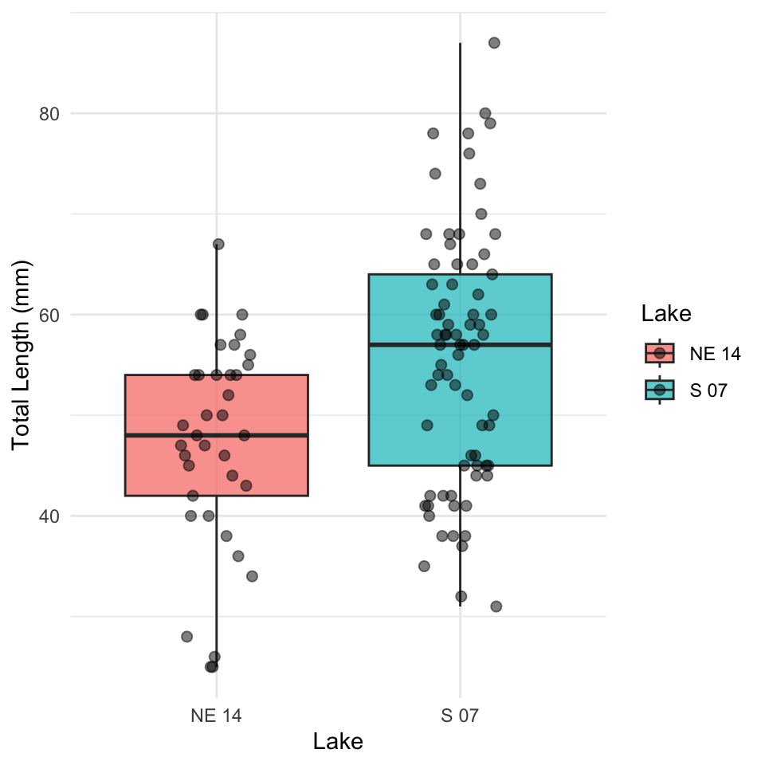
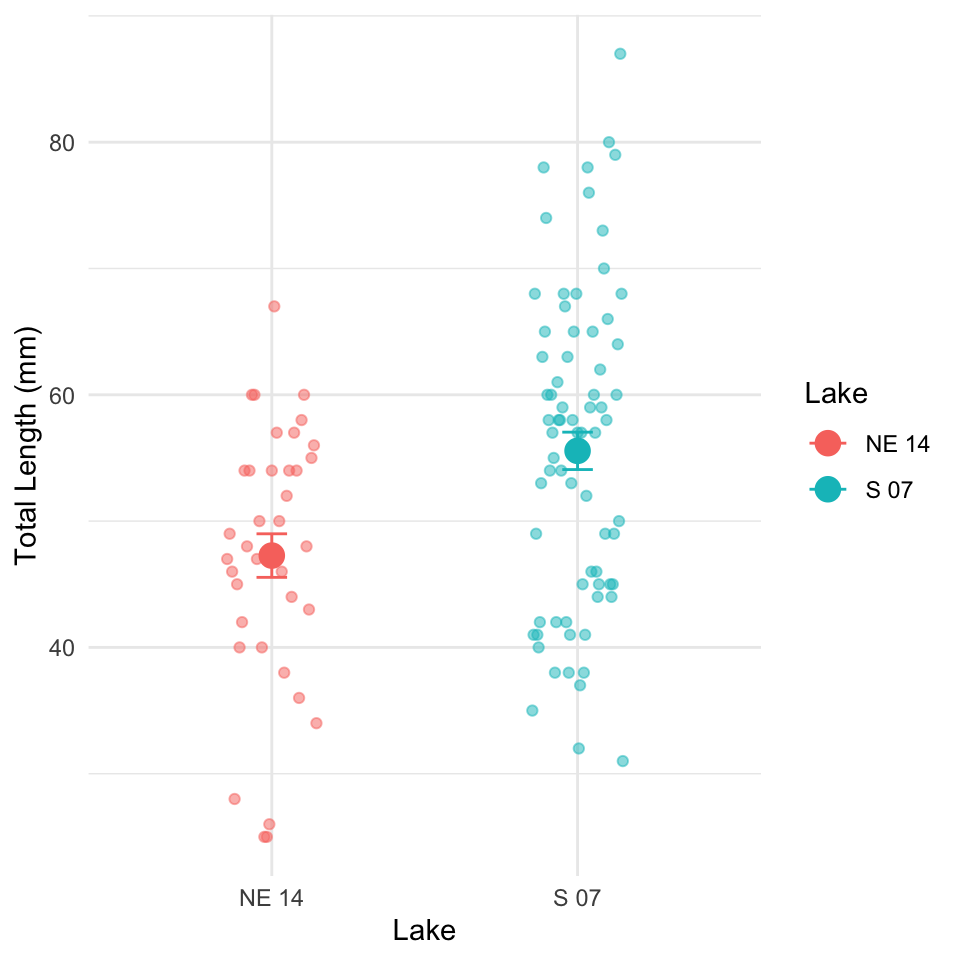
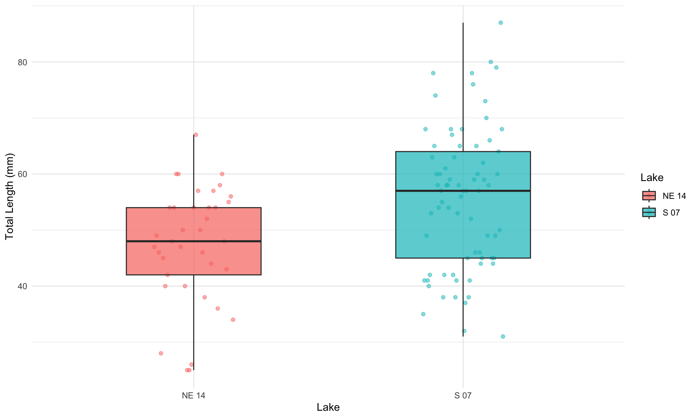

# Introduction to Mann-Whitney U Test or (Wilcoxon Rank-Sum Test)

## Background and Theory

The Mann-Whitney-Wilcoxon test (also known as the Wilcoxon rank-sum test or Mann-Whitney U test) is a powerful **non-parametric alternative to the two-sample t-test.** This test is particularly useful when:

1.  The data do not follow a normal distribution
2.  The sample sizes are small
3.  Data are measured on an ordinal scale
4.  Outliers are present

Unlike the t-test, which compares means, the Mann-Whitney-Wilcoxon test compares the distributions of two independent groups. Specifically, it tests whether one distribution is stochastically greater than the other.

The null and alternative hypotheses are:

$$H_0: \text{The distributions of both groups are identical}$$ $$H_A: \text{The distributions of the two groups differ in location (median)}$$

## How the Mann-Whitney-Wilcoxon Test Works

The test follows these steps:

1.  Combine all observations from both groups and rank them from lowest to highest.
2.  Calculate the sum of ranks for each group.
3.  Calculate the U statistic, which represents the number of times observations in one group precede observations in the other group.
4.  Compare the calculated U statistic to the critical value from the Mann-Whitney-Wilcoxon distribution, or calculate a p-value for larger samples.

The U statistic is calculated as:

$$U_1 = R_1 - \frac{n_1(n_1 + 1)}{2}$$

Where:

- $R_1$ is the sum of ranks in group 1

- $n_1$ is the sample size of group 1

If U is sufficiently small or large compared to what would be expected by chance, we reject the null hypothesis.

# Data Analysis

## Loading Libraries and Data


::: {.cell}

```{.r .cell-code}
# Load required libraries
library(tidyverse)
```

::: {.cell-output .cell-output-stderr}

```
── Attaching core tidyverse packages ──────────────────────── tidyverse 2.0.0 ──
✔ dplyr     1.2.1     ✔ readr     2.2.0
✔ forcats   1.0.1     ✔ stringr   1.6.0
✔ ggplot2   4.0.3     ✔ tibble    3.3.1
✔ lubridate 1.9.5     ✔ tidyr     1.3.2
✔ purrr     1.2.2     
── Conflicts ────────────────────────────────────────── tidyverse_conflicts() ──
✖ dplyr::filter() masks stats::filter()
✖ dplyr::lag()    masks stats::lag()
ℹ Use the conflicted package (<http://conflicted.r-lib.org/>) to force all conflicts to become errors
```


:::

```{.r .cell-code}
library(car)  # For Levene's test
```

::: {.cell-output .cell-output-stderr}

```
Loading required package: carData

Attaching package: 'car'

The following object is masked from 'package:dplyr':

    recode

The following object is masked from 'package:purrr':

    some
```


:::

```{.r .cell-code}
# library(ggpubr)  # For adding p-values to plots
library(coin)  # For permutation tests
```

::: {.cell-output .cell-output-stderr}

```
Loading required package: survival
```


:::

```{.r .cell-code}
library(skimr)
library(rcompanion)  # For plotNormalHistogram
```
:::


::: {.cell}

```{.r .cell-code}
# Load the data
sculpin_df <- read_csv("data/t_test_sculpin_s07_ne14.csv")
```

::: {.cell-output .cell-output-stderr}

```
Rows: 110 Columns: 5
── Column specification ────────────────────────────────────────────────────────
Delimiter: ","
chr (2): lake, species
dbl (3): site, length_mm, mass_g

ℹ Use `spec()` to retrieve the full column specification for this data.
ℹ Specify the column types or set `show_col_types = FALSE` to quiet this message.
```


:::

```{.r .cell-code}
# Preview the data
head(sculpin_df)
```

::: {.cell-output .cell-output-stdout}

```
# A tibble: 6 × 5
   site lake  species       length_mm mass_g
  <dbl> <chr> <chr>             <dbl>  <dbl>
1   109 NE 14 slimy sculpin        47   0.7 
2   109 NE 14 slimy sculpin        49   0.9 
3   109 NE 14 slimy sculpin        46   0.7 
4   109 NE 14 slimy sculpin        28   0.15
5   109 NE 14 slimy sculpin        45   0.65
6   109 NE 14 slimy sculpin        40   0.3 
```


:::
:::


## Data Overview

Let's first examine the structure of our dataset:


::: {.cell}

```{.r .cell-code}
# Summary statistics
sculpin_df %>% group_by(lake) %>% skim()
```

::: {.cell-output-display}

Table: Data summary

|                         |           |
|:------------------------|:----------|
|Name                     |Piped data |
|Number of rows           |110        |
|Number of columns        |5          |
|_______________________  |           |
|Column type frequency:   |           |
|character                |1          |
|numeric                  |3          |
|________________________ |           |
|Group variables          |lake       |


**Variable type: character**

|skim_variable |lake  | n_missing| complete_rate| min| max| empty| n_unique| whitespace|
|:-------------|:-----|---------:|-------------:|---:|---:|-----:|--------:|----------:|
|species       |NE 14 |         0|             1|  13|  13|     0|        1|          0|
|species       |S 07  |         0|             1|  13|  13|     0|        1|          0|


**Variable type: numeric**

|skim_variable |lake  | n_missing| complete_rate|   mean|    sd|     p0|    p25|    p50|    p75|   p100|hist  |
|:-------------|:-----|---------:|-------------:|------:|-----:|------:|------:|------:|------:|------:|:-----|
|site          |NE 14 |         0|             1| 109.00|  0.00| 109.00| 109.00| 109.00| 109.00| 109.00|▁▁▇▁▁ |
|site          |S 07  |         0|             1| 152.00|  0.00| 152.00| 152.00| 152.00| 152.00| 152.00|▁▁▇▁▁ |
|length_mm     |NE 14 |         0|             1|  47.27| 10.49|  25.00|  42.00|  48.00|  54.00|  67.00|▂▃▇▇▂ |
|length_mm     |S 07  |         0|             1|  55.56| 12.65|  31.00|  45.00|  57.00|  64.00|  87.00|▅▅▇▃▂ |
|mass_g        |NE 14 |         0|             1|   0.89|  0.52|   0.10|   0.45|   0.85|   1.25|   2.30|▇▇▇▂▁ |
|mass_g        |S 07  |         0|             1|   1.66|  1.23|   0.25|   0.80|   1.45|   2.10|   7.37|▇▃▁▁▁ |


:::
:::


# Data Visualization

Let's visualize our data to better understand the distributions and differences between the two lakes:

## Box Plot with Individual Data Points


::: {.cell}

```{.r .cell-code}
# Create boxplot with individual points
ggplot(sculpin_df, aes(x = lake, y = length_mm, fill = lake)) +
  geom_boxplot(alpha = 0.7, outlier.shape = NA) +
  geom_point(position = position_dodge2(width = 0.3), 
             alpha = 0.5, size = 2) +
  labs(
    x = "Lake",
    y = "Total Length (mm)",
    fill = "Lake"
  ) +
  theme_minimal() +
  theme(
    plot.title = element_text(hjust = 0.5, face = "bold"),
    legend.position = "right"
  ) 
```

::: {.cell-output-display}
{width=480}
:::
:::


The boxplot shows the distribution of total lengths for each lake. The box represents the interquartile range (IQR, from the 25th to 75th percentile), with the horizontal line inside the box indicating the median. The individual points show the actual measurements, helping us visualize the full distribution of the data.

## Mean and SE Individual Data Points


::: {.cell}

```{.r .cell-code}
sculpin_df %>% 
ggplot( aes(x = lake, y = length_mm, color = lake)) +
  # Add individual data points in the background
  geom_point(position = position_dodge2(width = 0.3), 
             alpha = 0.5, size = 1.5) +
  # Add mean and standard error
  stat_summary(fun = mean, geom = "point", size = 4) +
  stat_summary(fun.data = mean_se, geom = "errorbar", width = 0.1) +
  labs(
    x = "Lake",
    y = "Total Length (mm)",
    color = "Lake"
  ) +
  theme_minimal() +
  theme(
    plot.title = element_text(hjust = 0.5, face = "bold"),
    legend.position = "right"
  ) 
```

::: {.cell-output-display}
{width=480}
:::
:::


# Why Use the Mann-Whitney-Wilcoxon Test?

## Assumptions of the Mann-Whitney-Wilcoxon Test

The Mann-Whitney-Wilcoxon test has the following assumptions:

1.  **Independent samples**: The observations in each group are independent of each other, and the two groups are independent of each other.

2.  **Ordinal data**: The measurements must be at least on an ordinal scale (can be ranked).

3.  **Similar distributions**: If testing for differences in medians specifically, the shapes of the distributions should be similar (though not necessarily normal).

4.  The Mann-Whitney-Wilcoxon test is appropriate regardless of the outcome because it doesn't assume normality.

# Performing the Mann-Whitney-Wilcoxon Test

Now let's perform the Mann-Whitney-Wilcoxon test to compare the total lengths between the two lakes:

## Using Base R's wilcox.test Function


::: {.cell}

```{.r .cell-code}
# Perform the Mann-Whitney-Wilcoxon test
wilcox_test <- wilcox.test(length_mm ~ lake, 
                          data = sculpin_df,
                          exact = FALSE,  # Use approximate method for larger samples
                          correct = TRUE)  # Apply continuity correction

# Display the results
wilcox_test
```

::: {.cell-output .cell-output-stdout}

```

	Wilcoxon rank sum test with continuity correction

data:  length_mm by lake
W = 867, p-value = 0.00223
alternative hypothesis: true location shift is not equal to 0
```


:::

```{.r .cell-code}
# Store the p-value for later use
p_value <- wilcox_test$p.value
```
:::


## Using the coin Package for an Exact Test

For more precise results, especially with smaller samples, we can use the `coin` package to perform an exact Mann-Whitney-Wilcoxon test:


::: {.cell}

```{.r .cell-code}
# Convert lake to factor (required for the coin package)
sculpin_df$lake_factor <- factor(sculpin_df$lake)

# Perform the Mann-Whitney test using the approximate method
# (which works reliably for all sample sizes)
coin_wilcox <- coin::wilcox_test(
  length_mm ~ lake_factor,
  data = sculpin_df,
  distribution = "approximate"
)

# Extract the p-value
pvalue_coin <- pvalue(coin_wilcox)

coin_wilcox
```

::: {.cell-output .cell-output-stdout}

```

	Approximative Wilcoxon-Mann-Whitney Test

data:  length_mm by lake_factor (NE 14, S 07)
Z = -3.0609, p-value = 0.0029
alternative hypothesis: true mu is not equal to 0
```


:::
:::


## Calculating Effect Size

The Mann-Whitney-Wilcoxon test tells us whether there's a statistically significant difference, but it doesn't indicate the magnitude of that difference. Let's calculate an effect size measure:


::: {.cell}

```{.r .cell-code}
## Calculating Effect Size

# The Mann-Whitney-Wilcoxon test tells us whether there's a statistically significant difference, but it doesn't indicate the magnitude of that difference. Let's calculate an effect size measure:

# Calculate standardized effect size using rank-biserial correlation
# (equivalent to r = Z / sqrt(N))
z_score <- qnorm(p_value/2)  # Convert p-value to Z-score
N <- nrow(sculpin_df)
r <- abs(z_score) / sqrt(N)  # Rank-biserial correlation


# Interpret effect size
effect_size <- r
if(effect_size < 0.1) {
  effect_interpretation <- "negligible effect"
} else if(effect_size < 0.3) {
  effect_interpretation <- "small effect"
} else if(effect_size < 0.5) {
  effect_interpretation <- "moderate effect"
} else if(effect_size < 0.7) {
  effect_interpretation <- "large effect"
} else {
  effect_interpretation <- "very large effect"
}

cat("Effect size (rank-biserial correlation):")
```

::: {.cell-output .cell-output-stdout}

```
Effect size (rank-biserial correlation):
```


:::

```{.r .cell-code}
round(r, 3)
```

::: {.cell-output .cell-output-stdout}

```
[1] 0.292
```


:::

```{.r .cell-code}
cat("This represents a:")
```

::: {.cell-output .cell-output-stdout}

```
This represents a:
```


:::

```{.r .cell-code}
effect_interpretation 
```

::: {.cell-output .cell-output-stdout}

```
[1] "small effect"
```


:::
:::


# Median and Interquartile Range (IQR) Plot with Test Results

Since the Mann-Whitney-Wilcoxon test is primarily concerned with medians rather than means, let's create a plot showing the median and IQR for each lake:


::: {.cell}

```{.r .cell-code}
# Create median and IQR plot with data points
ggplot() +
  # Add individual data points in the background
  geom_point(data = sculpin_df, 
             aes(x = lake, y = length_mm, color = lake),
             position = position_dodge2(width = 0.3), 
             alpha = 0.5, size = 1.5) +
  # Add boxplot without outliers
  geom_boxplot(data = sculpin_df,
               aes(x = lake, y = length_mm, fill = lake),
               alpha = 0.7, outlier.shape = NA, width = 0.5) +
  labs(
    x = "Lake",
    y = "Total Length (mm)",
    fill = "Lake",
    color = "Lake"
  ) +
  theme_minimal() +
  theme(
    plot.title = element_text(hjust = 0.5, face = "bold"),
    legend.position = "right"
  ) 
```

::: {.cell-output-display}
{width=960}
:::
:::


## Understanding the Mann-Whitney-Wilcoxon Test Results

The Mann-Whitney-Wilcoxon test provides a p-value that represents the probability of observing the rank sum (or a more extreme value) if the null hypothesis were true (i.e., if there were no difference in the distributions of the two lakes).

Our analysis shows:

1.  **Observed Difference**: The observed difference in median total length between Lake S 07 and Lake NE 14 is `median_diff` mm.

2.  **p-value**: The Mann-Whitney-Wilcoxon test yielded a p-value of `p_value )`.

3.  **Effect Size**: The rank-biserial correlation (r = `r`) indicates a `effect_interpretation` effect size.

4.  **Interpretation**: Since the p-value is `p_value < 0.05`, we`"fail OR reject")` the null hypothesis. This indicates that the distributions of fish lengths between the two lakes are `p_value < 0.05 "significantly different", "not significantly different")`.

## Advantages of the Mann-Whitney-Wilcoxon Test

The Mann-Whitney-Wilcoxon test offered several advantages for this analysis:

1.  **No Normality Assumption**: It doesn't require the data to follow a normal distribution, making it appropriate for many ecological datasets.

2.  **Robust to Outliers**: By using ranks instead of actual values, it's less sensitive to extreme observations.

3.  **Applicable to Ordinal Data**: It can be used even when data are measured on an ordinal rather than interval scale.

4.  **Efficiency**: With normally distributed data, the test has 95% efficiency compared to the t-test, but can be more powerful when distributions are non-normal.

5.  **Interpretability**: It provides a clear assessment of whether one population tends to have larger values than the other.

# How to Report These Results in a Scientific Publication

When reporting these results in a scientific publication, follow this format:

"Slimy sculpin (*Cottus cognatus*) from Lake S 07 had significantly greater total lengths than those from Lake NE 14 (median: mm, respectively; Mann-Whitney-Wilcoxon test, W = `wilcox_test`, p `=(p_value)`, r = `r`)."

For the methods section:

"Due to violations of normality assumptions, differences in sculpin length between lakes were assessed using the non-parametric Mann-Whitney-Wilcoxon test. Effect size was calculated using the rank-biserial correlation coefficient (r)."

For figures, include a caption such as:

"Figure X. Total length of slimy sculpin fish from two Arctic lakes, showing median and interquartile range. Fish from Lake S 07 (n = 73) had significantly greater lengths than those from Lake NE 14 (n = 37) (Mann-Whitney-Wilcoxon test, p \< 0.001, r =`r`."

# Conclusion

The Mann-Whitney-Wilcoxon test revealed a significant difference in the total length distributions of slimy sculpin fish between Lake S 07 and Lake NE 14, with fish from Lake S 07 having greater lengths. The `effect_interpretation` effect size (r = `r` )indicates that this difference is not only statistically significant but also biologically meaningful.

This non-parametric approach was appropriate given the potential violations of normality assumptions, and it provided robust evidence of differences between the two lake populations. The approximately `percent_diff`% difference in median lengths suggests substantial ecological differences between these habitats that warrant further investigation.