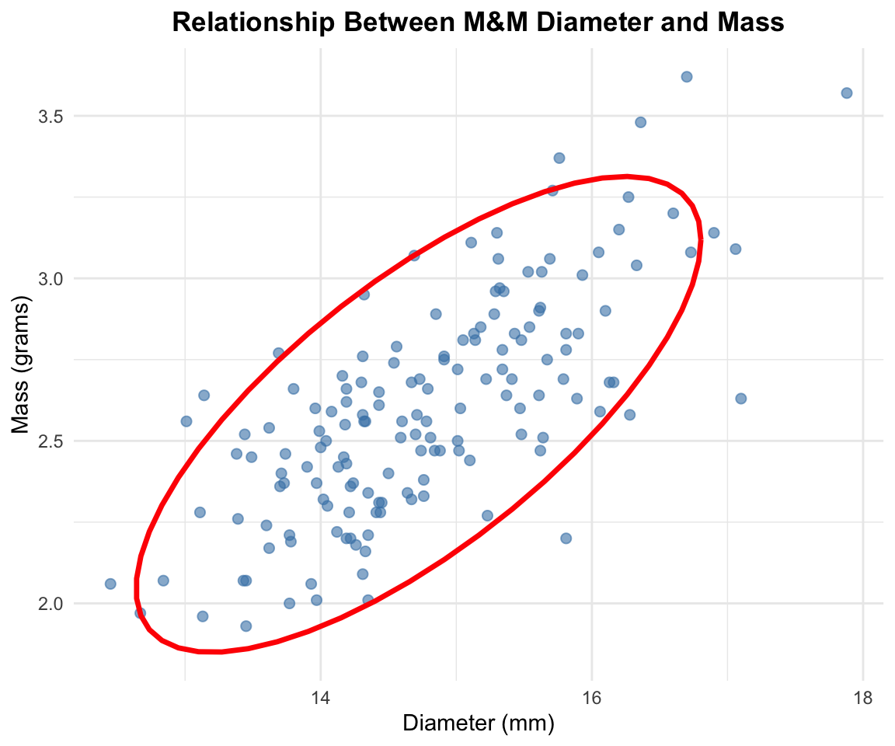
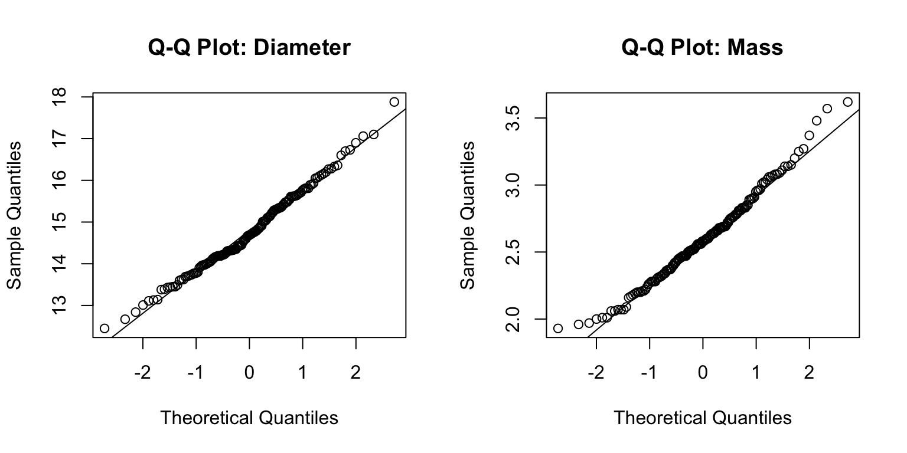
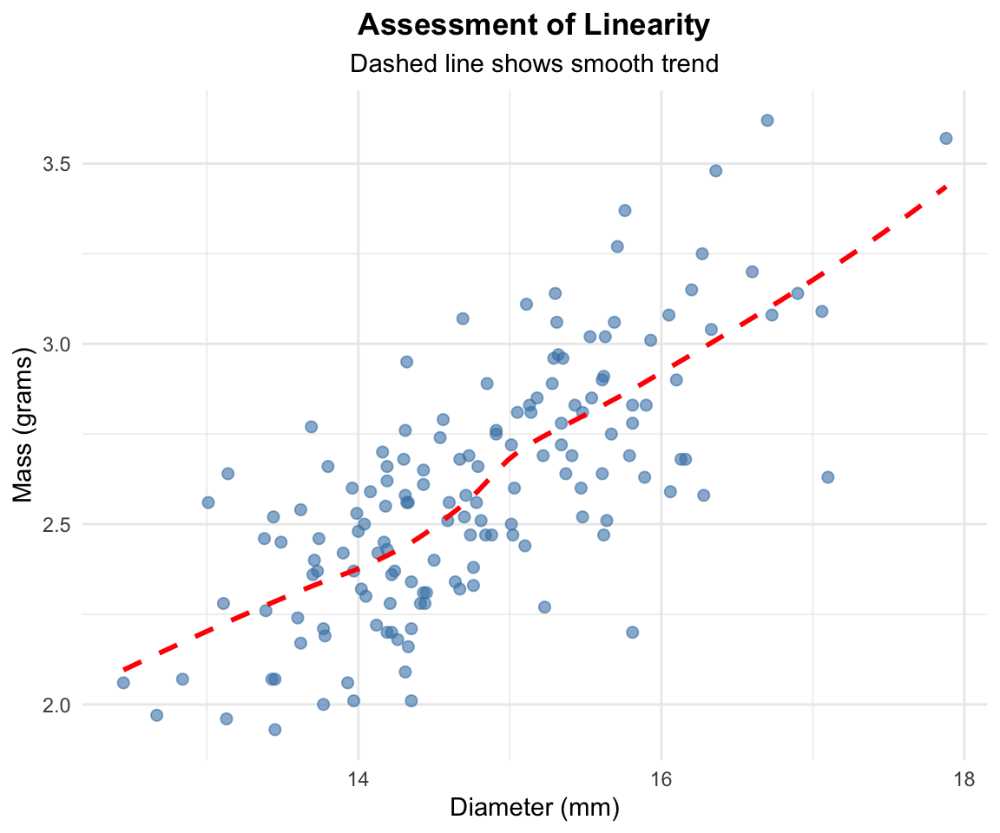
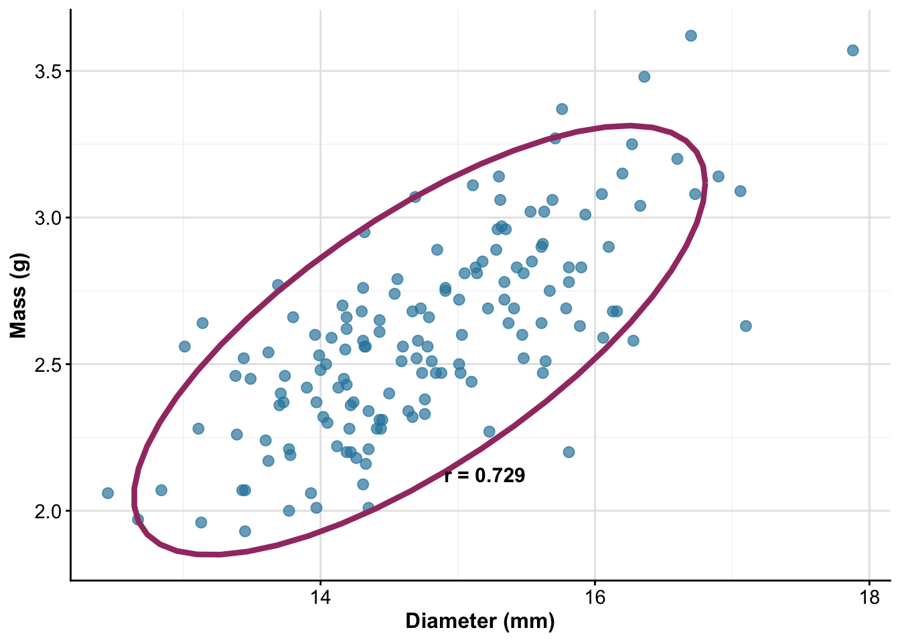

# Introduction to Correlation Analysis

## Background and Theory

Correlation analysis is used to quantify the strength and direction of the linear relationship between two continuous variables. In this analysis, we will examine whether there is a relationship between M&M diameter and mass in peanut M&Ms.

The Pearson correlation coefficient (r) measures the linear relationship between two variables and ranges from -1 to +1:

- **r = +1**: Perfect positive linear relationship
- **r = 0**: No linear relationship\
- **r = -1**: Perfect negative linear relationship

The correlation analysis tests the following hypotheses:

$$H_0: \rho = 0$$ $$H_A: \rho \neq 0$$

Where:

- $H_0$ is the null hypothesis stating that there is no correlation in the population
- $H_A$ is the alternative hypothesis stating that there is a correlation in the population\
- $\rho$ (rho) represents the population correlation coefficient

::: callout-note
## Key Concept

Correlation measures the strength of a **linear** relationship between two variables. It does not imply causation and both variables are typically measured (neither is manipulated).
:::

## Loading Libraries and Data


::: {.cell}

```{.r .cell-code}
# Load required libraries
library(skimr)      # For summary statistics
library(car)        # For diagnostic tests
library(tidyverse)  # For data manipulation and plotting

# Load the M&M peanut data
peanut_df <- read_csv("data/mms_peanut.csv")

# Preview the data structure
head(peanut_df)
```

::: {.cell-output .cell-output-stdout}

```
# A tibble: 6 × 4
  center color  diameter  mass
  <chr>  <chr>     <dbl> <dbl>
1 peanut orange     14.8  2.38
2 peanut yellow     14.2  2.37
3 peanut red        13.0  2.56
4 peanut yellow     14.7  2.52
5 peanut green      15.5  2.85
6 peanut yellow     13.5  2.45
```


:::
:::


# Data Exploration

## Summary Statistics

Let's examine the structure and summary statistics of our variables of interest:


::: {.cell}

```{.r .cell-code}
# Get summary statistics for diameter and mass
peanut_df %>% 
  select(diameter, mass) %>%
  skim() %>%
  select(-complete_rate, -n_missing)
```

::: {.cell-output-display}

Table: Data summary

|                         |           |
|:------------------------|:----------|
|Name                     |Piped data |
|Number of rows           |153        |
|Number of columns        |2          |
|_______________________  |           |
|Column type frequency:   |           |
|numeric                  |2          |
|________________________ |           |
|Group variables          |None       |


**Variable type: numeric**

|skim_variable |  mean|   sd|    p0|   p25|   p50|   p75|  p100|hist  |
|:-------------|-----:|----:|-----:|-----:|-----:|-----:|-----:|:-----|
|diameter      | 14.77| 0.98| 12.45| 14.13| 14.69| 15.47| 17.88|▂▇▇▃▁ |
|mass          |  2.60| 0.34|  1.93|  2.36|  2.58|  2.81|  3.62|▃▇▆▃▁ |


:::
:::


## Exploratory Visualization

### Scatter Plot with Correlation Ellipse


::: {.cell}

```{.r .cell-code}
# Create scatter plot with correlation ellipse
correlation_plot <- peanut_df %>%
  ggplot(aes(x = diameter, y = mass)) +
  geom_point(alpha = 0.6, size = 2, color = "steelblue") +
  stat_ellipse(color = "red", linewidth = 1.2) +
  labs(
    title = "Relationship Between M&M Diameter and Mass",
    x = "Diameter (mm)",
    y = "Mass (grams)"
  ) +
  theme_minimal() +
  theme(
    plot.title = element_text(hjust = 0.5, face = "bold")
  )

correlation_plot
```

::: {.cell-output-display}
{width=576}
:::
:::


::: callout-tip
## Interpreting Scatter Plots with Ellipses

The correlation ellipse shows the general pattern of the relationship:

- **Narrow ellipse**: Strong correlation
- **Wide ellipse**: Weak correlation\
- **Positive slope**: Positive correlation
- **Negative slope**: Negative correlation
:::

# Correlation Analysis Assumptions

Before conducting correlation analysis, we must verify that our data meets the required assumptions:

## Assumptions of Pearson Correlation

1.  **Linearity**: The relationship between variables is linear
2.  **Bivariate normality**: Both variables are normally distributed
3.  **Independence**: Observations are independent of each other

::: callout-important
## Independence Assumption

Independence is primarily a design issue. We assume that each M&M was measured independently and that the diameter of one M&M does not influence another.
:::

## Testing Normality Assumptions

### Visual Assessment with Q-Q Plots


::: {.cell}

```{.r .cell-code}
# Create Q-Q plots for both variables
par(mfrow = c(1, 2))

# Q-Q plot for diameter
qqnorm(peanut_df$diameter, main = "Q-Q Plot: Diameter")
qqline(peanut_df$diameter)

# Q-Q plot for mass
qqnorm(peanut_df$mass, main = "Q-Q Plot: Mass")
qqline(peanut_df$mass)
```

::: {.cell-output-display}
{width=768}
:::
:::


### Formal Tests for Normality


::: {.cell}

```{.r .cell-code}
# Shapiro-Wilk test for diameter
shapiro.test(peanut_df$diameter)
```

::: {.cell-output .cell-output-stdout}

```

	Shapiro-Wilk normality test

data:  peanut_df$diameter
W = 0.99025, p-value = 0.3725
```


:::
:::


::: {.cell}

```{.r .cell-code}
# Shapiro-Wilk test for mass
shapiro.test(peanut_df$mass)
```

::: {.cell-output .cell-output-stdout}

```

	Shapiro-Wilk normality test

data:  peanut_df$mass
W = 0.9844, p-value = 0.08203
```


:::
:::


::: callout-tip
## Interpreting Normality Tests

**Q-Q Plots**: Points should follow the diagonal line closely

**Shapiro-Wilk Test**: - **Null hypothesis**: Data are normally distributed - **p \> 0.05**: Fail to reject null hypothesis (data appear normal) - **p ≤ 0.05**: Reject null hypothesis (data not normal)
:::

## Testing Linearity Assumption


::: {.cell}

```{.r .cell-code}
# Create scatter plot to assess linearity
linearity_plot <- peanut_df %>%
  ggplot(aes(x = diameter, y = mass)) +
  geom_point(alpha = 0.6, size = 2, color = "steelblue") +
  geom_smooth(method = "loess", se = FALSE, color = "red", linetype = "dashed") +
  labs(
    title = "Assessment of Linearity",
    subtitle = "Dashed line shows smooth trend",
    x = "Diameter (mm)",
    y = "Mass (grams)"
  ) +
  theme_minimal() +
  theme(
    plot.title = element_text(hjust = 0.5, face = "bold"),
    plot.subtitle = element_text(hjust = 0.5)
  )

linearity_plot
```

::: {.cell-output-display}
{width=576}
:::
:::


::: callout-note
## Linearity Assessment

The dashed line should be approximately straight if the relationship is linear. Curves or bends suggest non-linear relationships that may require transformation or non-parametric methods.
:::

# Conducting the Correlation Analysis

## Pearson Correlation Test


::: {.cell}

```{.r .cell-code}
# Perform Pearson correlation test
correlation_result <- cor.test(peanut_df$diameter, peanut_df$mass)
correlation_result
```

::: {.cell-output .cell-output-stdout}

```

	Pearson's product-moment correlation

data:  peanut_df$diameter and peanut_df$mass
t = 13.088, df = 151, p-value < 2.2e-16
alternative hypothesis: true correlation is not equal to 0
95 percent confidence interval:
 0.6449556 0.7956608
sample estimates:
     cor 
0.729025 
```


:::
:::


## Line-by-Line Interpretation of Correlation Output

**Data Information**: - Shows the variables being correlated (diameter and mass)

**Test Statistic (t)**: - The t-statistic used to test if the correlation differs from zero - Calculated as: t = r × √((n-2)/(1-r²))

**Degrees of Freedom (df)**: - Equal to n - 2, where n is the sample size - Used to determine the p-value from the t-distribution

**P-value**: - Probability of observing this correlation (or stronger) if the true correlation were zero - Compare to α = 0.05 for significance

**95% Confidence Interval**: - Range of plausible values for the true population correlation - If the interval includes 0, the correlation is not significant

**Sample Estimates**: - **cor**: The Pearson correlation coefficient (r) - Interpretation guide: - 0.00 to ±0.30: Weak correlation - ±0.30 to ±0.70: Moderate correlation\
- ±0.70 to ±1.00: Strong correlation

## Effect Size Interpretation


::: {.cell}

```{.r .cell-code}
# Extract correlation coefficient and calculate effect size measures
r_value <- correlation_result$estimate
r_squared <- r_value^2

# Display results
cat("Correlation coefficient (r):", round(r_value, 3), "\n")
```

::: {.cell-output .cell-output-stdout}

```
Correlation coefficient (r): 0.729 
```


:::

```{.r .cell-code}
cat("Coefficient of determination (r²):", round(r_squared, 3), "\n")
```

::: {.cell-output .cell-output-stdout}

```
Coefficient of determination (r²): 0.531 
```


:::

```{.r .cell-code}
cat("Percentage of variance explained:", round(r_squared * 100, 1), "%")
```

::: {.cell-output .cell-output-stdout}

```
Percentage of variance explained: 53.1 %
```


:::
:::


::: callout-important
## Understanding r²

The coefficient of determination (r²) tells us the proportion of variance in one variable that is predictable from the other variable. For example, if r² = 0.64, then 64% of the variance in mass can be explained by diameter.
:::

# Alternative: Non-parametric Correlation

If normality assumptions are violated, we can use Spearman's rank correlation:


::: {.cell}

```{.r .cell-code}
# Spearman's rank correlation (non-parametric alternative)
spearman_result <- cor.test(peanut_df$diameter, peanut_df$mass, method = "spearman")
spearman_result
```

::: {.cell-output .cell-output-stdout}

```

	Spearman's rank correlation rho

data:  peanut_df$diameter and peanut_df$mass
S = 174990, p-value < 2.2e-16
alternative hypothesis: true rho is not equal to 0
sample estimates:
      rho 
0.7068374 
```


:::
:::


::: callout-note
## When to Use Spearman's Correlation

Use Spearman's rank correlation when:

- Data are not normally distributed
- The relationship is monotonic but not necessarily linear
- Data contain outliers that affect Pearson's correlation
- Working with ordinal data
:::

# Methods Section (for publication)

Statistical Analysis

The relationship between M&M diameter and mass was assessed using Pearson's product-moment correlation. Prior to analysis, assumptions of linearity, bivariate normality, and independence were evaluated using scatter plots, Q-Q plots, and Shapiro-Wilk tests. The strength and direction of the linear relationship was quantified using the Pearson correlation coefficient (r), with 95% confidence intervals calculated. The coefficient of determination (r²) was calculated to determine the proportion of variance explained. All analyses were conducted in R (version 4.3.0) with α = 0.05.

# Results Section (for publication)

There was a statistically significant positive correlation between M&M diameter and mass (r = \[value\], 95% CI: \[lower, upper\], p \< 0.001). The correlation was \[weak/moderate/strong\] in magnitude and indicated that \[interpretation\]. The coefficient of determination revealed that diameter explained \[percentage\]% of the variance in M&M mass (r² = \[value\]). Both variables met assumptions of normality (Shapiro-Wilk tests: diameter p = \[value\], mass p = \[value\]), supporting the use of Pearson's correlation.

# Publication Quality Figure


::: {.cell}

```{.r .cell-code}
# Create publication-quality correlation plot
final_plot <- peanut_df %>%
  ggplot(aes(x = diameter, y = mass)) +
  geom_point(alpha = 0.7, size = 2.5, color = "#2E86AB") +
  stat_ellipse(color = "#A23B72", linewidth = 1.5, linetype = "solid") +
  labs(
    x = "Diameter (mm)",
    y = "Mass (g)"
  ) +
  theme_classic() +
  theme(
    axis.title = element_text(size = 12, face = "bold"),
    axis.text = element_text(size = 11),
    panel.grid.major = element_line(color = "grey90", linewidth = 0.5),
    panel.grid.minor = element_line(color = "grey95", linewidth = 0.25)
  ) +
  annotate("text", 
           x = max(peanut_df$diameter) * 0.85, 
           y = min(peanut_df$mass) * 1.1,
           label = paste("r =", round(correlation_result$estimate, 3)),
           size = 4, fontface = "bold")

final_plot
```

::: {.cell-output-display}
{width=672}
:::
:::


::: callout-note
## Figure Caption for Publication

**Figure 1.** Relationship between diameter and mass in peanut M&Ms (n = 153). The correlation ellipse (purple line) shows the 95% confidence region for the bivariate normal distribution. There was a significant positive correlation between diameter and mass (r = \[value\], p \< 0.001).
:::

# Conclusions

The correlation analysis revealed a \[significant/non-significant\] \[positive/negative\] relationship between M&M diameter and mass. This finding \[supports/does not support\] the expectation that larger M&Ms would be heavier, which makes biological and physical sense given that increased diameter likely corresponds to increased volume and thus mass.

The \[strength of correlation\] suggests that diameter is a \[good/moderate/poor\] predictor of mass in peanut M&Ms. The coefficient of determination indicates that \[percentage\]% of the variation in mass can be explained by diameter, with the remaining variation likely due to factors such as:

- Variation in chocolate thickness
- Differences in peanut size and density
- Manufacturing variability
- Measurement error

::: callout-warning
## Important Considerations

Remember that correlation does not imply causation. While diameter and mass are correlated, we cannot conclude that changing diameter causes changes in mass. Both variables likely depend on underlying manufacturing processes and ingredient properties.
:::

This analysis demonstrates the appropriate use of correlation analysis for exploring relationships between continuous variables when neither variable is experimentally manipulated. The correlation coefficient provides a standardized measure of association that can be compared across different studies and datasets.