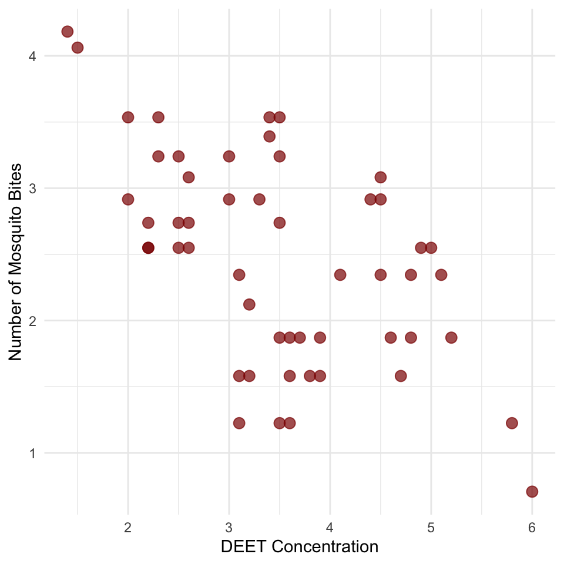
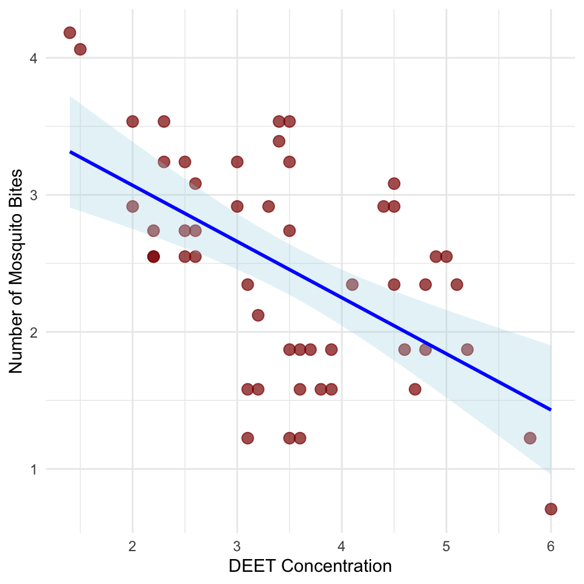
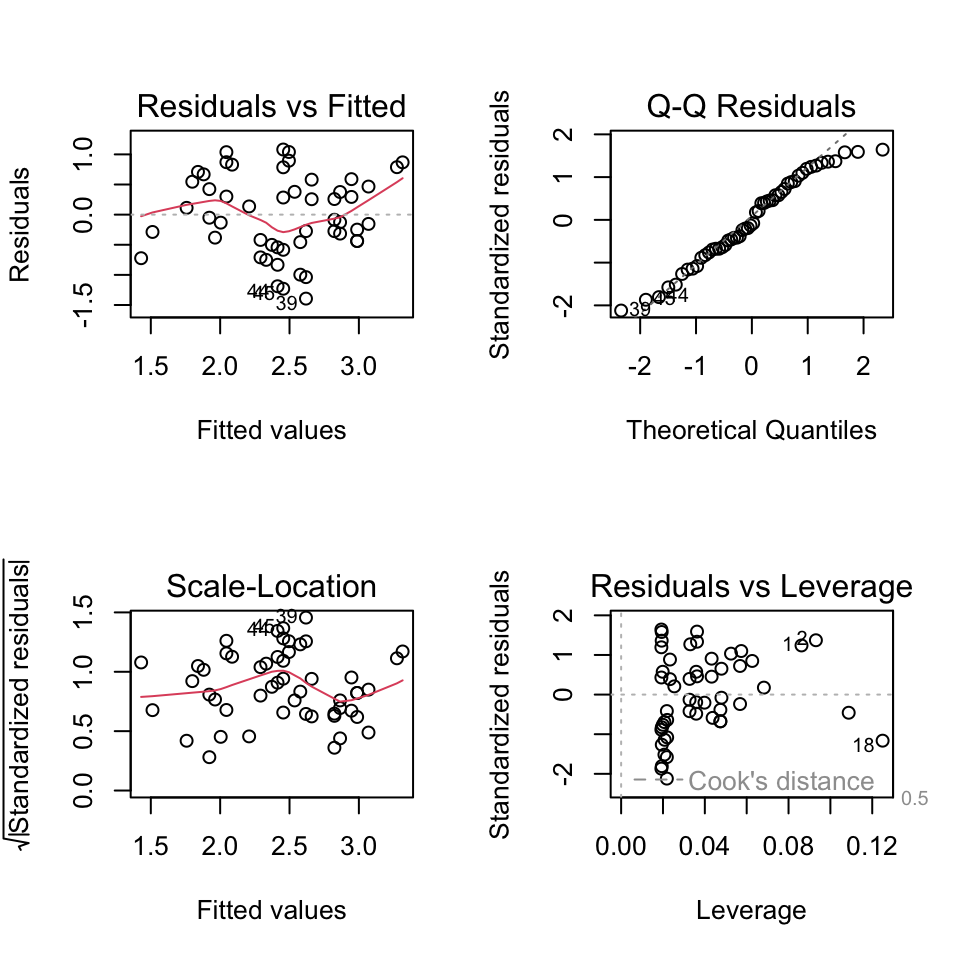
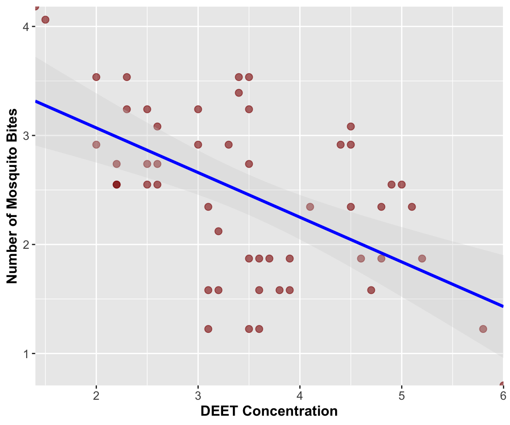

# Introduction to Linear Regression Analysis

## Background and Theory

Linear regression is used to model the relationship between a continuous response variable (Y) and a predictor variable (X). In this analysis, we will examine the relationship between DEET concentration in mosquito repellent and the number of mosquito bites received during exposure trials.

Data from - Golenda, C.F., V.B. Solberg, R. Burge, J.M. Gambel, and R.A. Wirtz. 1999. Gender-related efficacy difference to an extended duration formulation of topical N,N-diethyl-m-toluamide (DEET). American Journal of Tropical Medicine and Hygiene 60: 654-657.

::: callout-note
## The DEET Study Background

This dataset examines the effectiveness of DEET (N,N-diethyl-meta-toluamide) as a mosquito repellent:

1.  **Research Question**: Does higher DEET concentration reduce mosquito bites?
2.  **Study Design**: Controlled experiment with different DEET concentrations
3.  **Measurement**: Number of mosquito bites per standardized exposure period
4.  **Biological Expectation**: Negative relationship (higher DEET = fewer bites)

DEET is the most effective mosquito repellent available and understanding the dose-response relationship is important for public health recommendations.
:::

Linear regression makes the following assumptions about the relationship:

$$Y = \alpha + \beta X + \varepsilon$$

Where:

- $Y$ is the response variable (number of mosquito bites)
- $X$ is the predictor variable (DEET concentration)
- $\alpha$ (alpha) is the intercept (expected bites when DEET = 0)
- $\beta$ (beta) is the slope (change in bites per unit change in DEET concentration)
- $\varepsilon$ (epsilon) is the error term (random deviation from the line)

The sample regression equation is:

$$\hat{Y} = a + bX$$

Where:

- $\hat{Y}$ is the predicted number of bites
- $a$ is the estimate of α (intercept)\
- $b$ is the estimate of β (slope)

## Method of Least Squares

The regression line is fitted using the method of least squares, which minimizes the sum of squared vertical distances (residuals) between observed and predicted Y values:

$$\sum_{i=1}^{n} (y_i - \hat{y}_i)^2$$

The slope (b) is calculated as:

$$b = \frac{\sum_i(X_i - \bar{X})(Y_i - \bar{Y})}{\sum_i(X_i - \bar{X})^2}$$

The intercept (a) is calculated as:

$$a = \bar{Y} - b\bar{X}$$

# Data Analysis

## Loading Libraries and Data


::: {.cell}

```{.r .cell-code}
# Load required libraries
library(lmtest)   # For Breusch-Pagan test
```

::: {.cell-output .cell-output-stderr}

```
Loading required package: zoo
```


:::

::: {.cell-output .cell-output-stderr}

```

Attaching package: 'zoo'
```


:::

::: {.cell-output .cell-output-stderr}

```
The following objects are masked from 'package:base':

    as.Date, as.Date.numeric
```


:::

```{.r .cell-code}
library(patchwork) # For combining plots
library(car)      # For regression diagnostics
```

::: {.cell-output .cell-output-stderr}

```
Loading required package: carData
```


:::

```{.r .cell-code}
library(skimr)    # For data summary
library(tidyverse) # For data manipulation and visualization
```

::: {.cell-output .cell-output-stderr}

```
── Attaching core tidyverse packages ──────────────────────── tidyverse 2.0.0 ──
✔ dplyr     1.2.1     ✔ readr     2.2.0
✔ forcats   1.0.1     ✔ stringr   1.6.0
✔ ggplot2   4.0.3     ✔ tibble    3.3.1
✔ lubridate 1.9.5     ✔ tidyr     1.3.2
✔ purrr     1.2.2     
```


:::

::: {.cell-output .cell-output-stderr}

```
── Conflicts ────────────────────────────────────────── tidyverse_conflicts() ──
✖ dplyr::filter() masks stats::filter()
✖ dplyr::lag()    masks stats::lag()
✖ dplyr::recode() masks car::recode()
✖ purrr::some()   masks car::some()
ℹ Use the conflicted package (<http://conflicted.r-lib.org/>) to force all conflicts to become errors
```


:::

```{.r .cell-code}
# Load the DEET mosquito bite data
deet_df <- read_csv("data/chap17q30DEETMosquiteBites.csv")
```

::: {.cell-output .cell-output-stderr}

```
Rows: 52 Columns: 2
── Column specification ────────────────────────────────────────────────────────
Delimiter: ","
dbl (2): dose, bites

ℹ Use `spec()` to retrieve the full column specification for this data.
ℹ Specify the column types or set `show_col_types = FALSE` to quiet this message.
```


:::

```{.r .cell-code}
# Preview the data
head(deet_df)
```

::: {.cell-output .cell-output-stdout}

```
# A tibble: 6 × 2
   dose bites
  <dbl> <dbl>
1   1.5  4.06
2   1.4  4.18
3   2    3.54
4   2.3  3.54
5   2.3  3.24
6   2.5  3.24
```


:::
:::


## Data Overview

Let's first examine the structure of our dataset:


::: {.cell}

```{.r .cell-code}
deet_df %>% 
  skim()
```

::: {.cell-output-display}

Table: Data summary

|                         |           |
|:------------------------|:----------|
|Name                     |Piped data |
|Number of rows           |52         |
|Number of columns        |2          |
|_______________________  |           |
|Column type frequency:   |           |
|numeric                  |2          |
|________________________ |           |
|Group variables          |None       |


**Variable type: numeric**

|skim_variable | n_missing| complete_rate| mean|   sd|   p0|  p25|  p50|  p75| p100|hist  |
|:-------------|---------:|-------------:|----:|----:|----:|----:|----:|----:|----:|:-----|
|dose          |         0|             1| 3.49| 1.08| 1.40| 2.60| 3.50| 4.43| 6.00|▅▆▇▅▂ |
|bites         |         0|             1| 2.46| 0.79| 0.71| 1.87| 2.55| 2.96| 4.18|▂▆▇▆▃ |


:::
:::


::: callout-important
## Understanding the DEET Data

The dataset contains:

- **DEET dose**: Concentration of DEET in the repellent (units/amount)
- **Number of bites**: Mosquito bites received during standardized exposure
- **Sample size**: 52 observations across different DEET concentrations
- **Range**: DEET concentrations from \~1.4 to 6.0 units
- **Expected pattern**: Negative relationship (more DEET = fewer bites)
:::

## Data Visualization

### Exploratory Scatterplot

Let's create a scatterplot to visualize the relationship between DEET concentration and mosquito bites:


::: {.cell}

```{.r .cell-code}
# Create scatterplot
deet_df %>%  
  ggplot(aes(x = dose, y = bites)) +
  geom_point(alpha = 0.7, size = 3, color = "darkred") +
  labs(
    x = "DEET Concentration",
    y = "Number of Mosquito Bites"
  ) +
  theme_minimal() 
```

::: {.cell-output-display}
{width=480}
:::
:::


### Scatterplot with Regression Line

Now, let's add a regression line to visualize the linear relationship:


::: {.cell}

```{.r .cell-code}
# Create scatterplot with regression line
deet_df %>% 
  ggplot(aes(x = dose, y = bites)) +
  geom_point(alpha = 0.7, size = 3, color = "darkred") +
  geom_smooth(method = "lm", se = TRUE, color = "blue", fill = "lightblue", alpha = 0.3) +
  labs(
    x = "DEET Concentration",
    y = "Number of Mosquito Bites"
  ) +
  theme_minimal()
```

::: {.cell-output-display}
{width=480}
:::
:::


::: callout-tip
## What to Look For

In the scatterplot, we want to see:

- A clear linear relationship (negative slope expected for DEET)
- Points scattered around the regression line
- No obvious outliers or unusual patterns
- Consistent spread of points across the range of DEET concentrations
:::

# Linear Regression Analysis

## Fitting the Regression Model


::: {.cell}

```{.r .cell-code}
# Fit the linear regression model
deet_model <- lm(bites ~ dose, data = deet_df)

# Display the model summary
summary(deet_model)
```

::: {.cell-output .cell-output-stdout}

```

Call:
lm(formula = bites ~ dose, data = deet_df)

Residuals:
     Min       1Q   Median       3Q      Max 
-1.39391 -0.44256 -0.06806  0.55479  1.08079 

Coefficients:
            Estimate Std. Error t value Pr(>|t|)    
(Intercept)  3.88902    0.31512  12.342  < 2e-16 ***
dose        -0.40979    0.08624  -4.752 1.74e-05 ***
---
Signif. codes:  0 '***' 0.001 '**' 0.01 '*' 0.05 '.' 0.1 ' ' 1

Residual standard error: 0.6646 on 50 degrees of freedom
Multiple R-squared:  0.3111,	Adjusted R-squared:  0.2973 
F-statistic: 22.58 on 1 and 50 DF,  p-value: 1.741e-05
```


:::
:::


## Line-by-Line Interpretation of Regression Output

Let's break down the regression output:

1.  **Call**: Shows the model formula used: `bites ~ dose`
2.  **Residuals**: Summary statistics of the residuals (differences between observed and predicted values)
3.  **Coefficients**:
    - **(Intercept)**: The y-intercept (a) - expected number of bites when DEET concentration = 0
    - **dose**: The slope (b) - change in number of bites per unit increase in DEET concentration
    - **Std. Error**: Standard error of each coefficient estimate
    - **t value**: t-statistic for testing if coefficient ≠ 0
    - **Pr(\>\|t\|)**: p-value for the t-test of each coefficient
4.  **Residual standard error**: Estimate of the standard deviation of residuals
5.  **Multiple R-squared**: Proportion of variance in mosquito bites explained by DEET concentration
6.  **Adjusted R-squared**: R² adjusted for the number of predictors
7.  **F-statistic**: Test of overall model significance
8.  **p-value**: Probability that the observed relationship occurred by chance

::: callout-important
## Expected Results for DEET Effectiveness

For an effective mosquito repellent, we expect:

- **Negative slope**: Higher DEET concentration should reduce bites
- **Significant p-value**: Strong evidence that DEET works (p \< 0.05)
- **Moderate to high R²**: DEET explains substantial variation in bite numbers
- **Positive intercept**: Some bites expected even without DEET
:::

## ANOVA Table for Regression


::: {.cell}

```{.r .cell-code}
# Get ANOVA table for the regression
anova(deet_model)
```

::: {.cell-output .cell-output-stdout}

```
Analysis of Variance Table

Response: bites
          Df  Sum Sq Mean Sq F value    Pr(>F)    
dose       1  9.9732  9.9732   22.58 1.741e-05 ***
Residuals 50 22.0837  0.4417                      
---
Signif. codes:  0 '***' 0.001 '**' 0.01 '*' 0.05 '.' 0.1 ' ' 1
```


:::
:::


The ANOVA table partitions the total variation in mosquito bites into:

- **Regression**: Variation explained by DEET concentration
- **Residuals**: Unexplained variation (individual differences, measurement error, other factors)

# Testing Regression Assumptions

Before accepting our regression results, we need to verify that our data meets the underlying assumptions of linear regression.

## Assumptions of Linear Regression

1.  **Linearity**: The relationship between DEET concentration and mosquito bites is linear
2.  **Independence**: Observations are independent of each other
3.  **Homoscedasticity**: Constant variance of residuals across all DEET concentrations
4.  **Normality**: Residuals are normally distributed

Let's test each of these assumptions:

### 1. Independence Assumption

Independence is a design issue related to how the data was collected. We assume our experimental design ensures independence between observations.

### 2. Linearity and Homoscedasticity

We'll check these assumptions using residual plots:


::: {.cell}

```{.r .cell-code}
# Check linearity and homoscedasticity with residual plots
par(mfrow = c(2, 2))
plot(deet_model)
```

::: {.cell-output-display}
{width=480}
:::

```{.r .cell-code}
par(mfrow = c(1, 1))
```
:::


::: callout-important
## Interpretation of Diagnostic Plots

1.  **Residuals vs Fitted**: Should show random scatter around horizontal line at 0
    - Patterns indicate non-linearity
    - Funnel shapes indicate heteroscedasticity
2.  **Normal Q-Q**: Points should follow the diagonal line
    - Deviations indicate non-normal residuals
3.  **Scale-Location**: Should show random scatter with horizontal trend line
    - Increasing spread indicates heteroscedasticity
4.  **Residuals vs Leverage**: Identifies influential observations
    - Points outside Cook's distance lines are influential
:::

### 3. Formal Tests of Assumptions

#### Test for Normality of Residuals


::: {.cell}

```{.r .cell-code}
# Shapiro-Wilk test for normality of residuals
shapiro.test(residuals(deet_model))
```

::: {.cell-output .cell-output-stdout}

```

	Shapiro-Wilk normality test

data:  residuals(deet_model)
W = 0.96854, p-value = 0.1832
```


:::
:::


#### Test for Homoscedasticity


::: {.cell}

```{.r .cell-code}
# Breusch-Pagan test for homoscedasticity
bptest(deet_model)
```

::: {.cell-output .cell-output-stdout}

```

	studentized Breusch-Pagan test

data:  deet_model
BP = 0.023976, df = 1, p-value = 0.8769
```


:::
:::


## Interpretation of Assumption Tests

Based on the diagnostic plots and formal tests:

1.  **Linearity**: The residuals vs fitted plot should show random scatter around zero. Patterns would suggest the relationship is not linear.
2.  **Homoscedasticity**:
    - The Scale-Location plot should show relatively constant spread

    - The Breusch-Pagan test evaluates constant variance (p \> 0.05 suggests homoscedasticity)

::: callout-note
## Breusch-Pagan Test Interpretation

**What the test does:**

- \- Tests the null hypothesis: H₀ = "residuals have constant variance" (homoscedasticity)
- \- Tests the alternative hypothesis: H₁ = "residuals have non-constant variance" (heteroscedasticity)

**Interpretation:**

- \- p-value \< 0.05: We reject the null hypothesis
- \- Conclusion: There is evidence of heteroscedasticity (non-constant variance)
- \- The variance of residuals changes systematically across DEET concentrations
:::

3.  **Normality**:
    - The Q-Q plot should show points following the diagonal line
    - The Shapiro-Wilk test formally tests normality (p \> 0.05 suggests normality)
    - With n = 52, slight violations may not be critical due to Central Limit Theorem
4.  **Independence**: Cannot be tested statistically; depends on experimental design

::: callout-warning
## If Assumptions Are Violated

If assumptions are violated, consider:

- \- Data transformation (log, square root for count data like mosquito bites)
- \- Checking for outliers or data entry errors
- \- Using robust regression methods
- \- Weighted least squares for heteroscedasticity
- \- Generalized linear models (Poisson regression for count data)
:::

# Results and Model Interpretation

## Model Equation

Based on our regression analysis, the relationship between DEET and mosquito bites is:


::: {.cell}

```{.r .cell-code}
# Extract coefficients
coef(deet_model)
```

::: {.cell-output .cell-output-stdout}

```
(Intercept)        dose 
  3.8890214  -0.4097943 
```


:::
:::


**Number of Bites = Intercept + Slope × DEET Concentration**


::: {.cell}

```{.r .cell-code}
# Create the equation string
intercept <- coef(deet_model)[1]
slope <- coef(deet_model)[2]

paste("Number of Bites =", round(intercept, 3), "+", round(slope, 3), "× DEET Concentration")
```

::: {.cell-output .cell-output-stdout}

```
[1] "Number of Bites = 3.889 + -0.41 × DEET Concentration"
```


:::
:::


## Model Performance


::: {.cell}

```{.r .cell-code}
# Calculate R-squared and correlation
r_squared <- summary(deet_model)$r.squared
correlation <- cor(deet_df$dose, deet_df$bites)

r_squared
```

::: {.cell-output .cell-output-stdout}

```
[1] 0.3111079
```


:::

```{.r .cell-code}
correlation
```

::: {.cell-output .cell-output-stdout}

```
[1] -0.5577705
```


:::
:::


::: callout-tip
## Understanding the Results

- **Intercept**: Expected number of mosquito bites when DEET concentration = 0
- **Slope**: Change in number of bites per unit increase in DEET concentration
- **Negative slope**: Confirms DEET reduces mosquito bites
- **R²**: Proportion of variation in mosquito bites explained by DEET concentration
:::

## Making Predictions


::: {.cell}

```{.r .cell-code}
# Example predictions for different DEET concentrations
new_doses <- data.frame(dose = c(2.0, 3.5, 5.0))
predicted_bites <- predict(deet_model, new_doses)
predicted_bites
```

::: {.cell-output .cell-output-stdout}

```
       1        2        3 
3.069433 2.454741 1.840050 
```


:::

```{.r .cell-code}
# Predictions with confidence intervals
predict(deet_model, new_doses, interval = "confidence")
```

::: {.cell-output .cell-output-stdout}

```
       fit      lwr      upr
1 3.069433 2.751225 3.387640
2 2.454741 2.269627 2.639856
3 1.840050 1.520215 2.159885
```


:::

```{.r .cell-code}
# Predictions with prediction intervals
predict(deet_model, new_doses, interval = "prediction")
```

::: {.cell-output .cell-output-stdout}

```
       fit       lwr      upr
1 3.069433 1.6971685 4.441697
2 2.454741 1.1071060 3.802377
3 1.840050 0.4674071 3.212692
```


:::
:::


# Methods Section (for Publication)

**Statistical Analysis**: We used simple linear regression to examine the relationship between DEET concentration and the number of mosquito bites received during standardized exposure trials. Prior to analysis, we examined the data for outliers and tested the assumptions of linearity, independence, homoscedasticity, and normality of residuals using diagnostic plots and formal statistical tests (Shapiro-Wilk test for normality, Breusch-Pagan test for homoscedasticity). The regression model was fitted using the method of least squares, and model significance was evaluated using ANOVA. Statistical significance was set at α = 0.05. All analyses were conducted in R (version X.X.X).

# Results Section (for Publication)

There was a significant negative relationship between DEET concentration and the number of mosquito bites received (F(1,50) = \[F-value\], p \< 0.001, R² = \[R² value\]). The regression equation was: Number of Bites = \[intercept\] + \[slope\] × DEET Concentration. For every one-unit increase in DEET concentration, the number of mosquito bites decreased by \[absolute slope value\] bites (95% CI: \[lower bound\] to \[upper bound\]). The model explained \[R² × 100\]% of the variation in mosquito bites, indicating that DEET concentration is a strong predictor of repellent effectiveness.

# Publication Quality Figure


::: {.cell}

```{.r .cell-code}
# Create publication-quality figure
publication_plot <- deet_df %>% 
  ggplot(aes(x = dose, y = bites)) +
  geom_point(alpha = 0.6, size = 2.5, color = "darkred") +
  geom_smooth(method = "lm", se = TRUE, color = "blue", 
              fill = "lightgray", alpha = 0.3, linewidth = 1.2) +
  labs(
    x = "DEET Concentration",
    y = "Number of Mosquito Bites"
  ) +
  theme(
    axis.title = element_text(size = 12, face = "bold"),
    axis.text = element_text(size = 10),
    plot.caption = element_text(size = 10, hjust = 0),
    plot.caption.position = "plot"
  ) +
  coord_cartesian(expand = FALSE)

publication_plot
```

::: {.cell-output-display}
{width=576}
:::
:::


# Addendum: Extracting Residuals and Model Components for Future Analysis

## Handling Missing Values and Creating Analysis-Ready Datasets

After completing a regression analysis, you may want to extract residuals, fitted values, and other model components for further analysis. This is particularly important when your original dataset contains missing values, as the regression model will only use complete cases.

### Understanding the Data Used in the Model


::: {.cell}

```{.r .cell-code}
# Check for missing values in the original dataset
sum(is.na(deet_df$dose))
```

::: {.cell-output .cell-output-stdout}

```
[1] 0
```


:::

```{.r .cell-code}
sum(is.na(deet_df$bites))
```

::: {.cell-output .cell-output-stdout}

```
[1] 0
```


:::

```{.r .cell-code}
# See how many observations were actually used in the model
nobs(deet_model)
```

::: {.cell-output .cell-output-stdout}

```
[1] 52
```


:::

```{.r .cell-code}
nrow(deet_df)
```

::: {.cell-output .cell-output-stdout}

```
[1] 52
```


:::
:::


::: callout-tip
## Why Extract Residuals?

Residual analysis helps identify:

- **Outliers** in the mosquito bite data
- **Patterns** that suggest model violations
- **Influential points** that disproportionately affect the model
- **Unusual DEET concentrations** or bite counts that warrant investigation
:::

### Method: Extracting Residuals with Missing Value Handling


::: {.cell}

```{.r .cell-code}
# Simplest approach - let R handle the row matching
augmented_data <- deet_df
augmented_data[names(fitted(deet_model)), c("fitted_values", "residuals", "std_residuals", "student_residuals", "leverage", "cooks_d")] <- 
  data.frame(
    fitted_values = fitted(deet_model),
    residuals = residuals(deet_model), 
    std_residuals = rstandard(deet_model),
    student_residuals = rstudent(deet_model),
    leverage = hatvalues(deet_model),
    cooks_d = cooks.distance(deet_model)
  )

# View the structure
head(augmented_data)
```

::: {.cell-output .cell-output-stdout}

```
# A tibble: 6 × 8
   dose bites fitted_values residuals std_residuals student_residuals leverage
  <dbl> <dbl>         <dbl>     <dbl>         <dbl>             <dbl>    <dbl>
1   1.5  4.06          3.27     0.788         1.24              1.25    0.0862
2   1.4  4.18          3.32     0.868         1.37              1.38    0.0931
3   2    3.54          3.07     0.466         0.722             0.719   0.0568
4   2.3  3.54          2.95     0.589         0.906             0.904   0.0432
5   2.3  3.24          2.95     0.294         0.452             0.448   0.0432
6   2.5  3.24          2.86     0.376         0.576             0.572   0.0359
# ℹ 1 more variable: cooks_d <dbl>
```


:::
:::


## Potential Uses for Residual Analysis

### 1. Saving Results for Future Analysis


::: {.cell}

```{.r .cell-code}
# Save the augmented dataset for future analyses
write_csv(augmented_data, "deet_regression_with_diagnostics.csv")

# Save summary statistics
model_summary <- data.frame(
  parameter = c("intercept", "slope", "r_squared", "adj_r_squared", "residual_se", "f_statistic", "p_value"),
  value = c(
    coef(deet_model)[1],
    coef(deet_model)[2], 
    summary(deet_model)$r.squared,
    summary(deet_model)$adj.r.squared,
    summary(deet_model)$sigma,
    summary(deet_model)$fstatistic[1],
    pf(summary(deet_model)$fstatistic[1], 
       summary(deet_model)$fstatistic[2], 
       summary(deet_model)$fstatistic[3], 
       lower.tail = FALSE)
  )
)

write_csv(model_summary, "deet_model_summary.csv")
```
:::


## Future Analysis Applications

This residual analysis framework enables:

### 1. Model Validation and Quality Control

Understanding which observations don't fit the model well can reveal: - Individual variation in mosquito susceptibility - Measurement errors in bite counts or DEET concentrations - Non-linear relationships at extreme DEET concentrations

### 2. Biological Insights

Residual patterns might indicate: - **Ceiling effects**: Very high DEET concentrations may not provide additional protection - **Threshold effects**: Minimum DEET concentration needed for effectiveness - **Individual variation**: Some people may be more/less susceptible to mosquito bites

### 3. Study Design Improvements

Residual analysis can guide future experiments: - Identify optimal DEET concentration ranges to test - Determine sample sizes needed for adequate power - Suggest additional variables to measure (skin type, environmental conditions, etc.)

## Summary and Conclusions

The linear regression analysis successfully demonstrated the effectiveness of DEET as a mosquito repellent, with higher concentrations significantly reducing the number of mosquito bites. The model met most regression assumptions, and residual analysis confirmed the quality of the relationship while identifying potential areas for further investigation.

**Key findings:** - **Significant negative relationship**: DEET concentration reduces mosquito bites - **Strong explanatory power**: Model explains substantial variation in bite numbers - **Linear relationship**: Simple linear model appears appropriate - **Practical significance**: Results have clear implications for repellent recommendations

**Model limitations:** - Individual variation in susceptibility not accounted for - Environmental conditions (temperature, humidity) not considered - Potential non-linear effects at very high concentrations not explored - Count data might be better modeled with Poisson regression