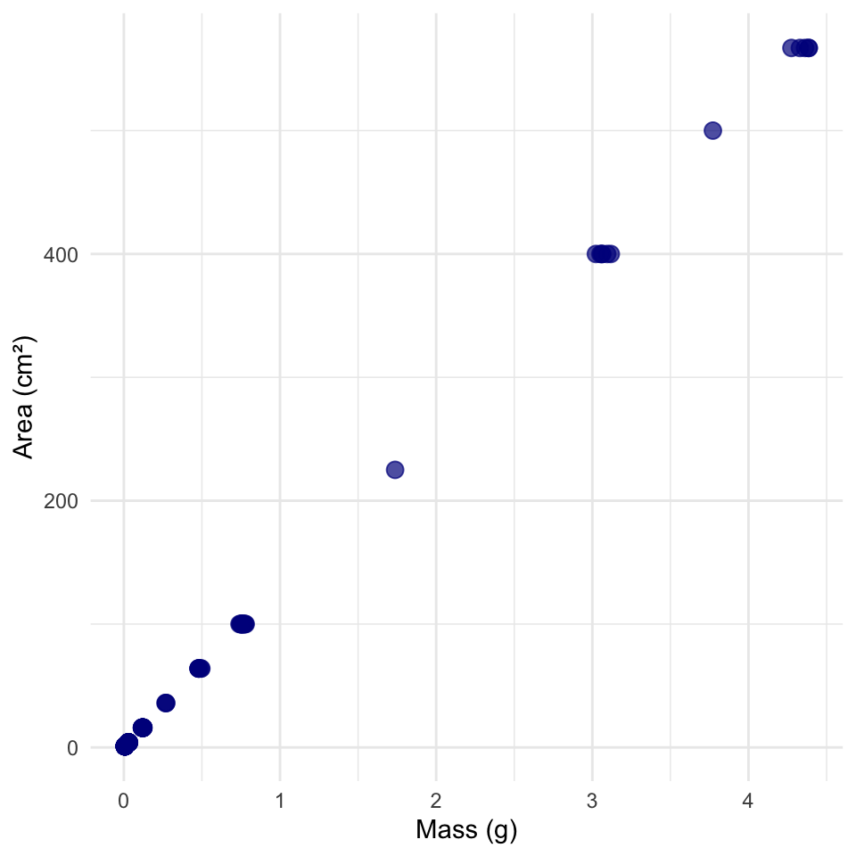
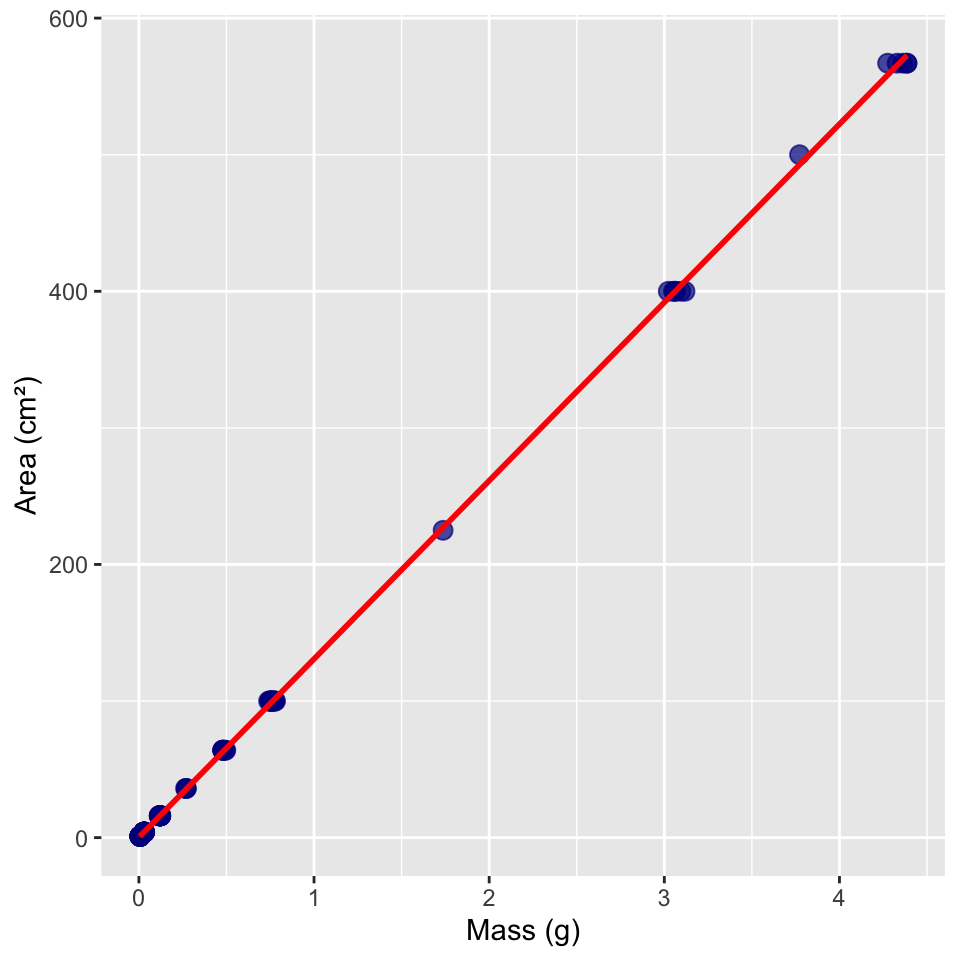
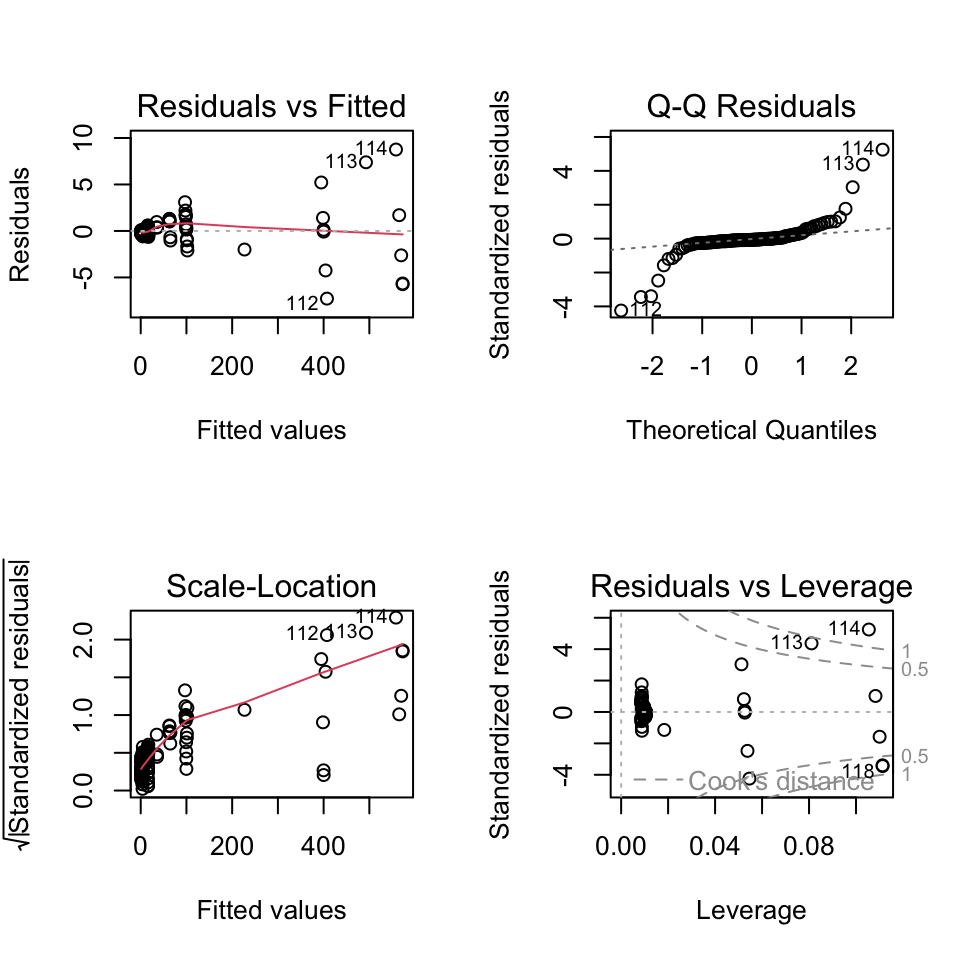
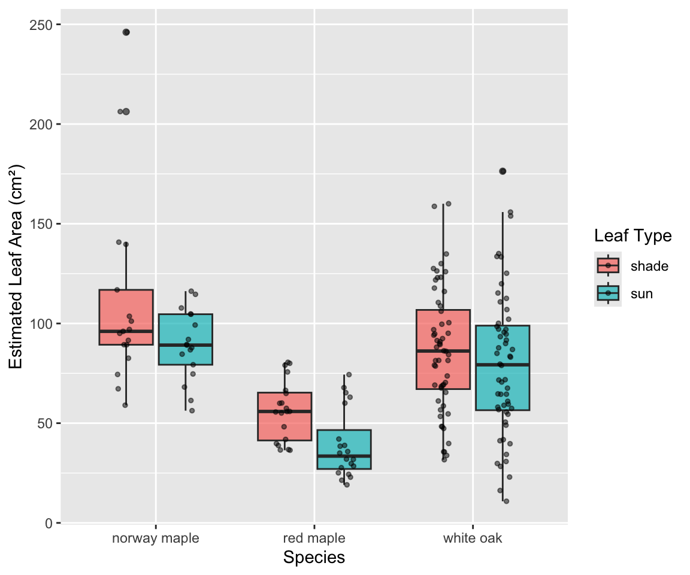
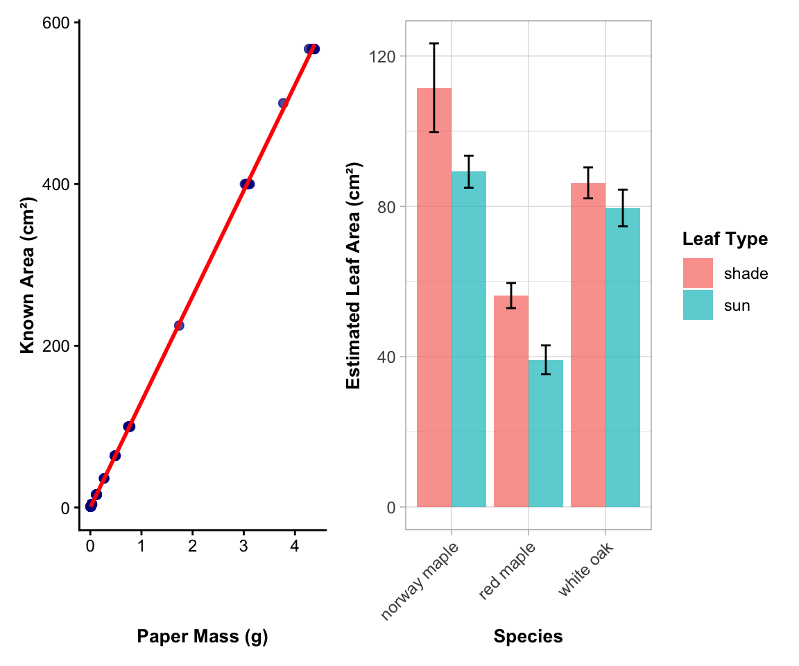

# Introduction to Linear Regression Analysis

## Background and Theory

Linear regression is used to model the relationship between a continuous response variable (Y) and a predictor variable (X). In this analysis, we will examine the relationship between the mass of paper cutouts and their corresponding known areas to develop a calibration model. This model will then be used to estimate leaf areas from the mass of leaf tracings cut from the same paper.

::: callout-note
## The Paperweight Method for Leaf Area Estimation

This technique uses the linear relationship between paper mass and area to estimate leaf area:

1.  **Calibration phase**: Cut known areas of paper and weigh them to establish the mass-area relationship
2.  **Application phase**: Trace leaves on the same paper, cut out the tracings, weigh them, and use the calibration equation to estimate leaf area

This method is cost-effective and doesn't require expensive leaf area measurement equipment.
:::

Linear regression makes the following assumptions about the relationship:

$$Y = \alpha + \beta X + \varepsilon$$

Where:

- $Y$ is the response variable (area in cm²)
- $X$ is the predictor variable (mass in g)
- $\alpha$ (alpha) is the intercept (theoretical area when mass = 0)
- $\beta$ (beta) is the slope (change in area per unit change in mass)
- $\varepsilon$ (epsilon) is the error term (random deviation from the line)

The sample regression equation is:

$$\hat{Y} = a + bX$$

Where:

- $\hat{Y}$ is the predicted area
- $a$ is the estimate of α (intercept)
- $b$ is the estimate of β (slope)

## Method of Least Squares

The regression line is fitted using the method of least squares, which minimizes the sum of squared vertical distances (residuals) between observed and predicted Y values:

$$\sum_{i=1}^{n} (y_i - \hat{y}_i)^2$$

The slope (b) is calculated as:

$$b = \frac{\sum_i(X_i - \bar{X})(Y_i - \bar{Y})}{\sum_i(X_i - \bar{X})^2}$$

The intercept (a) is calculated as:

$$a = \bar{Y} - b\bar{X}$$

# Data Analysis

## Loading Libraries and Data


::: {.cell}

```{.r .cell-code}
# Load required libraries
library(lmtest)
```

::: {.cell-output .cell-output-stderr}

```
Loading required package: zoo
```


:::

::: {.cell-output .cell-output-stderr}

```

Attaching package: 'zoo'
```


:::

::: {.cell-output .cell-output-stderr}

```
The following objects are masked from 'package:base':

    as.Date, as.Date.numeric
```


:::

```{.r .cell-code}
library(patchwork)
library(car)      # For regression diagnostics
```

::: {.cell-output .cell-output-stderr}

```
Loading required package: carData
```


:::

```{.r .cell-code}
library(skimr)    # For data summary
library(tidyverse) # For data manipulation and visualization
```

::: {.cell-output .cell-output-stderr}

```
── Attaching core tidyverse packages ──────────────────────── tidyverse 2.0.0 ──
✔ dplyr     1.2.1     ✔ readr     2.2.0
✔ forcats   1.0.1     ✔ stringr   1.6.0
✔ ggplot2   4.0.3     ✔ tibble    3.3.1
✔ lubridate 1.9.5     ✔ tidyr     1.3.2
✔ purrr     1.2.2     
```


:::

::: {.cell-output .cell-output-stderr}

```
── Conflicts ────────────────────────────────────────── tidyverse_conflicts() ──
✖ dplyr::filter() masks stats::filter()
✖ dplyr::lag()    masks stats::lag()
✖ dplyr::recode() masks car::recode()
✖ purrr::some()   masks car::some()
ℹ Use the conflicted package (<http://conflicted.r-lib.org/>) to force all conflicts to become errors
```


:::

```{.r .cell-code}
library(readxl)   # For reading Excel files

# Load the calibration data (paperweights)
paperweight_df <- read_excel("data/paperweights.xlsx")

# Load the leaf trace data for future application
leaf_trace_df <- read_excel("data/leaf_trace_masses.xlsx")

# Preview the calibration data
head(paperweight_df)
```

::: {.cell-output .cell-output-stdout}

```
# A tibble: 6 × 2
  area_cm2 mass_g
     <dbl>  <dbl>
1        1 0.0049
2        1 0.0052
3        1 0.0058
4        1 0.0059
5        1 0.0061
6        1 0.0062
```


:::
:::


::: {.cell}

```{.r .cell-code}
# Preview the leaf trace data
head(leaf_trace_df)
```

::: {.cell-output .cell-output-stdout}

```
# A tibble: 6 × 6
  species   section leaf_number leaf_type trace_mass_g `tree number`
  <chr>       <dbl>       <dbl> <chr>            <dbl>         <dbl>
1 white oak       2           1 sun              0.261            NA
2 white oak       2           2 shade            0.940            NA
3 white oak       2           3 sun              0.730            NA
4 white oak       2           4 shade            0.975            NA
5 white oak       2           5 sun              0.373            NA
6 white oak       2           6 shade            0.529            NA
```


:::
:::


## Data Overview

::: callout-important
## Understanding the Calibration Data

The paperweight data contains:

- **Known areas** (cm²) of paper cutouts
  - these are standardized areas (1, 4, 9, 16, 25 cm²)
- **Measured masses** (g) of those same cutouts
  - This establishes the mass-to-area conversion factor for this specific paper type

  - Multiple measurements at each area level provide replication for better model accuracy
:::

## Data Visualization

### Exploratory Scatterplot

Let's create a scatterplot to visualize the relationship between paper mass and known area:


::: {.cell}

```{.r .cell-code}
# Create scatterplot
paperweight_df %>%  
  ggplot(aes(x = mass_g, y = area_cm2)) +
  geom_point(alpha = 0.7, size = 3, color = "darkblue") +
  labs(
    x = "Mass (g)",
    y = "Area (cm²)"
  ) +
  theme_minimal() 
```

::: {.cell-output-display}
{width=480}
:::
:::


### Scatterplot with Regression Line

Now, let's add a regression line to visualize the linear relationship:


::: {.cell}

```{.r .cell-code}
# Create scatterplot with regression line
paperweight_df %>% 
  ggplot(aes(x = mass_g, y = area_cm2)) +
  geom_point(alpha = 0.7, size = 3, color = "darkblue") +
  geom_smooth(method = "lm", se = TRUE, color = "red", fill = "pink", alpha = 0.3) +
  labs(
    x = "Mass (g)",
    y = "Area (cm²)"
  ) 
```

::: {.cell-output-display}
{width=480}
:::
:::


::: callout-tip
## What to Look For

In the scatterplot, we want to see:

- A strong linear relationship (points close to the line)
- No obvious outliers or unusual patterns
- The relationship should pass near the origin (0,0) since no mass should equal no area
:::

# Linear Regression Analysis

## Fitting the Regression Model


::: {.cell}

```{.r .cell-code}
# Fit the linear regression model
calibration_model <- lm(area_cm2 ~ mass_g, data = paperweight_df)

# Display the model summary
summary(calibration_model)
```

::: {.cell-output .cell-output-stdout}

```

Call:
lm(formula = area_cm2 ~ mass_g, data = paperweight_df)

Residuals:
    Min      1Q  Median      3Q     Max 
-7.2774 -0.3059 -0.1221  0.2264  8.7592 

Coefficients:
            Estimate Std. Error t value Pr(>|t|)    
(Intercept)   0.2792     0.1812   1.541    0.126    
mass_g      130.5234     0.1473 885.964   <2e-16 ***
---
Signif. codes:  0 '***' 0.001 '**' 0.01 '*' 0.05 '.' 0.1 ' ' 1

Residual standard error: 1.764 on 116 degrees of freedom
Multiple R-squared:  0.9999,	Adjusted R-squared:  0.9999 
F-statistic: 7.849e+05 on 1 and 116 DF,  p-value: < 2.2e-16
```


:::
:::


## Line-by-Line Interpretation of Regression Output

Let's break down the regression output:

1.  **Call**: Shows the model formula used: `area_cm2 ~ mass_g`
2.  **Residuals**: Summary statistics of the residuals (differences between observed and predicted values)
3.  **Coefficients**:
    - **(Intercept)**: The y-intercept (a) - theoretical area when mass = 0 (should be close to 0)
    - **mass_g**: The slope (b) - change in area per 1g increase in mass (cm²/g conversion factor)
    - **Std. Error**: Standard error of each coefficient estimate
    - **t value**: t-statistic for testing if coefficient ≠ 0
    - **Pr(\>\|t\|)**: p-value for the t-test of each coefficient
4.  **Residual standard error**: Estimate of the standard deviation of residuals
5.  **Multiple R-squared**: Proportion of variance in area explained by mass (should be very high, \>0.95)
6.  **Adjusted R-squared**: R² adjusted for the number of predictors
7.  **F-statistic**: Test of overall model significance
8.  **p-value**: Probability that the observed relationship occurred by chance

::: callout-important
## Expected Results for Good Calibration

For a good calibration model, we expect:

- **R² \> 0.98**: Very strong relationship
- **Intercept ≈ 0**: No area when no mass
- **Slope**: The paper density factor (area per unit mass)
- **Small residual standard error**: Precise measurements
:::

## ANOVA Table for Regression


::: {.cell}

```{.r .cell-code}
# Get ANOVA table for the regression
anova(calibration_model)
```

::: {.cell-output .cell-output-stdout}

```
Analysis of Variance Table

Response: area_cm2
           Df  Sum Sq Mean Sq F value    Pr(>F)    
mass_g      1 2441415 2441415  784933 < 2.2e-16 ***
Residuals 116     361       3                      
---
Signif. codes:  0 '***' 0.001 '**' 0.01 '*' 0.05 '.' 0.1 ' ' 1
```


:::
:::


The ANOVA table partitions the total variation in area into:

- \- **Regression**: Variation explained by the model (should be most of the variation)
- \- **Residuals**: Unexplained variation (should be very small for calibration data)

# Testing Regression Assumptions

Before accepting our regression results, we need to verify that our data meets the underlying assumptions of linear regression.

## Assumptions of Linear Regression

1.  **Linearity**: The relationship between X and Y is linear
2.  **Independence**: Observations are independent of each other
3.  **Homoscedasticity**: Constant variance of residuals across all values of X
4.  **Normality**: Residuals are normally distributed

Let's test each of these assumptions:

### 1. Independence Assumption

Independence is a design issue related to how the data was collected. We assume our sampling design ensures independence between observations.

### 2. Linearity and Homoscedasticity

We'll check these assumptions using residual plots:


::: {.cell}

```{.r .cell-code}
# Check linearity and homoscedasticity with residual plots
par(mfrow = c(2, 2))
plot(calibration_model)
```

::: {.cell-output-display}
{width=480}
:::

```{.r .cell-code}
par(mfrow = c(1, 1))
```
:::


::: callout-important
## Interpretation of Diagnostic Plots

1.  **Residuals vs Fitted**: Should show random scatter around horizontal line at 0
    - Patterns indicate non-linearity
    - Funnel shapes indicate heteroscedasticity
2.  **Normal Q-Q**: Points should follow the diagonal line
    - Deviations indicate non-normal residuals
3.  **Scale-Location**: Should show random scatter with horizontal trend line
    - Increasing spread indicates heteroscedasticity
4.  **Residuals vs Leverage**: Identifies influential observations
    - Points outside Cook's distance lines are influential
:::

### 3. Formal Tests of Assumptions

#### Test for Normality of Residuals


::: {.cell}

```{.r .cell-code}
# Shapiro-Wilk test for normality of residuals
shapiro.test(residuals(calibration_model))
```

::: {.cell-output .cell-output-stdout}

```

	Shapiro-Wilk normality test

data:  residuals(calibration_model)
W = 0.67735, p-value = 9.425e-15
```


:::
:::


#### Test for Homoscedasticity


::: {.cell}

```{.r .cell-code}
# Breusch-Pagan test for homoscedasticity
bptest(calibration_model)
```

::: {.cell-output .cell-output-stdout}

```

	studentized Breusch-Pagan test

data:  calibration_model
BP = 60.095, df = 1, p-value = 9.041e-15
```


:::
:::


## Interpretation of Assumption Tests

Based on the diagnostic plots and formal tests:

1.  **Linearity**: The residuals vs fitted plot should show random scatter around zero. For calibration data with known areas, this should be excellent.

2.  **Homoscedasticity**:

    - The Scale-Location plot should show relatively constant spread
    - The Breusch-Pagan test evaluates constant variance (p \> 0.05 suggests homoscedasticity)

::: callout-note
## Breusch-Pagan Test Interpretation

**What the test does:**

- Tests the null hypothesis: H₀ = "residuals have constant variance" (homoscedasticity)

- Tests the alternative hypothesis: H₁ = "residuals have non-constant variance" (heteroscedasticity) Interpretation:

- p-value \< 0.05: We reject the null hypothesis

- Conclusion: There is evidence of heteroscedasticity (non-constant variance)

- Variance of residuals changes systematically across the range of fitted values\
:::

1.  **Normality**:

    - The Q-Q plot should show points following the diagonal line
    - The Shapiro-Wilk test formally tests normality (p \> 0.05 suggests normality)
    - For calibration data, normality should be good

2.  **Independence**: Cannot be tested statistically; depends on study design

::: callout-warning
## If Assumptions Are Violated

If assumptions are violated, consider:

- Data transformation (though this should be rare for calibration data)
- Checking for data entry errors
- Examining outliers for measurement errors
- Weighted least squares for heteroscedasticity
:::

# Results and Model Interpretation

## Model Equation

Based on our regression analysis, the calibration equation is:


::: {.cell}

```{.r .cell-code}
# Extract coefficients
coef(calibration_model)
```

::: {.cell-output .cell-output-stdout}

```
(Intercept)      mass_g 
  0.2792083 130.5234301 
```


:::
:::


**Area (cm²) = Intercept + Slope × Mass (g)**


::: {.cell}

```{.r .cell-code}
# Create the equation string
intercept <- coef(calibration_model)[1]
slope <- coef(calibration_model)[2]

paste("Area (cm²) =", round(intercept, 4), "+", round(slope, 2), "× Mass (g)")
```

::: {.cell-output .cell-output-stdout}

```
[1] "Area (cm²) = 0.2792 + 130.52 × Mass (g)"
```


:::
:::


::: callout-important
## Understanding the Slope

The slope represents the **specific leaf area** of the paper - how many cm² of area per gram of paper. This is the conversion factor we'll use to estimate leaf areas from trace masses.
:::

# Application: Estimating Leaf Areas

Now we'll use our calibration model to estimate leaf areas from the trace masses:

## Applying the Calibration Model


::: {.cell}

```{.r .cell-code}
# Clean up the leaf_type variable (remove extra spaces)
leaf_trace_df <- leaf_trace_df %>%
  mutate(leaf_type = str_trim(tolower(leaf_type)))

# Apply the calibration model to estimate leaf areas
leaf_trace_df <- leaf_trace_df %>%
  mutate(
    estimated_leaf_area_cm2 = predict(calibration_model, newdata = data.frame(mass_g = trace_mass_g))
  )

# View the results
head(leaf_trace_df)
```

::: {.cell-output .cell-output-stdout}

```
# A tibble: 6 × 7
  species   section leaf_number leaf_type trace_mass_g `tree number`
  <chr>       <dbl>       <dbl> <chr>            <dbl>         <dbl>
1 white oak       2           1 sun              0.261            NA
2 white oak       2           2 shade            0.940            NA
3 white oak       2           3 sun              0.730            NA
4 white oak       2           4 shade            0.975            NA
5 white oak       2           5 sun              0.373            NA
6 white oak       2           6 shade            0.529            NA
# ℹ 1 more variable: estimated_leaf_area_cm2 <dbl>
```


:::
:::


## Summary of Estimated Leaf Areas


::: {.cell}

```{.r .cell-code}
# Summary statistics of estimated leaf areas
leaf_trace_df %>%
  group_by(species, leaf_type) %>% 
  summarise(
    n = n(),
    mean_area = mean(estimated_leaf_area_cm2),
    sd_area = sd(estimated_leaf_area_cm2),
    min_area = min(estimated_leaf_area_cm2),
    max_area = max(estimated_leaf_area_cm2),
    .groups = "drop"
  )
```

::: {.cell-output .cell-output-stdout}

```
# A tibble: 6 × 7
  species      leaf_type     n mean_area sd_area min_area max_area
  <chr>        <chr>     <int>     <dbl>   <dbl>    <dbl>    <dbl>
1 norway maple shade        17     112.     48.7     59.0    246. 
2 norway maple sun          17      89.2    17.6     56.3    116. 
3 red maple    shade        20      56.3    15.0     36.4     80.5
4 red maple    sun          20      39.2    17.2     19.1     74.4
5 white oak    shade        56      86.3    30.9     31.7    160. 
6 white oak    sun          56      79.6    36.4     10.9    176. 
```


:::
:::


::: callout-important
## Biological Interpretation

We can now compare:

- **Sun vs. shade leaves** within species (sun leaves typically larger and thicker)
- **Different species** (species-specific leaf size patterns)
- **Individual variation** within treatment groups
:::

## Visualization of Estimated Leaf Areas


::: {.cell}

```{.r .cell-code}
# Create boxplot of estimated leaf areas by species and leaf type
leaf_trace_df %>%
  ggplot(aes(x = species, y = estimated_leaf_area_cm2, fill = leaf_type)) +
  geom_boxplot(alpha = 0.7) +
  geom_point(position = position_jitterdodge(dodge.width = 0.8, jitter.width = 0.2),
             alpha = 0.5, size = 1) +
  labs(
    x = "Species",
    y = "Estimated Leaf Area (cm²)",
    fill = "Leaf Type"
  ) 
```

::: {.cell-output-display}
{width=576}
:::
:::


# Methods Section (for Publication)

**Leaf Area Estimation**: Leaf areas were estimated using the paperweight method. A calibration curve was established by measuring the mass of paper cutouts with known areas (1, 4, 9, 16, and 25 cm²) cut from the same paper used for leaf tracings. Linear regression was used to model the relationship between paper mass (g) and area (cm²). Prior to analysis, we examined the data for outliers and tested the assumptions of linearity, independence, homoscedasticity, and normality of residuals using diagnostic plots and formal statistical tests (Shapiro-Wilk test for normality, Breusch-Pagan test for homoscedasticity). Leaf areas were then estimated by applying the calibration equation to the masses of leaf tracings. All analyses were conducted in R (version X.X.X).

# Results Section (for Publication)

The calibration model showed an excellent linear relationship between paper mass and known area (R² = \[value\], F(1,\[df\]) = \[F-value\], p \< 0.001). The calibration equation was: Area (cm²) = \[intercept\] + \[slope\] × Mass (g). The model explained \[R² × 100\]% of the variation in area, indicating that paper mass is an excellent predictor of area for this paper type. Estimated leaf areas ranged from \[min\] to \[max\] cm², with significant differences observed between species and leaf types.

# Publication Quality Figure


::: {.cell}

```{.r .cell-code}
# Create publication-quality figure showing both calibration and application


# Calibration plot
calib_plot <- paperweight_df %>% 
  ggplot(aes(x = mass_g, y = area_cm2)) +
  geom_point(alpha = 0.7, size = 2, color = "darkblue") +
  geom_smooth(method = "lm", se = TRUE, color = "red", 
              fill = "lightgray", alpha = 0.3, linewidth = 1) +
  labs(
    x = "Paper Mass (g)",
    y = "Known Area (cm²)") +
  theme_classic() +
  theme(
    axis.title = element_text(size = 10, face = "bold"),
    axis.text = element_text(size = 9),
    plot.title = element_text(size = 11, face = "bold")
  )

# Application plot
app_plot <- leaf_trace_df %>%
  ggplot(aes(x = species, y = estimated_leaf_area_cm2, fill = leaf_type)) +
  stat_summary(fun = mean, geom = "bar", position = "dodge", alpha = 0.7) +
  stat_summary(fun.data = mean_se, geom = "errorbar", 
               position = position_dodge(width = 0.9), width = 0.25) +
  labs(
    x = "Species",
    y = "Estimated Leaf Area (cm²)",
    fill = "Leaf Type",
  ) +
  theme_light()+
  theme(
    axis.title = element_text(size = 10, face = "bold"),
    axis.text = element_text(size = 9),
    axis.text.x = element_text(angle = 45, hjust = 1),
    plot.title = element_text(size = 11, face = "bold"),
    legend.title = element_text(size = 10, face = "bold")
  ) 

# Combine plots
combined_plot <- calib_plot + app_plot +
  plot_layout(ncol=2)
combined_plot
```

::: {.cell-output-display}
{width=576}
:::
:::


# Addendum: Extracting Residuals and Model Components for Future Analysis

## Handling Missing Values and Creating Analysis-Ready Datasets

After completing a regression analysis, you may want to extract residuals, fitted values, and other model components for further analysis. This is particularly important when your original dataset contains missing values, as the regression model will only use complete cases.

### Understanding the Data Used in the Model


::: {.cell}

```{.r .cell-code}
# Check for missing values in the original dataset
sum(is.na(paperweight_df$mass_g))
```

::: {.cell-output .cell-output-stdout}

```
[1] 0
```


:::

```{.r .cell-code}
sum(is.na(paperweight_df$area_cm2))
```

::: {.cell-output .cell-output-stdout}

```
[1] 0
```


:::

```{.r .cell-code}
# See how many observations were actually used in the model
nobs(calibration_model)
```

::: {.cell-output .cell-output-stdout}

```
[1] 118
```


:::

```{.r .cell-code}
nrow(paperweight_df)
```

::: {.cell-output .cell-output-stdout}

```
[1] 118
```


:::
:::


::: callout-tip
## Why Extract Residuals?

Residual analysis helps identify:

- **Outliers** in the calibration data

- **Patterns** that suggest model violations

- **Influential points** that disproportionately affect the model

- **Quality control** issues in data collection
:::

### Method 1: Merge with Original Data (Handling Missing Values)


::: {.cell}

```{.r .cell-code}
# Simplest approach - let R handle the row matching
augmented_data <- paperweight_df
augmented_data[names(fitted(calibration_model)), c("fitted_values", "residuals", "std_residuals", "student_residuals", "leverage", "cooks_d")] <- 
  data.frame(
    fitted_values = fitted(calibration_model),
    residuals = residuals(calibration_model), 
    std_residuals = rstandard(calibration_model),
    student_residuals = rstudent(calibration_model),
    leverage = hatvalues(calibration_model),
    cooks_d = cooks.distance(calibration_model)
  )

# View the structure
head(augmented_data)
```

::: {.cell-output .cell-output-stdout}

```
# A tibble: 6 × 8
  area_cm2 mass_g fitted_values residuals std_residuals student_residuals
     <dbl>  <dbl>         <dbl>     <dbl>         <dbl>             <dbl>
1        1 0.0049         0.919    0.0812        0.0463            0.0461
2        1 0.0052         0.958    0.0421        0.0240            0.0239
3        1 0.0058         1.04    -0.0362       -0.0207           -0.0206
4        1 0.0059         1.05    -0.0493       -0.0281           -0.0280
5        1 0.0061         1.08    -0.0754       -0.0430           -0.0428
6        1 0.0062         1.09    -0.0885       -0.0504           -0.0502
# ℹ 2 more variables: leverage <dbl>, cooks_d <dbl>
```


:::
:::


## Potential Uses for Residual Analysis

### 1. Identifying Outliers and Influential Points

::: callout-warning
## Interpreting Diagnostic Values

- **Standardized residuals \> \|2\|**: Potential outliers
- **Studentized residuals \> \|3\|**: Strong outliers
- **Cook's distance \> 4/n**: Influential observations
- **High leverage (hat values)**: Observations with extreme X values

For calibration data, outliers might indicate measurement errors!
:::

## Understanding the Diagnostic Variables

::: callout-note
## Key Variables Extracted from Regression Model

- **.fitted**: Predicted values from the model (ŷ)
- **.resid**: Raw residuals (y - ŷ)
- **.std.resid**: Standardized residuals (residuals divided by their standard error)
- **.student.resid**: Studentized residuals (more robust for outlier detection)
- **.hat**: Leverage values (measure of how far X values are from the mean)
- **.cooksd**: Cook's distance (measure of influence of each observation)
- **.used_in_model**: Logical flag indicating which observations were used
:::

**Interpretation guidelines:**

- **Standardized residuals \> \|2\|**: Potential outliers

- **Studentized residuals \> \|3\|**: Strong outliers

- **Cook's distance \> 4/n**: Influential observations

- **High leverage (hat values)**: Observations with extreme X values