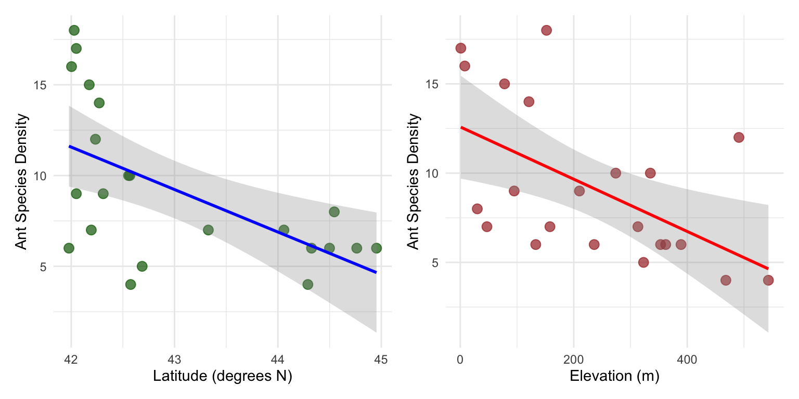
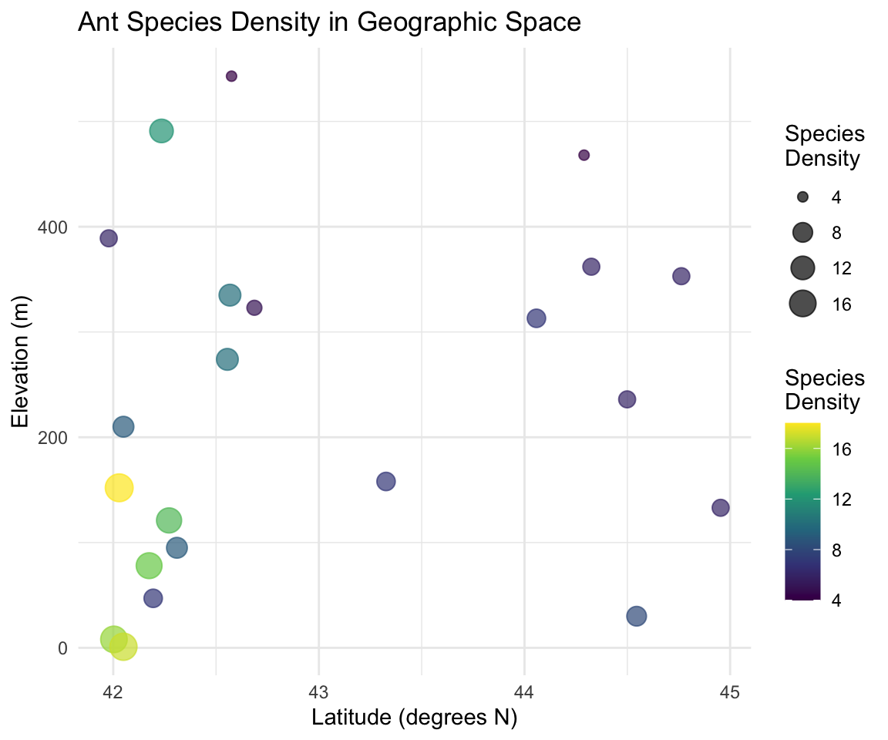
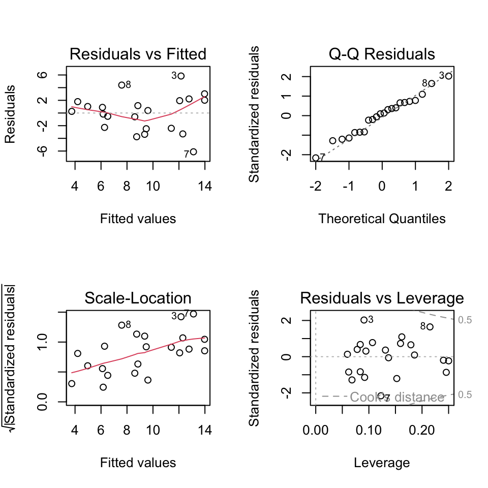
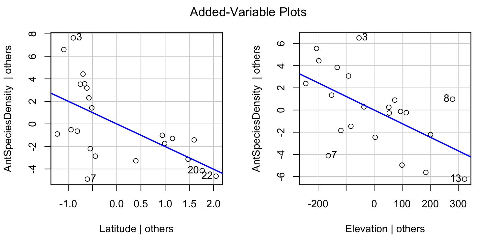
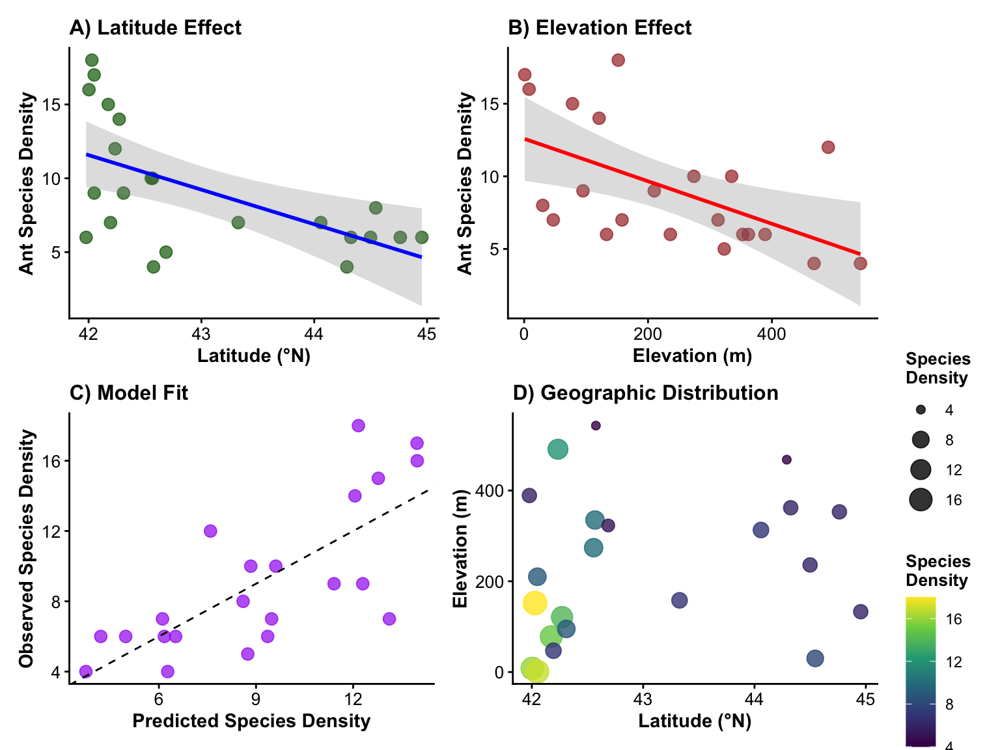

# Introduction to Multiple Linear Regression Analysis

## Background and Theory

Multiple linear regression extends simple linear regression to model the relationship between a continuous response variable (Y) and multiple predictor variables (X₁, X₂, ..., Xₚ). In this analysis, we will examine how ant species density varies with both latitude and elevation across sampling sites.

Gotelli, N. J. and A. M. Ellison. 2002a. Biogeography at a regional scale: determinants of ant species density in New England bogs and forest. Ecology 83: 1604–1609.

Gotelli, N. J. and A. M. Ellison. 2002b. Assembly rules for New England ant assemblages. Oikos 99: 591–599.

::: callout-note
## Ant Species Diversity Study Background

This dataset examines factors affecting ant species density:

1.  **Research Question**: How do latitude and elevation jointly affect ant species density?
2.  **Study Design**: Observational study across multiple geographic locations
3.  **Response Variable**: Number of ant species per sampling site (species density)
4.  **Predictor Variables**:
    - **Latitude**: Geographic latitude (degrees north)
    - **Elevation**: Elevation above sea level (meters)
5.  **Biological Expectations**:
    - **Latitude**: Species density may decrease with increasing latitude (latitudinal diversity gradient)
    - **Elevation**: Species density may decrease with increasing elevation (elevational diversity gradient)
:::

The multiple linear regression model is:

$$Y_i = \beta_0 + \beta_1 X_{i1} + \beta_2 X_{i2} + \varepsilon_i$$

Where:

- $Y_i$ is the response variable (ant species density for site i)
- $X_{i1}$ is the first predictor variable (latitude for site i)
- $X_{i2}$ is the second predictor variable (elevation for site i)
- $\beta_0$ is the intercept (expected species density when latitude = 0 and elevation = 0)
- $\beta_1$ is the partial slope for latitude (change in species density per unit change in latitude, holding elevation constant)
- $\beta_2$ is the partial slope for elevation (change in species density per unit change in elevation, holding latitude constant)
- $\varepsilon_i$ is the error term (random deviation from the regression hyperplane)

::: callout-important
## Key Concept: Partial Slopes

In multiple regression, each slope coefficient represents the **partial effect** of that predictor:

- $\beta_1$: Change in Y per unit change in X₁, **holding X₂ constant**
- $\beta_2$: Change in Y per unit change in X₂, **holding X₁ constant**

This allows us to isolate the effect of each predictor while controlling for the others.
:::

## Method of Least Squares

The regression hyperplane is fitted using the method of least squares, minimizing:

$$\sum_{i=1}^{n} (y_i - \hat{y}_i)^2$$

Where $\hat{y}_i = b_0 + b_1 x_{i1} + b_2 x_{i2}$ is the predicted value from the fitted model.

# Data Analysis

## Loading Libraries and Data


::: {.cell}

```{.r .cell-code}
# Load required libraries
library(lmtest)   # For Breusch-Pagan test
library(patchwork) # For combining plots
library(car)      # For regression diagnostics and VIF
library(skimr)    # For data summary
library(tidyverse) # For data manipulation and visualization

# Load the ant species density data
ant_df <- read_csv("data/AntSpeciesDensity.csv")

# Preview the data
head(ant_df)
```

::: {.cell-output .cell-output-stdout}

```
# A tibble: 6 × 3
  Latitude Elevation AntSpeciesDensity
     <dbl>     <dbl>             <dbl>
1     42.0       389                 6
2     42.0         8                16
3     42.0       152                18
4     42.0         1                17
5     42.0       210                 9
6     42.2        78                15
```


:::
:::


## Data Overview

Let's first examine the structure of our dataset:


::: {.cell}

```{.r .cell-code}
ant_df %>% 
  skim()
```

::: {.cell-output-display}

Table: Data summary

|                         |           |
|:------------------------|:----------|
|Name                     |Piped data |
|Number of rows           |22         |
|Number of columns        |3          |
|_______________________  |           |
|Column type frequency:   |           |
|numeric                  |3          |
|________________________ |           |
|Group variables          |None       |


**Variable type: numeric**

|skim_variable     | n_missing| complete_rate|   mean|     sd|    p0|    p25|    p50|    p75|   p100|hist  |
|:-----------------|---------:|-------------:|------:|------:|-----:|------:|------:|------:|------:|:-----|
|Latitude          |         0|             1|  43.02|   1.08| 41.98|  42.18|  42.56|  44.23|  44.95|▇▁▁▂▂ |
|Elevation         |         0|             1| 232.73| 163.07|  1.00| 101.50| 223.00| 348.50| 543.00|▇▇▅▅▃ |
|AntSpeciesDensity |         0|             1|   9.18|   4.31|  4.00|   6.00|   7.50|  11.50|  18.00|▇▆▃▂▃ |


:::
:::


::: callout-important
## Understanding the Ant Species Data

The dataset contains:

- **Sample size**: 22 sampling sites
- **Latitude**: Ranges from \~42.0 to 45.0 degrees north
- **Elevation**: Ranges from 1 to 543 meters above sea level
- **Ant Species Density**: Ranges from 4 to 18 species per site
- **Study region**: Appears to be from a temperate region (possibly northeastern North America)
:::

## Data Visualization

### Exploratory Scatterplots

Let's examine the relationships between variables:


::: {.cell}

```{.r .cell-code}
# Create individual scatterplots for each predictor
p1 <- ant_df %>%  
  ggplot(aes(x = Latitude, y = AntSpeciesDensity)) +
  geom_point(alpha = 0.7, size = 3, color = "darkgreen") +
  geom_smooth(method = "lm", se = TRUE, color = "blue", alpha = 0.3) +
  labs(
    x = "Latitude (degrees N)",
    y = "Ant Species Density"
  ) +
  theme_minimal()

p2 <- ant_df %>%  
  ggplot(aes(x = Elevation, y = AntSpeciesDensity)) +
  geom_point(alpha = 0.7, size = 3, color = "brown") +
  geom_smooth(method = "lm", se = TRUE, color = "red", alpha = 0.3) +
  labs(
    x = "Elevation (m)",
    y = "Ant Species Density"
  ) +
  theme_minimal()

# Combine plots
p1 + p2
```

::: {.cell-output-display}
{width=768}
:::
:::


### Correlation Matrix


::: {.cell}

```{.r .cell-code}
# Check correlations between all variables
cor(ant_df)
```

::: {.cell-output .cell-output-stdout}

```
                    Latitude  Elevation AntSpeciesDensity
Latitude           1.0000000  0.1787454        -0.5879407
Elevation          0.1787454  1.0000000        -0.5545244
AntSpeciesDensity -0.5879407 -0.5545244         1.0000000
```


:::
:::


::: callout-warning
## Checking for Multicollinearity

The correlation between latitude and elevation is important to examine:

- **High correlation (\|r\| \> 0.7)**: May indicate multicollinearity problems
- **Moderate correlation (0.3 \< \|r\| \< 0.7)**: Usually acceptable
- **Low correlation (\|r\| \< 0.3)**: No multicollinearity concerns

Multicollinearity can make parameter estimates unstable and difficult to interpret.
:::

### 3D Visualization Concept


::: {.cell}

```{.r .cell-code}
# Create a scatterplot showing both predictors with color-coded response
ant_df %>%
  ggplot(aes(x = Latitude, y = Elevation, color = AntSpeciesDensity, size = AntSpeciesDensity)) +
  geom_point(alpha = 0.7) +
  scale_color_viridis_c(name = "Species\nDensity") +
  scale_size_continuous(name = "Species\nDensity", range = c(2, 6)) +
  labs(
    x = "Latitude (degrees N)",
    y = "Elevation (m)",
    title = "Ant Species Density in Geographic Space"
  ) +
  theme_minimal()
```

::: {.cell-output-display}
{width=576}
:::
:::


::: callout-tip
## Interpreting the Geographic Plot

This plot shows the relationship between our two predictors and how species density varies across geographic space:

- **Color intensity**: Represents species density
- **Point size**: Also represents species density
- **Spatial patterns**: Help identify if there are geographic clusters or gradients
:::

# Multiple Linear Regression Analysis

## Fitting the Multiple Regression Model


::: {.cell}

```{.r .cell-code}
# Fit the multiple linear regression model
ant_model <- lm(AntSpeciesDensity ~ Latitude + Elevation, data = ant_df)

# Display the model summary
summary(ant_model)
```

::: {.cell-output .cell-output-stdout}

```

Call:
lm(formula = AntSpeciesDensity ~ Latitude + Elevation, data = ant_df)

Residuals:
    Min      1Q  Median      3Q     Max 
-6.1180 -2.3759  0.3218  1.9070  5.8369 

Coefficients:
            Estimate Std. Error t value Pr(>|t|)   
(Intercept) 98.49651   26.50701   3.716  0.00147 **
Latitude    -2.00981    0.61956  -3.244  0.00427 **
Elevation   -0.01226    0.00411  -2.983  0.00765 **
---
Signif. codes:  0 '***' 0.001 '**' 0.01 '*' 0.05 '.' 0.1 ' ' 1

Residual standard error: 3.022 on 19 degrees of freedom
Multiple R-squared:  0.5543,	Adjusted R-squared:  0.5074 
F-statistic: 11.82 on 2 and 19 DF,  p-value: 0.000463
```


:::
:::


## Line-by-Line Interpretation of Multiple Regression Output

Let's break down the multiple regression output:

1.  **Call**: Shows the model formula: `AntSpeciesDensity ~ Latitude + Elevation`

2.  **Residuals**: Summary statistics of residuals (observed - predicted values)

3.  **Coefficients**:

    - **(Intercept)**: Expected ant species density when Latitude = 0 and Elevation = 0
    - **Latitude**: Partial slope - change in species density per 1-degree increase in latitude, holding elevation constant
    - **Elevation**: Partial slope - change in species density per 1-meter increase in elevation, holding latitude constant
    - **Std. Error**: Standard error of each coefficient estimate
    - **t value**: t-statistic for testing if each coefficient ≠ 0
    - **Pr(\>\|t\|)**: p-value for each coefficient's significance test

4.  **Residual standard error**: Estimate of σ (standard deviation of residuals)

5.  **Multiple R-squared**: Proportion of total variance in species density explained by both predictors combined

6.  **Adjusted R-squared**: R² adjusted for the number of predictors (penalizes for additional variables)

7.  **F-statistic**: Tests the overall significance of the regression model (H₀: β₁ = β₂ = 0)

8.  **p-value**: Probability of observing this relationship by chance if no true relationships exist

::: callout-important
## Key Interpretations for Ecological Data

- **Intercept**: Often not biologically meaningful (no sites at 0° latitude, 0m elevation)
- **Latitude coefficient**: Expected to be negative if species diversity decreases northward
- **Elevation coefficient**: Expected to be negative if species diversity decreases with altitude
- **Adjusted R²**: More conservative measure of model fit than regular R²
- **Overall F-test**: Tests whether the model explains significantly more variance than a null model
:::

## ANOVA Table for Multiple Regression


::: {.cell}

```{.r .cell-code}
# Get ANOVA table for the multiple regression
anova(ant_model)
```

::: {.cell-output .cell-output-stdout}

```
Analysis of Variance Table

Response: AntSpeciesDensity
          Df  Sum Sq Mean Sq F value   Pr(>F)   
Latitude   1 134.562 134.562 14.7370 0.001107 **
Elevation  1  81.224  81.224  8.8955 0.007652 **
Residuals 19 173.487   9.131                    
---
Signif. codes:  0 '***' 0.001 '**' 0.01 '*' 0.05 '.' 0.1 ' ' 1
```


:::
:::


The ANOVA table shows:

- **Sequential sums of squares**: How much variance each predictor explains when added to the model
- **Latitude**: Variance explained by latitude alone
- **Elevation**: Additional variance explained by elevation after accounting for latitude
- **Residuals**: Unexplained variance remaining in the model

::: callout-note
## Understanding Sequential ANOVA

The order matters in this ANOVA table:

1.  **Latitude** row: Tests significance of latitude when entered first
2.  **Elevation** row: Tests significance of elevation when added after latitude
3.  This is **sequential** (Type I) sums of squares - results can change if you reorder predictors
:::

# Testing Multiple Regression Assumptions

Multiple regression has the same assumptions as simple regression, but with additional considerations for multiple predictors.

## Assumptions of Multiple Linear Regression

1.  **Linearity**: Linear relationships between Y and each X, and Y and the combination of X's
2.  **Independence**: Observations are independent\
3.  **Homoscedasticity**: Constant variance of residuals
4.  **Normality**: Residuals are normally distributed
5.  **No multicollinearity**: Predictor variables are not highly correlated with each other
6.  **Sufficient sample size**: Generally need at least 10-20 observations per predictor

### 1. Sample Size Check


::: {.cell}

```{.r .cell-code}
# Check sample size relative to number of predictors
n_obs <- nrow(ant_df)
n_predictors <- 2
obs_per_predictor <- n_obs / n_predictors

n_obs
```

::: {.cell-output .cell-output-stdout}

```
[1] 22
```


:::

```{.r .cell-code}
n_predictors  
```

::: {.cell-output .cell-output-stdout}

```
[1] 2
```


:::

```{.r .cell-code}
obs_per_predictor
```

::: {.cell-output .cell-output-stdout}

```
[1] 11
```


:::
:::


::: callout-warning
## Sample Size Considerations

With 22 observations and 2 predictors:

- **Ratio**: 11 observations per predictor
- **Adequate**: Generally acceptable (\>10 per predictor)
- **Limitation**: Relatively small sample size limits model complexity
- **Power**: May have limited power to detect small effects
:::

### 2. Multicollinearity Assessment


::: {.cell}

```{.r .cell-code}
# Calculate Variance Inflation Factors (VIF)
vif(ant_model)
```

::: {.cell-output .cell-output-stdout}

```
 Latitude Elevation 
 1.033004  1.033004 
```


:::
:::


::: callout-important
## Interpreting VIF Values

**Variance Inflation Factor (VIF) interpretation**:

- **VIF = 1**: No correlation with other predictors
- **VIF \< 5**: Generally acceptable multicollinearity
- **VIF 5-10**: Moderate multicollinearity (interpret coefficients carefully)
- **VIF \> 10**: Severe multicollinearity problem (consider removing predictors)

**Rule of thumb**: VIF \> 10 indicates problematic multicollinearity
:::

### 3. Linearity, Homoscedasticity, and Normality


::: {.cell}

```{.r .cell-code}
# Standard diagnostic plots for multiple regression
par(mfrow = c(2, 2))
plot(ant_model)
```

::: {.cell-output-display}
{width=480}
:::

```{.r .cell-code}
par(mfrow = c(1, 1))
```
:::


::: callout-important
## Diagnostic Plot Interpretation for Multiple Regression

1.  **Residuals vs Fitted**: Should show random scatter
    - Patterns suggest non-linearity or missing predictors
    - Funnel shapes indicate heteroscedasticity
2.  **Normal Q-Q**: Points should follow diagonal line
    - Systematic deviations suggest non-normal residuals
3.  **Scale-Location**: Should show horizontal trend
    - Increasing trend suggests heteroscedasticity
4.  **Residuals vs Leverage**: Identifies influential observations
    - Points beyond Cook's distance lines are highly influential
:::

### 4. Formal Tests of Assumptions

#### Test for Normality of Residuals


::: {.cell}

```{.r .cell-code}
# Shapiro-Wilk test for normality of residuals
shapiro.test(residuals(ant_model))
```

::: {.cell-output .cell-output-stdout}

```

	Shapiro-Wilk normality test

data:  residuals(ant_model)
W = 0.983, p-value = 0.9562
```


:::
:::


#### Test for Homoscedasticity


::: {.cell}

```{.r .cell-code}
# Breusch-Pagan test for homoscedasticity
bptest(ant_model)
```

::: {.cell-output .cell-output-stdout}

```

	studentized Breusch-Pagan test

data:  ant_model
BP = 5.9769, df = 2, p-value = 0.05037
```


:::
:::


#### Individual Predictor Linearity


::: {.cell}

```{.r .cell-code}
# Create added-variable plots (partial regression plots)
par(mfrow = c(1, 2))
avPlots(ant_model)
```

::: {.cell-output-display}
{width=768}
:::

```{.r .cell-code}
par(mfrow = c(1, 1))
```
:::


::: callout-note
## Added-Variable (Partial Regression) Plots

These plots show the relationship between:

- **Y-axis**: Response variable with effects of other predictors removed
- **X-axis**: Focal predictor with effects of other predictors removed
- **Purpose**: Visualize the partial relationship while controlling for other variables
- **Interpretation**: Slope of line equals the partial regression coefficient
:::

## Interpretation of Assumption Tests

Based on diagnostic plots and formal tests:

1.  **Linearity**: Added-variable plots show whether relationships are linear after controlling for other predictors
2.  **Multicollinearity**: VIF values indicate whether predictors are too highly correlated
3.  **Homoscedasticity**:
    - Scale-Location plot should show constant spread
    - Breusch-Pagan test: p \> 0.05 suggests homoscedasticity
4.  **Normality**:
    - Q-Q plot should show points on diagonal line
    - Shapiro-Wilk test: p \> 0.05 suggests normality
    - With small samples (n=22), this test is quite sensitive
5.  **Independence**: Cannot be tested statistically; depends on study design

::: callout-warning
## If Assumptions Are Violated

**For multiple regression problems**:

- **Multicollinearity**: Remove highly correlated predictors or use ridge regression
- **Non-linearity**: Add polynomial terms or transform variables
- **Heteroscedasticity**: Use weighted least squares or transform response variable
- **Non-normality**: Transform response variable or use robust regression
- **Small sample size**: Interpret results cautiously, consider model simplification
:::

# Results and Model Interpretation

## Model Equation

Based on our multiple regression analysis:


::: {.cell}

```{.r .cell-code}
# Extract coefficients
coef(ant_model)
```

::: {.cell-output .cell-output-stdout}

```
(Intercept)    Latitude   Elevation 
 98.4965080  -2.0098124  -0.0122576 
```


:::
:::


**Ant Species Density = Intercept + β₁(Latitude) + β₂(Elevation)**


::: {.cell}

```{.r .cell-code}
# Create the equation string
intercept <- coef(ant_model)[1]
lat_coef <- coef(ant_model)[2]  
elev_coef <- coef(ant_model)[3]

paste("Ant Species Density =", round(intercept, 2), "+", 
      round(lat_coef, 3), "× Latitude", "+", 
      round(elev_coef, 4), "× Elevation")
```

::: {.cell-output .cell-output-stdout}

```
[1] "Ant Species Density = 98.5 + -2.01 × Latitude + -0.0123 × Elevation"
```


:::
:::


# Model Comparison and Variable Importance

## Comparing Nested Models


::: {.cell}

```{.r .cell-code}
# Fit reduced models to test variable importance
model_lat_only <- lm(AntSpeciesDensity ~ Latitude, data = ant_df)
model_elev_only <- lm(AntSpeciesDensity ~ Elevation, data = ant_df)

# Compare model summaries
summary(model_lat_only)$r.squared
```

::: {.cell-output .cell-output-stdout}

```
[1] 0.3456743
```


:::

```{.r .cell-code}
summary(model_elev_only)$r.squared
```

::: {.cell-output .cell-output-stdout}

```
[1] 0.3074973
```


:::

```{.r .cell-code}
summary(ant_model)$r.squared
```

::: {.cell-output .cell-output-stdout}

```
[1] 0.5543306
```


:::
:::


::: {.cell}

```{.r .cell-code}
# Test significance of adding elevation to latitude-only model
anova(model_lat_only, ant_model)
```

::: {.cell-output .cell-output-stdout}

```
Analysis of Variance Table

Model 1: AntSpeciesDensity ~ Latitude
Model 2: AntSpeciesDensity ~ Latitude + Elevation
  Res.Df    RSS Df Sum of Sq      F   Pr(>F)   
1     20 254.71                                
2     19 173.49  1    81.224 8.8955 0.007652 **
---
Signif. codes:  0 '***' 0.001 '**' 0.01 '*' 0.05 '.' 0.1 ' ' 1
```


:::
:::


::: {.cell}

```{.r .cell-code}
# Test significance of adding latitude to elevation-only model  
anova(model_elev_only, ant_model)
```

::: {.cell-output .cell-output-stdout}

```
Analysis of Variance Table

Model 1: AntSpeciesDensity ~ Elevation
Model 2: AntSpeciesDensity ~ Latitude + Elevation
  Res.Df    RSS Df Sum of Sq      F   Pr(>F)   
1     20 269.57                                
2     19 173.49  1    96.085 10.523 0.004272 **
---
Signif. codes:  0 '***' 0.001 '**' 0.01 '*' 0.05 '.' 0.1 ' ' 1
```


:::
:::


::: callout-important
## Model Comparison Interpretation

**ANOVA F-tests compare nested models**:

- **Null hypothesis**: Reduced model fits as well as full model
- **Alternative hypothesis**: Full model fits significantly better
- **Interpretation**: p \< 0.05 suggests the additional variable(s) significantly improve model fit

**R² comparison**: - Shows how much additional variance each predictor explains - Cannot use R² alone to compare models (always increases with more predictors)
:::

# Methods Section (for Publication)

**Statistical Analysis**: We used multiple linear regression to examine the relationship between ant species density and two environmental predictors: latitude and elevation. Prior to analysis, we examined the data for outliers and tested model assumptions including linearity (using added-variable plots), independence, homoscedasticity (Breusch-Pagan test), normality of residuals (Shapiro-Wilk test), and multicollinearity (variance inflation factors). We assessed the significance of individual predictors using t-tests and the overall model using F-tests. Model comparison was conducted using ANOVA to test the significance of each predictor's contribution. Statistical significance was set at α = 0.05. All analyses were conducted in R (version X.X.X).

# Results Section (for Publication)

The multiple regression model significantly explained variation in ant species density across sampling sites (F(2,19) = \[F-value\], p = \[p-value\], R² = \[R² value\], adjusted R² = \[adj R² value\]). \[Interpret individual coefficients based on significance\]. Latitude had a \[significant/non-significant\] partial effect on species density (β = \[coefficient\], t = \[t-value\], p = \[p-value\]), with species density \[increasing/decreasing\] by \[absolute coefficient\] species per degree increase in latitude when elevation was held constant. Elevation had a \[significant/non-significant\] partial effect (β = \[coefficient\], t = \[t-value\], p = \[p-value\]), with species density \[increasing/decreasing\] by \[absolute coefficient\] species per meter increase in elevation when latitude was held constant. Model assumptions were adequately met \[or describe any violations and how they were addressed\].

# Publication Quality Figure


::: {.cell}

```{.r .cell-code}
# Create a comprehensive figure showing the multiple regression results

# Panel A: Latitude relationship (partial effect)
p1 <- ant_df %>%
  ggplot(aes(x = Latitude, y = AntSpeciesDensity)) +
  geom_point(size = 3, alpha = 0.7, color = "darkgreen") +
  geom_smooth(method = "lm", se = TRUE, color = "blue", alpha = 0.3) +
  labs(
    x = "Latitude (°N)",
    y = "Ant Species Density",
    title = "A) Latitude Effect"
  ) +
  theme_classic() +
  theme(
    axis.title = element_text(size = 11, face = "bold"),
    axis.text = element_text(size = 10),
    plot.title = element_text(size = 12, face = "bold")
  )

# Panel B: Elevation relationship (partial effect)  
p2 <- ant_df %>%
  ggplot(aes(x = Elevation, y = AntSpeciesDensity)) +
  geom_point(size = 3, alpha = 0.7, color = "brown") +
  geom_smooth(method = "lm", se = TRUE, color = "red", alpha = 0.3) +
  labs(
    x = "Elevation (m)",
    y = "Ant Species Density", 
    title = "B) Elevation Effect"
  ) +
  theme_classic() +
  theme(
    axis.title = element_text(size = 11, face = "bold"),
    axis.text = element_text(size = 10),
    plot.title = element_text(size = 12, face = "bold")
  )

# Panel C: Model fit (observed vs predicted)
ant_df$predicted <- fitted(ant_model)
p3 <- ant_df %>%
  ggplot(aes(x = predicted, y = AntSpeciesDensity)) +
  geom_point(size = 3, alpha = 0.7, color = "purple") +
  geom_abline(slope = 1, intercept = 0, linetype = "dashed", color = "black") +
  labs(
    x = "Predicted Species Density",
    y = "Observed Species Density",
    title = "C) Model Fit"
  ) +
  theme_classic() +
  theme(
    axis.title = element_text(size = 11, face = "bold"),
    axis.text = element_text(size = 10),
    plot.title = element_text(size = 12, face = "bold")
  )

# Panel D: Geographic distribution
p4 <- ant_df %>%
  ggplot(aes(x = Latitude, y = Elevation, color = AntSpeciesDensity, size = AntSpeciesDensity)) +
  geom_point(alpha = 0.8) +
  scale_color_viridis_c(name = "Species\nDensity") +
  scale_size_continuous(name = "Species\nDensity", range = c(2, 6)) +
  labs(
    x = "Latitude (°N)",
    y = "Elevation (m)",
    title = "D) Geographic Distribution"
  ) +
  theme_classic() +
  theme(
    axis.title = element_text(size = 11, face = "bold"),
    axis.text = element_text(size = 10),
    plot.title = element_text(size = 12, face = "bold"),
    legend.title = element_text(size = 10, face = "bold")
  )

# Combine all panels
combined_plot <- (p1 + p2) / (p3 + p4)

combined_plot 
```

::: {.cell-output-display}
{width=768}
:::
:::
