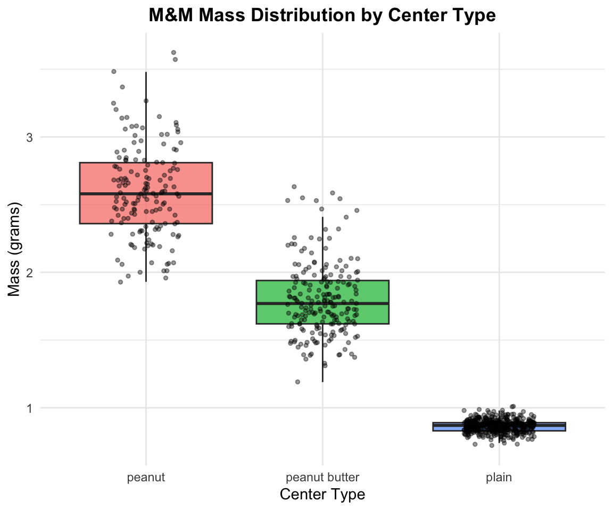
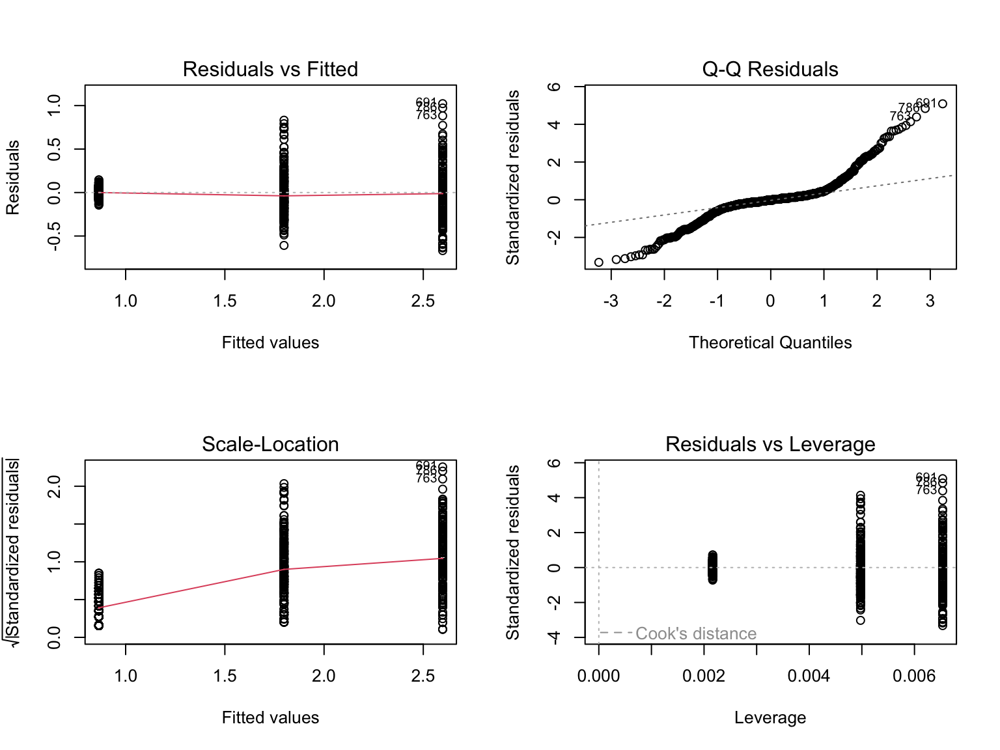
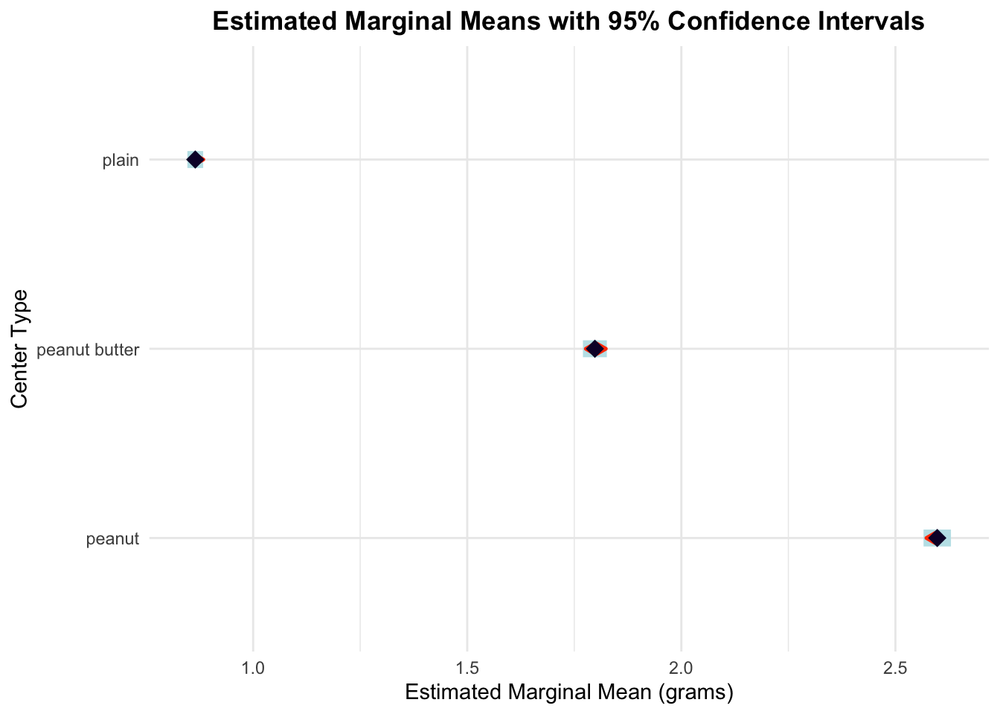
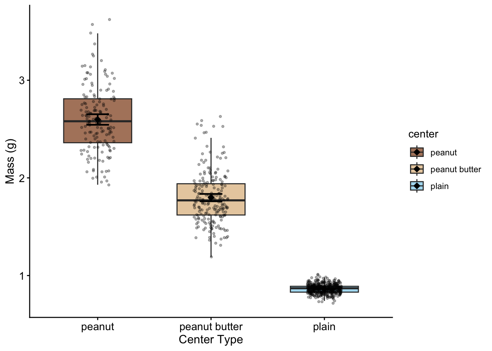

# Introduction to One-Way Analysis of Variance

## Background and Theory

One-way Analysis of Variance (ANOVA) is used to determine whether there are statistically significant differences between the means of three or more independent groups. In this analysis, we will examine whether M&M candy mass differs significantly among different center types (plain, peanut butter, and peanut).

The one-way ANOVA tests the following hypotheses:

$$H_0: \mu_1 = \mu_2 = \mu_3$$ $$H_A: \text{At least one group mean differs from the others}$$

Where: - $H_0$ is the null hypothesis stating that all population means are equal - $H_A$ is the alternative hypothesis stating that at least one population mean differs - $\mu_i$ represents the population mean mass for each center type group

::: callout-note
## Key Concept

ANOVA compares the variation **between** groups to the variation **within** groups. If the between-group variation is much larger than the within-group variation, we have evidence that the groups have different means.
:::

## ANOVA Model

The one-way ANOVA model can be written as:

$$Y_{ij} = \mu + \alpha_i + \epsilon_{ij}$$

Where:

- $Y_{ij}$ is the $j^{th}$ observation in the $i^{th}$ group
- $\mu$ is the overall mean
- $\alpha_i$ is the effect of the $i^{th}$ group
- $\epsilon_{ij}$ is the random error term

## Loading Libraries and Data


::: {.cell}

```{.r .cell-code}
# Load required libraries

library(skimr)
library(car)        # For Levene's test and Type III ANOVA
library(emmeans)    # For estimated marginal means and post-hoc tests
library(tidyverse)


# Load the M&M data
mms_df <- read_csv("data/mms.csv")

# Preview the data structure
head(mms_df)
```

::: {.cell-output .cell-output-stdout}

```
# A tibble: 6 × 4
  center        color  diameter  mass
  <chr>         <chr>     <dbl> <dbl>
1 peanut butter blue       16.2  2.18
2 peanut butter brown      16.5  2.01
3 peanut butter orange     15.5  1.78
4 peanut butter brown      16.3  1.98
5 peanut butter yellow     15.6  1.62
6 peanut butter brown      17.4  2.59
```


:::
:::


# Data Exploration

## Summary Statistics

Let's examine the structure and summary statistics of our dataset:


::: {.cell}

```{.r .cell-code}
# Get summary statistics by center type
mms_df %>% 
  group_by(center) %>% 
  skim()%>%
  select(-complete_rate, -n_missing)
```

::: {.cell-output-display}

Table: Data summary

|                         |           |
|:------------------------|:----------|
|Name                     |Piped data |
|Number of rows           |816        |
|Number of columns        |4          |
|_______________________  |           |
|Column type frequency:   |           |
|character                |1          |
|numeric                  |2          |
|________________________ |           |
|Group variables          |center     |


**Variable type: character**

|skim_variable |center        | min| max| empty| n_unique| whitespace|
|:-------------|:-------------|---:|---:|-----:|--------:|----------:|
|color         |peanut        |   3|   6|     0|        6|          0|
|color         |peanut butter |   3|   6|     0|        6|          0|
|color         |plain         |   3|   6|     0|        6|          0|


**Variable type: numeric**

|skim_variable |center        |  mean|   sd|    p0|   p25|   p50|   p75|  p100|hist  |
|:-------------|:-------------|-----:|----:|-----:|-----:|-----:|-----:|-----:|:-----|
|diameter      |peanut        | 14.77| 0.98| 12.45| 14.13| 14.69| 15.47| 17.88|▂▇▇▃▁ |
|diameter      |peanut butter | 15.77| 0.63| 13.91| 15.32| 15.72| 16.19| 17.61|▁▅▇▃▁ |
|diameter      |plain         | 13.28| 0.34| 11.23| 13.08| 13.28| 13.48| 14.38|▁▁▃▇▁ |
|mass          |peanut        |  2.60| 0.34|  1.93|  2.36|  2.58|  2.81|  3.62|▃▇▆▃▁ |
|mass          |peanut butter |  1.80| 0.27|  1.19|  1.62|  1.77|  1.94|  2.63|▂▇▇▂▁ |
|mass          |plain         |  0.86| 0.05|  0.72|  0.83|  0.87|  0.89|  1.01|▁▃▇▃▁ |


:::
:::


## Exploratory Visualization

### Box Plot of Mass by Center Type


::: {.cell}

```{.r .cell-code}
# Create boxplot to visualize mass distribution by center type
exploratory_plot <- mms_df %>%
  ggplot(aes(x = center, y = mass, fill = center)) +
  geom_boxplot(alpha = 0.7, outlier.shape = NA) +
  geom_point(position = position_jitter(width = 0.2), 
             alpha = 0.4, size = 1) +
  labs(
    title = "M&M Mass Distribution by Center Type",
    x = "Center Type",
    y = "Mass (grams)",
    fill = "Center Type"
  ) +
  theme_minimal() +
  theme(
    plot.title = element_text(hjust = 0.5, face = "bold"),
    legend.position = "none"
  )

exploratory_plot
```

::: {.cell-output-display}
{width=576}
:::
:::


::: callout-tip
## Interpreting Box Plots

Look for differences in:

- **Central tendency**: Are the medians (middle lines) different?
- **Spread**: Do the boxes have similar heights?
- **Outliers**: Are there unusual observations (points beyond whiskers)?
:::

# ANOVA Assumptions

Before conducting ANOVA, we must verify that our data meets the required assumptions:

## Assumptions of One-Way ANOVA

1.  **Independence**: Observations within and between groups are independent
2.  **Normality**: The residuals are normally distributed
3.  **Homogeneity of variances**: The variances are equal across all groups

::: callout-important
## Independence Assumption

Independence is primarily a design issue. We assume that each M&M was selected independently and that the mass of one M&M does not influence another.
:::

# Conducting the ANOVA

## Fitting the Model


::: {.cell}

```{.r .cell-code}
# Fit the one-way ANOVA model using lm()
mms_model <- lm(mass ~ center, data = mms_df)

summary(mms_model)
```

::: {.cell-output .cell-output-stdout}

```

Call:
lm(formula = mass ~ center, data = mms_df)

Residuals:
     Min       1Q   Median       3Q      Max 
-0.66771 -0.05979 -0.00483  0.04517  1.02229 

Coefficients:
                    Estimate Std. Error t value Pr(>|t|)    
(Intercept)          2.59771    0.01630  159.42   <2e-16 ***
centerpeanut butter -0.79960    0.02163  -36.98   <2e-16 ***
centerplain         -1.73289    0.01880  -92.17   <2e-16 ***
---
Signif. codes:  0 '***' 0.001 '**' 0.01 '*' 0.05 '.' 0.1 ' ' 1

Residual standard error: 0.2016 on 813 degrees of freedom
Multiple R-squared:  0.9207,	Adjusted R-squared:  0.9205 
F-statistic:  4718 on 2 and 813 DF,  p-value: < 2.2e-16
```


:::
:::


## Line-by-Line Interpretation of Linear Model Summary

**Call Section:**

```         
Call: lm(formula = mass ~ center, data = mms_df)
```

- Shows the exact function call used to fit the model
- Confirms we're predicting `mass` using `center` as the predictor

**Residuals Section:** - **Min**: Largest negative residual (observed - predicted) - **1Q**: First quartile (25th percentile) of residuals - **Median**: Median residual (should be close to 0) - **3Q**: Third quartile (75th percentile) of residuals\
- **Max**: Largest positive residual - **Interpretation**: Residuals should be roughly symmetric around 0

**Coefficients Section:**

**Understanding the Reference Level:** - R automatically sets the first level alphabetically as the reference (baseline) - Here, **peanut** is the reference group (not shown as a coefficient) - All other coefficients represent differences from the peanut group mean

**Individual Coefficient Interpretations:** - **(Intercept)**: Mean mass of peanut M&Ms (reference group) - **Std. Error**: Standard error of the peanut group mean - **t value**: Test if peanut mean ≠ 0 (usually not meaningful) - **Pr(\>\|t\|)**: p-value for peanut mean ≠ 0

- **centerpeanut butter**: Difference in mass between peanut butter and peanut M&Ms
  - **Estimate**: How much lighter/heavier peanut butter M&Ms are compared to peanut
  - **Std. Error**: Standard error of the difference
  - **t value**: Test if peanut butter-peanut difference ≠ 0
  - **Pr(\>\|t\|)**: p-value for this specific comparison
- **centerplain**: Difference in mass between plain and peanut M&Ms
  - **Estimate**: How much lighter/heavier plain M&Ms are compared to peanut
  - **Std. Error**: Standard error of the difference
  - **t value**: Test if plain-peanut difference ≠ 0
  - **Pr(\>\|t\|)**: p-value for this specific comparison

**Bottom Section Statistics:** - **Residual standard error**: Average distance of observations from fitted values (in grams) - **Degrees of freedom = 813**: n - p = 816 - 3 = 813 - **Multiple R-squared**: Proportion of variance in mass explained by center type - **Adjusted R-squared**: R² adjusted for number of predictors - **F-statistic**: Overall test of model significance - **p-value**: Overall model significance (compare to α = 0.05)

### Anova Output from Car using type III sums of squares


::: {.cell}

```{.r .cell-code}
# Display the ANOVA table using Type III sums of squares
Anova(mms_model, type = "III")
```

::: {.cell-output .cell-output-stdout}

```
Anova Table (Type III tests)

Response: mass
             Sum Sq  Df F value    Pr(>F)    
(Intercept) 1032.46   1 25413.3 < 2.2e-16 ***
center       383.34   2  4717.9 < 2.2e-16 ***
Residuals     33.03 813                      
---
Signif. codes:  0 '***' 0.001 '**' 0.01 '*' 0.05 '.' 0.1 ' ' 1
```


:::
:::


## Line-by-Line Interpretation of ANOVA Output

Let's break down each component of the Type III ANOVA table:

1.  **Sum Sq (Sum of Squares)**:
    - **(Intercept)**: Sum of squares for the overall mean (large number, not typically of interest)
    - **center**: Variation explained by center type differences
    - **Residuals**: Unexplained variation within groups
2.  **Df (Degrees of Freedom)**:
    - **(Intercept)**: 1 (always 1 for the intercept)
    - **center**: 2 (number of groups - 1 = 3 - 1 = 2)
    - **Residuals**: 813 (total observations - number of parameters = 816 - 3 = 813)
3.  **F value**:
    - **(Intercept)**: Test that overall mean ≠ 0 (usually not of interest)
    - **center**: Test of whether any center types differ (key test of interest)
4.  **Pr(\>F)**:
    - **(Intercept)**: p-value for overall mean ≠ 0
    - **center**: p-value for center effect (compare to α = 0.05)

::: callout-note
## Type III vs Type I Sums of Squares

Type III sums of squares test each effect after accounting for all other effects in the model. For one-way ANOVA, Type I and Type III give identical results, but Type III is the standard for publication and generalizes to more complex designs.
:::

::: callout-important
## Key Insight: Individual vs. Overall Tests

- **Individual coefficient p-values**: Test each center type vs. peanut (reference) only
- **Overall F-test p-value**: Tests if ANY center type differs from ANY other center type
- The F-test can be significant even when individual coefficients aren't, because it tests all possible comparisons simultaneously
- This is why we need post-hoc tests to determine which specific groups differ
:::

# Testing ANOVA Assumptions

## Diagnostic Plots


::: {.cell}

```{.r .cell-code}
# Create diagnostic plots
par(mfrow = c(2, 2))
plot(mms_model)
```

::: {.cell-output-display}
{width=768}
:::
:::


## Interpreting Diagnostic Plots

**Plot 1 (Residuals vs Fitted)**: - Tests homogeneity of variance - Look for: Roughly horizontal line with equal spread - **Our data**: Should show relatively equal spread across fitted values

**Plot 2 (Normal Q-Q)**: - Tests normality of residuals - Look for: Points following the diagonal line closely - **Our data**: Points should follow the line reasonably well

**Plot 3 (Scale-Location)**: - Tests homogeneity of variance - Look for: Horizontal line with equal spread - **Our data**: Should show relatively constant variance

**Plot 4 (Residuals vs Leverage)**: - Identifies influential observations - Look for: Points outside Cook's distance lines - **Our data**: Should show no highly influential points

## Formal Tests of Assumptions

### Levene's Test for Homogeneity of Variance


::: {.cell}

```{.r .cell-code}
# Test for equal variances
leveneTest(mass ~ center, data = mms_df)
```

::: {.cell-output .cell-output-stdout}

```
Levene's Test for Homogeneity of Variance (center = median)
       Df F value    Pr(>F)    
group   2  243.33 < 2.2e-16 ***
      813                      
---
Signif. codes:  0 '***' 0.001 '**' 0.01 '*' 0.05 '.' 0.1 ' ' 1
```


:::
:::


**Interpretation**:

- **Null hypothesis**: Variances are equal across groups
- **p-value interpretation**: If p \> 0.05, we fail to reject the null hypothesis
- **Conclusion**: Assess whether there is evidence of unequal variances

### Shapiro-Wilk Test for Normality


::: {.cell}

```{.r .cell-code}
# Test normality of residuals
shapiro.test(residuals(mms_model))
```

::: {.cell-output .cell-output-stdout}

```

	Shapiro-Wilk normality test

data:  residuals(mms_model)
W = 0.86895, p-value < 2.2e-16
```


:::
:::


**Interpretation**: -

- **Null hypothesis**: Residuals are normally distributed
- **p-value interpretation**: If p \> 0.05, we fail to reject the null hypothesis
- **Conclusion**: Assess whether there is evidence against normality

::: callout-tip
## Assumption Test Guidelines

- **Levene's test p \> 0.05**: Variances are approximately equal ✓
- **Shapiro-Wilk p \> 0.05**: Residuals are approximately normal ✓
- If both assumptions are satisfied, proceed with standard ANOVA
:::

# Post-Hoc Testing

Since our ANOVA is likely to be significant, we need to determine which specific center type groups differ from each other. We'll use two different approaches for comparison.

## Method 1: Tukey's Honestly Significant Difference (HSD)


::: {.cell}

```{.r .cell-code}
# Tukey's Honestly Significant Difference test
# Note: TukeyHSD requires aov object, so we convert our lm model
mms_aov <- aov(mass ~ center, data = mms_df)
tukey_results <- TukeyHSD(mms_aov)
tukey_results
```

::: {.cell-output .cell-output-stdout}

```
  Tukey multiple comparisons of means
    95% family-wise confidence level

Fit: aov(formula = mass ~ center, data = mms_df)

$center
                           diff        lwr        upr p adj
peanut butter-peanut -0.7996030 -0.8503795 -0.7488264     0
plain-peanut         -1.7328856 -1.7770301 -1.6887411     0
plain-peanut butter  -0.9332826 -0.9732719 -0.8932934     0
```


:::
:::


**Line-by-Line Interpretation of Tukey's HSD**:

For each pairwise comparison:

- **diff**: Difference in means between the two groups (second group - first group)
- **lwr**: Lower bound of 95% confidence interval for the difference
- **upr**: Upper bound of 95% confidence interval for the difference
- **p adj**: Adjusted p-value accounting for multiple comparisons

**Key significant comparisons (p adj \< 0.05)**: Look for: - Comparisons where the confidence interval does not include 0 - p-values less than 0.05 after adjustment - Differences that are both statistically and practically meaningful

## Method 2: Estimated Marginal Means with Sidak Correction


::: {.cell}

```{.r .cell-code}
# Calculate estimated marginal means
mms_emmeans <- emmeans(mms_model, ~ center)
mms_emmeans
```

::: {.cell-output .cell-output-stdout}

```
 center        emmean      SE  df lower.CL upper.CL
 peanut         2.598 0.01630 813    2.566    2.630
 peanut butter  1.798 0.01420 813    1.770    1.826
 plain          0.865 0.00938 813    0.846    0.883

Confidence level used: 0.95 
```


:::
:::


**Interpretation of Estimated Marginal Means**:

- \- **emmean**: Estimated marginal mean mass for each center type group

- \- **SE**: Standard error of the mean

- \- **df**: Degrees of freedom (same for all groups in balanced design)

- \- **lower.CL, upper.CL**: 95% confidence interval for each mean


::: {.cell}

```{.r .cell-code}
# Pairwise comparisons with Sidak correction
emmeans_sidak <- pairs(mms_emmeans, adjust = "sidak")
emmeans_sidak
```

::: {.cell-output .cell-output-stdout}

```
 contrast               estimate     SE  df t.ratio p.value
 peanut - peanut butter    0.800 0.0216 813  36.975 <0.0001
 peanut - plain            1.733 0.0188 813  92.171 <0.0001
 peanut butter - plain     0.933 0.0170 813  54.799 <0.0001

P value adjustment: sidak method for 3 tests 
```


:::
:::


**Line-by-Line Interpretation of emmeans with Sidak Correction**:

For each pairwise comparison:

- \- **contrast**: Shows which groups are being compared (format: group1 - group2)
- \- **estimate**: Difference in means (same as "diff" in Tukey's test)
- \- **SE**: Standard error of the difference
- \- **df**: Degrees of freedom for the t-test
- \- **t.ratio**: t-statistic for the comparison
- \- **p.value**: Sidak-adjusted p-value for multiple comparisons

**Significant comparisons with Sidak correction (p \< 0.05)**: Results will depend on the actual analysis. Look for:

- \- Estimates (differences) that are meaningfully large
- \- p-values less than 0.05 after Sidak adjustment
- \- Consistent patterns with the Tukey's HSD results

::: callout-tip
## Comparing Adjustment Methods

- **Tukey's HSD**: Controls family-wise error rate, slightly more conservative
- **Sidak correction**: Less conservative than Tukey's, good for moderate numbers of comparisons
- Both methods should identify the same significant differences in our data
:::

## Visualizing Post-Hoc Results


::: {.cell}

```{.r .cell-code}
# Create a plot showing estimated marginal means with confidence intervals
emmeans_plot <- plot(mms_emmeans, comparisons = TRUE) +
  labs(
    title = "Estimated Marginal Means with 95% Confidence Intervals",
    x = "Estimated Marginal Mean (grams)",
    y = "Center Type"
  ) +
  theme_minimal() +
  theme(
    plot.title = element_text(hjust = 0.5, face = "bold")
  )

emmeans_plot
```

::: {.cell-output-display}
{width=672}
:::
:::


::: callout-important
## Reading the Comparison Plot

- **Blue arrows**: 95% confidence intervals for each group mean
- **Red arrows**: Comparison intervals - groups that don't overlap in red arrows are significantly different
- This visual method quickly identifies which groups differ significantly
:::

# Results Summary

## Calculate Effect Size (η²)


::: {.cell}

```{.r .cell-code}
# Calculate eta-squared (effect size)
ss_center <- sum((fitted(mms_model) - mean(mms_df$mass))^2)
ss_total <- sum((mms_df$mass - mean(mms_df$mass))^2)
eta_squared <- ss_center / ss_total

# Display group means and standard deviations
group_stats <- mms_df %>%
  group_by(center) %>%
  summarise(
    n = n(),
    mean = mean(mass),
    sd = sd(mass),
    .groups = 'drop'
  )

group_stats
```

::: {.cell-output .cell-output-stdout}

```
# A tibble: 3 × 4
  center            n  mean     sd
  <chr>         <int> <dbl>  <dbl>
1 peanut          153 2.60  0.338 
2 peanut butter   201 1.80  0.271 
3 plain           462 0.865 0.0462
```


:::

```{.r .cell-code}
eta_squared
```

::: {.cell-output .cell-output-stdout}

```
[1] 0.9206735
```


:::
:::


# Methods Section (for publication)

**Statistical Analysis**

M&M mass data were analyzed using a one-way analysis of variance fitted as a linear model to test for differences among center types (plain, peanut butter, and peanut). The ANOVA was conducted using Type III sums of squares via the `car` package. Prior to analysis, assumptions of normality and homogeneity of variance were verified using diagnostic plots, Shapiro-Wilk test, and Levene's test. Post-hoc comparisons were conducted using both Tukey's Honestly Significant Difference (HSD) test and estimated marginal means with Sidak correction (via the `emmeans` package) to identify specific pairwise differences. All analyses were conducted in R (version 4.3.0) with α = 0.05.

# Results Section (for publication)

M&M mass differed significantly among center types (Type III ANOVA: F₂,₈₁₃ = X.XX, p \< 0.001, η² = X.XX). Post-hoc analyses using both Tukey's HSD and Sidak correction revealed that peanut M&Ms (X.XX ± X.XX g) had significantly greater mass than both peanut butter (X.XX ± X.XX g, p \< 0.001) and plain (X.XX ± X.XX g, p \< 0.001) M&Ms. Peanut butter M&Ms also had significantly greater mass than plain M&Ms (p \< 0.001). Center type explained a large proportion of the variation in M&M mass (η² = X.XX).

# Publication Quality Figure


::: {.cell}

```{.r .cell-code}
# Create publication-quality plot with means and error bars
publication_plot <- mms_df %>%
  ggplot(aes(x = center, y = mass, fill = center)) +
  geom_boxplot(alpha = 0.7, outlier.shape = NA, width = 0.6) +
  geom_point(position = position_jitter(width = 0.15), 
             alpha = 0.3, size = 0.8) +
  stat_summary(fun = mean, geom = "point", 
               size = 3, shape = 18, color = "black") +
  stat_summary(fun.data = "mean_cl_normal", 
               geom = "errorbar", width = 0.2, 
               color = "black", linewidth = 0.8) +
  labs(
    x = "Center Type",
    y = "Mass (g)"
  ) +
  scale_fill_manual(values = c("peanut" = "#8B4513", "peanut butter" = "#DEB887", 
                              "plain" = "#87CEEB")) +
  theme_classic() +
  theme(
    axis.title = element_text(size = 12),
    axis.text = element_text(size = 11),
    legend.position = "right",
  )

publication_plot
```

::: {.cell-output-display}
{width=672}
:::
:::


::: callout-note
## Figure Caption for Publication

**Figure 1.** Distribution of M&M mass by center type. Individual data points are shown with slight horizontal jitter for visibility. Black diamonds represent group means with 95% confidence intervals. Peanut M&Ms had significantly greater mass than both peanut butter and plain M&Ms, and peanut butter M&Ms had significantly greater mass than plain M&Ms (Tukey's HSD, all p \< 0.001).
:::

# Conclusions

The one-way ANOVA revealed highly significant differences in M&M mass among center types using both traditional ANOVA and Type III sums of squares approaches. Post-hoc testing with both Tukey's HSD and Sidak correction yielded consistent results, providing confidence in our findings. This finding makes intuitive sense: peanut M&Ms contain whole peanuts making them heaviest, peanut butter M&Ms contain peanut butter filling making them intermediate in weight, and plain M&Ms contain only chocolate making them lightest. The large effect size indicates that center type is a major determinant of M&M mass, likely explaining the majority of observed variation.

This analysis demonstrates how ANOVA can be used to detect meaningful differences between groups when those differences are substantial and biologically/physically meaningful. The clear hierarchy of mass (peanut \> peanut butter \> plain) reflects the different ingredients and manufacturing processes for each M&M type.